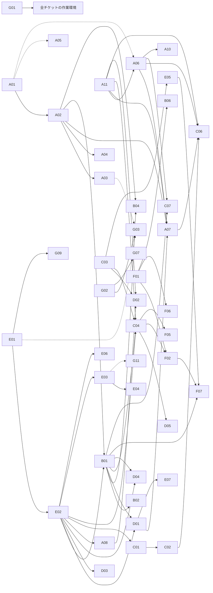

# Tsuzuri 機能実装チケット

Tsuzuri 0.1 の次に実装すべき言語機能・標準ライブラリ・ツールを、1 機能 = 1 ファイルのチケットにまとめています。
**全チケット共通の前提・コードマップ・テスト方法・設計決定は [GUIDE.md](GUIDE.md) にあります。着手前に必ず読んでください。**

- 調査時点: コミット `19d8cdd`（2026-09-23）
- 状態: `todo`（未着手）／`doing`（実装中）／`done`（完了）／`blocked`（依存待ち・要判断）
- 優先度: **P0** 他機能の前提・早期に必要、**P1** 標準ライブラリと実用化に必要、**P2** 中期、**P3** 長期
- 規模: **S** 1〜2 日、**M** 3〜5 日、**L** 1〜3 週、**XL** 1 か月以上（分割前提）
- 「依存」は着手前に完了が必要なチケット。括弧付きは一部の機能だけが依存する弱い依存です。

## 一覧

### A. 型システム

| ID | チケット | 優先 | 規模 | 依存 | 状態 |
|---|---|---|---|---|---|
| A01 | [型適用とジェネリックなレコード](A01-generic-records.md) | P0 | L | – | todo |
| A02 | [判別共用体（union）と列挙型](A02-union-types.md) | P0 | XL | A01 | todo |
| A03 | [match の網羅性・到達不能節の検査](A03-match-exhaustiveness.md) | P0 | M | A02 | todo |
| A04 | [再帰的なヒープ型（木・AST）](A04-recursive-types.md) | P1 | L | A02 | todo |
| A05 | [型別名](A05-type-aliases.md) | P1 | S | (A01) | todo |
| A06 | [型クラスの拡張（条件付きインスタンス・スーパークラス・デフォルトメソッド）](A06-typeclass-extensions.md) | P1 | L | A11, (A01) | todo |
| A07 | [deriving（Eq／Ord／Display／Hash／Default の自動導出）](A07-deriving.md) | P1 | M | A11, A06, A02, D01 | todo |
| A08 | [char（Unicode スカラー）型](A08-char-type.md) | P1 | M | E02, (B01) | todo |
| A09 | [名前付きライフタイムと借用フィールド](A09-named-lifetimes.md) | P2 | XL | – | todo |
| A10 | [高階型（HKT）](A10-higher-kinded-types.md) | P3 | XL | A01, A06 | todo |
| A11 | [比較演算の非消費化（Eq／Ord の借用シグネチャ）](A11-borrowed-comparisons.md) | P1 | M | – | todo |

### B. エラー処理・制御

| ID | チケット | 優先 | 規模 | 依存 | 状態 |
|---|---|---|---|---|---|
| B01 | [Option／Result 標準型](B01-option-result.md) | P0 | M | A02, E02 | todo |
| B02 | [Option／Result ビルダーによる早期伝播](B02-result-propagation.md) | P1 | M | B01 | todo |
| B03 | [break／continue](B03-break-continue.md) | P1 | M | – | todo |
| B04 | [アクティブパターンの拡張（Option 返却・複数ケース）](B04-active-pattern-extensions.md) | P1 | M | B01, A02 | todo |
| B05 | [コンピュテーション式の拡張（match!／and!／use／try）](B05-computation-expression-extensions.md) | P2 | M | (B01) | todo |
| B06 | [タスクのキャンセルと失敗の伝播](B06-task-cancellation.md) | P3 | L | B01, F01 | todo |

### C. コレクション・データ

| ID | チケット | 優先 | 規模 | 依存 | 状態 |
|---|---|---|---|---|---|
| C01 | [所有権に基づく関数的更新（一意所有時は in-place）](C01-consuming-update.md) | P1 | M | E02 | todo |
| C02 | [伸縮可能な配列 Vec](C02-growable-vec.md) | P1 | L | E02, C01, B01 | todo |
| C03 | [スライス（`&xs[a..b]`）](C03-slices.md) | P1 | L | – | todo |
| C04 | [配列の一括操作 API](C04-bulk-array-api.md) | P1 | M | A11, E02, C03, B01 | todo |
| C05 | [レコードのコピーと更新 `{ p with x = … }`](C05-record-update-syntax.md) | P1 | S | (A01) | todo |
| C06 | [Map／Set](C06-map-set.md) | P2 | L | A11, A02, A06, A07, C02, B01 | todo |
| C07 | [ユーザー定義の反復プロトコル](C07-iteration-protocol.md) | P2 | L | B01, A06 | todo |

### D. 文字列・数値・組み込み関数

| ID | チケット | 優先 | 規模 | 依存 | 状態 |
|---|---|---|---|---|---|
| D01 | [表示・解析・書式化（Display／Parse／to_string）](D01-display-parse-format.md) | P0 | M | E02, B01 | todo |
| D02 | [文字列ライブラリ](D02-string-library.md) | P1 | M | E02, A08, A11, C03, B01, (C02) | todo |
| D03 | [数学関数の型汎用化と拡充](D03-generic-math.md) | P1 | M | E02 | todo |
| D04 | [整数 intrinsic（min/max/popcount/rotate/checked など）](D04-integer-intrinsics.md) | P1 | M | E02, B01 | todo |
| D05 | [明示 FMA と順序を定めた集計 API](D05-fma-ordered-reductions.md) | P2 | S | E02, C04 | todo |
| D06 | [コンパイル時定数（const）](D06-compile-time-constants.md) | P2 | M | – | todo |

### E. モジュール・ホスト連携

| ID | チケット | 優先 | 規模 | 依存 | 状態 |
|---|---|---|---|---|---|
| E01 | [可視性制御（private）](E01-visibility.md) | P0 | S | – | todo |
| E02 | [標準ライブラリの同梱機構](E02-standard-library-infrastructure.md) | P0 | M | E01 | todo |
| E03 | [階層モジュール・サブディレクトリ](E03-hierarchical-modules.md) | P2 | L | E02 | todo |
| E04 | [パッケージと依存管理](E04-packages.md) | P3 | XL | E03 | todo |
| E05 | [ホスト ABI の拡張（バッファ・スカラーレコード）](E05-host-abi-buffers.md) | P1 | L | C03 | todo |
| E06 | [ホスト関数のインポート](E06-host-imports.md) | P2 | L | E02 | todo |
| E07 | [デバッグ出力（Debug.print／trace）](E07-debug-output.md) | P1 | S | D01, E02 | todo |

### F. 並列・性能バックエンド

| ID | チケット | 優先 | 規模 | 依存 | 状態 |
|---|---|---|---|---|---|
| F01 | [常駐ワーカープール](F01-worker-pool.md) | P1 | M | – | todo |
| F02 | [データ並列 API（Parallel.init／map／reduce）](F02-data-parallel-api.md) | P1 | M | F01, C03, C04 | todo |
| F03 | [WASM SIMD128](F03-wasm-simd128.md) | P2 | M | – | todo |
| F04 | [移植可能な SIMD ベクトル型](F04-portable-simd-types.md) | P2 | L | E02, (F03) | todo |
| F05 | [実行時の CPU 命令セット判定と関数の複数版](F05-runtime-cpu-dispatch.md) | P2 | L | C04 | todo |
| F06 | [WASM threads バックエンド](F06-wasm-threads.md) | P3 | L | F01 | todo |
| F07 | [GPU バックエンド](F07-gpu-backend.md) | P3 | XL | F02, E05, B01 | todo |

### G. ツール・開発体験

| ID | チケット | 優先 | 規模 | 依存 | 状態 |
|---|---|---|---|---|---|
| G01 | [ランタイム IR ファイルの Git 追跡漏れの修正](G01-runtime-ir-tracking.md) | P0 | S | – | todo |
| G02 | [複数エラーの同時報告](G02-multiple-diagnostics.md) | P0 | M | – | todo |
| G03 | [警告（未使用・到達不能・シャドーイング）](G03-warnings.md) | P1 | M | G02, (A03), (E01) | todo |
| G04 | [トラップ発生位置の報告](G04-trap-locations.md) | P1 | M | – | todo |
| G05 | [フォーマッター（tsuzuri fmt）](G05-formatter.md) | P1 | M | – | todo |
| G06 | [言語内テスト（test 宣言と tsuzuri test）](G06-test-runner.md) | P1 | M | (D01) | todo |
| G07 | [LSP（言語サーバー）](G07-lsp.md) | P2 | L | G02 | todo |
| G08 | [デバッグ情報（DWARF／WASM）](G08-debug-info.md) | P2 | M | – | todo |
| G09 | [ドキュメントコメントと API 文書生成](G09-doc-comments.md) | P2 | S | E01 | todo |
| G10 | [Windows ネイティブ対応](G10-windows.md) | P3 | M | – | todo |
| G11 | [増分ビルド・キャッシュ](G11-incremental-build.md) | P3 | L | (E03) | todo |

## 推奨フェーズ

依存関係と価値の順に並べています。同じフェーズ内でも、上に書いたものから着手してください。

| フェーズ | 目的 | チケット（推奨順） |
|---|---|---|
| 0. 準備 | 誰でもビルドできる状態にする | G01 |
| 1. 基盤 | データを型で表し、失敗を値で扱い、診断を改善する | A01 → A02 → A03、E01 → E02 → B01、G02、A05、C05、B03 |
| 2. 最小標準ライブラリ | 文字列・数値・配列を実用的に扱う | D01、D03、D04、A08、A11、C03、C01、C04、D02、A06 → A07、B02、B04、G04、E07 |
| 3. 実用化・性能 | ホスト連携・並列・ツール | E05、F01 → F02、C02、G05、G06、G03、A04、D06 |
| 4. エコシステム | 大規模開発と高度な最適化 | G07、G08、E03、C06、C07、A09、F03、F04、F05、E06、B05、D05、G09 |
| 5. 長期 | 研究開発を伴う大型機能 | E04、F06、F07、A10、B06、G10、G11 |

## 依存関係図

## 運用ルール

- 着手時に状態を `doing`、完了時に `done` にする。判断待ちは `blocked` にして、チケットの「未決事項」に理由を書く。
- 実装中に仕様・設計を変えた場合は、チケット本文と [GUIDE.md の設計決定台帳](GUIDE.md#9-設計決定台帳チケット横断) を同時に更新する。
- 1 チケットが大きすぎる場合（特に XL）は、チケット内の「段階」ごとに別のプルリクエストにする。

## レビュー状況（2026-09-23）

- **P0 と P1 の全チケット**（A01–A08、A11、B01–B04、C01–C05、D01–D04、E01、E02、E05、E07、F01、F02、G01–G06）は、
  作成後に実コードと突き合わせた独立レビューを受け、指摘（誤ったコード参照、健全性の穴、チケット間のインターフェース不一致、
  実行できない検証手順など）を反映済み。
- **P2／P3 のチケット**は設計の方向性と第 1 段階を示すもので、独立レビューは未実施。着手前に、その時点のコードに対して
  レビュー（GUIDE §0 の手順 2）を必ず行う。
- 人間による承認（2026-09-23）: D-20（比較演算は非消費。A11）と D-11（浮動小数点は最短往復表現で表示し、
  コンソール出力も揃える。D01）を承認済み。P2／P3 は着手前に再レビューする運用で合意済み。
- レビューで確定した横断的な決定は GUIDE の台帳に追加済み: D-20（比較は非消費、A11）、D-21（`unreachable`）、
  D-22（関数の由来情報 `FunctionOrigin`）、D-03（型名の正規マングリング）、D-07（参照元に応じた名前解決、組み込みと std の関係）、
  D-10（網羅性検査後の方針）。
