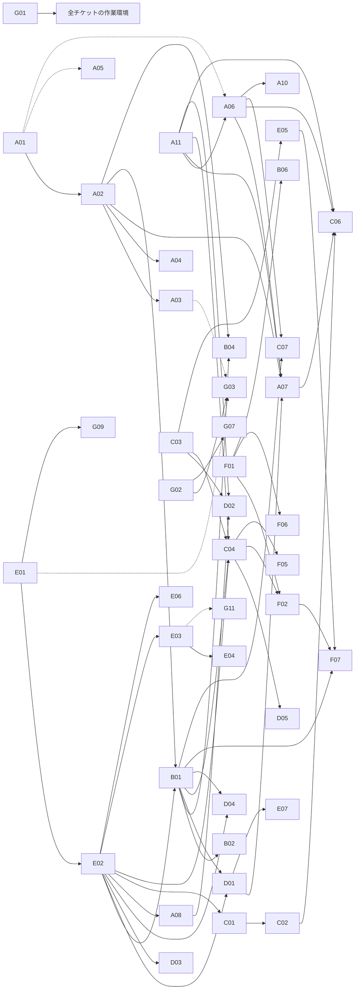
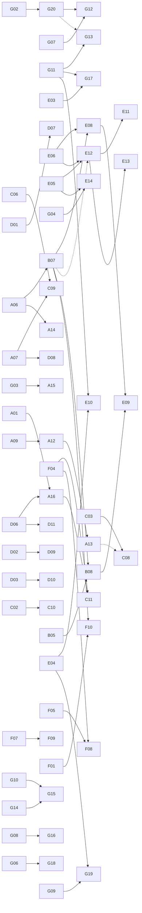

# Tsuzuri 機能実装チケット

Tsuzuri 0.1 の次に実装すべき言語機能・標準ライブラリ・ツールを、1 機能 = 1 ファイルのチケットにまとめています。
**全チケット共通の前提・コードマップ・テスト方法・設計決定は [GUIDE.md](GUIDE.md) にあります。着手前に必ず読んでください。**

- 調査時点: コミット `19d8cdd`（2026-09-23）
- 状態: `todo`（未着手）／`doing`（実装中）／`done`（完了）／`blocked`（依存待ち・要判断）
- 配置: `done` のチケットは [_completed/](_completed/) に移動し、それ以外はこのディレクトリ直下に置きます。現在直下には G10（`blocked`）と、[第2期](#第2期-他言語比較で見える劣位の改善計画) の `todo` チケット 19 件、[2026-10-07 に追加](#追加チケット2026-10-07) した `todo` チケット 2 件（B09・D12）があります。
- 優先度: **P0** 他機能の前提・早期に必要、**P1** 標準ライブラリと実用化に必要、**P2** 中期、**P3** 長期
- 規模: **S** 1〜2 日、**M** 3〜5 日、**L** 1〜3 週、**XL** 1 か月以上（分割前提）
- 「依存」は着手前に完了が必要なチケット。括弧付きは一部の機能だけが依存する弱い依存です。

## P1 実装・総合検証

P1の25件を実装し、すべて`done`へ更新しました。仕様上の選択は各チケットとGUIDEの設計決定台帳に記録しています。

- `check-runtime-includes.sh`（15ファイル）、`cargo fmt --all -- --check`、`cargo clippy --all-targets -- -D warnings`、Rust全テストが成功。
- README記載の全E2Eがnative/WASM O0/O3で成功。追加feature 3721ケース、整数intrinsic 263182参照ケース、Math 771862参照ケース、Unicode全scalar・表示解析・所有heap・タスク・サンプルを検証。
- Mathは基本745486件と256-bit参照の超越26376件。非NaNのbit一致、NaN分類、heap非確保、trap-info、関数値と評価順を検証。
- C/C++・Rust・C#・JavaScriptの36種目を`run-managed.mjs --quick`で照合。Task／Parallelのquickと整数mixも成功。短縮実行の時間は性能の証拠として扱いません。
- ASan／TSan等の追加検証と性能の実測条件・退行は担当チケットと`docs/benchmarks.md`を参照。P2/P3の機能はこの完了範囲に含めません。

## P2 実装・総合検証

P2の14件を各チケットの実装範囲で完了し、すべて`done`へ更新しました。判断は各チケットとGUIDEに記録しています。

- runtime同梱チェック16ファイル、fmt/clippy、全Rustテストと最新release buildが成功。
- README記載の全E2Eがnative/WASM O0/O3で成功。featureは4911ケース、整数intrinsicは263182参照、型変換は1585参照を検証。
- MathはFMAを含む基本759675件と超越26376件の計786051参照が一致。CのFMA20513参照はASan/UBSanでも成功。
- SIMD有無・generic/native・CPU dispatch、host import、DWARF検証、doc golden/出力保護、LSP UTF8/UTF16実セッションが成功。
- Map/Set26、Seq26、借用record10ケースはASanでも成功。全featureで所有heap回収とWASMメモリ上限を確認。
- CE/SIMD/dispatchのquick比較と整数mix100000反復のチェックサムが一致。短縮時間は性能の根拠にしない。
- A09は完全指定の借用fieldと単一regionの名前付き契約まで。独立した複数record regionは第2期のA12で実装した。
- F05のx86経路はクロスコンパイル済みで、対応実機での実行・速度は未検証。ARM baselineは実行検証済み。P3には着手していません。

## P3 実装・総合検証

P3の全7件に実装を追加しました。各チケットの初期段階の範囲で6件を`done`とし、G10だけはWindows実行ゲート未確認のため`blocked`です。

- E04: strict manifestとローカルpath依存、namespace/循環/出力保護。git/registry/lockfile解決は対象外。
- F06: Node Workerの共有メモリ・独立stack・atomic queue・thread-safe heap。既定WASMはimportなし。Browser本番glueは対象外。
- F07: kernel抽出・CPU参照・strict i32/i32u WGSL・WebGPU host試作。実Metal adapterで783参照が一致。float/64-bit GPU、通常言語runtimeへの自動接続は対象外。
- A10: 明示kind付きrank-1 HKT、部分適用、default/generic methodと通常単相化。HKT aliases/標準Functor導入は対象外。
- B06: Task.parallel_results、最小indexのerror、未開始停止・全開始済みjoin・所有値回収。ASan/UBSan/TSanも成功。
- G11: SHA-256のwhole-build cache、no-cache、破損/同時保存/eviction、tool/source/依存/sidecar検証。parse/check/IR cacheは対象外。
- G10: MSVC ABI・Win32 runtime・safe hardlink保護・専用CIを実装。実Windows SDKでO0/O3 COFF/PE linkとRust全targetのcross checkは成功。Windows上のcargo test・native実行・file置換は未確認。
- runtime19ファイル、fmt/clippy、全Rustテスト、READMEの全ローカルE2Eが成功。feature4928、Task41結果/4trap、整数intrinsic263182、型変換1585、Math786051参照を検証。
- 36種目の多言語quick、Task/Parallel、CE/SIMD/dispatch、cache/GPU参照quickが成功。短縮時間は性能優位の根拠にしません。比較harnessのMix入力は独立したrootへ修正しました。

## 第2期: 他言語比較で見える劣位の改善計画

[なぜ Tsuzuri か（起票時の版）](https://github.com/tatsuya-midorikawa/Tsuzuri/blob/c82c13e1e3dd1f02f78694aa1d26d39b3f793504/_docs/learn/why-tsuzuri.md) が挙げる C/C++・Rust・C#/F# に対する劣位点と、同ページに記載のない劣位点を調べ、改善を機能ごとのチケット 38 件にまとめました（2026-09-29 起票）。現在の比較は [なぜ Tsuzuri なのか](../_tsuzuri/language-reference/languages/why-tsuzuri.md) にあります。

- 対象: A12–A16、B07–B08、C08–C11、D07–D11、E08–E14、F08–F13、G12–G20。G12・G14・G20 は `done`（Phase 1）、A12 は `done`（Phase 1・2）、A13 は `done`（Phase 1・2）、A15 は `done`（Phase 1・2）、B07 は `done`（Phase 1・2）、C09 は `done`（Phase 1・2）、D07 は `done`（Phase 1・2）、E08 は `done`（Phase 1 の段 A–C と Phase 2。Windows を除く）、E12 は `done`（Phase 1 の段 A–D）、E14 は `done`（Phase 1・2・3）、F11 は `done`（Phase 1・2）、F12 は `done`（Phase 0・1。Phase 2 は実測で不要と判断）、C08・A16・A14 は `done`（Phase 1・2）、F13・F08 は `done`（Phase 1・2・3）、ほかは `todo` です。
- 調査時点はコミット `9012e92`。各チケットの「現状」は同時点のコード・文書・生成コードで確認しています。
- 第2期のチケットは設計の方向性と第 1 段階を示す計画です。独立レビューは未実施で、着手前に GUIDE §0 の手順 2 に従ってレビューします。
- 予約語・診断コード・std モジュールの割り当ては [GUIDE の D-30](GUIDE.md#d-30-第2期計画の仮割り当て未承認) に仮登録しています（未承認）。
- 言語の意味や既存の設計決定を変える提案（C08 の D-13 変更、A16 の `[T; N]` 再導入、C10 Phase 2 の参照カウント、D11 Phase 2 の static データ）は、着手前に人間の承認が必要です。

### 改善の方針

- AGENTS.md の原則を変えない。数値・評価順序・トラップ・所有権の意味を保ち、ハードウェア依存の経路には能力確認と明示的なエラーを持たせる。
- 新しいホスト機能（WASI、乱数 seed、非同期、GPU）は明示的な opt-in とし、既定の WASM の import なしを保つ（D-18）。
- 劣位の解消を名目に GC、例外による巻き戻し、暗黙の fast-math、黙った fallback を導入しない。
- 性能の改善は計測と生成コードの確認を先に行い、実装済みと計画を区別して文書に書く。
- 既定の出力を変えない。新しい機能を使わないプログラムの IR・import・ABI が同一であることを各チケットの受け入れ条件に含める。

### why-tsuzuri に記載された劣位と対応

| 比較対象 | 劣位点 | 対応チケット |
|---|---|---|
| C/C++ | ポインター・メモリ配置・allocator・任意の外部 ABI の制御の自由度 | E12, F13, A16, E11 |
| C/C++ | OS・デバイス・既存ライブラリとの接続にホスト実装が必要 | E08, E09, E11, E12 |
| C/C++ | 既存の C/C++ コードをそのまま取り込めない | E11, E12 |
| C/C++ | 対応プラットフォーム・最適化済みライブラリ・デバッガー・長期運用の実績 | G15（G10 の完了が前提）, C11, F08, G16, G19 |
| C/C++ | GPU が実験段階 | F09 |
| C/C++ | 安全検査・所有値の複製・ホスト境界の変換のコスト | F12, A15, A16, E13 |
| Rust | 排他スライス（C08）、排他借用フィールド（A13）、レコード内の独立した複数 region（A12）は実装済み。要素単位の排他借用と region 間の outlives はない | C08, A13, A12 |
| Rust | Copy のコストモデル（配列・捕捉の深い複製）。複製の可視化（A15）と、ヒープを使わない固定長配列 `[T; N]`（A16）は実装済み | A15, A16, C10 |
| Rust | Cargo／crates.io・非同期 I/O・低水準 API・開発ツールの成熟度 | E10, B08, E12, F13, G12, G14, G18 |
| C#/F# | .NET の標準ライブラリ・NuGet・GUI／Web／DB・ファイル／ネットワーク API | E08, E09, E10, E13, D08, D09, C09 |
| C#/F# | GC に任せられる共有データ・循環構造 | C10, A14 |
| C#/F# | async／await、対話環境、IDE 支援 | B08, G13, G12, G20 |

### why-tsuzuri に記載のない劣位と対応

| 劣位点 | 比較の基準 | 対応チケット |
|---|---|---|
| native ホストへ組み込んだ関数のトラップでホストのプロセス全体が終了し、スタック枯渇は理由なしに異常終了する | Rust の `catch_unwind`、C# の例外 | E14 |
| WASM の線形メモリが stack・data・heap 合計 16 MiB に固定 | Rust／C++ の wasm32（最大 4 GiB） | F11 |
| 実行時多相がなく、異種コレクションを作れず、単相化のコードサイズと特殊化上限を避けられない | C++ の仮想関数、Rust の `dyn`、C# のインターフェース | A14 |
| 長さを型に含む値型の配列がない | C/C++ の `T[N]`、Rust の `[T; N]` | A16 |
| メモリ以外の資源を所有値として解放できない | Rust の `Drop`、C++ の RAII、C# の `IDisposable` | B07 |
| ハッシュ表がなく、Map の挿入・削除が O(n) | C# の `Dictionary`、Rust の `HashMap` | C09 |
| 文字列補間・書式指定・直列化・正規表現がない | C#/F#、Rust | D07, D08, D09 |
| 既存の C 関数を直接呼べず（`tsuzuri_host_` 名の shim が必要）、実行ファイルへホストのライブラリをリンクする CLI がない | C/C++、Rust の FFI | E12 |
| 関数内のエラーから回復しないため、一度に得られる診断が少ない | rustc、C# コンパイラ | G20 |
| 毎回の全体コンパイルと固定上限（特殊化 1,024、ソース 1 MiB など） | C/C++ の分割コンパイル、Rust の増分コンパイル | G17 |
| VS Code 拡張以外では LLVM・Clang・LLD の導入が必要 | rustup、.NET SDK | G14 |
| 利用者コードのベンチマーク・カバレッジ・プロパティテストがない | cargo bench、BenchmarkDotNet、coverlet | G18 |
| f16 が常にソフトウェア演算 | C/C++ の `_Float16` | D10 |
| コンパイル時評価の範囲が狭い | C++ の `constexpr`、Rust の `const fn` | D11 |
| 共有状態・パイプラインの並行プリミティブがない | C++、Rust、C# | F10 |
| ホストバインディングの生成と、ブラウザー向けの WASM threads glue がない | wasm-bindgen、Emscripten | E13 |
| 言語版・非推奨の管理と公開 API の差分検査がない | Rust の edition、C# の言語版 | G19 |

### 採用しない改善

| 候補 | 理由 |
|---|---|
| GC・サイクルコレクター | 所有権による決定的な解放という設計目標と矛盾する。循環は C10 の Arena／Handle と Weak で扱う |
| 例外と巻き戻し、`?` 演算子 | D-10 の方針。ホスト境界の失敗は E14 の opt-in 境界で返し、言語内の失敗は Maybe／Result で表す |
| 暗黙の fast-math・再結合、GPU・SIMD での黙った精度変更 | 数値の意味を変える。緩い演算は名前で区別した別 API にする（F09、C11） |
| `unsafe` ブロック・生ポインター型 | 安全性の目標と矛盾する。低水準の処理はホストに置き、E12 の不透明ハンドルで受け渡す |
| 利用者が境界検査を無効にするオプション・unchecked API | 安全性を下げる。検査のコストは F12 の証明と計測で減らす |
| .NET／JVM ランタイム互換、クラス継承、型プロバイダー | 言語の対象外（[対応状況（旧版）](https://github.com/tatsuya-midorikawa/Tsuzuri/blob/c82c13e1e3dd1f02f78694aa1d26d39b3f793504/_docs/feature-status.md)）。.NET からの利用は E13 のバインディングで行う |
| GUI・Web フレームワークの同梱 | ホストの責務。E13 の生成 glue で既存のフレームワークと接続する |

## 一覧

### A. 型システム

| ID | チケット | 優先 | 規模 | 依存 | 状態 |
|---|---|---|---|---|---|
| A01 | [型適用とジェネリックなレコード](_completed/A01-generic-records.md) | P0 | L | – | done |
| A02 | [判別共用体（union）と列挙型](_completed/A02-union-types.md) | P0 | XL | A01 | done |
| A03 | [match の網羅性・到達不能節の検査](_completed/A03-match-exhaustiveness.md) | P0 | M | A02 | done |
| A04 | [再帰的なヒープ型（木・AST）](_completed/A04-recursive-types.md) | P1 | L | A02 | done |
| A05 | [型別名](_completed/A05-type-aliases.md) | P1 | S | (A01) | done |
| A06 | [型クラスの拡張（条件付きインスタンス・スーパークラス・デフォルトメソッド）](_completed/A06-typeclass-extensions.md) | P1 | L | A11, (A01) | done |
| A07 | [deriving（Eq／Ord／Display／Hash／Default の自動導出）](_completed/A07-deriving.md) | P1 | M | A11, A06, A02, D01 | done |
| A08 | [char（UTF-16）型と utf8char（Unicode スカラー）型](_completed/A08-char-type.md) | P1 | M | E02, (B01) | done |
| A09 | [名前付きライフタイムと借用フィールド](_completed/A09-named-lifetimes.md) | P2 | XL | – | done |
| A10 | [高階型（HKT）](_completed/A10-higher-kinded-types.md) | P3 | XL | A01, A06 | done |
| A11 | [比較演算の非消費化（Eq／Ord の借用シグネチャ）](_completed/A11-borrowed-comparisons.md) | P1 | M | – | done |
| A12 | [レコード内の独立した複数 region と region 付き関数値型](_completed/A12-multiple-regions.md) | P2 | XL | A09 | done |
| A13 | [排他借用フィールドと参照経由の更新](_completed/A13-exclusive-borrow-fields.md) | P2 | L | A12 | done |
| A14 | [型クラスによる動的ディスパッチ（dyn 値）](_completed/A14-dynamic-dispatch.md) | P2 | L | A06, (B07) | done |
| A15 | [暗黙の深いコピーの可視化](_completed/A15-copy-cost-visibility.md) | P2 | M | G03, (G12) | done |
| A16 | [固定長配列と const ジェネリクス](_completed/A16-fixed-arrays.md) | P2 | XL | A01, D06, (F04) | done |

### B. エラー処理・制御

| ID | チケット | 優先 | 規模 | 依存 | 状態 |
|---|---|---|---|---|---|
| B01 | [Maybe／Result 標準型](_completed/B01-option-result.md) | P0 | M | A02, E02 | done |
| B02 | [Maybe／Result ビルダーによる早期伝播](_completed/B02-result-propagation.md) | P1 | M | B01 | done |
| B03 | [break／continue](_completed/B03-break-continue.md) | P1 | M | – | done |
| B04 | [アクティブパターンの拡張（Maybe 返却・複数ケース）](_completed/B04-active-pattern-extensions.md) | P1 | M | B01, A02 | done |
| B05 | [コンピュテーション式の拡張（match!／and!／use／try）](_completed/B05-computation-expression-extensions.md) | P2 | M | (B01) | done |
| B06 | [タスクのキャンセルと失敗の伝播](_completed/B06-task-cancellation.md) | P3 | L | B01, F01 | done |
| B07 | [ユーザー定義の解放処理（Drop）とリソース型](_completed/B07-user-drop.md) | P1 | L | A06 | done |
| B08 | [非同期計算（Async）とホスト駆動の実行](B08-async.md) | P3 | XL | B05, B07, (E08), (E13) | todo |
| B09 | [ローカルな再帰関数（let rec）](B09-local-let-rec.md) | P2 | L | – | todo |

### C. コレクション・データ

| ID | チケット | 優先 | 規模 | 依存 | 状態 |
|---|---|---|---|---|---|
| C01 | [所有権に基づく関数的更新（一意所有時は in-place）](_completed/C01-consuming-update.md) | P1 | M | E02 | done |
| C02 | [伸縮可能な配列 Vec](_completed/C02-growable-vec.md) | P1 | L | E02, C01, B01 | done |
| C03 | [スライス（`&xs[a..b]`）](_completed/C03-slices.md) | P1 | L | – | done |
| C04 | [配列の一括操作 API](_completed/C04-bulk-array-api.md) | P1 | M | A11, E02, C03, B01 | done |
| C05 | [レコードのコピーと更新 `{ p with x = … }`](_completed/C05-record-update-syntax.md) | P1 | S | (A01) | done |
| C06 | [Map／Set](_completed/C06-map-set.md) | P2 | L | A11, A02, A06, A07, C02, B01 | done |
| C07 | [ユーザー定義の反復プロトコル](_completed/C07-iteration-protocol.md) | P2 | L | B01, A06 | done |
| C08 | [可変スライスと要素のその場更新](_completed/C08-mutable-slices.md) | P2 | L | C03, (A13) | done |
| C09 | [HashMap／HashSet](_completed/C09-hash-map.md) | P1 | M | A07, C02, C06 | done |
| C10 | [共有所有と循環構造（Arena・Handle・Rc／Arc）](C10-shared-ownership.md) | P2 | XL | C02, (B07), (F10) | todo |
| C11 | [多次元配列と数値カーネル](C11-multidimensional-arrays.md) | P3 | L | A16, F02, F04, (C08), (F08) | todo |

### D. 文字列・数値・組み込み関数

| ID | チケット | 優先 | 規模 | 依存 | 状態 |
|---|---|---|---|---|---|
| D01 | [表示・解析・書式化（Display／Parse／to_string）](_completed/D01-display-parse-format.md) | P0 | M | E02, B01 | done |
| D02 | [文字列ライブラリ](_completed/D02-string-library.md) | P1 | M | E02, A08, A11, C03, B01, (C02) | done |
| D03 | [数学関数の型汎用化と拡充](_completed/D03-generic-math.md) | P1 | M | E02 | done |
| D04 | [整数 intrinsic（min/max/popcount/rotate/checked など）](_completed/D04-integer-intrinsics.md) | P1 | M | E02, B01 | done |
| D05 | [明示 FMA と順序を定めた集計 API](_completed/D05-fma-ordered-reductions.md) | P2 | S | E02, C04 | done |
| D06 | [コンパイル時定数（const）](_completed/D06-compile-time-constants.md) | P2 | M | – | done |
| D07 | [文字列補間と書式指定](_completed/D07-string-interpolation.md) | P1 | M | D01 | done |
| D08 | [構造化データの直列化（JSON）と Encode／Decode の導出](D08-json-serialization.md) | P2 | L | A07, D02, (C09) | todo |
| D09 | [正規表現と Unicode テキスト処理](D09-regex-unicode.md) | P2 | L | D02, A08 | todo |
| D10 | [f16 のハードウェア演算経路](D10-f16-hardware.md) | P3 | M | D03 | todo |
| D11 | [コンパイル時評価の拡張（const 関数・表の生成）](D11-const-evaluation.md) | P3 | L | D06, (A16) | todo |
| D12 | [ランタイム IR と生成コードの intrinsic 宣言の重複の修正](D12-intrinsic-declaration-duplicates.md) | P1 | S | D04 | todo |

### E. モジュール・ホスト連携

| ID | チケット | 優先 | 規模 | 依存 | 状態 |
|---|---|---|---|---|---|
| E01 | [可視性制御（private）](_completed/E01-visibility.md) | P0 | S | – | done |
| E02 | [標準ライブラリの同梱機構](_completed/E02-standard-library-infrastructure.md) | P0 | M | E01 | done |
| E03 | [階層モジュール・サブディレクトリ](_completed/E03-hierarchical-modules.md) | P2 | L | E02 | done |
| E04 | [パッケージと依存管理](_completed/E04-packages.md) | P3 | XL | E03 | done |
| E05 | [ホスト ABI の拡張（バッファ・スカラーレコード）](_completed/E05-host-abi-buffers.md) | P1 | L | C03 | done |
| E06 | [ホスト関数のインポート](_completed/E06-host-imports.md) | P2 | L | E02 | done |
| E07 | [デバッグ出力（Debug.print／trace）](_completed/E07-debug-output.md) | P1 | S | D01, E02 | done |
| E08 | [標準 OS API（ファイル・環境・時刻・乱数・プロセス）](_completed/E08-os-api.md) | P1 | XL | B07, E06 | done |
| E09 | [ネットワーク API](E09-network.md) | P3 | XL | E08, B08 | todo |
| E10 | [git／registry 依存・lockfile・版解決](E10-package-registry.md) | P2 | XL | E04, G11 | todo |
| E11 | [C ヘッダーからの extern 生成](E11-c-bindgen.md) | P2 | L | E12 | todo |
| E12 | [FFI の拡張（リンク名・ホストのリンク指定・不透明ハンドル・コールバック）](_completed/E12-ffi-extensions.md) | P1 | L | E05, E06, (B07) | done |
| E13 | [ホスト言語バインディングと Web glue の生成](E13-host-bindings.md) | P2 | L | E05, E12, (F06), (F11) | todo |
| E14 | [埋め込み時のトラップ境界とスタック枯渇の報告](_completed/E14-trap-boundary.md) | P1 | L | G04, E05, (B06) | done |

### F. 並列・性能バックエンド

| ID | チケット | 優先 | 規模 | 依存 | 状態 |
|---|---|---|---|---|---|
| F01 | [常駐ワーカープール](_completed/F01-worker-pool.md) | P1 | M | – | done |
| F02 | [データ並列 API（Parallel.init／map／reduce）](_completed/F02-data-parallel-api.md) | P1 | M | F01, C03, C04 | done |
| F03 | [WASM SIMD128](_completed/F03-wasm-simd128.md) | P2 | M | – | done |
| F04 | [移植可能な SIMD ベクトル型](_completed/F04-portable-simd-types.md) | P2 | L | E02, (F03) | done |
| F05 | [実行時の CPU 命令セット判定と関数の複数版](_completed/F05-runtime-cpu-dispatch.md) | P2 | L | C04 | done |
| F06 | [WASM threads バックエンド](_completed/F06-wasm-threads.md) | P3 | L | F01 | done |
| F07 | [GPU バックエンド](_completed/F07-gpu-backend.md) | P3 | XL | F02, E05, B01 | done |
| F08 | [256／512-bit SIMD と関数単位の CPU 多版化](_completed/F08-wide-simd-multiversioning.md) | P2 | XL | F04, F05, (C08) | done |
| F09 | [GPU の浮動小数点・64-bit カーネルと実行時接続](F09-gpu-float-runtime.md) | P3 | XL | F07, (C11) | todo |
| F10 | [並行処理プリミティブ（Atomic・Mutex・Channel）](F10-concurrency-primitives.md) | P3 | XL | F01, B07, (A13), (C10) | todo |
| F11 | [WASM メモリ上限の設定と拡張](_completed/F11-wasm-memory-limit.md) | P1 | M | – | done |
| F12 | [境界検査の除去と検査コストの計測](_completed/F12-bounds-check-elimination.md) | P2 | L | – | done |
| F13 | [アロケーターの差し替え・確保統計・freestanding 出力](_completed/F13-custom-allocators.md) | P2 | L | (F11), (E12), (E14) | done |

### G. ツール・開発体験

| ID | チケット | 優先 | 規模 | 依存 | 状態 |
|---|---|---|---|---|---|
| G01 | [ランタイム IR ファイルの Git 追跡漏れの修正](_completed/G01-runtime-ir-tracking.md) | P0 | S | – | done |
| G02 | [複数エラーの同時報告](_completed/G02-multiple-diagnostics.md) | P0 | M | – | done |
| G03 | [警告（未使用・到達不能・シャドーイング）](_completed/G03-warnings.md) | P1 | M | G02, (A03), (E01) | done |
| G04 | [トラップ発生位置の報告](_completed/G04-trap-locations.md) | P1 | M | – | done |
| G05 | [フォーマッター（tsuzuri fmt）](_completed/G05-formatter.md) | P1 | M | – | done |
| G06 | [言語内テスト（test 宣言と tsuzuri test）](_completed/G06-test-runner.md) | P1 | M | (D01) | done |
| G07 | [LSP（言語サーバー）](_completed/G07-lsp.md) | P2 | L | G02 | done |
| G08 | [デバッグ情報（DWARF／WASM）](_completed/G08-debug-info.md) | P2 | M | – | done |
| G09 | [ドキュメントコメントと API 文書生成](_completed/G09-doc-comments.md) | P2 | S | E01 | done |
| G10 | [Windows ネイティブ対応](G10-windows.md) | P3 | M | – | blocked |
| G11 | [増分ビルド・キャッシュ](_completed/G11-incremental-build.md) | P3 | L | (E03) | done |
| G12 | [LSP の拡張（補完・rename・参照・整形・inlay hints）](_completed/G12-lsp-extensions.md) | P1 | L | G07, G20 | done |
| G13 | [REPL とスクリプト実行](G13-repl.md) | P2 | L | G11, (G20), (G17) | todo |
| G14 | [自己完結ツールチェーンの配布](_completed/G14-toolchain-distribution.md) | P1 | M | (G10) | done |
| G15 | [対応ターゲットの拡張とクロスコンパイル](G15-platform-targets.md) | P3 | XL | G10, G14, (F13) | todo |
| G16 | [デバッガー体験（型の表示・PDB）](G16-debugger-experience.md) | P2 | M | G08, (G10), (G14) | todo |
| G17 | [モジュール単位の増分コンパイルと規模上限の見直し](G17-incremental-compilation.md) | P2 | XL | G11, E03, (G20) | todo |
| G18 | [ベンチマーク・カバレッジ・プロパティテスト](G18-bench-coverage.md) | P2 | M | G06, (D07), (E08) | todo |
| G19 | [言語版（edition）と互換性・非推奨の管理](G19-editions-compatibility.md) | P3 | M | E04, G09, (E10) | todo |
| G20 | [関数内の型・所有権エラーからの回復](_completed/G20-error-recovery.md) | P1 | L | G02 | done |

## 推奨フェーズ

依存関係と価値の順に並べています。同じフェーズ内でも、上に書いたものから着手してください。

| フェーズ | 目的 | チケット（推奨順） |
|---|---|---|
| 0. 準備 | 誰でもビルドできる状態にする | G01 |
| 1. 基盤 | データを型で表し、失敗を値で扱い、診断を改善する | A01 → A02 → A03、E01 → E02 → B01、G02、A05、C05、B03 |
| 2. 最小標準ライブラリ | 文字列・数値・配列を実用的に扱う | D01、D03、D04、A08、A11、C03、C01、C04、D02、A06 → A07、B02、B04、G04、E07 |
| 3. 実用化・性能 | ホスト連携・並列・ツール | E05、F01 → F02、C02、G05、G06、G03、A04、D06 |
| 4. エコシステム | 大規模開発と高度な最適化 | G07、G08、E03、C06、C07、A09、F03、F04、F05、E06、B05、D05、G09 |
| 5. 長期 | 研究開発を伴う大型機能 | E04、F06、F07、A10、B06、G10、G11 |
| 6. 第2期・導入障壁 | 既存アプリへの組み込みと日常の開発を妨げる劣位を除く | G20 → G12、G14、F11、E12、E14、B07 → E08、C09、D07 |
| 7. 第2期・表現力と性能 | 所有権モデルの表現力・性能・エコシステムの差を縮める | A15、A12 → A13 → C08、A14、A16、F12、F13、F08、C10、D08、D09、E11、E13、E10、G16、G18、G17、G13 |
| 8. 第2期・長期 | 研究開発や外部環境の整備を伴う機能 | B08 → E09、F09、F10、C11、D10、D11、G15、G19 |
| 9. 追加（2026-10-07） | 言語リファレンスの執筆で見つけた不具合を直し、ローカルな再帰を書けるようにする | D12、B09 |

## 依存関係図

```mermaid
graph LR
  G01 --> ALL[全チケットの作業環境]
  A01 --> A02 --> A03
  A02 --> A04
  A01 -.-> A05
  A01 -.-> A06 --> A07
  A11 --> A06
  A11 --> A07
  A11 --> C04
  A11 --> C06
  A02 --> A07
  E01 --> E02 --> B01
  A02 --> B01
  B01 --> B02
  B01 --> B04
  A02 --> B04
  E02 --> D01 --> A07
  B01 --> D01
  E02 --> D03
  E02 --> D04
  E02 --> A08 --> D02
  C03 --> D02
  E02 --> C01 --> C02
  E02 --> C04
  C03 --> C04 --> D05
  B01 --> C04
  A11 --> D02
  B01 --> D04
  C03 --> E05 --> F07
  F01 --> F02 --> F07
  B01 --> F07
  C04 --> F02
  C04 --> F05
  A06 --> C06
  A07 --> C06
  C02 --> C06
  B01 --> C07
  A06 --> C07
  D01 --> E07
  G02 --> G03
  E01 -.-> G03
  A03 -.-> G03
  G02 --> G07
  E02 --> E03 --> E04
  E03 -.-> G11
  E02 --> E06
  E01 --> G09
  F01 --> F06
  F01 --> B06
  A06 --> A10
```

第2期のチケットの主な依存です。第1期のチケットは G10 を除いて完了しています。点線は弱い依存です。

```mermaid
graph LR
  G02 --> G20 --> G12
  G07 --> G12
  G20 -.-> G13
  G11 --> G13
  G11 --> G17
  E03 --> G17
  A06 --> B07
  B07 --> E08
  E06 --> E08
  E05 --> E12
  E06 --> E12
  B07 -.-> E12
  E12 --> E11
  E12 --> E13
  G04 --> E14
  E05 --> E14
  A07 --> C09
  C06 --> C09
  D01 --> D07
  A09 --> A12 --> A13
  C03 --> C08
  A13 -.-> C08
  A06 --> A14
  G03 --> A15
  A01 --> A16
  D06 --> A16
  A16 --> C11
  F04 --> C11
  A07 --> D08
  D02 --> D09
  D03 --> D10
  D06 --> D11
  C02 --> C10
  B05 --> B08
  B07 --> B08
  E08 --> E09
  B08 --> E09
  E04 --> E10
  G11 --> E10
  F04 --> F08
  F05 --> F08
  F07 --> F09
  F01 --> F10
  B07 --> F10
  G10 --> G15
  G14 --> G15
  G08 --> G16
  G06 --> G18
  E04 --> G19
  G09 --> G19
```

## 運用ルール

- 着手時に状態を `doing`、完了時に `done` にする。判断待ちは `blocked` にして、チケットの「未決事項」に理由を書く。
- 機能を追加・変更・修正・削除するプルリクエスト（Phase ごとの PR や、チケットのない修正を含む）は、同じ PR で
  `_tsuzuri/language-reference/` の関連ページを最新にし、`node scripts/check-docs.mjs <変更したページ>` を通す（[GUIDE §8](GUIDE.md#8-ドキュメント更新規約)）。
- `done` にしたチケットは `git mv` で `_completed/` へ移動し、この一覧のリンクとチケット内の相対リンクを更新する。`_tsuzuri/language-reference/` に
  このチケットを指す「計画中」の注記やリンクが残っていれば、実装した振る舞いの説明に置き換える。
- 実装中に仕様・設計を変えた場合は、チケット本文と [GUIDE.md の設計決定台帳](GUIDE.md#9-設計決定台帳チケット横断) を同時に更新する。
- 1 チケットが大きすぎる場合（特に XL）は、チケット内の「段階」ごとに別のプルリクエストにする。

## レビュー状況（2026-09-23）

- **P0 と P1 の全チケット**（A01–A08、A11、B01–B04、C01–C05、D01–D04、E01、E02、E05、E07、F01、F02、G01–G06）は、
  作成後に実コードと突き合わせた独立レビューを受け、指摘（誤ったコード参照、健全性の穴、チケット間のインターフェース不一致、
  実行できない検証手順など）を反映済み。
- **P2／P3 のチケット**は設計の方向性と第 1 段階を示すもので、独立レビューは未実施。着手前に、その時点のコードに対して
  レビュー（GUIDE §0 の手順 2）を必ず行う。
- 人間による承認（2026-09-23）: D-20（比較演算は非消費。A11）と D-11（浮動小数点は最短往復表現で表示し、
  コンソール出力も揃える。D01）を承認済み。P2／P3 は着手前に再レビューする運用で合意済み。
- **第2期のチケット**（A12–A16、B07–B08、C08–C11、D07–D11、E08–E14、F08–F13、G12–G20、2026-09-29 起票）は、コミット `9012e92` 時点のコードと文書を調べて書いた計画です。
  独立レビューと人間の承認は未実施です。着手前に GUIDE §0 の手順 2 のレビューを行い、[D-30](GUIDE.md#d-30-第2期計画の仮割り当て未承認) の仮割り当てを確定してから実装します。
- レビューで確定した横断的な決定は GUIDE の台帳に追加済み: D-20（比較は非消費、A11）、D-21（`unreachable`）、
  D-22（関数の由来情報 `FunctionOrigin`）、D-03（型名の正規マングリング）、D-07（参照元に応じた名前解決、組み込みと std の関係）、
  D-10（網羅性検査後の方針）。

## 第2期チケットの詳細化（2026-09-29）

第2期の 38 件と G10 を、HEAD `f8dc655` のコードと突き合わせて、小さいモデルでも設計判断なしに実装できる粒度まで詳細化しました
（性能チケット `_perfs/` の 27 件も同様）。各チケットには次があります。

- 着手条件と停止条件（即興で回避せず止めて報告する条件）、grep で確認したコード参照、段ごとの変更表。
- 手順ごとの確認コマンドと期待結果、名前付きの Rust テストと E2E の suite、独立した参照による期待値。
- 「未決事項」を置き換えた「決定事項」。各項目は「既定案（実装者はこの案に従う）」か「要承認（承認前は該当 Phase に着手しない）」。

共通の手順は [GUIDE](GUIDE.md) の §0・§3.1・§11.1・§12・§13・§14 に追加しました。仮に決めた名前（CLI・環境変数・std・構文）は
[D-30](GUIDE.md#d-30-第2期計画の仮割り当て未承認) の台帳にあります。承認が必要な決定は次のとおりです（承認なしの Phase 1 から
着手できるチケットは F12・G10・G12・G16・G20・D10 など、表にないものと「Phase 2 以降」の行のもの）。

| チケット | 要承認の決定 |
| --- | --- |
| [A12](_completed/A12-multiple-regions.md) | D10（region の上限を 64 へ下げる）、D13（Phase 2）。承認済みで実装済み（2026-10-03。D10 は 128 を正式な上限にする見直し案を採用） |
| [A13](_completed/A13-exclusive-borrow-fields.md) | D1（D-28「排他参照 field は禁止」の変更。チケット全体）、D5。承認済みで実装済み（2026-10-06。Phase 2 も実装。D-38） |
| [A14](_completed/A14-dynamic-dispatch.md) | D1（`dyn`・`Dyn.of`・`E1028`）。承認済みで実装済み（2026-10-06。Phase 2 も実装。D-39） |
| [A15](_completed/A15-copy-cost-visibility.md) | D3（`--warn implicit-copy` と `W1006`）。承認済みで実装済み（2026-10-03） |
| [A16](_completed/A16-fixed-arrays.md) | D1（`[T; N]` の再導入）、D10（Phase 2）。承認済みで実装済み（2026-10-06。D-39） |
| [B07](_completed/B07-user-drop.md) | D1（`Drop`）、D2（`drop` の引数を `ref mut`）、D4（Drop 型からの move の禁止）、Phase 2（`use`・`use!`、`Owned` の早期解放と関数値）。すべて承認済みで実装済み（2026-10-02） |
| [B08](B08-async.md) | D1（`Async`）、D10（Phase 2） |
| [C08](_completed/C08-mutable-slices.md) | D1（D-13 の変更。チケット全体）、D11（Phase 2）。承認済みで実装済み（2026-10-06。D-39） |
| C09・C10・C11 | Phase 2 以降だけ（C09 D11、C10 D13・D14、C11 D9） |
| [D07](_completed/D07-string-interpolation.md) | D1（`$"..."`・`u8$"..."`）、D9（`numeric.ll` の増分） |
| [D08](D08-json-serialization.md) | D1（`Json`・`Encode`／`Decode`） |
| [D09](D09-regex-unicode.md) | D1（`Regex`・`Unicode` の予約）、D11（Phase 2） |
| [D11](D11-const-evaluation.md) | D10（Phase 2 の static データ） |
| [E08](_completed/E08-os-api.md) | D1（7 つの std 名）、D9（`IO<i32>` の終了コード）、D10（`--wasm-host wasi`）、D12（段 B の `File.Handle` と B07 D5） |
| [E09](E09-network.md) | D1（`Net`）、D11（wasm32 の将来の opt-in） |
| [E10](E10-package-registry.md) | D1（`tsuzuri fetch` と `git`、`E2007`、D-29 の E04 記録の更新）、D10（Phase 2） |
| [E11](E11-c-bindgen.md) | D1（`bindgen` と `W2002`） |
| [E12](_completed/E12-ffi-extensions.md) | D1（`extern "symbol" def`）、D3（`extern type` の意味）、D6（`--link`・`-l`・`-L`）、D8（コールバックを Phase 1 に含める）。すべて承認済みで実装済み |
| [E14](_completed/E14-trap-boundary.md) | D6・D7（`--trap-mode return`、確保 listと worker）、D9（signal handler）。すべて実装済み（2026-10-02 の包括承認） |
| E13・G13・G14 | Phase 2 以降だけ（F11 の Phase 2 は承認済みで実装済み） |
| [F08](_completed/F08-wide-simd-multiversioning.md) | D7（Phase 2 の 256-bit 型）、D8（Phase 3 の `@cpu` 構文）、D9（AVX-512・SVE）。承認済みで実装済み（2026-10-06。D-39） |
| [F13](_completed/F13-custom-allocators.md) | D9（Phase 2・Phase 3）。承認済みで実装済み（2026-10-06。D-39） |
| [F09](F09-gpu-float-runtime.md) | D1（relaxed f32 の契約と名前）、D9・D10（Phase 2・3） |
| [F10](F10-concurrency-primitives.md) | D1（`Atomic`・`Mutex`・`Sync`・`AtomicValue`・`Task.scope`）、D10（Phase 2 の `Channel`） |
| [G15](G15-platform-targets.md) | D8（CI の `targets.yml`） |
| [G17](G17-incremental-compilation.md) | D5（`check`・`test`・`doc` の既定の cache）、D10・D11（Phase 2・3） |
| [G18](G18-bench-coverage.md) | D1（予約語 `bench`） |
| [G19](G19-editions-compatibility.md) | D1（manifest の `edition`）、D4（`@deprecated` と `W1005`）、D9（Phase 2） |

詳細化の過程で見つけた、チケット外の食い違い: G10 の記録と `README.md`・`_features/README.md`・`docs/architecture.md`・`_docs/tools/build-and-cache.md` は
Windows 専用の CI があるように書いているが、`.github/workflows/windows.yml` は `16d4fa9` で削除されている（G10 の手順で復元する）。

## 追加チケット（2026-10-07）

言語リファレンス（[_tsuzuri/language-reference/](../_tsuzuri/language-reference/index.md)）を HEAD `5b896b7` の実装と突き合わせて書いた際に、
次の 2 件を起票しました。どちらも第2期の詳細化と同じ粒度（着手条件と停止条件、grep で確認したコード参照、段ごとの変更表、
名前付きのテスト、決定事項）で書いています。

| チケット | 種別 | 概要 | 承認 |
| --- | --- | --- | --- |
| [D12](D12-intrinsic-declaration-duplicates.md) | 不具合 | 数値の表示や文字列化と一緒に `i32` の `Int.min`・`Int.max`、`i32`／`i32u` の `Int.leading_zeros` を使うと、生成コードと `numeric.ll` が同じ intrinsic を宣言し、clang が `invalid redefinition of function` で失敗する。native と WASM の両方で起きる | 不要 |
| [B09](B09-local-let-rec.md) | 機能 | 関数本体・ブロック・コンピュテーション式の中で `let rec go = \n -> ...` と書けるようにする。現在、再帰はモジュールの `def rec`（署名と実装を分ける形の `let rec`・`fn rec` を含む）でしか書けない | Phase 1 は不要。Phase 2（相互再帰、解放処理を持つ値の捕捉、ほかの `let rec` 関数の参照）は D9 の承認が必要 |
