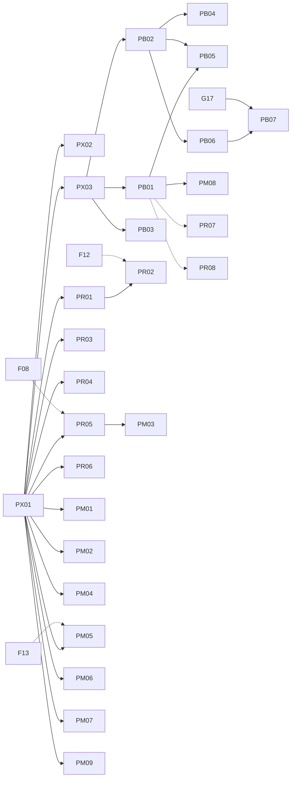

# Tsuzuri 性能改善チケット

Tsuzuri は、C/C++・Rust・Zig を上回る**超高速**な実行、**超省メモリ**、Go を上回る**超高速ビルド・コンパイル**を目指しています。
このディレクトリには、その実現に向けた性能改善を 1 施策 = 1 ファイルのチケットとして置きます。

チケットは計画であり、目標の達成を示すものではありません。
実装では [AGENTS.md](../AGENTS.md) の性能方針と、[_features/GUIDE.md](../_features/GUIDE.md) の規則（意味の保持、テスト、決定的な IR）に従います。
測定の手順と過去の結果は [docs/benchmarks.md](../docs/benchmarks.md) にあります。

- 起票: 2026-09-29。調査時点のコミットは `9012e92`。計測機は Apple M1 Max（10 コア）、macOS 27.0、Apple Clang 21.0.0。
- 状態: `todo`（未着手）／`doing`（実装中）／`done`（完了）／`blocked`（依存待ち・要判断）。
- 配置: `done` のチケットは [_completed/](_completed/) へ移し、この一覧のリンクを更新します。
- ID: **PX** 計測基盤、**PR** 実行速度、**PM** メモリと成果物サイズ、**PB** ビルド速度。
- 優先度・規模の定義は [_features/README.md](../_features/README.md) と同じです（P0 が最優先、S〜XL）。
- どのチケットも独立レビューは未実施です。着手前に、その時点のコードと計測でレビューします。

## 目標

| 目標 | 主な指標 | 比較の基準 |
| --- | --- | --- |
| 超高速な実行 | 同じ仕事の処理時間（中央値）、生成コードの命令 | C／C++／Rust／Zig の最速の実装。C#／Go／JavaScript は参考 |
| 超省メモリ | 最大 RSS、確保回数・確保量、値のサイズ、成果物のサイズ | C／Rust／Zig |
| 超高速なビルド | デバッグビルドとリリースビルドの時間（初回・再ビルド・1 ファイル変更後）、コンパイラの最大 RSS | デバッグは Go、リリースは C／C++／Rust／Zig |

数値目標は各チケットに書きますが、共有 CI の合否条件にはしません。専用の計測機で、同じ仕事・同じ条件の比較を記録して判断します。

## 性能改善の原則

- 意味を変えない。整数の折り返し、飽和、丸め、NaN、符号付きゼロ、評価順序、トラップ、所有権と借用を保つ。fast-math、再結合、暗黙の FMA、二重丸め、データ競合を性能のために導入しない。
- 最適化は型・所有権・借用・不変性から証明できる事実だけに基づける。根拠のない `noalias` などを付けない。
- 同じ仕事で比べる。アルゴリズム、データ構造、確保の方針、安全検査、コンパイラの版と最適化の指定をそろえ、そろえられない差は結果の表に明記する。
- 高速化を主張する前に、生成された IR・アセンブリを確認し、実測する。実装済みの経路と計画を区別して文書に書く。
- ハードウェア依存の経路には能力確認と移植可能な代替経路を持たせる。明示的に要求された経路が使えない場合はエラーにする。
- 既定の出力は、チケットが承認を得て変える場合を除いて変えない。

## 現状（2026-09-29）

### 実行速度

[docs/benchmarks.md](../docs/benchmarks.md) の 36 種目（2026-09-26、M1 Max、`-O3`、3 回の中央値）では、Tsuzuri の相対性能（最速の時間 / Tsuzuri の時間）は次のとおりです。

- 0.99 以上: 25 種目。制御構文・浮動小数点・配列・リスト・タスクの逐次実行など、多くの計算カーネルで C/C++/Rust と同等でした。
- 0.95 以上 0.99 未満: 4 種目（`computations/checked`、`array_for`、`array_bind`、`std_result`）。
- 0.95 未満: 7 種目。`utf16_compare` 0.497（最速は JavaScript）、`utf8_roundtrip` 0.658（C++）、`format_parse` 0.751（C#）、`task_parallel` 0.768（C#）、
  `std_option` 0.873（Rust）、`integer128_mix` 0.891（C）、`std_option_owned` 約 0.09（C++）。
- `integer128_mix` の内側のループは、2026-09-29 の確認で C の参照実装と命令単位で同一でした。差は配置や計測条件による可能性があり、PX02 で再計測します。
- `std_option_owned` の C++／Rust の参照実装は文字列を確保せず定数の長さを使うため、確保の条件がそろっていません（PX02、PM06）。

僅差は一般的な優位性を示しません。C より明確に速い種目はまだありません。

### メモリと成果物サイズ

- hello の実行時の最大 RSS は 1.70 MB（C は 1.67 MB）で、小さなプログラムでは同等でした。データ量の多い処理のメモリ比較はありません。
- hello の実行ファイルは 67,256 bytes（`-O3`）／100,824 bytes（`-O0`）で、C の hello（33,424 bytes）の約 2 倍です。WASM の hello は 59 bytes です。
- 値の表現には改善の余地があります。文字列は UTF-16 で 1 コード単位 2 bytes、関数値は 4 ポインター（32 bytes）、リストは要素ごとのノード、
  ペイロードの型が異なる union は 16 bytes 単位の領域を持ちます。WASM の allocator は 16 bytes のヘッダーと先頭一致の線形探索です。

### ビルド速度

`--no-cache`、各 1 回の参考値です（PX03 で正式に計測します）。合成プロジェクトは各モジュールに 20 個の関数を持つ生成コードです。

| 対象 | 行数 | check | IR 出力 | 実行ファイル `-O0` | 実行ファイル `-O3` | コンパイラの最大 RSS |
| --- | ---: | ---: | ---: | ---: | ---: | ---: |
| `examples/hello` | 10 | 0.05 s | 0.02 s | 0.33 s | 0.53 s | – |
| 合成 200 モジュール | 24,803 | 0.39 s | 0.46 s | 1.26 s | 2.05 s | 237 MB |
| 合成 1,000 モジュール | 124,003 | 2.12 s | 2.58 s | 約 6.2 s | 約 10.1 s | 1.12 GB |

- C の hello は Clang で 0.07 s です。Tsuzuri の hello の実行ファイルでは、結果の表示が数値ランタイム（`numeric.ll`）全体を IR に含め（464 KB）、その `-O3` コンパイルだけで 0.43 s かかっていました。
- 合成 1,000 モジュールでは、Clang の処理が `-O0` で 3.70 s、`-O3` で 7.62 s でした。フロントエンドは単一スレッドで、1 秒あたり約 5 万行です。
- フロントエンドのサンプリング（1 ms 間隔）では、サンプルの 57% が malloc／free／memmove にありました。型付き IR の複製、所有権検査の 2 回の実行、IR 文字列の生成が主な処理です。

## 一覧

### PX. 計測基盤

| ID | チケット | 優先 | 規模 | 依存 | 状態 |
| --- | --- | --- | --- | --- | --- |
| PX01 | [性能指標の拡張と記録の継続](PX01-metrics.md) | P0 | M | – | todo |
| PX02 | [実アプリ型ベンチマークと比較対象の拡充](PX02-workloads.md) | P0 | L | PX01 | todo |
| PX03 | [ビルド速度ベンチマーク](PX03-build-benchmarks.md) | P0 | M | PX01 | todo |

### PR. 実行速度

| ID | チケット | 優先 | 規模 | 依存 | 状態 |
| --- | --- | --- | --- | --- | --- |
| PR01 | [所有権・借用から導く最適化情報の付与](PR01-ownership-facts.md) | P1 | L | PX01 | todo |
| PR02 | [整数範囲の証明による算術フラグとループ最適化](PR02-integer-ranges.md) | P2 | L | PR01, (F12) | todo |
| PR03 | [抽象化コストの除去（計算式・Option／Result・関数値）](PR03-zero-cost-abstractions.md) | P1 | L | PX01 | todo |
| PR04 | [数値の表示・解析の高速化](PR04-number-formatting.md) | P1 | M | PX01 | todo |
| PR05 | [UTF 変換・比較・検証の SIMD 化](PR05-utf-simd.md) | P1 | M | PX01, (F08) | todo |
| PR06 | [Task プールの低遅延化と work stealing](PR06-task-scheduler.md) | P2 | L | PX01 | todo |
| PR07 | [プロファイル誘導最適化（PGO）](PR07-pgo.md) | P2 | M | PX01, (PB01) | todo |
| PR08 | [言語間 LTO と bitcode 出力](PR08-cross-language-lto.md) | P2 | M | (PB01), (E12) | todo |

### PM. メモリと成果物サイズ

| ID | チケット | 優先 | 規模 | 依存 | 状態 |
| --- | --- | --- | --- | --- | --- |
| PM01 | [値のレイアウトの最適化（union・niche・フィールド順）](PM01-value-layout.md) | P1 | L | PX01 | todo |
| PM02 | [関数値の表現の縮小](PM02-closure-representation.md) | P2 | M | PX01 | todo |
| PM03 | [コンパクト文字列（Latin-1 の内部表現）](PM03-compact-strings.md) | P2 | XL | PX01, PR05 | todo |
| PM04 | [連結リストの連続表現](PM04-list-representation.md) | P2 | L | PX01 | todo |
| PM05 | [小さい確保のための size-class allocator](PM05-small-allocator.md) | P1 | L | PX01, (F13) | todo |
| PM06 | [確保の除去とスタック化](PM06-allocation-elimination.md) | P1 | L | PX01 | todo |
| PM07 | [複製の除去とバッファ再利用の一般化](PM07-copy-elision.md) | P1 | M | PX01, (A15) | todo |
| PM08 | [成果物サイズの最小化](PM08-binary-size.md) | P2 | M | PB01 | todo |
| PM09 | [スタック使用量の削減と末尾呼び出しの保証](PM09-stack-and-tail-calls.md) | P3 | L | PX01 | todo |

### PB. ビルド速度

| ID | チケット | 優先 | 規模 | 依存 | 状態 |
| --- | --- | --- | --- | --- | --- |
| PB01 | [ランタイムの事前ビルドと必要部分だけのリンク](PB01-prebuilt-runtime.md) | P0 | M | PX03 | todo |
| PB02 | [フロントエンドの確保削減と高速化](PB02-frontend-allocation.md) | P0 | L | PX03 | todo |
| PB03 | [LLVM とリンカーへの受け渡しの高速化](PB03-llvm-handoff.md) | P1 | M | PX03 | todo |
| PB04 | [フロントエンドの並列化](PB04-parallel-frontend.md) | P2 | L | PB02 | todo |
| PB05 | [デバッグビルド用の高速バックエンド](PB05-fast-debug-backend.md) | P2 | XL | PB01, PB02 | todo |
| PB06 | [常駐ビルドサーバーと watch モード](PB06-build-server.md) | P2 | L | PB02, (G17) | todo |
| PB07 | [関数単位の増分コード生成と増分リンク](PB07-incremental-codegen.md) | P3 | XL | PB06, G17 | todo |

## `_features` との関係

機能チケットと重なる性能施策は、重複して仕様を書かず、次のように分担します。

| 機能チケット | 分担 |
| --- | --- |
| [F08](../_features/F08-wide-simd-multiversioning.md) 256-bit SIMD と CPU 多版化 | PR05 は UTF 処理のカーネルに F08 の仕組みを使う |
| [F11](../_features/_completed/F11-wasm-memory-limit.md) WASM メモリ上限 | PM05 の WASM allocator は F11 の上限設定と整合させる |
| [F12](../_features/_completed/F12-bounds-check-elimination.md) 境界検査の除去 | 境界検査は F12、整数範囲と算術フラグは PR02 |
| [F13](../_features/F13-custom-allocators.md) allocator の差し替え | ホスト提供の allocator は F13、内部 allocator の性能は PM05 |
| [G11](../_features/_completed/G11-incremental-build.md) whole-build cache | PB01 の事前ビルド成果物は G11 と同じ cache の規則を使う |
| [G17](../_features/G17-incremental-compilation.md) 増分コンパイル | モジュール単位のフロントエンド cache（構文解析の結果と interface の要約、ディスク上）は G17、常駐プロセスと watch は PB06、関数単位の増分コード生成と codegen unit の並列コンパイルは PB07、フロントエンドの並列化は PB04。旧 G17 Phase 0 の計測は PX01・PX03 が持つ |
| [F10](../_features/F10-concurrency-primitives.md) 並行プリミティブ | `Atomic`・`Mutex` の利用者 API は F10、task プールの実装は PR06。内部可変な型の判定 `Type::has_interior_mutability` は F10、属性への反映（`Type::is_frozen`）は PR01 |
| [E12](../_features/_completed/E12-ffi-extensions.md) FFI の拡張 | `extern` の構文とリンク指定は E12、bitcode 出力と言語間 LTO は PR08 |
| [D07](../_features/D07-string-interpolation.md) 文字列補間 | 書式指定で `numeric.ll` に関数を足すのは D07（要承認）、数値の表示・解析の高速化は PR04 |
| [G18](../_features/G18-bench-coverage.md) 言語内ベンチマーク | 利用者向けの `tsuzuri bench` は G18、リポジトリの計測基盤は PX01–PX03 |
| [A15](../_features/A15-copy-cost-visibility.md) 暗黙の複製の可視化 | 複製の除去そのものは PM07 |
| [A16](../_features/A16-fixed-arrays.md) 固定長配列 | 値型の配列による確保の削減は A16、既存の型の配置は PM01 |
| [D10](../_features/D10-f16-hardware.md) f16 のハードウェア経路 | 数値型の演算経路は D10 |

## 推奨フェーズ

| フェーズ | 目的 | チケット（推奨順） |
| --- | --- | --- |
| 1. 計測 | 同じ条件で差を測れる状態にする | PX01 → PX03、PX02 |
| 2. 即効性の高い改善 | 計測で判明した大きな無駄を除く | PB01、PB02、PR01、PM06、PM07、PR04、PR05 |
| 3. 表現と実行基盤 | 値の表現・確保・並列実行を改善する | PM01、PM05、PR03、PB03、PB04、PR06、PM08、PR02 |
| 4. 大型の施策 | 既定の表現や生成方式を変える | PB05、PB06、PM02、PM03、PM04、PR07、PR08 |
| 5. 長期 | 研究開発を伴う施策 | PB07、PM09 |

## 依存関係図

## 運用ルール

- 着手時に状態を `doing`、完了時に `done` にし、`done` のチケットは `git mv` で `_completed/` へ移してリンクを更新する。
- 計測結果は、日付・計測機・コミット・コンパイラの版・生データの保存先とともに [docs/benchmarks.md](../docs/benchmarks.md) に記録する。
- 高速化の効果が計測で確認できない場合は、既定の経路にせず、チケットに結果を記録して判断を仰ぐ。
- 言語仕様・内部表現・既定の出力を変える施策は、チケットの「決定事項」で `要承認` とし、承認を得てから実装する。

## 実装担当者へ

各チケットは 2026-09-29 に HEAD `f8dc655` で、小さいモデルでも設計判断なしに実装できる粒度まで詳細化しています（コードの参照は grep で確認済み、
手順ごとに確認コマンド付き）。着手の前に [_features/GUIDE.md](../_features/GUIDE.md) の §0・§1・§3.1・§11.1・§13・§14 を読んでください。
共通の計測手順は GUIDE §14、結果の形式は PX01、ビルド時間の計測は PX03 にあります。

承認が必要な決定（承認までは該当する Phase／段に着手しない）:

| チケット | 要承認の決定 |
| --- | --- |
| PX02 | D7（Zig・Go の計測機への導入と Phase 3） |
| PX03 | D9（Phase 2: Go・Zig との比較） |
| PX01 | D3（生データの長期保管）、D8（Linux 計測機） |
| PR03 | D3（Phase 3 の型付き IR での展開） |
| PR04 | D4（表の追加による約 20 KB の増加） |
| PR05 | D7（Phase 2） |
| PR06 | なし（D1・D4・D7 は起票時の案を置き換える既定案。見直し提案を確認する） |
| PM01 | D1・D2（Phase 1）、D5（Phase 2）、D7（Phase 3a）、D10（Phase 3b） |
| PM02 | D1（関数値の表現） |
| PM03 | D1（チケット全体） |
| PM04 | D1（チケット全体） |
| PM05 | D2（Phase 2）、D10（Phase 3: 既定の切り替え） |
| PM06 | D1（確保失敗・スタック枯渇の文言） |
| PM08 | D8（`wasm-opt`） |
| PM09 | D1（末尾呼び出しの保証）、D6（`--wasm-feature tail-call`） |
| PB01 | D9（Phase 2）、D10（Phase 3） |
| PB02 | D9（Phase 2） |
| PB03 | D6（Linux の既定リンカー）、D7（bitcode の受け渡し） |
| PB04 | D8（Phase 2） |
| PB05 | D1・D2・D3（チケット全体。D12 の既定のバックエンドの変更は本チケットでは行わない） |
| PB06 | D2（Phase 2: 常駐サーバー） |
| PB07 | D1（既定の codegen unit 分割）、D10（Phase 2） |
| PR01・PR02・PR07・PR08・PM07 | なし |
