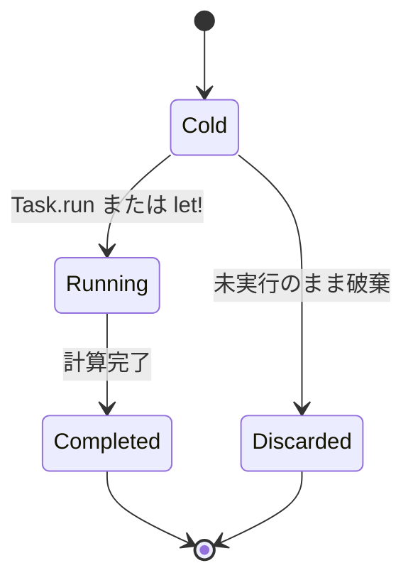

# Task 式

`Task<T>` は、外の所有値を捕捉して持つ、**コールド（作っただけでは始まらない）で 1 回実行**の並行タスクです。

OS のスレッドハンドルでも、JavaScript の `Promise` でもありません。`Task.run` か、別のタスクの `let!` で消費して初めて実行が始まります。F# の通常の `task` は生成時に動き出しますが、Tsuzuri の `Task` は冷たいままです。

## この記事のポイント

- `task { ... }` で `Task<T>` を作り、`Task.run` で同期実行して結果を取り出します。
- タスクは非 Copy です。二重実行は `E1012` になります。
- 持ち込めるのは所有値のムーブか Copy だけです。参照の持ち込みは `E1013` です。
- 実行せずに捨てたタスクは、本体を走らせず、捕捉した所有値だけを解放します。
- `Task.parallel` の結果配列は、入力の並び順です。
- `Task.parallel_results` は、未開始のタスクを止め、入力インデックスが最小の `Error` を返します。
- ネイティブの追加ワーカーは `min(オンライン CPU 数, 32) - 1` までです。既定の WASM は逐次です。

## タスクの状態



作った直後はコールドです。呼び出し側が実行するまでスレッドは増えません。実行せずにスコープを抜けると、本体は走らず、捕捉した所有値だけが drop されます。

## 基本の書き方

```text
task {
    let! x = work1
    do! work2
    return! work3
}
```

| 構文 | 意味 |
| --- | --- |
| `let! x = work` | `work: Task<T>` を 1 回消費して実行し、結果を `x` に束縛する |
| `do! work` | `work: Task<unit>` を消費して実行し、続きを進める |
| `return value` | そのブロックの結果を作る。関数からの早期脱出ではない |
| `return! work` | 末尾で別のタスクを実行し、その結果をこのタスクの結果にする |
| 最後の通常の式 | その式の値が結果になる |
| 空の `task {}` | `Task<unit>` |

文の区切りは改行か `;` です。`return` と `return!` は、そのブロックの末尾にだけ置けます。

```tsuzuri run=42
def next :: i64 -> Task<i64> = \value -> task { return value + 1 }

let work = task {
    let! first = next 19
    let! second = next 21
    do! task { assert (first == 20); }
    return first + second
}
Task.run work
```

実行結果:

```text
42
```

`Task.run :: Task<'a> -> 'a` はタスクを消費し、終わるまで現在のスレッドを止めて結果を返します。`let!` を並べただけでは、手前から順に逐次実行です。並列にするには `Task.parallel` を明示します。

`Task<'a>`、`Task<[i64]>`、`Task<i64 -> i64>`、`Task<Task<i64>>` も書けます。`task` は言語組み込みの構文で、`.tc` のビルダーではありません。`Task` は予約されたモジュール名です。`record Task` は `E1001`、`Task.tc` は `E1011` になります。動作をユーザーコードから上書きはできません。

`Task.run` と `Task.parallel` は、ほかの関数へ渡せる多相の関数値です。`Task<T>` 自体を `export def` することはできません（`E1008`）。

### ブロックの形

`if` の枝で `return` するときは、波括弧のブロックにします。次の `then return` は構文エラー `E0002`（`expected an expression`）です。

```text
task { if ready then return 1 else return 0 }
```

通るのは、枝をブロックにした形です。`then { return 1 }` でも構いません。

```text
task {
    if ready { return 1 } else { return 0 }
}
```

`return` のあとに文を続けることもできません（`E0002`）。`and!`、`yield`、`match!` はタスクの構文ではありません（`E0002`）。`do!` の成功値は `unit` だけで、それ以外は `E1003` です。

`IO` も受け取れません。`task { do! IO.write_line "hi"; }` は `E1003`（`expected Task<unit>, found IO<unit>`）です。公開の `IO.run` はなく、`IO` と `Task` の暗黙変換もありません。

結果型が決まらない式は `E1015` になります。`unreachable ()` は多相なので、タスクの結果型を注釈しないと次のエラーです。未使用かどうかは関係ありません。

```text
let work = task { unreachable () }
```

```text
error[E1015]: ambiguous polymorphic use; add a concrete type annotation or supply determining arguments
```

`let work: Task<i64> = task { unreachable () }` なら型は付きます。実行すればトラップします。

## 1 回実行と所有権

`Task<T>` は常に非 Copy です。同じタスクを 2 回実行すると `E1012` です。

```text
let work = task { 42 }
let first = Task.run work
let second = Task.run work
```

```text
error[E1012]: use of moved or partially moved value 'work'
```

配列やリストの要素を取り出して実行することもできません。借用しても `Task.run` には所有権が要るので、添字アクセスでは動かせません。

```text
let works = [task { 1 }]
Task.run works[0]
```

```text
error[E1012]: cannot move a non-Copy element out of an array or list; borrow the element instead
```

同じ処理を繰り返すなら、呼ぶたびに新しい `Task` を返す関数にします。上の `next` がその形です。

何度でも呼べる通常のクロージャにタスクを捕捉させることはできません（`E1005`）。一方、1 回実行のタスクが別のタスクを捕捉して合成することはできます。

### 実行せずに捨てた場合

`Task.run` にも `let!` にも渡さず捨てると、本体は走りません。捕捉していた所有値だけが、スコープの終わりで drop されます。

```tsuzuri run=42
let _unused = task {
    assert false
    0
}
42
```

実行結果:

```text
42
```

## 参照は持ち込めない

タスクはワーカー上で並列に走る可能性があります。データ競合をコンパイル時に拒むため、捕捉と結果に参照を含められません。

```text
let number = 42
let reference = ref number
let work = task { deref reference }
```

```text
error[E1013]: tasks require owned values; ref i32 contains a reference
```

整数リテラルの `42` は注釈がなければ `i32` です。配列、リスト、レコードに隠れた参照も同じ `E1013` です。未知の関数引数は借用を持っている可能性があるので、タスクへ捕捉できません。そのときのメッセージは `task captures cannot retain borrowed values, including borrowed function environments` です。

結果が参照でも `E1013` です（`task results must be owned values, not references`）。

持ち込めるのは、所有値のムーブか Copy だけです。中に入れてから、タスクのローカルで借用するのは問題ありません。

```tsuzuri run=6
let text = "coffee"
let work = task {
    let r = ref text
    String.length r
}
Task.run work
```

実行結果:

```text
6
```

外の `let mut` への代入は、タスクの中では可変束縛として見えません（`E1014`）。タスクの中で `let mut` したローカルは、そのタスクの中だけで変えられます。Copy の配列や関数ポインタを捕捉するときは、独立したコピーが作られます。大きな Copy 値は、その分のコピーがかかります。

## 並列実行

```text
Task.parallel :: [Task<'a>] -> Task<['a]>
```

`Task.parallel` はタスクの配列を消費し、フォーク・ジョインを表す新しい遅延タスクを返します。

```tsuzuri run=14
let jobs = new [Task<i64>](4, \index -> task { return index * index })
let results = Task.run (Task.parallel jobs)
Array.sum ref results
```

実行結果:

```text
14
```

個々のタスクが始まる順と終わる順は決まっていません。結果配列の添字は、入力配列の並びと一致します。結果型が違うタスクを同じ配列には混ぜられません。

空配列は、型を付ければ本体を走らせず空配列を返します。型がない `[]` は `E1015` です。

```tsuzuri run=0
let jobs: [Task<i64>] = []
Array.length ref (Task.run (Task.parallel jobs))
```

実行結果:

```text
0
```

`and!`、デタッチ、スレッド ID、スレッド間の可変状態の共有、外部キャンセルトークン、回復可能なタスク例外はありません。

## 失敗の伝播

`Result` を返すタスクを並べるときは `Task.parallel_results` を使います。

```text
Task.parallel_results :: [Task<Result<'a, 'e>>] -> Task<Result<['a], 'e>>
```

すべて `Ok` なら、入力順の配列を `Ok` で包みます。型を付けた空配列は `Ok []` です。

いずれかが `Error` のときは、次の規則です。

1. そのインデックス以降で、まだワーカーへ渡していないタスクは始めません。捕捉値は解放します。
2. すでに始まっているタスクは、強制終了せず完了まで待ちます。
3. 返す `Error` は、完了順ではなく、入力インデックスが最小のものです。

```tsuzuri run=42
def job :: i64 -> Task<Result<i64, string>> = \value -> task {
    if value == 2 { return Result.Error "stopped" }
    else { return Result.Ok (value * 2) }
}

let jobs = new [Task<Result<i64, string>>](4, \index -> job index)
let result = Task.run (Task.parallel_results jobs)
match result with
| Result.Ok values -> Array.sum ref values
| Result.Error error -> if error == "stopped" then 42 else 0
```

実行結果:

```text
42
```

> [!NOTE]
> 止められるのは未開始のタスクだけです。外部キャンセルトークン、スタックの巻き戻し、スレッドの強制終了はありません。通常の `Task.parallel` は、途中で失敗しても全件を走らせます。

トラップ、メモリ不足、実行基盤の失敗は `Error` にはなりません。プロセスが失敗します。失敗したときに兄弟を止めることや、捕捉値を巻き戻して解放することは保証されません。止まらない兄弟がいると、待ちも終わりません。

## 実行バックエンド

### ネイティブ

POSIX では pthreads、Windows では Win32 のスレッドプールを使った同期フォーク・ジョインです。

- 追加ワーカーは、複数のタスクを初めて投入したときに作られ、以後は再利用されます。0 件と 1 件ではプールを起動しません。
- 追加ワーカーの上限は `min(オンライン CPU 数, 32) - 1` です。投入したスレッド自身も仕事を消化するので、この数には入りません。
- 入れ子の `Task.parallel` でも、呼び出し元が自分のグループを進めるため、空きワーカー不足ではデッドロックしません。
- CPU 数が取れないときは、追加ワーカーを作らず逐次実行します。
- 制御が戻った時点で、そのグループの仕事と結果の公開は終わっています。OS スレッド自体はプールに残り、プロセス終了時にまとめて join されます。detach はありません。
- スレッドの生成や join に失敗すると、診断を出してプロセスを終了します。成功したことにはしません。

短い仕事では、確保、コピー、同期の方が重く、プールが速くなるとは限りません。

対応するのは POSIX と Windows です。それ以外のネイティブ並列ビルドはビルドエラーです。Windows でランタイムを含む COFF オブジェクトを直接リンクする使い方は未対応です。実行ファイルか、明示的な LLVM IR リンクを使います。

### WebAssembly

既定の WASM は、ホストの import を要しない逐次実行です。所有権、結果の順序、`parallel_results` のエラー選択はネイティブと同じです。逐次のときは、最初の `Error` 以降のタスクを実行しません。

Workers で並列にするのは、`tsuzuri build --target wasm32 --wasm-feature threads` で出した WASM かオブジェクトだけです。`run`、`check`、ネイティブ、LLVM テキストへの指定は `E2000` です。simd128 とは併用できます。

同梱のホストは Node.js 20 以降向けの `src/runtime/wasm-threads.mjs` です。共有メモリ（`SharedArrayBuffer`）が要ります。ブラウザ向けの本番グルーは未実装です。COOP（`same-origin`）と COEP（`require-corp`）を自分で満たし、UI スレッドでは atomic wait しないホストを別に書く必要があります。初期化に失敗したプールを、黙って逐次成功にはしません。

`Task.run` はネイティブでも WASM でも同期呼び出しです。UI スレッドをブロックしない API ではありません。

### ホスト関数

タスクから `extern` を呼ぶなら、その関数は複数スレッドから呼ばれても安全である必要があります。ホストのグローバルやイベントループをワーカーから触ると、データ競合になります。

## 他の言語との比較

| 言語 | 構文 / 型 | いつ始まるか | 捕捉 | 実行 |
| --- | --- | --- | --- | --- |
| Tsuzuri | `task { ... }` / `Task<T>` | コールド。`Task.run` か `let!` | 1 回実行。参照は不可 | スレッドプールの同期フォーク・ジョイン |
| F# | `task { ... }` / `Task<T>` | ホット。生成時に開始 | 複数回参照できる | .NET のスレッドプール |
| Rust | `std::thread::spawn` | ホット | `'static`、または scoped thread の借用 | OS スレッド。並列は外部クレートが多い |
| C# | `Task.Run(...)` | ホット | GC が参照を共有 | .NET のスレッドプール |
| Go | `go func()` | ホット | ポインタ共有。競合は実行時 | goroutine |

## まとめ

- `Task<T>` はコールドで、1 回だけ実行できる非 Copy のタスクです。
- `task { ... }` で作り、`Task.run` で同期実行します。二重実行は `E1012`、参照の持ち込みは `E1013` です。
- `if` の枝で `return` するときはブロックが要ります。`then return` は `E0002` です。
- `Task.parallel` の結果は入力順です。`Task.parallel_results` は未開始分を止め、最小インデックスの `Error` を返します。
- 追加ワーカーは `min(CPU 数, 32) - 1` までです。既定の WASM は逐次で、threads は明示した wasm32 ビルドだけです。

## 関連項目

- [Async 式](async.md)
- [Lazy 式](lazy.md)
- [Parallel](../built-in-types-and-modules/parallel.md)
- [Result](../built-in-types-and-modules/result.md)
- [IO](../built-in-types-and-modules/io.md)
- [コンピュテーション式](../computation-expressions/computation-expressions.md)
- [所有権とムーブ](../ownership-and-memory/ownership.md)
- [借用と参照](../ownership-and-memory/borrowing.md)
- [WebAssembly への出力](../compiler/webassembly.md)
- [言語仕様（タスク）](../../../docs/language.md#タスク)
- [言語仕様（並列区間と寿命）](../../../docs/language.md#並列区間と寿命)
- [言語仕様（実行バックエンドと失敗）](../../../docs/language.md#実行バックエンドと失敗)
- [言語リファレンスの目次](../index.md)
