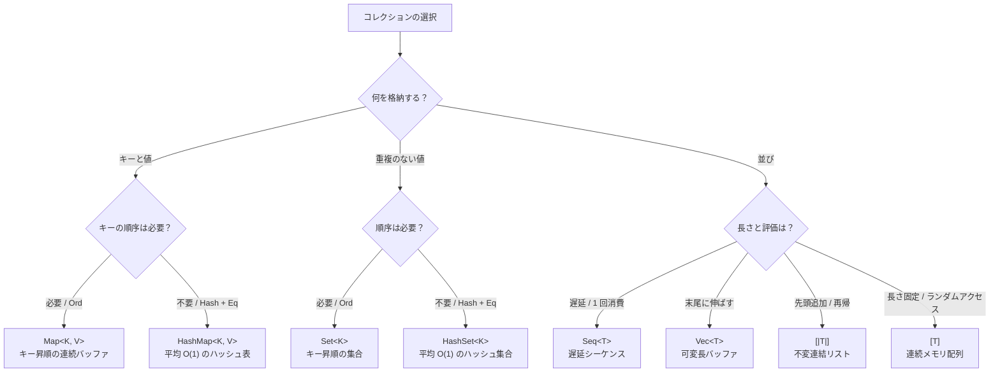

# Array

`Array` は、要素を連続したメモリに置く配列です。型は `[T]` で、`Array<T>` とも書けます。作ったあとの長さは変わりません。添字は `i64` で、読み取りは $O(1)$ です。

長さを型に含む `[T; N]` は別の型です。要素を値の中に持ち、ヒープは確保しません。C スタイルの `T[]` は書けません。`Array` は予約された型名で、同名の宣言は `E1001` です。

## この記事のポイント

- 型は `[T]`（`Array<T>`）。長さは生成後に変わりません。空の `[]` には、要素型が分かる文脈が必要です。
- 固定長配列 `[T; N]` は `FixedArray.init` か、期待型のあるリテラルで作ります。名前付きの値は `Array.sum xs` のように、`ref [T]` を取る関数へそのまま渡せます。
- 範囲外の添字とスライスはトラップします。範囲内だと証明できた添字だけ、境界検査を省きます。
- 部分の共有参照は `ref xs[a..b]`、その場の更新は `ref mut xs[a..b]` と `Array.write` です。
- 整数 8 型の `Array.sum` / `min` / `max` は、native の実行ファイルとオブジェクトファイルで CPU に応じた kernel を選びます。結果の契約はスカラー版と同じです。

## コレクションの選び方

並び・集合・連想配列のどれが要るかで選びます。`Map` と `HashMap` はどちらも更新で所有権を消費して新しい値を返します。違いは、整列した連続バッファかハッシュ表かです。`Map` は二分探索木ではありません。



| コレクション | 型 | 更新 | 検索・添字 | 追加 | 向いている場面 |
| --- | --- | --- | --- | --- | --- |
| **Array** | `[T]` | 長さは固定。要素の書き換えは排他スライス | 添字 $O(1)$ | 新しい配列を作る | 連続メモリでの走査・数値計算 |
| **List** | `[\|T\|]` | 不変。先頭追加は新しいリスト | 添字 $O(index + 1)$。長さは $O(1)$ | 先頭 $O(1)$ | パターンマッチと再帰 |
| **Vec** | `Vec<T>` | 所有を消費して返す | 添字 $O(1)$ | 末尾 償却 $O(1)$ | 長さが変わる作業バッファ |
| **Map** | `Map<K, V>` | 所有を消費して返す。中身はキー昇順の連続バッファ | 検索 $O(\log n)$ | $O(n)$ | キー順の走査 |
| **Set** | `Set<K>` | 同上 | 検索 $O(\log n)$ | $O(n)$ | 順序付きの集合演算 |
| **HashMap** | `HashMap<K, V>` | 所有を消費して返す。中身はハッシュ表 | 平均 $O(1)$ | 平均 償却 $O(1)$ | 高速な検索。走査は挿入順（削除は swap-remove） |
| **HashSet** | `HashSet<K>` | 同上 | 平均 $O(1)$ | 平均 償却 $O(1)$ | 高速な包含判定 |
| **Seq** | `Seq<T>` | 1 回消費の遅延列 | ランダムアクセス不可 | 遅延生成 | パイプライン、無限列 |

## 基本の書き方と生成

### リテラルと動的初期化

配列リテラルは角括弧 `[...]` で囲み、各要素をカンマで区切ります。要素はすべて同じ型である必要があります。要素数が静的に決まらない場合は `new [T](count, initializer)` を使用します。

```tsuzuri run=first%3D10%20squares%3D%5B0%2C%201%2C%204%2C%209%5D
let numbers = [10, 20, 30]
let squares = new [i64](4, \i -> i * i)
$"first={numbers[0]} squares={squares}"
```

実行結果:

```text
first=10 squares=[0, 1, 4, 9]
```

`new [T](length, initializer)` は指定された要素数をヒープに一括確保し、インデックス `0` から `length - 1` まで昇順に初期化関数を呼び出します。負の長さやメモリ確保失敗は安全にトラップします。

空配列リテラル `[]` は、周囲の型注釈や関数の引数型から要素型が一意に推論できる場合に記述できます。

### 固定長配列 `[T; N]` と `FixedArray.init`

要素数を型情報の一部として静的に持たせたい場合は、固定長配列 `[T; N]` を使用します。長さ `N` はコンパイル時定数です。

```tsuzuri run=sum%3D160
let triple: [i64; 3] = [10, 20, 30]
let generated: [i64; 4] = FixedArray.init (\i -> (i + 1) * 10)
$"sum={Array.sum triple + Array.sum generated}"
```

実行結果:

```text
sum=160
```

`FixedArray.init` の長さは期待型から決まります。型が決まらないと `E1015` です。`N` は接尾辞のない整数リテラルか `i64` 定数で、1024 を超えると `E1010` です。要素数が期待型と違うリテラルは `E1003` です。

名前付きの固定長配列（束縛・フィールド・参照外し）は、`Array.sum triple` のように `ref [T]` を取る関数へそのまま渡せます。配列全体の共有スライスになります。`Array.sum (ref triple)` とは書きません。`ref triple` は `ref [T; N]` のままで、`ref [T]` にはなりません。一時値は先に `let` で束縛します（束縛しないスライスは `E1005`）。

> [!WARNING]
> 固定長配列は列挙できません。`for x in triple` は `E1005` なので、`for i in 0 .. triple.length - 1` と添字で歩きます。排他スライスは作れず（`E1005`）、パターン分解は `E1020` です。要素を置き換えるときは、`let mut` の束縛へ新しい値を代入します。

## 要素へのアクセスと境界検査

配列の要素にはインデックス添字 `xs[i]` でアクセスできます。インデックスは `i64` 型で、`0` から `.length - 1` の範囲です。

```tsuzuri run=value%3D20%20opt%3D20%20missing%3Dnone
let values = [10, 20, 30]
let second = values[1]
let safe_second = match Array.get (ref values) 1 with
| Some v -> to_string v
| None -> "none"
let safe_missing = match Array.get (ref values) 99 with
| Some v -> to_string v
| None -> "none"
$"value={second} opt={safe_second} missing={safe_missing}"
```

実行結果:

```text
value=20 opt=20 missing=none
```

### 境界外アクセスとトラップ

添字アクセス `xs[i]` や `Array.at (ref xs) i` に範囲外のインデックス（負数または `.length` 以上）を指定すると、プログラムは安全にトラップして即座に停止します。安全に失敗をハンドリングしたい場合は、`Maybe<'a>` を返す `Array.get` を使用します。

### コンパイラによる境界検査の除去

Tsuzuri コンパイラ（LLVM バックエンド）は、ループ条件やガード条件からインデックスが確実に範囲内であると証明できる場合、実行時の境界検査コードを自動的に除去します。

```text
// ループ範囲が 0 .. values.length - 1 であることが静的に明らかなため、
// ループ内の values[i] の境界検査は最適化によって安全に除去されます
let mut total = 0
for i in 0 .. values.length - 1 do
    total = total + values[i]
```

## スライスとインプレース更新

### 共有スライス `ref xs[start..end]`

配列の一部をコピーせずに参照したい場合は、スライス式を使用します。

- `ref xs[start..end]`: `start` から `end - 1` までの半開区間
- `ref xs[start..]`: `start` から末尾まで
- `ref xs[..end]`: 先頭から `end - 1` まで

```tsuzuri run=sliced%3D%5B20%2C%2030%5D%20sum%3D50
let numbers = [10, 20, 30, 40, 50]
let middle = ref numbers[1..3]
let copied: [i32] = deref middle
$"sliced={copied} sum={Array.sum middle}"
```

実行結果:

```text
sliced=[20, 30] sum=50
```

スライスの型は配列の共有参照と同じ `ref [T]` です。スライスが生きている間、元の配列の移動や排他借用は拒否されます。裸の `xs[start..end]` と、両端を省略した `ref xs[..]` は `E0002` です。配列全体は `ref xs` と書きます。

### 排他スライスとインプレース更新

要素をその場で書き換えるには、排他スライス `ref mut xs[start..end]`（型は `ref mut [T..]`）を取ります。全体は `ref mut xs[0..]` か、`Array.write` の引数に `ref mut xs` を渡します。`ref mut xs[..]` は `E0002` です。

```tsuzuri run=updated%3D%5B10%2C%2099%2C%2030%5D
let mut numbers = [10, 20, 30]
Array.write (ref mut numbers) 1 99
$"updated={numbers}"
```

実行結果:

```text
updated=[10, 99, 30]
```

排他スライスに対しては次の操作があります。
- `Array.write slice index value`: 指定位置の要素をその場で上書きする
- `Array.swap_in slice i j`: 2 つの要素をその場で入れ替える
- `Array.split_at_mut slice index`: 指定位置で 2 つの排他スライスに分ける。`0 <= index <= length` を外れるとトラップする
- `Array.sort_in_place slice`: 作業領域を確保しない安定整列

> [!WARNING]
> `ref mut xs[..]` は `E0002` です。配列全体は `ref mut xs[0..]` と書きます。
> `split_at_mut` の 2 つの結果は、元の排他スライスからの 1 つの貸し直しです。片方をさらに貸している間、もう一方を使うと `E1014` です。先に片方を使い切ってから、もう片方を貸します。

```text
match Array.split_at_mut values 1 with
| (left, right) ->
    let inner = ref mut left[0..1]
    Array.write right 0 1
```

この断片は `E1014` になります。

### 不変配列の関数的更新

所有権を渡して、指定位置を更新した新しい配列を受け取る関数も用意されています。

```tsuzuri run=original%3D%5B1%2C%202%2C%203%5D%20modified%3D%5B1%2C%2020%2C%203%5D
let original = [1, 2, 3]
let modified = Array.set original 1 20
$"original={original} modified={modified}"
```

実行結果:

```text
original=[1, 2, 3] modified=[1, 20, 3]
```

- `Array.set xs index value`: 指定位置を置き換えた配列を返す
- `Array.update xs index (\old -> new)`: 古い要素に関数を適用した配列を返す
- `Array.swap xs i j`: 2 つの位置を入れ替えた配列を返す

単一の所有者しか持たない配列に対しては、内部バッファがインプレースで効率的に再利用されます。

## ソートと集計

### ソートと二分探索

```tsuzuri run=sorted%3D%5B1%2C%202%2C%205%2C%208%2C%209%5D%20idx%3D2
let scores = [5, 2, 9, 1, 8]
let ascending = Array.sort (ref scores)
let found_idx = match Array.binary_search (ref ascending) (ref 5) with
| Some i -> to_string i
| None -> "not found"
$"sorted={ascending} idx={found_idx}"
```

実行結果:

```text
sorted=[1, 2, 5, 8, 9] idx=2
```

`Array.sort` は `Ord` による安定マージソートで、新しい配列を返します。`Array.sort_by` の比較関数は `ref 'a -> ref 'a -> i64`（負・ゼロ・正）です。`Array.binary_search` は、同じ順序で整列済みの配列から、重複の先頭インデックスを返します。`sort_in_place` は排他スライスを、作業領域なしの安定整列で並べます。20 要素ずつ挿入ソートしたあと、回転でマージします。結果の順序は `Array.sort` と一致します。

### 集計関数と CPU ディスパッチ

`Array.sum`、`Array.product`、`Array.min`、`Array.max` は配列全体を集計します。空の `sum` は 0、空の `product` は 1 です。

```tsuzuri run=sum%3D170%20prod%3D24%20min%3D10%20max%3D30
let vals = [10, 20, 30]
let factors = [1, 2, 3, 4]
let total = Array.sum (ref vals) * 2 + Array.sum (ref factors) * 5
let prod = Array.product (ref factors)
let min_val = match Array.min (ref vals) with
| Some r -> to_string (*r)
| None -> "none"
let max_val = match Array.max (ref vals) with
| Some r -> to_string (*r)
| None -> "none"
$"sum={total} prod={prod} min={min_val} max={max_val}"
```

実行結果:

```text
sum=170 prod=24 min=10 max=30
```

> [!NOTE]
> native の実行ファイルとオブジェクトファイルでは、整数 8 型（`i8`〜`i64`、`i8u`〜`i64u`）の `Array.sum`、`Array.min`、`Array.max` が CPU ディスパッチの対象です。x86 では SSE4.2 と AVX2 を、OS が XMM/YMM を保存できるかも見て選びます。自動選択は AVX2 までで、AVX-512 と SVE は `TSUZURI_CPU_FORCE` のときだけ使います。それ以外と WASM はベースラインです。整数の和は桁あふれで折り返すので加算順で値は変わらず、`min` / `max` は最初に現れた位置を返すので、結果はスカラー版と同じ契約です。実機での速度は未測定です。

### 浮動小数点数向けの補正加算・内積

浮動小数点数には、順序を固定した別の集計があります。コンパイラが `Array.sum` をこれらへ勝手に切り替えたり、fast-math を有効にしたりはしません。

- `Array.sum_pairwise`: 隣り合うペアを足す固定の木です。奇数個の末尾はそのまま次の段へ渡します。空なら正のゼロです。
- `Array.sum_kahan`: 左から右への Kahan-Babuška-Neumaier 補償加算です。途中の演算は融合も再結合もしません。
- `Array.dot`: 乗算と加算を別々に丸める内積です。長さが違うと、要素を読む前にトラップします。空なら正のゼロです。
- `Array.dot_fma`: FMA 1 回につき丸め 1 回の内積です。長さの検査と空の扱いは `dot` と同じです。

## API リファレンス

すべての関数は `std::Array` モジュール（または組み込み）に属しています。

### 情報取得・要素アクセス

| 関数 | シグネチャ | 説明 |
| --- | --- | --- |
| `length` | `ref ['a] -> i64` | 要素数を返します。`.length` プロパティと同じです |
| `is_empty` | `ref ['a] -> bool` | 要素数が 0 かどうかを返します |
| `at` | `ref ['a] -> i64 -> ref 'a` | 指定位置の要素の共有参照を返します。範囲外はトラップします |
| `get` | `Copy<'a> => ref ['a] -> i64 -> Maybe<'a>` | 指定位置の要素を `Some` で返します。範囲外は `None` |
| `sub` | `Copy<'a> => ref ['a] -> i64 -> i64 -> ['a]` | `sub xs start count` で指定範囲の部分配列を複製して返します |

### 探索・判定

| 関数 | シグネチャ | 説明 |
| --- | --- | --- |
| `contains` | `Eq<'a> => ref ['a] -> ref 'a -> bool` | 指定された値が含まれているかを判定します |
| `index_of` | `Eq<'a> => ref ['a] -> ref 'a -> Maybe<i64>` | 値と等しい最初の要素のインデックスを返します |
| `find` | `(ref 'a -> bool) -> ref ['a] -> Maybe<ref 'a>` | 述語を満たす最初の要素の参照を返します |
| `any` | `(ref 'a -> bool) -> ref ['a] -> bool` | いずれかの要素が述語を満たすか判定します（短絡評価） |
| `all` | `(ref 'a -> bool) -> ref ['a] -> bool` | すべての要素が述語を満たすか判定します（短絡評価） |
| `count` | `(ref 'a -> bool) -> ref ['a] -> i64` | 述語を満たす要素の個数を数えます |
| `equal` | `Eq<'a> => ref ['a] -> ref ['a] -> bool` | 2 つの配列の全要素が等しいか判定します |

### 変換・畳み込み

| 関数 | シグネチャ | 説明 |
| --- | --- | --- |
| `map` | `Copy<'a> => ('a -> 'b) -> ref ['a] -> ['b]` | 各要素に関数を適用した新しい配列を返します |
| `mapi` | `Copy<'a> => (i64 -> 'a -> 'b) -> ref ['a] -> ['b]` | インデックス付きで各要素に関数を適用します |
| `map_ref` | `(ref 'a -> 'b) -> ref ['a] -> ['b]` | 要素の参照を受け取る関数で変換します（非 Copy 要素に対応） |
| `mapi_ref` | `(i64 -> ref 'a -> 'b) -> ref ['a] -> ['b]` | インデックスと要素の参照を受け取る関数で変換します |
| `filter` | `Copy<'a> => (ref 'a -> bool) -> ref ['a] -> ['a]` | 述語を満たす要素だけを抽出した新しい配列を返します |
| `fold` | `Copy<'a> => ('state -> 'a -> 'state) -> 'state -> ref ['a] -> 'state` | 先頭から左畳み込みを行います |
| `fold_ref` | `('state -> ref 'a -> 'state) -> 'state -> ref ['a] -> 'state` | 要素の参照を受け取って左畳み込みを行います |
| `fold_back` | `Copy<'a> => ('a -> 'state -> 'state) -> ref ['a] -> 'state -> 'state` | 末尾から右畳み込みを行います |
| `fold_back_ref` | `(ref 'a -> 'state -> 'state) -> ref ['a] -> 'state -> 'state` | 要素の参照を受け取って右畳み込みを行います |
| `reduce` | `Copy<'a> => ('a -> 'a -> 'a) -> ref ['a] -> Maybe<'a>` | 空でない配列の要素を先頭から順に結合します |

### 集計・演算

| 関数 | シグネチャ | 説明 |
| --- | --- | --- |
| `sum` | `Numeric<'a> => ref ['a] -> 'a` | 全要素の総和を計算します。空配列は 0 |
| `product` | `Numeric<'a> => ref ['a] -> 'a` | 全要素の総乗を計算します。空配列は 1 |
| `min` | `Ord<'a> => ref ['a] -> Maybe<ref 'a>` | 最小要素への参照を返します。空配列は `None` |
| `max` | `Ord<'a> => ref ['a] -> Maybe<ref 'a>` | 最大要素への参照を返します。空配列は `None` |
| `sum_pairwise` | `Float<'a> => ref ['a] -> 'a` | ペア加算木による浮動小数点総和 |
| `sum_kahan` | `Float<'a> => ref ['a] -> 'a` | Kahan-Babuška-Neumaier 補償加算 |
| `dot` | `Float<'a> => ref ['a] -> ref ['a] -> 'a` | 乗算と加算を別々に丸める内積。長さ不一致はトラップ |
| `dot_fma` | `Float<'a> => ref ['a] -> ref ['a] -> 'a` | FMA 1 回につき丸め 1 回の内積。長さ不一致はトラップ |

### 生成・構築・変換

| 関数 | シグネチャ | 説明 |
| --- | --- | --- |
| `init` | `i64 -> (i64 -> 'a) -> ['a]` | 長さと初期化関数から配列を生成します |
| `copy` | `Copy<'a> => ref ['a] -> ['a]` | 配列の全要素を複製した新しい所有配列を返します |
| `reverse` | `Copy<'a> => ref ['a] -> ['a]` | 要素の並びを反転した新しい配列を返します |
| `append` | `Copy<'a> => ref ['a] -> ref ['a] -> ['a]` | 2 つの配列を連結した新しい配列を返します |
| `concat` | `Copy<'a> => ref [['a]] -> ['a]` | 配列の配列を 1 つに平坦化して連結します |
| `zip` | `ref ['a] -> ref ['b] -> [('a * 'b)]` | 要素を複製してペアにします。要素型は `Copy` が必要です。長さが違うとトラップします |
| `to_list` | `Copy<'a> => ref ['a] -> [\|'a\|]` | 配列から不変連結リストを生成します |
| `iter` | `ref ['a] -> Seq<ref 'a>` | 要素の共有参照を順次列挙する `Seq` を返します |

### ソート・並び替え

| 関数 | シグネチャ | 説明 |
| --- | --- | --- |
| `sort` | `Ord<'a> => ref ['a] -> ['a]` | `Ord` に基づく安定ソートを行い新しい配列を返します |
| `sort_by` | `Copy<'a> => (ref 'a -> ref 'a -> i64) -> ref ['a] -> ['a]` | 比較関数に基づく安定ソートを実行します |
| `binary_search` | `Ord<'a> => ref ['a] -> ref 'a -> Maybe<i64>` | 整列済み配列に対して二分探索を行います |
| `sort_in_place` | `Ord<'a> => ref mut ['a..] -> unit` | 排他スライスをインプレースで安定ソートします |

### 更新・インプレース操作

| 関数 | シグネチャ | 説明 |
| --- | --- | --- |
| `set` | `['a] -> i64 -> 'a -> ['a]` | 配列の指定位置を置換した新しい配列を返します |
| `update` | `['a] -> i64 -> ('a -> 'a) -> ['a]` | 指定位置の要素に関数を適用して置換します |
| `swap` | `['a] -> i64 -> i64 -> ['a]` | 指定された 2 つの位置の要素を入れ替えます |
| `write` | `ref mut ['a..] -> i64 -> 'a -> unit` | 排他スライスの指定位置をインプレースで上書きします |
| `swap_in` | `ref mut ['a..] -> i64 -> i64 -> unit` | 排他スライスの 2 つの位置をインプレースで入れ替えます |
| `split_at_mut` | `ref mut ['a..] -> i64 -> (ref mut ['a..] * ref mut ['a..])` | 指定位置で 2 つに分ける。範囲外はトラップ。片方の再借用中にもう一方を使うと `E1014` |

## 計算量

| 操作 | 計算量 | 備考 |
| --- | --- | --- |
| インデックス読み取り `xs[i]` / `at` | $O(1)$ | 連続メモリへの直接アクセス |
| 長さの参照 `.length` / `length` | $O(1)$ | 配列メタデータから即座に取得 |
| スライスの取得 `ref xs[a..b]` | $O(1)$ | コピーなしのポインタ・長さ操作 |
| 要素の上書き `Array.write` / `swap_in` | $O(1)$ | 排他スライスのインプレース書き換え |
| 配列の初期化 `init` / `new [T]` | $O(n)$ | $n$ 回の初期化関数呼び出し |
| 複製・部分切り出し `copy` / `sub` | $O(n)$ | 要素のディープコピー |
| 線形探索 `contains` / `find` / `index_of` | $O(n)$ | 一致した時点で短絡終了 |
| 二分探索 `binary_search` | $O(\log n)$ | 整列済み配列が前提 |
| ソート `sort` / `sort_by` / `sort_in_place` | $O(n \log n)$ | 安定マージソート |
| 集約・畳み込み `sum` / `fold` | $O(n)$ | 全要素を 1 回走査 |

## 所有権と借用

配列自体はヒープまたはスタックに確保されたメモリ領域を所有します。

### Copy 型と非 Copy 型の扱い

- 要素が `Copy`（整数、浮動小数点数、`bool`、全フィールドが `Copy` のレコードなど）なら、`Array.get` や `Array.map` のように要素を複製する関数を使えます。`record Point { x: i64, y: i64 }` は `Copy` です。
- 文字列、`Vec`、非 `Copy` のフィールドを持つレコードは複製できません。要素を共有借用で受け取る `Array.map_ref`、`Array.fold_ref`、`Array.find` を使います。

```tsuzuri run=found_len%3D5%20lengths%3D%5B5%2C%206%5D
let fruits = ["apple", "banana"]
let lengths = Array.map_ref (\s -> s.length) (ref fruits)
let found_len = match Array.find (\s -> s.length == 5) (ref fruits) with
| Some r -> to_string r.length
| None -> "none"
$"found_len={found_len} lengths={lengths}"
```

実行結果:

```text
found_len=5 lengths=[5, 6]
```

## 反復の仕方

### `for ... in` ループ

配列は `for ... in` で直接走査できます。`Array.iter` は要りません。ループ変数は `ref` ではなく、読み取り専用の要素そのものです。非 `Copy` をムーブすると `E1012` です。

```tsuzuri run=sum%3D60
let values = [10, 20, 30]
let mut sum = 0
for x in values do
    sum = sum + x
$"sum={sum}"
```

実行結果:

```text
sum=60
```

### `Array.iter` による遅延走査

遅延シーケンスとして扱いたい場合は `Array.iter (ref xs)` を呼び出します。要素への共有借用参照を順次生成する `Seq<ref 'a>` が返されます。

```tsuzuri run=total%3D11
let words = ["Tsuzuri", "Lang"]
let mut total = 0
for word in Array.iter (ref words) do
    total = total + word.length
$"total={total}"
```

実行結果:

```text
total=11
```

## まとめ

- `[T]` は作ったあとに長さが変わらない連続配列です。`[T; N]` は長さが型の一部で、ヒープを確保しません。
- 名前付きの固定長配列は `Array.sum xs` とそのまま渡せます。`for`、排他スライス、パターン分解はできません。
- その場の更新は排他スライスと `Array.write`、所有を渡す更新は `Array.set` です。
- 非 `Copy` の要素は `*_ref` や `find` で借用します。全フィールドが `Copy` のレコードは `Copy` です。
- 整数 8 型の `sum` / `min` / `max` は、native の exe / object で CPU に応じた kernel を選びます。結果の契約はスカラー版と同じです。

## 関連項目

- [List](./list.md) — 不変な連結リスト
- [Vec](./vec.md) — 伸縮可能な所有バッファ
- [Matrix](./matrix.md) — 行優先の連続バッファの行列。`Matrix.as_array` と `Matrix.of_array` で平らな配列と行き来できます
- [Seq](./seq.md) — 遅延シーケンスと明示的な反復
- [スタックとヒープ](../ownership-and-memory/stack-and-heap.md)
- [借用と参照](../ownership-and-memory/borrowing.md)
- [言語リファレンスの目次](../index.md)

