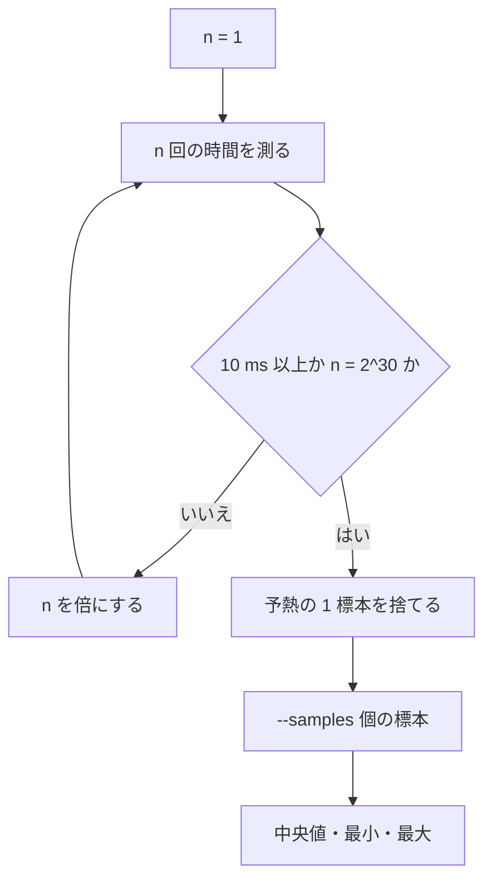

# Bench

`bench "名前" = 本体` は、`tsuzuri bench` が計測するベンチマークの宣言です。標準ライブラリの `Bench` モジュールが、本体を作る `Bench.with_input`・`Bench.of` と、時計 `Bench.now`・最適化の障壁 `Bench.consume` を提供します。結果は準備を除いた 1 回あたりの時間の中央値・最小・最大で、速さの合否の閾値はありません。

## この記事のポイント

- `bench "名前" = 本体` の本体は `i64 -> i64` です。反復回数を受け取り、準備を除いたその回数分の経過ナノ秒を返します。
- 普通は `Bench.of (\_ -> 計算)` か `Bench.with_input 準備 計算` で書きます。
- `tsuzuri bench` は bench ごとに別プロセスで 1 件ずつ、既定の `-O3` で、1 標本が 10 ms になるまで反復回数を倍にし、予熱 1 標本の後に 11 標本を測ります。
- 計算結果は `Bench.consume` に渡ります。使われない計算を LLVM が消して、何も測らない状態を防ぎます。
- `bench` は予約語です。`Bench` はプログラムが名前を書いたときだけ読み込まれる標準モジュールです。ネイティブだけで実行できます。

## ベンチマークを書く

```text
bench "名前" = 本体式
```

`test` 宣言と同じ場所・同じ規則で書きます。`.tz` と `.tc` の宣言部分に置けて、型クラス用の `.tt` やコンパイラに埋め込まれた標準ライブラリには書けません（`E1018`）。`private bench` は `E1022`、`export bench` は `E0002` です。名前は妥当な Unicode 文字列で、空文字や重複も許されます。識別はモジュール名と宣言順の 0 始まりの index です。

本体の型は `i64 -> i64` です。違うと、本体の位置に `E1003` が出ます（例: `bench "bad" = ()` は `expected i64 -> i64, found unit`）。`tsuzuri check` と `tsuzuri build` も bench の本体を型検査しますが、bench の本体と、bench のためだけに特殊化した関数は、通常の成果物にも `tsuzuri test` の実行器にも入りません。

```tsuzuri project=speed file=Speed.tz
def total :: ref [i64] -> i64
fn total values =
    let mut sum = 0
    let mut index = 0
    while index < values.length do
        sum = sum + values[index]
        index = index + 1
    sum

bench "total 1e6" = Bench.with_input (\_ -> new [i64](1000000, \i -> i)) (\values -> total values)
bench "fixed cost" = Bench.of (\_ -> 42)
```

`total 1e6` は標本ごとに 100 万要素の配列を 1 回だけ作り、`total` に借用で渡す時間だけを測ります。配列を作る時間と、標本の終わりにそれを解放する時間は入りません。

## 関数

| 関数 | シグネチャ | 説明 |
| --- | --- | --- |
| `Bench.with_input` | `(unit -> 'a) -> (ref 'a -> 'b) -> i64 -> i64` | 標本ごとに `setup ()` を 1 回呼び、その値を借用で `run` に `n` 回渡します。`run` の結果は毎回 `Bench.consume` に渡ります。準備と値の解放は時間に入りません |
| `Bench.of` | `(unit -> 'b) -> i64 -> i64` | `run ()` を `n` 回呼び、結果を毎回 `Bench.consume` に渡した時間です |
| `Bench.now` | `fn() -> i64`（`Bench.now()` と呼ぶ） | 任意の原点からの単調時計のナノ秒です。`tsuzuri bench` の実行器の中だけで使えます |
| `Bench.consume` | `'a -> unit` | 値を受け取り（move）、最適化器に「この値とそれが指すメモリは観測される」と扱わせてから、通常どおり解放します |

`Bench.with_input` の `run` は値を借用で受けるので、値を書き換える計測は書けません。毎回作り直す計測は、`Bench.of` の中で作ります。

時間の取り方を自分で決めるときは、本体を直接書きます。`Bench.now()` を 2 回呼んだ差が、返す値になります。

```tsuzuri project=custom file=Custom.tz
bench "custom loop" = \n ->
    let start = Bench.now()
    let mut index = 0
    while index < n do
        Bench.consume index
        index = index + 1
    Bench.now() - start
```

時計は、macOS が `clock_gettime_nsec_np(CLOCK_UPTIME_RAW)`、Linux などが `clock_gettime(CLOCK_MONOTONIC)`、Windows が `QueryPerformanceCounter` です。`Bench.consume` はどの出力でも使えます。

### Bench.now を使える範囲

時計の定義は bench の実行器だけが持ちます。`tsuzuri build`・`run`・`test` の出力には、`Bench.now` に到達する関数（直接呼ぶ関数と、`Bench.with_input`・`Bench.of` や他の関数を通して呼ぶ関数）のうち `export` していないものは、公開（既定の可視性）でも、出力のほかの部分が使わない限り入りません。bench の本体の補助関数は、普通の `def` で書けます。

```tsuzuri run=42
def measure :: i64 -> i64
fn measure n =
    let start = Bench.now()
    let mut index = 0
    while index < n do
        Bench.consume index
        index = index + 1
    Bench.now() - start

bench "measured loop" = measure

42
```

次のものから `Bench.now` に到達すると、`tsuzuri bench` 以外の出力は `E1018` です。

- トップレベルのコード（`main`）
- `export def`
- `tsuzuri test` が実行するテスト（`--filter` などで選んだもの）
- `Drop` の実装（値を捨てるどこからでも呼ばれるため）

メッセージは到達の起点と、途中で最後に通る利用者の関数を示し、位置はその関数の中で時計へ向かう式です。

```text
Main.tz:3:17: error[E1018]: Bench.now runs only under tsuzuri bench, but the top-level code reaches it through `Main.measure`; call it only from bench declarations and from functions that only benchmarks use
```

### Bench.consume が要る理由

結果を使わない計算は、`-O3` の LLVM が丸ごと消せます。消えた計算の時間は 0 に近い値で、何も測っていません。`Bench.consume` は値をスタックに置き、そのアドレスを、何もしないがメモリを読み書きしうるインライン asm（`asm sideeffect "", "r,~{memory}"`）に渡します。Rust の `core::hint::black_box` と同じ障壁です。値の計算と、値が指すメモリへの書き込みは残ります。返す値・副作用・評価順序は変えません。native と wasm32 の `-O0`／`-O3` で同じように動きます。

`Bench.with_input` と `Bench.of` は、`run` の結果を自動で `Bench.consume` に渡します。

## 実行する

```text
tsuzuri bench ファイルまたはディレクトリ [--list] [--filter TEXT] [--index N] [--json] [--samples N] [-O0|-O1|-O2|-O3] [--target native]
```

| オプション | 意味 |
| --- | --- |
| `--filter TEXT` | `モジュール名.ベンチ名` の部分一致。外れた件数は `ignored` |
| `--index N` | 宣言順の 0 始まり index だけを実行する（繰り返し可）。範囲外は `E2000` |
| `--list` | 型検査して一覧（`0 Speed.total 1e6` の形）だけ出す。実行しない |
| `--json` | 結果を 1 行 1 JSON で標準出力へ出す |
| `--samples N` | 標本の数。1〜1000、既定 11。範囲外は `E2000` |
| `-O0` から `-O3` | 最適化。既定は `-O3` |
| `--target native` | `native` だけ。`wasm32`／`wasm64` は `E2000` |

リンク入力（`--link`、`-l`、`-L`、`Tsuzuri.toml` の `[native]`）は `tsuzuri test` と同じく実行器に渡ります。`--cpu`、`--coverage`、`--emit`、`--output` は使えません。

### 計測の流れ

各 bench は別プロセスで、1 件ずつ順に動きます（並列には走らせません）。1 件の上限は 300 秒です。

1. 反復回数 `n = 1` から、1 標本の時間が 10 ms 以上になるか `n` が 2<sup>30</sup> になるまで `n` を倍にします。
2. その `n` で 1 標本を捨てます（予熱）。
3. `--samples` の数だけ標本を取ります。各標本は `n` 回分の時間で、1 回あたりの時間は `時間 / n` です。

`n` 回の和を 1 回の差で測るので、時計の分解能の誤差は `1 / n` に縮みます。報告は 1 回あたりの時間の中央値（偶数個なら中央の 2 つの平均）・最小・最大です。



### 報告

文字の報告は bench ごとに 1 行です。単位は中央値の大きさで `ns`・`us`・`ms`・`s` から選び、最小と最大も同じ単位で小数 3 桁です。最後に件数の要約が出ます。

```text
bench 0 Speed.total 1e6: median 312.408 us (min 305.917 us, max 330.142 us; 11 samples of 32 iterations)
bench 1 Speed.fixed cost: median 0.312 ns (min 0.311 ns, max 0.315 ns; 11 samples of 33554432 iterations)

2 benchmarks; 0 failed; 0 ignored
```

数値は機械と負荷で変わります。上の値は書式の例です。

`--json` では、bench ごとの 1 行と最後の summary の 1 行が出ます。bench の行は `type`、`index`、`module`、`name`、`status`、`workload`（`モジュール名.ベンチ名`）、`target`（`native`）、`opt`（`O3` など）、`cpu_mode`（`generic`）、`metric`（`wall_time`）、`unit`（`ms`）、`iterations`、`samples`（各標本の 1 回あたりのミリ秒の配列）、`median`、`min`、`max` の順です。

```text
{"type":"bench","index":1,"module":"Speed","name":"fixed cost","status":"passed","workload":"Speed.fixed cost","target":"native","opt":"O3","cpu_mode":"generic","metric":"wall_time","unit":"ms","iterations":33554432,"samples":[3.12e-7,3.11e-7,3.15e-7],"median":3.12e-7,"min":3.11e-7,"max":3.15e-7}
{"type":"summary","benchmarks":2,"failed":0,"ignored":0}
```

### 失敗と終了コード

本体のトラップ（終了コードやシグナル）、300 秒の時間切れ、負の時間を返した bench は失敗です。ほかの bench は続けて測ります。失敗した行は `bench 2 Speed.traps: failed (trapped or terminated by signal)` の形で、JSON では `"status":"failed","failure":"..."` です。失敗した bench が標準エラーに書いた内容は、その行の下（JSON では `output`）に出ます。失敗ごとに、名前の位置へ `E2005`（`benchmark 'Speed.traps' trapped or terminated by signal`、`timed out after 300000ms`、`returned a negative duration`）が出て、終了コードは 1 です。

| 結果 | 終了コード | 診断 |
| --- | --- | --- |
| すべて計測できた | 0 | なし。速さによる失敗はありません |
| 1 件以上失敗 | 1 | 失敗ごとに `E2005` |
| コマンドラインの誤り（`--samples 0`、`--target wasm32` など） | 2 | `E2000` |
| `--index` が範囲外 | 1 | `E2000` |

## 注意点

- 結果は同じ機械・同じ条件の比較にだけ使います。速度の閾値を CI に入れないでください。共有の CI は負荷が揺れます。
- `Bench.now` の差が負になる本体は失敗です（`returned a negative duration`）。
- WASM の実行器はありません。`Bench.consume` を含むコードは wasm32 でもビルドできますが、`tsuzuri bench --target wasm32` は `E2000` です。
- `Bench` は、プログラムのソースが識別子 `Bench` を含むときだけ読み込まれます。名前を書かないプログラムの型検査と生成コードは変わりません。

## まとめ

- `bench "名前" = 本体` の本体は `i64 -> i64` で、反復回数から準備を除いたナノ秒を返します。
- `Bench.of` と `Bench.with_input` が本体を作り、結果を `Bench.consume` に渡します。
- `tsuzuri bench` は bench ごとに別プロセスで、倍々の較正・予熱・標本の後、1 回あたりの中央値・最小・最大を出します。
- 閾値はなく、失敗はトラップ・時間切れ・負の時間だけです。

## 関連項目

- [Test](test.md)
- [Time](time.md)
- [キーワード](../values-and-functions/keywords.md)
- [コンパイラの使い方](../compiler/usage.md)
- [コンパイラ オプション](../compiler/option.md)
- [診断メッセージとエラーコード](../compiler/diagnostics.md)
- [Tsuzuri の設計戦略](../languages/strategy.md)
- [言語リファレンスの目次](../index.md)
