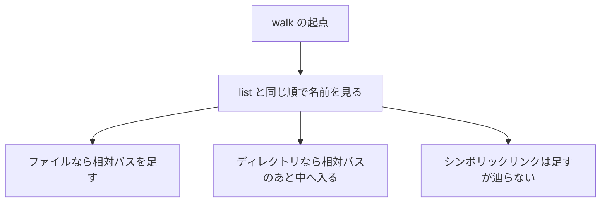

# Dir

`Dir` は、ディレクトリを作る、空にする、名前を列挙するモジュールです。操作は `IO<Result<T, Os.Error>>` で、実行するまで OS は呼びません。パスの連結や親の取り出しは、副作用のない [Path](./path.md) が担当します。

## この記事のポイント

- `create` は 1 階層だけ作ります。親が無いと失敗します。
- `list` は `.` と `..` を除き、UTF-8 のバイト順で返します。
- `walk` は相対パスを、ディレクトリの直後にその中身が続く順で返します。
- `remove` は空のディレクトリだけを消します。
- シンボリックリンクは名前として出しますが、辿りません。

## 作って並べて消す

例は `/tmp/tsuzuri-doc-dir` を使い、最後に消します。`string` はムーブするので、同じパスは複製してから渡します。

```tsuzuri run=ok%0Aalready-exists%0AZ.txt,a,b.txt%0AZ.txt,a,a/x.txt,b.txt%0Aother%0Anot-found%0Aok
def copy :: ref string -> string
fn copy text = Maybe.get (String.slice text 0 text.length)

def names_of :: Result<[string], Os.Error> -> string
fn names_of result =
    match result with
    | Result.Ok names ->
        let separator = ","
        String.join (ref separator) (ref names)
    | Result.Error error -> Os.message (ref error)

def kind_of :: Result<unit, Os.Error> -> string
fn kind_of result =
    match result with
    | Result.Ok _ -> "ok"
    | Result.Error error ->
        match error.kind with
        | Os.AlreadyExists -> "already-exists"
        | Os.NotFound -> "not-found"
        | Os.Other -> "other"
        | _ -> Os.message (ref error)

def main :: unit -> i32 = \() ->
    let root = "/tmp/tsuzuri-doc-dir"
    let! _ = File.remove (copy root + "/a/x.txt")
    let! _ = File.remove (copy root + "/Z.txt")
    let! _ = File.remove (copy root + "/b.txt")
    let! _ = Dir.remove (copy root + "/a")
    let! _ = Dir.remove (copy root)
    let! created = Dir.create (copy root)
    do! IO.write_line (kind_of created)
    let! again = Dir.create (copy root)
    do! IO.write_line (kind_of again)
    let! _inner = Dir.create (copy root + "/a")
    let! _z = File.write_text (copy root + "/Z.txt") "z"
    let! _x = File.write_text (copy root + "/a/x.txt") "x"
    let! _b = File.write_text (copy root + "/b.txt") "b"
    let! listed = Dir.list (copy root)
    do! IO.write_line (names_of listed)
    let! walked = Dir.walk (copy root)
    do! IO.write_line (names_of walked)
    let! full = Dir.remove (copy root)
    do! IO.write_line (kind_of full)
    let! nested = Dir.create "/tmp/tsuzuri-doc-dir-missing/inner"
    do! IO.write_line (kind_of nested)
    let! _ = File.remove (copy root + "/a/x.txt")
    let! _ = File.remove (copy root + "/Z.txt")
    let! _ = File.remove (copy root + "/b.txt")
    let! _ = Dir.remove (copy root + "/a")
    let! removed = Dir.remove (copy root)
    do! IO.write_line (kind_of removed)
    0
```

実行結果:

```text
ok
already-exists
Z.txt,a,b.txt
Z.txt,a,a/x.txt,b.txt
other
not-found
ok
```

`Z.txt` が `a` より前なのは、UTF-8 のバイト順だからです。大文字の `Z` は小文字の `a` より小さいバイトです。ロケールや大文字小文字の同一視はしません。OS が返した生の順も使いません。どのファイルシステムでも、同じ名前なら同じ順になります。

`string` の比較は UTF-16 の符号単位順です。補助平面の文字では、UTF-8 バイト順と並びが違うことがあります。たとえば U+FF61 は、UTF-8 では U+1F600 より前です。

`walk` の各要素は、起点からの相対パスで、区切りは `/` です。ディレクトリの直後に、その中身が続きます。中身の順は、そのディレクトリを `list` したときと同じです。



空でないディレクトリの `remove` は `Other` です。`errno` は OS の `ENOTEMPTY` で、番号は環境で違います。種類で分岐してください。親が無い `create` は `NotFound` です。`mkdir -p` に相当する関数はありません。

## 失敗とシンボリックリンク

| 状況 | `Os.ErrorKind` |
| --- | --- |
| ディレクトリが無い、親が無い | `NotFound` |
| 読めない、消せない | `PermissionDenied` |
| すでに同じ名前のディレクトリがある | `AlreadyExists` |
| ファイルを `list` や `walk` した | `NotFound`（OS はディレクトリではないと言う） |
| NUL を含むパス | `InvalidInput` |
| 名前が UTF-8 でない | `InvalidEncoding` |
| 空でないディレクトリを消した | `Other` |

ファイルを `list` した場合、OS は「ディレクトリではない」（`ENOTDIR`）を返しますが、Tsuzuri では `NotFound` として扱われます。メッセージに含まれる `errno` の値は OS によって異なります。

ディレクトリ内の名前が 1 つでも正当な UTF-8 でない場合、列挙全体が `InvalidEncoding` エラーとなります。読み取れた名前だけを部分的に返すことはありません（macOS の標準ファイルシステムでは、不正な UTF-8 のファイル名を通常作成できません）。

シンボリックリンクは `list` と `walk` の一覧に名前として含まれますが、`walk` はリンク先のディレクトリ内部へ再帰走査しません。そのため、循環参照があっても安全に終了します。リンクをたどって中身を読みたいときは、[File](./file.md) の `read_text` や `metadata` を使います。リンク自身を削除する操作も `File.remove` です。`Dir.remove` は空のディレクトリ専用です。

存在確認だけの関数はありません。作る、読む、消す、その操作の `Result` で判断します。確認してから操作する間に、状態が変わることがあるためです。

## 公開 API

| 関数 | シグネチャ | 説明 |
| --- | --- | --- |
| `Dir.list` | `string -> IO<Result<[string], Os.Error>>` | `.` と `..` を除き、UTF-8 バイト順で名前を返す |
| `Dir.create` | `string -> IO<Result<unit, Os.Error>>` | ディレクトリを 1 つ作る。親は既にある必要がある |
| `Dir.remove` | `string -> IO<Result<unit, Os.Error>>` | 空のディレクトリを消す |
| `Dir.walk` | `string -> IO<Result<[string], Os.Error>>` | 配下を相対パスで返す。途中の失敗で全体が失敗する |

返る名前は `string` です。配列の要素は `Copy` ではないので、`names[0]` をそのまま別の関数へ渡すとムーブできず `E1012` になります。表示するなら `String.join` で配列を借用するか、要素を `String.slice` で複製します。

パスの長さの上限は OS 次第です。長すぎると `InvalidInput` になることがあります。件数や合計サイズの上限は Tsuzuri 側にはありません。メモリが足りないとトラップします。

## 対応環境

既定の wasm32 でこれらの関数に到達すると、ビルドは `E2000` で失敗します。`--wasm-host wasi` では、preopen されたディレクトリを起点に解決します。Windows のネイティブビルドは、OS API に到達すると `E2002` です。これらの環境では本ページの実行例をそのまま実行することはできません。

## まとめ

- `create` は親ディレクトリを自動作成しません。同じ名前がすでにあると `AlreadyExists` です。
- `list` と `walk` の並び順は UTF-8 バイト順であり、ファイルシステムや OS の生の順序ではありません。
- `walk` はシンボリックリンクをたどらないため、循環参照によって無限ループになることはありません。
- 空でないディレクトリの削除は `Other` です。エラーコードの番号より種類を見て判定します。
- ディレクトリ内の名前が 1 つでも正当な UTF-8 でない場合、列挙全体が失敗します。

## 関連項目

- [File](./file.md)
- [Path](./path.md)
- [Os](./os.md)
- [IO](./io.md)
- [言語仕様のファイルとディレクトリ](../../../docs/language.md#ファイルとディレクトリ)
- [言語リファレンスの目次](../index.md)
