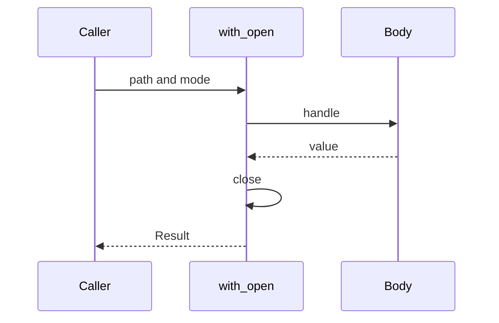

# File

`File` は、ファイルの中身とメタデータを読む・書くモジュールです。操作はすべて `IO<Result<T, Os.Error>>` で、実行するまでシステムコールは出ません。失敗は例外やトラップではなく、`Os.Error` です。

パスは OS に渡す文字列です。相対パスの起点は、そのときの作業ディレクトリです。`..` の解釈も、シンボリックリンクを辿るかどうかも、OS が決めます。

## この記事のポイント

- 全体を一括で扱う関数と、`File.Handle` で部分的に読み書きする関数があります。
- `string` は `Copy` ではありません。同じパスを何度も渡すなら、リテラルを繰り返すか複製します。
- `write_text` と `write_bytes` は切り詰めてから書くため、途中でクラッシュすると中途半端なファイルが残ります。
- ハンドルは自動では閉じません。`close` か `with_open` を使います。
- 存在確認だけの関数はありません。目的の操作を実行し、`Result` で分岐します。

## テキストを書いて読み戻す

例は `/tmp` に書き、最後に削除します。チェックをリポジトリのルートで走らせても、リポジトリ内には残りません。

`File.write_text` にパスを渡すと、その `string` の所有権が移ります。あとで同じパスを使うために、全文を複製しています。`Maybe.get` がトラップするのは範囲が不正なときだけです。文字列全体のスライスでは起きません。

```tsuzuri run=hello%0Ahello%0Aworld%0Aremoved%0Anot%20found%20(os%20error%202)
def copy :: ref string -> string
fn copy text = Maybe.get (String.slice text 0 text.length)

def show :: Result<string, Os.Error> -> string
fn show result =
    match result with
    | Result.Ok value -> value
    | Result.Error error -> Os.message (ref error)

def main :: unit -> i32 = \() ->
    let path = "/tmp/tsuzuri-doc-file-note.txt"
    let! _ = File.remove (copy path)
    let! _wrote = File.write_text (copy path) "hello\n"
    let! first = File.read_text (copy path)
    do! IO.write (show first)
    let! _appended = File.append_text (copy path) "world"
    let! both = File.read_text (copy path)
    do! IO.write_line (show both)
    let! removed = File.remove (copy path)
    do! IO.write_line (match removed with
        | Result.Ok _ -> "removed"
        | Result.Error error -> Os.message (ref error))
    let! missing = File.read_text (copy path)
    do! IO.write_line (show missing)
    0
```

実行結果:

```text
hello
hello
world
removed
not found (os error 2)
```

`read_text` はファイル全体を UTF-8 として読みます。改行も残るので、最初の `IO.write` のあとに `hello` と改行が出ます。`append_text` は無ければ作り、あれば末尾へ足します。`remove` のあとにもう一度読むと、`NotFound` です。macOS でも Linux でも、このときの `errno` は `2`（`ENOENT`）です。

作っただけで実行しないアクションは、ファイルを作りません。`let _unused = File.write_text "note.txt" "x"` のように捨てた値は、システムコールを出しません。

## バイト列、BOM、メタデータ

`read_bytes` と `write_bytes` は UTF-8 を検査しません。`read_text` は検査し、不正ならファイルの一部だけを返すのではなく、呼び出し全体が `InvalidEncoding` になります。先頭の BOM（U+FEFF）は残します。

```tsuzuri run=true%202%0Ainvalid%20encoding%0A1%0Afile%201%0Aremoved
def copy :: ref string -> string
fn copy text = Maybe.get (String.slice text 0 text.length)

def main :: unit -> i32 = \() ->
    let path = "/tmp/tsuzuri-doc-file-bin.bin"
    let! _ = File.remove (copy path)
    let! _bom = File.write_bytes (copy path) [239ubyte, 187ubyte, 191ubyte, 65ubyte]
    let! text = File.read_text (copy path)
    do! IO.write_line (match text with
        | Result.Ok value -> to_string (value[0] == 65279i16u) + " " + to_string value.length
        | Result.Error error -> Os.message (ref error))
    let! _raw = File.write_bytes (copy path) [255ubyte]
    let! bad = File.read_text (copy path)
    do! IO.write_line (match bad with
        | Result.Ok _ -> "unexpected"
        | Result.Error error -> Os.message (ref error))
    let! bytes = File.read_bytes (copy path)
    do! IO.write_line (match bytes with
        | Result.Ok data -> to_string data.length
        | Result.Error error -> Os.message (ref error))
    let! meta = File.metadata (copy path)
    do! IO.write_line (match meta with
        | Result.Ok info ->
            match info.kind with
            | File.Regular -> "file " + to_string info.size
            | File.Directory -> "dir"
            | File.Symlink -> "link"
            | File.Other -> "other"
        | Result.Error error -> Os.message (ref error))
    let! removed = File.remove (copy path)
    do! IO.write_line (match removed with
        | Result.Ok _ -> "removed"
        | Result.Error error -> Os.message (ref error))
    0
```

実行結果:

```text
true 2
invalid encoding
1
file 1
removed
```

`239, 187, 191` は UTF-8 の BOM で、続く `65` は `A` です。文字数は 2 です。そのあと `255` だけを書くと、`read_text` は `invalid encoding`（`code` は 0）になり、`read_bytes` は 1 バイトを返します。`metadata` の `size` は、そのファイルのバイト数です。ディレクトリの `size` は中身の合計ではありません。

`modified_ns` は 1970-01-01 UTC からのナノ秒です。`i64` に収まらない時刻は、上限か下限へ丸められます。時刻そのものは実行のたびに変わるので、上の例では種類とサイズだけを見ています。

## ハンドルで少しずつ読む

`with_open` は、本体が失敗しても戻る前に閉じます。閉じる処理だけが失敗したときは、本体の値ではなくそのエラーが外側に出ます。




大きなファイルや、終わりまで読む処理には `File.open` を使います。

| モード | 意味 |
| --- | --- |
| `File.Read` | 既存のファイルを読む |
| `File.Write` | 作るか、既存の中身を切り詰めて書く |
| `File.Append` | 作るか、末尾へ足す |
| `File.CreateNew` | まだ無いときだけ作る。あると `AlreadyExists` |

`File.read handle count` は最大 `count` バイトです。空配列はファイルの終端（EOF）を意味します。`count` より短くても、まだ終わりとは限りません。`count` が負、または 2^30 を超えると `InvalidInput` です。`Read` 以外のハンドルを読むのも、`Read` のハンドルへ書くのも `InvalidInput` です。

`File.write` は渡したバイトをすべて書きます。ランタイムはファイル用のバッファを持たないので、`write` が成功した時点で OS へ渡っています。`File.flush` はハンドルがまだ有効かを確認するだけで、追加の書き出しはしません。

```tsuzuri run=wrote%0Ahi%0Aalready%20exists%20(os%20error%2017)%0Aremoved
def copy :: ref string -> string
fn copy text = Maybe.get (String.slice text 0 text.length)

def main :: unit -> i32 = \() ->
    let path = "/tmp/tsuzuri-doc-file-stream.txt"
    let! _ = File.remove (copy path)
    let! outcome = File.with_open (copy path) File.Write (\handle ->
        File.write handle [104ubyte, 105ubyte])
    do! IO.write_line (match outcome with
        | Result.Ok (Result.Ok _) -> "wrote"
        | Result.Ok (Result.Error error) -> Os.message (ref error)
        | Result.Error error -> Os.message (ref error))
    let! text = File.read_text (copy path)
    do! IO.write_line (match text with
        | Result.Ok value -> value
        | Result.Error error -> Os.message (ref error))
    let! again = File.open (copy path) File.CreateNew
    do! IO.write_line (match again with
        | Result.Ok _ -> "unexpected"
        | Result.Error error -> Os.message (ref error))
    let! removed = File.remove (copy path)
    do! IO.write_line (match removed with
        | Result.Ok _ -> "removed"
        | Result.Error error -> Os.message (ref error))
    0
```

実行結果:

```text
wrote
hi
already exists (os error 17)
removed
```

`104, 105` は `hi` です。`with_open` の戻り値は `Result<本体の結果, Os.Error>` です。本体が `File.write` だと、本体の結果も `Result` なので、成功は `Ok (Ok ())` と二重になります。外側の `Error` は、開くか閉じるのに失敗したときです。本体の失敗は内側に残ります。

`CreateNew` は、すでにファイルがあると `AlreadyExists` です。macOS と Linux では `os error 17`（`EEXIST`）になります。

> [!WARNING]
> `with_open` は本体のあとで必ず `close` します。本体の中でも `close` すると、外側のクローズが `InvalidInput` になり、本体の値は捨てられます。閉じるのはどちらか一方にしてください。

閉じたハンドルは、その後の `read`、`write`、`close` が `InvalidInput` です。別のファイルの記述子と取り違えることはありません。閉じ忘れたハンドルは、プロセスの終了時に OS が解放します。

## 失敗したときの形

戻り値は `IO<Result<T, Os.Error>>` です。アクションを組み立てただけでは失敗も成功も決まりません。実行して `match` します。`Result.get` は `Error` だとトラップするので、回復するなら使わないでください。

よくある対応は次のとおりです。数値は OS の `errno` なので、種類の方が安定しています。

| 状況 | `Os.ErrorKind` |
| --- | --- |
| ファイルが無い | `NotFound` |
| 権限が無い | `PermissionDenied` |
| `CreateNew` の対象がすでにある | `AlreadyExists` |
| ディレクトリをファイルとして開く、NUL を含むパス、範囲外の `count` | `InvalidInput` |
| 孤立サロゲート、`read_text` の不正な UTF-8 | `InvalidEncoding` |
| ディスク不足や空でない対象など、上に当てはまらない失敗 | `Other` |

パスや本文の孤立サロゲートは、システムコールの前に `InvalidEncoding`（`code` は 0）で失敗します。ファイルは作られません。NUL を含むパスは `InvalidInput`（`code` は 0）です。

`File.remove` はファイルかシンボリックリンク自身を消します。リンク先は残します。ディレクトリを `File.remove` しても消えません。空のディレクトリは [Dir](./dir.md) の `Dir.remove` です。

シンボリックリンクは、`read_text` や `metadata` では辿ります。`link_metadata` はリンク自身を見ます。切れたリンクは、辿る側が `NotFound`、`link_metadata` は `Symlink` です。Tsuzuri からリンクを作る関数はないので、この区別は既存のリンクに対する契約です。

## 公開 API

| 関数 | シグネチャ | 説明 |
| --- | --- | --- |
| `File.read_bytes` | `string -> IO<Result<[ubyte], Os.Error>>` | ファイル全体をバイト列で読む |
| `File.read_text` | `string -> IO<Result<string, Os.Error>>` | ファイル全体を UTF-8 として読む。BOM は残す |
| `File.write_bytes` | `string -> [ubyte] -> IO<Result<unit, Os.Error>>` | 作るか切り詰めて、バイト列を書く |
| `File.write_text` | `string -> string -> IO<Result<unit, Os.Error>>` | 作るか切り詰めて、UTF-8 で書く |
| `File.append_text` | `string -> string -> IO<Result<unit, Os.Error>>` | 無ければ作り、UTF-8 を末尾へ足す |
| `File.remove` | `string -> IO<Result<unit, Os.Error>>` | ファイルかシンボリックリンクを消す |
| `File.open` | `string -> File.Mode -> IO<Result<File.Handle, Os.Error>>` | ハンドルを開く。同じファイルを何度も開ける |
| `File.read` | `File.Handle -> i64 -> IO<Result<[ubyte], Os.Error>>` | 最大 `count` バイト読む。空配列は終わり |
| `File.write` | `File.Handle -> [ubyte] -> IO<Result<unit, Os.Error>>` | バイト列をすべて書く |
| `File.flush` | `File.Handle -> IO<Result<unit, Os.Error>>` | ハンドルが有効かを確認する |
| `File.close` | `File.Handle -> IO<Result<unit, Os.Error>>` | 閉じる。失敗してもハンドルは無効になる |
| `File.with_open` | `Capture<'a> => string -> File.Mode -> (File.Handle -> IO<'a>) -> IO<Result<'a, Os.Error>>` | 開いて本体を実行し、戻る前に閉じる |
| `File.metadata` | `string -> IO<Result<File.Metadata, Os.Error>>` | リンクを辿って、種類・サイズ・更新時刻を返す |
| `File.link_metadata` | `string -> IO<Result<File.Metadata, Os.Error>>` | リンク自身を説明する |

`File.Mode` は `Read`、`Write`、`Append`、`CreateNew` です。

`File.Handle` は不透明な `Copy` 値です。`File.Handle { id: 1 }` のような構築や、フィールドの読み取りは `E1022` です。標準ライブラリの型は `Drop` を実装できないので、ハンドルを捨てても閉じません。

`File.EntryKind` は `Regular`、`Directory`、`Symlink`、`Other` です。`Symlink` が返るのは `link_metadata` だけです。`Other` はデバイス、ソケット、パイプなどです。

```text
record Metadata { kind: EntryKind, size: i64, modified_ns: i64 }
```

このレコードのフィールドは読めます。`modified_ns` は 1970-01-01 UTC からのナノ秒です。

## 所有権と対応環境

パスの `string` は所有権がムーブします。バイト列の `[ubyte]` は `Copy` なので、`File.write` に渡したあとも変数は残ります。大きな配列はディープコピーされるため、コピーのコストに注意してください。

ハンドルも `Copy` です。コピーした値は同じ開いたファイルを指します。片方を閉じると、もう片方も無効になります。

既定の wasm32 では、これらの関数に到達するコードは `E2000` でビルドに失敗します。`check` は IR を出さないので、このエラーは報告しません。`--wasm-host wasi` を付けると、WASI preview1 の preopen したディレクトリを起点に解決します。Windows のネイティブビルドは、OS API に到達すると `E2002` で失敗します。これらの環境では本ページの実行例をそのまま実行することはできません。

純粋なパス操作は [Path](./path.md)、ディレクトリの作成と列挙は [Dir](./dir.md)、エラーの読み方は [Os](./os.md) です。

## まとめ

- ファイル操作は遅延した `IO<Result<T, Os.Error>>` です。実行した回数だけ OS を呼びます。
- テキストは UTF-8 です。BOM は残り、不正なバイト列は呼び出し全体が失敗します。
- 上書きは原子的ではありません。ハンドルは `with_open` か `close` で閉じます。
- 同じパスを再利用するときは `string` を複製します。ハンドルのフィールドは触れません。
- 既定の WASM と、未検証の Windows ネイティブビルドでは、これらの API に到達できません。

## 関連項目

- [IO](./io.md)
- [Dir](./dir.md)
- [Path](./path.md)
- [Os](./os.md)
- [Net](./net.md)
- [所有権とムーブ](../ownership-and-memory/ownership.md)
- [Drop とリソースの解放](../ownership-and-memory/drop.md)
- [言語仕様のファイルとディレクトリ](../../../docs/language.md#ファイルとディレクトリ)
- [言語リファレンスの目次](../index.md)
