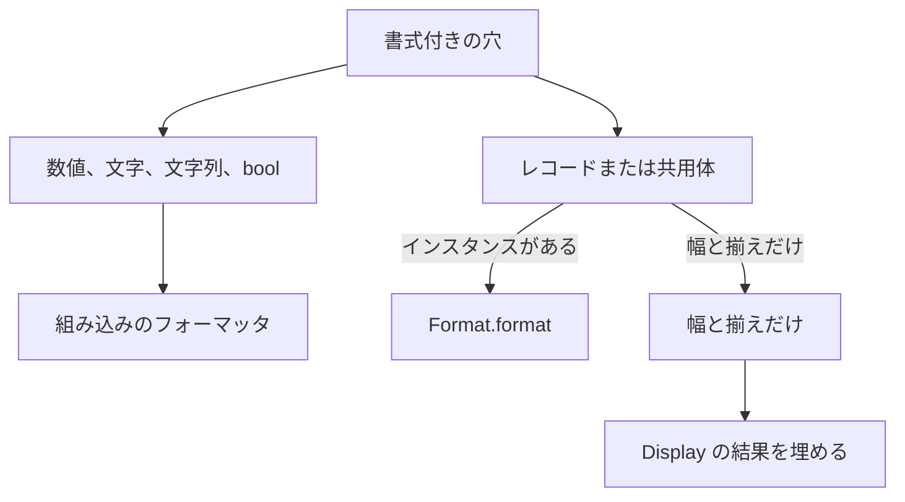

# Format

`Format` は、値を文字列へ変換・整形する型クラスや関数、および書式指定を解析・適用する補助機能をまとめた標準モジュールです。補間文字列の穴 `{value:spec}` で使用される書式仕様もここで定義されています。補間構文の詳細については [補間文字列](../literals-and-strings/interpolated-strings.md) を参照してください。

値の文字列化は `Display`、文字列からの復元は `Parse` が担います。両者は失敗時の挙動が異なります。`Display` が実装されていない型を文字列化しようとするとコンパイルエラー（`E1005`）となり、`Parse` の解析失敗は実行時に `None` を返します。

## この記事のポイント

- `Display.display` は共有借用、`to_string` は所有権を消費します。結果はいずれも `string` です。
- `Parse.parse` は入力文字列全体を厳密に照合し、失敗時は `None` を返します（トラップしません）。
- 書式文法は `[[fill]align][+][width][.precision][type]` です。
- `Format.parse` は書式文字列を `Maybe<Spec>` に分解し、`Format.pad` が幅と揃えを適用します。
- 数値の丸めは最近接偶数で 1 回だけ行われ、ネイティブと WebAssembly でビット同一の文字列になります。

## 表示

```text
Display.display : ref 'a -> string
to_string : Display<'a> => 'a -> string
```

`Display.display` は値を共有借用し、新しい `string` を返します。`to_string` は値を消費してから、同じ `Display` で文字列にします。`string` の `to_string` は、内部バッファの所有権をそのまま返すので、余分なコピーはしません。

組み込みの `Display` があるのは、数値、`string`、`utf8string`、`bool`、`unit`、`char`、`utf8char` です。配列、リスト、タプルは要素の表示をつないで構造的に表示します。それ以外は、`instance Display<型>` か `deriving (Display)` が必要です。無いと `E1005` です。組み込みインスタンスの上書きは `E1016` です。

| 型 | 表示 |
| --- | --- |
| 整数 | 符号と 10 進数字だけ |
| `f16` `f32` `f64` `f128` | 同じ型へ戻せる最短の桁。`0.1` は `0.1`、`1.0` は `1` |
| decimal | 正確な 10 進。末尾の不要なゼロは省く。`0.10m` は `0.1` |
| ゼロ | 正は `0`、負は `-0` |
| 無限大と NaN | `inf` / `-inf` / `nan`。ペイロードは残らない |
| `bool` | `true` / `false` |
| `unit` | `()`。コンソールの最後の式としては何も出ない |
| `char` | 1 コード単位。引用符は付かない |
| `utf8char` | UTF-16 の `string`。補助平面は 2 コード単位 |
| `string` | 中身そのもの。孤立サロゲートも保持する |
| `utf8string` | UTF-16 へ変換した `string` |

極端に大きい、または小さい有限値は指数表記になります。正規化した指数が -6 未満、または有効桁 + 6 以上のときです。指数は小文字の `e`、符号、先頭ゼロのない指数です。`1000000.0` は `1000000`、`10000000.0` は `1e+7` です。

この変換はロケールも C の `printf` も使いません。ネイティブと WebAssembly で同じ桁になります。

```tsuzuri run=text%3D0.1%20back%3D0.1%20neg0%3D-0%20hex%3D255%20bad%3Dnone
let text = to_string 0.1
let back: Maybe<f64> = Parse.parse (ref text)
let value = match back with
    | Some number -> to_string number
    | None -> "none"
let hex: Maybe<i32> = Parse.parse (ref "0xff")
let hex_text = match hex with
    | Some number -> to_string number
    | None -> "none"
let bad: Maybe<i32u> = Parse.parse (ref "-1")
let bad_text = match bad with
    | Some _ -> "some"
    | None -> "none"
$"text={text} back={value} neg0={to_string (-0.0)} hex={hex_text} bad={bad_text}"
```

実行結果:

```text
text=0.1 back=0.1 neg0=-0 hex=255 bad=none
```

## 解析

```text
Parse.parse : ref string -> Maybe<'a>
```

入力の `string` は消費しません。成功は `Some`、失敗は `None` です。診断にもトラップにもなりません。前後の空白、空文字列、途中までの一致は認めません。数字と区切りは ASCII だけです。非 ASCII や、長さが 4096 コード単位を超える入力は `None` です。

組み込みの `Parse` があるのは、数値、`bool`、`char`、`utf8char` です。`string`、`utf8string`、`unit` にはありません。`deriving (Parse)` もありません。ユーザー定義の具象型には `instance Parse<型>` を書けます。

| 型 | 受け付ける文字列 |
| --- | --- |
| 整数 | 省略できる `+` / `-` と 10 進、または小文字の `0x` / `0b` と数字 |
| 浮動小数点と decimal | 省略できる符号、数字、省略できる小数点と指数。`1.` や `.5` も解析では可 |
| 特殊値 | 小文字の `inf` / `nan`。符号は省略できる。NaN は quiet NaN になる |
| `bool` | `true` または `false` だけ |
| `char` | ちょうど 1 コード単位 |
| `utf8char` | ちょうど 1 スカラー |

`_` は数字と数字の間だけです。`1_000` は成功、`1_` や `0x_1` は `None` です。大文字の `0X`、`0B`、`INF`、`NaN` も `None` です。符号なし整数の `-` は、`-0` を含めて `None` です。範囲外の整数も `None` です。

有限の浮動小数点は、目的の型へ最近接偶数で 1 回だけ解析されます。オーバーフローして無限大になる入力は `None`、アンダーフローは成功です。無限大を作れるのは `inf` という文字列だけです。

型変数のまま `Parse.parse` を呼ぶと `E1015` です。`let number: Maybe<i64> = Parse.parse (ref text)` のように、結果の型を書いてください。

## 書式の型

穴の書式を、インスタンスの中で分解するための型です。`deriving (Eq)` が付いています。

```text
union Align = AlignAuto | AlignLeft | AlignCenter | AlignRight
union Kind = KindPlain | KindLowerHex | KindUpperHex | KindOctal | KindBinary | KindExponent | KindFixed
record Spec { fill: string, align: Align, plus: bool, width: i64, precision: i64, kind: Kind }
```

| 名前 | 意味 |
| --- | --- |
| `AlignAuto` | 書式に揃えが無い。パディングでは左寄せ |
| `AlignLeft` / `AlignCenter` / `AlignRight` | `<` / `^` / `>` |
| `KindPlain` | 種別が無い |
| `KindLowerHex` から `KindBinary` | `x` / `X` / `o` / `b` |
| `KindExponent` / `KindFixed` | `e` / `f` |
| `fill` | 埋め文字 1 スカラー。無ければ空白 |
| `width` | 最小幅。無ければ 0 |
| `precision` | 小数桁。無ければ -1 |
| `plus` | `+` が書かれていれば真 |

`Spec` は通常のレコードなので、自分で `Spec { ... }` と作ることもできます。

## parse と pad

```text
parse : ref string -> Maybe<Spec>
pad : ref Spec -> string -> string
```

`parse` は共有借用です。空文字列は、幅 0、精度 -1、揃え自動の `Spec` です。次のときは `None` で、トラップしません。

- `{`、`}`、`"`、`\`、改行、復帰、孤立サロゲートを埋め文字にしている
- 幅や精度が 4096 を超える、幅が `04` のように 0 で始まる、精度が `.05` のように余分な 0 で始まる
- 文法の残りが余っている

精度と種別の組み合わせは見ません。`.2x` も、文法として読めれば `Some` です。補間の穴は、型に合わない指定をコンパイル時に拒否するので、穴から渡される文字列は常に妥当です。直接 `parse` するときは `None` を扱ってください。O(書式の長さ) です。

`pad` は `Spec` を借用し、文字列の所有権を受け取ります。幅を Unicode スカラー数で数え、足りなければ `fill` で埋めます。`AlignAuto` と左寄せは左、右寄せは右、中央は不足分の半分（切り捨て）を左に置きます。すでに幅以上なら、埋め文字が複数コード単位でもそのまま返します。O(結果の長さ) です。確保に失敗するとトラップします。

`pad` は `+` や精度、基数を解釈しません。数値の整形は呼び出し側が行い、最後に幅だけを任せます。

```tsuzuri run=%5B%2A%2A%2A%2Aok%5D%20width%3D6%20plus%3Dfalse%20precision%3D-1
let spec = Format.parse "*>6"
match spec with
| Some parsed ->
    let text = Format.pad (ref parsed) "ok"
    $"[{text}] width={parsed.width} plus={parsed.plus} precision={parsed.precision}"
| None -> "none"
```

実行結果:

```text
[****ok] width=6 plus=false precision=-1
```

## 型クラスとしての Format

```text
Format.format : ref 'a -> ref string -> string
```

実装できるのは、そのプログラムで宣言したレコードと共用体だけです。`instance Format<i64>` や標準ライブラリの型への実装は `E1016` です。`Format` は予約された型クラス名で、モジュール名でもあります。`deriving (Format)` はありません。

補間穴は、インスタンスがあるとき、または書式に `+`、精度、`type` があるときに `Format.format` を呼びます。後者でインスタンスが無いと `E1005` です。幅と揃えだけなら、インスタンスが無くても `Display` の結果をコンパイラが埋めます。渡される書式文字列は正規化済みで、既定の空白は除かれています。余白を埋める責任はインスタンスにあります。

動的に作った書式を渡すときは、穴ではなく `Format.format value (ref spec)` を直接呼びます。ジェネリックな関数では `Format<'a> =>` を制約に書きます。



数値の書式を自分で再現する必要はありません。組み込みの穴が、同じ丸めをネイティブと WebAssembly の両方で行います。インスタンスは、`parse` でフラグを読み、本文を作り、`pad` で幅を合わせる、という分担が簡単です。

## 注意点

> [!WARNING]
> `Parse.parse` は型注釈が無いと `E1015` になります。`Maybe<i64>` のように、復元したい型を書いてください。

> [!NOTE]
> コンソールは表示結果を UTF-8 で書き、改行を足します。孤立サロゲートを含む `string` をそのまま出すとトラップします。`unit` だけは、最後の式としても何も出ません。

## まとめ

- `Display.display` は借用、`to_string` は消費、`Parse.parse` は失敗を `None` にします。
- 数値の表示と解析は、ロケールに依存せず、ネイティブと WebAssembly で同じです。
- `Format.parse` は文法だけを見て、`Format.pad` は幅と揃えだけを適用します。
- 独自の書式は、自分で宣言したレコードか共用体の `Format` で受けます。
- 穴の詳細な丸め表は、補間文字列のページにあります。

## 関連項目

- [補間文字列](../literals-and-strings/interpolated-strings.md)
- [文字列](../literals-and-strings/strings.md)
- [型クラス](../types-and-type-inference/type-classes.md)
- [Maybe](maybe.md)
- [言語リファレンスの目次](../index.md)
