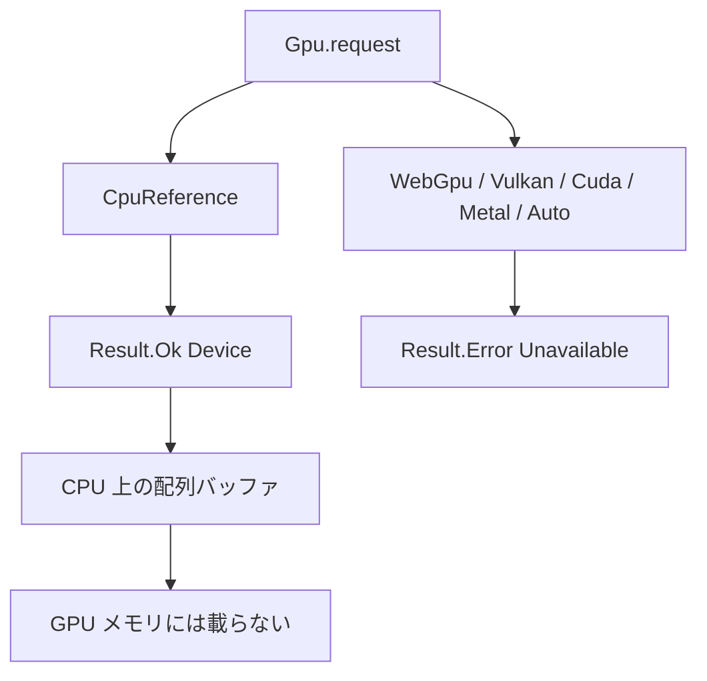

# Gpu

> [!WARNING]
> `Gpu` は実験的です。カーネルの抽出、CPU 上の参照実装、WGSL の生成（厳密な整数と、名前で選ぶ緩い `f32`）と、Node.js 向けの WebGPU ホスト試作までを対象としています。通常の `tsuzuri build` が GPU ランタイムをリンクすることはありません。GPU 上の結果は、Apple M1 Max の Dawn（Metal）で確かめた範囲のものです。

将来の GPU オフロード機能に向けて、ホスト側のバッファ管理 API および WebGPU 向けシェーダーコード生成を実験的に検証するためのモジュールです。デバイス要求において `CpuReference` 以外を指定した場合はすべて失敗します。明示的な GPU 要求を暗黙に CPU 実行へ切り替えて成功扱いにすることはありません。

言語ランタイムからの実 GPU 実行は [F09](../../../_features/F09-gpu-float-runtime.md) の Phase 2 として計画中です。計画中の構文は、このページの実行例には入れていません。

## この記事のポイント

- `Gpu.request Gpu.CpuReference` だけが `Result.Ok` です。`Auto` も CPU へのフォールバックではありません。
- `Device` と `Buffer` は不透明で、Copy ではありません。デバイスは `ref` で渡し、バッファは `map` と `to_array` が消費します。
- `--emit wgsl` が受け付けるのは、`export` された `i32 -> i32` か `i32u -> i32u` のカーネル 1 つです。除算と浮動小数点は拒否します。
- `f32` を GPU で使うには、名前に `relaxed` を持つ `Gpu.init_relaxed`・`Gpu.map_relaxed` と `--emit wgsl-relaxed` を選びます。GPU の結果は厳密ではありません。CPU 参照は、`Gpu.map` と同じ厳密な結果を返します。
- CPU 参照バッファは普通の配列です。GPU メモリに載っている、とは主張しません。

## CPU 参照で二乗を足す

```tsuzuri run=18
let device = Result.get (Gpu.request Gpu.CpuReference)
let buffer = Gpu.init (ref device) 4 (\index -> index * index)
let mapped = Gpu.map (ref device) (\value -> value + 1) buffer
let values = Gpu.to_array mapped
Array.sum ref values
```

実行結果:

```text
18
```

`index` は `i32`、`count` は `i64` です。`0*0+1` から `3*3+1` までを足して 18 です。`Gpu.map` は入力バッファを消費するので、`buffer` はもう使えません。結果が要るときは `Gpu.to_array` で配列に戻します。



他のバックエンドは、今はすべて `Unavailable` です。

```tsuzuri run=0
match Gpu.request Gpu.Auto with
| Result.Ok _device -> 1
| Result.Error _error -> 0
```

実行結果:

```text
0
```

`Auto` は「使えるものを選ぶ」ではありません。明示した GPU バックエンドを、黙って CPU の成功にしないための失敗です。

## 型と関数

`std/Gpu.tz` の公開面は次のとおりです。レコードのフィールドは不透明なので、`device.backend` や `buffer.values` は `E1022` です。

| 名前 | シグネチャ | 説明 |
| --- | --- | --- |
| `Gpu.Backend` | 共用体 | `CpuReference`、`WebGpu`、`Vulkan`、`Cuda`、`Metal`、`Auto` |
| `Gpu.Error` | 共用体 | `Unavailable` だけ |
| `Gpu.Device` | 不透明レコード | Copy ではない。`ref` で渡す |
| `Gpu.Buffer<'a>` | 不透明レコード | Copy ではない。中身はホストの配列 |
| `Gpu.request` | `Backend -> Result<Device, Error>` | `CpuReference` だけ成功 |
| `Gpu.backend` | `ref Device -> Backend` | 要求したバックエンドを返す。`Eq` はないので `match` する |
| `Gpu.init` | `ref Device -> i64 -> (i32 -> 'a) -> Buffer<'a>` | 添字からバッファを作る。範囲外の長さはトラップ |
| `Gpu.map` | `Copy<'a> => ref Device -> ('a -> 'b) -> Buffer<'a> -> Buffer<'b>` | バッファを消費して変換する |
| `Gpu.init_relaxed` | `ref Device -> i64 -> (i32 -> 'a) -> Buffer<'a>` | `Gpu.init` と同じ。コールバックに緩い `f32` カーネルの規則をかける |
| `Gpu.map_relaxed` | `Copy<'a> => ref Device -> ('a -> 'b) -> Buffer<'a> -> Buffer<'b>` | `Gpu.map` と同じ。コールバックに緩い `f32` カーネルの規則をかける |
| `Gpu.from_array` | `Copy<'a> => ref Device -> ref ['a] -> Buffer<'a>` | 配列を複製してバッファにする |
| `Gpu.to_array` | `Buffer<'a> -> ['a]` | バッファを消費して配列を返す |

CPU 参照バッファの要素型は `i32`、`i32u`、`i64`、`i64u`、`f32`、`f64` です。標準の配列と同じアロケータで解放します。`init` の `count` は 0 以上 2,147,483,647 以下です。範囲外は `assert` によるトラップで、`Result` にはなりません。

`init`、`map`、`from_array`（と `init_relaxed`、`map_relaxed`）は、その場で全部の引数を渡して呼ぶ必要があります。`let make = Gpu.init` は `E1018` です。コールバックは、捕捉のない静的な関数かラムダに限ります。使えるのはスカラーの局所変数、算術、比較、キャスト、`if`、既知の関数呼び出しです。

ヒープ確保、借用、ホスト関数、タスク、ループ、再帰、`assert`、未知の関数値は `E1018` です。カーネル抽出の入れ子 128、関数呼び出し 1024、式 65536 を超えると `E1017` です。CPU 参照の実行そのものは `Array.init` と `Array.map` なので、WGSL に出せない `f32` のバッファも、この参照実装では作れます。出せることと、CPU で試せることの範囲が違います。

## WGSL を出す

専用のソースに、`export` した 1 引数のスカラー関数を置きます。

```tsuzuri
export def square :: i32 -> i32
fn square value = value * value
```

このファイルだけのプロジェクトで、ターゲットも最適化も付けずに出します。

```sh
tsuzuri build Kernel.tz --emit wgsl -o kernel.wgsl
```

`-O`、`--target`、`--cpu` を付けると `E2000` です。`export` が 1 つでなければ `E2004` です。メッセージは「WGSL output requires exactly one exported scalar kernel」です。

生成されるシェーダーは、この版では次の形です。`i32` の二乗カーネルで確認しました。

- `@workgroup_size(256)` のコンピュートシェーダーです。
- エントリーポイントは `map_main` と `init_main` の両方が出ます。
- `binding(0)` が入力の storage、`binding(1)` が出力の storage、`binding(2)` が長さの uniform です。
- `init_main` は呼び出し ID をカーネルに渡し、`binding(0)` は読みません。宣言自体はシェーダーテキストに残ります。
- 整数の加減乗算は折り返しです。`i32` の乗算は、符号なしへ bitcast してから掛け、戻します。シフト量は下位 5 bit でマスクします。

除算と剰余は、WGSL と Tsuzuri のトラップの差を吸収できないため `E1018` です。`value / 2` は `tsuzuri check` は通り、`--emit wgsl` で拒否されます。

`f32` や `i64` の `export` も、`--emit wgsl` では `E1018` です。メッセージは「strict WebGPU kernels require i32 or i32u buffer lanes; 64-bit lanes are unavailable and f32 lanes need --emit wgsl-relaxed」です。WGSL に 64 bit 整数がなく、浮動小数点はハードウェアごとに FMA や非正規化数の扱いが違うためです。CPU 参照実装の数値契約は、この拒否では変わりません。`f32` を局所変数に持つ `i32` のカーネルも、厳密な出力では同じ `E1018` です。

## 緩い f32 カーネル

厳密な言語の `f32` は、再結合も暗黙の FMA もなく、非正規化数・NaN・符号付きゼロを保ちます。WGSL はこれらを保証しないので、GPU の `f32` は別の名前で選びます。選ぶのは利用者で、`Gpu.map` や `--emit wgsl` が黙って緩い意味に切り替わることはありません。

| 厳密 | 緩い |
| --- | --- |
| `Gpu.init`、`Gpu.map` | `Gpu.init_relaxed`、`Gpu.map_relaxed` |
| `--emit wgsl` | `--emit wgsl-relaxed` |

```tsuzuri run=16
let device = Result.get (Gpu.request Gpu.CpuReference)
let generated = Gpu.init_relaxed (ref device) 8 (\index -> (index as f32) * 0.5 + 0.25)
let values = Gpu.to_array generated
Array.sum ref values
```

実行結果:

```text
16
```

CPU 参照の結果は、`Gpu.init` と `Gpu.map` と同じく厳密です。`0.25 + 0.75 + … + 3.75` は `f32` で正確に足せるので 16 です。緩い名前を使っても、CPU 参照では native と WebAssembly の `-O0`・`-O3` が、`Gpu.map` とビット単位で一致します。

緩い `f32` の契約です。この API と `--emit wgsl-relaxed` の中だけに適用します。

1. CPU 参照は、厳密な規則でカーネルを評価します。厳密な結果は、緩い規則が許す結果の一つです。
2. `--emit wgsl-relaxed` の shader を GPU で動かすと、`a * b + c` を一回丸めの積和にしたり、`+`・`*` の結合と順序を変えたり、非正規化数の入力・中間値・結果をどちらかの符号のゼロにしたり、`/` を WGSL の精度（2.5 ulp）で計算したり、整数から `f32` への変換を隣り合う二つの値のどちらかにしたりすることがあります。
3. 入力・中間値・結果のどれかが NaN・無限大、またはオーバーフローしたとき、その要素の結果は未規定の `f32`（比較なら未規定の `bool`）です。トラップはせず、ほかの要素には影響しません。`f32` に依存する分岐と、その先の整数結果が変わることがあります。
4. 整数の値と演算は、厳密な場合と同じ意味を保ちます。
5. 同じデバイスとドライバでも、実行ごとの一致は保証しません。誤差の上限は言語として約束しません。
6. 緩いカーネルはトラップしません。

使える型と演算は、厳密な場合より少し広く、次のとおりです。

| 対象 | 使えるもの | 拒否（`E1018`） |
| --- | --- | --- |
| バッファの要素（カーネルの引数と結果） | `f32`、`i32`、`i32u` | `f64`、`i64`、`i64u`、`bool` |
| 局所変数と、呼ぶ関数の引数・結果 | `f32`、`i32`、`i32u`、`bool` | `f64`、`i64`、`i64u` |
| `f32` の演算 | 単項 `-`、`+`、`-`、`*`、`/`、`==`、`!=`、`<`、`<=`、`>`、`>=` | `**` |
| キャスト | `i32` と `i32u` から `f32`、同じ型へ、`i32` と `i32u` の間 | `f32` から整数、`f32` と `f64` の間 |
| 整数の演算 | 厳密な場合と同じ（折り返し、シフト量は下位 5 bit） | 除算と剰余 |

`f32` のリテラルは、丸めを WGSL の字句解析に任せないよう `bitcast<f32>(<bit 列>u)` で出します。`f32` の剰余演算子は、言語にまだありません。

専用のソースに緩いカーネルを置いて出力します。

```tsuzuri
export def horner :: f32 -> f32
fn horner value = ((value * 0.5 + 0.25) * value + 0.125) * value + 1.0
```

```sh
tsuzuri build Kernel.tz --emit wgsl-relaxed -o kernel.wgsl
```

出力の 1 行目は `// tsuzuri-gpu float=relaxed input=f32 output=f32` で、`input` と `output` は `f32`・`i32`・`u32` のどれかです。厳密な出力には、この行がありません。オプションの扱いは `--emit wgsl` と同じで、`-O`・`--target`・`--cpu` との併用は `E2000`、`export` が 1 つでなければ `E2004` です。`f64` のカーネルは `E1018`（メッセージは「relaxed WebGPU kernels support f32, i32, and i32u values; WGSL has no f64 or 64-bit integers」）で、既存の出力ファイルは残ります。

Dawn の Metal バックエンド（Apple M1 Max、`webgpu` 0.6.1）で、5 つのカーネルを 263 個の入力で実行し、JavaScript が `Math.fround` で一演算ごとに丸めた参照と比べました。許容誤差は、演算ごとの重みの和です（`+`・`-`・`*` は 2 ulp、`/` は 3 ulp、整数から `f32` への変換は 1 ulp）。観測した最大誤差は `x * x + x` が 1 ulp、3 次の Horner 式が 1 ulp、`(x + 1) / (x * x + 2)` が 2 ulp、`(i as f32) * 0.5 + 0.25` と `if x * x > 2.0 then 1 else 0` が 0 でした。この比較は、相殺のない `[2^-8, 2^8]` の正規数だけを対象にしています。特殊値（0、-0、非正規化数、NaN、無限大）は、結果の長さだけを見ます。別の GPU、ドライバ、OS では結果が変わることがあります。

## ホスト試作

Node.js 向けの試作が `src/runtime/webgpu.mjs` と `examples/gpu/run.mjs` にあります。アダプタを明示して要求し、`fromArray`、`init`、`map` のバッファをデバイス側に保持し、`toArray` のときにホストへ読み戻します。`map` と `toArray` はホストバッファを 1 回消費します。デバイス制限や実行時エラーは JavaScript の例外で、CPU へのフォールバックはありません。使い終わったら `close()` を await します。

- `fromArray` は `Int32Array`・`Uint32Array`・`Float32Array` を受けます。それ以外は `TypeError` です。バッファは要素の種類（`f32` か 32 bit 整数）を持ち、`toArray` は `f32` のバッファを `Float32Array`、整数のバッファを `Uint32Array` で返します。
- `prepare(source, { float: "relaxed" })` は、`--emit wgsl-relaxed` の出力を受け取るときの形です。`{ float: "relaxed" }` がないと、1 行目の宣言を見て拒否します。緩い意味を、ホストの境界で暗黙に受け入れないためです。
- `map` に、カーネルの入力と種類が違うバッファ（`f32` の入力に整数のバッファなど）を渡すと `TypeError` で、そのバッファは消費されません。

起動例は次の形です。依存の `webgpu` パッケージは、リポジトリの依存には入っていません。

```sh
node examples/gpu/run.mjs kernel.wgsl
```

実 GPU での確認は、2026-10-10 に Apple M1 Max の Dawn（Metal）で、`TSUZURI_WEBGPU=1 node tests/gpu.mjs target/release/tsuzuri` として行いました。Tsuzuri コンパイラ自身は、特定の GPU ベンダーやドライバへの依存を持ちません。

## まだないもの

次の機能は、まだありません。

| 項目 | 状態 |
| --- | --- |
| `Gpu.request Gpu.WebGpu` の成功 | 未実装。現在は `Unavailable` |
| 通常のランタイムから GPU でカーネルを実行する | 未実装。F09 の Phase 2 として計画中 |
| 厳密な浮動小数点や 64 bit の GPU 実行 | 未実装。`--emit wgsl` は `E1018`。F09 の Phase 3 として計画中 |
| `Vulkan`、`Cuda`、`Metal`、`Auto` の実体 | 未実装。要求は失敗する |
| 暗黙の CPU フォールバック | 意図的に提供しない |

## 注意点

- CPU 参照実装は機能検証を主眼としており、GPU 実行と比較した性能上の優位性を意図したものではありません。ベンチマークを測定する場合は、ホスト・デバイス間の転送、コマンドキューのディスパッチ、結果の読み戻しを明確に切り分けて評価してください。手順は [性能測定](../../../docs/benchmarks.md) にあります。
- `Gpu.map` は `Copy` が要ります。文字列のような非 Copy 要素はバッファにできません。
- カーネルにループを書くと、CPU 参照の抽出検査で `E1018` になります。要素ごとの式にしてください。
- 緩い名前を使っても、CPU 参照は厳密です。緩いのは GPU で動かした結果だけで、それを確かめるテストも、GPU の結果だけを許容誤差で比べます。
- WASM の `simd128` や [`Parallel`](parallel.md) とは別の機能です。GPU 出力が SIMD 命令になるわけではありません。

## まとめ

- 厳密な GPU は、`i32` / `i32u` の WGSL 生成までです。除算と、厳密な浮動小数点は出せません。
- `f32` は、`Gpu.init_relaxed`・`Gpu.map_relaxed`・`--emit wgsl-relaxed` で、緩い意味を選んだときだけ GPU 向けに出せます。
- `CpuReference` 以外の `Gpu.request` は `Unavailable` です。`Auto` も成功しません。
- `Device` と `Buffer` は不透明で、Copy ではありません。
- `--emit wgsl` と `--emit wgsl-relaxed` にはターゲットも最適化も付けません。

## 関連項目

- [Parallel](parallel.md)
- [Simd](simd.md)
- [Result](result.md)
- [コンパイラ オプション](../compiler/option.md)
- [言語仕様の GPU Kernel](../../../docs/language.md#gpu-kernel実験的)
- [F09 の計画](../../../_features/F09-gpu-float-runtime.md)
- [性能測定](../../../docs/benchmarks.md)
- [言語リファレンスの目次](../index.md)
