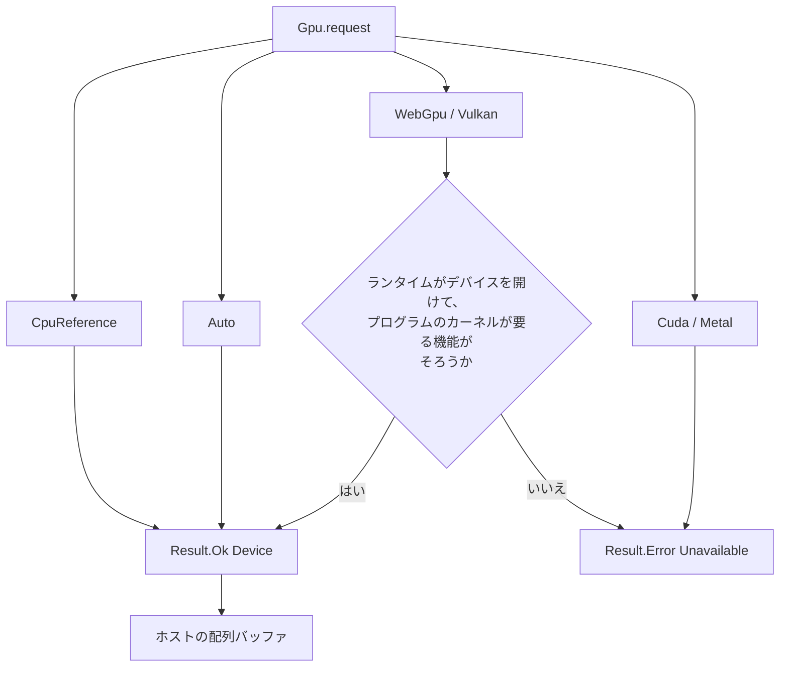

# Gpu

> [!WARNING]
> `Gpu` は実験的です。カーネルの抽出、CPU 上の参照実装、WGSL の生成（厳密な整数と、名前で選ぶ緩い `f32`・`f16`）、SPIR-V の生成（厳密な 32・64 bit 整数と `f32`、名前で選ぶ緩い `f32`）、`Gpu.request Gpu.WebGpu` による WebGPU 上の実行（native は wgpu-native を実行時に読み込み、WebAssembly は `--wasm-feature webgpu` のホストを使う）、`Gpu.request Gpu.Vulkan` による Vulkan 上の実行（native だけ。Vulkan のローダーを実行時に読み込む）、測ったコストで CPU 参照と Vulkan を選ぶ `Gpu.Auto` までを対象としています。`Gpu.WebGpu`・`Gpu.Vulkan`・`Gpu.Auto` を使わないプログラムが GPU ランタイムをリンクすることはなく、WebAssembly の既定の出力は import を持ちません。GPU 上の結果は、Apple M1 Max で、WebGPU は wgpu-native 29（native）と Dawn（WebAssembly）、Vulkan は MoltenVK 1.4.2 と SwiftShader で確かめた範囲のものです。Windows と Linux、Apple 以外の GPU、厳密な `f32` の制御（float controls）をすべて報告するデバイスでは確かめていません。

ホスト側のバッファ管理 API、WebGPU・Vulkan 向けシェーダーコード生成、WebGPU と Vulkan 上の実行、実行する場所の自動選択を、実験的に検証するためのモジュールです。`CpuReference`、`WebGpu`、`Vulkan`、`Auto` 以外のバックエンド（`Cuda`、`Metal`）の要求は、すべて失敗します。`Gpu.request Gpu.WebGpu` や `Gpu.request Gpu.Vulkan` が失敗する（ライブラリがない、デバイスがない、必要な機能がない）ときも、明示的な GPU 要求を暗黙に CPU 実行へ切り替えて成功扱いにすることはありません。失敗は `Result.Error Gpu.Unavailable` で、CPU へ切り替えるかどうかはプログラムが書きます。`Gpu.Auto` だけは、使えるデバイスと CPU 参照のどちらで動かすかを呼び出しごとに選ぶバックエンドで、常に成功します。

## この記事のポイント

- `Gpu.request Gpu.CpuReference` と `Gpu.request Gpu.Auto` は常に `Result.Ok` です。`Gpu.request Gpu.WebGpu` と `Gpu.request Gpu.Vulkan` は、ランタイムがデバイスを開けて、プログラムのカーネルが要る機能をデバイスが持つときだけ `Result.Ok` で、そうでなければ `Result.Error Gpu.Unavailable` です。`Cuda` と `Metal` は `Unavailable` です。
- WebGPU デバイスでの `Gpu.init` と `Gpu.map` は、`i32` と `i32u` の lane だけを GPU で動かし、CPU 参照とビット単位で一致します。Vulkan デバイスは、さらに `i64` と `i64u`（`shaderInt64` が要ります）と、デバイスが厳密な `f32` の制御をすべて報告して組み込みの適合プローブも通るときの `f32` も、CPU 参照とビット単位で一致するように動かします。動かせない呼び出しは、理由を標準エラーに出してトラップします。CPU や緩い意味に黙って切り替えることはありません。
- GPU で緩い `f32` と `f16` を使うには、名前に `relaxed` を持つ `Gpu.init_relaxed`・`Gpu.map_relaxed` と `--emit wgsl-relaxed`（Vulkan は `--emit spirv-relaxed`）を選びます。GPU の結果は厳密ではありません。CPU 参照は、`Gpu.map` と同じ厳密な結果を返します。
- `Gpu.Auto` のデバイスは、呼び出しごとに「CPU 参照」か「Vulkan」を、転送・同期・初回のコンパイルまで含めて測ったコストの規則で選びます。規則の定数は 1 台のマシンで測った経験則で、他のマシンの保証ではありません。選ばれたバックエンドは `Gpu.last_backend ()` で見えます。Vulkan が使えない、規則が CPU を選ぶ、カーネルがデバイスの機能を満たさないときは、CPU 参照が動かします。
- 1 回の `Gpu.init`・`Gpu.map` は、ホスト配列の複製、アップロード、実行、完了待ち、読み戻しまでを呼び出しの中で終え、デバイスにバッファを残しません。転送と同期を含めて測った結果は [性能測定](../../../docs/benchmarks.md#gpu-デバイスのランタイムf09-phase-2) と [Vulkan と Gpu.Auto](../../../docs/benchmarks.md#vulkan-と-gpuautof09-phase-3) にあります。
- `Device` と `Buffer` は不透明で、Copy ではありません。デバイスは `ref` で渡し、バッファは `map` と `to_array` が消費します。
- `--emit wgsl` が受け付けるのは、`export` された `i32 -> i32` か `i32u -> i32u` のカーネル 1 つです。除算と浮動小数点は拒否します。`--emit spirv` は、`i64`・`i64u`・`f32` の lane も受け付けます。どちらも除算は拒否します（`f32` の `/` は `--emit spirv-relaxed` だけです）。
- バッファは、CPU 参照でも WebGPU でも Vulkan でも普通の配列です。GPU メモリに常駐するバッファは、まだありません。

## CPU 参照で二乗を足す

```tsuzuri run=18
let device = Result.get (Gpu.request Gpu.CpuReference)
let buffer = Gpu.init (ref device) 4 (\index -> index * index)
let mapped = Gpu.map (ref device) (\value -> value + 1) buffer
let values = Gpu.to_array mapped
Array.sum ref values
```

実行結果:

```text
18
```

`index` は `i32`、`count` は `i64` です。`0*0+1` から `3*3+1` までを足して 18 です。`Gpu.map` は入力バッファを消費するので、`buffer` はもう使えません。結果が要るときは `Gpu.to_array` で配列に戻します。



`Cuda` と `Metal` は、今はすべて `Unavailable` です。`Auto` は常に成功します。デバイスを開く必要がなく、どのバックエンドで動かすかは呼び出しごとに決まるからです（[`Gpu.Auto`](#gpuauto-で呼び出しごとに選ぶ)）。次の例の呼び出しは小さいので、CPU 参照が動かし、結果はどのマシンでも同じです。

```tsuzuri run=2983000
def served :: Gpu.Backend -> i32
fn served backend = match backend with
    | Gpu.CpuReference -> 0
    | _ -> 1

let device = Result.get (Gpu.request Gpu.Auto)
let buffer = Gpu.init (ref device) 1000 (\index -> index * 3 - 7)
let mapped = Gpu.map (ref device) (\value -> value * 2) buffer
let backend = Gpu.last_backend ()
let values = Gpu.to_array mapped
(Array.sum ref values) + (served backend)
```

実行結果:

```text
2983000
```

`Gpu.last_backend ()` は、直前の `Gpu.init`・`Gpu.map` を動かしたバックエンドです。1,000 lane の小さな呼び出しは CPU 参照が動かすので `served` は 0 で、`0` から `999` までの `2 * (3 * index - 7)` の和 2,983,000 がそのまま出ます。

## WebGPU デバイスで動かす

`Gpu.request Gpu.WebGpu` は、言語ランタイムが WebGPU のデバイスを開けたときだけ `Result.Ok` です。ライブラリがない、アダプタがない、ライブラリのバージョンが合わない、プログラムのカーネルが要る機能（`shader-f16`）をアダプタが持たない、のどれでも `Result.Error Gpu.Unavailable` で、CPU への置き換えはしません。次の例は、プログラムが自分で CPU 参照へ切り替える書き方です。どちらで動いても結果は同じなので、GPU のない環境でも同じ出力になります。

```tsuzuri run=35
def scale :: i32 -> i32
fn scale value = value * 3 + 1

def total :: ref Gpu.Device -> i32
fn total device = {
    let values = Gpu.to_array (Gpu.init device 5 scale);
    Array.sum (&values)
}

match Gpu.request Gpu.WebGpu with
| Result.Ok device -> total (&device)
| Result.Error _ -> {
    let reference = Result.get (Gpu.request Gpu.CpuReference);
    total (&reference)
}
```

実行結果:

```text
35
```

`scale` は `i32 -> i32` の厳密なカーネルなので、WebGPU デバイスでも CPU 参照とビット単位で同じ結果になります。`1 + 4 + 7 + 10 + 13` で 35 です。どちらのデバイスで動いたかは、結果からは分かりません。

### 何が GPU で動くか

コールバックは、これまでどおり捕捉のない静的な関数かラムダに限ります。コンパイラは、`Gpu.WebGpu` を使うプログラムの呼び出し箇所ごとに、コールバックの WGSL を作って実行ファイルに埋め込みます。厳密な呼び出しと緩い呼び出しは別々のカーネルです。`Gpu.WebGpu` を使わないプログラムには、GPU ランタイムのコードも WebAssembly の import も増えません。

| 呼び出し | lane（引数と結果の型） | WebGPU デバイスでの動作 |
| --- | --- | --- |
| `Gpu.init`・`Gpu.map` | `i32`、`i32u` | GPU で動く。CPU 参照とビット単位で一致 |
| `Gpu.init`・`Gpu.map` | `f32`、`f16`、`f64`、`i64`、`i64u`、`bool` | GPU のカーネルがない。理由を標準エラーに 1 行出してトラップ |
| `Gpu.init_relaxed`・`Gpu.map_relaxed` | `f32`、`f16`、`i32`、`i32u` | GPU で動く。浮動小数点の結果は緩い。文の入れ子が 127 段を超えるとコンパイル時に `E1017` |
| `Gpu.init_relaxed`・`Gpu.map_relaxed` | `f64`、`i64`、`i64u`、`bool` | コンパイル時に `E1018` |

2 行目が、厳密な言語の意味を黙って変えないための選択です。コールバックの中に `f32` などの局所値があれば、lane が `i32` でも同じです。除算のように WGSL に出せない式や、文の入れ子が 127 段を超えるコールバックも、GPU のカーネルがありません（このとき、メッセージは lane の型だけを挙げます。理由は、同じコールバックを `export` して `--emit wgsl` に渡すと分かります）。厳密な `Gpu.map` に `f32` のバッファを渡して WebGPU デバイスで動かすと、`this call has no WGSL kernel: a strict Gpu.map or Gpu.init runs on a WebGPU device only with i32 or i32u lanes; use Gpu.map_relaxed or Gpu.init_relaxed for f32 or f16` を標準エラーに出してトラップします。CPU 参照で動かす、緩い名前に替える、のどちらかをプログラムが選びます。

デバイスは呼び出しごとに、配列を複製してアップロードし、カーネルを実行し、完了を待ち、結果を読み戻します。バッファは、CPU 参照と同じホストの配列のままです（`Gpu.to_array` は転送をしません）。呼び出しのあとデバイスに残るものはありません。`Gpu.map` を重ねた分だけ、アップロードと読み戻しも重なります。

- 1 回の呼び出しの lane 数は 2,147,483,647 以下です。デバイスの上限（`maxStorageBufferBindingSize`、`maxBufferSize`、1 次元あたりのワークグループ数 × 256）を超えると、理由を標準エラーに出してトラップします。Apple M1 Max の上限は 65,535 × 256 = 16,776,960 lane でした。
- `Gpu.request` が成功したあとの実行時エラー（シェーダーのコンパイル失敗、デバイスの喪失、上限超過）も、理由を標準エラーに 1 行出してトラップします。`Result` では返りません。
- ランタイムは、プロセスに 1 つのデバイスを、最初の `Gpu.request Gpu.WebGpu` で開き、終了時に閉じます。複数のスレッドから呼ぶと、1 回ずつ順に動きます。
- 同じ WGSL のパイプラインは作り直しません。最初の呼び出しにだけ、パイプラインの作成が入ります。

### native: wgpu-native を実行時に読み込む

native のランタイムは、リンク時の依存を持ちません。`Gpu.request Gpu.WebGpu` が最初に呼ばれたとき、`dlopen`（Windows は `LoadLibrary`）で wgpu-native を探して、WebGPU の C API の必要な部分だけを読み込みます。

| 環境変数 | 意味 |
| --- | --- |
| `TSUZURI_WEBGPU_LIBRARY` | 読み込むライブラリのパス。設定すると、これだけを試します。空文字は WebGPU を無効にし、`request` は `Unavailable` です |
| `TSUZURI_GPU_DEBUG` | 空でなければ、`request` が `Unavailable` になった理由と、デバイスで動かした呼び出しごとの `map|init <lane 数> lanes, kinds 0x<出力><入力>`（lane の種類は 1 が 32 bit 整数、2 が `f32`、3 が `f16`）を標準エラーに出します |

`TSUZURI_WEBGPU_LIBRARY` がなければ、macOS は `libwgpu_native.dylib`（と `/opt/homebrew/lib`、`/usr/local/lib`）、Linux は `libwgpu_native.so`、Windows は `wgpu_native.dll` を探します。この版が対応するのは wgpu-native 29 です。`wgpuGetVersion` の主バージョンが 29 でない、またはこの API の関数が足りないライブラリは、`Unavailable` です。ソースからビルドした wgpu-native（Homebrew の `wgpu-native` など）は、バージョンとして 0 を返します。それは、`TSUZURI_WEBGPU_LIBRARY` で名指ししたときだけ、29 だと利用者が保証したものとして受け入れます。アダプタは高性能のものを求め、256 invocation のワークグループが使えなければ `Unavailable` です。

```sh
tsuzuri build Main.tz -o app
TSUZURI_WEBGPU_LIBRARY=/opt/homebrew/opt/wgpu-native/lib/libwgpu_native.dylib ./app
TSUZURI_GPU_DEBUG=1 ./app    # 読み込めない理由が標準エラーに出る
```

### WebAssembly: `--wasm-feature webgpu`

WebAssembly の既定の出力は、`Gpu.WebGpu` を使っても import を持たず、`Gpu.request Gpu.WebGpu` は `Unavailable` です。`--wasm-feature webgpu` を付けると、`tsuzuri_gpu.open` と `tsuzuri_gpu.run` の 2 つだけを import します。`Gpu.WebGpu` を使わないプログラムは、付けても import を持ちません。

```sh
tsuzuri build Main.tz --target wasm32 --wasm-feature webgpu -o app.wasm
```

2 つの import は、WebGPU のアダプタを待つために、JavaScript Promise Integration（JSPI）でモジュールを中断します。`src/runtime/webgpu.mjs` の `createGpuImports(gpu, getMemory)` が、`navigator.gpu` や Node.js の `webgpu` バインディングから作ります。export は `WebAssembly.promising` で包んで呼び、終わったら `close()` を await します。Node.js 24 以降で確かめました。

```js
import { createGpuImports } from "./src/runtime/webgpu.mjs";

const host = createGpuImports(navigator.gpu, () => instance.exports.memory);
const { instance } = await WebAssembly.instantiate(bytes, { tsuzuri_gpu: host.imports });
console.log(await WebAssembly.promising(instance.exports.tz_total)());
await host.close();
```

`--wasm-feature webgpu` は `wasm32` の object、LLVM IR、WASM だけで、`--wasm-feature threads`、`--wasm-host`、JavaScript バインディング（`--emit bindings-js`）とは組み合わせられず、`E2000` です。`jspi` とは独立です。WebAssembly の線形メモリの既定の上限は 16 MiB なので、大きなバッファには `--wasm-max-memory` を付けます。


## Vulkan デバイスで動かす

`Gpu.request Gpu.Vulkan` は、native のランタイムが Vulkan のデバイスを開けて、プログラムの SPIR-V カーネルが要る機能をそのデバイスが持つときだけ `Result.Ok` です。WebGPU と同じく、ローダーがない、デバイスがない、機能が足りない、のどれでも `Result.Error Gpu.Unavailable` で、CPU 参照や緩い意味への置き換えはしません。WebAssembly には Vulkan のホストがなく、`Gpu.request Gpu.Vulkan` は既定の出力でも `--wasm-feature webgpu` の出力でも常に `Unavailable` で、import も増えません。

コンパイラは、`Gpu.Vulkan` か `Gpu.Auto` を使うプログラムの呼び出し箇所ごとに、コールバックの SPIR-V モジュールを作って実行ファイルに埋め込みます。WGSL は `Gpu.WebGpu` を使うプログラムにだけ、SPIR-V は `Gpu.Vulkan` か `Gpu.Auto` を使うプログラムにだけ埋め込み、どれも使わないプログラムには GPU ランタイムのコードが入りません。SPIR-V はコンパイラ自身が作ります（[SPIR-V を出す](#spir-v-を出す)）。次の例は、64 bit 整数のカーネルを Vulkan で動かし、動かせなければプログラム自身が CPU 参照へ切り替えます。どちらで動いても結果は同じです。

```tsuzuri run=128849018885
def scale :: i64 -> i64
fn scale value = value * 3l + 1l

def total :: ref Gpu.Device -> i64
fn total device = {
    let buffer = Gpu.init device 5 (\index -> (index as i64) * 4294967296l);
    let values = Gpu.to_array (Gpu.map device scale buffer);
    Array.sum (&values)
}

match Gpu.request Gpu.Vulkan with
| Result.Ok device -> total (&device)
| Result.Error _ -> {
    let reference = Result.get (Gpu.request Gpu.CpuReference);
    total (&reference)
}
```

実行結果:

```text
128849018885
```

`3 * 2^32 * (0 + 1 + 2 + 3 + 4) + 5` です。`i64` の lane は `shaderInt64` を持つデバイスだけが動かし、持たないデバイスでは `request` が `Unavailable` になって `Error` の枝へ進みます。どちらでも、結果は CPU 参照と同じです。

### 何が Vulkan で動くか

| 呼び出し | lane | Vulkan デバイスでの動作 |
| --- | --- | --- |
| `Gpu.init`・`Gpu.map` | `i32`、`i32u` | GPU で動く。CPU 参照とビット単位で一致 |
| `Gpu.init`・`Gpu.map` | `i64`、`i64u` | `shaderInt64` を持つデバイスで動く。ビット単位で一致。持たなければプログラム全体の `request` が `Unavailable` |
| `Gpu.init`・`Gpu.map` | `f32` | デバイスが厳密な `f32` の制御（後述）をすべて報告し、組み込みの適合プローブも通るときだけ動く。ビット単位で一致するように作るが、保証は次の節のとおり。条件を満たさなければプログラム全体の `request` が `Unavailable` |
| `Gpu.init`・`Gpu.map` | `f16`、`f64`、`bool` | GPU のカーネルがない。理由を標準エラーに 1 行出してトラップ |
| `Gpu.init`・`Gpu.map` | カーネルが `f32` の `/`、整数の `/` と `%`、`**`、`f64` を含む | GPU のカーネルがない。同上 |
| `Gpu.init_relaxed`・`Gpu.map_relaxed` | `f32`、`i32`、`i32u` | GPU で動く。浮動小数点の結果は緩い。`f32` の `/` も使える |
| `Gpu.init_relaxed`・`Gpu.map_relaxed` | `f16` | GPU のカーネルがない（WebGPU でだけ動く）。トラップ |

「GPU のカーネルがない」呼び出しは、`tsuzuri: Vulkan: the kernel has no SPIR-V module for Vulkan` のような理由を標準エラーに 1 行出してトラップします。コンパイル時のエラーにしないのは、デバイスが実行時の値で、同じ呼び出しが `CpuReference` のデバイスでは正しく動くからです。コンパイルでその理由を見るには、カーネルを `export` した専用のソースを `--emit spirv` に渡します。

### 厳密な f32 と float controls

Vulkan が約束する `OpFAdd`・`OpFSub`・`OpFMul` は、32 bit では正しく丸められた結果です。それでも、厳密な言語の `f32` をそのまま動かすには次の 3 つが足りません。

- `NoContraction` のない演算は、ドライバが積和（FMA）や再結合に変えてよい、と Vulkan の仕様は決めています。コンパイラは、すべての浮動小数点演算の結果に `NoContraction` を付けます。
- 符号付きゼロ・無限大・NaN の保存、非正規化数の保存、最近接偶数への丸めは、`VK_KHR_shader_float_controls` の `SignedZeroInfNanPreserve`・`DenormPreserve`・`RoundingModeRTE`（幅 32）の execution mode が、デバイスがそれを保証するときだけ有効です。厳密な `f32` のモジュールは、この 3 つの capability と execution mode を持ちます。
- `OpFDiv` は 2.5 ULP 以内の精度しか保証されません。厳密な `f32` の `/` は、正確に再現できないので `E1018` です。緩い呼び出しは使えます。

ランタイムは、次の 2 つがそろうときだけ、厳密な `f32` を許します。

1. デバイスが、次の全部を報告します。`shaderSignedZeroInfNanPreserveFloat32`、`shaderDenormPreserveFloat32`、`shaderRoundingModeRTEFloat32`、そして `denormBehaviorIndependence` と `roundingModeIndependence` が `NONE` でないこと（`NONE` のデバイスは、幅ごとに別の mode を認めないので、幅 32 だけに mode を付けるモジュールを動かせません）。
2. デバイスが、ランタイムに組み込みの**適合プローブ**を通ります。

f32 から整数へのキャストは、Vulkan の変換が CPU の飽和・NaN の規則を持たないので、モジュールの中で範囲の比較と `OpIsNan` の選択に置き換え、CPU 参照と同じ結果にします。

#### 報告されたプロパティは、厳密さの証明ではありません

float controls のプロパティは、ドライバの申告です。申告どおりに計算するとは限りません。実際に、次の 2 つを観測しています。

- MoltenVK 1.4.2（Apple M1 Max）は `shaderSignedZeroInfNanPreserveFloat32` を報告しますが、`-(x * 0.0)` を `x` が負のとき `-0.0` と計算します（CPU 参照は `+0.0`）。
- SwiftShader（Chrome に同梱のもの）は、2^31 以上の `i32u` を `f32` に変換するとき、最近接偶数に丸めない値があります。4294967167 を 4294967296.0 にします（CPU 参照は 4294967040.0）。

そこでランタイムは、デバイスがプロパティを報告するときに限り、厳密な `f32` が要る最初の要求で、24 lane の小さな SPIR-V モジュール（適合プローブ）を 1 回だけ動かします。厳密な `f32` が要る要求とは、厳密な `f32` のカーネルを持つプログラムの `Gpu.request Gpu.Vulkan`、そのカーネルの `Gpu.Auto` の呼び出し、厳密な `f32` のモジュールの実行です。プローブの 8 つの演算は、積和にならない `a * b + c`、積の符号付きゼロ、非正規化数の加算と乗算、最近接偶数への丸め、無限大と NaN の減算、`i32u` と `i32` から `f32` への変換です。結果のビット列を、CPU 参照が計算するビット列と比べます。

- 1 lane でも違うか、プローブが動かせなければ、そのデバイスは厳密な `f32` を許されません。`Gpu.request Gpu.Vulkan` は、厳密な `f32` のカーネルを持つプログラムでは `Unavailable` で、`Gpu.Auto` はそのカーネルを CPU 参照で動かします。違った演算と lane、デバイスが計算したビット列と基準のビット列は、`TSUZURI_GPU_DEBUG` を設定すると標準エラーに出ます。
- プローブは 1 つのプロセスで 1 回だけ動き、結果を覚えます。厳密な `f32` を使わないプログラムと、整数のカーネルは、プローブを動かしませんし、プローブの結果の影響も受けません。
- プローブを通ることは、保証ではありません。24 lane の標本で、それ以外の入力で違う結果を出すドライバは、通ることがあります。通ったあとに残る不一致は、そのドライバの不具合です。コンパイラとランタイムは、そのような不一致を検出しません。

Apple M1 Max（MoltenVK 1.4.2）は `SignedZeroInfNanPreserve` と最近接偶数への丸めを報告しますが、`DenormPreserve` と独立性を報告しません。そのため、**この Mac では厳密な `f32` の要求は、プロパティの時点で `Unavailable` です**（実際に確かめた結果で、プローブも動きません）。検査用の道具（`tests/gpu_vulkan_runtime.c` の `conform`。言語の機能ではありません）でプローブをこのデバイスに強制すると、24 lane のうち 7 lane が違います。`-(x * 0.0)` の符号が 2 lane、非正規化数が 5 lane です。ランタイムの確認を迂回して厳密な `f32` のモジュールを渡す検査（`--assume-strict`。同じく言語の機能ではありません）でも、このデバイスは `-(x * 0.0)` の 534 個の入力のうち 243 個、非正規化数の 208 個の入力すべてで、CPU 参照と違う結果を返しました。SwiftShader（Chrome 同梱）は `SignedZeroInfNanPreserve` だけを報告し、プローブを強制すると 1 lane（`i32u` から `f32` への変換）が違います。`i32u` の 818 個の入力のうち 116 個が違いました。この 2 つのデバイスの確認は、ランタイムが厳密な `f32` を断るのが正しいことを示しています。

float controls をすべて報告して、プローブも通るデバイスは、この開発環境にありません。**厳密な `f32` のモジュールが実機で CPU 参照とビット単位で一致することは、まだ確かめていません。** その経路のテストは、モックのデバイス（プローブの結果を作り替えられる）と、プロパティが厳密さを報告しない実機での `Unavailable` の確認までです。

### 機能の要求はプログラム全体です

`Gpu.request Gpu.Vulkan` は、プログラムが持つ SPIR-V カーネルすべてが要る機能（`i64` のカーネルがあれば `shaderInt64`、厳密な `f32` のカーネルがあれば float controls）をまとめて確かめます。`Gpu.Auto` の呼び出しのカーネルも数えます。1 つでも欠ければ `Unavailable` です。デバイスが持つ機能だけで動くカーネルが別にあっても、`request` は成功しません。呼び出しの途中でトラップさせるより、要求の時点で分かるほうがプログラムは対処できます。`Gpu.Auto` は、カーネルごとに確かめます。

### native: Vulkan のローダーを実行時に読み込む

native のランタイムは、Vulkan のローダーにリンク時の依存を持ちません。`Gpu.request Gpu.Vulkan` が最初に呼ばれたとき（`Gpu.Auto` は、Vulkan を使うかどうかを決めるときに）、`dlopen`（Windows は `LoadLibrary`）でローダーを探し、必要な Vulkan の C API だけを、ランタイムが自前で宣言した形で呼びます。

| 環境変数 | 意味 |
| --- | --- |
| `TSUZURI_VULKAN_LIBRARY` | 読み込むライブラリのパス。設定すると、これだけを試し、読み込めなければ `Unavailable` です。空文字は Vulkan を無効にします |
| `TSUZURI_GPU_DEBUG` | 空でなければ、`Unavailable` の理由、選んだデバイスの能力（機能、制限、転送の方式、適合プローブの状態 `strict_probe` が `not-run`・`passed`・`failed` のどれか）、適合プローブが違った lane、Vulkan で動かした呼び出しごとの `map` か `init` の行（lane 数と、lane の種類 `kinds 0x<出力><入力>`。種類は 1 が 32 bit 整数、2 が `f32`、4 が 64 bit 整数）、`Gpu.Auto` が Vulkan を使わなかった理由を標準エラーに出します |

`TSUZURI_VULKAN_LIBRARY` がなければ、macOS は `libvulkan.1.dylib`（と `/opt/homebrew/lib`、`/usr/local/lib`、`libMoltenVK.dylib`）、Linux は `libvulkan.so.1`、Windows は `vulkan-1.dll` を探します。ローダーが見つけるドライバは、ローダー自身の変数（`VK_DRIVER_FILES` など）に従います。MoltenVK のような portability 実装のために、ランタイムはインスタンスの `VK_KHR_portability_enumeration` と、デバイスの `VK_KHR_portability_subset` を有効にします。

デバイスは、計算キューを持ち、Vulkan 1.1 以上で、プログラムのカーネルが要る機能を持つものの中から、離散 GPU、統合 GPU、仮想 GPU、その他、CPU の順に選びます。統合 GPU の転送は、ホストが直接見られるメモリを使ってコピーなしで行い、離散 GPU は、デバイス側のバッファとの間に staging バッファのコピーを挟みます。離散 GPU の経路は、実機では動かしていません。

そのほかは WebGPU と同じです。呼び出しごとに複製・アップロード・実行・完了待ち・読み戻しをし、`request` が成功したあとの実行時エラー（デバイスの喪失、メモリ不足、上限超過）は理由を標準エラーに出してトラップします。プロセスに 1 つのデバイスを最初の要求で開き、終了時に閉じます。複数のスレッドから呼ぶと、1 回ずつ順に動きます。同じ SPIR-V のパイプラインは作り直しません（256 個まで）。1 回の呼び出しの lane 数は 2,147,483,647 以下で、デバイスの `maxStorageBufferRange` と `maxMemoryAllocationSize`、1 次元あたりのワークグループ数の上限（超える分は何回かに分けて dispatch します）に従います。

## Gpu.Auto で呼び出しごとに選ぶ

`Gpu.request Gpu.Auto` は常に `Result.Ok` で、デバイスを開きません。`Gpu.init`・`Gpu.map`（と `_relaxed`）の**呼び出しごとに**、ランタイムが「CPU 参照」と「Vulkan」のどちらで動かすかを決めます。WebGPU は候補にしません。測った規則がないからです。WebAssembly には Vulkan がないので、`Auto` は常に CPU 参照です。厳密な呼び出し（`Gpu.init`・`Gpu.map`）の結果は、どちらが動かしても CPU 参照と同じです。緩い呼び出し（`Gpu.init_relaxed`・`Gpu.map_relaxed`）は、Vulkan が動かすと、明示的な Vulkan のデバイスと同じ緩い結果になりえます（[緩い f32 カーネル](#緩い-f32-カーネル)）。どのバックエンドが動かしたかは、`Gpu.last_backend ()` と `TSUZURI_GPU_DEBUG` で見られます。

呼び出しごとの選び方は、次の 3 段です。

1. **使えるか。** 次の全部が成り立つときだけ、Vulkan が候補になります。1 つでも欠ければ、CPU 参照が動かします。理由は `TSUZURI_GPU_DEBUG` を設定したときだけ出ます。
   - カーネルに SPIR-V のモジュールがあり、lane の種類が Vulkan にあります。
   - Vulkan のローダーとデバイスが使えて、そのカーネルが要る機能（`shaderInt64`、厳密な `f32` の float controls と適合プローブ）をデバイスが持ちます。`Gpu.request Gpu.Vulkan` はプログラム全体で確かめますが、`Auto` はカーネルごとに確かめるので、整数のカーネルは、同じプログラムの厳密な `f32` のカーネルが使えなくても、Vulkan で動きます。
   - デバイスが、測った種類です。メモリを CPU と共有して、転送がコピーなしで済む統合 GPU です。離散 GPU と、ソフトウェアの実装（SwiftShader など）は、`Auto` が選びません。測った規則がないからです。明示的な `Gpu.Vulkan` は、そのデバイスでも動かします。
   - バッファが `maxStorageBufferRange` と `maxMemoryAllocationSize` に収まり、パイプラインが作れます。
2. **割に合うか。** 呼び出しの lane 数を `n`、カーネルの重みを `w`（1 lane が実行する算術・論理・比較・変換・選択の命令の数。呼ぶ関数の中も数え、最小は 1）、1 lane の入出力のバイト数を `b`（`init` は入力がないので出力だけ）として、次の見積りを比べます。

   | 見積り | 式 |
   | --- | --- |
   | CPU 参照 | `n × w × 0.03 ns` |
   | Vulkan（デバイスが開いて、パイプラインが作ってある） | `270 µs + n × b × 0.13 ns + n × w × 0.001 ns` |
   | 初回の費用 | デバイスを開く 30 ms と、そのカーネルのパイプラインを作る 7 ms |

   Vulkan の見積りが CPU 参照の見積りより小さい呼び出し（節約が正の呼び出し）だけが、Vulkan の候補です。
3. **初回の費用を払えるか。** 開いていないデバイスと、作っていないパイプラインには、初回の費用がかかります。節約が 1 回では初回の費用に届かない呼び出しも、繰り返すなら元が取れます。そこで、候補になった呼び出しが CPU 参照で動いたときの節約を貯めていき、貯金が初回の費用に届いた呼び出しで、デバイスを開いてパイプラインを作ります（貯金は、その費用の分だけ減ります）。以後は、節約が正のどの呼び出しも、Vulkan が動かします。

この見積りから計算できる境目は、次のとおりです（`b = 8` の `i32 -> i32`。**規則の式から計算した値で、測定値ではありません**）。

| 重み `w` | 1 lane あたりの節約 | 節約が正になる lane 数（概算） |
| --- | --- | --- |
| 5、20 | 負 | なし。常に CPU 参照で、デバイスを開かない |
| 80 | 1.28 ns | 約 21 万 |
| 320 | 8.24 ns | 約 3.3 万 |
| 1,280 | 36.1 ns | 約 7,500 |

`w` が 36 より小さいカーネルは、lane 数がいくつでも、CPU 参照が動かします。実際に 1 台のマシンで測った時間と、この規則の当たり外れは、[Vulkan と Gpu.Auto](../../../docs/benchmarks.md#vulkan-と-gpuautof09-phase-3) にあります。

規則の定数は、Apple M1 Max（MoltenVK 1.4.2）で、転送・同期・初回のコンパイルを含めて測った 1 台のマシンの経験則です。**他のマシンの保証ではありません**。別の GPU やドライバには、別の定数が合います。測定は他のプロセスが動いている負荷の高いマシンで行ったので、静かなマシンでの測り直しで、定数が変わることがあります。規則は、実行時の測定で調整しません。定数は `src/runtime/gpu-vulkan.c` の `TZ_VK_AUTO_*` にあり、測り方は `benchmarks/run-gpu-vulkan.mjs` です。

- 環境変数 `TSUZURI_GPU_AUTO_MIN_WORK=<n>` は、規則を「`n × w` が `<n>` 以上」に置き換えます（`0` は、使えるなら常に Vulkan）。「使えるか」の段は、そのまま効きます。能力の足りないデバイス、測った種類でないデバイス、収まらないバッファを、この変数で使わせることはできません。
- 準備の失敗（能力の不足、上限、パイプラインの作成）は、呼び出しを CPU 参照で動かします。呼び出しの途中の失敗（デバイスの喪失、メモリ不足）は、明示的なデバイスと同じように、理由を出してトラップします。
- Vulkan が使えないと分かったあとは、そのプロセスでは、もうデバイスを開き直しません。
- `Gpu.last_backend ()` は、直前の `Gpu.init`・`Gpu.map` を動かしたバックエンドです。どのスレッドの、どのデバイスの呼び出しかは区別しない、プロセスで 1 つの値で、最初の呼び出しの前は `CpuReference` です。複数のスレッドが `Auto` を使うなら、`TSUZURI_GPU_DEBUG` の行で見てください。

```mermaid
flowchart TD
  call["Gpu.init / Gpu.map<br/>（Auto のデバイス）"]
  call --> usable{"使えるか<br/>モジュール・能力・測った種類・上限"}
  usable -->|いいえ| cpu["CPU 参照"]
  usable -->|はい| worth{"節約は正か<br/>CPU の見積り &gt; Vulkan の見積り"}
  worth -->|いいえ| cpu
  worth -->|はい| first{"デバイスは開いていて<br/>パイプラインはあるか"}
  first -->|はい| vk["Vulkan"]
  first -->|いいえ| credit{"貯金が初回の費用に届いたか"}
  credit -->|届いた| vk
  credit -->|届かない| save["節約を貯金に足す"] --> cpu
```

## 型と関数

`std/Gpu.tz` の公開面は次のとおりです。レコードのフィールドは不透明なので、`device.backend` や `buffer.values` は `E1022` です。

| 名前 | シグネチャ | 説明 |
| --- | --- | --- |
| `Gpu.Backend` | 共用体 | `CpuReference`、`WebGpu`、`Vulkan`、`Cuda`、`Metal`、`Auto` |
| `Gpu.Error` | 共用体 | `Unavailable` だけ |
| `Gpu.Device` | 不透明レコード | Copy ではない。`ref` で渡す |
| `Gpu.Buffer<'a>` | 不透明レコード | Copy ではない。中身はホストの配列 |
| `Gpu.request` | `Backend -> Result<Device, Error>` | `CpuReference` と `Auto` は常に成功。`WebGpu` と `Vulkan` は、デバイスが開けて、プログラムのカーネルが要る機能がそろうときだけ成功（厳密な `f32` のカーネルを持つプログラムの `Vulkan` は、float controls の報告と適合プローブの通過も要る）。`Cuda` と `Metal` は `Unavailable` |
| `Gpu.backend` | `ref Device -> Backend` | 要求したバックエンドを返す（`Auto` のデバイスは `Auto`）。`Eq` はないので `match` する |
| `Gpu.last_backend` | `unit -> Backend` | 直前の `Gpu.init`・`Gpu.map` を動かしたバックエンド。最初の呼び出しの前は `CpuReference`。プロセスで 1 つの値 |
| `Gpu.init` | `ref Device -> i64 -> (i32 -> 'a) -> Buffer<'a>` | 添字からバッファを作る。範囲外の長さはトラップ |
| `Gpu.map` | `Copy<'a> => ref Device -> ('a -> 'b) -> Buffer<'a> -> Buffer<'b>` | バッファを消費して変換する |
| `Gpu.init_relaxed` | `ref Device -> i64 -> (i32 -> 'a) -> Buffer<'a>` | `Gpu.init` と同じ。コールバックに緩い `f32`・`f16` カーネルの規則をかける |
| `Gpu.map_relaxed` | `Copy<'a> => ref Device -> ('a -> 'b) -> Buffer<'a> -> Buffer<'b>` | `Gpu.map` と同じ。コールバックに緩い `f32`・`f16` カーネルの規則をかける |
| `Gpu.from_array` | `Copy<'a> => ref Device -> ref ['a] -> Buffer<'a>` | 配列を複製してバッファにする |
| `Gpu.to_array` | `Buffer<'a> -> ['a]` | バッファを消費して配列を返す |

CPU 参照バッファの要素型は `i32`、`i32u`、`i64`、`i64u`、`f16`、`f32`、`f64` です。標準の配列と同じアロケータで解放します。`init` の `count` は 0 以上 2,147,483,647 以下です。範囲外は `assert` によるトラップで、`Result` にはなりません。

`init`、`map`、`from_array`（と `init_relaxed`、`map_relaxed`）は、その場で全部の引数を渡して呼ぶ必要があります。`let make = Gpu.init` は `E1018` です。コールバックは、捕捉のない静的な関数かラムダに限ります。使えるのはスカラーの局所変数、算術、比較、キャスト、`if`、既知の関数呼び出しです。`mut` の引数も使えます。WGSL の引数には代入できないので、WGSL では本体の先頭で、同じ番号の変数へ引数を複製します。

ヒープ確保、借用、ホスト関数、タスク、ループ、再帰、`assert`、未知の関数値は `E1018` です。カーネル抽出の入れ子 128、関数呼び出し 1024、式 65536 を超えると `E1017` です。CPU 参照の実行そのものは `Array.init` と `Array.map` なので、WGSL に出せない `f32` のバッファも、この参照実装では作れます。出せることと、CPU で試せることの範囲が違います。

WGSL を出すときは、文の入れ子が 127 段までで、超えると `E1017`（`GPU kernel exceeds 127 levels of WGSL statement nesting; …`）です。WebGPU の実装（Tint）が、それより深い文を拒否するためです。数えるのは関数ごとで、`if` と `else if` の 1 本と、`&&`・`||` の右辺が、それぞれ 2 段です。`else if` の連鎖は 62 本までで、63 本目が `E1017` です。連鎖の続きを別の関数へ移すと、段が数え直されます。`--emit wgsl`、`--emit wgsl-relaxed`、緩い呼び出しは、この検査を通らないとコンパイルが失敗します。厳密な呼び出しは CPU 参照ではこの制限を受けず、WebGPU デバイスでは GPU のカーネルがありません（[WebGPU デバイスで動かす](#webgpu-デバイスで動かす)）。

## WGSL を出す

専用のソースに、`export` した 1 引数のスカラー関数を置きます。

```tsuzuri
export def square :: i32 -> i32
fn square value = value * value
```

このファイルだけのプロジェクトで、ターゲットも最適化も付けずに出します。

```sh
tsuzuri build Kernel.tz --emit wgsl -o kernel.wgsl
```

`-O`、`--target`、`--cpu` を付けると `E2000` です。`export` が 1 つでなければ `E2004` です。メッセージは「WGSL output requires exactly one exported scalar kernel」です。

生成されるシェーダーは、この版では次の形です。`i32` の二乗カーネルで確認しました。

- `@workgroup_size(256)` のコンピュートシェーダーです。
- エントリーポイントは `map_main` と `init_main` の両方が出ます。
- `binding(0)` が入力の storage、`binding(1)` が出力の storage、`binding(2)` が長さの uniform です。
- `init_main` は呼び出し ID をカーネルに渡し、`binding(0)` は読みません。宣言自体はシェーダーテキストに残ります。
- 整数の加減乗算は折り返しです。`i32` の乗算は、符号なしへ bitcast してから掛け、戻します。シフト量は下位 5 bit でマスクします。

除算と剰余は、WGSL と Tsuzuri のトラップの差を吸収できないため `E1018` です。`value / 2` は `tsuzuri check` は通り、`--emit wgsl` で拒否されます。

`f32` や `f16`、`i64` の `export` も、`--emit wgsl` では `E1018` です（`f16` は `export` 自体が `E1008` です）。メッセージは「strict WebGPU kernels require i32 or i32u buffer lanes; 64-bit lanes are unavailable and f32 or f16 lanes need --emit wgsl-relaxed」です。WGSL に 64 bit 整数がなく、浮動小数点はハードウェアごとに FMA や非正規化数の扱いが違うためです。CPU 参照実装の数値契約は、この拒否では変わりません。`f32` を局所変数に持つ `i32` のカーネルも、厳密な出力では同じ `E1018` です。

## 緩い f32 カーネル

厳密な言語の `f32` は、再結合も暗黙の FMA もなく、非正規化数・NaN・符号付きゼロを保ちます。WGSL はこれらを保証しないので、GPU の `f32`（と `f16`）は別の名前で選びます。選ぶのは利用者で、`Gpu.map` や `--emit wgsl` が黙って緩い意味に切り替わることはありません。

| 厳密 | 緩い |
| --- | --- |
| `Gpu.init`、`Gpu.map` | `Gpu.init_relaxed`、`Gpu.map_relaxed` |
| `--emit wgsl` | `--emit wgsl-relaxed` |

```tsuzuri run=16
let device = Result.get (Gpu.request Gpu.CpuReference)
let generated = Gpu.init_relaxed (ref device) 8 (\index -> (index as f32) * 0.5 + 0.25)
let values = Gpu.to_array generated
Array.sum ref values
```

実行結果:

```text
16
```

CPU 参照の結果は、`Gpu.init` と `Gpu.map` と同じく厳密です。`0.25 + 0.75 + … + 3.75` は `f32` で正確に足せるので 16 です。緩い名前を使っても、CPU 参照では native と WebAssembly の `-O0`・`-O3` が、`Gpu.map` とビット単位で一致します。

緩い `f32` と `f16` の契約です。この API と `--emit wgsl-relaxed` の中だけに適用します。

1. CPU 参照は、厳密な規則でカーネルを評価します。厳密な結果は、緩い規則が許す結果の一つです。
2. `--emit wgsl-relaxed` の shader を GPU で動かすと、`a * b + c` を一回丸めの積和にしたり、`+`・`*` の結合と順序を変えたり、非正規化数の入力・中間値・結果をどちらかの符号のゼロにしたり、`/` を WGSL の精度（2.5 ulp）で計算したり、整数から `f32`・`f16` への変換や `f32` から `f16` への変換を隣り合う二つの値のどちらかにしたりすることがあります。
3. 入力・中間値・結果のどれかが NaN・無限大、またはオーバーフローしたとき、その要素の結果は未規定の `f32`・`f16`（比較なら未規定の `bool`）です。トラップはせず、ほかの要素には影響しません。浮動小数点に依存する分岐と、その先の整数結果が変わることがあります。
4. 整数の値と演算は、厳密な場合と同じ意味を保ちます。
5. 同じデバイスとドライバでも、実行ごとの一致は保証しません。誤差の上限は言語として約束しません。
6. 緩いカーネルはトラップしません。

使える型と演算は、厳密な場合より少し広く、次のとおりです。

| 対象 | 使えるもの | 拒否（`E1018`） |
| --- | --- | --- |
| バッファの要素（カーネルの引数と結果） | `f16`、`f32`、`i32`、`i32u` | `f64`、`i64`、`i64u`、`bool` |
| 局所変数と、呼ぶ関数の引数・結果 | `f16`、`f32`、`i32`、`i32u`、`bool` | `f64`、`i64`、`i64u` |
| `f16` と `f32` の演算 | 単項 `-`、`+`、`-`、`*`、`/`、`==`、`!=`、`<`、`<=`、`>`、`>=` | `**` |
| キャスト | `i32` と `i32u` から `f32` と `f16`、`f16` から `f32`、`f32` から `f16`、同じ型へ、`i32` と `i32u` の間 | `f32`・`f16` から整数、`f32` と `f64` の間 |
| 整数の演算 | 厳密な場合と同じ（折り返し、シフト量は下位 5 bit） | 除算と剰余 |

`f32` のリテラルは、丸めを WGSL の字句解析に任せないよう `bitcast<f32>(<bit 列>u)` で出します。`f16` のリテラルは、その値を `f32` のビット列に直して `f16(bitcast<f32>(<bit 列>u))` で出します。`f16` の値は `f32` で正確に表せるので、丸めは起きません。`f32` の剰余演算子は、言語にまだありません。

専用のソースに緩いカーネルを置いて出力します。

```tsuzuri
export def horner :: f32 -> f32
fn horner value = ((value * 0.5 + 0.25) * value + 0.125) * value + 1.0
```

```sh
tsuzuri build Kernel.tz --emit wgsl-relaxed -o kernel.wgsl
```

出力の 1 行目は `// tsuzuri-gpu float=relaxed input=f32 output=f32` で、`input` と `output` は `f32`・`i32`・`u32` のどれかです。厳密な出力には、この行がありません。オプションの扱いは `--emit wgsl` と同じで、`-O`・`--target`・`--cpu` との併用は `E2000`、`export` が 1 つでなければ `E2004` です。`f64` のカーネルは `E1018`（メッセージは「relaxed WebGPU kernels support f32, i32, and i32u values; WGSL has no f64 or 64-bit integers」）で、既存の出力ファイルは残ります。

Dawn の Metal バックエンド（Apple M1 Max、`webgpu` 0.6.1）で、5 つのカーネルを 263 個の入力で実行し、JavaScript が `Math.fround` で一演算ごとに丸めた参照と比べました。許容誤差は、演算ごとの重みの和です（`+`・`-`・`*` は 2 ulp、`/` は 3 ulp、整数から `f32` への変換は 1 ulp）。観測した最大誤差は `x * x + x` が 1 ulp、3 次の Horner 式が 1 ulp、`(x + 1) / (x * x + 2)` が 2 ulp、`(i as f32) * 0.5 + 0.25` と `if x * x > 2.0 then 1 else 0` が 0 でした。この比較は、相殺のない `[2^-8, 2^8]` の正規数だけを対象にしています。特殊値（0、-0、非正規化数、NaN、無限大）は、結果の長さだけを見ます。別の GPU、ドライバ、OS では結果が変わることがあります。

## 緩い f16 カーネル

`f16` の lane、局所値、引数、結果は、緩い呼び出しの中でだけ GPU に出せます。CPU 参照は、厳密な言語の（ソフトウェアの）`f16` で評価し、`f32` と同じく `Gpu.map` とビット単位で一致します。生成する WGSL は、1 行目の宣言のあとに `enable f16;` を持ち、`array<f16>` の storage を使います。

- アダプタが `shader-f16` を持たないと、その WGSL を含むプログラムの `Gpu.request Gpu.WebGpu` は `Unavailable` です。デバイスは `shader-f16` を要求して開きます。`f16` を黙って `f32` に替えることも、`f16` のカーネルだけ CPU で動かすこともありません。プログラムに `f16` のカーネルが 1 つでもあれば、`f32` や整数のカーネルを含めて、そのプログラムの要求全体が `shader-f16` を要ります。`f16` を使わないプログラムは、`shader-f16` を要求しません。
- `f16` は `export` できない（`E1008`）ので、`--emit wgsl-relaxed` の根にはできません。`f32` の根の中で `f16` を使うことはできます。言語ランタイムの `Gpu.init_relaxed`・`Gpu.map_relaxed` は、`f16` の lane を埋め込みの WGSL で動かします。
- `f16` の lane は 2 byte で、バッファは 4 byte の倍数に切り上げます。奇数個の lane でも、読み戻しは要素数ぶんだけです。

Apple M1 Max で、native（wgpu-native 29）と WebAssembly（Dawn）の両方が `shader-f16` を持ちました。`f16 -> f16`（`x * x + x`）、`f16 -> f32`、`f32 -> f16`、`i32 -> f16` の lane の組を、0 から 70,000 までの 9 通りの lane 数で CPU 参照と比べ、`f16` の結果は 4 ulp（相対で 0.4 %）以内でした。`x * x + x`（`x` は 0 から 40）は `f16` で正確に表せるので、`tests/gpu.mjs` は Node.js の資源 API（`Uint16Array` のビット列）の結果が正確に一致することも確かめています。

## SPIR-V を出す

専用のソースに、`export` した 1 引数のスカラー関数を置きます。`--emit spirv` は厳密な意味の Vulkan 用コンピュートモジュールを、`--emit spirv-relaxed` は緩い意味のモジュールを、SPIR-V のバイナリ（32 bit ワードのリトルエンディアン）で出します。

```tsuzuri
export def mix :: i64 -> i64
fn mix value = (value * 6364136223846793005l + 1442695040888963407l) ^ (value >>> 17)
```

```sh
tsuzuri build Kernel.tz --emit spirv -o kernel.spv
tsuzuri build Kernel.tz --emit spirv-relaxed -o kernel.spv   # 緩い f32 のカーネル
```

拡張子の既定は `.spv` です。`-O`、`--target`、`--cpu` を付けると `E2000`、`export` が 1 つでなければ `E2004`（「SPIR-V output requires exactly one exported scalar kernel」）です。ビルドのキャッシュは使いません。出力はバイトまで決定的で、`spirv-val --target-env vulkan1.1`（と `vulkan1.2`）を通ります。

| 項目 | 内容 |
| --- | --- |
| バージョン | SPIR-V 1.3。Vulkan 1.1 が基準です |
| capability | `Shader`。64 bit の型を使うときだけ `Int64`。厳密な `f32` では float controls の 3 つ（`DenormPreserve`、`SignedZeroInfNanPreserve`、`RoundingModeRTE`）と `SPV_KHR_float_controls` |
| エントリーポイント | `map_main`（`GLCompute`）。入力の lane が 32 bit 整数のときだけ、`init_main` も出ます。どちらも `LocalSize 256 1 1` です |
| バインディング | set 0 の binding 0 が入力の storage buffer（`NonWritable`）、binding 1 が出力、push constant が `{ u32 length; u32 base }` です。呼び出しは `base + 大域 ID` で、`length` 未満のときだけ動きます。`init_main` は、binding 0 に出力のバッファを結びます |
| 生成 | コンパイラの中の Rust です。LLVM の SPIR-V ターゲットも、外部のツールも使いません。決定的な生成で、`spirv-val` はテストだけが使います |

厳密と緩いで、演算の扱いは次のとおりです。

| 対象 | 厳密（`--emit spirv`、`Gpu.map`） | 緩い（`--emit spirv-relaxed`、`Gpu.map_relaxed`） |
| --- | --- | --- |
| バッファの要素 | `i32`、`i32u`、`i64`、`i64u`、`f32` | `f32`、`i32`、`i32u` |
| 整数の `+`・`-`・`*` | 折り返し | 同じ |
| 整数の `/`・`%`・`**` | `E1018`（CPU ではトラップする演算） | 同じ |
| ビット演算、シフト、比較 | 使える。シフト量は型の幅 - 1 でマスク。`>>>` は符号付きなら算術シフト、`Bits.ushr` は論理シフト | 同じ（`i32`・`i32u`） |
| 整数のキャスト | 32 と 64 bit の間（符号に従って拡張、切り詰め） | `i32` と `i32u` の間 |
| `f32` の `+`・`-`・`*`、単項 `-`、比較 | 使える。`NoContraction` と float controls で CPU 参照と同じ結果 | 使える。積和・結合・非正規化数はデバイス任せ |
| `f32` の `/` | `E1018`（`OpFDiv` は 2.5 ULP 以内） | 使える |
| 整数から `f32` | 使える（最近接偶数への丸め） | 使える |
| `f32` から整数 | 使える。範囲の比較と `OpIsNan` の選択で、飽和と NaN は 0 を再現 | `E1018` |
| `f64`、`f16`、`bool` のバッファ、`**` | `E1018` | `E1018` |
| ローカル変数、`if`、`&&`、`||`、既知の関数の呼び出し | 使える | 使える |

`E1018` のメッセージは、たとえば「strict GPU kernels cannot reproduce floating-point division: SPIR-V OpFDiv may differ by up to 2.5 ULP; use the relaxed API or compute it on the CPU」や「Vulkan kernels require i32, i32u, i64, i64u, or f32 buffer lanes; bool lanes are unavailable」です。コンパイラは、デバイスが float controls を持つかどうかを知らないので、厳密な `f32` のモジュールは、デバイスの能力と無関係に出します。実行時に確かめるのは、ランタイムです（プロパティの報告と、適合プローブ。[厳密な f32 と float controls](#厳密な-f32-と-float-controls)）。

LLVM の SPIR-V ターゲットは、この用途に使えませんでした。Homebrew の LLVM 21 から 23 にはありますが、Vulkan の計算に必要なリソースの命令が版ごとに違い、出力は SPIR-V 1.4 で、`spirv-val` が拒否する命令（`OpCopyObject`）を含みました。LLVM 23 は、float controls の execution mode は出しますが、`NoContraction` は出さず（`contract` フラグの有無に関わらず 0 件）、Vulkan の仕様は `NoContraction` のない演算の積和や再結合を許すので、厳密な意味を満たせません。

## ホスト試作

Node.js 向けの試作が `src/runtime/webgpu.mjs` と `examples/gpu/run.mjs` にあります。`createWebGpu(gpu, { features })` でアダプタを明示して要求し（`features: ["shader-f16"]` で `f16` のカーネルを使えるデバイスを作ります）、`fromArray`、`init`、`map` のバッファをデバイス側に保持し、`toArray` のときにホストへ読み戻します。`map` と `toArray` はホストバッファを 1 回消費します。デバイス制限や実行時エラーは JavaScript の例外で、CPU へのフォールバックはありません。使い終わったら `close()` を await します。WebAssembly 向けの `createGpuImports` も、同じファイルにあります。

- `fromArray` は `Int32Array`・`Uint32Array`・`Float32Array`・`Uint16Array`（`f16` の bit 列）を受けます。それ以外は `TypeError` です。バッファは要素の種類（`f32`、`f16`、32 bit 整数）を持ち、`toArray` は `f32` のバッファを `Float32Array`、`f16` のバッファを `Uint16Array`、整数のバッファを `Uint32Array` で返します。
- `prepare(source, { float: "relaxed" })` は、`--emit wgsl-relaxed` の出力を受け取るときの形です。`{ float: "relaxed" }` がないと、1 行目の宣言を見て拒否します。緩い意味を、ホストの境界で暗黙に受け入れないためです。`enable f16;` を持つ WGSL は、デバイスが `shader-f16` を持たなければ拒否します。
- `map` に、カーネルの入力と種類が違うバッファ（`f32` の入力に整数のバッファなど）を渡すと `TypeError` で、そのバッファは消費されません。

起動例は次の形です。依存の `webgpu` パッケージは、リポジトリの依存には入っていません。

```sh
node examples/gpu/run.mjs kernel.wgsl
```

実 GPU での確認は、2026-10-10 に Apple M1 Max で、`TSUZURI_WEBGPU=1 node tests/gpu.mjs target/release/tsuzuri`（Dawn の Metal）と、`TSUZURI_WEBGPU=1 TSUZURI_WEBGPU_LIBRARY=<wgpu-native 29> node tests/gpu_runtime.mjs target/release/tsuzuri`（native は wgpu-native、WebAssembly は Dawn と JSPI）として行いました。Tsuzuri コンパイラ自身は、特定の GPU ベンダーやドライバへの依存を持ちません。

## まだないもの

次の機能は、まだありません。

| 項目 | 状態 |
| --- | --- |
| WebGPU での厳密な浮動小数点や 64 bit の実行 | 未実装。WGSL に 64 bit 整数がなく、浮動小数点の厳密さも保証できません。`--emit wgsl` は `E1018`、WebGPU デバイスでは理由を出してトラップします。Vulkan は、`i64` と、float controls を報告して適合プローブを通るデバイスの `f32` を動かします |
| `Cuda` と `Metal` の実体 | 未実装。要求は `Unavailable` |
| 厳密な `f32` が実機で CPU 参照とビット単位で一致することの確認 | していない。float controls をすべて報告して適合プローブも通るデバイスが、確かめた環境にありません。確かめたのは、モックのデバイスでの許可と拒否、報告しない実機（MoltenVK、SwiftShader）での `Unavailable` までです |
| Vulkan の離散 GPU の経路、Linux と Windows での実行、NVIDIA・AMD・Intel の GPU | していない。確かめたのは、Apple M1 Max の MoltenVK と、Chrome 同梱の SwiftShader だけです。Windows は型検査までです |
| `Gpu.Auto` が WebGPU を選ぶこと | しない。測った規則がありません。`Auto` の候補は CPU 参照と、統合 GPU の Vulkan です |
| `Gpu.Auto` の規則を、静かなマシンや他のマシンで測り直すこと | していない。定数は 1 台の、負荷の高いマシンでの値です |
| GPU メモリに常駐するバッファ | 未実装。呼び出しごとに転送する |
| JavaScript バインディング（`--emit bindings-js`）の WebGPU | 未実装。`--wasm-feature webgpu` との組み合わせは `E2000` |
| WebAssembly の Vulkan | ない。ホストがなく、`Gpu.request Gpu.Vulkan` は常に `Unavailable`。`Auto` は CPU 参照 |
| Windows と Linux、Apple 以外の GPU での WebGPU の確認 | していない。ローダーは書いてあるが、動作は確かめていない |
| 暗黙の CPU フォールバック | 意図的に提供しない（`Gpu.Auto` は、使うバックエンドを呼び出しごとに選ぶ仕組みで、フォールバックではない） |

## 注意点

- CPU 参照実装は機能検証を主眼としており、GPU 実行と比較した性能上の優位性を意図したものではありません。WebGPU デバイスは、呼び出しごとに転送と同期をするので、計算の小さいカーネルでは、測った lane 数（4,194,304 まで）の全部で CPU 参照より遅く、64 回の積和をつないだカーネルでは、16,384 lane で遅く 262,144 lane で速くなりました（Apple M1 Max の native、1 回の測定。[性能測定](../../../docs/benchmarks.md#gpu-デバイスのランタイムf09-phase-2)）。ベンチマークを測定する場合は、ホスト・デバイス間の転送、コマンドキューのディスパッチ、結果の読み戻しを明確に切り分けて評価してください。
- `Gpu.map` は `Copy` が要ります。文字列のような非 Copy 要素はバッファにできません。
- カーネルにループを書くと、CPU 参照の抽出検査で `E1018` になります。要素ごとの式にしてください。
- 緩い名前を使っても、CPU 参照は厳密です。緩いのは GPU で動かした結果だけで、それを確かめるテストも、GPU の結果だけを許容誤差で比べます。
- WebGPU デバイスで動く厳密な呼び出しの結果が CPU 参照と違うことはありません（`i32` と `i32u` はビット単位で一致します）。`f32` や `f16` の厳密な呼び出しは、動かずにトラップします。
- Vulkan デバイスの厳密な整数の呼び出しは、CPU 参照とビット単位で一致します（`i32`、`i32u`、`i64`、`i64u`。Apple M1 Max の MoltenVK で、`i64` を含めて確かめました。SwiftShader は `i64` を持たないので、`i32` と `i32u` までです）。厳密な `f32` は、デバイスの報告と適合プローブを通ったデバイスだけが動かしますが、通ったことは一致の証明ではありません。プローブの標本の外で違う結果を返すドライバは、ありえます。
- Vulkan の呼び出しも、呼び出しごとに転送と同期をします。測った範囲では、計算の小さいカーネルは CPU 参照のほうが速く、重いカーネルは、lane 数が大きいと Vulkan が速くなりました。`Gpu.Auto` の規則は、その測定から作った、1 台のマシンの経験則です（[Vulkan と Gpu.Auto](../../../docs/benchmarks.md#vulkan-と-gpuautof09-phase-3)）。
- WASM の `simd128` や [`Parallel`](parallel.md) とは別の機能です。GPU 出力が SIMD 命令になるわけではありません。

## まとめ

- 厳密な GPU は、`i32` / `i32u` の WGSL 生成と WebGPU デバイスでの実行、`i32`・`i32u`・`i64`・`i64u` の SPIR-V 生成と Vulkan デバイスでの実行までです。整数の除算は出せません。厳密な `f32` は、float controls を報告して適合プローブを通る Vulkan デバイスだけで動かし、その `/` は出せません。
- `f32` と `f16` は、`Gpu.init_relaxed`・`Gpu.map_relaxed`・`--emit wgsl-relaxed`・`--emit spirv-relaxed` で、緩い意味を選んだときだけ GPU 向けに出せます。
- `Gpu.request Gpu.WebGpu` と `Gpu.request Gpu.Vulkan` は、デバイスが開けて、プログラムのカーネルが要る機能がそろうときだけ成功し、そうでなければ `Unavailable` です。`Cuda` と `Metal` は成功しません。`Gpu.Auto` は常に成功し、呼び出しごとに CPU 参照と Vulkan を測ったコストで選びます。CPU への切り替えは、`WebGpu` と `Vulkan` ではプログラムが書きます。
- float controls のプロパティは、厳密さの証明ではありません。ランタイムは、組み込みの適合プローブを通ったデバイスだけに、厳密な `f32` を許します。
- native は wgpu-native 29（`TSUZURI_WEBGPU_LIBRARY`）と Vulkan のローダー（`TSUZURI_VULKAN_LIBRARY`）を実行時に読み込みます。WebAssembly は `--wasm-feature webgpu` と JSPI のホストが要り、Vulkan は使えません。
- 呼び出しごとに転送と同期をします。デバイスに常駐するバッファはありません。
- `Device` と `Buffer` は不透明で、Copy ではありません。
- `--emit wgsl` と `--emit wgsl-relaxed`、`--emit spirv` と `--emit spirv-relaxed` には、ターゲットも最適化も付けません。

## 関連項目

- [Parallel](parallel.md)
- [Simd](simd.md)
- [Result](result.md)
- [コンパイラ オプション](../compiler/option.md)
- [WebAssembly](../compiler/webassembly.md)
- [言語仕様の GPU Kernel](../../../docs/language.md#gpu-kernel実験的)
- [F09 の計画](../../../_features/F09-gpu-float-runtime.md)
- [性能測定](../../../docs/benchmarks.md)
- [言語リファレンスの目次](../index.md)
