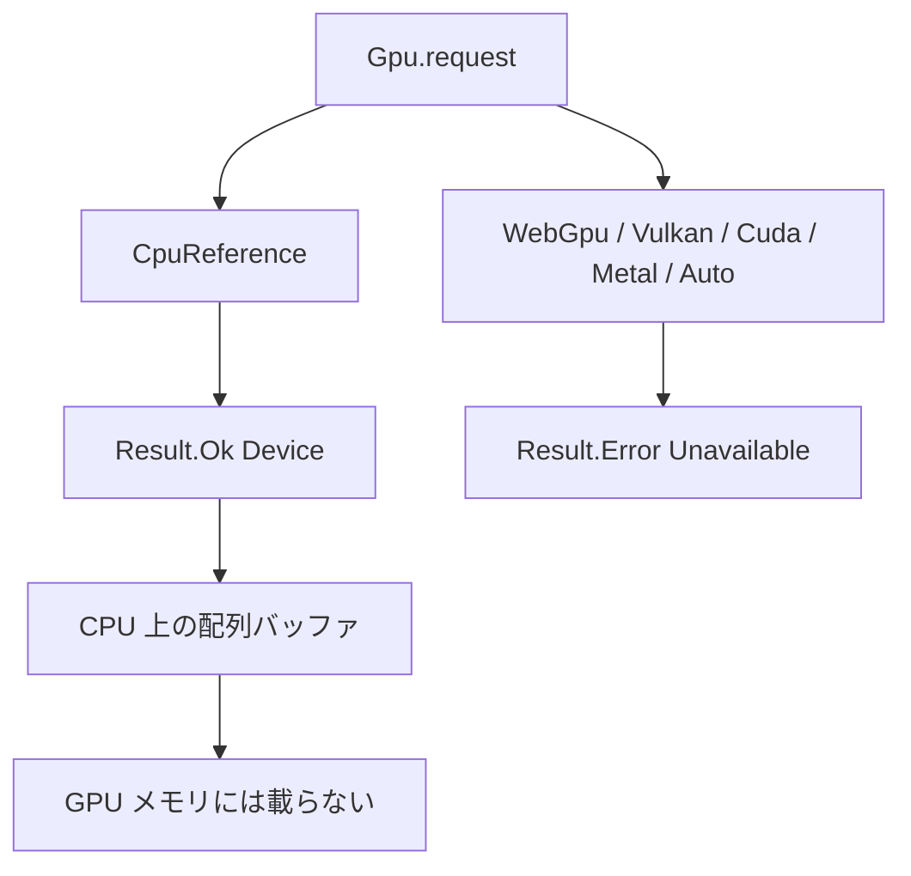

# Gpu

> [!WARNING]
> `Gpu` は実験的な Phase 1 です。カーネルの抽出、CPU 上の参照実装、WGSL の生成までを対象としています。通常の `tsuzuri build` が GPU ランタイムをリンクすることはありません。また、本ドキュメントは実機 GPU 上での動作確認に基づくものではありません。

将来の GPU オフロード機能に向けて、ホスト側のバッファ管理 API および WebGPU 向けシェーダーコード生成を実験的に検証するためのモジュールです。デバイス要求において `CpuReference` 以外を指定した場合はすべて失敗します。明示的な GPU 要求を暗黙に CPU 実行へ切り替えて成功扱いにすることはありません。

浮動小数点カーネルや、言語ランタイムからの実 GPU 実行は [F09](../../../_features/F09-gpu-float-runtime.md) として計画中です。計画中の構文は、このページの実行例には入れていません。

## この記事のポイント

- `Gpu.request Gpu.CpuReference` だけが `Result.Ok` です。`Auto` も CPU へのフォールバックではありません。
- `Device` と `Buffer` は不透明で、Copy ではありません。デバイスは `ref` で渡し、バッファは `map` と `to_array` が消費します。
- `--emit wgsl` が受け付けるのは、`export` された `i32 -> i32` か `i32u -> i32u` のカーネル 1 つです。除算と浮動小数点は拒否します。
- CPU 参照バッファは普通の配列です。GPU メモリに載っている、とは主張しません。

## CPU 参照で二乗を足す

```tsuzuri run=18
let device = Result.get (Gpu.request Gpu.CpuReference)
let buffer = Gpu.init (ref device) 4 (\index -> index * index)
let mapped = Gpu.map (ref device) (\value -> value + 1) buffer
let values = Gpu.to_array mapped
Array.sum ref values
```

実行結果:

```text
18
```

`index` は `i32`、`count` は `i64` です。`0*0+1` から `3*3+1` までを足して 18 です。`Gpu.map` は入力バッファを消費するので、`buffer` はもう使えません。結果が要るときは `Gpu.to_array` で配列に戻します。



他のバックエンドは、今はすべて `Unavailable` です。

```tsuzuri run=0
match Gpu.request Gpu.Auto with
| Result.Ok _device -> 1
| Result.Error _error -> 0
```

実行結果:

```text
0
```

`Auto` は「使えるものを選ぶ」ではありません。明示した GPU バックエンドを、黙って CPU の成功にしないための失敗です。

## 型と関数

`std/Gpu.tz` の公開面は次のとおりです。レコードのフィールドは不透明なので、`device.backend` や `buffer.values` は `E1022` です。

| 名前 | シグネチャ | 説明 |
| --- | --- | --- |
| `Gpu.Backend` | 共用体 | `CpuReference`、`WebGpu`、`Vulkan`、`Cuda`、`Metal`、`Auto` |
| `Gpu.Error` | 共用体 | `Unavailable` だけ |
| `Gpu.Device` | 不透明レコード | Copy ではない。`ref` で渡す |
| `Gpu.Buffer<'a>` | 不透明レコード | Copy ではない。中身はホストの配列 |
| `Gpu.request` | `Backend -> Result<Device, Error>` | `CpuReference` だけ成功 |
| `Gpu.backend` | `ref Device -> Backend` | 要求したバックエンドを返す。`Eq` はないので `match` する |
| `Gpu.init` | `ref Device -> i64 -> (i32 -> 'a) -> Buffer<'a>` | 添字からバッファを作る。範囲外の長さはトラップ |
| `Gpu.map` | `Copy<'a> => ref Device -> ('a -> 'b) -> Buffer<'a> -> Buffer<'b>` | バッファを消費して変換する |
| `Gpu.from_array` | `Copy<'a> => ref Device -> ref ['a] -> Buffer<'a>` | 配列を複製してバッファにする |
| `Gpu.to_array` | `Buffer<'a> -> ['a]` | バッファを消費して配列を返す |

CPU 参照バッファの要素型は `i32`、`i32u`、`i64`、`i64u`、`f32`、`f64` です。標準の配列と同じアロケータで解放します。`init` の `count` は 0 以上 2,147,483,647 以下です。範囲外は `assert` によるトラップで、`Result` にはなりません。

`init`、`map`、`from_array` は、その場で全部の引数を渡して呼ぶ必要があります。`let make = Gpu.init` は `E1018` です。コールバックは、捕捉のない静的な関数かラムダに限ります。使えるのはスカラーの局所変数、算術、比較、キャスト、`if`、既知の関数呼び出しです。

ヒープ確保、借用、ホスト関数、タスク、ループ、再帰、`assert`、未知の関数値は `E1018` です。カーネル抽出の入れ子 128、関数呼び出し 1024、式 65536 を超えると `E1017` です。CPU 参照の実行そのものは `Array.init` と `Array.map` なので、WGSL に出せない `f32` のバッファも、この参照実装では作れます。出せることと、CPU で試せることの範囲が違います。

## WGSL を出す

専用のソースに、`export` した 1 引数のスカラー関数を置きます。

```tsuzuri
export def square :: i32 -> i32
fn square value = value * value
```

このファイルだけのプロジェクトで、ターゲットも最適化も付けずに出します。

```sh
tsuzuri build Kernel.tz --emit wgsl -o kernel.wgsl
```

`-O`、`--target`、`--cpu` を付けると `E2000` です。`export` が 1 つでなければ `E2004` です。メッセージは「WGSL output requires exactly one exported scalar kernel」です。

生成されるシェーダーは、この版では次の形です。`i32` の二乗カーネルで確認しました。

- `@workgroup_size(256)` のコンピュートシェーダーです。
- エントリーポイントは `map_main` と `init_main` の両方が出ます。
- `binding(0)` が入力の storage、`binding(1)` が出力の storage、`binding(2)` が長さの uniform です。
- `init_main` は呼び出し ID をカーネルに渡し、`binding(0)` は読みません。宣言自体はシェーダーテキストに残ります。
- 整数の加減乗算は折り返しです。`i32` の乗算は、符号なしへ bitcast してから掛け、戻します。シフト量は下位 5 bit でマスクします。

除算と剰余は、WGSL と Tsuzuri のトラップの差を吸収できないため `E1018` です。`value / 2` は `tsuzuri check` は通り、`--emit wgsl` で拒否されます。

`f32` や `i64` の `export` も `E1018` です。メッセージは「strict WebGPU kernels require i32 or i32u buffer lanes」です。WGSL に 64 bit 整数がなく、浮動小数点はハードウェアごとに FMA や非正規化数の扱いが違うためです。CPU 参照実装の数値契約は、この拒否では変わりません。

## ホスト試作

Node.js 向けの試作が `src/runtime/webgpu.mjs` と `examples/gpu/run.mjs` にあります。アダプタを明示して要求し、`fromArray`、`init`、`map` のバッファをデバイス側に保持し、`toArray` のときにホストへ読み戻します。`map` と `toArray` はホストバッファを 1 回消費します。デバイス制限や実行時エラーは JavaScript の例外で、CPU へのフォールバックはありません。使い終わったら `close()` を await します。

起動例は次の形です。依存の `webgpu` パッケージは、リポジトリの依存には入っていません。

```sh
node examples/gpu/run.mjs kernel.wgsl
```

なお、本ドキュメントの執筆段階において、実機 GPU 環境での動作確認は実施していません。Tsuzuri コンパイラ自身も特定の GPU ベンダーやドライバへの依存を持ちません。

## まだないもの

Phase 1 の対象外となっている機能は、今後のフェーズでの対応が計画されています。

| 項目 | 状態 |
| --- | --- |
| `Gpu.request Gpu.WebGpu` の成功 | 未実装。現在は `Unavailable` |
| 通常のランタイムから GPU でカーネルを実行する | 未実装。F09 の Phase 2 として計画中 |
| 浮動小数点や 64 bit の WGSL | 未実装。`E1018`。F09 で別名 API が計画中 |
| `Vulkan`、`Cuda`、`Metal`、`Auto` の実体 | 未実装。要求は失敗する |
| 暗黙の CPU フォールバック | 意図的に提供しない |

F09 は承認待ちの計画です。`Gpu.map_relaxed` や `--emit wgsl-relaxed` という名前は承認後の案であり、現在のコンパイラには存在しません。

## 注意点

- CPU 参照実装は機能検証を主眼としており、GPU 実行と比較した性能上の優位性を意図したものではありません。ベンチマークを測定する場合は、ホスト・デバイス間の転送、コマンドキューのディスパッチ、結果の読み戻しを明確に切り分けて評価してください。手順は [性能測定](../../../docs/benchmarks.md) にあります。
- `Gpu.map` は `Copy` が要ります。文字列のような非 Copy 要素はバッファにできません。
- カーネルにループを書くと、CPU 参照の抽出検査で `E1018` になります。要素ごとの式にしてください。
- WASM の `simd128` や [`Parallel`](parallel.md) とは別の機能です。GPU 出力が SIMD 命令になるわけではありません。

## まとめ

- Phase 1 は、CPU 参照バッファと、`i32` / `i32u` の WGSL 生成です。
- `CpuReference` 以外の `Gpu.request` は `Unavailable` です。`Auto` も成功しません。
- `Device` と `Buffer` は不透明で、Copy ではありません。
- `--emit wgsl` にはターゲットも最適化も付けません。除算と浮動小数点は出せません。
- 実 GPU での実行確認は、この記事の範囲外です。

## 関連項目

- [Parallel](parallel.md)
- [Simd](simd.md)
- [Result](result.md)
- [コンパイラ オプション](../compiler/option.md)
- [言語仕様の GPU Kernel](../../../docs/language.md#gpu-kernel実験的-phase-1)
- [F09 の計画](../../../_features/F09-gpu-float-runtime.md)
- [性能測定](../../../docs/benchmarks.md)
- [言語リファレンスの目次](../index.md)
