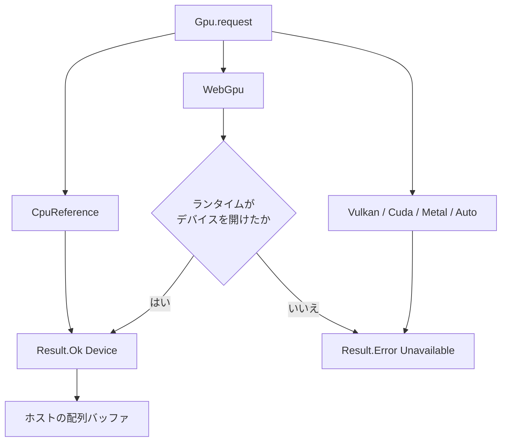

# Gpu

> [!WARNING]
> `Gpu` は実験的です。カーネルの抽出、CPU 上の参照実装、WGSL の生成（厳密な整数と、名前で選ぶ緩い `f32`・`f16`）、`Gpu.request Gpu.WebGpu` による WebGPU 上の実行（native は wgpu-native を実行時に読み込み、WebAssembly は `--wasm-feature webgpu` のホストを使う）までを対象としています。`Gpu.WebGpu` を使わないプログラムが GPU ランタイムをリンクすることはなく、WebAssembly の既定の出力は import を持ちません。GPU 上の結果は、Apple M1 Max（Metal）で、native は wgpu-native 29、WebAssembly は Dawn で確かめた範囲のものです。Windows と Linux、Apple 以外の GPU では確かめていません。

ホスト側のバッファ管理 API、WebGPU 向けシェーダーコード生成、WebGPU 上の実行を、実験的に検証するためのモジュールです。`CpuReference` と `WebGpu` 以外のバックエンドの要求は、すべて失敗します。`Gpu.request Gpu.WebGpu` が失敗する（ライブラリがない、アダプタがない、必要な機能がない）ときも、明示的な GPU 要求を暗黙に CPU 実行へ切り替えて成功扱いにすることはありません。失敗は `Result.Error Gpu.Unavailable` で、CPU へ切り替えるかどうかはプログラムが書きます。

`Vulkan`、厳密な `f32` と 64 bit 整数の GPU 実行、`Auto` の実体は [F09](../../../_features/F09-gpu-float-runtime.md) の Phase 3 として計画中です。このページの実行例には入れていません。

## この記事のポイント

- `Gpu.request Gpu.CpuReference` は常に `Result.Ok` です。`Gpu.request Gpu.WebGpu` は、ランタイムがデバイスを開けたときだけ `Result.Ok` で、開けなければ `Result.Error Gpu.Unavailable` です。`Auto` も CPU へのフォールバックではなく、`Unavailable` です。
- WebGPU デバイスでの `Gpu.init` と `Gpu.map` は、`i32` と `i32u` の lane だけを GPU で動かし、CPU 参照とビット単位で一致します。厳密な浮動小数点や 64 bit の lane は GPU で動かず、理由を標準エラーに出してトラップします。CPU や緩い意味に黙って切り替えることはありません。
- GPU で `f32` と `f16` を使うには、名前に `relaxed` を持つ `Gpu.init_relaxed`・`Gpu.map_relaxed` と `--emit wgsl-relaxed` を選びます。GPU の結果は厳密ではありません。CPU 参照は、`Gpu.map` と同じ厳密な結果を返します。
- 1 回の `Gpu.init`・`Gpu.map` は、ホスト配列の複製、アップロード、実行、完了待ち、読み戻しまでを呼び出しの中で終え、デバイスにバッファを残しません。転送と同期を含めて測った結果は [性能測定](../../../docs/benchmarks.md#gpu-デバイスのランタイムf09-phase-2) にあります。
- `Device` と `Buffer` は不透明で、Copy ではありません。デバイスは `ref` で渡し、バッファは `map` と `to_array` が消費します。
- `--emit wgsl` が受け付けるのは、`export` された `i32 -> i32` か `i32u -> i32u` のカーネル 1 つです。除算と浮動小数点は拒否します。
- バッファは、CPU 参照でも WebGPU でも普通の配列です。GPU メモリに常駐するバッファは、まだありません。

## CPU 参照で二乗を足す

```tsuzuri run=18
let device = Result.get (Gpu.request Gpu.CpuReference)
let buffer = Gpu.init (ref device) 4 (\index -> index * index)
let mapped = Gpu.map (ref device) (\value -> value + 1) buffer
let values = Gpu.to_array mapped
Array.sum ref values
```

実行結果:

```text
18
```

`index` は `i32`、`count` は `i64` です。`0*0+1` から `3*3+1` までを足して 18 です。`Gpu.map` は入力バッファを消費するので、`buffer` はもう使えません。結果が要るときは `Gpu.to_array` で配列に戻します。



`WebGpu` 以外の GPU バックエンドは、今はすべて `Unavailable` です。

```tsuzuri run=0
match Gpu.request Gpu.Auto with
| Result.Ok _device -> 1
| Result.Error _error -> 0
```

実行結果:

```text
0
```

`Auto` は「使えるものを選ぶ」ではありません。明示した GPU バックエンドを、黙って CPU の成功にしないための失敗です。

## WebGPU デバイスで動かす

`Gpu.request Gpu.WebGpu` は、言語ランタイムが WebGPU のデバイスを開けたときだけ `Result.Ok` です。ライブラリがない、アダプタがない、ライブラリのバージョンが合わない、プログラムのカーネルが要る機能（`shader-f16`）をアダプタが持たない、のどれでも `Result.Error Gpu.Unavailable` で、CPU への置き換えはしません。次の例は、プログラムが自分で CPU 参照へ切り替える書き方です。どちらで動いても結果は同じなので、GPU のない環境でも同じ出力になります。

```tsuzuri run=35
def scale :: i32 -> i32
fn scale value = value * 3 + 1

def total :: ref Gpu.Device -> i32
fn total device = {
    let values = Gpu.to_array (Gpu.init device 5 scale);
    Array.sum (&values)
}

match Gpu.request Gpu.WebGpu with
| Result.Ok device -> total (&device)
| Result.Error _ -> {
    let reference = Result.get (Gpu.request Gpu.CpuReference);
    total (&reference)
}
```

実行結果:

```text
35
```

`scale` は `i32 -> i32` の厳密なカーネルなので、WebGPU デバイスでも CPU 参照とビット単位で同じ結果になります。`1 + 4 + 7 + 10 + 13` で 35 です。どちらのデバイスで動いたかは、結果からは分かりません。

### 何が GPU で動くか

コールバックは、これまでどおり捕捉のない静的な関数かラムダに限ります。コンパイラは、`Gpu.WebGpu` を使うプログラムの呼び出し箇所ごとに、コールバックの WGSL を作って実行ファイルに埋め込みます。厳密な呼び出しと緩い呼び出しは別々のカーネルです。`Gpu.WebGpu` を使わないプログラムには、GPU ランタイムのコードも WebAssembly の import も増えません。

| 呼び出し | lane（引数と結果の型） | WebGPU デバイスでの動作 |
| --- | --- | --- |
| `Gpu.init`・`Gpu.map` | `i32`、`i32u` | GPU で動く。CPU 参照とビット単位で一致 |
| `Gpu.init`・`Gpu.map` | `f32`、`f16`、`f64`、`i64`、`i64u`、`bool` | GPU のカーネルがない。理由を標準エラーに 1 行出してトラップ |
| `Gpu.init_relaxed`・`Gpu.map_relaxed` | `f32`、`f16`、`i32`、`i32u` | GPU で動く。浮動小数点の結果は緩い |
| `Gpu.init_relaxed`・`Gpu.map_relaxed` | `f64`、`i64`、`i64u`、`bool` | コンパイル時に `E1018` |

2 行目が、厳密な言語の意味を黙って変えないための選択です。コールバックの中に `f32` などの局所値があれば、lane が `i32` でも同じです。厳密な `Gpu.map` に `f32` のバッファを渡して WebGPU デバイスで動かすと、`this call has no WGSL kernel: a strict Gpu.map or Gpu.init runs on a WebGPU device only with i32 or i32u lanes; use Gpu.map_relaxed or Gpu.init_relaxed for f32 or f16` を標準エラーに出してトラップします。CPU 参照で動かす、緩い名前に替える、のどちらかをプログラムが選びます。

デバイスは呼び出しごとに、配列を複製してアップロードし、カーネルを実行し、完了を待ち、結果を読み戻します。バッファは、CPU 参照と同じホストの配列のままです（`Gpu.to_array` は転送をしません）。呼び出しのあとデバイスに残るものはありません。`Gpu.map` を重ねた分だけ、アップロードと読み戻しも重なります。

- 1 回の呼び出しの lane 数は 2,147,483,647 以下です。デバイスの上限（`maxStorageBufferBindingSize`、`maxBufferSize`、1 次元あたりのワークグループ数 × 256）を超えると、理由を標準エラーに出してトラップします。Apple M1 Max の上限は 65,535 × 256 = 16,776,960 lane でした。
- `Gpu.request` が成功したあとの実行時エラー（シェーダーのコンパイル失敗、デバイスの喪失、上限超過）も、理由を標準エラーに 1 行出してトラップします。`Result` では返りません。
- ランタイムは、プロセスに 1 つのデバイスを、最初の `Gpu.request Gpu.WebGpu` で開き、終了時に閉じます。複数のスレッドから呼ぶと、1 回ずつ順に動きます。
- 同じ WGSL のパイプラインは作り直しません。最初の呼び出しにだけ、パイプラインの作成が入ります。

### native: wgpu-native を実行時に読み込む

native のランタイムは、リンク時の依存を持ちません。`Gpu.request Gpu.WebGpu` が最初に呼ばれたとき、`dlopen`（Windows は `LoadLibrary`）で wgpu-native を探して、WebGPU の C API の必要な部分だけを読み込みます。

| 環境変数 | 意味 |
| --- | --- |
| `TSUZURI_WEBGPU_LIBRARY` | 読み込むライブラリのパス。設定すると、これだけを試します。空文字は WebGPU を無効にし、`request` は `Unavailable` です |
| `TSUZURI_GPU_DEBUG` | 空でなければ、`request` が `Unavailable` になった理由と、デバイスで動かした呼び出しごとの `map|init <lane 数> lanes, kinds 0x<出力><入力>`（lane の種類は 1 が 32 bit 整数、2 が `f32`、3 が `f16`）を標準エラーに出します |

`TSUZURI_WEBGPU_LIBRARY` がなければ、macOS は `libwgpu_native.dylib`（と `/opt/homebrew/lib`、`/usr/local/lib`）、Linux は `libwgpu_native.so`、Windows は `wgpu_native.dll` を探します。この版が対応するのは wgpu-native 29 です。`wgpuGetVersion` の主バージョンが 29 でない、またはこの API の関数が足りないライブラリは、`Unavailable` です。ソースからビルドした wgpu-native（Homebrew の `wgpu-native` など）は、バージョンとして 0 を返します。それは、`TSUZURI_WEBGPU_LIBRARY` で名指ししたときだけ、29 だと利用者が保証したものとして受け入れます。アダプタは高性能のものを求め、256 invocation のワークグループが使えなければ `Unavailable` です。

```sh
tsuzuri build Main.tz -o app
TSUZURI_WEBGPU_LIBRARY=/opt/homebrew/opt/wgpu-native/lib/libwgpu_native.dylib ./app
TSUZURI_GPU_DEBUG=1 ./app    # 読み込めない理由が標準エラーに出る
```

### WebAssembly: `--wasm-feature webgpu`

WebAssembly の既定の出力は、`Gpu.WebGpu` を使っても import を持たず、`Gpu.request Gpu.WebGpu` は `Unavailable` です。`--wasm-feature webgpu` を付けると、`tsuzuri_gpu.open` と `tsuzuri_gpu.run` の 2 つだけを import します。`Gpu.WebGpu` を使わないプログラムは、付けても import を持ちません。

```sh
tsuzuri build Main.tz --target wasm32 --wasm-feature webgpu -o app.wasm
```

2 つの import は、WebGPU のアダプタを待つために、JavaScript Promise Integration（JSPI）でモジュールを中断します。`src/runtime/webgpu.mjs` の `createGpuImports(gpu, getMemory)` が、`navigator.gpu` や Node.js の `webgpu` バインディングから作ります。export は `WebAssembly.promising` で包んで呼び、終わったら `close()` を await します。Node.js 24 以降で確かめました。

```js
import { createGpuImports } from "./src/runtime/webgpu.mjs";

const host = createGpuImports(navigator.gpu, () => instance.exports.memory);
const { instance } = await WebAssembly.instantiate(bytes, { tsuzuri_gpu: host.imports });
console.log(await WebAssembly.promising(instance.exports.tz_total)());
await host.close();
```

`--wasm-feature webgpu` は `wasm32` の object、LLVM IR、WASM だけで、`--wasm-feature threads`、`--wasm-host`、JavaScript バインディング（`--emit bindings-js`）とは組み合わせられず、`E2000` です。`jspi` とは独立です。WebAssembly の線形メモリの既定の上限は 16 MiB なので、大きなバッファには `--wasm-max-memory` を付けます。


## 型と関数

`std/Gpu.tz` の公開面は次のとおりです。レコードのフィールドは不透明なので、`device.backend` や `buffer.values` は `E1022` です。

| 名前 | シグネチャ | 説明 |
| --- | --- | --- |
| `Gpu.Backend` | 共用体 | `CpuReference`、`WebGpu`、`Vulkan`、`Cuda`、`Metal`、`Auto` |
| `Gpu.Error` | 共用体 | `Unavailable` だけ |
| `Gpu.Device` | 不透明レコード | Copy ではない。`ref` で渡す |
| `Gpu.Buffer<'a>` | 不透明レコード | Copy ではない。中身はホストの配列 |
| `Gpu.request` | `Backend -> Result<Device, Error>` | `CpuReference` は常に成功。`WebGpu` はデバイスが開けたときだけ成功。他は `Unavailable` |
| `Gpu.backend` | `ref Device -> Backend` | 要求したバックエンドを返す。`Eq` はないので `match` する |
| `Gpu.init` | `ref Device -> i64 -> (i32 -> 'a) -> Buffer<'a>` | 添字からバッファを作る。範囲外の長さはトラップ |
| `Gpu.map` | `Copy<'a> => ref Device -> ('a -> 'b) -> Buffer<'a> -> Buffer<'b>` | バッファを消費して変換する |
| `Gpu.init_relaxed` | `ref Device -> i64 -> (i32 -> 'a) -> Buffer<'a>` | `Gpu.init` と同じ。コールバックに緩い `f32`・`f16` カーネルの規則をかける |
| `Gpu.map_relaxed` | `Copy<'a> => ref Device -> ('a -> 'b) -> Buffer<'a> -> Buffer<'b>` | `Gpu.map` と同じ。コールバックに緩い `f32`・`f16` カーネルの規則をかける |
| `Gpu.from_array` | `Copy<'a> => ref Device -> ref ['a] -> Buffer<'a>` | 配列を複製してバッファにする |
| `Gpu.to_array` | `Buffer<'a> -> ['a]` | バッファを消費して配列を返す |

CPU 参照バッファの要素型は `i32`、`i32u`、`i64`、`i64u`、`f16`、`f32`、`f64` です。標準の配列と同じアロケータで解放します。`init` の `count` は 0 以上 2,147,483,647 以下です。範囲外は `assert` によるトラップで、`Result` にはなりません。

`init`、`map`、`from_array`（と `init_relaxed`、`map_relaxed`）は、その場で全部の引数を渡して呼ぶ必要があります。`let make = Gpu.init` は `E1018` です。コールバックは、捕捉のない静的な関数かラムダに限ります。使えるのはスカラーの局所変数、算術、比較、キャスト、`if`、既知の関数呼び出しです。

ヒープ確保、借用、ホスト関数、タスク、ループ、再帰、`assert`、未知の関数値は `E1018` です。カーネル抽出の入れ子 128、関数呼び出し 1024、式 65536 を超えると `E1017` です。CPU 参照の実行そのものは `Array.init` と `Array.map` なので、WGSL に出せない `f32` のバッファも、この参照実装では作れます。出せることと、CPU で試せることの範囲が違います。

## WGSL を出す

専用のソースに、`export` した 1 引数のスカラー関数を置きます。

```tsuzuri
export def square :: i32 -> i32
fn square value = value * value
```

このファイルだけのプロジェクトで、ターゲットも最適化も付けずに出します。

```sh
tsuzuri build Kernel.tz --emit wgsl -o kernel.wgsl
```

`-O`、`--target`、`--cpu` を付けると `E2000` です。`export` が 1 つでなければ `E2004` です。メッセージは「WGSL output requires exactly one exported scalar kernel」です。

生成されるシェーダーは、この版では次の形です。`i32` の二乗カーネルで確認しました。

- `@workgroup_size(256)` のコンピュートシェーダーです。
- エントリーポイントは `map_main` と `init_main` の両方が出ます。
- `binding(0)` が入力の storage、`binding(1)` が出力の storage、`binding(2)` が長さの uniform です。
- `init_main` は呼び出し ID をカーネルに渡し、`binding(0)` は読みません。宣言自体はシェーダーテキストに残ります。
- 整数の加減乗算は折り返しです。`i32` の乗算は、符号なしへ bitcast してから掛け、戻します。シフト量は下位 5 bit でマスクします。

除算と剰余は、WGSL と Tsuzuri のトラップの差を吸収できないため `E1018` です。`value / 2` は `tsuzuri check` は通り、`--emit wgsl` で拒否されます。

`f32` や `f16`、`i64` の `export` も、`--emit wgsl` では `E1018` です（`f16` は `export` 自体が `E1008` です）。メッセージは「strict WebGPU kernels require i32 or i32u buffer lanes; 64-bit lanes are unavailable and f32 or f16 lanes need --emit wgsl-relaxed」です。WGSL に 64 bit 整数がなく、浮動小数点はハードウェアごとに FMA や非正規化数の扱いが違うためです。CPU 参照実装の数値契約は、この拒否では変わりません。`f32` を局所変数に持つ `i32` のカーネルも、厳密な出力では同じ `E1018` です。

## 緩い f32 カーネル

厳密な言語の `f32` は、再結合も暗黙の FMA もなく、非正規化数・NaN・符号付きゼロを保ちます。WGSL はこれらを保証しないので、GPU の `f32`（と `f16`）は別の名前で選びます。選ぶのは利用者で、`Gpu.map` や `--emit wgsl` が黙って緩い意味に切り替わることはありません。

| 厳密 | 緩い |
| --- | --- |
| `Gpu.init`、`Gpu.map` | `Gpu.init_relaxed`、`Gpu.map_relaxed` |
| `--emit wgsl` | `--emit wgsl-relaxed` |

```tsuzuri run=16
let device = Result.get (Gpu.request Gpu.CpuReference)
let generated = Gpu.init_relaxed (ref device) 8 (\index -> (index as f32) * 0.5 + 0.25)
let values = Gpu.to_array generated
Array.sum ref values
```

実行結果:

```text
16
```

CPU 参照の結果は、`Gpu.init` と `Gpu.map` と同じく厳密です。`0.25 + 0.75 + … + 3.75` は `f32` で正確に足せるので 16 です。緩い名前を使っても、CPU 参照では native と WebAssembly の `-O0`・`-O3` が、`Gpu.map` とビット単位で一致します。

緩い `f32` と `f16` の契約です。この API と `--emit wgsl-relaxed` の中だけに適用します。

1. CPU 参照は、厳密な規則でカーネルを評価します。厳密な結果は、緩い規則が許す結果の一つです。
2. `--emit wgsl-relaxed` の shader を GPU で動かすと、`a * b + c` を一回丸めの積和にしたり、`+`・`*` の結合と順序を変えたり、非正規化数の入力・中間値・結果をどちらかの符号のゼロにしたり、`/` を WGSL の精度（2.5 ulp）で計算したり、整数から `f32`・`f16` への変換や `f32` から `f16` への変換を隣り合う二つの値のどちらかにしたりすることがあります。
3. 入力・中間値・結果のどれかが NaN・無限大、またはオーバーフローしたとき、その要素の結果は未規定の `f32`・`f16`（比較なら未規定の `bool`）です。トラップはせず、ほかの要素には影響しません。浮動小数点に依存する分岐と、その先の整数結果が変わることがあります。
4. 整数の値と演算は、厳密な場合と同じ意味を保ちます。
5. 同じデバイスとドライバでも、実行ごとの一致は保証しません。誤差の上限は言語として約束しません。
6. 緩いカーネルはトラップしません。

使える型と演算は、厳密な場合より少し広く、次のとおりです。

| 対象 | 使えるもの | 拒否（`E1018`） |
| --- | --- | --- |
| バッファの要素（カーネルの引数と結果） | `f16`、`f32`、`i32`、`i32u` | `f64`、`i64`、`i64u`、`bool` |
| 局所変数と、呼ぶ関数の引数・結果 | `f16`、`f32`、`i32`、`i32u`、`bool` | `f64`、`i64`、`i64u` |
| `f16` と `f32` の演算 | 単項 `-`、`+`、`-`、`*`、`/`、`==`、`!=`、`<`、`<=`、`>`、`>=` | `**` |
| キャスト | `i32` と `i32u` から `f32` と `f16`、`f16` から `f32`、`f32` から `f16`、同じ型へ、`i32` と `i32u` の間 | `f32`・`f16` から整数、`f32` と `f64` の間 |
| 整数の演算 | 厳密な場合と同じ（折り返し、シフト量は下位 5 bit） | 除算と剰余 |

`f32` のリテラルは、丸めを WGSL の字句解析に任せないよう `bitcast<f32>(<bit 列>u)` で出します。`f16` のリテラルは、その値を `f32` のビット列に直して `f16(bitcast<f32>(<bit 列>u))` で出します。`f16` の値は `f32` で正確に表せるので、丸めは起きません。`f32` の剰余演算子は、言語にまだありません。

専用のソースに緩いカーネルを置いて出力します。

```tsuzuri
export def horner :: f32 -> f32
fn horner value = ((value * 0.5 + 0.25) * value + 0.125) * value + 1.0
```

```sh
tsuzuri build Kernel.tz --emit wgsl-relaxed -o kernel.wgsl
```

出力の 1 行目は `// tsuzuri-gpu float=relaxed input=f32 output=f32` で、`input` と `output` は `f32`・`i32`・`u32` のどれかです。厳密な出力には、この行がありません。オプションの扱いは `--emit wgsl` と同じで、`-O`・`--target`・`--cpu` との併用は `E2000`、`export` が 1 つでなければ `E2004` です。`f64` のカーネルは `E1018`（メッセージは「relaxed WebGPU kernels support f32, i32, and i32u values; WGSL has no f64 or 64-bit integers」）で、既存の出力ファイルは残ります。

Dawn の Metal バックエンド（Apple M1 Max、`webgpu` 0.6.1）で、5 つのカーネルを 263 個の入力で実行し、JavaScript が `Math.fround` で一演算ごとに丸めた参照と比べました。許容誤差は、演算ごとの重みの和です（`+`・`-`・`*` は 2 ulp、`/` は 3 ulp、整数から `f32` への変換は 1 ulp）。観測した最大誤差は `x * x + x` が 1 ulp、3 次の Horner 式が 1 ulp、`(x + 1) / (x * x + 2)` が 2 ulp、`(i as f32) * 0.5 + 0.25` と `if x * x > 2.0 then 1 else 0` が 0 でした。この比較は、相殺のない `[2^-8, 2^8]` の正規数だけを対象にしています。特殊値（0、-0、非正規化数、NaN、無限大）は、結果の長さだけを見ます。別の GPU、ドライバ、OS では結果が変わることがあります。

## 緩い f16 カーネル

`f16` の lane、局所値、引数、結果は、緩い呼び出しの中でだけ GPU に出せます。CPU 参照は、厳密な言語の（ソフトウェアの）`f16` で評価し、`f32` と同じく `Gpu.map` とビット単位で一致します。生成する WGSL は、1 行目の宣言のあとに `enable f16;` を持ち、`array<f16>` の storage を使います。

- アダプタが `shader-f16` を持たないと、その WGSL を含むプログラムの `Gpu.request Gpu.WebGpu` は `Unavailable` です。デバイスは `shader-f16` を要求して開きます。`f16` を黙って `f32` に替えることも、`f16` のカーネルだけ CPU で動かすこともありません。プログラムに `f16` のカーネルが 1 つでもあれば、`f32` や整数のカーネルを含めて、そのプログラムの要求全体が `shader-f16` を要ります。`f16` を使わないプログラムは、`shader-f16` を要求しません。
- `f16` は `export` できない（`E1008`）ので、`--emit wgsl-relaxed` の根にはできません。`f32` の根の中で `f16` を使うことはできます。言語ランタイムの `Gpu.init_relaxed`・`Gpu.map_relaxed` は、`f16` の lane を埋め込みの WGSL で動かします。
- `f16` の lane は 2 byte で、バッファは 4 byte の倍数に切り上げます。奇数個の lane でも、読み戻しは要素数ぶんだけです。

Apple M1 Max で、native（wgpu-native 29）と WebAssembly（Dawn）の両方が `shader-f16` を持ちました。`f16 -> f16`（`x * x + x`）、`f16 -> f32`、`f32 -> f16`、`i32 -> f16` の lane の組を、0 から 70,000 までの 9 通りの lane 数で CPU 参照と比べ、`f16` の結果は 4 ulp（相対で 0.4 %）以内でした。`x * x + x`（`x` は 0 から 40）は `f16` で正確に表せるので、`tests/gpu.mjs` は Node.js の資源 API（`Uint16Array` のビット列）の結果が正確に一致することも確かめています。

## ホスト試作

Node.js 向けの試作が `src/runtime/webgpu.mjs` と `examples/gpu/run.mjs` にあります。`createWebGpu(gpu, { features })` でアダプタを明示して要求し（`features: ["shader-f16"]` で `f16` のカーネルを使えるデバイスを作ります）、`fromArray`、`init`、`map` のバッファをデバイス側に保持し、`toArray` のときにホストへ読み戻します。`map` と `toArray` はホストバッファを 1 回消費します。デバイス制限や実行時エラーは JavaScript の例外で、CPU へのフォールバックはありません。使い終わったら `close()` を await します。WebAssembly 向けの `createGpuImports` も、同じファイルにあります。

- `fromArray` は `Int32Array`・`Uint32Array`・`Float32Array`・`Uint16Array`（`f16` の bit 列）を受けます。それ以外は `TypeError` です。バッファは要素の種類（`f32`、`f16`、32 bit 整数）を持ち、`toArray` は `f32` のバッファを `Float32Array`、`f16` のバッファを `Uint16Array`、整数のバッファを `Uint32Array` で返します。
- `prepare(source, { float: "relaxed" })` は、`--emit wgsl-relaxed` の出力を受け取るときの形です。`{ float: "relaxed" }` がないと、1 行目の宣言を見て拒否します。緩い意味を、ホストの境界で暗黙に受け入れないためです。`enable f16;` を持つ WGSL は、デバイスが `shader-f16` を持たなければ拒否します。
- `map` に、カーネルの入力と種類が違うバッファ（`f32` の入力に整数のバッファなど）を渡すと `TypeError` で、そのバッファは消費されません。

起動例は次の形です。依存の `webgpu` パッケージは、リポジトリの依存には入っていません。

```sh
node examples/gpu/run.mjs kernel.wgsl
```

実 GPU での確認は、2026-10-10 に Apple M1 Max で、`TSUZURI_WEBGPU=1 node tests/gpu.mjs target/release/tsuzuri`（Dawn の Metal）と、`TSUZURI_WEBGPU=1 TSUZURI_WEBGPU_LIBRARY=<wgpu-native 29> node tests/gpu_runtime.mjs target/release/tsuzuri`（native は wgpu-native、WebAssembly は Dawn と JSPI）として行いました。Tsuzuri コンパイラ自身は、特定の GPU ベンダーやドライバへの依存を持ちません。

## まだないもの

次の機能は、まだありません。

| 項目 | 状態 |
| --- | --- |
| 厳密な浮動小数点や 64 bit の GPU 実行 | 未実装。`--emit wgsl` は `E1018`、WebGPU デバイスでは理由を出してトラップ。F09 の Phase 3 として計画中 |
| `Vulkan`、`Cuda`、`Metal`、`Auto` の実体 | 未実装。要求は `Unavailable`。`Vulkan` と `Auto` は F09 の Phase 3 として計画中 |
| GPU メモリに常駐するバッファ | 未実装。呼び出しごとに転送する |
| JavaScript バインディング（`--emit bindings-js`）の WebGPU | 未実装。`--wasm-feature webgpu` との組み合わせは `E2000` |
| Windows と Linux、Apple 以外の GPU での確認 | していない。ローダーは書いてあるが、動作は確かめていない |
| 暗黙の CPU フォールバック | 意図的に提供しない |

## 注意点

- CPU 参照実装は機能検証を主眼としており、GPU 実行と比較した性能上の優位性を意図したものではありません。WebGPU デバイスは、呼び出しごとに転送と同期をするので、計算の小さいカーネルでは、測った lane 数（4,194,304 まで）の全部で CPU 参照より遅く、64 回の積和をつないだカーネルでは、16,384 lane で遅く 262,144 lane で速くなりました（Apple M1 Max の native、1 回の測定。[性能測定](../../../docs/benchmarks.md#gpu-デバイスのランタイムf09-phase-2)）。ベンチマークを測定する場合は、ホスト・デバイス間の転送、コマンドキューのディスパッチ、結果の読み戻しを明確に切り分けて評価してください。
- `Gpu.map` は `Copy` が要ります。文字列のような非 Copy 要素はバッファにできません。
- カーネルにループを書くと、CPU 参照の抽出検査で `E1018` になります。要素ごとの式にしてください。
- 緩い名前を使っても、CPU 参照は厳密です。緩いのは GPU で動かした結果だけで、それを確かめるテストも、GPU の結果だけを許容誤差で比べます。
- WebGPU デバイスで動く厳密な呼び出しの結果が CPU 参照と違うことはありません（`i32` と `i32u` はビット単位で一致します）。`f32` や `f16` の厳密な呼び出しは、動かずにトラップします。
- WASM の `simd128` や [`Parallel`](parallel.md) とは別の機能です。GPU 出力が SIMD 命令になるわけではありません。

## まとめ

- 厳密な GPU は、`i32` / `i32u` の WGSL 生成と、WebGPU デバイスでの実行までです。除算と、厳密な浮動小数点は出せません。
- `f32` と `f16` は、`Gpu.init_relaxed`・`Gpu.map_relaxed`・`--emit wgsl-relaxed` で、緩い意味を選んだときだけ GPU 向けに出せます。
- `Gpu.request Gpu.WebGpu` は、デバイスが開けたときだけ成功し、開けなければ `Unavailable` です。`Vulkan`、`Cuda`、`Metal`、`Auto` も成功しません。CPU への切り替えは、プログラムが書きます。
- native は wgpu-native 29 を実行時に読み込み（`TSUZURI_WEBGPU_LIBRARY`）、WebAssembly は `--wasm-feature webgpu` と JSPI のホストが要ります。
- 呼び出しごとに転送と同期をします。デバイスに常駐するバッファはありません。
- `Device` と `Buffer` は不透明で、Copy ではありません。
- `--emit wgsl` と `--emit wgsl-relaxed` にはターゲットも最適化も付けません。

## 関連項目

- [Parallel](parallel.md)
- [Simd](simd.md)
- [Matrix](matrix.md) — `Matrix.as_array` と `Matrix.of_array` で行列の要素を CPU 参照バッファへ渡せます。行列積の GPU カーネルはありません
- [Result](result.md)
- [コンパイラ オプション](../compiler/option.md)
- [言語仕様の GPU Kernel](../../../docs/language.md#gpu-kernel実験的)
- [F09 の計画](../../../_features/F09-gpu-float-runtime.md)
- [性能測定](../../../docs/benchmarks.md)
- [言語リファレンスの目次](../index.md)
