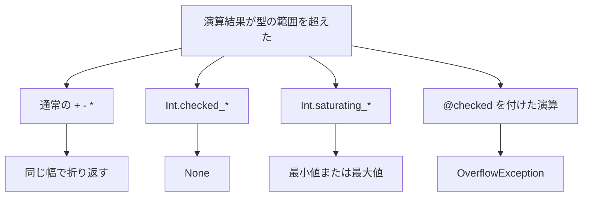

# Int

`Int` は、固定幅の整数を扱う組み込みモジュールです。型の名前ではありません。`i8` から `i128` までの符号付き・符号なし整数に対して、選択、絶対値、ビット操作、検査付き演算、飽和演算、拡大乗算を、幅と符号を保ったまま提供します。桁数に上限のない整数は [`BigInt`](bigint.md) です。

通常の `+` は溢れると折り返します。失敗を値にしたいとき、端で留めたいとき、例外にしたいときは、名前で契約を選びます。暗黙の型変換はありません。

## この記事のポイント

- `Int.min` や `Int.checked_add` は、引数の整数型をそのまま結果に使います。`i8` を渡して `i32` が返ることはありません。
- 溢れたときの振る舞いは、目的に応じて「折り返し」「`Maybe.None`」「飽和」「`OverflowException` の送出」の 4 通りから選べます。
- 整数は Copy 型です。`Int` の関数は値を受け取り、`ref` は取りません。
- 符号付き整数の最小値に対する絶対値は、同幅での表現不可を考慮して `abs` と `unsigned_abs` で挙動が分かれています。

## 在庫を型の端で留める

次の例は、注文数を 0 から 10 に収め、16 bit の在庫加算を飽和させ、8 bit のカウンタが折り返すことも確認します。

```tsuzuri run=10:300:-128
let stock = Int.clamp 12 0 10
let safe = Int.saturating_add 200i16 100i16
let wrapped = 127i8 + 1i8
let overflow = Int.checked_add 2147483647 1
assert (Maybe.is_none ref overflow)
$"{stock}:{safe}:{wrapped as i64}"
```

実行結果:

```text
10:300:-128
```

`Int.clamp 12 0 10` において、文脈から型が決まらない整数リテラルの既定型は `i32` です。`200i16` のように接尾辞を付けるとビット幅が確定します。`Int.checked_add` は溢れると `None` を返します（トラップはしません）。`Maybe` は `Eq` 型クラスを実装していないため、`== Maybe.None` ではなく `Maybe.is_none` で判定します。



## 関数の一覧

制約の `Integer` は、符号付き・符号なしの 8 / 16 / 32 / 64 / 128 bit です。`SignedInteger` は符号付きだけ、`UnsignedInteger` は符号なしだけです。呼び出し位置で具象の幅が決まらないと、`unsigned_abs`、`abs_diff`、`widening_mul` は `E1015` になります。

### 選択と絶対値

| 関数 | シグネチャ | 説明 |
| --- | --- | --- |
| `Int.min` | `Integer<'a> => 'a -> 'a -> 'a` | 小さい方。比較は引数の符号に従う |
| `Int.max` | `Integer<'a> => 'a -> 'a -> 'a` | 大きい方 |
| `Int.clamp` | `Integer<'a> => 'a -> 'a -> 'a -> 'a` | `clamp value low high`。`low > high` ならトラップ |
| `Int.abs` | `SignedInteger<'a> => 'a -> 'a` | 絶対値。最小値は最小値のまま（折り返し） |
| `Int.unsigned_abs` | `SignedInteger<'a> => 'a ->` 同幅の符号なし | 最小値も正の大きさとして返せる |
| `Int.abs_diff` | `Integer<'a> => 'a -> 'a ->` 同幅の符号なし | 差の絶対値 |

`Int.abs (-128i8)` は `-128i8` です。同じ幅の符号付きでは `128` を表せないため、勝手に型を拡張しません。符号なしの正の大きさとして取得したいときは `Int.unsigned_abs` を使います。結果は `128i8u` になります。

> [!WARNING]
> **既知の不具合（ネイティブ実行時の LLVM 宣言重複）**
> 現在の実装では、ネイティブの `tsuzuri run` において、符号付き `i32` に対する `Int.min` / `Int.max`、および `i32` / `i32u` に対する `Int.leading_zeros` の実行が LLVM 組み込み宣言の重複により失敗します。他のビット幅（`i8`、`i16`、`i64`、`i128` など）や `Int.clamp` では発生しません。`i32` の大小比較には `if left < right then left else right` などの比較式を代用してください。

### ビット操作

| 関数 | シグネチャ | 説明 |
| --- | --- | --- |
| `Int.count_ones` | `Integer<'a> => 'a -> i64` | 立っているビットの個数 |
| `Int.leading_zeros` | `Integer<'a> => 'a -> i64` | 上位からの 0 の個数。入力 0 はその型のビット幅 |
| `Int.trailing_zeros` | `Integer<'a> => 'a -> i64` | 下位からの 0 の個数。入力 0 はその型のビット幅 |
| `Int.rotate_left` | `Integer<'a> => 'a -> i64 -> 'a` | 左への循環シフト |
| `Int.rotate_right` | `Integer<'a> => 'a -> i64 -> 'a` | 右への循環シフト |
| `Int.swap_bytes` | `Integer<'a> => 'a -> 'a` | バイト順の反転。8 bit では恒等 |
| `Int.reverse_bits` | `Integer<'a> => 'a -> 'a` | 全ビットの順序を反転 |
| `Int.is_power_of_two` | `UnsignedInteger<'a> => 'a -> bool` | 2 の冪なら `true`。`0` は `false` |

回転量は常に `i64` です。負数も含めて `amount &&& (ビット幅 - 1)` でマスクします。通常の `<<<` / `>>>` はシフト量も同じ整数型です。ここが違います。

```tsuzuri run=3:1:32768:65280
let ones = Int.count_ones 0b1101i32
let rotated = Int.rotate_left 0b10000000i8u 1
let reversed = Int.reverse_bits 1i16u
let swapped = Int.swap_bytes 0x00FFi16u
assert (Int.is_power_of_two 8i32u)
assert (!Int.is_power_of_two 0i32u)
assert (Int.leading_zeros 1i64 == 63)
assert (Int.trailing_zeros 0i16u == 16)
assert (Int.rotate_right 1i8u (-1) == 2i8u)
$"{ones}:{rotated as i64}:{reversed}:{swapped}"
```

実行結果:

```text
3:1:32768:65280
```

`0xFF00i16` のようなリテラルは、符号付き `i16` の範囲外なのでコンパイルエラー `E1009` です。バイト反転の結果を書くときは `i16u` にします。

### 検査、飽和、累乗、拡大乗算

| 関数 | シグネチャ | 失敗したとき |
| --- | --- | --- |
| `Int.checked_add` / `checked_sub` / `checked_mul` | `Integer<'a> => 'a -> 'a -> Maybe<'a>` | 溢れたら `None` |
| `Int.checked_div` / `checked_rem` | `Integer<'a> => 'a -> 'a -> Maybe<'a>` | ゼロ除算と、符号付き最小値 `/` `%` `-1` も `None` |
| `Int.checked_neg` | `SignedInteger<'a> => 'a -> Maybe<'a>` | 最小値の符号反転は `None` |
| `Int.saturating_add` / `saturating_sub` / `saturating_mul` | `Integer<'a> => 'a -> 'a -> 'a` | 最小値または最大値へ飽和。失敗値は返さない |
| `Int.wrapping_pow` | `Integer<'a> => 'a -> i64 -> 'a` | 指数 0 は 1。負の指数はトラップ。溢れは折り返し |
| `Int.checked_pow` | `Integer<'a> => 'a -> i64 -> Maybe<'a>` | 指数 0 は `Some 1`。負の指数と溢れは `None` |
| `Int.widening_mul` | `Integer<'a> => 'a -> 'a ->` 同じ符号の倍幅 | 128 bit を渡すと `E1005`。実行時の失敗はない |

`saturating_div` はありません。除算の失敗を値にするなら `checked_div`、トラップで止めるなら `/` です。

累乗の指数は底と同じ型ではありません。`i64` です。演算子 `**` の指数は底と同じ型なので、混同しやすい点です。どちらも二乗法で、負の指数は安全側に倒れます。

拡大乗算の対応は次のとおりです。符号は保ち、幅だけ倍になります。

| 入力 | 結果 |
| --- | --- |
| `i8` / `i8u` | `i16` / `i16u` |
| `i16` / `i16u` | `i32` / `i32u` |
| `i32` / `i32u` | `i64` / `i64u` |
| `i64` / `i64u` | `i128` / `i128u` |
| `i128` / `i128u` | コンパイルエラー `E1005` |

```tsuzuri run=255:128:1000000:87
let gap = Int.abs_diff (-128i8) 127i8
let magnitude = Int.unsigned_abs (-128i8)
let wide = Int.widening_mul 1000i32 1000i32
let power = Int.wrapping_pow 7i8 3
assert (Int.abs (-128i8) == -128i8)
assert (Int.saturating_mul 100i8 100i8 == 127i8)
assert (Int.saturating_sub 0i8u 1i8u == 0i8u)
assert (Maybe.is_none (Int.checked_div 10 0))
assert (Maybe.is_none (Int.checked_neg (-128i8)))
$"{gap}:{magnitude}:{wide}:{power as i64}"
```

実行結果:

```text
255:128:1000000:87
```

`7i8 ** 3` も `Int.wrapping_pow 7i8 3` も、`343` を 8 bit で折り返した `87` です。`100i8 * 100i8` の数学的な積 `10000` は、飽和すると `127i8`、符号なしの減算 `0i8u - 1i8u` は飽和すると `0i8u` です。

## 通常の演算子と @checked

`Int.checked_add` と `@checked` は別物です。前者は `Maybe` を返します。後者は式の型を変えず、溢れたときに `OverflowException` を送出します。対象は `+`、`-`、`*`、`**` と単項 `-` です。`/` と `%` は `@checked` の対象外で、ゼロ除算と最小値 `/` `-1` は従来どおりトラップします。

```tsuzuri run=42%20/%20Arithmetic%20operation%20resulted%20in%20an%20overflow.
def safe_add :: i32 -> i32 -> Result<i32, 'E> = \x y ->
    try
        @checked x + y
    with
    | e is OverflowException -> e

def label :: i32 -> i32 -> string = \x y ->
    match safe_add x y with
    | Result.Ok value -> to_string value
    | Result.Error e -> e.msg

label 20 22 + " / " + label 2147483647 1
```

実行結果:

```text
42 / Arithmetic operation resulted in an overflow.
```

`@checked` は、書いた式の中だけを検査します。`@checked f x` としても、`f` の本体は検査されません。例外は同じ関数の中の `try` だけが捕捉できます。詳しくは [try 式](../exception-handling/try-with-finally.md) を見てください。

ビット演算子 `&&&`、`|||`、`^^^`、`~~~` とシフト `<<<`、`>>>` は `Int` の関数ではありません。符号付きの論理右シフトは `Bits.ushr` です。演算子の優先順位は [演算子と式](../values-and-functions/op-and-expressions.md) にまとまっています。

## 所有権と決定性

固定幅の整数は Copy 型です。`Int` の関数はすべて値を受け取り、配列やヒープを確保しません。部分適用も可能で、`let smaller = Int.min 3i64` のように関数値として扱えます。

演算の契約はビット幅と符号によって厳密に定まり、特定の CPU 拡張命令の有無に左右されません。ネイティブ環境の `-O0` と `-O3` で同一の結果が得られます。また、`fast-math` や未検査の除算など、言語契約を損なう最適化経路は存在しません。

内部の `Int.test_add`、`Int.test_unsigned`、`Int.test_widen` はテスト用であり、公開 API ではありません。

## 接尾辞

ビット幅を明示したいリテラルには、型名または短い接尾辞を付与します。

| 接尾辞 | 型 |
| --- | --- |
| `y` / `uy` | `i8` / `i8u` |
| `s` / `us` | `i16` / `i16u` |
| `u` | `i32u` |
| `l` / `ul` | `i64` / `i64u` |
| `L` / `UL` | `i128` / `i128u` |

`127i8` のように型名を直接指定する書き方も可能です。接尾辞のない整数リテラルは、周囲の文脈から型が推論されない限り `i32` として解釈されます。

## 他の言語との比較

| 操作 | Tsuzuri | Rust | F# |
| --- | --- | --- | --- |
| 通常の `+` | 常に折り返す | デバッグではパニック、リリースでは折り返し | 既定では折り返す |
| 検査付き加算 | `Int.checked_add` が `Maybe`、または `@checked` が例外 | `checked_add` が `Option` | `Checked.(+)` が例外 |
| 飽和 | `Int.saturating_add` など 3 つ。除算はない | `saturating_add` など | 標準の飽和演算子はない |
| 最小値の絶対値 | `Int.abs` は最小値のまま。`unsigned_abs` が符号なし | デバッグの `abs` はパニックし得る | `abs` は溢れると折り返す |

## まとめ

- `Int` はモジュールであり、固定幅の整数型そのものではありません。
- 溢れたときの振る舞いは、通常の演算子（折り返し）、`checked_*`（`Maybe`）、`saturating_*`（飽和）、`@checked`（例外）から使い分けます。
- ビットカウントや循環シフトの量、累乗の指数には `i64` を使います。
- 符号付き整数の最小値に対する絶対値は、同幅での表現不可を考慮して `abs` と `unsigned_abs` で役割が分かれています。
- 128 bit の拡大乗算や、型変数が未確定なラッパー関数の定義はコンパイルエラーになります。

## 関連項目

- [BigInt](bigint.md)
- [Math](math.md)
- [Maybe](maybe.md)
- [Result](result.md)
- [try 式](../exception-handling/try-with-finally.md)
- [演算子と式](../values-and-functions/op-and-expressions.md)
- [基本型](../types-and-type-inference/basic-types.md)
- [言語仕様の整数 API](../../../docs/language.md#整数-api)
- [言語リファレンスの目次](../index.md)
