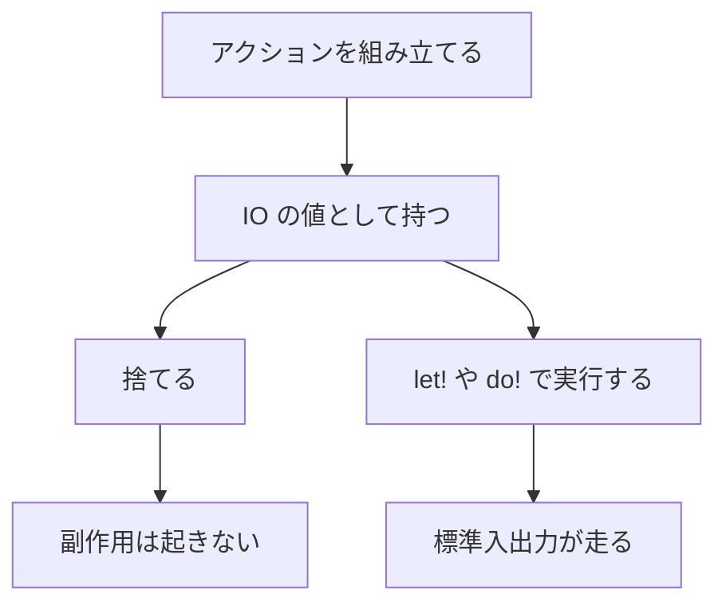

# IO

`IO<T>` は、標準入出力などの副作用を「あとで実行する値」に包んだ型です。アクションを組み立てたり捨てたりしただけでは、画面にもファイルにも何も起きません。`main` や `let!` で実行した回数だけ、中の処理が走ります。

計算と副作用を分けると、入出力の位置がコード上で分かります。失敗を値で返す API と、失敗でトラップする API も、ここで対になっています。

## この記事のポイント

- `IO<T>` は遅延アクションです。作っただけでは副作用は起きません。
- `main` の本体では `let!` と `do!` がその場で実行されます。明示的な `IO { ... }` も使えます。
- `IO.write_line` の別名が `IO.writeln` です。標準エラーへは `IO.write_error_line` を使います。
- `try_` 付きの関数は `Result<T, IO.Error>` を返します。付いていない関数は失敗するとトラップします。
- トップレベルの結果式は表示され、トップレベルの `IO<T>` は 1 回実行されます。`IO<i32>` の値が終了コードです。

## アクションは実行するまで走らない



次のプログラムは、先に作ったアクションを捨ててから、別のアクションを実行します。`not yet` は出ません。

```tsuzuri run=now
def main :: unit -> i32 = \() ->
    let _ignored = IO.write_line "not yet"
    do! IO.write_line "now"
    0
```

実行結果:

```text
now
```

同じ値を 2 回実行すると、副作用も 2 回起きます。状態はアクションの外には残りません。

```tsuzuri run=tick%0Atick
def main :: unit -> i32 = \() ->
    let action = IO.write_line "tick"
    do! action
    do! action
    0
```

実行結果:

```text
tick
tick
```

内部は `unit -> T` のクロージャです。ただし表現は不透明で、`action.work` のようなフィールド参照は `E1022` になります。ユーザー向けの `IO.run` もありません。実行のエントリーポイントは、後述する `let!`、`do!`、`main`、およびトップレベルの `IO` 式です。

## main とコンピュテーション式

`def main :: unit -> i32` の戻り値にはビルダーが付いていません。この本体に書いた `let!` と `do!` は、その場で順に実行されます。戻り値の `i32` がプロセスの終了コードです。

```tsuzuri run=hello
def main :: unit -> i32 = \() ->
    do! IO.writeln "hello"
    0
```

実行結果:

```text
hello
```

`IO.writeln` は `IO.write_line` と同じアクションです。`IO.write` は改行を付けません。

```tsuzuri run=12%0A34
def main :: unit -> i32 = \() ->
    do! IO.write_line "12"
    do! IO.write "34"
    0
```

実行結果:

```text
12
34
```

`IO { ... }` と書くと、実行を遅らせたままアクションを合成できます。`return` の値がそのアクションの結果です。`let!` で取り出してから使います。

```tsuzuri run=1%0A2%0Ahello%20Tsuzuri%0A7%0A42
def greet :: string -> IO<i64>
fn greet name = IO {
    do! IO.write_line $"hello {name}"
    return name.length
}

def main :: unit -> i32 = \() ->
    do! IO {
        for n in [1, 2] do
            do! IO.write_line n
    }
    let! length = greet "Tsuzuri"
    do! IO.writeln length
    let! both = IO {
        let! left = IO.pure 20
        and! right = IO.pure 22
        return left + right
    }
    do! IO.write_line both
    0
```

実行結果:

```text
1
2
hello Tsuzuri
7
42
```

`for` は `IO.For` に展開されます。要素型には `Copy` と `Capture` が要るので、`[string]` を `IO { }` の `for` に渡すことはできません。整数のようにコピーできる値なら、上の例のように書けます。`and!` は左から右へ順に実行します。並列にはなりません。

`IO.pure` は副作用のない値を `IO` に包みます。`IO.map` と `IO.bind` は、実行時に変換や次のアクションをつなぎます。普段は `let!` と `return` に任せてかまいません。

> [!NOTE]
> 補間 `$"..."` は値を借用して表示します。`name` を表示したあとも `name.length` を使えます。` "hello " + name` のように連結すると `string` の所有権が移るので、その後の `name` は使えません。

`Maybe` や `Result` を `let!` すると、`IO` の `Using` を通じて合成されます。`None` や `Error` なら残りの処理は走らず、外側の型は `IO<Maybe<...>>` や `IO<Result<...>>` のままです。勝手に `None` と `Error` を入れ替えたり、1 つの型へ平らにしたりはしません。

標準入力を読む例は、入力がない環境では結果が変わるので、実行はしません。型検査だけです。

```tsuzuri
let! line = IO.read_line ()
let! text = line
do! IO.write_line text
```

このトップレベルの型は `IO<Maybe<unit>>` です。まず 1 行読み、`Some` のときだけ書き出します。終端の `None` なら残りの書き込みはスキップされ、エラーではなく `None` が残ります。明示的な `IO { ... }` の中では、右辺は `IO` のアクションである必要があります。上のようにビルダー名を省略した本体で、`Maybe` の値を `let!` します。

## 標準出力、標準エラー、標準入力

| 関数 | 行き先 | 改行 |
| --- | --- | --- |
| `IO.write` / `IO.try_write` | 標準出力 | 付けない |
| `IO.write_line` / `IO.writeln` / `IO.try_write_line` | 標準出力 | 末尾に LF |
| `IO.write_error` / `IO.try_write_error` | 標準エラー | 付けない |
| `IO.write_error_line` / `IO.try_write_error_line` | 標準エラー | 末尾に LF |
| `IO.read_line` / `IO.try_read_line` | 標準入力 | LF と CRLF を除く |

出力は UTF-8 です。表示そのものもアクションの実行時まで遅延します。数値、`bool`、文字列など、`Display` を持つ値を渡せます。途中の NUL も切り捨てません。

ネイティブでは C の標準入出力を使い、書き込みのたびにフラッシュします。書き込みの途中で失敗しても、すでに出たバイトは戻りません。

`IO.read_line ()` の結果は `Maybe<string>` です。

- 入力の終端では `None` です。
- 空行は `Some ""` です。
- 改行のない最後の行も `Some` です。
- LF と CRLF は除きます。単独の CR は残します。
- 不正な UTF-8 は `InvalidEncoding` です。置換文字にはしません。

`try_` が付かない `read_line` と `write_line` は、`Result.get` で中身を取り出します。失敗するとトラップし、呼び出し元ではキャッチできません。回復するなら `try_` を使います。

```tsuzuri run=encoding
def main :: unit -> i32 = \() ->
    let! failed = IO.try_write "\uD800"
    do! IO.write_line (match failed with
        | Result.Error IO.InvalidEncoding -> "encoding"
        | Result.Error IO.WriteFailed -> "write-failed"
        | Result.Error IO.ReadFailed -> "read-failed"
        | Result.Ok _ -> "wrote")
    0
```

実行結果:

```text
encoding
```

孤立サロゲートは書き込む前に `InvalidEncoding` になります。成功した `try_write_line` は、その時点で本当に出力します。

```tsuzuri run=ok%0Aaccepted
def main :: unit -> i32 = \() ->
    let! accepted = IO.try_write_line "ok"
    do! IO.write_line (match accepted with
        | Result.Ok _ -> "accepted"
        | Result.Error _ -> "failed")
    0
```

実行結果:

```text
ok
accepted
```

標準エラーへの出力は、下の照合には出てきません。`tsuzuri run` は通常、標準エラーをそのまま転送します。`--json` のときだけ、終了までためて診断に含めます。

```tsuzuri run=stdout
def main :: unit -> i32 = \() ->
    do! IO.write_error_line "note"
    do! IO.write_line "stdout"
    0
```

実行結果:

```text
stdout
```

## 終了コードとトップレベルの表示

`Main.tz` の入口は 2 種類です。併用は `E2004` です。

- `def main :: unit -> i32` または `def main :: Array<string> -> i32`。返した `i32` が終了コードです。値の自動表示はありません。
- `main` がなく、トップレベルに式を書く形式。最後の式が表示されます。

`Array<string>` は `[string]` と同じです。`tsuzuri run` は追加の引数を渡さないので、この形の `main` が受け取る配列は空です。ビルドした実行ファイルでは、プログラム名を除いた引数が入ります。詳しくは [Env](./env.md) を見てください。

トップレベルの最後の式は、次のように扱われます。

- 数値、`bool`、`string`、`utf8string`、`char`、`utf8char` は表示されます。`string` の孤立サロゲートはトラップします。
- `unit` は表示処理に入りますが、出力は空です。
- それ以外は `Display` があればその文字列、なければ静かに捨てます。
- 最後の式が `IO<T>` なら、アクションを 1 回実行し、結果の値は表示しません。
- 最後の式が `IO<i32>` なら、その `i32` が終了コードです。`IO.pure 3` のように整数が `i32` へ推論される場合も同じです。

`tsuzuri run` は、子プロセスの終了コードが 0 でないと `E2005`（`program exited with code N`）を報告し、コマンド自身は 1 で終わります。POSIX で親から見える終了ステータスは下位 8 ビットです。`256` は `0` に見えます。

途中でプロセスを切る `Os.exit` のような関数はありません。残ったデストラクタを飛ばして終えたくないためです。失敗を終了コードにしたいときは、`main` で `Result` を見て `0` か `1` を返します。

## 公開 API

`IO.Error` は標準入出力専用です。ファイルや環境変数の失敗は [Os](./os.md) の `Os.Error` で、こちらとは別の型です。

| ケース | 意味 |
| --- | --- |
| `IO.ReadFailed` | 標準入力の読み取りに失敗した |
| `IO.WriteFailed` | 標準出力または標準エラーへの書き込みに失敗した |
| `IO.InvalidEncoding` | 入出力の UTF-8 が不正、または出力側に孤立サロゲートがある |

| 関数 | シグネチャ | 説明 |
| --- | --- | --- |
| `IO.pure` | `Capture<'a> => 'a -> IO<'a>` | 値を副作用のないアクションにする |
| `IO.bind` | `IO<'a> -> ('a -> IO<'b>) -> IO<'b>` | 実行結果を次のアクションへ渡す |
| `IO.map` | `('a -> 'b) -> IO<'a> -> IO<'b>` | 実行結果を関数で変換する |
| `IO.read_line` | `unit -> IO<Maybe<string>>` | 1 行読む。失敗するとトラップする |
| `IO.try_read_line` | `unit -> IO<Result<Maybe<string>, IO.Error>>` | 1 行読む。失敗は `Error` |
| `IO.write` | `(Display<'a>, Capture<'a>) => 'a -> IO<unit>` | 標準出力へ書く。失敗するとトラップする |
| `IO.write_line` | `(Display<'a>, Capture<'a>) => 'a -> IO<unit>` | 標準出力へ書き、LF を付ける |
| `IO.writeln` | `(Display<'a>, Capture<'a>) => 'a -> IO<unit>` | `write_line` の別名 |
| `IO.write_error` | `(Display<'a>, Capture<'a>) => 'a -> IO<unit>` | 標準エラーへ書く |
| `IO.write_error_line` | `(Display<'a>, Capture<'a>) => 'a -> IO<unit>` | 標準エラーへ書き、LF を付ける |
| `IO.try_write` | `(Display<'a>, Capture<'a>) => 'a -> IO<Result<unit, IO.Error>>` | 標準出力へ書く。失敗は `Error` |
| `IO.try_write_line` | `(Display<'a>, Capture<'a>) => 'a -> IO<Result<unit, IO.Error>>` | 改行付き。失敗は `Error` |
| `IO.try_write_error` | `(Display<'a>, Capture<'a>) => 'a -> IO<Result<unit, IO.Error>>` | 標準エラーへ書く。失敗は `Error` |
| `IO.try_write_error_line` | `(Display<'a>, Capture<'a>) => 'a -> IO<Result<unit, IO.Error>>` | 標準エラーへ改行付きで書く |

コンピュテーション式が使う操作も公開されています。通常のコードから直接呼ぶ必要はほとんどありません。

| 操作 | 役割 |
| --- | --- |
| `Return` / `ReturnFrom` | `return` と `return!` |
| `Bind` / `BindReturn` | `let!` と、結果を関数へ渡す形 |
| `Zero` / `Delay` / `Combine` | 空の結果、遅延、`do!` の連結 |
| `For` / `While` | `for` と `while`。`For` の要素は `Copy` |
| `MergeSources` | `and!`。左から右へ実行する |
| `Using` | `Maybe` や `Result` など、別の計算との合成 |

呼び出しは `IO.read_line ()` のように、`unit` 引数を `()` で渡します。

## 所有権

`IO<T>` の値は何度でも実行できます。実行のたびにクロージャが走ります。中で捕捉した値は、通常の `Capture` と借用の規則に従います。排他借用や、1 回しか実行できない `Task` を、アクションの中へ不正に持ち出すことはできません。

`string` は `Copy` ではありません。出力関数へ渡すと所有権が移ります。同じ文字列を後でも使うなら、先に別の値へ分けるか、補間のように借用する書き方にしてください。`[ubyte]` のような配列は `Copy` なので、渡したあとも元の変数は残ります。大きな配列はコピーのコストに注意してください。

OS の API はメインスレッドの入口から実行します。並行 `Task` の中から直接は呼べません。`IO` を `Task` へ自動変換する関数もありません。

## WASM

既定の wasm32 出力は、到達した標準入出力だけを `tsuzuri_io.read_line` と `tsuzuri_io.write` として import します。未提供の import を無視はしません。`IO` を使わないプログラムの import は増えません。WASI は、`--wasm-host wasi` を付けたときだけ使います。

`read_line` のホスト関数は、改行を除いた所有 UTF-8 バイトの descriptor を書き、`0` が行、`1` が終端、`2` が失敗です。`write` は fd 1 または fd 2 と借用バイトを受け、全量の書き込みとフラッシュに成功すると `0` を返します。ホストはバッファを変更したり解放したりせず、行末の LF を二重に足しません。

メモリ不足や ABI 違反は `Result` にはなりません。トラップするか、プロセスが止まります。

## 他の言語との比較

| | Tsuzuri | 近い書き方 |
| --- | --- | --- |
| 副作用 | `IO<T>` という遅延値。実行回数だけ起きる | F# のコンピュテーション式。Rust なら自分でクロージャに包む |
| 失敗 | 標準入出力は `IO.Error`。OS は `Os.Error` | Rust の `Result`。例外ではない |
| 入口 | `main` の `i32` が終了コード | Rust の終了コード。F# の `exit` には相当する関数がない |

## まとめ

- `IO<T>` は遅延アクションです。捨てれば副作用は起きず、実行した回数だけ起きます。
- `main` では `do!` と `let!` が直接実行されます。遅延したまま合成するなら `IO { ... }` です。
- 画面へ出すなら `IO.write_line`（別名 `IO.writeln`）、失敗を値で受けるなら `try_` です。
- 標準入力の終端は `None`、空行は `Some ""` です。不正な UTF-8 は置換しません。
- トップレベルの `IO<i32>` と `main` の戻り値が終了コードです。強制終了の関数はありません。

## 関連項目

- [File](./file.md)
- [Os](./os.md)
- [Result](./result.md)
- [Maybe](./maybe.md)
- [Env](./env.md)
- [コンピュテーション式](../computation-expressions/computation-expressions.md)
- [例外処理](../exception-handling/exception-handling.md)
- [WebAssembly への出力](../compiler/webassembly.md)
- [言語仕様の IO](../../../docs/language.md#io-と標準入出力)
- [言語リファレンスの目次](../index.md)

