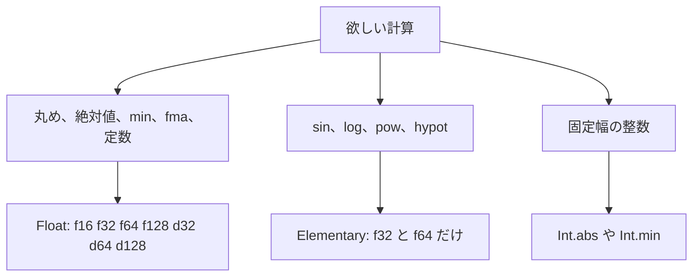

# Math

`Math` は、引数と戻り値の浮動小数点型を保ったまま計算を行う組み込み数学モジュールです。引数の型が暗黙のうちに `f64` へ格上げされることはなく、整数から浮動小数点への暗黙変換も行われません。

基本的な丸め関数や積和演算 `fma` は、二進・十進のすべての浮動小数点型に対応しています。一方、`sin` や `log` などの超越関数は `f32` と `f64` のみに対応します。コンパイラが精度を犠牲にする近似や暗黙の式再結合を勝手に適用することはありません。

## この記事のポイント

- `Math.sqrt` と無修飾の `sqrt` は別関数です。無修飾の関数群は `f64` 固定の互換 API です。
- `Math.fma` は積と和を 1 回だけ丸めます。`a * b + c` は 2 回丸めます。
- 超越関数の非 NaN の結果は 1 ulp 以内で、ネイティブと WASM、`-O0` と `-O3` でビットが一致する契約です。正確な丸めとは違います。
- `Math.zero()` は互換用の `f64` のゼロです。型を選ぶゼロではありません。

## 面積を 1 回の積和で出す

```tsuzuri run=42
let area: f32 = Math.fma 2f32 3f32 36f32
let circle: f64 = Math.pi()
assert (Math.round 2.5 == 3.0)
assert (Math.round_even 2.5 == 2.0)
assert (circle > 3.14 && circle < 3.15)
assert (Math.zero() == 0.0)
assert (sqrt 9.0 == Math.sqrt 9.0)
area as i64
```

実行結果:

```text
42
```

`Math.pi` と `Math.e` は定数そのものではなく、引数のない関数です。`Math.pi()` と呼びます。期待される型へ、10 進の定数から 1 回だけ丸めます。型が決まらないとコンパイルできません。上の `circle` は注釈で `f64` にしています。

この `2 * 3 + 36` は、積和を分けて丸めても結果は同じ 42 です。桁が近い大きな数と小さな数では、`Math.fma` と `a * b + c` のビットが分かれることがあります。積と和を個別に丸めたいときは通常の演算子、1 回の丸めで高精度に計算したいときは `Math.fma` を明示的に使い分けます。

## どの型で何が使えるか



`Float` の関数は、渡した型のまま結果を返します。十進の `d32`、`d64`、`d128` を二進に変換して計算することはありません。

| 関数 | シグネチャ | 説明 |
| --- | --- | --- |
| `sqrt`、`floor`、`ceil`、`trunc`、`round`、`round_even`、`abs` | `Float<'a> => 'a -> 'a` | 1 引数。後述の丸め規則 |
| `min`、`max`、`copysign` | `Float<'a> => 'a -> 'a -> 'a` | 2 引数 |
| `clamp` | `Float<'a> => 'a -> 'a -> 'a -> 'a` | 値、下限、上限 |
| `fma` | `Float<'a> => 'a -> 'a -> 'a -> 'a` | `x * y + z` を 1 回で丸める |
| `is_nan`、`is_infinite`、`is_finite` | `Float<'a> => 'a -> bool` | 分類 |
| `pi`、`e` | `Float<'a> => 'a` | 呼び出しは `Math.pi()` |

丸めの方向は次のとおりです。結果がゼロになるときは、元の符号を保ちます。

| 関数 | 方向 |
| --- | --- |
| `floor` | 負の無限大へ |
| `ceil` | 正の無限大へ |
| `trunc` | ゼロへ |
| `round` | 最も近い整数。ちょうど半分はゼロから遠い方 |
| `round_even` | 最も近い整数。ちょうど半分は偶数 |
| `sqrt` | 最近接偶数。負の有限値と負の無限大は NaN。`sqrt(-0)` は `-0` |

`abs` は符号ビットを消します。`copysign magnitude sign` は、第 1 引数の絶対値に第 2 引数の符号を付けます。`min` と `max` は NaN を伝播し、符号の違うゼロでは `min` が `-0`、`max` が `+0` です。`clamp x low high` は `low <= high` でなければ NaN、そうでなければ `min (max x low) high` です。

これらの関数はヒープを確保しません。部分適用した関数値が環境を確保する場合は、その一般のコストだけが別です。

## 超越関数

`Elementary` は `f32` と `f64` だけです。`f16`、`f128`、十進に `Math.sin` を書くと `E1005` になります。`f64` で計算してキャストし返す、というフォールバックはありません。

| 関数 | シグネチャ | 説明 |
| --- | --- | --- |
| `sin`、`cos`、`tan`、`asin`、`acos`、`atan` | `Elementary<'a> => 'a -> 'a` | 三角関数と逆関数 |
| `exp`、`exp2`、`log`、`log2`、`log10`、`cbrt` | `Elementary<'a> => 'a -> 'a` | 指数、対数、立方根 |
| `atan2` | `Elementary<'a> => 'a -> 'a -> 'a` | `atan2 y x`。縦、横の順 |
| `pow`、`hypot` | `Elementary<'a> => 'a -> 'a -> 'a` | 累乗と、斜辺の長さ |

精度の契約は、最終結果が 1 ulp 以内です。これは「正しく丸めた 1 つの値」とは違います。その範囲の中で、非 NaN のビット列はネイティブと WASM、`-O0` と `-O3` で一致します。ホストの C ライブラリ `libm` やロケールには依存しません。同梱の数学実装を使います。`tests/math.mjs` が、このビット照合を持っています。

NaN のペイロード、浮動小数点の例外フラグ、実行時の丸めモード変更は公開していません。SIMD のレーンに対する `Math.sin` もありません。

境界値および特殊値の代表的な振る舞いは次のとおりです。

- 無限大の三角関数、範囲外の `asin` / `acos`、負数の対数は NaN です。対数の `±0` は負の無限大です。
- `sin`、`tan`、`asin`、`atan`、`cbrt` は、ゼロの符号を保ちます。
- `atan2` は象限と符号付きゼロを保ちます。`atan2(±0, 負数)` は `±π`、`atan2(±0, 正数)` は `±0` です。
- `pow(x, ±0)`、`pow(1, NaN)`、`pow(-1, ±∞)` は `1` です。負の底と非整数の指数は NaN です。
- `hypot` は途中の桁溢れを避けるようスケールします。どちらかが無限大なら、NaN より優先して正の無限大です。

```tsuzuri run=5
assert (Math.hypot 3.0 4.0 == 5.0)
assert (Math.sin 0.0 == 0.0)
assert (Math.is_nan (Math.sqrt (-1.0)))
assert (Math.is_infinite (1.0 / 0.0))
Math.hypot 3.0 4.0 as i64
```

実行結果:

```text
5
```

`f32` / `f64` の演算子 `**` は、この `Math.pow` と同じ経路です。整数の `**` とは別です。整数の絶対値は [`Int.abs`](int.md) を使ってください。無修飾の `abs` は `f64` 専用です。

## 無修飾の sqrt と Math.zero

後方互換の無修飾関数は、オーバーロードではありません。

| 名前 | 型 | `Math` との関係 |
| --- | --- | --- |
| `sqrt`、`floor`、`ceil`、`abs` | `f64 -> f64` | `f64` の `Math.sqrt` などと同じ LLVM 命令へコンパイル |
| `to_float` | `i64 -> f64` | 大きい整数は丸められ得る。`Math` にはない |
| `to_int` | `f64 -> i64` | ゼロ方向へ切り捨て。範囲外は飽和。NaN は 0 |

`Math.zero` は `std/Math.tz` にある互換用の関数で、型は `f64` です。`Math.zero()` と呼び、結果は `0.0` です。`f32` のゼロが欲しいときは `0f32` と書いてください。実用の API というより、標準ライブラリが関数を公開できることを保つための名前です。

## 明示 FMA と順序付き集計

`Math.fma x y z` は、引数を左から評価し、`x * y + z` をその浮動小数点型へ最近接偶数で 1 回だけ丸めます。NaN は伝播します。`0 * ∞` や、無限大の積に異符号の無限大を足すと NaN です。正確に打ち消してゼロになるときは `+0`、同じ符号のゼロ同士はその符号です。非正規化数も保ちます。非 NaN のビットは、ネイティブと WASM、`-O0` と `-O3` で一致する契約です。

配列の和を、コア数や SIMD 幅で組み替えない API は `Array` にあります。`Math` の関数ではありませんが、`fma` と同じ「順序を名前で固定する」考え方です。

| 関数 | シグネチャ | 順序 |
| --- | --- | --- |
| `Array.sum` | 数値型の `ref ['a] -> 'a` | `+0` から添字の昇順。整数にも使える |
| `Array.sum_pairwise` | `Float<'a> => ref ['a] -> 'a` | 隣り合う組を足し、奇数の末尾はそのまま次の段へ |
| `Array.sum_kahan` | `Float<'a> => ref ['a] -> 'a` | 添字の昇順で、補償項を持つ加算 |
| `Array.dot` | `Float<'a> => ref ['a] -> ref ['a] -> 'a` | `+0` から、積と和を別々に丸める |
| `Array.dot_fma` | `Float<'a> => ref ['a] -> ref ['a] -> 'a` | 同じ走査で、各要素の積和を `Math.fma` にする |

空の配列に対する結果は `+0.0` です。`sum_pairwise` の要素が 1 個なら、その値をそのまま返すので `-0.0` も残ります。内積は、要素を読む前に長さが同じかを見て、違えばトラップします。

`[a, b, c, d, e]` の対ごとの和は `((a + b) + (c + d)) + e` です。現在の実装は配列を 1 回複製する $O(N)$ 作業メモリを用いた逐次処理であり、CPU コア数や SIMD ベクトル幅によって加算木の形状が変わることはありません。

```tsuzuri run=1
let samples = [1e16, 1.0, -1e16]
assert (Array.sum ref samples == 0.0)
assert (Array.sum_pairwise ref [1.0, 2.0, 3.0, 4.0, 5.0] == 15.0)
Array.sum_kahan ref samples as i64
```

実行結果:

```text
1
```

`1e16 + 1` は `f64` では `1e16` のままなので、普通の総和は `0` に戻ります。補償加算は `1` を残します。どんな入力でも数学的な正確な和になる、という意味ではありません。無限大や NaN を取り除きもしません。補償式が NaN なら結果も NaN です。

コンパイラが `fast-math`、式の再結合、暗黙の FMA、自動の並列化を有効にすることはありません。

## 注意点

- 整数の `abs` と `min` は `Math` にはありません。[`Int`](int.md) です。
- `Math.pi` を括弧なしで書くと、関数値です。数値にはなりません。
- 表示した `0.1` は最短の往復表記です。内部のビットを 10 進で全部見たいときは、書式指定を使います。表示の規則は [言語仕様の表示と解析](../../../docs/language.md#表示と解析) にあります。
- 速度の主張はしません。超越関数はソフトウェア実装で、ハードウェアの 1 命令とは限りません。

## まとめ

- `Float` の API は型を保ちます。超越関数は `f32` と `f64` だけです。
- 無修飾の `sqrt` や `abs` は `f64` 固定の別名です。
- 積和を 1 回で丸めるのは `Math.fma` と `Array.dot_fma` だけです。
- 非 NaN の超越関数と `fma` は、ターゲットと最適化レベルでビットが変わる契約ではありません。
- `Math.zero()` は `f64` の互換用ゼロです。

## 関連項目

- [Int](int.md)
- [Array](array.md)
- [Simd](simd.md)
- [基本型](../types-and-type-inference/basic-types.md)
- [言語仕様の数学 API](../../../docs/language.md#数学-api)
- [言語仕様の明示 FMA と順序付き集計](../../../docs/language.md#明示-fma-と順序付き集計)
- [言語仕様の組み込み関数](../../../docs/language.md#組み込み関数)
- [言語リファレンスの目次](../index.md)
