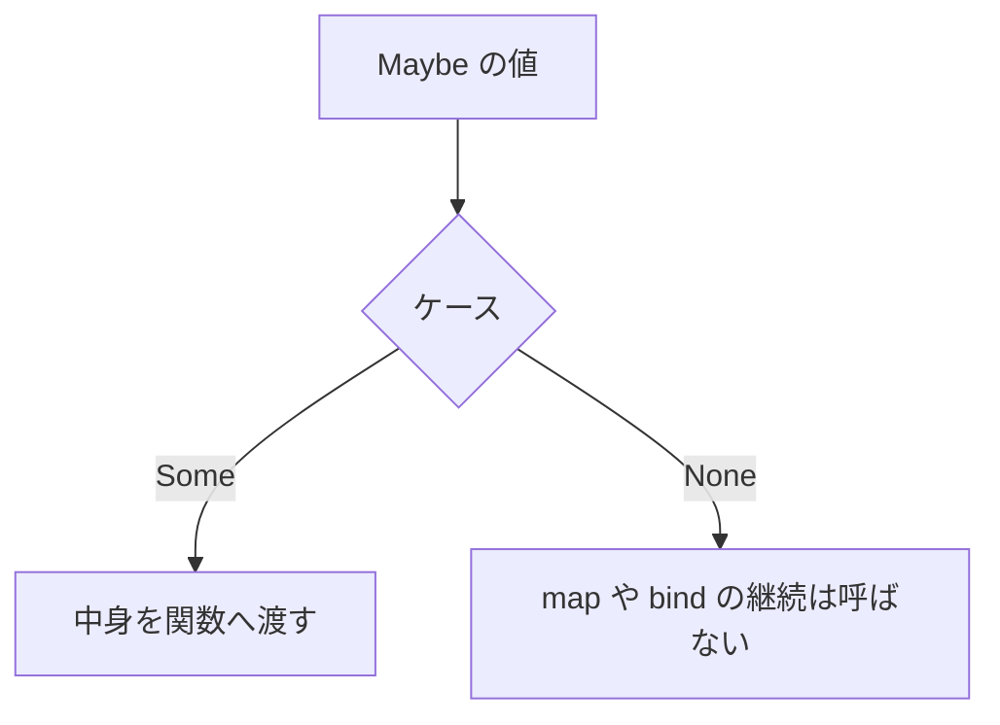

# Maybe

`Maybe<'a>` は、値があるときとないときを型で区別します。欠測、検索の不一致、入力の終わりのように、失敗の理由までは要らないときに使います。理由を残すなら [Result](result.md) です。

Tsuzuri 0.1.0 の `Maybe` は、以前の `Option` を置き換えたものです。`Option<i64>` や `Option.map` はなく、書くと `E1004` になります。ケース名の `Some` と `None` はそのままです。

標準ライブラリの通常の共用体なので、特別なインポートは要りません。`Some 1` とも `Maybe.Some 1` とも書けます。自モジュールに同名のケースがあると、無修飾名はそちらが優先されます。標準の方は `std::Maybe.Some` です。

## この記事のポイント

- 型は `Maybe<'a>`、ケースは `None` と `Some of 'a` です。
- `map` は関数が先、`bind` は値が先です。ないときは継続を呼びません。
- `Maybe { let! ... return ... }` は、`None` で残りの処理を短絡します。
- `get` は `Some` 以外でトラップします。信頼できない値には `match` か `default_value` を使います。
- 借用したまま変換する `map_ref` と `bind_ref` があります。

## 基本の書き方

```text
Maybe<'a> = None | Some of 'a
Some 42
None
```

```tsuzuri run=42
let parsed = Some 42
match parsed with
| Some value -> value
| None -> 0
```

実行結果:

```text
42
```

`None` だけでは型が決まらないことがあり、未推論のまま残ると `E1015` になります。`let missing: Maybe<i64> = None` のように注釈を付けるか、後続の使用で型が決まる位置に置きます。`Maybe.default_value 42 None` は、既定値の `42` から `Maybe<i64>` と推論されます。



## パターンマッチ

`match` は `Some` と `None` の両方を要求します。片方だけだと `E1021` です。所有する非 Copy の中身をパターンで受け取ると、元の `Maybe` はムーブされます。

```tsuzuri run=42
let found = Some "answer"
let missing: Maybe<string> = None
(match found with
| Some text -> text.length
| None -> 0) + (match missing with
| Some text -> text.length
| None -> 36)
```

実行結果:

```text
42
```

`match!` はコンピュテーション式の中で使います。先に `Bind` で中身を取り出し、パターンはその中身に対してです。`Some` や `None` をもう一度書く場所ではありません。

```tsuzuri run=42
let result = Maybe {
    match! Some 20 with
    | 20 -> return 42
    | other -> return other
}
Maybe.get result
```

実行結果:

```text
42
```

## コンピュテーション式

`Maybe { ... }` は、`std/Maybe.tc` のビルダーです。`let!` は `Some` の中身を束縛し、`None` なら残りの `let!` や `return` を呼びません。`return` は関数からの脱出ではなく、`Some` を作る構文です。

```tsuzuri run=42
let parsed = Maybe {
    let! left = Some 20
    let! right = Some 22
    return left + right
}
match parsed with
| Some value -> value
| None -> 0
```

実行結果:

```text
42
```

`and!` は、直前の `let!` と同じグループで複数の `Maybe` をまとめます。並列実行ではありません。右辺は左から右へすべて評価され、そのあとで結合されます。どちらかが `None` なら結果は `None` です。

```tsuzuri run=42
let result = Maybe {
    let! left = Some 20
    and! right = Some 22
    return left + right
}
Maybe.get result
```

実行結果:

```text
42
```

`for` は Copy な要素の配列 `[T]` だけを受けます。本体が `None` になると、残りの要素と後続の `return` は実行されません。

```tsuzuri run=7
let result = Maybe {
    for n in [1, -1, 3] do
        do! if n < 0 then None else Some ()
    return 42
}
match result with
| None -> 7
| Some _ -> 0
```

実行結果:

```text
7
```

> [!NOTE]
> `do!` の中身は `unit` です。`for` や `while` の本体はクロージャになるので、外側の `let mut` への代入は `E1014` になります。可変な集計は、コンピュテーション式の外の `while` で行うか、値を引数で渡します。

短絡は、失敗した位置より前の式を取り消すものではありません。先に書いた通常の `let` や、評価済みの引数は実行されます。`None` をトラップに変換することもありません。

## 調査と取り出し

所有権を消費する関数と、共有借用だけを見る関数が分かれています。`get` は便利ですが、欠測を回復する手段ではありません。`None` では `unreachable ()` によりトラップし、`try` では捕捉できません。

| 関数 | シグネチャ | 動き |
| --- | --- | --- |
| `Maybe.is_some` | `&(Maybe<'a>) -> bool` | 共有借用して `Some` かを返す |
| `Maybe.is_none` | `&(Maybe<'a>) -> bool` | `Some` でなければ `true` |
| `Maybe.get` | `Maybe<'a> -> 'a` | 所有値を消費して中身を取る。`None` ならトラップ |
| `Maybe.default_value` | `'a -> Maybe<'a> -> 'a` | あれば中身、なければ評価済みの既定値 |
| `Maybe.default_with` | `(unit -> 'a) -> Maybe<'a> -> 'a` | ないときだけ `fallback ()` を呼ぶ |

```tsuzuri run=42
let missing: Maybe<i64> = None
assert (Maybe.is_none (ref missing))
assert (Maybe.is_some (ref (Some 1)))
Maybe.default_value 42 missing
```

実行結果:

```text
42
```

`default_value` の第 1 引数は、`Some` でも先に評価されます。重い処理やトラップしうる式は `default_with` にします。

## 変換と連結

引数の順序に注意してください。`map`、`map_ref`、`filter` は関数が先、`bind`、`bind_ref`、`or_else` は値が先です。値が不在（`None`）のときは成功用の関数を呼び出しません。

| 関数 | シグネチャ | 動き |
| --- | --- | --- |
| `Maybe.map` | `('a -> 'b) -> Maybe<'a> -> Maybe<'b>` | 中身を消費して変換する |
| `Maybe.map_ref` | `(&'a -> 'b) -> &(Maybe<'a>) -> Maybe<'b>` | 中身を借用して、新しい所有値を作る |
| `Maybe.bind` | `Maybe<'a> -> ('a -> Maybe<'b>) -> Maybe<'b>` | 中身を次の `Maybe` へ渡す |
| `Maybe.bind_ref` | `&(Maybe<'a>) -> (&'a -> Maybe<'b>) -> Maybe<'b>` | 借用した中身から次の `Maybe` を作る |
| `Maybe.filter` | `(&'a -> bool) -> Maybe<'a> -> Maybe<'a>` | 述語が偽なら `None`。真なら元の `Some` |
| `Maybe.or_else` | `Maybe<'a> -> (unit -> Maybe<'a>) -> Maybe<'a>` | ないときだけ代替を呼ぶ |

```tsuzuri run=5
let value = Some "hello"
let measured = Maybe.map_ref (\text -> text.length) (ref value)
assert (Maybe.is_some (ref value))
Maybe.get measured
```

実行結果:

```text
5
```

`map_ref` は元の `Maybe` を消費しません。非 Copy の中身でも、借用したまま長さなどを取り出せます。述語も中身の共有借用を受け取ります。

```tsuzuri run=42
let kept = Maybe.filter (\n -> deref n > 10) (Some 42)
let dropped = Maybe.filter (\n -> deref n > 10) (Some 3)
assert (Maybe.is_none (ref dropped))
Maybe.get kept
```

実行結果:

```text
42
```

`&` と `ref` は同じ型です。表の `&(Maybe<'a>)` は `ref (Maybe<'a>)` とも書けます。

## Result との変換

暗黙の変換や `?` 演算子はありません。変換は関数で明示します。エラー値の引数は、成功していても評価されます。

| 関数 | シグネチャ | 動き |
| --- | --- | --- |
| `Maybe.to_result` | `'e -> Maybe<'a> -> Result<'a, 'e>` | `Some` を `Ok`、`None` を指定した `Error` へ |
| `Maybe.of_result` | `Result<'a, 'e> -> Maybe<'a>` | `Ok` を `Some`、`Error` は捨てて `None` へ |

```tsuzuri run=7
let missing: Maybe<i64> = None
match Maybe.to_result "missing" missing with
| Result.Ok _ -> 0
| Result.Error message -> message.length
```

実行結果:

```text
7
```

逆方向の `Result.of_maybe` と `Result.to_maybe` は [Result](result.md) にあります。`of_result` はエラー情報を捨てるので、理由が後で必要なら使いません。

## ビルダー操作

次の関数も公開されています。コンピュテーション式が展開先として使うもので、通常の関数としても呼べます。`Zero` は引数のない関数で、呼び出すときは `Maybe.Zero()` と括弧を名前に続けます。空白を挟むと `()` が unit 引数になり、`E1006` です。

| 関数 | シグネチャ | 展開での役割 |
| --- | --- | --- |
| `Maybe.Return` | `'a -> Maybe<'a>` | `return` |
| `Maybe.ReturnFrom` | `Maybe<'a> -> Maybe<'a>` | `return!` |
| `Maybe.Bind` | `Maybe<'a> -> ('a -> Maybe<'b>) -> Maybe<'b>` | `let!` と `do!` |
| `Maybe.BindReturn` | `Maybe<'a> -> ('a -> 'b) -> Maybe<'b>` | `let!` の直後が `return` だけのとき |
| `Maybe.Bind2` | `Maybe<'a> -> Maybe<'b> -> ('a -> 'b -> 'c) -> Maybe<'c>` | 2 つの `and!` と末尾の `return` |
| `Maybe.MergeSources` | `Maybe<'a> -> Maybe<'b> -> Maybe<('a * 'b)>` | それ以外の `and!` |
| `Maybe.Zero` | `Maybe<unit>` | 空の本体。値は `Some ()` |
| `Maybe.Delay` | `(unit -> Maybe<'a>) -> (unit -> Maybe<'a>)` | 後続を遅延する |
| `Maybe.Run` | `(unit -> Maybe<'a>) -> Maybe<'a>` | 遅延した本体を実行する |
| `Maybe.Combine` | `Maybe<unit> -> (unit -> Maybe<'a>) -> Maybe<'a>` | 文の連結。`None` なら後続を呼ばない |
| `Maybe.For` | `Copy<'a> => ['a] -> ('a -> Maybe<unit>) -> Maybe<unit>` | `for` |
| `Maybe.While` | `(unit -> bool) -> (unit -> Maybe<unit>) -> Maybe<unit>` | `while` |

`For` の配列要素は Copy です。非 Copy の要素を借用しながら歩く通常の `for ... in` とは契約が違います。展開規則の全体は [コンピュテーション式](../computation-expressions/computation-expressions.md) を参照してください。

## 所有権

所有版の関数は `Maybe` を消費し、中身をムーブします。Copy の中身は通常の複製規則に従います。`map_ref` と `bind_ref` はコンテナも中身も共有借用し、結果は独立した所有値です。成功側に Copy 制約はありません。

`Maybe<ref string>` のように共有借用を中身にできます。返る参照は、入力の所有者の寿命に束縛されます。排他借用を中身にすることはできません。パターンで作った一時的なビューへの参照を、節の外へ返すこともできません。

共用体なので、`export def` の引数や戻り値にはできません。`E1008` です。ホスト境界では、対応するスカラーやバッファへ変換します。

## 注意点

- `get` の失敗は例外ではありません。入力が信頼できないときは `match`、`default_value`、`default_with` を使います。
- `None` の型が決まらないと `E1015` になります。注釈を付けるか、型が分かる引数と一緒に使います。
- `match!` のパターンは、すでに取り出された中身に対するものです。
- `and!` はスレッドを起動しません。右辺は失敗が分かっていても評価されます。
- `For` は要素が Copy な配列（`[T]`）だけを受け付けます。リストや `Vec` は直接渡せません（固定長配列 `[T; N]` ではなく通常の配列型 `[T]` です）。要素が非 Copy な配列を渡すと `E1005` になります。

## まとめ

- `Maybe<'a>` は `Some` か `None` です。旧名の `Option` は使えません。
- ないときは `map` や `bind` の継続を呼ばず、コンピュテーション式もそこで短絡します。
- 借用版の `map_ref` と `bind_ref` は、元の値を残したまま変換できます。
- `Result` との行き来は `to_result` と `of_result` で明示します。
- `get` はトラップします。欠測を回復するコードでは使いません。

## 関連項目

- [Result](result.md)
- [Union](union.md)
- [コンピュテーション式](../computation-expressions/computation-expressions.md)
- [match 式](../pattern-matching/match.md)
- [所有権とムーブ](../ownership-and-memory/ownership.md)
- [借用と参照](../ownership-and-memory/borrowing.md)
- [言語仕様の Maybe と Result](../../../docs/language.md#maybe-と-result)
- [言語リファレンスの目次](../index.md)

