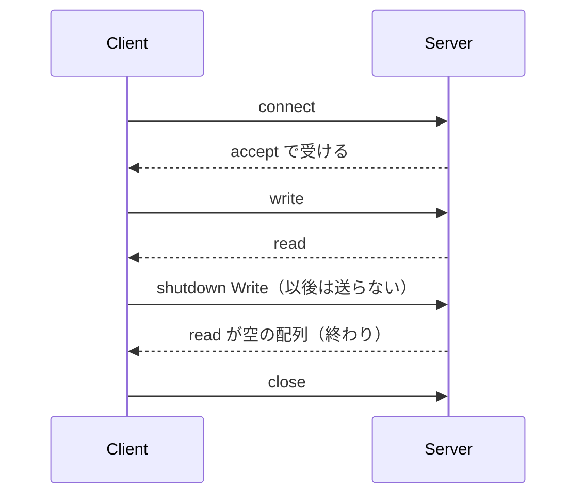

# Net

`Net` は、TCP と UDP のソケット、IP アドレスの解析と表示、名前解決を扱うモジュールです。ソケットの操作はすべて `IO<Result<T, Os.Error>>` で、実行するまでシステムコールは出ません。失敗は例外やトラップではなく、[Os](./os.md) の `Os.Error` です。

通信は暗号化しません。受け取ったデータも送り元のアドレスも、認証されていません。TLS は std に入れず、パッケージとして提供する方針です（[E09](../../../_features/E09-network.md) の D13）。

`Net` は opt-in の標準モジュールです。ソースに `Net` という名前を書いたときだけ読み込まれ、書かないプログラムの型検査と生成コードは変わりません。

## この記事のポイント

- アドレスの解析と表示（`parse_address`・`address_text` など）は純粋な計算です。どの target でも、import なしで動きます。
- ソケット（`connect`・`read`・`write`・`bind`・`accept`・`bind_udp`・`send_to`・`recv_from`）は、macOS・Linux・Windows の native で動きます。
- `Async.block_on` の中では、`_async` を付けた双子（`connect_async`・`read_async` など）を使います。実行器のスレッドは待たず、1 本の監視スレッドがソケットの準備を見て、待っている計算を再開します。
- ハンドル（`TcpStream`・`TcpListener`・`UdpSocket`）は `Copy` の不透明な値です。自動では閉じません。`close` か `with_connection` などを使います。
- 閉じたハンドルを使うと `InvalidInput` です。別のソケットに当たることはありません。
- 時間制限は、呼び出し全体の期限（ミリ秒）です。`None` は無期限です。
- 受信は必ず最大長を取ります。「最後まで読む」関数はありません。

## アドレスを読む

`parse_address` は `"127.0.0.1:8080"` や `"[::1]:80"` を `Address` にし、`address_text` はそれを RFC 5952 の形で書き戻します。IPv6 は小文字で、先頭の 0 を省き、長さ 2 以上の 0 の並びのうち最長のもの（同じ長さなら先頭）を `::` にします。

```tsuzuri run=127.0.0.1%3A8080%0A%5B2001%3Adb8%3A%3A1%5D%3A443%0A%5B%3A%3Affff%3Ac000%3A201%5D%3A53%0Anone%0Anone%0Anone%0Anone
def show :: ref string -> string
fn show text =
    match Net.parse_address text with
    | Maybe.Some address -> Net.address_text address
    | Maybe.None -> "none"

def main :: unit -> i32 = \() ->
    do! IO.write_line (show (ref "127.0.0.1:8080"))
    do! IO.write_line (show (ref "[2001:DB8:0:0:0:0:0:1]:443"))
    do! IO.write_line (show (ref "[::ffff:192.0.2.1]:53"))
    do! IO.write_line (show (ref "127.1:80"))
    do! IO.write_line (show (ref "010.0.0.1:80"))
    do! IO.write_line (show (ref "[fe80::1%en0]:80"))
    do! IO.write_line (show (ref "1.2.3.4"))
    0
```

実行結果:

```text
127.0.0.1:8080
[2001:db8::1]:443
[::ffff:c000:201]:53
none
none
none
none
```

解析は厳密です。`inet_aton` が受ける `127.1`・`0x7f.0.0.1`・`010.0.0.1` も、ゾーン付きの `fe80::1%en0` も、ポートの無い `1.2.3.4` も `None` です。数値の先頭に 0 は付けられません（`0` だけ）。空白も受けません。許可リストの検査と実際の接続先が、同じ解析器で決まるので、`127.1` のような書き方で検査を抜けることはできません。末尾の `::ffff:192.0.2.1` のような IPv4 は入力にだけ書けます。表示は 16 進（`::ffff:c000:201`）です。

アドレスだけの文字列は `parse_ip text port` で、ポートは 0 から 65535 までです。括弧は付けません。

| 関数 | 型 | 説明 |
| --- | --- | --- |
| `parse_address` | `ref string -> Maybe<Address>` | `a.b.c.d:port` か `[ipv6]:port` |
| `parse_ip` | `ref string -> i64 -> Maybe<Address>` | アドレスと port。port が範囲外なら `None` |
| `address_text` | `Address -> string` | `parse_address` の逆 |
| `ip_text` | `Address -> string` | port を除いた `127.0.0.1` や `::1` |
| `port` | `Address -> i64` | 0 から 65535 |
| `is_ipv6` | `Address -> bool` | IPv6 か |

`Address` は `Copy` で、`==` で比べられ、`Hash` を持ち、`to_string` で `address_text` と同じ文字列になります。利用者は `parse_address`・`parse_ip`・`resolve` とソケットの関数からだけ作れるので、ポート 70000 のような値はありません。

## TCP で送って受ける

次の例は、1 つのプロセスの中で、listener と、それに接続するクライアントと、`accept` で得たサーバー側の端を作ります。ポートは 0 で、OS に空きを選ばせます。loopback ではカーネルが接続を完了させるので、`accept` の前に `connect` が成功します。

```tsuzuri run=ping%20-%3E%20pong
def text_of :: [ubyte] -> string
fn text_of bytes =
    match Utf8String.from_bytes bytes with
    | Maybe.Some text -> String.from_utf8 (ref text)
    | Maybe.None -> "?"

/// The client asks and the server answers, over two ends of one connection.
def exchange :: Net.TcpStream -> Net.TcpStream -> IO<string>
fn exchange client server = IO {
    let! sent = Net.write client (Utf8String.to_bytes u8"ping") (Maybe.Some 1000)
    let! request = Net.read server 16 (Maybe.Some 1000)
    let! replied = Net.write server (Utf8String.to_bytes u8"pong") (Maybe.Some 1000)
    let! answer = Net.read client 16 (Maybe.Some 1000)
    return match (sent, request, replied, answer) with
        | (Result.Ok _, Result.Ok asked, Result.Ok _, Result.Ok told) -> text_of asked + " -> " + text_of told
        | _ -> "failed"
}

def main :: unit -> i32 = \() ->
    let loopback = Maybe.get (Net.parse_ip (ref "127.0.0.1") 0)
    let! outcome = Net.with_listener loopback (\listener ->
        Net.with_connection (Net.local_addr listener) (Maybe.Some 1000) (\client ->
            Net.with_accepted listener (Maybe.Some 1000) (\server -> exchange client server)))
    do! IO.write_line (match outcome with
        | Result.Ok (Result.Ok (Result.Ok line)) -> line
        | _ -> "failed")
    0
```

実行結果:

```text
ping -> pong
```

`with_listener`・`with_connection`・`with_accepted` は、本体の `IO` を実行して、結果の成否にかかわらず戻る前にハンドルを閉じます。本体の値は、閉じる処理が失敗しなければそのまま返ります。入れ子にするので、結果は `Result` の入れ子です。

通常の使い方は、別のプログラムや別のホストへつなぐ形です。`Net.connect address timeout` が `TcpStream` を返し、`Net.read stream count timeout` と `Net.write stream bytes timeout` で送受信し、最後に `Net.close stream` を実行します。



- `read stream count timeout` の `count` は 1 から 16,777,216 までです。1 回の受信で届いた分だけを返すので、`count` より短くても普通です。**空の配列は、相手が送信を終えたこと（ストリームの終わり）**です。
- `write` は、全バイトを送り終えるまで繰り返します。途中で失敗しても、送れた量は分かりません。
- `shutdown stream Net.Write` は、閉じずに「もう送らない」と相手に伝えます。`Net.Read` と `Net.Both` もあります。
- `accept` の結果の `TcpStream` には、`peer_addr`（相手）と `stream_local_addr`（自分）が入っています。`bind` に 0 を渡したときの本当の port は `local_addr listener` です。

## 時間制限

`connect`・`read`・`write`・`accept`・`recv_from` の時間制限は `Maybe<i64>` のミリ秒です。`None` は無期限で、`Some n` は 1 から 2,147,483,647 までです。値は**呼び出し全体の期限**で、`read` を待っている間に細かく何度起きても、期限は延びません。範囲外（0 や負の数、2,147,483,648 以上）は、システムコールを出さずに `InvalidInput`（`code` は 0）です。

期限が来て何も無ければ、結果は `Error` で、`Net.error_kind` が `TimedOut` です。ソケットは壊れていないので、同じハンドルで続けられます。単調時計の期限なので、時計を戻しても伸びたり縮んだりしません。

`send_to` は 1 つのデータグラムを送るだけで、時間制限を取りません。

## ハンドルを閉じる

ソケットのハンドルは、中に整数とアドレスを持つ `Copy` の値です。ランタイムの表を指す添字で、開くたびに新しい世代が付きます。

```tsuzuri run=accept%3A%20TimedOut%2FOther%0Aclose%3A%20ok%0Aclose%20again%3A%20Unclassified%2FInvalidInput%0Aaccept%20after%20close%3A%20Unclassified%2FInvalidInput%0Atimeout%20of%200%3A%20Unclassified%2FInvalidInput
def kind_text :: Result<'a, Os.Error> -> string
fn kind_text result =
    match result with
    | Result.Ok _ -> "ok"
    | Result.Error error -> to_string (Net.error_kind error) + "/" + (match error.kind with
        | Os.InvalidInput -> "InvalidInput"
        | Os.Other -> "Other"
        | _ -> "else")

def main :: unit -> i32 = \() ->
    let loopback = Maybe.get (Net.parse_ip (ref "127.0.0.1") 0)
    let! bound = Net.bind loopback
    match bound with
    | Result.Error _ -> do! IO.write_line "bind failed"
    | Result.Ok listener ->
        let! quiet = Net.accept listener (Maybe.Some 50)
        let! first = Net.close_listener listener
        let! second = Net.close_listener listener
        let! late = Net.accept listener (Maybe.Some 50)
        let! none = Net.accept listener (Maybe.Some 0)
        do! IO.write_line ("accept: " + kind_text quiet)
        do! IO.write_line ("close: " + kind_text first)
        do! IO.write_line ("close again: " + kind_text second)
        do! IO.write_line ("accept after close: " + kind_text late)
        do! IO.write_line ("timeout of 0: " + kind_text none)
    0
```

実行結果:

```text
accept: TimedOut/Other
close: ok
close again: Unclassified/InvalidInput
accept after close: Unclassified/InvalidInput
timeout of 0: Unclassified/InvalidInput
```

誰も接続しないので、最初の `accept` は 50 ミリ秒で `TimedOut` です（`Os.ErrorKind` は `Other` で、`code` は `ETIMEDOUT` です）。閉じたあとの `close` や `accept` は `InvalidInput` で、`code` は `EBADF` です。OS が同じ番号のディスクリプタを新しいソケットに渡していても、閉じたハンドルがそのソケットに当たることはありません。

ハンドルは `Drop` の型ではありません（std の型は `Drop` を持てず、`Drop` の値は `let!` をまたげないためです）。**閉じ忘れたソケットは、プロセスが終わるまで開いたままです。**プロセスの終了時に OS が閉じます。長く動くプログラムでは、`close` するか `with_*` を使ってください。`with_*` は全部の経路で閉じます。

`Async.all_results` のように、失敗した兄弟の結果を捨てる合成では、成功した側が作ったハンドルも捨てられます。捨てる前に閉じるか、`with_*` の中で完結させてください。

`close` は、システムが失敗を報告しても、ハンドルを無効にします（EINTR の再試行はしません）。ソケットはすべて `FD_CLOEXEC` 付きなので、`Process.run` の子へ漏れません。

## UDP

`bind_udp address` が `UdpSocket` を作ります。`send_to` は 1 つのデータグラムを送り、`recv_from socket count timeout` は 1 つのデータグラムと送り元のアドレスを返します。

```tsuzuri run=hello%20from%20127.0.0.1%20true
def text_of :: [ubyte] -> string
fn text_of bytes =
    match Utf8String.from_bytes bytes with
    | Maybe.Some text -> String.from_utf8 (ref text)
    | Maybe.None -> "?"

def talk :: Net.UdpSocket -> Net.UdpSocket -> IO<string>
fn talk receiver sender = IO {
    let! sent = Net.send_to sender (Utf8String.to_bytes u8"hello") (Net.udp_local_addr receiver)
    let! got = Net.recv_from receiver 64 (Maybe.Some 1000)
    return match (sent, got) with
        | (Result.Ok _, Result.Ok (bytes, source)) ->
            text_of bytes + " from " + Net.ip_text source + " " + to_string (source == Net.udp_local_addr sender)
        | _ -> "failed"
}

def main :: unit -> i32 = \() ->
    let loopback = Maybe.get (Net.parse_ip (ref "127.0.0.1") 0)
    let! outcome = Net.with_udp loopback (\receiver -> Net.with_udp loopback (\sender -> talk receiver sender))
    do! IO.write_line (match outcome with
        | Result.Ok (Result.Ok line) -> line
        | _ -> "failed")
    0
```

実行結果:

```text
hello from 127.0.0.1 true
```

`recv_from` は、`count` より長いデータグラムを、切り詰めずに失敗にします。結果は `InvalidInput`（`code` は `EMSGSIZE`）で、そのデータグラムは捨てられます。データが欠けたまま渡ることはありません。送り元のアドレスは認証されません。偽の送り元から来たデータグラムも、そのまま見えます。

## 名前解決

`resolve host port` は、システムのリゾルバーに host を問い合わせて、アドレスの配列を返します。`/etc/hosts` やネットワークを見ます。結果は OS の順で、重複は除かれ、先頭の 64 件までです。リゾルバーの呼び出しは待つあいだ止められません。結果は信頼できる情報ではありません。

```tsuzuri run=127.0.0.1%3A8080%0A%5B%3A%3A1%5D%3A80%0Ainvalid%20input%0Ainvalid%20input
def show :: Result<[Net.Address], Os.Error> -> string
fn show result =
    match result with
    | Result.Ok found ->
        let mut text = ""
        let mut index = 0
        while index < found.length do
            if index > 0 then text = text + ", "
            text = text + Net.address_text found[index]
            index = index + 1
        text
    | Result.Error error -> Os.message (ref error)

def main :: unit -> i32 = \() ->
    let! numeric = Net.resolve "127.0.0.1" 8080
    let! v6 = Net.resolve "::1" 80
    let! empty = Net.resolve "" 80
    let! bad_port = Net.resolve "127.0.0.1" 70000
    do! IO.write_line (show numeric)
    do! IO.write_line (show v6)
    do! IO.write_line (show empty)
    do! IO.write_line (show bad_port)
    0
```

実行結果:

```text
127.0.0.1:8080
[::1]:80
invalid input
invalid input
```

host が空、NUL を含む、253 バイトを超える、または port が 0 から 65535 の外のときは、システムを呼ばずに `InvalidInput`（`code` は 0）です。孤立サロゲートは `InvalidEncoding` です。存在しない名前は `NotFound`（`code` は 0）です。

## 非同期のソケット（Async）

`Async` の計算の中では `IO` を実行できません。計算が必要とする操作には、`_async` を付けた双子があります。結果の型は同期版と同じで、`IO<...>` が `Async<...>` になるだけです。`Net` を使うプログラムは `Async` も読み込みます（`Net` が `Async` を使うためです）。

| 関数 | 型 |
| --- | --- |
| `Net.connect_async` | `Address -> Maybe<i64> -> Async<Result<TcpStream, Os.Error>>` |
| `Net.accept_async` | `TcpListener -> Maybe<i64> -> Async<Result<TcpStream, Os.Error>>` |
| `Net.read_async` | `TcpStream -> i64 -> Maybe<i64> -> Async<Result<[ubyte], Os.Error>>` |
| `Net.write_async` | `TcpStream -> [ubyte] -> Maybe<i64> -> Async<Result<unit, Os.Error>>` |
| `Net.recv_from_async` | `UdpSocket -> i64 -> Maybe<i64> -> Async<Result<([ubyte] * Address), Os.Error>>` |
| `Net.send_to_async` | `UdpSocket -> [ubyte] -> Address -> Async<Result<unit, Os.Error>>` |
| `Net.bind_async`・`Net.bind_udp_async` | `Address -> Async<Result<TcpListener, Os.Error>>`・`Address -> Async<Result<UdpSocket, Os.Error>>` |
| `Net.close_async`・`Net.close_listener_async`・`Net.close_udp_async` | 閉じるハンドルを取り、`Async<Result<unit, Os.Error>>` |
| `Net.shutdown_async` | `TcpStream -> Shutdown -> Async<Result<unit, Os.Error>>` |

次の 6 つは待ちません。同期版と同じシステムコールを、計算が動いたときに 1 回出します（`bind_async`・`bind_udp_async`・`close_async`・`close_listener_async`・`close_udp_async`・`shutdown_async`）。残りの 6 つは、待つ必要があるときに、ソケットの準備ができるまで計算を中断します。`Async.block_on` で実行します。`Async.run` や `Async.start` に渡すと `E2000` です（完了を受け取る反応器が無いためです）。

```tsuzuri run=server%205%20client%205%0Adone
def bytes_of :: ref string -> [ubyte]
fn bytes_of text = Utf8String.to_bytes (Utf8String.from_string text)

def echo_one :: Net.TcpStream -> Async<i64>
fn echo_one stream = Async {
    match! Net.read_async stream 100 (Maybe.Some 5000) with
    | Result.Error _ -> return -1
    | Result.Ok bytes ->
        let count = bytes.length
        let! _written = Net.write_async stream bytes (Maybe.Some 5000)
        let! _closed = Net.close_async stream
        return count
}

def serve :: Net.TcpListener -> Async<i64>
fn serve listener = Async {
    match! Net.accept_async listener (Maybe.Some 5000) with
    | Result.Error _ -> return -2
    | Result.Ok stream -> return! echo_one stream
}

def exchange :: Net.TcpStream -> Async<i64>
fn exchange stream = Async {
    let! _written = Net.write_async stream (bytes_of (ref "hello")) (Maybe.Some 5000)
    match! Net.read_async stream 100 (Maybe.Some 5000) with
    | Result.Error _ -> return -3
    | Result.Ok bytes ->
        let! _closed = Net.close_async stream
        return bytes.length
}

def client :: Net.Address -> Async<i64>
fn client target = Async {
    match! Net.connect_async target (Maybe.Some 5000) with
    | Result.Error _ -> return -4
    | Result.Ok stream -> return! exchange stream
}

def main :: unit -> i32 = \() ->
    let loopback = Maybe.get (Net.parse_address (ref "127.0.0.1:0"))
    let! bound = Net.bind loopback
    match bound with
    | Result.Error _ -> do! IO.write_line "bind failed"
    | Result.Ok listener ->
        let target = Net.local_addr listener
        let! counts = Async.block_on (Async.all [serve listener, client target])
        do! IO.write_line ("server " + to_string counts[0] + " client " + to_string counts[1])
        let! _closed = Net.close_listener listener
        do! IO.write_line "done"
    0
```

実行結果:

```text
server 5 client 5
done
```

サーバーとクライアントは、1 つのスレッドの 1 つの実行器で並行に動きます。`bind` は待たないので、`block_on` の前に同期版を使っています。

**しくみ。**実行器のスレッドは、ソケットで待ちません。操作はまず待たずに試し（時間制限 0 の「1 回だけ試す」呼び出しで、待つ必要があれば「待つ」という状態が返ります）、待つ必要があれば、準備の監視を頼んで計算を中断します。監視は、最初の待ちで始まり、待ちが無くなると終わる 1 本のスレッドが、すべての待ちをまとめて `poll`（Windows は `WSAPoll`）で行います。準備ができた（またはエラーや切断が見えた）ら、スレッドが完了を実行器の mailbox（`tsuzuri_async_post`）へ入れます。再開した計算が、もう一度システムコールを試します。したがって、完了は何も所有しません。バイト列もディスクリプタも、監視のスレッドを通りません。準備の知らせは目安で、もう一度試して `EAGAIN` なら、また待ちます。

- 時間制限は同期版と同じ範囲の `Maybe<i64>` で、**操作全体の期限**です。`Async.now ()`（実行器の単調時計）で測ります。期限が来ると `TimedOut` で、ソケットは壊れません。
- 待っている操作は、**取り消せます**。`Async.all_results` で兄弟の計算が失敗すると、待っていた操作は取り消され、監視から外れます。接続の途中の `connect_async` は、そのソケットも閉じます。取り消しても、ソケットのデータは減りません。同じストリームで、あとから読めます。
- 待っているソケットを（`close_async` や `Net.close` で）閉じると、待っていた操作は `InvalidInput`（`code` は `EBADF`）で再開します。
- 成功した結果は、同期版と同じく、受け取った計算が閉じます。`Async.all_results` が捨てた成功の結果（`connect_async` や `accept_async` が返した `TcpStream`）は、閉じられないままプロセスの終了まで残ります。完了が届く前に捨てられた接続も同じです。
- `resolve` の非同期版はありません。名前の解決は同期で、`block_on` の前に済ませてください。

```tsuzuri run=cancelled%3A%20error%2099%0Astill%20works%3A%20read%3A1%0Atimeout%3A%20TimedOut
def failing :: i64 -> Async<Result<i64, Os.Error>>
fn failing delay = Async {
    do! Async.sleep delay
    return Result.Error (Os.Error { kind: Os.Other, code: 99i32 })
}

def idle_read :: Net.TcpStream -> Async<Result<i64, Os.Error>>
fn idle_read stream = Async {
    match! Net.read_async stream 16 Maybe.None with
    | Result.Error error -> return Result.Error error
    | Result.Ok bytes -> return Result.Ok bytes.length
}

def timed_read :: Net.TcpStream -> Async<string>
fn timed_read stream = Async {
    match! Net.read_async stream 16 (Maybe.Some 30) with
    | Result.Error error -> return to_string (Net.error_kind error)
    | Result.Ok bytes -> return "read:" + to_string bytes.length
}

def say_outcome :: Result<[i64], Os.Error> -> IO<unit>
fn say_outcome outcome =
    match outcome with
    | Result.Error error -> IO.write_line ("cancelled: error " + to_string error.code)
    | Result.Ok _ -> IO.write_line "cancelled: no"

def main :: unit -> i32 = \() ->
    let loopback = Maybe.get (Net.parse_address (ref "127.0.0.1:0"))
    let! bound = Net.bind loopback
    match bound with
    | Result.Error _ -> do! IO.write_line "bind failed"
    | Result.Ok listener ->
        let! connected = Net.connect (Net.local_addr listener) (Maybe.Some 5000)
        let! accepted = Net.accept listener (Maybe.Some 5000)
        match (connected, accepted) with
        | (Result.Ok client, Result.Ok server) ->
            let! outcome = Async.block_on (Async.all_results [idle_read client, failing 20])
            do! say_outcome outcome
            let! _sent = Net.write server [1ubyte] (Maybe.Some 1000)
            let! after = Net.read client 16 (Maybe.Some 1000)
            do! IO.write_line ("still works: " + (match after with | Result.Ok bytes -> "read:" + to_string bytes.length | Result.Error _ -> "failed"))
            let! quiet = Async.block_on (timed_read client)
            do! IO.write_line ("timeout: " + quiet)
            let! _closed_client = Net.close client
            let! _closed_server = Net.close server
            let! _closed_listener = Net.close_listener listener
        | _ -> do! IO.write_line "no connection"
    0
```

実行結果:

```text
cancelled: error 99
still works: read:1
timeout: TimedOut
```

何も届かない `idle_read` は、兄弟の `failing` が 20 ミリ秒後に失敗した時点で取り消されます。そのあと、同じストリームに届いたバイトを、同期の `read` が受け取ります。30 ミリ秒の `timed_read` は、何も来ないので `TimedOut` です。

## エラーの読み方

`Os.ErrorKind` に case を足すのは major edition だけなので、`Net` の失敗の多くは `Os.ErrorKind.Other` で、システムの `errno` が `code` に入ります。`Net.error_kind` は、その `code` から、よく使う分類を返します。

| 失敗 | `Os.ErrorKind` | `Net.error_kind` |
| --- | --- | --- |
| 接続を拒否された | `Other`（`ECONNREFUSED`） | `ConnectionRefused` |
| 期限が来た（OS 自身の接続のタイムアウトも） | `Other`（`ETIMEDOUT`） | `TimedOut` |
| 相手に切られた（`ECONNRESET`・`ECONNABORTED`・`EPIPE`） | `Other` | `ConnectionReset` |
| アドレスが使用中 | `AlreadyExists`（`EADDRINUSE`） | `AddressInUse` |
| そのアドレスを持つインターフェースが無い | `InvalidInput`（`EADDRNOTAVAIL`） | `AddressNotAvailable` |
| 届かない（`ENETUNREACH`・`EHOSTUNREACH`・`ENETDOWN`・`EHOSTDOWN`） | `Other` | `Unreachable` |
| 引数の範囲外、閉じたハンドル | `InvalidInput`（`code` は 0 か `EBADF`） | `Unclassified` |
| 名前が見つからない | `NotFound`（`code` は 0） | `Unclassified` |
| 上記以外、`code` が 0 | 状況による | `Unclassified` |

`Net.ErrorKind` の case を足すと網羅的な `match` が壊れるので、足すのは major edition だけです。`code` の番号は OS で違います（`ECONNREFUSED` は macOS で 61、Linux で 111）が、`Net.error_kind` は同じ結果になります。`Interrupted`（`EINTR`）はランタイムが再試行するので、呼び出し側には出ません。

## 資源上限と安全性

- `read`・`recv_from` の最大長は 16 MiB です。相手がメモリを使い切らせることを防ぐため、最後まで読む関数はありません。
- `resolve` の結果は先頭の 64 件、host は 253 バイトまでです。
- `listen` の backlog は `SOMAXCONN` で、ソケットの数は OS の上限に従います（上限で失敗すると `Other`）。
- 相手が先に切れたソケットへ書いても、SIGPIPE でプロセスが終わることはありません（`MSG_NOSIGNAL`、macOS は `SO_NOSIGPIPE`）。`ConnectionReset` の `Error` になります。
- `bind` は、macOS と Linux では `SO_REUSEADDR` を付けます（Windows では、同じ port を生きたソケットと共有できてしまうので、代わりに `SO_EXCLUSIVEADDRUSE` を付けます）。IPv6 は `IPV6_V6ONLY` を有効にします。`"::"` と `"0.0.0.0"` は別のソケットで、どの OS でも同じです。`0.0.0.0` や `::` で待つと、ネットワークの全体へ公開されます。ふつうは `127.0.0.1` か `::1` を使ってください。
- ソケットはすべて、子プロセスへ継承されません（POSIX は `FD_CLOEXEC`、Windows は継承しないハンドル）。`Process.run` の子へ漏れません。
- 平文の TCP で秘密を送らないでください。
- 非同期の操作が使う監視のスレッドは、プロセスに 1 本だけです（最初の待ちで始まり、待ちが無くなると終わります）。待ちの数に上限はなく、OS のディスクリプタの数に従います。

`TcpStream` などを 2 つのスレッドから同時に同じハンドルへ使うことはできません（IO は入口のスレッドで順に実行します）。同期版のソケット操作は、待っている間プログラム全体が止まります。待たせたくないときは、`Async.block_on` の中で `_async` の双子を使います。

## 対応環境

| 環境 | 状態 |
| --- | --- |
| macOS の native | 対応（開発者が実行して検証） |
| Linux の native | 対応。glibc と musl の x86_64・aarch64 で、警告なしにコンパイルできることを確かめています。実行は CI だけで検証します |
| Windows の native | 対応（Winsock、`WSAPoll`）。MSVC と MinGW のツールチェーンで、x86_64 と aarch64 がコンパイルでき、x86_64 はリンクできることを確かめています。実行は CI だけで検証します |
| 既定の wasm32 | ソケットに到達するビルドは `E2000`。アドレスの解析と表示は、import なしで動きます |
| `--wasm-host wasi` | `E2000`。WASI preview1 には、`connect`・`bind`・`listen` がありません |

`tsuzuri check` は IR を作らないので、上の診断は出ません。ブラウザーは、生の TCP と UDP を使えません。wasm32 の opt-in は Phase 3 として計画中です（[E09](../../../_features/E09-network.md)）。

macOS・Linux・Windows 以外のホストは `E2002` です。Windows の `WSAPoll` は、失敗した非同期の接続を正しく報告する Windows 10 バージョン 2004 以降を前提にします。

## 公開 API

| 関数 | シグネチャ |
| --- | --- |
| `Net.resolve` | `string -> i64 -> IO<Result<[Address], Os.Error>>` |
| `Net.connect` | `Address -> Maybe<i64> -> IO<Result<TcpStream, Os.Error>>` |
| `Net.read` | `TcpStream -> i64 -> Maybe<i64> -> IO<Result<[ubyte], Os.Error>>` |
| `Net.write` | `TcpStream -> [ubyte] -> Maybe<i64> -> IO<Result<unit, Os.Error>>` |
| `Net.shutdown` | `TcpStream -> Shutdown -> IO<Result<unit, Os.Error>>` |
| `Net.close` | `TcpStream -> IO<Result<unit, Os.Error>>` |
| `Net.stream_local_addr`・`Net.peer_addr` | `TcpStream -> Address` |
| `Net.bind` | `Address -> IO<Result<TcpListener, Os.Error>>` |
| `Net.accept` | `TcpListener -> Maybe<i64> -> IO<Result<TcpStream, Os.Error>>` |
| `Net.local_addr` | `TcpListener -> Address` |
| `Net.close_listener` | `TcpListener -> IO<Result<unit, Os.Error>>` |
| `Net.bind_udp` | `Address -> IO<Result<UdpSocket, Os.Error>>` |
| `Net.send_to` | `UdpSocket -> [ubyte] -> Address -> IO<Result<unit, Os.Error>>` |
| `Net.recv_from` | `UdpSocket -> i64 -> Maybe<i64> -> IO<Result<([ubyte] * Address), Os.Error>>` |
| `Net.udp_local_addr` | `UdpSocket -> Address` |
| `Net.close_udp` | `UdpSocket -> IO<Result<unit, Os.Error>>` |
| `Net.with_connection` | `Capture<'a> => Address -> Maybe<i64> -> (TcpStream -> IO<'a>) -> IO<Result<'a, Os.Error>>` |
| `Net.with_accepted` | `Capture<'a> => TcpListener -> Maybe<i64> -> (TcpStream -> IO<'a>) -> IO<Result<'a, Os.Error>>` |
| `Net.with_listener` | `Capture<'a> => Address -> (TcpListener -> IO<'a>) -> IO<Result<'a, Os.Error>>` |
| `Net.with_udp` | `Capture<'a> => Address -> (UdpSocket -> IO<'a>) -> IO<Result<'a, Os.Error>>` |
| `Net.error_kind` | `Os.Error -> ErrorKind` |
| `Net.connect_async`・`accept_async`・`read_async`・`write_async`・`recv_from_async`・`send_to_async` | 同期版の `IO<...>` を `Async<...>` にした型（[非同期のソケット](#非同期のソケットasync)） |
| `Net.bind_async`・`bind_udp_async`・`close_async`・`close_listener_async`・`close_udp_async`・`shutdown_async` | 同上。待たない |

`ErrorKind` は `TimedOut`・`ConnectionRefused`・`ConnectionReset`・`AddressInUse`・`AddressNotAvailable`・`Unreachable`・`Unclassified` です。`Shutdown` は `Read`・`Write`・`Both` です。`Address`・`TcpStream`・`TcpListener`・`UdpSocket` は不透明で、内部のフィールドへは触れません（`E1022`）。`Net.__open` などの内部の関数も、std の `Net` 以外からは `E1022` です。

アクションを作っただけで実行しないと、システムコールは出ません。実行した回数だけ OS を呼びます。`write` と `send_to` に渡した配列は、アクションへ移ります。

## 他の言語との比較

| | Tsuzuri | 近いもの |
| --- | --- | --- |
| ハンドル | `Copy` の不透明な値。`close` か `with_*` で閉じる | Rust の `TcpStream`（Drop で閉じる）、.NET の `TcpClient`（`Dispose`） |
| 失敗 | `Result<_, Os.Error>` と `Net.error_kind` | Rust の `io::Error` と `ErrorKind` |
| 時間制限 | 操作ごとの `Maybe<i64>`（呼び出し全体の期限） | ソケットオプションの `SO_RCVTIMEO` や `ReadTimeout`（状態を持つ） |
| 受信 | 最大長が必須、1 回の受信 | Rust の `read`、`read_to_end` は無い |

## まとめ

- アドレスの解析と表示は純粋で、どの target でも使えます。解析は厳密で、`127.1` のような書き方は受けません。
- ソケットは macOS・Linux・Windows の native で、`IO<Result<T, Os.Error>>` として動きます。`Async.block_on` の中では `_async` の双子を使い、1 本の監視スレッドが準備を見ます。ハンドルは `Copy` で、閉じ忘れはプロセス終了まで漏れます。`with_*` を使うと全経路で閉じます。
- 時間制限は呼び出し全体の期限で、受信は最大長が必須、`write` は全部を送ります。
- 通信は平文です。`bind` で `0.0.0.0` を使うとネットワークへ公開されます。

## 関連項目

- [Os](./os.md)
- [File](./file.md)
- [IO](./io.md)
- [Process](./process.md)
- [Async 式](../async-tasks-and-lazy/async.md)
- [言語仕様のネットワーク](../../../docs/language.md#ネットワークnet)
- [言語リファレンスの目次](../index.md)
