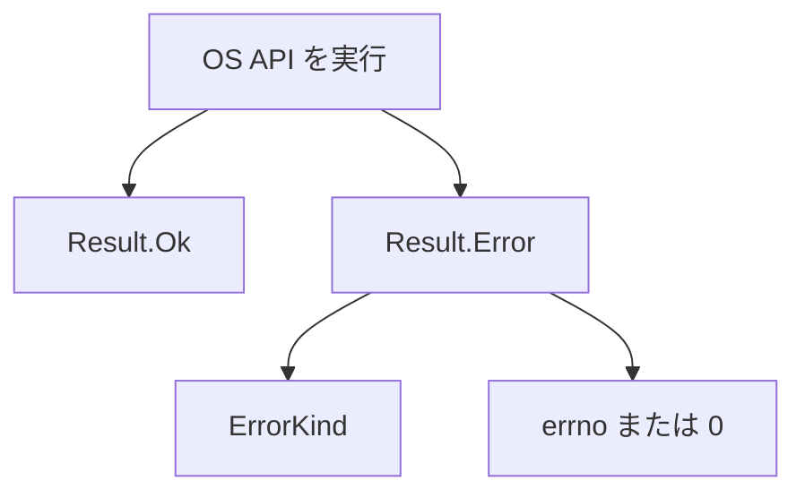

# Os

`Os` は、OS の失敗と、OS との境界の文字コードを扱うモジュールです。ファイルやプロセスが失敗したとき、トラップではなく `Os.Error` が返ります。メッセージの形と、UTF-8 との変換をここで揃えます。

## この記事のポイント

- 失敗は `Os.Error { kind, code }` です。`code` は OS の `errno` で、Tsuzuri が自分で見つけた失敗は `0` です。
- `Os.message` は `not found (os error 2)` のような文字列です。`code` が 0 なら種類だけです。
- `encode` と `decode` は、`string` と UTF-8 の変換です。孤立サロゲートや不正な UTF-8 は置換しません。
- `ErrorKind` にケースを足すと、網羅した `match` が壊れます。追加は互換性を壊す変更です。
- プロセスを途中で切る `Os.exit` はありません。

## エラーの形



```text
union ErrorKind = NotFound | PermissionDenied | AlreadyExists | InvalidInput | InvalidEncoding | Interrupted | Other
record Error { kind: ErrorKind, code: i32 }
```

これは定義の抜粋です。開発者が `Os.Error { kind: Os.NotFound, code: 2i32 }` のように手動で値を構築することも可能です。通常は OS API の戻り値を `match` で分岐して処理します。

```tsuzuri run=not%20found%20(os%20error%202)%0Ainvalid%20encoding%0A6%0Ainvalid%20encoding%0Ainvalid%20encoding%0A8%0Aa,b%0Anot%20found%20(os%20error%202)
def main :: unit -> i32 = \() ->
    let missing = Os.Error { kind: Os.NotFound, code: 2i32 }
    do! IO.write_line (Os.message (ref missing))
    let local = Os.Error { kind: Os.InvalidEncoding, code: 0i32 }
    do! IO.write_line (Os.message (ref local))
    let encoded = Os.encode "注文"
    do! IO.write_line (match encoded with
        | Result.Ok text -> to_string (Utf8String.to_bytes text).length
        | Result.Error error -> Os.message (ref error))
    let bad = Os.encode "\uD800"
    do! IO.write_line (match bad with
        | Result.Ok _ -> "unexpected"
        | Result.Error error -> Os.message (ref error))
    let raw = [255ubyte]
    do! IO.write_line (match Os.decode raw with
        | Result.Ok _ -> "decoded"
        | Result.Error error -> Os.message (ref error))
    let packed = [8ubyte, 0ubyte, 0ubyte, 0ubyte, 0ubyte, 0ubyte, 0ubyte, 0ubyte]
    do! IO.write_line (to_string (Os.decode_i64 (ref packed) 0))
    let names = [97ubyte, 0ubyte, 98ubyte, 0ubyte]
    do! IO.write_line (match Os.split_names (ref names) with
        | Result.Ok found ->
            let separator = ","
            String.join (ref separator) (ref found)
        | Result.Error error -> Os.message (ref error))
    let status = Os.error_of_status ((1i64 <<< 32) | 2i64)
    do! IO.write_line (Os.message (ref status))
    0
```

実行結果:

```text
not found (os error 2)
invalid encoding
6
invalid encoding
invalid encoding
8
a,b
not found (os error 2)
```

`注文` は UTF-8 で 6 バイトです。孤立サロゲートと、バイト `255` はどちらも `invalid encoding` で、`code` は 0 なので括弧が付きません。`split_names` は、NUL で終わる名前の列を分けます。`Dir.list` と `Env.args` がランタイムから受け取る形です。`decode_i64` は、サイズや時刻が入っている 8 バイトをリトルエンディアンで読みます。

`error_of_status` は、ランタイムが返す `(kind << 32) | code` を `Os.Error` に戻します。種類の番号は宣言順の 1 から 7 です。通常のコードは、すでに `Os.Error` になった値を受け取ります。

## errno と種類

| OS の `errno` | `Os.ErrorKind` |
| --- | --- |
| `ENOENT`、`ENOTDIR` | `NotFound` |
| `EACCES`、`EPERM`、`EROFS` | `PermissionDenied` |
| `EEXIST` | `AlreadyExists` |
| `EINVAL`、`ENAMETOOLONG`、`EISDIR` | `InvalidInput` |
| `EILSEQ` | `InvalidEncoding` |
| それ以外（`ENOTEMPTY`、`ELOOP`、`ENOSPC`、`EIO` など） | `Other` |

`EINTR` はランタイムが再試行します。今の API が `Interrupted` を呼び出し元へ返すことはありません。それでもケースはあるので、種類を網羅する `match` では枝が要ります。省略するとコンパイルが失敗します。

番号は環境で違います。macOS と Linux で `ENOENT` はどちらも 2 ですが、`ENOTEMPTY` は違います。分岐は `kind` で行い、`Os.message` は人に見せる文字列として使います。

```text
match failed with
| Result.Ok value -> value
| Result.Error error ->
    match error.kind with
    | Os.NotFound -> "無い"
    | _ -> Os.message (ref error)
```

これは断片です。`Result.get` は `Error` でトラップするので、回復する場所では使いません。

## 文字コード

パス、ファイル名、環境変数、テキストの本文は、Tsuzuri の中では `string`（UTF-16）です。OS との境界で UTF-8 にします。

- 孤立サロゲートは、システムコールの前に `InvalidEncoding`（`code` は 0）です。ファイルは作られません。
- パス、ファイル名、環境変数名、`Process.run` の引数に NUL があると `InvalidInput`（`code` は 0）です。
- OS から返った名前や本文が UTF-8 でないと、呼び出し全体が `InvalidEncoding` です。読めた部分だけは返しません。
- 正規化しません。ファイルシステムが名前を変えたら、その結果をそのまま返します。バイト列のまま持つパス型はありません。
- `File.read_bytes` と `Process.Output` の標準出力は、デコードしません。

`Os.encode` はよく形成された `string` を `utf8string` にします。`Os.decode` はバイト列を `string` にします。ファイル API は内部でこれを使います。自分で境界を越えるときに、同じ規則で変換できます。

## 終了コード

`def main` が返した `i32` が終了コードです。トップレベルの `IO<i32>` も同じです。それ以外の `IO<T>` は、値を捨てて 0 で終わります。POSIX 環境において親プロセスから観測可能な終了ステータスは下位 8 bit です。

途中でプロセスを切る関数はありません。残ったデストラクタを飛ばさないためです。失敗を終了コードにするなら、`main` で `0` か `1` を返します。`tsuzuri run` は、子の終了コードが 0 でないと `E2005` を報告し、コマンド自身は 1 で終わります。

## WASM と Windows

既定の wasm32 は、標準入出力以外のホスト import を持たないのが原則です。`File`、`Dir`、`Env`、`Time`、`Random.bytes`、`Random.next_u64`、`Process` に到達するコードは、WASM、LLVM IR、オブジェクトのどの出力でも `E2000` で失敗し、中途半端な成果物は残りません。`check` は IR を出さないので、このエラーは出ません。

`Path`、`Os` の純粋な関数、`Random.Pcg` は import が要らないので、wasm32 でもネイティブと同じです。

`build --target wasm32 --wasm-host wasi` は、標準入出力と OS API を WASI preview1 に下げます。動作は Node.js の `node:wasi` 実装を用いて検証されており、システム固有のエラー番号の差異を除きネイティブと一致します。

- ホストに指定できるのは `wasi` だけです。`threads`、wasm64、`--emit llvm`、`--emit header`、`run` との併用は `E2000` です。
- 到達した操作の import だけを出します。`def main` か `IO` の入口があるときだけ、WASI の `_start` を定義します。
- 非ゼロの `main` と `IO<i32>` は `proc_exit` でホストへ渡します。
- `Os.Error.code` は WASI の errno です。
- パスは、preopen されたディレクトリのうち `/` 境界で最長一致する接頭辞から解決します。どれにも合わなければ、最初の preopen からの相対パスです。
- `Env.current_dir ()` は最初の preopen の名前です。`Process.run` は `Other` です。
- WASI preview2 とコンポーネントモデルには対応していません。

Windows 環境でコンパイラがネイティブバイナリをビルドする際、コードが OS API に到達している場合は `E2002` エラーとなります。これは Windows ネイティブ環境での実行検証が完了していないためです（OS API を使用しない純粋な計算プログラムには影響しません）。そのため、Windows ネイティブ環境での動作を保証するものではありません。

## 公開 API

| 関数 | シグネチャ | 説明 |
| --- | --- | --- |
| `Os.message` | `ref Error -> string` | `not found (os error 2)`。`code` が 0 なら種類だけ |
| `Os.encode` | `ref string -> Result<utf8string, Error>` | OS へ渡す UTF-8。孤立サロゲートは `InvalidEncoding` |
| `Os.decode` | `[ubyte] -> Result<string, Error>` | UTF-8 を `string` にする。不正なら `InvalidEncoding` |
| `Os.error_of_status` | `i64 -> Error` | ランタイムの状態ワードを `Os.Error` に戻す |
| `Os.split_names` | `ref [ubyte] -> Result<[string], Error>` | NUL 区切りの名前を分ける。1 つでも不正なら全体が失敗 |
| `Os.decode_i64` | `ref [ubyte] -> i64 -> i64` | `offset` から 8 バイトをリトルエンディアンで読む |

`encode` は所有権を移しません。`decode` はバイト列を受け取ります。配列は `Copy` なので、渡したあとも変数は残ります。

`Os.message` の種類の文字列は `not found`、`permission denied`、`already exists`、`invalid input`、`invalid encoding`、`interrupted`、`other` です。

## まとめ

- OS の失敗は `Os.Error` です。標準入出力の `IO.Error` とは別の型です。
- 分岐は `kind`、表示は `Os.message` です。エラーコードの番号は環境によって異なります。
- 文字は UTF-8 で厳密に変換されます。暗黙の置換や部分的な成功はありません。
- `Interrupted` は現状のランタイムでは返却されませんが、`match` 式でパターン網羅性を満たすためにハンドラが必要です。
- 既定の WASM と、未検証の Windows ネイティブでは、OS API に到達するビルドは失敗します。

## 関連項目

- [IO](./io.md)
- [File](./file.md)
- [Process](./process.md)
- [Result](./result.md)
- [WebAssembly への出力](../compiler/webassembly.md)
- [言語仕様の OS API](../../../docs/language.md#os-api)
- [言語仕様の WASM と Windows](../../../docs/language.md#wasm-と-windows)
- [言語リファレンスの目次](../index.md)
