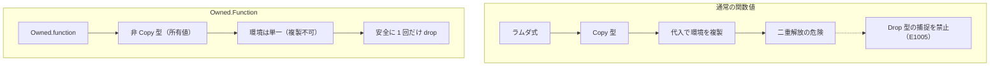

# Owned

`Owned` モジュールは、リソースを所有する関数値 `Owned.Function` や、所有値を即座に破棄する `Owned.drop` などのメモリ安全機能を提供する標準モジュールです。

通常の関数値（ラムダ式）は `Copy` で、代入のときに環境が複製されます。`Drop` を実装した型や、ほかの非 Copy 値を通常の関数値へ捕捉すると、同じ資源を二度解放しかねません。そのため捕捉は拒否されます。`Owned.Function` は Copy ではなく、資源を所有したまま持ち運べる関数値です。何度でも呼べますが、関数値そのものは複製できません。

## この記事のポイント

- `Owned.Function<'a, 'b>` は、外部リソースや Drop 型を捕捉できる特別な関数値型です。
- 通常の関数値と異なり Copy ではなく、捕捉した値の所有権をカプセル化します。
- `Owned.function` で生成し、`Owned.call` で借用経由で呼び出します。
- 関数本体からは、捕捉した値を「借用」としてのみ読み取れます（ムーブは `E1012`）。
- `Owned.drop` を呼び出すと、スコープの終わりを待たずに所有値をその場で早期解放できます。
- `Owned.Function` が破棄されると、捕捉していたリソースも 1 回だけ解放されます。

## 提供 API 一覧

| 名前 | 型シグネチャ | 説明 |
| --- | --- | --- |
| `Owned.Function<'a, 'b>` | 型 | 捕捉値を所有する不透明な関数値型（非 Copy） |
| `Owned.function` | `('a -> 'b) -> Owned.Function<'a, 'b>` | 1 引数のインラインラムダ式から所有関数値を生成 |
| `Owned.call` | `ref Owned.Function<'a, 'b> -> 'a -> 'b` | 共有借用を経由して所有関数値を呼び出す |
| `Owned.drop` | `'a -> unit` | 任意の所有値を消費し、その場でデストラクタを実行 |

## 通常の関数値との違いと課題

Tsuzuri の通常の関数値（`'a -> 'b`）は、言語仕様として `Copy` 型クラスを実装しています。代入や関数渡しを行うと、クロージャが捕捉している環境オブジェクトがディープコピーされます。

もし `Drop` を実装した型（ファイルハンドルやソケットなど）を通常の関数値へ捕捉できるとすると、関数値をコピーした際に同じリソースが複数箇所で二重解放（double free）されてしまいます。そのため、コンパイラは Drop 型を通常の関数値へ捕捉しようとするとエラー `E1005` を報告します。

```text
record Resource { id: i64 }
instance Drop<Resource> { fn drop _r = () }

let res = Resource { id: 1 }
let f = \x -> x + res.id
```

コンパイル結果:

```text
error[E1005]: cannot capture Main.Resource in a reusable function; fully apply exclusive borrows and keep single-use tasks in task blocks
```

しかし、リソースの操作をコールバックとして渡したい場合や、後処理を束ねた処理を遅延実行したい場面では、リソースを保持した関数値が不可欠です。この問題を解決するのが `Owned.Function` です。



## Owned.function による関数値の生成

`Owned.function` は、引数にインラインで記述したラムダ式を受け取り、`Owned.Function<'a, 'b>` を返します。

```tsuzuri run=42
record Resource { id: i64 }

instance Drop<Resource> {
    fn drop _r = ()
}

let res = Resource { id: 40 }
let compute = Owned.function (\extra -> res.id + extra)
Owned.call (ref compute) 2
```

実行結果:

```text
42
```

`compute` は `res` の所有権を保持しており、`compute` がスコープを抜けるときに `res` の `Drop` も自動的に 1 回だけ実行されます。

## Owned.call による借用呼び出し

`Owned.Function` を実行するには、組み込み関数 `Owned.call` を使用します。

第 1 引数には所有関数値の共有参照（`ref compute` または `&compute`）を渡します。

```tsuzuri run=3
record Counter { value: i64 }

instance Drop<Counter> {
    fn drop _c = ()
}

let c = Counter { value: 1 }
let get = Owned.function (\step -> c.value + step)
let first = Owned.call (ref get) 0
let second = Owned.call (ref get) 1
first + second
```

実行結果:

```text
3
```

所有関数値を借用で呼び出すので、関数値自体は消費されません。何度でも呼べます。

## Owned.drop による早期解放

`Owned.drop` は、スコープの終端を待たずに所有値をその場で即座に解放するための組み込み関数です。

```tsuzuri run=drop%207%0Areleased
record Lock { id: i64 }

instance Drop<Lock> {
    fn drop lock = do! IO.write_line ("drop " + to_string lock.id)
}

def main :: unit -> i32 = \() ->
    let lock = Lock { id: 7 }
    Owned.drop lock
    do! IO.write_line "released"
    0
```

実行結果:

```text
drop 7
released
```

`Owned.drop` に渡された値はその場で消費（ムーブ）され、`Drop` が実装されていれば直ちに `drop` デストラクタが実行されます。渡した後の変数へアクセスしようとすると `E1012` になります。

## Owned.Function の安全規則と制約

`Owned.Function` の健全性を保証するため、以下の安全制約がコンパイラによって強制されます。

### Copy ではない

`Owned.Function` は非 Copy 型です。別の変数へ代入すると所有権がムーブし、元の変数は使用できなくなります。

```text
let copy = compute
Owned.call (ref compute) 1
```

コンパイル結果:

```text
error[E1012]: use of moved or partially moved value 'compute'
```

### 内部表現は不透明（opaque）

`std/Owned.tz` での内部定義は `record Function<'a, 'b> { run: 'a -> 'b }` ですが、言語レベルで不透明（opaque）型として保護されています。

ユーザーが直接 `.run` フィールドを取り出したり、レコードリテラルとして手動構築したりしようとすると `E1022` になります。

```text
let run = compute.run
```

コンパイル結果:

```text
error[E1022]: the representation of 'Owned.Function' is opaque; use its module API
```

### インラインのラムダで、引数は 1 つ

`Owned.function` に渡すラムダは、呼び出しの引数の位置に直接書きます。変数に入れた関数値や、パイプラインの途中のラムダは通常の関数値として扱われ、非 Copy の捕捉は `E1005` になります。

引数は 1 つだけです。2 つ以上だと `E1006` になります。

```text
let add = Owned.function (\x y -> x + y + res.id)
```

コンパイル結果:

```text
error[E1006]: Owned.function takes a lambda with one parameter; take a tuple or return another function
```

複数の引数を渡したい場合は、タプルを引数に取るか、別の関数を返す形に設計します。

### 捕捉値を本体からムーブできない

`Owned.function` のラムダ式本体は、捕捉した値を **借用としてのみ** 参照できます。本体の中で捕捉値を別の関数へムーブしたり、`Owned.drop` で破棄したりすることはできません。

```text
let consume = Owned.function (\amount -> { Owned.drop res; amount + 0 })
```

コンパイル結果:

```text
error[E1012]: cannot move 'res' out of an owned function; borrow it with 'ref' instead
```

`amount` だけを返す書き方は、型が決まらず `E1015` になることがあります。上の例は `amount + 0` で引数の型を `i64` に固定しています。

もし本体内でのムーブを許可すると、`Owned.call` を 2 回呼んだ際に同じリソースが二重にムーブ・破棄されてしまうためです。

### 捕捉できるのは所有値だけ

`Owned.function` が捕捉できるのは、参照を含まない所有値です。外の `ref` を本体で使うと `E1013` になります。

```text
let text = "hi"
let r = ref text
let f = Owned.function (\n -> r.length + n)
```

コンパイル結果:

```text
error[E1013]: an owned function captures only owned values; ref string contains a reference
```

### 通常のクロージャへの再捕捉の禁止

`Owned.Function` を通常の関数値（クロージャ）の中に再捕捉することはできません（`E1005`）。

```text
let wrapper = \x -> Owned.call (ref compute) x
```

コンパイル結果:

```text
error[E1005]: cannot capture Owned.Function<i64, i64> in a reusable function; fully apply exclusive borrows and keep single-use tasks in task blocks
```

## 他の言語との比較

| 項目 | Tsuzuri | Rust | C++ | C# |
| --- | --- | --- | --- | --- |
| 資源を持つクロージャ | `Owned.Function<'a, 'b>` | `FnOnce` / `Box<dyn FnMut>` | ラムダ式（ムーブキャプチャ） | クロージャ（GC 管理） |
| 関数値の複製 | 通常の関数値は Copy、`Owned` は非 Copy | クロージャごとに `Copy` / `Clone` を判定 | コピー可能 | 参照のコピーのみ |
| 呼び出し方法 | `Owned.call (ref f) x` | `f(x)` | `f(x)` | `f(x)` |
| 早期解放 | `Owned.drop x` | `drop(x)` | スコープブロック | `x.Dispose()` |
| 表現の公開性 | 不透明型（opaque） | 匿名型（トレイト境界） | 匿名型 | デリゲートオブジェクト |

## まとめ

- `Owned.Function` は、Drop 型や外部リソースを所有・カプセル化できる関数値型です。
- 通常の関数値と異なり非 Copy であり、環境の意図しない複製や二重解放を防ぎます。
- `Owned.function` で生成し、`Owned.call` で借用経由で実行します。
- ラムダは呼び出しの位置に直接書き、引数は 1 つです。本体は捕捉値を借用するだけで、ムーブはできません。
- `Owned.drop` を用いることで、スコープ終端を待たずに所有値を早期解放できます。

## 関連項目

- [所有権とムーブ](../ownership-and-memory/ownership.md)
- [借用と参照](../ownership-and-memory/borrowing.md)
- [Drop とリソースの解放](../ownership-and-memory/drop.md)
- [use キーワード](../exception-handling/use.md)
- [ラムダ式](../values-and-functions/lambda-expressions.md)
- [言語仕様: 利用者定義の解放（Drop）](../../../docs/language.md#利用者定義の解放drop)
- [言語リファレンスの目次](../index.md)

