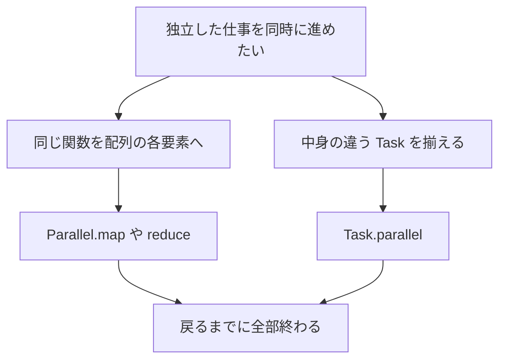

# Parallel

`Parallel` は、配列の生成、変換、集計、および排他スライスへの分割書き込みを、決定論的なチャンク分割で行う同期 API です。呼び出し元へ制御が戻った時点で全ワーカースレッドの処理が完了していることが保証されます。各チャンクの処理開始順や完了順は未規定ですが、結果配列の添字順は入力と一致します。

[`Task.parallel`](../async-tasks-and-lazy/task.md) が「別々のタスクを揃えて待つ」API なのに対し、こちらは「同じ形の配列要素を分ける」API です。自動でループを並列にはしません。

## この記事のポイント

- `init`、`map`、`map_ref`、`reduce`、`for_each_chunk` は、その場で全部の引数を渡して呼ぶ必要があります。関数値にはできません。
- チャンクの境界は CPU 数では変わりません。同じ入力なら、ネイティブでも WASM の逐次経路でも同じ分割です。
- `reduce` の結合順はチャンク順で固定です。浮動小数点では `Array.reduce` とビットが違うことがあります。
- 既定の WASM は逐次です。スレッドが欲しいときは `--wasm-feature threads` を明示します。

## 添字から配列を作る

```tsuzuri run=14
let squares = Parallel.init 4 (\index -> index * index)
Parallel.sum ref squares
```

実行結果:

```text
14
```

`Parallel.init` の長さは `i64`、初期化関数は `i64 -> 'a` です。`0*0 + 1*1 + 2*2 + 3*3` で 14 です。負の長さ、サイズの溢れ、確保の失敗はトラップです。空の配列なら、初期化関数は呼びません。

`Parallel.sum` は `std/Parallel.tz` の関数で、中身は `Parallel.reduce` です。単位元は `0i64 as 'a` なので、浮動小数点では正のゼロから始まります。

## 関数の一覧

| 関数 | シグネチャ | 引数の所有 |
| --- | --- | --- |
| `Parallel.init` | `Send<'a> => i64 -> (i64 -> 'a) -> ['a]` | 長さと関数。新しい配列を返す |
| `Parallel.map` | `(Copy<'a>, Send<'a>, Send<'b>) => ('a -> 'b) -> ref ['a] -> ['b]` | 入力は共有借用。要素は複製して渡す |
| `Parallel.map_ref` | `(Send<'a>, Send<'b>) => (ref 'a -> 'b) -> ref ['a] -> ['b]` | 要素も共有借用のまま渡す |
| `Parallel.reduce` | `(Copy<'a>, Send<'a>) => 'a -> ('a -> 'a -> 'a) -> ref ['a] -> 'a` | 単位元は複製される。入力は共有借用 |
| `Parallel.sum` | `(Numeric<'a>, Add<'a>, Copy<'a>, Send<'a>) => ref ['a] -> 'a` | `reduce` の薄いラッパー |
| `Parallel.for_each_chunk` | `Send<'a> => i64 -> (i64 -> ref mut ['a..] -> unit) -> ref mut ['a..] -> unit` | 入力は呼び出しの間だけ排他借用 |

`map` の関数が先、配列が後なのは `Array.map` と同じです。Copy 型でも、配列や関数値の複製は深いコピーです。大きい要素や非 Copy の要素は `map_ref` にしてください。

```tsuzuri run=8
let texts = ["red", "green"]
let lengths = Parallel.map_ref String.length (ref texts)
Array.sum ref lengths
```

実行結果:

```text
8
```

`String.length` は `ref string` を受け取ります。`map` だと各文字列を複製してから渡すので、長さだけ見たいなら `map_ref` で足ります。

## 排他スライスを分ける

`for_each_chunk size body values` は、`values` を先頭から `size` 要素ずつの、重ならない排他スライスに分けます。各チャンクの開始添字とスライスを `body` に 1 回渡します。最後のチャンクだけ短くなります。空なら `body` は呼びません。`size` が 0 以下ならトラップです。

この分割は、下に書く `map` 用の式ではなく、指定した `size` だけで決まります。各 `body` が触れるのは自分のチャンクだけなので、要素の書き込みに追加の同期は要りません。

```tsuzuri run=56
def scale :: i64 -> ref mut [i64..] -> unit
fn scale start chunk =
    for index in 0i64 .. (chunk.length - 1) do
        Array.write chunk index ((start + index) * 2)

let mut values = new [i64](8, \_index -> 0)
Parallel.for_each_chunk 3 scale (ref mut values)
Array.sum ref values
```

実行結果:

```text
56
```

8 要素を 3 個ずつ分けると、チャンクは添字 0、3、6 から始まります。各位置を 2 倍して足すと `0+2+4+6+8+10+12+14` で 56 です。戻ったときには全部の書き込みが見えます。

## チャンク境界

`init`、`map`、`map_ref`、`reduce`、`sum` のチャンク数は、要素数を `n` として次のとおりです。空なら 0 です。

`k = min(1024, ceil(n / 4096))`

実装は溢れを避けた整数演算で、`n / 4096` の切り上げを計算します。チャンク番号 `c`（`0 <= c < k`）の開始位置は `(n / k) * c + ((n % k) * c) / k`、終了位置は `c` を `c + 1` にした同じ式です。終端は含みません。

CPU コア数、SIMD 幅、WASM バックエンドの有無によって分割境界が変わることはありません。4,096 要素未満の場合は 1 チャンクとなり、1 つのワーカーで処理されます。

`for_each_chunk` の塊は利用者が決めた `size` です。仕事の数はこちらも最大 1024 で、チャンクがそれより多ければ、1 つの仕事が連続するチャンクを順に処理します。`size` を小さくしても、コールバックの複製は仕事の数までです。

## reduce の順序

各チャンクは、単位元の複製から添字の昇順で畳み込みます。全部終わったあと、呼び出し元が単位元からチャンク番号順に部分結果を結合します。空なら単位元そのものです。

単位元はチャンクの数だけ複製され、最後の結合でも使われます。結合法則が成り立たない演算や浮動小数点では、`Array.reduce` や `Array.sum` とビットが違うことがあります。同じビットが要るなら、順序が一致する API を選んでください。[`Math`](math.md) の `Array.sum_kahan` や `Array.sum_pairwise` は、スレッド数で木を変えません。

これは `fast-math` の許可ではありません。順序の違いは、この API の明示した契約です。

```tsuzuri run=7
let empty: [i64] = []
Parallel.reduce 7 (\left right -> left + right) (ref empty)
```

実行結果:

```text
7
```

## Task.parallel との使い分け



| 点 | `Parallel` | `Task.parallel` |
| --- | --- | --- |
| 入力 | 配列かスライス | `Task` の配列 |
| 仕事の形 | 要素ごとに同じコールバック | タスクごとに本体が違ってよい |
| いつ始まる | 呼んだその場で同期実行 | `Task.parallel` は遅延。`Task.run` や `let!` で始まる |
| 結果 | 添字順。`reduce` はチャンク順の結合 | 入力と同じ順の配列 |
| 失敗 | トラップ。`Result` にはまとめない | `Task.parallel_results` なら最小添字の `Error` |
| 関数値 | `init` などは直接の完全適用だけ | `Task.parallel` 自体は関数値にできる |

コールバックが借用を捕捉すること、結果が借用を持つことはできません。入力の共有借用と、`for_each_chunk` の排他借用は、フォーク・ジョインの区間の中だけです。所有環境を証明できない未知の関数値は `E1013` です。

`let make = Parallel.init` も `E1013` です。一方、コールバックに渡す関数は、所有環境を証明できる通常の関数、部分適用、ラムダで構いません。引数は書いた順に 1 回だけ評価します。

要素と結果には `Send` が要ります。スレッドへ渡せる所有値、という意味です。`ref` を要素に含めることはできません。

## スレッドと WASM

ネイティブでは、`Task` と同じ常駐プールを使います。追加で起動するワーカーは `min(オンラインの CPU 数, 32) - 1` 以下で、呼び出し元のスレッドも仕事をします。CPU 数が取れなければ追加ワーカーを作らず、逐次に倒れます。0 件や 1 件の `Task.parallel` はプールを起動しません。`Parallel` の短い配列は 1 チャンクになることが多く、そのときはワーカーを増やしても境界は 1 つのままです。

入れ子になっても、呼び出し元が自分の区間を進めるので、ワーカー枯渇のデッドロックは避ける構造です。制御が戻ったあと、OS スレッドはプールに残ります。切り離す API はありません。

既定の WASM は、同じチャンク順の逐次実装です。`src/runtime/task-wasm.ll` が入力順にコールバックを呼び、ホストのスレッド import は要りません。

スレッドが欲しいときは、オブジェクトか WASM 出力で明示します。

```sh
tsuzuri build --target wasm32 --emit wasm --wasm-feature threads -o app.wasm
```

`run` や `check` にこのフラグは付けられません。`E2000` です。実行には Node.js 20 以降の `worker_threads` と、共有メモリに対応したホストが要ります。同梱の `src/runtime/wasm-threads.mjs` がプールを作ります。ワーカーの初期化に失敗したとき、逐次の成功へすり替えることはありません。

処理途中でトラップが発生した場合、部分結果の即時解放や未完了タスクの強制キャンセルは保証されません。また、計算量が極めて小さい処理では、メモリ確保やスレッド同期のオーバーヘッドが並列化の効果を上回ることがあります。ベンチマークを測定する際は、データ規模、要素のコピー費用、プールの初期化、同期コストをそれぞれ切り分けて評価してください。

## まとめ

- 配列を同じ関数で分ける同期 API です。戻るまでに完了しています。
- `map` は要素を複製します。複製を避けたいときは `map_ref` です。
- チャンク境界と `reduce` の結合順は、コア数で変わりません。
- `Task.parallel` は別々のタスク用です。配列の要素変換には `Parallel` を使います。
- 既定の WASM は逐次です。スレッドは `--wasm-feature threads` の明示が要ります。

## 関連項目

- [Task 式](../async-tasks-and-lazy/task.md)
- [Array](array.md)
- [Simd](simd.md)
- [Math](math.md)
- [所有権とムーブ](../ownership-and-memory/ownership.md)
- [借用と参照](../ownership-and-memory/borrowing.md)
- [WebAssembly への出力](../compiler/webassembly.md)
- [言語仕様のデータ並列 API](../../../docs/language.md#データ並列-api)
- [言語仕様の実行バックエンドと失敗](../../../docs/language.md#実行バックエンドと失敗)
- [言語リファレンスの目次](../index.md)
