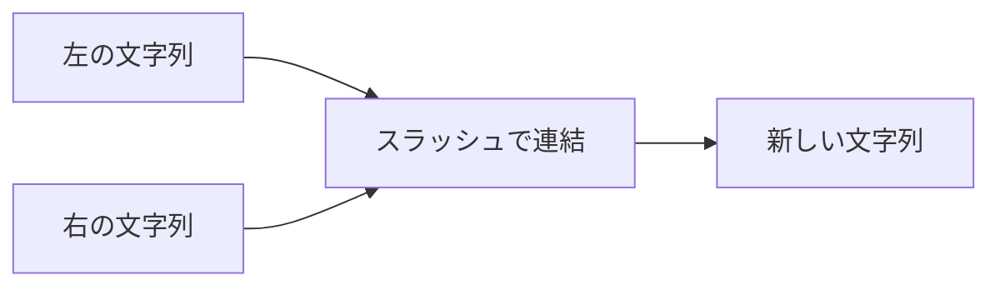

# Path

`Path` は、パス文字列を連結したり、親ディレクトリやファイル名を取り出したりする純粋関数を提供するモジュールです。OS を呼び出さないため `IO` を返さず、副作用はありません。既定の wasm32 環境でもネイティブとまったく同一の結果が得られます。

パスの区切り文字として認識されるのはスラッシュ `/` のみです。正規化やシンボリックリンクの解決は行いません。相対パスの起点や `..` の解釈は、生成されたパス文字列を後から OS API へ渡した際に OS 側で行われます。

## この記事のポイント

- `join` は文字列を `/` でつなぐだけです。右が絶対パスでも、左を置き換えません。
- `parent` と `file_name` は、末尾の `/` を除いてから最後の名前を見ます。`/` だけは残します。
- `extension` は、最後の名前の最後の `.` より後ろです。`.` で始まるだけの名前には拡張子がありません。
- バックスラッシュは区切りではありません。
- サンドボックスではありません。`..` を消してくれる関数でもありません。

## 連結と分解

引数は `ref string` です。文字列リテラルや変数をそのまま渡せます。所有権は移りません。

```tsuzuri run=notes%2F2026%0Anotes%2F2026%0A2026%0Anotes%2F%2Fetc%0Aparent%20a%2Fb%2Fc%20-%3E%20Some%20a%2Fb%0Aparent%20%2Fa%20-%3E%20Some%20%2F%0Aparent%20a%20-%3E%20None%0Aparent%20%2F%20-%3E%20None%0Aparent%20%28empty%29%20-%3E%20None%0Aparent%20a%2Fb%2F%20-%3E%20Some%20a%0Aname%20a%2Fb.txt%20-%3E%20Some%20b.txt%0Aname%20a%2F..%20-%3E%20None%0Aname%20.%20-%3E%20None%0Aname%20%2F%20-%3E%20None%0Aname%20%28empty%29%20-%3E%20None%0Aname%20a%2Fb%2F%20-%3E%20Some%20b%0Aext%20a.tar.gz%20-%3E%20Some%20gz%0Aext%20.bashrc%20-%3E%20None%0Aext%20a.%20-%3E%20Some%20%0Aext%20a%2Fb.d%2Fc%20-%3E%20None%0Awindows%20-%3E%20Some%20C%3A%5Cdir%5Cnote.txt
def show :: Maybe<string> -> string
fn show value =
    match value with
    | Maybe.Some text -> "Some " + text
    | Maybe.None -> "None"

def line :: string -> Maybe<string> -> IO<unit>
fn line label value = IO.write_line (label + show value)

def main :: unit -> i32 = \() ->
    do! IO.write_line (Path.join "notes" "2026")
    do! IO.write_line (Path.join "notes/" "2026")
    do! IO.write_line (Path.join "" "2026")
    do! IO.write_line (Path.join "notes" "/etc")
    do! line "parent a/b/c -> " (Path.parent "a/b/c")
    do! line "parent /a -> " (Path.parent "/a")
    do! line "parent a -> " (Path.parent "a")
    do! line "parent / -> " (Path.parent "/")
    do! line "parent (empty) -> " (Path.parent "")
    do! line "parent a/b/ -> " (Path.parent "a/b/")
    do! line "name a/b.txt -> " (Path.file_name "a/b.txt")
    do! line "name a/.. -> " (Path.file_name "a/..")
    do! line "name . -> " (Path.file_name ".")
    do! line "name / -> " (Path.file_name "/")
    do! line "name (empty) -> " (Path.file_name "")
    do! line "name a/b/ -> " (Path.file_name "a/b/")
    do! line "ext a.tar.gz -> " (Path.extension "a.tar.gz")
    do! line "ext .bashrc -> " (Path.extension ".bashrc")
    do! line "ext a. -> " (Path.extension "a.")
    do! line "ext a/b.d/c -> " (Path.extension "a/b.d/c")
    do! line "windows -> " (Path.file_name "C:\\dir\\note.txt")
    0
```

実行結果:

```text
notes/2026
notes/2026
2026
notes//etc
parent a/b/c -> Some a/b
parent /a -> Some /
parent a -> None
parent / -> None
parent (empty) -> None
parent a/b/ -> Some a
name a/b.txt -> Some b.txt
name a/.. -> None
name . -> None
name / -> None
name (empty) -> None
name a/b/ -> Some b
ext a.tar.gz -> Some gz
ext .bashrc -> None
ext a. -> Some 
ext a/b.d/c -> None
windows -> Some C:\dir\note.txt
```

`notes` と `/etc` は `notes//etc` です。右が `/` で始まっても、左を捨てません。空の左は右だけを返します。左がすでに `/` で終わっていれば、もう 1 つは足しません。

`ext a. -> Some ` のうしろには、空の拡張子があります。`.` で終わると、拡張子は空文字列です。`.bashrc` は、名前が唯一の `.` で始まるので拡張子なしです。`a/b.d/c` の最後の名前 `c` に `.` はありません。



## パス処理の仕様と注意点

| 入力 | `parent` | `file_name` | `extension` |
| --- | --- | --- | --- |
| `a/b/c` | `Some "a/b"` | `Some "c"` | `None` |
| `/a` | `Some "/"` | `Some "a"` | `None` |
| `a/b/` | `Some "a"` | `Some "b"` | `None` |
| `a`、`/`、`""` | `None` | `None`（`a` は `Some "a"`） | 名前に従う |
| `.`、`..`、`a/..` | 親があればそれを返す | `None` | `None` |
| `a.tar.gz` | `None` | `Some "a.tar.gz"` | `Some "gz"` |
| `C:\dir\note.txt` | `None` | 文字列全体 | `Some "txt"` |

表の最後の行にあるように、バックスラッシュ `\` はパスの区切り文字として認識されません。Windows 形式のパスをこれらの関数で分解しても意図した結果にはならないため注意してください（Windows のネイティブビルドは、OS API に到達すると `E2002` で失敗します。一方、`Path` 自体は OS API を呼び出さないため、wasm32 環境でも利用可能です）。

`join` は `..` の除去や正規化を行いません。`"base"` と `"../secret"` を連結した場合、`"base/../secret"` のままとなります。アクセス範囲を制限するサンドボックスとしては機能しないため、指定されたパスにアクセスして安全かどうかは、[File](./file.md) や [Dir](./dir.md) に渡した際の OS の返却結果で判断してください。

## 公開 API

| 関数 | シグネチャ | 説明 |
| --- | --- | --- |
| `Path.join` | `ref string -> ref string -> string` | `/` で連結する。左が空なら右。左が `/` で終わるなら重ねない |
| `Path.parent` | `ref string -> Maybe<string>` | 最後の名前を除いたパス。無ければ `None` |
| `Path.file_name` | `ref string -> Maybe<string>` | 最後の名前。`""`、`/`、`.`、`..` は `None` |
| `Path.extension` | `ref string -> Maybe<string>` | 最後の名前の、最後の `.` より後ろ |

戻り値の `string` は新しい所有値です。引数は借用なので、同じ変数を続けて渡せます。

```tsuzuri run=notes/2026
let folder = "notes"
let joined = Path.join folder "2026"
let above = Path.parent folder
match above with
| Maybe.Some _ -> "unexpected"
| Maybe.None -> joined
```

実行結果:

```text
notes/2026
```

この例は `Path.parent "notes"` が `None` なので、連結結果だけを表示します。`folder` を 2 回使ってもムーブしません。

## まとめ

- `Path` は純粋な文字列操作です。`IO` も OS の呼び出しもありません。
- 区切りは `/` だけです。バックスラッシュや `..` はただの文字です。
- 右が絶対パスでも、左を置き換えません。
- `.` と `..` と `/` と空文字列にはファイル名がありません。
- 拡張子は最後のドットより後ろです。ドットで始まるだけの名前にはありません。

## 関連項目

- [File](./file.md)
- [Dir](./dir.md)
- [Os](./os.md)
- [言語仕様のファイルとディレクトリ](../../../docs/language.md#ファイルとディレクトリ)
- [言語リファレンスの目次](../index.md)
