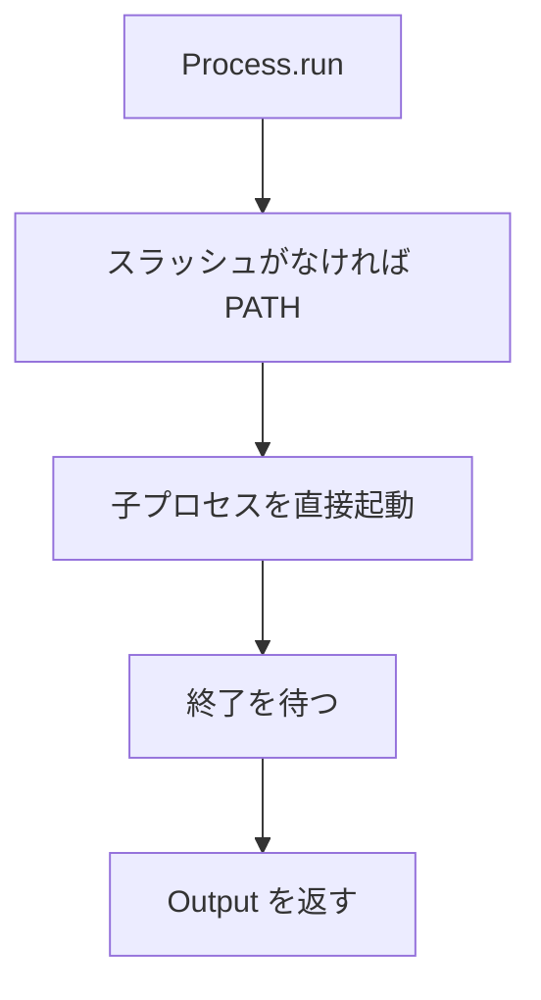

# Process

`Process.run` は、シェルを通さずにプログラムを起動し、終わるまで待ちます。引数は、空白や `$` を含んでいても、そのまま 1 つの引数です。シェルに展開させたくないときに使います。

## この記事のポイント

- プログラム名に `/` が無ければ `PATH` から探します。あるならそのパスを起動します。
- 子は親の環境変数と作業ディレクトリを継承します。
- 標準入力へ `input` を書き、書き終わったら閉じます。
- 戻り値は `Output` です。終了コード、シグナル、標準出力、標準エラーが入ります。
- 標準出力と標準エラー出力の合計が 2^30 バイト（1 GiB）を超えると、子プロセスを強制終了して `Other` エラーを返します。



## シェルを通さない

次の例は `/bin/echo` に、`a b` と `$HOME` を別々の引数として渡します。シェルなら `$HOME` はホームディレクトリに展開されます。ここでは文字列のまま戻ってきます。

```tsuzuri run=code%3D0%20signal%3D0%0Aa%20b%20%24HOME%0Anot%20found%20%28os%20error%202%29%0Ainvalid%20input
def main :: unit -> i32 = \() ->
    let! echoed = Process.run "/bin/echo" ["a b", "$HOME"] []
    do! IO.write (match echoed with
        | Result.Ok output ->
            match Os.decode output.stdout with
            | Result.Ok text -> "code=" + to_string output.code + " signal=" + to_string output.signal + "\n" + text
            | Result.Error error -> Os.message (ref error)
        | Result.Error error -> Os.message (ref error))
    let! missing = Process.run "definitely-not-a-tsuzuri-program" [] []
    do! IO.write_line (match missing with
        | Result.Ok _ -> "unexpected"
        | Result.Error error -> Os.message (ref error))
    let! blank = Process.run "" [] []
    do! IO.write_line (match blank with
        | Result.Ok _ -> "unexpected"
        | Result.Error error -> Os.message (ref error))
    0
```

実行結果:

```text
code=0 signal=0
a b $HOME
not found (os error 2)
invalid input
```

`/bin/echo` は引数を空白でつないで、末尾に改行を付けます。そのバイト列が `stdout` です。`Os.decode` はそれを `string` にします。子の出力が UTF-8 でないときは、`Process.run` 自体は成功し、デコードの方が `InvalidEncoding` になります。バイナリを扱うなら `stdout` をそのまま見てください。

見つからないプログラムは `NotFound` です。macOS と Linux では `os error 2` です。空のプログラム名は、起動する前に `InvalidInput`（`code` は 0）です。

`PATH` 上の名前で起動するなら、`"/bin/echo"` の代わりに `"echo"` と書きます。スラッシュが無いときだけ検索します。

## 終了状態

```text
record Output { code: i32, signal: i32, stdout: [ubyte], stderr: [ubyte] }
```

これは定義の抜粋です。フィールドは読めます。

通常の終了では `code` が終了コードで、`signal` は 0 です。シグナルで終わったときは `code` が `-1` で、`signal` に番号が入ります。たとえば `SIGKILL` なら `signal` は 9 です。終了コードが 0 かどうかは、呼び出し側が見ます。`Process.run` は、子が非ゼロで終わっても `Ok` を返します。

標準入力の `input` は、すべて書くか、子が先に閉じるまで書きます。そのあと閉じます。空の `[]` は、何も書かずに閉じることです。

両方の出力は並行して回収されます。合計が 2^30 バイト（1 GiB）を超えると、リソース保護のため子プロセスへ `SIGKILL` を送信して強制終了させ、`Other` エラーを返します。終了せずに大量のデータを出力し続ける子プロセスも、同一の上限によって失敗します。

引数文字列に孤立サロゲートが含まれる場合は `InvalidEncoding`、引数内部に NUL 文字が含まれる場合は `InvalidInput` エラーとなります。NUL は引数の区切り文字として利用されるため、途中に含めると引数の境界が壊れてしまうためです。実行権限のないファイルを起動しようとした場合は `PermissionDenied` エラーとなることがあります。

## 公開 API

| 関数 | シグネチャ | 説明 |
| --- | --- | --- |
| `Process.run` | `string -> [string] -> [ubyte] -> IO<Result<Process.Output, Os.Error>>` | プログラムを直接起動し、終了まで待機する |

`args` はプログラム名の後ろに続く引数列です。プログラム名自身を配列の先頭に重ねて渡す必要はありません。

プログラム名である `string` の所有権はムーブします。引数の配列や入力のバイト列は要素が `Copy` であるため配列全体も `Copy` となり、渡したあとも元の変数は残ります。巨大な配列データを渡す際はコピーコストに配慮してください。`Output` の `stdout` と `stderr` も配列なので、デコード関数へ渡したあとも元のフィールドを読み取ることができます。

アクションを生成しただけで破棄した場合、子プロセスは起動しません。`let!` や `do!` で実行した回数だけ起動します。

## 対応環境

既定の wasm32 で `Process.run` に到達すると、ビルドは `E2000` で失敗します。`--wasm-host wasi` ではコンパイル可能ですが、実行時に `Other` エラーとなります。WASI preview1 にはプロセス生成に相当するシステムコールが存在しないためです。

Windows のネイティブビルドは、OS API に到達すると `E2002` で失敗します。また、`/bin/echo` は POSIX 環境のコマンドであるため、Windows 環境では動作しません。

子プロセスの起動はメインスレッド（エントリーポイント）で行います。並行 `Task` の中から直接呼び出すことはできません。

## 他の言語との比較

| | Tsuzuri | 近いもの |
| --- | --- | --- |
| 起動 | `Process.run`。シェルを通さない | Rust の `Command`、Python の `subprocess` で `shell=False` |
| 引数 | 配列の 1 要素が 1 引数 | シェル文字列へ連結しない |
| 失敗 | 起動できなければ `Os.Error`。子の非ゼロは `Output.code` | 終了コードと、起動の失敗を混ぜない |

## まとめ

- `Process.run` はシェルを介さずにプロセスを起動します。`$HOME` や `;` はシェル展開されません。
- スラッシュを含まないプログラム名は `PATH` から検索されます。子は親の環境変数と作業ディレクトリを継承します。
- 子の非ゼロ終了は `Ok` 内の `Output.code` に格納されます。シグナル終了時は `code` が `-1`、`signal` にシグナル番号が入ります。
- 出力の合計が 2^30 バイト（1 GiB）を超えると強制終了され、`Other` エラーとなります。
- WASI では `Other` エラーとなり、既定の wasm32 ではビルドが `E2000` で失敗します。

## 関連項目

- [IO](./io.md)
- [Os](./os.md)
- [Env](./env.md)
- [言語仕様の環境・時刻・乱数・プロセス](../../../docs/language.md#環境時刻乱数プロセス)
- [言語リファレンスの目次](../index.md)
