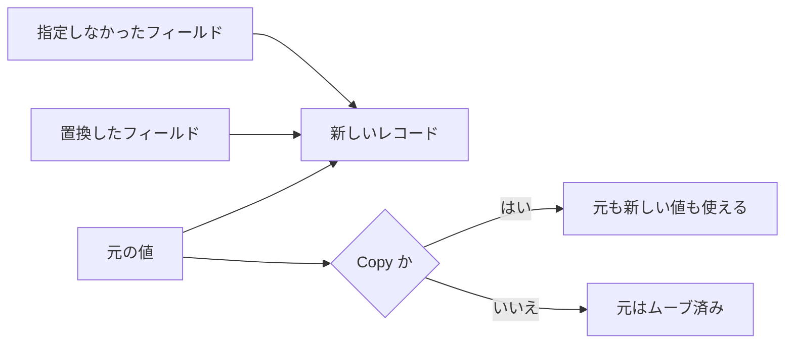

# Record

レコードは、名前付きフィールドを持つ不変の値です。座標、注文書、設定のように、中身の役割が決まっているデータをまとめるときに使います。フィールドの並びが同じでも、宣言が違えば別の型です。

クラスではありません。継承も仮想メソッドも、フィールドへの代入もありません。操作はモジュールの関数として書きます。

## この記事のポイント

- フィールドの型注釈は必須です。ローカル変数だけが型推論の対象です。
- 構築は `Point { x: 1.0, y: 2.0 }`、読み出しは `point.x` です。
- 更新は `{ point with x = 3 }` で、新しい値を作ります。非 Copy のレコードでは元の値を消費します。
- 全フィールドが Copy ならレコード全体も Copy です。`string` などを含む非 Copy なレコードはフィールド単位でムーブします。
- `deriving (Eq, Ord, Display, Hash, Default)` で比較、表示、ハッシュ、既定値を足せます。

## 基本の書き方

```text
record Name { field: Type, other: Type }
Name { field: value, other: value }
```

構築では全フィールドをちょうど 1 回ずつ指定します。書く順は宣言順と違っていてもかまいません。区切りはカンマです。

```tsuzuri run=3
record Point { x: f64, y: f64 }

let point = Point { y: 2.0, x: 1.0 }
(point.x + point.y) as i64
```

実行結果:

```text
3
```

`x` の型注釈を省くと、構文エラー `E0002` になります。次は断片です。

```text
record Point { x, y: i64 }
```

空の更新（`{ point with }`）やフィールド名だけの省略記法（`{ x }` など）はありません。重複したフィールド名の指定は `E1001`、未知のフィールド名や不足しているフィールドは `E1007`、型の不一致は `E1003` になります。

## フィールドの読み出し

`point.x` はフィールドを読みます。所有権を消費しない読み出しと、非 Copy フィールドのムーブは区別されます。共有借用を受け取る関数では、参照先を自動で辿ります。

```tsuzuri run=42
record Point { x: i64, y: i64 }

def total :: ref Point -> i64 = \point -> point.x + point.y

let point = Point { x: 20, y: 22 }
total (ref point)
```

実行結果:

```text
42
```

非 Copy のフィールドだけを取り出すと、そのフィールドはムーブされます。残りの Copy フィールドはまだ使えます。

```tsuzuri run=7
record Label { text: string, count: i64 }

let label = Label { text: "order", count: 2 }
let text = label.text
text.length + label.count
```

実行結果:

```text
7
```

このあと `label` 全体を使うと、部分的にムーブ済みとして `E1012` になります。`let mut` で束縛しても、フィールドへの代入はできません。代入が置き換えるのは可変な束縛そのものです。

```text
point.x = 3
```

上の代入は `E1012` になります。フィールドの値を変更したい場合は、次の更新構文を使って新しいレコードを作成します。

## 更新は新しい値を作る

```text
{ value with field = expression, other: expression }
{ value with field = expression; other = expression }
```

`with` のあとのフィールドは `=` でも `:` でも書けます。区切りはカンマかセミコロンです。指定しなかったフィールドは引き継がれ、型や型引数は変わりません。元の値を 1 回評価し、置換式を左から右へ評価してから組み立てます。

```tsuzuri run=42
record Point { x: i64, y: i64 }

let point = Point { x: 20, y: 22 }
let updated = { point with x = 40 }
point.x + updated.y
```

実行結果:

```text
42
```

`Point` のフィールドはどちらも `i64` なので、レコード全体が Copy です。更新のあとでも `point` を読めます。

`string` のような非 Copy フィールドがあると、更新は元の値をムーブします。更新式の途中で元の束縛を読み直すこともできません。必要な値は先に取り出します。

```tsuzuri run=10
record Label { text: string, count: i64 }

let label = Label { text: "order", count: 1 }
let length = label.text.length
let updated = { label with count = length }
updated.count + updated.text.length
```

実行結果:

```text
10
```

次の 2 つはどちらも `E1012` です。1 つ目は更新後に元を使い、2 つ目は更新式の中で元を使っています。

```text
let other = { label with count = 2 }
label.text.length

{ label with count = label.text.length }
```

更新構文は所有値を受け取ります。空の更新（`{ point with }`）やフィールド名だけの省略記法はありません。同じフィールドを 2 回指定すると `E1001`、レコード以外の型に適用すると `E1005`、`Drop` を実装したレコードに適用すると `E1012` になります。また、非 Copy なレコードの共有借用を `deref` して更新しようとすると、参照からのムーブ不可として `E1012` になります（Copy なレコードであれば、参照外しによって複製が作られるため更新可能です）。置換された古いフィールド値のデストラクタは、新しいレコードが構築された後に安全に実行されます。



## ジェネリックなレコード

```text
record Pair<'a, 'b> { first: 'a, second: 'b }
```

型パラメーターはフィールドで少なくとも 1 回使います。使わないパラメーター、重複、未宣言の型変数は `E1024` です。型引数の個数は宣言と一致させます。不一致や未知の型は `E1004` です。

```tsuzuri run=42
record Pair<'a, 'b> { first: 'a, second: 'b }

def swap :: Pair<'a, 'b> -> Pair<'b, 'a> = \pair ->
    Pair { first: pair.second, second: pair.first }

let result: Pair<string, i64> = swap (Pair { first: 42, second: "answer" })
result.second
```

実行結果:

```text
42
```

リテラルの型引数は、期待される型があればそれを使い、なければフィールドの値から推論します。`Pair<i64, bool>` は全フィールドが Copy なので Copy です。`Pair<string, i64>` は文字列をムーブする非 Copy です。型引数に共有借用を置くと、元の所有者の寿命を保ちます。排他借用を格納する具体化は `E1013` です。

型の適用 `Pair<Box<i64>, i64 -> i64>` は、追加の括弧なしで書けます。続く `>>` はシフト演算子ではなく、型引数の終わりとして読まれます。

## パターンで分解する

`match` では一部のフィールドだけを取り出せます。`Point { x: horizontal }` のようにコロンでも、`{ x = horizontal }` のように等号でも書けます。

```tsuzuri run=42
record Point { x: i64, y: i64 }

let point = Point { x: 20, y: 22 }
match point with
| { x = horizontal, y = vertical } -> horizontal + vertical
```

実行結果:

```text
42
```

`let (x, y) = ...` のようなパターン束縛は、レコードにもタプルにもありません。`let` が束縛するのは識別子だけです。分解は `match` か、ラムダ式の引数パターンで行います。網羅性の詳細は [match 式](../pattern-matching/match.md) を参照してください。

## Copy になる条件

レコードが Copy になるのは、再帰しておらず、利用者定義の `Drop` もなく、すべてのフィールドが Copy のときです。`i64` や `bool`、共有借用は Copy です。`string`、`utf8string`、`Vec`、タスク、排他借用は Copy ではありません。

Copy でないレコードは、フィールドごとにムーブできます。比較や表示は自動では付きません。必要なら `deriving` か、手書きのインスタンスを足します。

## deriving

```text
record Point { x: i64, y: i64 } deriving (Eq, Ord, Display, Hash, Default)
```

指定できるのは `Eq`、`Ord`、`Display`、`Hash`、`Default` です。`Ord` には `Eq` も必要で、無いと `E1025` になります。手書きのインスタンスと重なると `E1016`、同じクラスを 2 回書くと `E1001` です。

```tsuzuri run=Point%20%7B%20x%3A%2020%2C%20y%3A%2022%20%7D
record Point { x: i64, y: i64 } deriving (Eq, Ord, Display, Hash, Default)

let point = Point { x: 20, y: 22 }
let zero: Point = Default.default()
assert (point == Point { x: 20, y: 22 })
assert (zero < point)
assert (Hash.hash (ref point) == Hash.hash (ref Point { x: 20, y: 22 }))
Display.display (ref point)
```

実行結果:

```text
Point { x: 20, y: 22 }
```

`Eq` はフィールドの宣言順に比較し、最初の不一致で止まります。`Ord` も同じ順の辞書式順序です。`Default` は各フィールドの既定値を組み合わせます。`Display` は `Point { x: 20, y: 22 }` の形です。構造の中の文字列は引用符付きで、制御文字はエスケープされます。単独の文字列を表示したときの生の出力とは違います。整数として書ける浮動小数点は、`3.0` でも `3` と表示されます。`1.5` は `1.5` のままです。

`Hash` は 64 bit の FNV-1a で、等しい値は同じハッシュになります。逆は保証されません。暗号用途や HashDoS 対策には使えません。バイト列の契約は [言語仕様の自動導出](../../../docs/language.md#自動導出deriving) にあります。

## モジュールと同名のレコード

ファイル `Point.tz` に `record Point` を置くと、型の完全名はモジュール名そのものです。他のファイルからは `Point { ... }` と書き、`Point.Point` とは書きません。後者は `E1004` です。

```tsuzuri project=point file=Point.tz
record Point { x: i64, y: i64 }

def make :: i64 -> i64 -> Point = \x y -> Point { x: x, y: y }
```

```tsuzuri project=point file=Main.tz run=42
let point = Point.make 20 22
let nearby = Point { x: 1, y: 1 }
point.x + point.y + nearby.x - nearby.y
```

実行結果:

```text
42
```

別モジュールの同名レコードは、フィールドが同じでも別の型です。曖昧なときは `Geometry::Point` のように修飾します。名前解決の順は [モジュール](../organizing-tsuzuri/modules.md) を参照してください。

## private record

`private record` は宣言したモジュールの中だけで使えます。ケースではなく型そのものが非公開です。公開関数の引数や戻り値、公開レコードのフィールドに漏らすと `E1022` です。

```tsuzuri project=token file=Secret.tz
private record Token { value: i64 }

def reveal :: i64 -> i64 = \n -> (Token { value: n }).value
```

```tsuzuri project=token file=Main.tz run=42
Secret.reveal 42
```

実行結果:

```text
42
```

他モジュールから `Secret.Token` と書いても参照できません。詳細は [アクセス制御](../organizing-tsuzuri/access-control.md) を参照してください。

## 借用フィールド

フィールドに共有借用を置けます。`&string` と `ref string` は同じ型です。返したレコードは、元の所有者の寿命を超えて生きられません。

```tsuzuri run=8
record View { text: &string }

def view :: &string -> View = \text -> View { text: text }

let text = "borrowed"
(view (ref text)).text.length
```

実行結果:

```text
8
```

排他借用フィールドは、リージョンを書いた `ref mut {r} T` だけが許されます。リージョンの記法、再借用、レコード更新との関係についての詳細は [ライフタイムと region](../ownership-and-memory/lifetimes.md) を参照してください。

スカラーだけのレコードは、`export def` の引数や戻り値にできます。レイアウトを C の構造体そのものとは見なさないでください。ホスト境界における詳細や C 構造体とのやり取りは [ネイティブ連携](../compiler/native-interop.md) を参照してください。

## 他の言語との比較

| | Tsuzuri | F# | Rust |
| --- | --- | --- | --- |
| 更新 | `{ p with x = 1 }` | `{ p with X = 1 }` | `Point { x: 1, ..p }` |
| フィールド | 常に不変 | `mutable` を付けられる | 既定は不変 |
| 同名の別宣言 | 別の型 | 別の型 | 別の型 |
| 比較 | `deriving` かインスタンス | `StructuralEquality` など | `#[derive]` |

## 注意点

- 構築の区切りはカンマ、フィールドはコロンです。更新構文だけが `=` と `;` も受け付けます。
- 非 Copy なレコードの更新では、元の値を更新式の内部でも更新完了後にも再利用できません。必要な値はあらかじめ取り出しておきます。
- `Drop` を実装したレコードには更新構文 `{ r with ... }` を適用できません（`E1012`）。
- 非 Copy なレコードの共有借用を `deref` して更新することはできません（`E1012`）。
- ジェネリックなレコードへ排他借用を格納する具体化は `E1013` です。
- 値のインラインレイアウトは 64 KiB が上限です。超えると `E1010` になります。配列のバッファ本体はこの上限の外です。
- レコード同士が直接循環する定義は `E1010` です。循環させるなら、[Union](union.md) の有限なケースを経由します。実行時に循環するグラフは、[Arena](arena.md) のハンドル（`Vec<Arena.Handle<Node>>` など）で指します。

## まとめ

- レコードは不変の名前付きフィールドです。型注釈は必須で、構築は全フィールドを 1 回ずつ書きます。
- 更新構文は代入ではなく、所有値から新しいレコードを作ります。Copy かどうかで元の値の寿命が変わります。
- パターンは注目するフィールドだけで足ります。`let` では分解できません。
- `deriving` は構造的な比較、表示、ハッシュ、既定値を同じモジュールに生成します。
- モジュールと同名のレコードは `Point.Point` と重ねず、`private record` はモジュールの外へ漏らせません。

## 関連項目

- [Union](union.md)
- [Tuple](tuple.md)
- [所有権とムーブ](../ownership-and-memory/ownership.md)
- [借用と参照](../ownership-and-memory/borrowing.md)
- [ライフタイムと region](../ownership-and-memory/lifetimes.md)
- [Drop とリソースの解放](../ownership-and-memory/drop.md)
- [型クラス](../types-and-type-inference/type-classes.md)
- [ジェネリック](../types-and-type-inference/generics.md)
- [モジュール](../organizing-tsuzuri/modules.md)
- [アクセス制御](../organizing-tsuzuri/access-control.md)
- [言語仕様のジェネリックなレコード](../../../docs/language.md#ジェネリックなレコード)
- [言語リファレンスの目次](../index.md)

