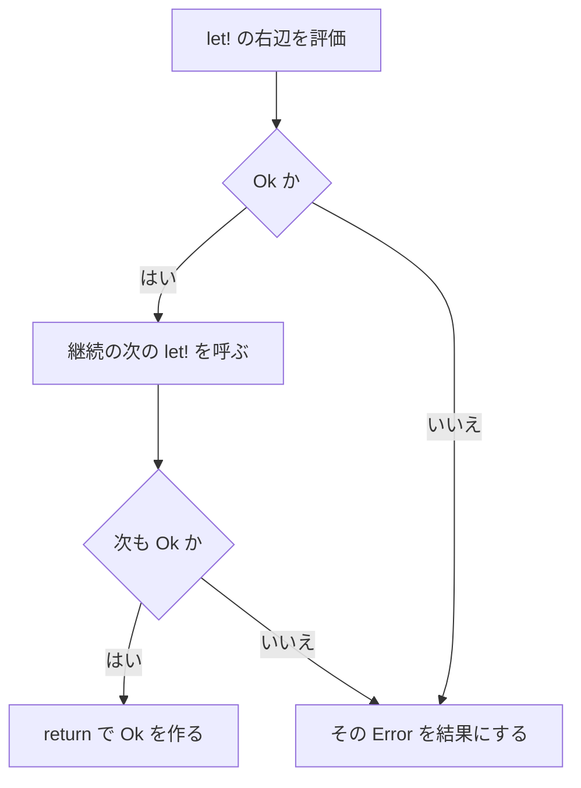

# Result

`Result<'a, 'e>` は、成功値と失敗の理由を 1 つの型に入れます。解析エラー、検証失敗、部分的に失敗しうる並列処理のように、呼び出し側が回復できる失敗に使います。理由が要らない欠測は [Maybe](maybe.md) です。

トラップとは別物です。ゼロ除算、範囲外アクセス、`assert` の失敗は `Error` にはならず、`try` でも捕捉できません。`try ... with` が扱うのは、`@checked` が送出するオーバーフローだけです。

## この記事のポイント

- 型は `Result<'a, 'e>`、ケースは `Ok of 'a` と `Error of 'e` です。
- `Result { let! ... return ... }` は、最初の `Error` で後続を呼びません。
- `and!` は右辺も評価してから結合し、両方 `Error` なら左を残します。
- `try ... with` は `Result` を作る別の式で、ビルダーの `let!` ではありません。
- `Task.parallel_results` は、`Result` を返すタスク配列の最も小さい失敗インデックスを採用します。

## 基本の書き方

```text
Result<'a, 'e> = Ok of 'a | Error of 'e
Ok 42
Error "missing"
```

標準ライブラリの共用体です。インポートは要りません。`Ok` と `Error` は無修飾でも書けますが、自モジュールに同名のケースがあるとそちらが優先されます。標準の方は `Result.Ok` や `std::Result.Error` です。

```tsuzuri run=42
let answer: Result<i64, string> = Ok 42
match answer with
| Ok value -> value
| Error _ -> 0
```

実行結果:

```text
42
```

成功の型と失敗の型は独立です。式の中で混ぜることはできません。`Error` だけを書くと成功側の型が決まらず、`E1015` になることがあります。`let failed: Result<i64, string> = Error "missing"` のように注釈します。

## エラー伝播

`Result { ... }` は `std/Result.tc` のビルダーです。`let!` は `Ok` の中身を束縛し、`Error` なら継続を呼びません。`return` は早期 return ではなく、`Ok` を作る構文です。エラー型はブロック全体で同じです。

```tsuzuri run=42
let answer: Result<i64, string> = Result {
    let! first = Ok 20
    let! second = Ok 22
    return first + second
}
match answer with
| Ok value -> value
| Error _ -> -1
```

実行結果:

```text
42
```



短絡されるのは、失敗が分かったあとの継続です。それより前の式や、すでに評価した引数は取り消されません。言語トラップが自動で `Error` になることもありません。

```tsuzuri run=4
def boom :: i64 -> Result<i64, string> = \_ -> unreachable ()

let failed: Result<i64, string> = Error "stop"
let answer = Result {
    let! _skipped = failed
    let! value = boom 1
    return value
}
match answer with
| Ok _ -> 0
| Error message -> message.length
```

実行結果:

```text
4
```

`boom` は呼ばれません。先に束縛した `failed` は評価済みなので、その長さ 4 が結果です。

## and!

`and!` は直前の `let!` に続けて、複数の `Result` を同じグループにします。スレッドは起動しません。右辺は左から右へすべて評価され、そのあと `MergeSources` で結合されます。左が `Error` でも右辺の式自体は実行されるので、右辺がトラップすればプログラムはトラップします。

グループがちょうど 2 つで、末尾が `return` だけのときは `Bind2` に展開されます。それ以外は `MergeSources` です。両方 `Error` なら左が残ります。

```tsuzuri run=4
let answer: Result<i64, string> = Result {
    let! left = Error "left"
    and! right = Error "right"
    return left + right
}
match answer with
| Ok _ -> 0
| Error message -> message.length
```

実行結果:

```text
4
```

成功が 2 つなら、中身を両方束縛して `return` へ進みます。

```tsuzuri run=42
let answer: Result<i64, string> = Result {
    let! left = Ok 20
    and! right = Ok 22
    return left + right
}
match answer with
| Ok value -> value
| Error _ -> 0
```

実行結果:

```text
42
```

同じグループの右辺から、そのグループの別の束縛を参照することはできません。名前の重複は `E1001` です。`use!` を `and!` の先頭に置くこともできません。

## 公開 API

引数の順序に注意してください。`map`、`map_ref`、`map_error` は関数が先、`bind`、`bind_ref`、`or_else` は値が先です。失敗のときは成功用の関数を呼び出しません。

### 調査と取り出し

| 関数 | シグネチャ | 動き |
| --- | --- | --- |
| `Result.is_ok` | `&(Result<'a, 'e>) -> bool` | 共有借用して `Ok` かを返す |
| `Result.is_error` | `&(Result<'a, 'e>) -> bool` | `Ok` でなければ `true` |
| `Result.get` | `Result<'a, 'e> -> 'a` | 所有値を消費して成功値を取る。`Error` ならトラップ |
| `Result.get_error` | `Result<'a, 'e> -> 'e` | 所有値を消費して失敗値を取る。`Ok` ならトラップ |
| `Result.default_value` | `'a -> Result<'a, 'e> -> 'a` | 成功値、または評価済みの既定値 |
| `Result.default_with` | `(unit -> 'a) -> Result<'a, 'e> -> 'a` | 失敗のときだけ `fallback ()` を呼ぶ |

`get` と `get_error` の失敗は `unreachable ()` によるトラップです。例外ではないので、`try` では回復できません。入力が信頼できないときは `match` か `default_with` を使います。

### 変換と連結

| 関数 | シグネチャ | 動き |
| --- | --- | --- |
| `Result.map` | `('a -> 'b) -> Result<'a, 'e> -> Result<'b, 'e>` | 成功値を消費して変換する |
| `Result.map_ref` | `Copy<'e> => (&'a -> 'b) -> &(Result<'a, 'e>) -> Result<'b, 'e>` | 成功値を借用し、失敗値は複製する |
| `Result.map_error` | `('e -> 'f) -> Result<'a, 'e> -> Result<'a, 'f>` | 失敗値だけを変換する |
| `Result.bind` | `Result<'a, 'e> -> ('a -> Result<'b, 'e>) -> Result<'b, 'e>` | 成功値を次の `Result` へ渡す |
| `Result.bind_ref` | `Copy<'e> => &(Result<'a, 'e>) -> (&'a -> Result<'b, 'e>) -> Result<'b, 'e>` | 借用した成功値から次の `Result` を作る |
| `Result.or_else` | `Result<'a, 'e> -> (unit -> Result<'a, 'e>) -> Result<'a, 'e>` | 失敗のときだけ代替を呼ぶ |

`map_ref` と `bind_ref` が `Copy<'e>` を要求するのは、失敗値を結果へ複製するためです。成功側の Copy は不要です。`string` のエラーに使うと `E1005` になります。

```tsuzuri run=5
let value: Result<string, i64> = Ok "order"
Result.get (Result.map_ref (\text -> text.length) (ref value))
```

実行結果:

```text
5
```

```tsuzuri run=3
let value: Result<i64, i64> = Result.map_error (\text -> text.length) (Error "bad")
match value with
| Ok _ -> 0
| Error length -> length
```

実行結果:

```text
3
```

### Maybe との変換

| 関数 | シグネチャ | 動き |
| --- | --- | --- |
| `Result.to_maybe` | `Result<'a, 'e> -> Maybe<'a>` | `Ok` を `Some`、`Error` は捨てて `None` へ |
| `Result.of_maybe` | `'e -> Maybe<'a> -> Result<'a, 'e>` | `Some` を `Ok`、`None` を指定した `Error` へ |

`Maybe.to_result` と `Maybe.of_result` も同じ変換です。エラー引数は成功時でも評価されます。暗黙の変換はありません。

```tsuzuri run=7
let missing: Maybe<i64> = None
match Result.of_maybe "missing" missing with
| Ok _ -> 0
| Error message -> message.length
```

実行結果:

```text
7
```

### ビルダー操作

コンピュテーション式の展開先も、通常の関数として公開されています。`Zero` の呼び出しは `Result.Zero()` と、括弧を名前に続けます。

| 関数 | シグネチャ | 展開での役割 |
| --- | --- | --- |
| `Result.Return` | `'a -> Result<'a, 'e>` | `return` |
| `Result.ReturnFrom` | `Result<'a, 'e> -> Result<'a, 'e>` | `return!` |
| `Result.Bind` | `Result<'a, 'e> -> ('a -> Result<'b, 'e>) -> Result<'b, 'e>` | `let!` と `do!` |
| `Result.BindReturn` | `Result<'a, 'e> -> ('a -> 'b) -> Result<'b, 'e>` | `let!` の直後が `return` だけのとき |
| `Result.Bind2` | `Result<'a, 'e> -> Result<'b, 'e> -> ('a -> 'b -> 'c) -> Result<'c, 'e>` | 2 つの `and!` と末尾の `return` |
| `Result.MergeSources` | `Result<'a, 'e> -> Result<'b, 'e> -> Result<('a * 'b), 'e>` | それ以外の `and!`。左の `Error` を優先 |
| `Result.Zero` | `Result<unit, 'e>` | 空の本体。値は `Ok ()` |
| `Result.Delay` | `(unit -> Result<'a, 'e>) -> (unit -> Result<'a, 'e>)` | 後続を遅延する |
| `Result.Run` | `(unit -> Result<'a, 'e>) -> Result<'a, 'e>` | 遅延した本体を実行する |
| `Result.Combine` | `Result<unit, 'e> -> (unit -> Result<'a, 'e>) -> Result<'a, 'e>` | 文の連結。`Error` なら後続を呼ばない |
| `Result.For` | `Copy<'a> => ['a] -> ('a -> Result<unit, 'e>) -> Result<unit, 'e>` | `for`。要素は Copy な配列だけ |
| `Result.While` | `(unit -> bool) -> (unit -> Result<unit, 'e>) -> Result<unit, 'e>` | `while` |

`For` と `While` の本体はクロージャです。外側の `let mut` へ代入すると `E1014` になります。展開の全体は [コンピュテーション式](../computation-expressions/computation-expressions.md) を参照してください。

## Err と try ... with

`try 本体 with | パターン -> ハンドラー` は、ビルダーへ展開される構文ではありません。`Result` を直接作る式です。本体が完了すればその値の `Ok`、例外を捕捉すればハンドラーの値の `Error` になります。

ハンドラーが返す型は、組み込み型クラス `Err` を実装します。メソッドは `msg :: ref 'a -> string` です。標準の `Exception` が `instance Err<Exception>` を持っています。

```tsuzuri run=42
def add :: i32 -> i32 -> Result<i32, 'e> = \x y ->
    try
        @checked x + y
    with
    | e is OverflowException -> e

match add 20 22 with
| Ok value -> value as i64
| Error _ -> 0
```

実行結果:

```text
42
```

戻り値の `'e` が他の場所に現れず、本体が `try` なら、`'e` は捕捉した `Exception` になります。シグネチャに `@'e : Err` と書く必要はありません。オーバーフローはビットを折り返さず、メッセージ付きの `Error` になります。

```tsuzuri run=Arithmetic%20operation%20resulted%20in%20an%20overflow.
def mul :: i32 -> i32 -> Result<i32, 'e> = \x y ->
    try
        @checked x * y
    with
    | e is OverflowException -> e

match mul 65536 65536 with
| Result.Ok value -> to_string (value as i64)
| Result.Error error -> Err.msg (ref error)
```

実行結果:

```text
Arithmetic operation resulted in an overflow.
```

現在捕捉できる例外は `OverflowException` だけです。送出は同じ関数の中の字句的な `try` に限られ、関数境界を越えて巻き戻しません。`finally`、捕捉の範囲、未捕捉時のトラップは [try 式](../exception-handling/try-with-finally.md) を参照してください。

> [!WARNING]
> `Result` ブロックの中に書いた整数演算が、自動で `Error` になることはありません。オーバーフローを失敗値にしたい演算には、その式を `@checked` し、`try` で包みます。

## Task.parallel_results

`Task.parallel_results` は、`Task<Result<'a, 'e>>` の配列を消費して実行し、`Task<Result<['a], 'e>>` を返します。すべてのタスクが `Ok` なら、入力と同じ順の配列を `Ok` で包みます。空配列は `Ok []` で、タスク本体は実行しません。

```tsuzuri run=42
let jobs: [Task<Result<i64, string>>] = [task { Result.Ok 20 }, task { Result.Ok 22 }]
match Task.run (Task.parallel_results jobs) with
| Result.Ok values -> values[0] + values[1]
| Result.Error _ -> -1
```

実行結果:

```text
42
```

いずれかが `Error` なら、入力配列で最も小さいインデックスの `Error` を返します。完了順では選びません。そのインデックスより後で、まだワーカーへ渡していないタスクは開始しません。開始済みのタスクは完了まで待ちます。

```tsuzuri run=1
let jobs: [Task<Result<i64, string>>] = [task { Result.Error "a" }, task { Result.Error "bb" }]
match Task.run (Task.parallel_results jobs) with
| Result.Ok _ -> 0
| Result.Error error -> error.length
```

実行結果:

```text
1
```

`"bb"` の長さではなく、先頭の `"a"` の長さです。採用されなかったペイロードと、開始しなかったタスクの捕捉値は解放されます。

この契約はネイティブで確認しています。言語仕様では、既定の WebAssembly は逐次実行で、最初のエラー以降を開始しません。ネイティブと、スレッドを有効にした WebAssembly でも、選ばれるエラーは同じ最小インデックスです。トラップやメモリ不足は `Error` にならず、プロセスが失敗します。タスクそのものの説明は [Task 式](../async-tasks-and-lazy/task.md) を参照してください。

`and!` はこの関数の代わりにはなりません。`and!` は 1 本の流れで右辺を順に評価するだけです。

## 所有権

所有版は `Result` を消費します。`Ok` なら成功値を、`Error` なら失敗値をムーブします。借用版はコンテナを共有借用し、失敗値を複製するため `Copy<'e>` が必要です。

`Result<ref i64, i64>` のように、成功値を共有借用にできます。排他借用はペイロードにできません。共用体なので、ホスト向けの `export def` に直接は出せません。`E1008` です。

## 他の言語との比較

| | Tsuzuri | Rust | F# |
| --- | --- | --- | --- |
| 失敗ケース | `Error` | `Err` | `Error` |
| 伝播 | `let!` と `Result { }` | `?` | `result { }` やコンピュテーション式 |
| 例外 | `@checked` のオーバーフローだけ | `panic` とは別 | 例外と `Result` が併存しうる |
| 並列の失敗 | 最小インデックスの `Error` | ライブラリによる | ライブラリによる |

## 注意点

- `get` は回復手段ではありません。失敗しうる入力は `match` で分けます。
- `and!` は並列実行ではなく、右辺の評価も省略しません。
- エラー型の暗黙変換はありません。`string` と独自のレコードを同じブロックで混ぜられません。
- `try` が捕捉するのは `OverflowException` だけです。範囲外アクセスなどはトラップのままです。
- `For` は要素が Copy な配列（`[T]`）だけを受け付けます。非 Copy な要素を含む配列では `E1005` になります。
- `Task.parallel_results` の要素は 1 回しか実行できません。同じタスクを配列に 2 回入れるとムーブエラーです。

## まとめ

- `Result<'a, 'e>` は `Ok` か `Error` です。回復できる失敗を型で返します。
- コンピュテーション式は最初の `Error` で継続を止め、`and!` は左の `Error` を優先します。
- 借用版の変換は失敗型の Copy が必要です。`Maybe` との変換は明示的な関数です。
- `try ... with` はオーバーフローを `Err` な値の `Error` にします。トラップは対象外です。
- `Task.parallel_results` は、最も小さいインデックスの `Error` を決定的に返します。

## 関連項目

- [Maybe](maybe.md)
- [Union](union.md)
- [try 式](../exception-handling/try-with-finally.md)
- [例外処理](../exception-handling/exception-handling.md)
- [コンピュテーション式](../computation-expressions/computation-expressions.md)
- [Task 式](../async-tasks-and-lazy/task.md)
- [所有権とムーブ](../ownership-and-memory/ownership.md)
- [言語仕様の Maybe と Result](../../../docs/language.md#maybe-と-result)
- [言語仕様の検査付き算術と例外](../../../docs/language.md#検査付き算術と例外)
- [言語仕様の並列区間と寿命](../../../docs/language.md#並列区間と寿命)
- [言語リファレンスの目次](../index.md)

