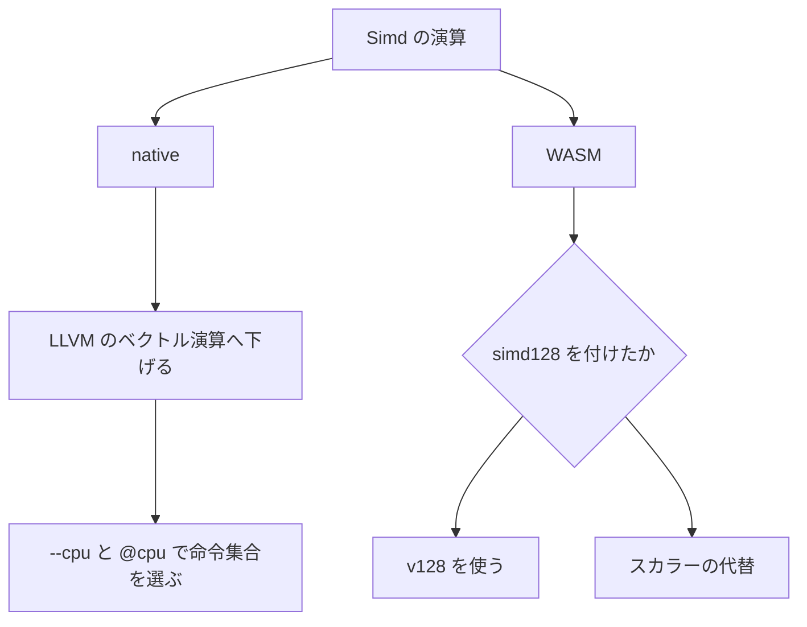

# Simd

`Simd` は、レーンを明示した数値ベクトルのモジュールです。コンパイラがループを自動でベクトル化する機能とは別です。型を使っただけで、すべてのターゲットで 1 命令になることや、速くなることは保証しません。

128 bit と 256 bit のベクトル、それにレーンごとの真偽値を持つマスクがあります。演算の意味は幅が違っても同じです。違いはレーン数と、ターゲットごとの命令展開（LLVM lowering）だけです。

## この記事のポイント

- ベクトル型は Copy です。解放は要りません。C の公開 ABI には出せません。
- `Simd.load` と `Simd.store` は、読む前・書く前に全レーンが範囲内かを見ます。外れていたら要素は変えずにトラップします。
- 比較は `bool` ではなくマスクです。`==` でベクトル全体を 1 つの真偽値にはできません。
- WASM は既定ではスカラーです。`--wasm-feature simd128` を付けたときだけ `v128` を使います。

## 4 レーンをまとめて足す

```tsuzuri run=14
let source = [1i32, 2i32, 3i32, 4i32]
let values: i32x4 = Simd.load (ref source) 0
let shifted = values + Simd.splat 1i32
let increased = Simd.gt shifted values
assert (Simd.all increased)
Simd.sum_lanes shifted as i64
```

実行結果:

```text
14
```

`Simd.load` は、4 つの `i32` が添字 0 からすべて配列の中にあることを確認してから読みます。境界が 16 byte に揃っていなくても安全に読み込めます（unaligned load に対応）。結果の型は注釈で決めます。スカラーを、文脈なしにベクトルへ広げることはありません。

`shifted` は `2, 3, 4, 5` です。`Simd.sum_lanes` はレーン 0 から順に足すので、`((2 + 3) + 4) + 5` で 14 です。`+0` から始めるのではありません。浮動小数点でも、この順序をベクトル幅に合わせて組み替えません。暗黙の FMA も `fast-math` も使いません。

## 型

| レーン | 128 bit | 256 bit | マスク |
| --- | --- | --- | --- |
| 8 bit | `i8x16`、`i8ux16` | `i8x32`、`i8ux32` | `mask8x16` / `mask8x32` |
| 16 bit | `i16x8`、`i16ux8` | `i16x16`、`i16ux16` | `mask16x8` / `mask16x16` |
| 32 bit | `i32x4`、`i32ux4`、`f32x4` | `i32x8`、`i32ux8`、`f32x8` | `mask32x4` / `mask32x8` |
| 64 bit | `i64x2`、`i64ux2`、`f64x2` | `i64x4`、`i64ux4`、`f64x4` | `mask64x2` / `mask64x4` |

どの型も Copy、Send、Capture です。レコード、共用体、タプル、配列、リスト、クロージャに入れられます。メモリ上のサイズは 128 bit 型が 16 byte、256 bit 型が 32 byte です。マスクの LLVM IR 上の幅は、レーン数分のビット列です。

256 bit の値を置く領域は、16 byte 境界までしか揃えません。生成されるコードも、それ以上の強いアライメントを前提としません。

512 bit の型、gather / scatter、整数のベクトル除算はありません。

## 関数の一覧

結果のベクトル型は、呼び出し位置で注釈するか、すでに決まった値と演算して決めてください。`Simd.splat 1i32` だけでは、4 レーンなのか 8 レーンなのかが決まりません。

| 関数 | 引数と結果 | 失敗 |
| --- | --- | --- |
| `Simd.splat` | スカラー 1 つ。全レーンをその値にする | 型が決まらなければコンパイルエラー |
| `Simd.of_lanes2` から `of_lanes32` | レーン値を順に渡す。個数と型が一致すること | 不一致はコンパイルエラー |
| `Simd.extract` | ベクトルと `i64` の位置。スカラーを返す | 負や範囲外はトラップ |
| `Simd.replace` | ベクトル、位置、スカラー。新しいベクトルを返す | 範囲外はトラップ。元の値は残る |
| `Simd.load` | `ref [T]` と開始位置。数値ベクトルを返す | 全レーンが範囲内でなければトラップ。読まない |
| `Simd.store` | `ref mut [T..]`、位置、数値ベクトル。結果は `unit` | 範囲外なら何も書かずにトラップ |
| `Simd.eq` / `ne` / `lt` / `le` / `gt` / `ge` | 数値ベクトル 2 つから、同じ形のマスク | 失敗しない |
| `Simd.select` | マスク、真のベクトル、偽のベクトル | 引数は両方評価する。遅延しない |
| `Simd.all` / `Simd.any` | マスクから `bool` | 失敗しない |
| `Simd.sum_lanes` | 数値ベクトルから、レーン型のスカラー | 失敗しない。順序はレーン 0 から |

`load` と `store`、比較、`sum_lanes` は `SimdNumeric` です。マスクを受け取らないので、マスクの配列をロードする API はありません。`all` と `any` は `SimdMask`、それ以外の構築は `SimdVector` です。

レーン型やマスク型が結果に出る関数は、呼び出し位置で具象のベクトル型が決まっている必要があります。型変数のまま残すラッパーは作れません。

```tsuzuri run=30
let packed: i32x4 = Simd.of_lanes4 10i32 20i32 30i32 40i32
let replaced = Simd.replace packed 0 9i32
assert (Simd.extract replaced 0 == 9i32)
Simd.extract packed 2
```

実行結果:

```text
30
```

## スライスへ書き戻す

`Simd.store` が受け取るのは排他スライス `ref mut [T..]` です。共有の `ref [T]` は受け取れません。

```tsuzuri run=111
let mut values = [1i32, 2i32, 3i32, 4i32, 5i32, 6i32, 7i32, 8i32, 9i32]
let lanes: i32x8 = Simd.load (ref values) 1
Simd.store (ref mut values[1..]) 0 (lanes * Simd.splat 10i32)
values[0] + values[1] + values[8]
```

実行結果:

```text
111
```

添字 1 から 8 個を 10 倍して、同じ場所へ戻しています。先頭の `1` と末尾の `9` はそのままなので、和は `1 + 20 + 9` で 111 です。範囲外の `store` は、どの要素も書き換えずにトラップします。

## 演算子

数値ベクトルは `+`、`-`、`*` が使えます。浮動小数点ベクトルは `/` も使えます。符号付き整数と浮動小数点は単項 `-` が使えます。整数ベクトルとマスクは `&&&`、`|||`、`^^^`、`~~~` とシフトが使えます。

整数レーンの加減乗算は、溢れるとレーンごとに折り返します。シフト量は、そのレーンのビット幅から 1 を引いたマスクで切ります。整数の `/` と `%`、スカラーとベクトルの混在演算はありません。`values + 1` ではなく、`values + Simd.splat 1i32` と書きます。

比較の NaN は、等価と大小が `false`、`ne` が `true` です。`+0` と `-0` は等しいです。スカラーの比較と同じ規則です。`Eq` や `Ord` のインスタンスはないので、ベクトルを `==` で `bool` にはできません。

`Simd.select` は普通の関数です。条件が偽の側も評価します。重い式を避けたいときは、先にスカラーの `if` で分けてください。

## ターゲットで何が命令になるか



コンパイラは、算術をスカラーのループとして書き下すのではなく、LLVM のベクトル演算へ下げます。`src/llvm_simd.rs` が `add` や `fadd`、`insertelement` を出します。それが CPU の 1 命令になるかは、`--cpu` とターゲット次第です。AVX2 のない x86 や AArch64 では、256 bit を 2 つの 128 bit 演算に分けます。

実行時に命令集合を選ぶには、関数へ `@cpu ["avx2"]` のように付けます。名前は `"sse4.2"`、`"avx2"`、`"avx512"`（x86-64。Windows を除く）、`"sve"`、`"sve2"`（AArch64 Linux）です。ビルド先で使えない名前は無視します。未知の名前、重複、空の並びは `E0002` です。

`@cpu` の版は同じ型付き IR から作るので、折り返し、NaN、符号付きゼロ、トラップは変わりません。256 bit ベクトルを引数や結果に持つ関数は、この多版化の対象外で `E1005` です。WASM、`--emit llvm`、`--freestanding`、対応する命令のないビルド先では、移植版だけを作ります。

`--cpu native` は、ビルドしたマシンの CPU に合わせて成果物全体をコンパイルする別の選択です。実行時の切り替えではありません。

WASM は既定でスカラーの代替です。`tsuzuri build --target wasm32 --emit wasm --wasm-feature simd128` を付けると、`v128` を使う成果物になります。256 bit 型は 2 つの `v128` です。`tests/simd.mjs` は、フラグがある逆アセンブルにベクトル命令が出ること、ないときには出ないことを見ています。未対応のエンジンでオプトインした成果物を実行すると検証に失敗し、既定の経路へ自動では戻りません。`relaxed-simd` はありません。

言語レベルで保証されるのは、生成される命令セットとセマンティクスの同一性です。実際の実行速度はメモリアクセスパターンや最適化条件に依存するため、[性能測定](../../../docs/benchmarks.md) で条件を揃えて実測して判断してください。

## 注意点

- ベクトルは Copy なので、大きな配列の要素として渡すとレーンごとではなく値全体が複製されます。
- `load` の第 1 引数は共有の配列、`store` の第 1 引数は排他スライスです。混ぜると型エラーです。
- マスクを `if` の条件には使えません。`Simd.all` か `Simd.any` で `bool` にしてから使います。
- [`Parallel`](parallel.md) は配列をスレッドへ分けます。`Simd` は 1 つの値の中のレーンを分けます。役割が違います。

## まとめ

- レーン数と型を名前に含むベクトルを、明示して使います。
- 範囲外の `extract`、`replace`、`load`、`store` はトラップします。`store` は要素を書き換える前にトラップします。
- 比較はマスク、総和はレーン 0 からの固定順です。
- ネイティブは LLVM のベクトル演算、WASM の `v128` は `simd128` のオプトインです。
- ベクトル型を導入しても自動で高速化されるわけではないため、実際の速度向上はベンチマークで測定して判断します。

## 関連項目

- [Parallel](parallel.md)
- [Math](math.md)
- [Matrix](matrix.md) — `Matrix.mul` はこのモジュールを使わず、オプティマイザの自動ベクトル化に任せています（arm64 の native と、simd128 の WASM で確認）
- [属性](../values-and-functions/attributes.md)
- [コンパイラ オプション](../compiler/option.md)
- [WebAssembly への出力](../compiler/webassembly.md)
- [言語仕様の SIMD 値型](../../../docs/language.md#simd-値型)
- [言語仕様の CPU ごとの関数の版](../../../docs/language.md#cpu-ごとの関数の版cpu)
- [性能測定](../../../docs/benchmarks.md)
- [言語リファレンスの目次](../index.md)
