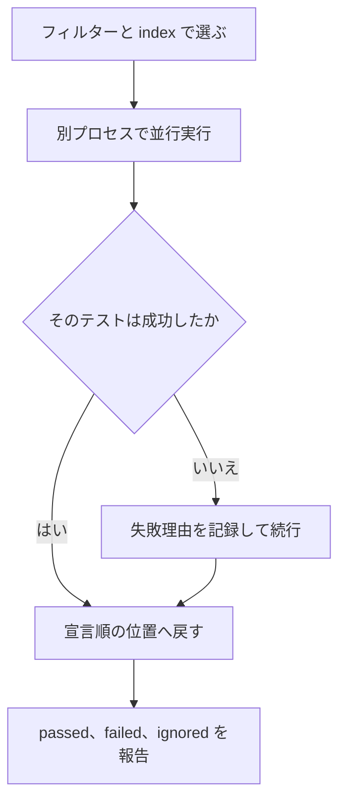

# Test

`Test` は、ソースに書いた `test` 宣言から使う、小さな確認関数です。テストの実行は `tsuzuri test` が行い、各テストを別プロセスで隔離します。失敗は `assert` と同じトラップで、期待値と実際の値の差分は出ません。

## この記事のポイント

- `test "名前" = 本体` は、`unit` を返す宣言です。通常のビルド成果物には入りません。
- 実行は `tsuzuri test` です。既定はネイティブの `-O0` で、テストごとに別プロセスです。
- `Test.equal` と `Test.not_equal` は借用で比較します。`Test.is_true` は `bool` を受けます。
- `--filter` は `モジュール名.テスト名` の部分一致です。正規表現ではありません。
- 1 件でも失敗すると終了コードは 1 で、`E2006` が最初の失敗を指します。

## テストを書く

```text
test "名前" = 本体式
```

本体は `unit` です。`.tz` と `.tc` の宣言部分に置きます。型クラス用の `.tt` や、コンパイラに埋め込まれた標準ライブラリには書けず、`E1018` です。`private`、`export`、`rec` は付けられません。`private test` は `E1022`、`export test` は `E0002` です。テストは関数の名前空間にも入りません。

同じモジュールの `private` な関数は、本体から呼べます。`Main.tz` は要りません。

```tsuzuri project=checks file=Checks.tz
private def add :: i64 -> i64 -> i64 = \left right -> left + right

test "adds integers" = assert (add 20 22 == 42)

test "在庫が足りる" =
    Test.is_true (5 >= 2)
```

名前は妥当な Unicode 文字列です。空文字や、同じモジュール内の重複も許可されます。識別はモジュール名と、宣言順の 0 始まりの index です。フィルターを使うなら、名前は重複させない方が探しやすくなります。

`tsuzuri check` と `tsuzuri build` も、テスト本体を型検査します。テスト本体、テスト専用のラムダ、テストのためだけに特殊化した関数は、通常の成果物には出ません。

## 関数

3 つとも、失敗すると `assert` と同じトラップです。メッセージを足す引数はありません。

| 関数 | シグネチャ | 説明 |
| --- | --- | --- |
| `Test.equal` | `Eq<'a> => ref 'a -> ref 'a -> unit` | 2 つの値が等しければ成功 |
| `Test.not_equal` | `Eq<'a> => ref 'a -> ref 'a -> unit` | 2 つの値が異なれば成功 |
| `Test.is_true` | `bool -> unit` | 条件が真なら成功 |

比較は借用で行われます。変数や文字列リテラルはそのまま渡すだけで自動的に借用されます。数値リテラルや計算式を直接渡す場合は、型推論を助けるために `ref` を明示して `Test.equal (ref 360) (ref (120 * 3))` のように記述します。

```tsuzuri
test "line total matches the price times quantity" =
    let price = 120
    let qty = 3
    let actual = price * qty
    let expected = 360
    Test.equal expected actual

test "names stay distinct" =
    Test.not_equal "tea" "coffee"

test "quoted totals match" =
    Test.equal (ref 360) (ref (120 * 3))

test "stock covers the order" =
    Test.is_true (5 >= 2)
```

`Result` を返す API は、`Test.is_true` で潰さず、`match` で `Ok` と `Error` を確認します。トラップと `Error` は別の失敗です。

## 実行する

```text
tsuzuri test ファイルまたはディレクトリ [オプション]
```

```sh
tsuzuri test .
tsuzuri test Checks.tz --filter "Checks.adds"
tsuzuri test . --list
tsuzuri test . --json
tsuzuri test . -O3
tsuzuri test . --index 1
```

ディレクトリを渡すと、そのプロジェクトのソースを読みます。`Main.tz` は必須ではありません。ファイルを渡すと、そのファイルの親をルートにします。

| オプション | 意味 |
| --- | --- |
| `--filter TEXT` | `モジュール名.テスト名` の部分一致。外れた件数は `ignored` |
| `--index N` | 宣言順の 0 始まり index だけを実行する。範囲外は `E2000` |
| `--list` | 型検査して一覧だけ出す。実行しない |
| `--json` | 結果を 1 行 1 JSON で標準出力へ出す。診断は標準エラー |
| `-O0` から `-O3` | 最適化。既定は `-O0` |
| `--target native\|wasm32\|wasm64` | 既定は `native`。WASM には Node.js が必要 |
| `--wasm-max-memory SIZE` | WASM の線形メモリ上限。既定 16 MiB |
| `--wasm-stack-size SIZE` | WASM のメインスタック。既定 1 MiB |

`--cpu`、`--emit`、`--output` は使えません。タイムアウトを変えるオプションもありません。1 テストの上限は 30 秒です。

フィルターは正規表現ではありません。`Checks.tz` の `adds integers` は、一覧では `Checks.adds integers` です。`--filter "Checks.adds"` はこの 1 件に一致し、ほかは `ignored` になります。一致が 0 件でも終了コードは 0 です。

サブディレクトリ `Geometry/Point.tz` は、パッケージの名前空間を書いていなければモジュール名 `Geometry::Point` です。一覧は `0 Geometry::Point.origin is zero`、フィルターは `Geometry::Point.origin` のように、`::` を含めた部分文字列で一致します。

`--list` の人が読む形式は、`index`、モジュール名、テスト名を空白でつなぎます。

```text
0 Checks.adds integers
1 Checks.在庫が足りる
```

`--index 1` は 2 件目だけを実行します。報告の番号は 1 始まりなので、`ok 2 - ...` と出ます。選ばれなかった件数は `ignored` です。

## 隔離と結果の並び

各テストは別プロセスです。並列度は、CPU コア数、32、選んだ件数の最小値です。あるテストがトラップしても、ほかのテストの収集は止まりません。報告はソースの宣言順に並べ直します。

トラップ、0 以外の終了、30 秒超過は失敗です。テストランナーは子プロセスの標準出力と標準エラーを捨てるため、`Debug.print` の行も、`trap:` の文も、失敗理由には入りません。

成功時の人が読む報告は、次の形です。

```text
ok 1 - Checks adds integers
ok 2 - Checks 在庫が足りる

2 passed; 0 failed; 0 ignored
```

失敗すると、その行だけ `not ok` になり、理由が続きます。シグナルで終了した `assert false` は、次のように報告されます。

```text
not ok 2 - Main stock is positive
  failure: trapped or terminated by signal
```

終了コードが 0 以外のときは `trapped or exited with code N` です。また、Unix 環境でスタック枯渇により終了したと推定される場合は `terminated by signal 11; the stack was probably exhausted by deep recursion`、30 秒を超過した場合は `timed out after 30000ms` と報告されます。



## JSON

`--json` では、標準出力にテストごとの 1 行と、最後の summary の 1 行が出ます。フィールドは次の順です。`duration_ms` は実行ごとの計測値です。

```text
{"type":"test","index":0,"module":"Checks","name":"adds integers","status":"passed","duration_ms":222}
{"type":"test","index":1,"module":"Checks","name":"在庫が足りる","status":"passed","duration_ms":219}
{"type":"summary","passed":2,"failed":0,"ignored":0,"duration_ms":307}
```

失敗した行には `failure` が足されます。

```text
{"type":"test","index":1,"module":"Main","name":"stock is positive","status":"failed","failure":"trapped or terminated by signal","duration_ms":269}
```

コンパイル診断と `E2006` は標準エラーの JSON です。標準出力の行を、診断と混ぜて 1 つの JSON 配列として解析しないでください。

`--list --json` は、実行せずにテスト名の位置を出します。フィールドは `index`、`module`、`name`、`path`、`range`、`type` です。`range` の行と列は 0 始まりの UTF-16 で、テスト名の文字列トークンを指します。この一覧のキーはアルファベット順に並びます。

## 終了コード

| 結果 | 終了コード | 診断 |
| --- | --- | --- |
| すべて成功 | 0 | なし |
| フィルターで 0 件 | 0 | なし。`ignored` に除外件数 |
| 1 件以上失敗 | 1 | 最初の失敗の名前に `E2006`。メッセージは `1 test failed` または `N tests failed` |
| 未知のオプションなど、コマンドラインの誤り | 2 | `E2000` |
| `--index` が範囲外 | 1 | `E2000` |
| wasm64 で memory64 が無い Node.js | 1 | `E2002` |

WASM のテストモジュールが要求するインポートは空です。wasm64 は memory64 に対応した Node.js 24 以降が必要です。ネイティブのテストに `--wasm-max-memory` を付けると `E2000` です。

## 注意点

- 失敗理由に値の差分は出ません。何を見ているかはテスト名に書いてください。
- 30 秒を超えるテストは失敗です。上限を延ばすフラグはありません。
- 通常の `build` はテストを実行しません。CI で走らせるコマンドは `tsuzuri test` です。
- コンパイラ自身の Rust テストと、利用者プログラムの `test` 宣言は別です。

## まとめ

- `test "名前" = 本体` は `unit` の宣言で、`tsuzuri test` が別プロセスで実行します。
- 比較は `Test.equal`、`Test.not_equal`、条件は `Test.is_true` です。失敗はトラップです。
- `--filter` は `モジュール名.テスト名` の部分一致で、外れた件数は `ignored` です。
- `--json` は標準出力に 1 行 1 オブジェクト、診断は標準エラーです。
- 失敗が 1 件でもあれば終了コードは 1 で、`E2006` が最初の失敗を指します。

## 関連項目

- [assert 式](../exception-handling/assert.md)
- [例外処理](../exception-handling/exception-handling.md)
- [コンパイラの使い方](../compiler/usage.md)
- [コンパイラ オプション](../compiler/option.md)
- [診断メッセージとエラーコード](../compiler/diagnostics.md)
- [WebAssembly への出力](../compiler/webassembly.md)
- [言語仕様: 言語内テスト](../../../docs/language.md#言語内テスト)
- [言語リファレンスの目次](../index.md)
