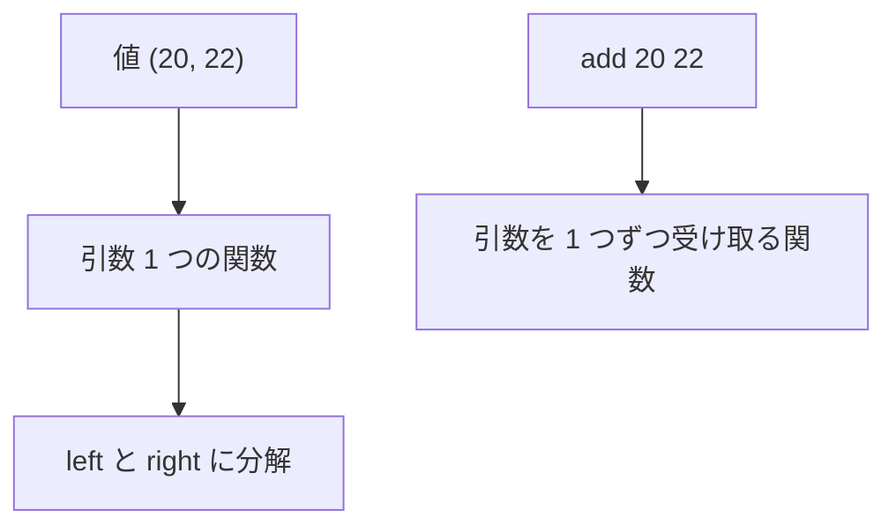

# Tuple

タプルは、複数の値を順序だけで組にした不変の値です。要素の型は異なっていても同一でもかまいません。関数から複数の結果を返したい場合や、共用体のペイロードとして複数の値を 1 つにまとめたい場合に使います。各要素に名前を付けて区別したい場合は、[Record](record.md) の方が適しています。

型は `i64 * string`、値は `(1, "a")` のように記述します。要素をインデックス番号で指定して直接読む記法（`pair.0` など）はなく、要素の取り出しにはパターンマッチを用います。

## この記事のポイント

- 2 要素以上を `*` で並べた型です。1 要素のタプル型はありません。
- `(42)` は括弧であり、タプルではありません。`()` は [Unit 型](../types-and-type-inference/unit-type.md) です。
- 要素の取り出しは `match` か、ラムダ式の引数パターンです。`fst` のような関数はありません。
- `\(left, right) -> ...` はタプル 1 引数であり、カリー化された 2 引数関数ではありません。
- 全要素が Copy ならタプルも Copy です。比較、表示、ハッシュ、既定値は要素が対応していれば自動です。

## 基本の書き方

```text
i64 * string
(42, "a")
i64 * string * bool
(1, "a", true)
```

要素式は左から右へ 1 回ずつ評価されます。型注釈の `*` の両側には型が必要で、`i64 *` のような 1 要素の型は構文エラー `E0002` です。

```tsuzuri run=42
def first :: i64 * string -> i64 = \pair ->
    match pair with
    | (number, _) -> number

first (42, "a")
```

実行結果:

```text
42
```

`pair.0` はフィールドアクセスとして解析されず、構文エラー `E0002` になります。タプルに名前付きの要素はありません。

## 要素の取り出し

`let` は識別子だけを束縛します。`let (left, right) = pair` は書けません。分解は `match` で行います。

```tsuzuri run=42
def split :: i64 -> i64 * i64 = \count -> (count, count + 2)

match split 20 with
| (low, high) -> low + high
```

実行結果:

```text
42
```

これが関数の多値返却です。戻り値の型を `i64 * i64` にし、呼び出し側でタプルを分解します。要素の型は違っていてかまいません。3 要素以上も同じです。

```tsuzuri run=6
let measurement = (1, 2, 3)
match measurement with
| (left, middle, right) -> left + middle + right
```

実行結果:

```text
6
```

ネストしたタプルは、パターンもネストします。`((left, middle), right)` のように、外側と内側を対応させます。

非 Copy の要素だけをパターンで受け取ると、その要素はムーブされます。Copy の要素は複製されます。配列やリストの要素から非 Copy のタプルを勝手にムーブすることはできません。規則は [match 式](../pattern-matching/match.md) と同じです。

## ラムダ引数はカリー化されない

`\left right -> left + right` は、引数を 1 つずつ受け取るカリー化された関数です。型は `i64 -> i64 -> i64` のように矢印が続きます。

`\(left, right) -> left + right` は違います。括弧の中はタプルのパターンで、引数は 1 つです。型は `i64 * i64 -> i64` です。

```tsuzuri run=42
let add_pair: i64 * i64 -> i64 = \(left, right) -> left + right
let add: i64 -> i64 -> i64 = \left right -> left + right
add_pair (20, 22) + add 0 0
```

実行結果:

```text
42
```



タプル用の関数に `add_pair 20 22` と 2 つ渡すと、`E1006` になります。引数を 1 つしか受けないためです。逆に、カリー化された関数へタプルを 1 つ渡しても、2 つの引数には分解されません。

`\() -> 42` は unit を受け取る 0 引数の関数であり、空のタプルを受け取る関数ではありません。呼び出しは `thunk ()` です。

## Copy と比較と表示

タプルが Copy になるのは、すべての要素が Copy のときです。`i64 * i64` はコピーしたあとも両方を使えます。`i64 * string` は文字列を含むので非 Copy で、代入はムーブです。ムーブしたあとに元を使うと `E1012` になります。

共有借用（`ref T`）は Copy なので、要素に共有借用を持つタプルもコピーして複数の場所から参照先を読み出せます。

一方、排他借用（`ref mut T`）は Copy ではありません。ローカル変数のスコープ内であれば、複数の排他借用を一時的にタプルへまとめて扱うことができますが、所有者の生存期間を超えて関数の外へ返すことはできません（`E1013`）。また、レコードのフィールド定義においてタプルの内側に排他借用を配置することも禁止されています（`E1013`）。詳細は [ライフタイムと region](../ownership-and-memory/lifetimes.md) を参照してください。

`Eq`、`Ord`、`Display`、`Hash` は、要素がそれぞれのクラスを持っていればタプルにも自動で付きます。`deriving` は要りません。`Default` も、要素に既定値があればタプルの既定値になります。レコードや共用体は自動では付かないので、ここが違います。

```tsuzuri run=%2820%2C%20%22order%22%29
let pair = (20, "order")
Display.display (ref pair)
```

実行結果:

```text
(20, "order")
```

比較は左の要素から行い、最初の不一致で止まります。`Ord` も同じ辞書式順序です。

```tsuzuri run=42
let left = (20, 22)
let right = (20, 22)
assert (left == right)
assert ((1, 9) < (2, 0))
assert (Hash.hash (ref left) == Hash.hash (ref right))
let fallback: i64 * bool = Default.default()
match fallback with
| (number, flag) -> number + (if flag then 1 else 0) + 42
```

実行結果:

```text
42
```

`Default.default()` の `i64 * bool` は `(0, false)` です。表示では文字列が引用符付きになり、unit は `()` になります。`Display.display (ref (1, ()))` は `(1, ())` です。

等しいハッシュは等しい値を保証しません。ハッシュのバイト列は [言語仕様の自動導出](../../../docs/language.md#自動導出deriving) のタプルの行と同じ契約です。

## unit との関係

`()` は unit であり、0 要素のタプルではありません。`(42)` は `42` を括弧で包んだだけで、型は `i64` のままです。タプル型として書けるのは 2 要素以上です。

```tsuzuri run=42
let grouped = (42)
let unit_value: unit = ()
if grouped == 42 && unit_value == () then 42 else 0
```

実行結果:

```text
42
```

関数が意味のある結果を返さないときは、タプルではなく unit を返します。複数の結果があるときだけタプルにします。unit の値や空ブロックは [Unit 型](../types-and-type-inference/unit-type.md) を参照してください。

コンピュテーション式の `and!` は、複数の成功値を内部でタプルにまとめてから継続へ渡します。利用者がタプルを直接書く必要はありません。詳細は [Result](result.md) および [Maybe](maybe.md) を参照してください。

## 他の言語との比較

| | Tsuzuri | F# | Rust |
| --- | --- | --- | --- |
| 型 | `i64 * string` | `int * string` | `(i64, String)` |
| 値 | `(1, "a")` | `(1, "a")` | `(1, "a")` |
| 取り出し | パターン | パターン、`fst` / `snd` | パターン、`.0` |
| 多引数関数 | カリー化が既定 | カリー化が既定 | 引数リストが既定 |

`\(a, b) ->` を Rust の `|a, b|` と同じだと思わないでください。Tsuzuri では括弧がタプル 1 引数を意味します。

## 注意点

- 要素番号によるアクセス（`pair.0`）はありません。名前で区別したくなったらレコードを使います。
- `let` では分解できません。`match` かラムダ式のパターンを使います。
- 非 Copy の要素を含むタプルを複製することはできず、元の束縛変数はムーブされます。
- ローカルなスコープ内で排他借用をタプルにまとめることはできますが、所有者より長く関数の外へ返すことはできません（`E1013`）。
- 1 要素をタプルにしたつもりでも、`(value)` は単なるグループ化の括弧です。

## まとめ

- タプル型は `i64 * string`、値は `(1, "a")` です。2 要素以上だけがタプルです。
- 取り出しはパターンだけです。関数の多値返却は、タプルを返して呼び出し側で分解します。
- `\(a, b) ->` はカリー化されません。2 引数関数は `\a b ->` と書きます。
- Copy、比較、表示、ハッシュ、既定値は要素に従います。レコードと違い、`deriving` は不要です。
- `()` は unit、`(42)` は `42` です。

## 関連項目

- [Record](record.md)
- [Union](union.md)
- [Unit 型](../types-and-type-inference/unit-type.md)
- [関数](../values-and-functions/functions.md)
- [ラムダ式](../values-and-functions/lambda-expressions.md)
- [match 式](../pattern-matching/match.md)
- [所有権とムーブ](../ownership-and-memory/ownership.md)
- [型クラス](../types-and-type-inference/type-classes.md)
- [言語仕様の match と分解](../../../docs/language.md#match-と分解)
- [言語リファレンスの目次](../index.md)

