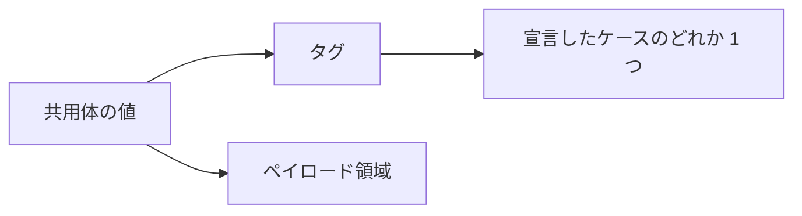
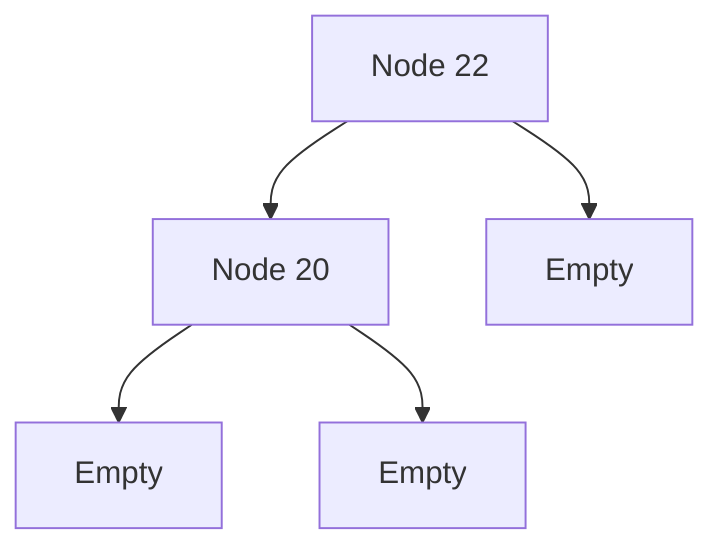

# Union

共用体（`union`）は、あらかじめ列挙した形のうち 1 つだけを持つ値です。計測の欠測、図形の種類、木の節のように、「どれか」を型で表したいときに使います。`match` が網羅性を検査するので、ケースを足し忘れた処理はコンパイル時に見つかります。

## この記事のポイント

- 宣言は `union Shape = | Circle of f64 | Rect of f64 * f64 | Empty` です。
- ペイロードは 0 個か 1 個です。複数の値はタプル 1 つにまとめます。
- ペイロードなしのケースは値、ペイロードありのケースは 1 引数の関数としても使えます。
- 再帰的な共用体は自動でヒープに置かれ、解放はスタックを深さに比例させません。
- `match` で網羅的に分解します。足りないケースは `E1021` です。

## 基本の書き方

```text
union Name =
    | Case
    | Other of Type
    | Pair of Type * Type
```

先頭の `|` は省略できます。ケースは 1 行に並べても、インデントして並べても同じです。小文字で始まる名前はパターンマッチにおいてローカル束縛変数として解釈されるため、型名とケース名は必ず ASCII 英大文字で始めます。

```tsuzuri run=42
union Measurement =
    | Missing
    | Single of i64
    | Pair of i64 * i64

def total :: Measurement -> i64 = \measurement ->
    match measurement with
    | Missing -> 0
    | Single value -> value
    | Pair (left, right) -> left + right

total (Pair (20, 22))
```

実行結果:

```text
42
```

`Rect of f64 * f64` のペイロードは、2 つの `f64` ではなくタプル 1 つです。ペイロードの個数がパターンと合わないと `E1020` になります。レコード、配列、関数、別の共用体もペイロードにできます。

値はタグと、最大のペイロードが入る領域の組です。どのケースかはそのタグで決まります。



## ケースの構築と修飾

ペイロードのない `Missing` は、それだけで値です。`Single` は `Single 20` や `20 |> Single` のように適用します。`let wrap = Some` のように、関数値として渡すこともできます。

```tsuzuri run=42
let wrap = Some
Maybe.get (wrap 42)
```

実行結果:

```text
42
```

無修飾のケースは、自モジュールの宣言を先に見ます。同じ優先度で複数の候補があると `E1004` です。修飾は次の 3 つです。

- `Module.Case`
- 自モジュールの `Union.Case`
- `Module.Union.Case`

標準ライブラリはユーザー定義より後に検索されます。自前の `union Maybe` があると、無修飾の `Maybe.Some` は自前のケースです。標準の方は `std::Maybe.Some` と書きます。

```tsuzuri run=42
union Choice = Some of i64 | None

let local = Some 20
let standard = std::Maybe.Some 22
(match local with
| Some value -> value
| None -> 0) + Maybe.get standard
```

実行結果:

```text
42
```

モジュール名と同じ共用体は、ケースを `Shape.Rect` と書きます。`Shape.Shape.Rect` のようにモジュール名と型名を重ねて書くと `E1004` になります。一方、同一ファイル（自モジュール）内で `Shape.Shape.Rect` と書いた場合は、共用体 `Shape` 内のケース `Shape` を探そうとするため `E1002` になります。

```tsuzuri project=shape file=Shape.tz
union Shape = Circle of i64 | Rect of i64 * i64 | Empty

def width :: Shape -> i64 = \shape ->
    match shape with
    | Circle radius -> radius
    | Rect (horizontal, _) -> horizontal
    | Empty -> 0
```

```tsuzuri project=shape file=Main.tz run=42
let wide = Shape.Rect (40, 2)
Shape.width wide + (match Shape.Empty with | Shape.Empty -> 2 | _ -> 0)
```

実行結果:

```text
42
```

共用体自身と同じ名前のケースは、同じ名前空間で衝突するため宣言できません（`E1001`）。識別子を包むなら `union UserId = UserIdValue of i64` のように分けます。

## 列挙型として使う

全ケースがペイロードを持たなければ、状態の列挙として使えます。整数の生値を割り当てたり、整数と暗黙に変換したりはしません。大小は `deriving (Ord)` の宣言順です。名前の辞書順ではありません。

```tsuzuri run=3
union Color = Red | Green | Blue deriving (Eq, Ord, Display)

def code :: Color -> i64 = \color ->
    match color with
    | Color.Red -> 1
    | Green -> 2
    | Blue -> 3

assert (Red < Green)
assert (Display.display (ref Red) == "Red")
code Blue
```

実行結果:

```text
3
```

## ジェネリックな共用体

```text
union Reply<'a> = Pending | Ready of 'a
```

各型パラメーターは、いずれかのペイロードで使います。規則はジェネリックなレコードと同じで、違反は `E1024` です。標準の [Maybe](maybe.md) と [Result](result.md) も、この形の共用体です。一般的な欠測や失敗は、独自の共用体より標準の型を先に検討すると、既存の関数と組み合わせやすくなります。

```tsuzuri run=42
union Reply<'a> = Pending | Ready of 'a

def ready_or :: 'a -> Reply<'a> -> 'a = \fallback reply ->
    match reply with
    | Ready value -> value
    | Pending -> fallback

ready_or 0 (Ready 42)
```

実行結果:

```text
42
```

Copy、ムーブ、`Drop`、借用、タスクへの送信は、具体化したペイロードから決まります。再帰していなければ、全ペイロードが Copy のときだけ共用体も Copy です。非 Copy のペイロードをパターンで受け取るとムーブされ、元の値全体は `E1012` になります。

`Maybe<ref i64>` のように、型引数として共有借用を持つことはできます。宣言に `Hold of &i64` と借用を直接書くことはできず、`E1013` です。排他借用をペイロードに格納することも `E1013` です。

## 再帰的なデータ型

共用体のペイロードを通る循環は許可されます。木、連結した節、配列を子に持つ枝が典型です。空の配列、リスト、`Vec` も、有限なデータの基底になります。

```tsuzuri run=42
union Tree = Empty | Node of Tree * i64 * Tree

def rec sum :: Tree -> i64 = \tree ->
    match tree with
    | Empty -> 0
    | Node (left, value, right) -> sum left + value + sum right

sum (Node (Node (Empty, 20, Empty), 22, Empty))
```

実行結果:

```text
42
```



コンストラクタがペイロード全体の式を評価し終えた後、ヒープ上に所有ノードが自動で確保されます。`new` や `box` などのキーワードを明示的に書く必要はありません。ペイロードを持たない最初のケース（例: `Empty` や `Leaf`）は NULL ポインタとして表現されるため、メモリ確保は発生しません。その他のペイロードを持つケースはヒープ上に所有ノードとして確保されます。確保に失敗した場合は安全にトラップします。

`record Link { next: Maybe<Link> }` も、`None` で終わる有限な値を作れます。`Maybe<Link>` が再帰でも、`Maybe<i64>` までポインタ間接になることはありません。

```tsuzuri run=42
record Link { next: Maybe<Link> }

let tree = Link { next: Some (Link { next: None }) }
match tree.next with
| Some child -> if Maybe.is_none (ref child.next) then 42 else 0
| None -> 0
```

実行結果:

```text
42
```

次の定義は有限な値を作れないので `E1010` です。

```text
union Bad = Loop of Bad
record Loop { next: Loop }
```

共用体を経由しないレコード同士の直接循環も `E1010` です。型引数が再帰のたびに増える定義は `E1017` です。

再帰的な具体型は Copy ではありません。解放と、クロージャ環境を複製するときの深いコピーは、追加の確保をしない反復走査です。木の深さに比例してコールスタックを使うことはありません。循環参照やガベージコレクションは導入しません。

> [!WARNING]
> この保証は、ノードの解放と複製に限ります。上の `sum` のような非末尾再帰や、導出した比較、表示、`Hash` の走査は通常の関数呼び出しです。深い木ではスタックを消費します。

## match で分解する

```text
match shape with
| Circle radius -> radius
| Rect (width, height) -> width * height
| Empty -> 0
```

`match` と関数ガードは、すべてのケースが扱われるかを検査します。足りないと `E1021` で、欠けているケースを示します。`when` 付きの節は網羅性に数えません。

パターンの名前は、ケース、アクティブパターン、新しい変数の順に解決されます。ガードの評価中の束縛は読み取り専用なので、ガードが失敗したあとの節で同じ値を照合できます。

配列やリストの要素、共有参照の先にある非 Copy ペイロードは、節の中だけの読み取り専用ビューになることがあります。ビューを外へムーブすることはできません。詳細は [パターンマッチング](../pattern-matching/pattern-matching.md) を参照してください。

## deriving と private union

レコードと同じ 5 つのクラスを導出できます。共用体の `Eq` はタグを比べてからペイロードを比べます。`Ord` はケースの宣言順です。`Default` は最初のケースの既定値で、そのケースが再帰し続けて有限な値にならない定義は拒否されます。

```tsuzuri run=Completed%2042
union Status = Waiting | Completed of i64 deriving (Eq, Display, Default)

let initial: Status = Default.default()
assert (initial == Waiting)
Display.display (ref (Completed 42))
```

実行結果:

```text
Completed 42
```

タプルを持つケースは `Rect (3, 4)` のように括弧付きで表示されます。表示の契約は [言語仕様の自動導出](../../../docs/language.md#自動導出deriving) を参照してください。

`private union` にすると、すべてのケースも非公開になります。公開関数の引数や戻り値、公開レコードのフィールドにその型を出すと `E1022` です。モジュール内で整数などに変換してから公開します。

共用体は `export def` の引数や戻り値にできません。`E1008` です。ホストへ渡すときは、スカラーやスカラーだけのレコードへ変換する公開関数を置きます。

## 他の言語との比較

| | Tsuzuri | F# | Rust |
| --- | --- | --- | --- |
| 宣言 | `union` と `\|` | 判別共用体 | `enum` |
| 複数の付属値 | タプルかレコード 1 つ | 複数のフィールドを直接書ける | タプル風または構造体風 |
| 再帰 | 自動でヒープ | 参照型としてヒープ | `Box` などを明示することが多い |
| 網羅性 | `match` が検査 | `match` が検査 | `match` が検査 |

## 注意点

- ケースを整数の定数の別名として扱わないでください。タグの数値は公開された契約ではありません。
- 所有する非 Copy ペイロードをパターンで取ると、元の共用体は使えません。
- 再帰ノードの解放はスタックを深さに比例させません。自分で書いた再帰関数は別です。
- 標準の `Some` や `Ok` と同じ名前を自分のモジュールで宣言すると、無修飾名は自分の側が優先されます。
- 64 KiB のレイアウト上限は具体型ごとに検査されます。再帰的な具象型の値サイズはポインタ 1 つ分（8 バイト）として見積もられます。

## まとめ

- 共用体は列挙したケースのどれか 1 つです。ペイロードは 0 個か 1 個で、複数の値はタプルにします。
- ケースは値または 1 引数の関数として構築し、モジュール名と同じ型は `Shape.Rect` と書きます。
- `match` が網羅性を見るので、ケースの追加漏れはコンパイル時に分かります。
- 再帰は共用体を経由し、ノードは自動でヒープに置かれます。有限な基底がない定義は `E1010` です。
- 比較や表示は `deriving` で足します。`private union` のケースはモジュールの外から構築できません。

## 関連項目

- [Record](record.md)
- [Tuple](tuple.md)
- [Maybe](maybe.md)
- [Result](result.md)
- [match 式](../pattern-matching/match.md)
- [パターンマッチング](../pattern-matching/pattern-matching.md)
- [スタックとヒープ](../ownership-and-memory/stack-and-heap.md)
- [Drop とリソースの解放](../ownership-and-memory/drop.md)
- [型クラス](../types-and-type-inference/type-classes.md)
- [言語仕様の共用体](../../../docs/language.md#共用体union)
- [言語仕様の再帰的なデータ型](../../../docs/language.md#再帰的なデータ型)
- [言語リファレンスの目次](../index.md)

