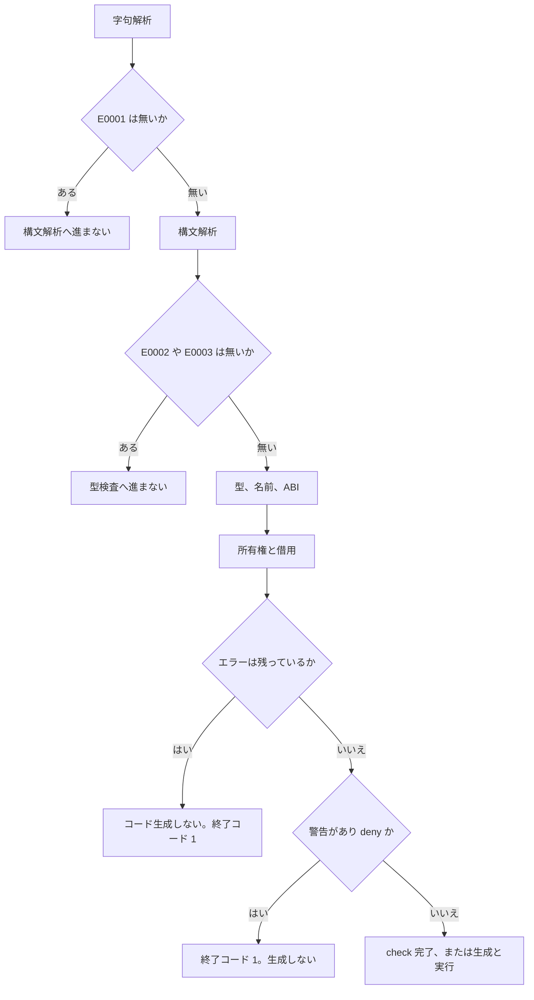

# 診断メッセージとエラーコード

コンパイラは、直せることを 1 回の実行でできるだけ集め、それぞれに安定したコードと位置を付けます。成功は終了コード 0、ソースやツールや実行の失敗は 1、引数の誤りは 2 です。警告は既定では終了コードを変えません。

コードの意味は、`src/diagnostic.rs`、`src/warnings.rs`、[言語仕様の診断](../../../docs/language.md#診断) で確認したものだけを載せてあります。

## この記事のポイント

- 人間向けの 1 件は `パス:行:列: 重要度[コード]: メッセージ` です。
- `--json` は stderr の 1 行 1 JSON です。配列にはまとめません。
- 画面に出すのは 50 件まで、内部では重複を除いて 1000 件まで集めます。
- 字句エラーがあると構文解析へ進まず、構文エラーがあると型検査へ進みません。
- コードの千の位が、構文、意味、ツールのどれかを大まかに分けます。

## 表示形式

位置は 1 始まりです。列は Unicode スカラー値の数で、タブも 1 文字です。スパンの `start` と `end` は、ファイル先頭からの UTF-8 バイトで、`end` は含みません。

テキスト形式では、問題が発生した行の内容と、該当する列を指すキャレット（`^`）を表示します。該当行が空行の場合は行の引用を表示しません。複数の診断メッセージの間には空行が挿入されます。

型が合わない足し算は、こう出ました。終了コードは 1 です。

```text
./Main.tz:1:35: error[E1003]: expected i64, found bool
  1 | def add :: i64 -> i64 = \n -> n + true
    |                                   ^
```

同じファイルの独立した式は、まとめて出ます。

```text
./Main.tz:2:17: error[E1003]: expected i64, found bool
  2 |     let a = n + true
    |                 ^

./Main.tz:3:21: error[E1003]: expected bool, found i32
  3 |     let b = false + 1
    |                     ^
```

警告も同じ形です。この `check` の終了コードは 0 でした。

```text
./Main.tz:2:9: warning[W1001]: unused local 'unused'; prefix it with '_' to silence this warning
  2 |     let unused = 1
    |         ^
```

ソースコードの引用行は、エラー位置の列の前後を最大 120 文字に切り詰めて表示します。表示されるパスは、渡した入力からの相対パスであり、実際に問題が発生したモジュールのファイルパスを正確に示します。すべてのエラーを先頭の入力ファイル名にまとめてしまうことはありません。

引数のエラーは、ソースが無いのでパスが `<command line>` で、行と列は 1 です。

```text
<command line>:1:1: error[E2000]: missing .tz, .tt, or .tc input or project directory; use --help
```

## JSON の 1 行 1 オブジェクト

`--json` は、同じ診断を stderr へ 1 行ずつ出します。標準出力は、`run` のプログラム出力や `test` の結果に残します。

先の型エラーは、次の 1 行でした。

```text
{"severity":"error","code":"E1003","message":"expected i64, found bool","path":"./Main.tz","span":{"start":34,"end":38,"line":1,"column":35,"end_line":1,"end_column":39}}
```

| フィールド | 意味 |
| --- | --- |
| `severity` | `error`、`warning`、省略通知の `note` |
| `code` | `E1003` や `W1001`。省略通知には無い |
| `message` | 人間向けと同じ文。引用符と改行は JSON の文字列としてエスケープされる |
| `path` | ソースのパス。引数エラーは `<command line>` |
| `span.start` / `span.end` | UTF-8 バイトオフセット。`end` は排他 |
| `span.line` / `span.column` | 始まり。1 始まりの行と、Unicode スカラー値の列 |
| `span.end_line` / `span.end_column` | 終わりの行と列 |

`fmt --check --json` だけ、形が少し違います。スパンは無く、パスと「整形されていない」ことだけです。終了コードは 1 でした。

```text
{"severity":"error","code":"E2000","message":"file is not formatted","path":"unformatted.tz"}
```

ツールがビルドのついでに出す警告、たとえばキャッシュを使えなかった通知は、`code` が `W2001` で、スパンを持たない行になることがあります。最後の一時ディレクトリを消せなかった、といった後始末の注意は、JSON モードでもプレーンテキストのままです。

`test --json` の結果は stderr ではなく stdout で、診断とは別のオブジェクトです。1 件は `type` が `test`、最後に `type` が `summary` の行が続きます。

```text
{"type":"test","index":0,"module":"Main","name":"adds numbers","status":"passed","duration_ms":234}
{"type":"summary","passed":1,"failed":0,"ignored":0,"duration_ms":792}
```

失敗した件には `failure` が足されます。`--list --json` は実行せず、`type`、`index`、`module`、`name`、`path`、UTF-16 の `range` を出します。

## 複数エラーと二次エラー

診断は、ソース、開始位置、終了位置、重要度、コード、メッセージで一意にします。同じ報告が 2 回出ることはありません。

画面に詳しく出すのは 50 件までです。内部では、重複を除いて 1000 件まで集めます。残りがあるときは、最後に件数だけを足します。

| 状況 | テキスト | JSON |
| --- | --- | --- |
| エラーが 50 件を超え、収集は 1000 件未満 | `error: 12 more errors not shown` | `{"severity":"note","message":"12 more errors not shown"}` |
| 収集上限の 1000 件に達した | `error: at least 950 more errors not shown` | `note` で、`at least` が付く |
| 警告だけの超過 | `warning: 12 more warnings not shown` | 同じ `note`。メッセージは warnings |

字句エラーがあるファイルは、構文解析へ進みません。構文エラーがあるプロジェクトは、型検査へ進みません。壊れた構文木を後ろの段階へ渡さないためです。回復は、括弧の外や、行頭の宣言の境界で行います。

関数のシグネチャが壊れているとき、その関数を呼んでいる側の二次エラーは抑えます。ほかの関数の検査は続けます。本体では、独立した部分式の型エラーを集め、壊れた値に依存する続きは抑えます。

所有権は、変数ごとに最初の不正な再利用を報告してから、ほかの変数を見ます。型が付いた関数なら、プロジェクトの別の場所に型エラーがあっても、ムーブ後の使用や借用の競合は報告します。借用の生存期間のような、型が全部決まってから見るエラーは、型エラーが消えた次の実行で初めて出ることがあります。1 回で全部出る保証はありません。

資源上限の `E1017`、診断が収集上限に達したとき、region や制約やコンピュテーション式の展開に失敗したときは、その関数本体の続きを打ち切ります。名前空間のように、続きを見ても安全でない段階では、そこまでに集めた診断を出して止まります。

エラーがあると、`build` と `run` は LLVM にもリンクにも進みません。既存の成果物は置き換えません。このとき警告は出しません。警告だけのときは、ファイルと位置の順で stderr へ出してから、次へ進みます。



## エラーコード

エラーコードのプレフィックスと千の位が分類を表します。`E0`（`E0001`〜`E0003`）は字句解析と構文解析、`E1`（`E1001`〜`E1028`）は意味解析・型検査・所有権と借用などの言語仕様上のエラー、`E2`（`E2000`〜`E2006`）は CLI 引数・I/O・リンカー・実行時などのツールと実行に関するエラーです。警告コードは `W1`（`W1001`〜`W1006`）およびツールの警告 `W2001` です。

| コード | 何を報告するか |
| --- | --- |
| `E0001` | 字句解析 |
| `E0002` | 構文、AST の深さの上限。行頭の `#if` もここに落ちます |
| `E0003` | ソースファイルの大きさの上限 |
| `E1001`–`E1010` | 識別子名、型シグネチャ、型の不一致、演算子・関数呼び出し、レコードフィールド、公開 ABI、リテラル、型レイアウト |
| `E1011` | モジュール名、予約名、`std`、パッケージのパス、シンボリックリンクの入力 |
| `E1012` | ムーブ後の使用、不正な代入 |
| `E1013` | 所有者より長生きする借用、Task をまたぐ借用 |
| `E1014` | 借用の競合、不変な値への可変アクセス |
| `E1015` | 曖昧な型変数、無限型、多相の不正 |
| `E1016` | 型クラスとインスタンス。`Drop` を含む |
| `E1017` | コンパイラの資源上限 |
| `E1018` | ファイル種別の規則違反、未知のビルダー、必要なビルダー操作の未定義、ビルダー候補の曖昧・不在、GPU カーネルにできない構文、標準ライブラリからの不正な `export` |
| `E1019` | `rec` の過不足、単独の `and` |
| `E1020` | パターンの形、OR パターンの束縛、共用体のペイロード |
| `E1021` | `match` と関数ガードの網羅性。足りないケースを示す |
| `E1022` | 他モジュールの `private`、公開 API からの private 型、不透明な標準ライブラリ型の直接構築 |
| `E1023` | ループ外の `break` / `continue`、`finally` を越える脱出 |
| `E1024` | 型パラメーター、共用体と型エイリアスの名前、循環するエイリアス |
| `E1025` | `deriving` できない型クラスや要素、止まらない `Default` |
| `E1026` | コンパイル時定数のトラップ、循環、ステップ上限 |
| `E1027` | 条件付きインスタンスやスーパークラスの制約 |
| `E1028` | `dyn` にできない型クラス。理由はメッセージに入る |
| `E2000` | 引数、拡張子、組み合わせ、既定 wasm32 で OS API に到達したビルド |
| `E2001` | ファイルの読み書き。ディレクトリを渡して `Main.tz` が無いときもこれです |
| `E2002` | LLVM やリンカーの失敗。未解決シンボル、Windows で OS API に到達した場合を含む |
| `E2003` | 出力ファイルの保護。既存の成果物を壊さないための失敗 |
| `E2004` | 入口の要件。`Main.tz` が無い実行ファイル、export も `main` も無い WASM、`export def` の無いバインディング、`main` のシグネチャ違反、`def main` とトップレベル実行の併用、`Main.tz` 以外のモジュールでのトップレベル実行 |
| `E2005` | 実行時の異常終了。トラップ位置、0 以外の `def main`、スタック枯渇の推定を含む |
| `E2006` | 言語内テストの失敗 |

`E1001` から `E1010` は型検査・意味解析の基本的なエラーに割り当てられています。具体的には、`E1001` が識別子名の重複、`E1002` が型シグネチャの不整合、`E1003` が型の不一致（expected ... found ...）、`E1004` が曖昧な識別子や名前解決エラー、`E1005` が関数呼び出しや演算子インスタンスの不備、`E1006` が関数適用の引数の個数の不一致（アクティブパターンの追加引数や `Owned.function` に渡すラムダの引数の数を含む）、`E1007` がレコードフィールドの不備、`E1008` が公開 ABI や extern の制約違反、`E1009` が数値リテラルの不正、`E1010` が型レイアウトの制限です。詳細な理由は各診断メッセージで示されます。

## 警告

| コード | いつ出るか | 消し方 |
| --- | --- | --- |
| `W1001` | 未使用のローカル、引数、パターン束縛 | 名前を `_` か `_unused` にする。ムーブ、借用、ガード、クロージャの捕捉は使用です |
| `W1002` | 公開 API から到達しない private な関数、レコード、共用体、型エイリアス | 削除するか、公開する |
| `W1003` | 前のガード無しの節が覆っている、到達しない `match` の節 | 節を削除するか、前のパターンを狭くする |
| `W1004` | 同じ字句スコープでのシャドーイング | コマンドラインからは出せません。内部検査のときだけです |
| `W1006` | 配列やリストの暗黙のディープコピー | `--warn implicit-copy` のときだけ。`ref` で借りるか、`Array.copy` / `List.copy` で明示する |
| `W2001` | キャッシュを使えなかった、などのツール警告 | ソースの警告ではありません。`--json` のときこのコードになります |

`W1006` は、同じ位置がジェネリックの複数の具体化でコピーされても 1 件です。生成コードは、フラグの有無で変わりません。標準ライブラリの内部名と、コンパイラが作った束縛には `W1001` を出しません。

次の再使用は、`--warn implicit-copy` を付けた `check` で `W1006` になりました。フラグが無いと同じソースは警告ゼロで、終了コードはどちらも 0 です。

```text
copywarn/Main.tz:2:9: warning[W1006]: implicit copy of an array allocates and copies every element; borrow it with 'ref', or call 'Array.copy' to make the copy explicit
  2 | let b = a
    |         ^
```

`--deny-warnings` は、これらの警告が 1 つでもあれば終了コード 1 にします。重要度の文字列は `warning` のままです。警告コードを 1 つだけ消す指令は無いので、個別に直すか、未使用なら `_` を付けます。

## LSP での表示

`tsuzuri lsp` は、同じ診断を `textDocument/publishDiagnostics` でエディターへ渡します。CLI のテキスト形式ではありません。

各要素は `range`、`severity`、`code`、`source`、`message` です。`source` は `tsuzuri` です。`severity` はエラーが 1、警告が 2 で、LSP の数値です。`range` は UTF-16 の行と桁で、0 始まりです。CLI の `--json` が 1 始まりの Unicode スカラー値なのと、ここが違います。

未保存のバッファも、開いているテキストで検査します。入力を読めないときも、同じオブジェクトを 1 件出します。閉じた文書に新しい診断を送り続けることはしません。

VS Code 拡張は、これを波線と問題パネルに出します。未使用ローカルへ `_` を付けるクイックフィックスは `W1001` 向けです。ほかの警告の自動修正は、0.1.0 の拡張にはありません。

## まとめ

- テキストは `パス:行:列: error[E1003]: ...`、JSON は 1 行に `severity`、`code`、`message`、`path`、`span` です。
- 50 件を超えると件数だけを足し、1000 件で収集を止めます。重複は最初から 1 件です。
- 字句、構文、型の順に段階を分け、壊れた木から二次エラーを量産しないようにしています。
- `E0` は構文、`E1` は意味、`E2` はツールと実行、`W` は警告です。
- LSP は同じコードを、UTF-16 で 0 始まりの range として出します。

## 関連項目

- [コンパイラの使い方](usage.md)
- [コンパイラ オプション](option.md)
- [コンパイラ ディレクティブ](directives.md)
- [所有権とムーブ](../ownership-and-memory/ownership.md)
- [言語仕様の診断](../../../docs/language.md#診断)
- [言語リファレンスの目次](../index.md)
