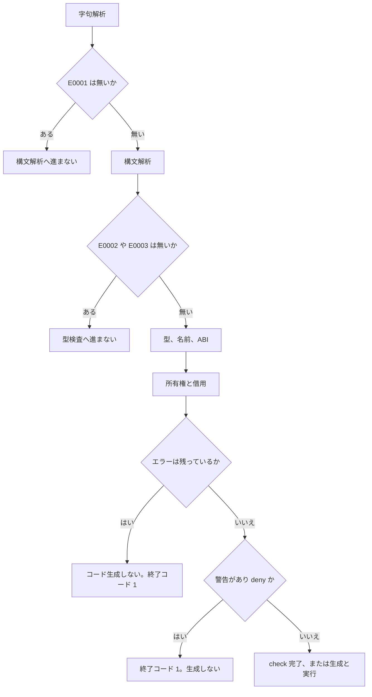

# 診断メッセージとエラーコード

コンパイラは、直せることを 1 回の実行でできるだけ集め、それぞれに安定したコードと位置を付けます。成功は終了コード 0、ソースやツールや実行の失敗は 1、引数の誤りは 2 です。警告は既定では終了コードを変えません。

コードの意味は、`src/diagnostic.rs`、`src/warnings.rs`、[言語仕様の診断](../../../docs/language.md#診断) で確認したものだけを載せてあります。

## この記事のポイント

- 人間向けの 1 件は `パス:行:列: 重要度[コード]: メッセージ` です。直す手がかりがある診断は、続けて関連する位置（`note:`）、直し方（`help:`）、機械的な修正案（`fix`）を出します。
- `--json` は stderr の 1 行 1 JSON です。配列にはまとめません。追加の情報は、値があるときだけキーが付きます。
- 画面に出すのは 50 件まで、内部では重複を除いて 1000 件まで集めます。
- 字句エラーがあると構文解析へ進まず、構文エラーがあると型検査へ進みません。
- コードの千の位が、構文、意味、ツールのどれかを大まかに分けます。

## 表示形式

位置は 1 始まりです。列は Unicode スカラー値の数で、タブも 1 文字です。スパンの `start` と `end` は、ファイル先頭からの UTF-8 バイトで、`end` は含みません。

テキスト形式では、問題が発生した行の内容と、該当する列を指すキャレット（`^`）を表示します。該当行が空行の場合は行の引用を表示しません。複数の診断メッセージの間には空行が挿入されます。

型が合わない足し算は、こう出ました。終了コードは 1 です。

```text
./Main.tz:1:35: error[E1003]: expected i64, found bool
  1 | def add :: i64 -> i64 = \n -> n + true
    |                                   ^
```

同じファイルの独立した式は、まとめて出ます。

```text
./Main.tz:2:17: error[E1003]: expected i64, found bool
  2 |     let a = n + true
    |                 ^

./Main.tz:3:21: error[E1003]: expected bool, found i32
  3 |     let b = false + 1
    |                     ^
```

警告も同じ形です。この `check` の終了コードは 0 でした。

```text
./Main.tz:2:9: warning[W1001]: unused local 'unused'; prefix it with '_' to silence this warning
  2 |     let unused = 1
    |         ^
```

### 関連する位置・help・修正案

所有権、型の不一致、名前、呼び出し、網羅性、重複の診断の一部は、主の位置に続けて、原因になった別の位置と直し方を出します。ムーブした値を使うと、どこでムーブしたかを示します。

```text
def consume :: own string -> i64 = \s -> s.length

def main_value :: unit -> i64 = \_ ->
    let text = "hello"
    let a = consume text
    let b = consume text
    a + b

main_value ()
```

`check` の出力は次のとおりで、終了コードは 1 です。

```text
./Main.tz:6:21: error[E1012]: use of moved or partially moved value 'text'
  6 |     let b = consume text
    |                     ^
  note: value moved here
    --> ./Main.tz:5:21
  5 |     let a = consume text
    |                     ^
  help: borrow the value with 'ref text' or move it last
```

| 行 | 意味 |
| --- | --- |
| `  note: <説明>` と `    --> パス:行:列`、その行の引用 | 関連する位置。1 件の診断に 16 件まで。別のファイル（std を含む）の位置は、そのファイルの行と列で出します |
| `  help: <直し方>` | 1 行の直し方 |
| `  fix (<certain\|likely\|maybe>): <題>` | 機械的な修正案。8 件まで。`maybe` は提案で、そのまま正しいとは限りません |

網羅していない `match` は、足りない腕を足す修正案を持ちます。足す腕の本体は `unreachable ()` で、実際の処理に書き換える前提の `maybe` です。字下げはしないので、`match` の最後の腕の末尾に ` | Triangle _ -> unreachable ()` が付きます。足りない腕が複数あるときは、8 個までならまとめて 1 つの修正案にします（`Add the arms '| B -> unreachable () | C -> unreachable ()'`）。それより多いときや、腕として書けない形（レコード、配列の長さ、リスト、リテラル）が足りないときは、`help` だけです。

```text
./Main.tz:4:5: error[E1021]: match is not exhaustive; missing: Triangle _
  4 |     match s with
    |     ^
  help: add an arm for 'Triangle _', or end the match with a wildcard arm '| _ -> ...'
  fix (maybe): Add the arm '| Triangle _ -> unreachable ()'
```

追加の情報を持たない診断の出力は、主の位置の 3 行だけで、以前と同じです。どの診断が何を持つかは「エラーコード」の表にあります。`tsuzuri repl` は `note:` と `fix` を出しません（位置が REPL の生成するプログラムのものだからです）。

ソースコードの引用行は、エラー位置の列の前後を最大 120 文字に切り詰めて表示します。表示されるパスは、渡した入力からの相対パスであり、実際に問題が発生したモジュールのファイルパスを正確に示します。すべてのエラーを先頭の入力ファイル名にまとめてしまうことはありません。

引数のエラーは、ソースが無いのでパスが `<command line>` で、行と列は 1 です。

```text
<command line>:1:1: error[E2000]: missing .tz, .tt, or .tc input or project directory; use --help
```

## JSON の 1 行 1 オブジェクト

`--json` は、同じ診断を stderr へ 1 行ずつ出します。標準出力は、`run` のプログラム出力や `test` の結果に残します。

先の型エラーは、次の 1 行でした。

```text
{"severity":"error","code":"E1003","message":"expected i64, found bool","path":"./Main.tz","span":{"start":34,"end":38,"line":1,"column":35,"end_line":1,"end_column":39}}
```

| フィールド | 意味 |
| --- | --- |
| `severity` | `error`、`warning`、省略通知の `note` |
| `code` | `E1003` や `W1001`。省略通知には無い |
| `message` | 人間向けと同じ文。引用符と改行は JSON の文字列としてエスケープされる |
| `path` | ソースのパス。引数エラーは `<command line>` |
| `span.start` / `span.end` | UTF-8 バイトオフセット。`end` は排他 |
| `span.line` / `span.column` | 始まり。1 始まりの行と、Unicode スカラー値の列 |
| `span.end_line` / `span.end_column` | 終わりの行と列 |

追加の情報は、5 つのキーの後ろに、次の順で、値があるときだけ付きます。どれも持たない診断の行は、上の 5 キーの形のままです。

| フィールド | 意味 |
| --- | --- |
| `kind` | 診断の原因を表す識別子。現在の診断には付きません |
| `related` | 関連する位置の配列。要素は `role`、`message`、`path`、`span`（主と同じ 6 キー）。位置を解決できない要素は省きます |
| `help` | 1 行の直し方 |
| `expected` / `found` | 型の不一致（`E1003`）の期待した型と実際の型。メッセージと同じ表示です |
| `candidates` | 候補の配列（`name`、`signature`、`how`）。現在の診断には付きません |
| `scope` | 見えるローカル変数の配列（`name`、`type`）。内側のスコープから、32 件まで |
| `fixes` | 修正案の配列。要素は `title`、`applicability`（`certain`・`likely`・`maybe`）、`edits`。`edits` の要素は `path`、`span`、`text` で、`span` の範囲（UTF-8 バイト、`end` は排他）を `text` に置き換えます。`start` と `end` が同じなら挿入です |

`role` は `moved_here`（ムーブした位置）、`borrowed_here`（借用を作った位置）、`borrow_used_here`（借用がまだ生きている理由になる使用）、`declared_here`（宣言）、`expected_because`（期待する型を決めた宣言）、`first_defined_here`（最初の定義）、`via_call`、`required_by`、`note` のどれかです。先のムーブの診断は、次の 1 行です。

```text
{"severity":"error","code":"E1012","message":"use of moved or partially moved value 'text'","path":"./Main.tz","span":{"start":157,"end":161,"line":6,"column":21,"end_line":6,"end_column":25},"related":[{"role":"moved_here","message":"value moved here","path":"./Main.tz","span":{"start":132,"end":136,"line":5,"column":21,"end_line":5,"end_column":25}}],"help":"borrow the value with 'ref text' or move it last"}
```

キーの名前と順序、`role` と `applicability` の値は安定しています。`related` の `message`、`help`、修正案の `title` と `text` の文言は変わることがあります（[安定性と互換性の方針](../../../docs/stability.md#安定として保たないもの)）。

`fmt --check --json` だけ、形が少し違います。スパンは無く、パスと「整形されていない」ことだけです。終了コードは 1 でした。

```text
{"severity":"error","code":"E2000","message":"file is not formatted","path":"unformatted.tz"}
```

ツールがビルドのついでに出す警告、たとえばキャッシュを使えなかった通知は、`code` が `W2001` で、スパンを持たない行になることがあります。最後の一時ディレクトリを消せなかった、といった後始末の注意は、JSON モードでもプレーンテキストのままです。

`test --json` の結果は stderr ではなく stdout で、診断とは別のオブジェクトです。1 件は `type` が `test`、最後に `type` が `summary` の行が続きます。

```text
{"type":"test","index":0,"module":"Main","name":"adds numbers","status":"passed","duration_ms":234}
{"type":"summary","passed":1,"failed":0,"ignored":0,"duration_ms":792}
```

失敗した件には `failure` が足されます。`--list --json` は実行せず、`type`、`index`、`module`、`name`、`path`、UTF-16 の `range` を出します。

## 複数エラーと二次エラー

診断は、ソース、開始位置、終了位置、重要度、コード、メッセージで一意にします。同じ報告が 2 回出ることはありません。

画面に詳しく出すのは 50 件までです。内部では、重複を除いて 1000 件まで集めます。残りがあるときは、最後に件数だけを足します。

| 状況 | テキスト | JSON |
| --- | --- | --- |
| エラーが 50 件を超え、収集は 1000 件未満 | `error: 12 more errors not shown` | `{"severity":"note","message":"12 more errors not shown"}` |
| 収集上限の 1000 件に達した | `error: at least 950 more errors not shown` | `note` で、`at least` が付く |
| 警告だけの超過 | `warning: 12 more warnings not shown` | 同じ `note`。メッセージは warnings |

字句エラーがあるファイルは、構文解析へ進みません。構文エラーがあるプロジェクトは、型検査へ進みません。壊れた構文木を後ろの段階へ渡さないためです。回復は、括弧の外や、行頭の宣言の境界で行います。

関数のシグネチャが壊れているとき、その関数を呼んでいる側の二次エラーは抑えます。ほかの関数の検査は続けます。本体では、独立した部分式の型エラーを集め、壊れた値に依存する続きは抑えます。

所有権は、変数ごとに最初の不正な再利用を報告してから、ほかの変数を見ます。型が付いた関数なら、プロジェクトの別の場所に型エラーがあっても、ムーブ後の使用や借用の競合は報告します。借用の生存期間のような、型が全部決まってから見るエラーは、型エラーが消えた次の実行で初めて出ることがあります。1 回で全部出る保証はありません。

資源上限の `E1017`、診断が収集上限に達したとき、region や制約やコンピュテーション式の展開に失敗したときは、その関数本体の続きを打ち切ります。名前空間のように、続きを見ても安全でない段階では、そこまでに集めた診断を出して止まります。

エラーがあると、`build` と `run` は LLVM にもリンクにも進みません。既存の成果物は置き換えません。このとき警告は出しません。警告だけのときは、ファイルと位置の順で stderr へ出してから、次へ進みます。


```mermaid
flowchart TD
  lex["字句解析"] --> lexOk{"E0001 は無いか"}
  lexOk -->|ある| stopLex["構文解析へ進まない"]
  lexOk -->|無い| parse["構文解析"]
  parse --> parseOk{"E0002 や E0003 は無いか"}
  parseOk -->|ある| stopParse["型検査へ進まない"]
  parseOk -->|無い| types["型、名前、ABI"]
  types --> own["所有権と借用"]
  own --> gate{"エラーは残っているか"}
  gate -->|はい| stopGen["コード生成しない。終了コード 1"]
  gate -->|いいえ| warn{"警告があり deny か"}
  warn -->|はい| stopWarn["終了コード 1。生成しない"]
  warn -->|いいえ| gen["check 完了、または生成と実行"]
```

## エラーコード

エラーコードのプレフィックスと千の位が分類を表します。`E0`（`E0001`〜`E0003`）は字句解析と構文解析、`E1`（`E1001`〜`E1028`）は意味解析・型検査・所有権と借用などの言語仕様上のエラー、`E2`（`E2000`〜`E2007`）は CLI 引数・I/O・リンカー・実行時・依存の取得などのツールと実行に関するエラーです。警告コードは `W1`（`W1001`〜`W1006`）およびツールの警告 `W2001`・`W2002` です。

| コード | 何を報告するか |
| --- | --- |
| `E0001` | 字句解析 |
| `E0002` | 構文、AST の深さの上限、不正なビルダーの別名宣言（`@alias`）、`const` の置き場所の誤り（`const fn`・`const let`・`const and`・`const export def`、`@cpu` との併用）、ローカルな `let rec` の誤り（右辺がラムダ式でない、`let rec mut`、`let! rec`・`and! rec`、`@checked` を付けた `let rec`、`where` の `rec`、`use rec`）、マニフェストの `edition` が対応する値でないこと（`unsupported edition '2030'; supported editions: 2026`）。行頭の `#if` もここに落ちます |
| `E0003` | ソースファイルの大きさの上限（4 MiB） |
| `E1001`–`E1010` | 識別子名、名前の解決、型の不一致、演算子・関数呼び出し、レコードフィールド、公開 ABI、リテラル、型レイアウト |
| `E1011` | モジュール名、予約名、`std`、パッケージのパスと名前（同じ名前の別の取得元、git・registry のパッケージの許されない依存、互換の範囲が違う版の要求を含む）、シンボリックリンクの入力 |
| `E1012` | ムーブ後の使用、不正な代入、`let rec` の関数が借用している捕捉のムーブ（`cannot move 'text' out of a 'let rec' function, which borrows it`）。2027 の既定の読み取り引数から非 Copy 値を取り出す場合は `own` を案内します。ムーブ後の使用は、ムーブした位置（`moved_here`。ループの前の反復なら `in the previous iteration of the loop`）と `help` を持ちます |
| `E1013` | 所有者より長生きする借用（借用して捕捉した値を持つ `let rec` の関数を、その値の持ち主から返す場合を含む）、Task をまたぐ借用、Async の `let!` / `do!` / 開始をまたぐ借用、Task へ持ち込む `Rc` や `Sync` でない値の `Arc`、`Task.scope` で共有する `Sync` でない値、`Task.scope` や `Parallel.*` で共有する、借用を持った一時値、`Mutex.with_lock` の結果に含まれる借用、`Channel.send` の要素が持つ借用（`a channel item cannot hold a borrow`）、`Channel.bounded` の `Send` でない要素（`Channel.bounded` や `Mutex.create` を包んだジェネリック関数を `Send` でない型で使う場合も）。所有者より長生きする借用（ブロックの結果、代入、関数の戻り値、パターンと反復の束縛）は、所有者の宣言（`declared_here`）、借用した位置（`borrowed_here`）と `help` を持ちます |
| `E1014` | 借用の競合、不変な値への可変アクセス。借用の競合は、借用した位置（`borrowed_here`）、借用を生かしている後の使用（`borrow_used_here`）と `help` を持ちます。`let` で宣言した変数への可変アクセスは、その宣言（`declared_here`）と `help` を持ちます |
| `E1015` | 曖昧な型変数、無限型、多相の不正 |
| `E1016` | 型クラスとインスタンス。`Drop` を含む（std の型への利用者の `Drop` の instance は `E1016`。std のモジュールが自分で宣言した型には、std が書く） |
| `E1017` | コンパイラの資源上限 |
| `E1018` | ファイル種別の規則違反（`.tc` 以外の `@alias` を含む）、未知のビルダー、必要なビルダー操作の未定義、ビルダー候補の曖昧・不在、GPU カーネルにできない構文（厳密な WGSL の `f32`・`f16`・64 bit の要素、緩い WGSL（`Gpu.init_relaxed`・`Gpu.map_relaxed`・`--emit wgsl-relaxed`）の `f64`・64 bit 整数・`bool` の要素・`f32`・`f16` から整数と `f32` と `f64` の間のキャスト、整数の除算と剰余を含む）、Vulkan 用の厳密な SPIR-V（`Gpu.map`・`--emit spirv`）の `f32` の `/`・`f64`・`f16`・`bool` の要素・整数の除算と剰余と `**`、緩い SPIR-V（`--emit spirv-relaxed`）の 64 bit 整数の要素と `f32` から整数へのキャスト、標準ライブラリからの不正な `export`、`.tt` と標準ライブラリの `bench` 宣言、`tsuzuri bench` 以外の出力でトップレベルのコード・`export def`・実行するテスト・`Drop` の実装から到達する `Bench.now` |
| `E1019` | `rec` の過不足、単独の `and` |
| `E1020` | パターンの形、OR パターンの束縛、共用体のペイロード |
| `E1021` | `match` と関数ガードの網羅性。足りないケースを示し、`help` を持ちます。`match ... with` の足りないケースが腕として書ける形（`_`、`true`・`false`、`()`、共用体のケース、それらのタプル）で 8 個以下なら、末尾にそれらの腕を足す `maybe` の修正案も持ちます |
| `E1022` | 他モジュールの `private`、公開 API からの private 型、不透明な標準ライブラリ型（`Map`、`Arena`、`Arena.Handle`、`Net.Address`、`Atomic`、`Mutex`、`Channel.Sender`、`Channel.Receiver` など）の直接構築・フィールド参照、std 専用の組み込み関数（`Os.__read`、`Net.__open`、`Arena.__next_id`、`Gpu.__open`、`Channel.__close_sender` など）の呼び出し |
| `E1023` | ループ外の `break` / `continue`、`finally` を越える脱出 |
| `E1024` | 型パラメーター、共用体と型エイリアスの名前、循環するエイリアス。共用体の重複したケースは、最初の定義（`first_defined_here`）を持ちます |
| `E1025` | `deriving` できない型クラスや要素、止まらない `Default`、`Encode`／`Decode` を導出しない型の `@json`、重なった `@json` の名前 |
| `E1026` | コンパイル時定数と `const def` のトラップ、循環、ステップ上限、`const def` の署名（値型でない引数や結果）と本体（使えない式）の規則違反、静的データの合計が 4 MiB を超える定数 |
| `E1027` | 条件付きインスタンスやスーパークラスの制約 |
| `E1028` | `dyn` にできない型クラス。理由はメッセージに入る |
| `E1029` | 純粋な宣言・関数値・class／instance の契約、または到達する処理の純粋性違反。宣言した呼び出し段階の引数を実装が途中までしか束縛しない場合も含む。`own` に参照・共有状態・利用者の `Drop` などを含む型を使った場合や、generic の特殊化で条件を満たさない場合も含む（[純粋関数](../values-and-functions/functions.md#純粋関数pure-def)） |
| `E2000` | 引数（`tsuzuri api-diff` の入力が 2 つでない場合を含む）、拡張子、組み合わせ、`--target` の名前が一覧にないこと（32-bit と対応する 5 環境以外を含む）、ビルド機で動かせない target の `run`・`test` に `TSUZURI_RUNNER` がないこと、その target の `test --coverage`・`test -g`・`bench`（[対応プラットフォーム](platforms.md#診断)）、`--allocator small` と WASM の target・`--trap-mode return`・`--freestanding` の組み合わせ（native の 64-bit のサイズ区分 allocator です）、`--wasm-feature net` の条件の不備（wasm32 の object・LLVM IR・WASM・bindings-js でない、`jspi` がない、threads や WASI との併用）、`net` なしの既定 wasm32 で OS API や `Net` のソケットに到達したビルド、`Async.block_on` なしで `Net` の非同期操作（`connect_async` など）に到達した native のビルド、Async 実行器に必要な opt-in の不足・threads との組み合わせ、`--freestanding` での `Mutex` と `Channel`（タスクのランタイムが要ります）、`--wasm-feature webgpu` の対象外の出力や threads・`--wasm-host`・JavaScript バインディングとの組み合わせ、`--wasm-feature tail-call` の対象外の出力（wasm32 と wasm64 の object・LLVM IR・WASM 以外）や `--backend fast` の wasm32 との組み合わせ、WGSL と SPIR-V の出力（`--emit wgsl`、`wgsl-relaxed`、`spirv`、`spirv-relaxed`）と `--target`・`-O`・`--cpu`・デバッグ・WASM 機能・`--allocator` との組み合わせ、環境変数 `TSUZURI_RANGE_FLAGS` が `off`・`proven`・`audit` のどれでもないこと（IR を出すコマンドだけ。`check` と `lsp` は読みません）、環境変数 `TSUZURI_STRINGS` が `utf16`・`compact` のどれでもないこと（同じく IR を出すコマンドだけ）、`tsuzuri watch` にコマンド名（`check`・`build`・`test`）がないこと、`tsuzuri serve` の引数（ディレクトリが 1 つでない、`--idle-timeout` が 1 から 86400 の整数でない、`--status` と `--stop` の同時指定）と設定（`TSUZURI_SERVER_DIR` が相対パスか空、ソケットのパスが長すぎる、Unix 以外）、`--no-server` を `check`・`build` 以外に付けること |
| `E2001` | ファイルの読み書き。ディレクトリを渡して `Main.tz` が無いときもこれです。`TSUZURI_RUNNER` のプログラムを起動できないときもこれで、メッセージにその名前が入ります。`tsuzuri serve` では、ソケットのディレクトリがほかの利用者に開かれている・シンボリックリンク・他人のものであること、同じプロジェクトのサーバーがすでに動いていること、ソケットの場所にソケットでないものがあること、`--status`・`--stop` の相手のサーバーがないこと、`--stop` の相手が要求を実行中で、終わるまで止まらないこともこれです |
| `E2002` | LLVM やリンカーの失敗。未解決シンボル、Windows の target で OS API に到達した場合、同梱ツールチェーンが扱わない組み合わせ（Windows 以外のホストからの MSVC のリンク、sysroot）を含む |
| `E2003` | 出力ファイルの保護。既存の成果物を壊さないための失敗 |
| `E2004` | 入口の要件。`Main.tz` が無い実行ファイル、export も `main` も無い WASM、`export def` の無いバインディングと共有ライブラリ、`export` が 1 つでない WGSL・SPIR-V の出力、`main` のシグネチャ違反、`def main` とトップレベル実行の併用、`Main.tz` 以外のモジュールでのトップレベル実行 |
| `E2005` | 実行時の異常終了。トラップ位置、0 以外の `def main`、スタック枯渇の推定、`tsuzuri bench` の失敗（トラップ、時間切れ、負の時間）を含む |
| `E2006` | 言語内テストの失敗 |
| `E2007` | 依存の取得と検証の失敗。`Tsuzuri.lock` の欠落・古い項目・形式違反、ストアにない依存や内容が SHA-256 と違う依存、`git` の欠落・失敗、取得したリポジトリのシンボリックリンク・submodule・危険なパス・大文字小文字だけ違うパス、registry の index にない版、index の項目と違うパッケージ、`publish` で commit とディレクトリの内容が違うこと（[パッケージ](../organizing-tsuzuri/packages.md#git-依存と-tsuzurilock)） |

`E1001` から `E1010` は型検査・意味解析の基本的なエラーに割り当てられています。具体的には、`E1001` が識別子名の重複（1 つの `let rec` グループに同じ名前を 2 度書く場合を含む。関数のシグネチャと定義、レコード、レコードのフィールド、引数の重複は最初の定義 `first_defined_here` を持ちます）、`E1002` が未知の値・関数・定数・ケースの名前（未知の値は、見えるローカル変数の `scope` と `help` を持ちます）、`E1003` が型の不一致（expected ... found ...。`expected`・`found` を持ち、`let` の型注釈・関数の結果の型・名前付きの関数の引数の型が期待を決めたときは、その宣言 `expected_because` を持ちます。引数が足りない呼び出しには `help` が付きます）、`E1004` が曖昧な識別子や名前解決エラー（複数のビルダーが宣言する別名の曖昧さを含む）、`E1005` が関数呼び出しや演算子インスタンスの不備（関数値が捕捉できない値の捕捉を含み、型変数 `'a` を含む型の値を捕捉する `let rec` もここです。関数でない値の呼び出しには `help` が付きます）、`E1006` が関数適用の引数の個数の不一致（アクティブパターンの追加引数や `Owned.function` に渡すラムダの引数の数を含む。引数が多すぎるときは `help` が付きます）、`E1007` がレコードフィールドの不備（未知のフィールドは、レコードのフィールドを並べた `help` を持ちます）、`E1008` が公開 ABI や extern の制約違反、`E1009` が数値リテラルの不正、`E1010` が型レイアウトの制限です。詳細な理由は各診断メッセージで示されます。

### 確保数の診断

[Alloc](../built-in-types-and-modules/alloc.md) と [bench --allocs](../built-in-types-and-modules/bench.md#確保数を測る) は既存のコードを使います。

| コード | 条件・修正 |
| --- | --- |
| `E1018` | テスト以外のコード生成が `Alloc` に到達し、counting heap がない場合。`build`・`run` では `--allocator counting` を付けます。bench の時間用実行器では `tsuzuri bench --allocs` が助言です |
| `E1022` | std 以外から `Alloc.__counter` を呼んだ場合。`Alloc.snapshot`・`Alloc.since` を使います |
| `E2000` | `Alloc` に届く出力と `--allocator host`・`small`、counting とカーネル出力、`bench` 以外の `--allocs`。計数用の設定を選び直します |
| `E2005` | bench の計数中のトラップ・時間切れ・負の時間・負の確保数の差分、または不正な計数出力。`benchmark 'Main.name' allocation run: ...` と宣言の位置を報告します |

## 警告

| コード | いつ出るか | 消し方 |
| --- | --- | --- |
| `W1001` | 未使用のローカル、引数、パターン束縛、自分の本体の中でしか使わない `let rec` の関数 | 名前を `_` か `_unused` にする。ムーブ、借用、ガード、クロージャの捕捉は使用です |
| `W1002` | 公開 API から到達しない private な関数、レコード、共用体、型エイリアス | 削除するか、公開する |
| `W1003` | 前のガード無しの節が覆っている、到達しない `match` の節 | 節を削除するか、前のパターンを狭くする |
| `W1004` | 同じ字句スコープでのシャドーイング | コマンドラインからは出せません。内部検査のときだけです |
| `W1005` | 別のパッケージや標準ライブラリが `@deprecated` にした `def`・`record`・`union` の使用 | 案内に従って別の宣言へ移ります。同じパッケージの中の使用には出ません（[ドキュメント コメント](../organizing-tsuzuri/documentation-comment.md#警告-w1005)） |
| `W1006` | 配列やリストの暗黙のディープコピー | `--warn implicit-copy` のときだけ。`ref` で借りるか、`Array.copy` / `List.copy` で明示する |
| `W2001` | キャッシュを使えなかった、プロファイルが合わなかった、`run --profile-generate` がプロファイルを書かなかった、などのツール警告 | ソースの警告ではありません。`--json` のときこのコードになります。プロファイルが合わないときは、`profile data does not match N function(s) in this build; they are optimized without profile data. Rebuild with --profile-generate and rerun the training workload` の 1 行です（[プロファイル誘導最適化](option.md#プロファイル誘導最適化)） |
| `W2002` | `tsuzuri bindgen` が C ヘッダーの宣言や整数のマクロを変換せずに省いた。理由はメッセージと、出力の `// skipped` 行にあります | 手で宣言するか、対応する型だけの C 関数で包みます。ポインターと長さの組は `--buffer` で変換できることがあります。位置はヘッダーの宣言やマクロの名前です |

`W1006` は、同じ位置がジェネリックの複数の具体化でコピーされても 1 件です。生成コードは、フラグの有無で変わりません。標準ライブラリの内部名と、コンパイラが作った束縛には `W1001` を出しません。

`W1005` は既定で有効で、フラグは要りません。メッセージは `'LegacyLib::Old.old' is deprecated: use LegacyLib::Old.next instead` の形で、案内が空なら `is deprecated; see its documentation for a replacement` です。`--deny-warnings` を付けると終了コードが 1 になるので、依存パッケージが宣言を非推奨にすると、その依存を使う側のビルドが失敗することがあります。警告の有無は互換性の保証の対象外です（[安定性と互換性の方針](../../../docs/stability.md#安定として保たないもの)）。

次の再使用は、`--warn implicit-copy` を付けた `check` で `W1006` になりました。フラグが無いと同じソースは警告ゼロで、終了コードはどちらも 0 です。

```text
copywarn/Main.tz:2:9: warning[W1006]: implicit copy of an array allocates and copies every element; borrow it with 'ref', or call 'Array.copy' to make the copy explicit
  2 | let b = a
    |         ^
```

`--deny-warnings` は、これらの警告が 1 つでもあれば終了コード 1 にします。重要度の文字列は `warning` のままです。警告コードを 1 つだけ消す指令は無いので、個別に直すか、未使用なら `_` を付けます。

`W2002` は `tsuzuri bindgen` だけが出す警告です。生成は続き、終了コードは 0 で、省いた宣言は出力にも `// skipped` 行として残ります。`bindgen` は `--deny-warnings` を受け付けません。

## LSP での表示

`tsuzuri lsp` は、同じ診断を `textDocument/publishDiagnostics` でエディターへ渡します。CLI のテキスト形式ではありません。

各要素は `range`、`severity`、`code`、`source`、`message` です。`source` は `tsuzuri` です。`severity` はエラーが 1、警告が 2 で、LSP の数値です。`range` は UTF-16 の行と桁で、0 始まりです。CLI の `--json` が 1 始まりの Unicode スカラー値なのと、ここが違います。

関連する位置のうちプロジェクトのファイルにあるものは `relatedInformation`（`location` と `message`）になります。std の中の位置は、エディターが開けないので入れません。修正案を持つ診断は `data.fixes`（`title` と `applicability`）を持ちます。どちらも無ければ、そのキーは付きません。

未保存のバッファも、開いているテキストで検査します。入力を読めないときも、同じオブジェクトを 1 件出します。閉じた文書に新しい診断を送り続けることはしません。

VS Code 拡張は、これを波線と問題パネルに出します。`textDocument/codeAction` のクイックフィックスは 2 種類です。未使用ローカル（`W1001`）へ `_` を付けるものと、診断の修正案です。修正案は、適用したテキストをもう一度検査し、その診断のコードの件数が減り、どのコードのエラーも増えないときだけ出します（警告の修正案なら警告も数えます。表示の上限の 50 件を超えた診断も数え、収集の上限の 1000 件に達したときは出しません）。現在、修正案を持つのは `E1021` の足りない腕だけで、`maybe` なので優先のクイックフィックス（`isPreferred`）にはしません。

## まとめ

- テキストは `パス:行:列: error[E1003]: ...`、JSON は 1 行に `severity`、`code`、`message`、`path`、`span` です。関連する位置、`help`、修正案は、値があるときだけ続きます。
- 50 件を超えると件数だけを足し、1000 件で収集を止めます。重複は最初から 1 件です。
- 字句、構文、型の順に段階を分け、壊れた木から二次エラーを量産しないようにしています。
- `E0` は構文、`E1` は意味、`E2` はツールと実行、`W` は警告です。
- LSP は同じコードを、UTF-16 で 0 始まりの range として出します。関連する位置は `relatedInformation`、検証を通った修正案はクイックフィックスになります。

## 関連項目

- [コンパイラの使い方](usage.md)
- [コンパイラ オプション](option.md)
- [コンパイラ ディレクティブ](directives.md)
- [対応プラットフォームとクロスコンパイル](platforms.md)
- [所有権とムーブ](../ownership-and-memory/ownership.md)
- [言語仕様の診断](../../../docs/language.md#診断)
- [言語リファレンスの目次](../index.md)
