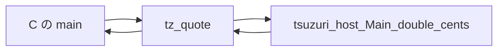

# ネイティブ連携 (C ABI)

`export def` は、C から呼べる関数を出します。シンボルは WebAssembly と同じ `tz_` 接頭辞で、`main` や C 標準の名前とぶつかりません。逆に、Tsuzuri から C の関数を呼ぶときは `extern def` です。どちらも、公開してよい型は限られています。

このページの C 言語連携の例は、macOS 環境の `clang` でオブジェクトファイルとヘッダーをリンクして実行検証しています（Windows 環境でのリンク動作は未検証です）。

## この記事のポイント

- スカラー、`bool`、`unit` の戻り値、一部の配列と文字列、スカラーだけのレコードが ABI に載ります。
- `--emit header` と `--emit object` を対にして、C からリンクします。
- 名前を書かない `extern` は `tsuzuri_host_<モジュール>_<名前>` になります。
- 所有して返ったバッファは、ホストが `tsuzuri_free` で 1 回だけ解放します。
- `tsuzuri bindgen` は、C ヘッダーから ABI の一致する `extern` を生成し、残りを `W2002` で報告します。

## 公開できる型

`export def add` の C 名は `tz_add` です。Tsuzuri の中ではカリー化された関数でも、C からは引数を一度に渡す普通の関数です。コンパイラが段階を適用するラッパーを出します。

| Tsuzuri | C ヘッダー |
| --- | --- |
| `i8` / `i16` / `i32` | `int32_t` |
| `i8u` / `i16u` / `i32u` | `uint32_t` |
| `i64` / `i64u` | `int64_t` / `uint64_t` |
| `f32` / `f64` | `float` / `double` |
| `bool` | `int32_t`。0 が false、非ゼロは true。戻り値は 0 か 1 |
| `unit` の戻り値 | `void`。`unit` を引数に取る関数は export できない（`E1008`）。引数なしの `export def f :: i64` は `int64_t tz_f(void)` になる |
| `ref [i64]` など、入力のバッファ | `const T *arg_ptr, int64_t arg_len` |
| 所有して返す配列や文字列 | 先頭引数の `tsuzuri_*_buffer *out`。戻り値は `void` |
| スカラーフィールドだけのレコード | 入力は `const tz_record_* *`、結果は先頭の out ポインタ |

`i128`、`f16`、`f128`、decimal、文字型、共用体、タプル、リスト、関数値、タスク、排他借用、戻り値としての借用は出せません。配列の要素として渡せるのは `i64`、`f64`、`ubyte` と、仕様が許す文字列です。固定長配列そのものは引数にできず、レコードで包みます。長さ 0 の配列フィールドも、ISO C に無いので拒否します。

`bool` と 8 / 16 bit 整数は、境界で 32 bit に正規化されます。レコードのフィールドも同様で、C コンパイラごとの構造体の詰め方には依存しません。生成される typedef 名は、モジュール名の長さと型引数で一意です。C の予約語になるフィールドには `tz_` が付き、それでも衝突すると `E1008` です。

`export` と `private` は別の軸です。`private export` はコンパイルエラーで、private な関数はヘッダーにも公開シンボルにも出ません。公開名 `tz_add` はプロジェクト全体で 1 つです。

## ヘッダーとオブジェクト

ライブラリは `Main.tz` でなくても出せます。実行ファイルにしたいときだけ、入口が要ります。

```sh
tsuzuri build Main.tz --emit header -o add.h
tsuzuri build Main.tz --emit object -o add.o
```

スカラーだけの `export def add` から出たヘッダーは、次のとおりでした。`tsuzuri_alloc` は、バッファを使わないモジュールには付きません。

```c
/* Generated by Tsuzuri. bool uses int32_t. Narrow integers use normalized 32-bit ABI values. */
#pragma once
#include <stdint.h>

#ifdef __cplusplus
extern "C" {
#endif

int64_t tz_add(int64_t arg0, int64_t arg1);

#ifdef __cplusplus
}
#endif
```

呼ぶ側は、ヘッダーを include してオブジェクトをリンクします。

```c
#include <stdio.h>
#include "add.h"

int main(void) {
    printf("%lld\n", (long long)tz_add(20, 22));
    return 0;
}
```

```sh
clang -O2 main.c add.o -o addhost
./addhost
```

実行結果:

```text
42
```

同じ計算を Tsuzuri 側で実行したときの標準出力も 42 です。

```tsuzuri run=42
export def add :: i64 -> i64 -> i64 = \left right ->
    left + right

add 20 22
```

実行結果:

```text
42
```

`--emit llvm` は、自分で `llc` や `clang` に渡す IR です。`--emit exe` は Tsuzuri の入口を持つ実行ファイルで、C の `main` と一緒にはリンクしません。C が `main` を持つときは object を使います。

## ホスト関数を import する

`extern def double_cents :: i64 -> i64` のネイティブシンボルは `tsuzuri_host_Main_double_cents` です。モジュール名の `.` は `_` になります。変換後に衝突すると `E1001` です。未使用の `extern` は、オブジェクトにもヘッダーの要求にも出ません。

```tsuzuri
extern def double_cents :: i64 -> i64

export def quote :: i64 -> i64 = \cents ->
    double_cents cents
```

生成ヘッダーには、ホストが定義すべきプロトタイプが入ります。`extern def now :: unit -> i64` のように `unit` を引数に取る `extern` は、`unit` が ABI から省かれ、C 側では `int64_t tsuzuri_host_Main_now(void)` になります（export の側では `unit` 引数は使えません）。

```c
int64_t tsuzuri_host_Main_double_cents(int64_t arg0);
int64_t tz_quote(int64_t arg0);
```

```c
#include <stdint.h>
#include <stdio.h>
#include "quote.h"

int64_t tsuzuri_host_Main_double_cents(int64_t cents) {
    return cents * 2;
}

int main(void) {
    printf("%lld\n", (long long)tz_quote(21));
    return 0;
}
```

実行結果:

```text
42
```

既存の C シンボルを、接頭辞なしで呼ぶときはリンク名を書きます。この宣言はヘッダーには出ません。プロトタイプはシステムのヘッダーが提供する、という前提です。`sqrt` に `3.0` と `4.0` を渡した実行結果は `5.0` でした。リンクには `-lm` が要ります。

```tsuzuri
extern "sqrt" def c_sqrt :: f64 -> f64

export def distance :: f64 -> f64 -> f64 = \x y ->
    c_sqrt (x * x + y * y)
```

```c
#include <stdio.h>
#include "distance.h"

int main(void) {
    printf("%.1f\n", tz_distance(3.0, 4.0));
    return 0;
}
```

シンボル名は 255 バイト以下の C 識別子です。`tz_`、`tsuzuri`、`__` で始まる名前と、`malloc` や `write` などランタイムが使う名前は `E1008` です。同じシンボルを複数の `extern` で宣言することはできますが、型が違うと `E1008` です。

呼び出しは副作用として扱われ、引数は左から右に評価されます。部分適用はできます。コンパイラが純粋な計算だと思って消すことはありません。`const` の初期化から `extern` を呼ぶことはできません。



### 不透明ハンドル

`extern type Counter` は、ホストが所有するポインタを Tsuzuri 側では値として扱う型です。リテラルでは作れず、`extern` の戻り値か、export の引数としてだけ受け取ります。Copy ではなく、代入はムーブです。破棄してもデストラクタは走りません。閉じる `extern` へ値で渡すのが、解放の契約です。

C では `typedef struct tz_handle_..._s *tz_handle_...` の 1 ポインタです。`ref` を付けても、ポインタのポインタにはならず、ハンドル値そのものを渡します。フィールドやバッファ要素には置けません。詳しくは [言語仕様の不透明ハンドル](../../../docs/language.md#不透明ハンドル) を見てください。

### 静的コールバック

`extern` の引数に関数型を書けます。渡せるのは、型パラメーターを持たないトップレベルのユーザー関数だけです。ラムダ、部分適用、ローカル、標準ライブラリ、別の `extern` は `E1008` です。

ホストが受け取るのは、その関数の C ABI ラッパーへの関数ポインタです。環境は捕捉しません。`extern` の呼び出しが返ったあとに、そのポインタを非同期で呼んではいけません。コールバックの引数はスカラーかハンドル、戻り値はスカラーか `unit` です。バッファやレコードは渡せません。この `extern` 自体は、部分適用できません。

## リンク入力

C が `main` を持たず、Tsuzuri の実行ファイルへホストのオブジェクトを足すときは、`--link`、`-l`、`-L` を使います。`build` の `--emit exe`、`run`、native の `test` だけが受けます。

```sh
tsuzuri build Main.tz --link host.o -L vendor -l sqlite3 -o shop
```

`Tsuzuri.toml` の `[native]` が先、コマンドラインがあとです。依存パッケージのリンク入力を入れるときは、依存の表に `native = true` を書きます。`native = true` を付けていない依存パッケージが `[native]` を持っていると、`E2000` になります。パスは相対パスで、絶対パスは拒否します。合計 256 個までです。未解決のシンボルが残ると、リンクの `E2002` です。

```toml
[native]
link = ["host.o", "vendor/libutil.a"]
libraries = ["sqlite3", "m"]
search = ["vendor"]
```

## 所有バッファと tsuzuri_alloc

所有して返す `[ubyte]` は、先頭の out 引数へ `{ ptr, len }` を書きます。ホストは使い終わったら `tsuzuri_free(tag.ptr)` を 1 回呼びます。`tsuzuri_free(NULL)` は何もしません。`tsuzuri_alloc(0)` は、少なくとも 1 バイトの一意なアドレスを返します。負のサイズや確保失敗はトラップです。

`export def make_tag :: i64 -> [ubyte]` を長さ 3 で呼ぶと、バイト列は `ABC` でした。ヘッダーは `void tz_make_tag(tsuzuri_ubyte_buffer *out, int64_t arg0);` で、バッファ型は `uint8_t *ptr` と `int64_t len` です。

```c
#include <stdio.h>
#include "tag.h"

int main(void) {
    tsuzuri_ubyte_buffer tag;
    tz_make_tag(&tag, 3);
    fwrite(tag.ptr, 1, (size_t)tag.len, stdout);
    fputc('\n', stdout);
    tsuzuri_free(tag.ptr);
    return 0;
}
```

実行結果:

```text
ABC
```

借用で渡した入力は、呼び出しのあいだだけ読まれます。Tsuzuri はそれを複製して所有したり、解放したりしません。負の長さ、null と正の長さ、整列違反は、本体の前にトラップします。null と長さ 0 は空です。ネイティブでは、ポインタが本当に確保済みかをコンパイラは検査できません。正しい領域を渡すのはホストの責任です。

`string` は `uint16_t` の列、`utf8string` は検証済みの `uint8_t` です。不正な UTF-8 はトラップし、暗黙の文字コード変換はしません。

## ホスト提供の allocator

`--allocator host` は、文字列、配列、`Vec`、クロージャの環境、`tsuzuri_alloc` を含むヒープを、ホストの 3 関数へ向けます。`object`、`llvm`、`header`、WASM だけで、実行ファイルや `--trap-mode return` とは排他です。

```c
void *tsuzuri_host_alloc(uint64_t size, uint64_t align);
void tsuzuri_host_free(void *ptr, uint64_t size, uint64_t align);
void *tsuzuri_host_realloc(void *ptr, uint64_t old_size, uint64_t new_size, uint64_t align);
```

`align` は 16 で、戻り値も 16 の倍数です。null や揃っていない戻り値は、その場で確保失敗のトラップになり、再試行はありません。各ブロックの先頭 16 バイトは要求サイズ用なので、`size` は要求より 16 大きく、17 以上です。Tsuzuri が使うポインタは、戻り値の 16 バイト先です。ホスト側へ返却された所有バッファは、通常どおり `tsuzuri_free` を呼び出して解放します。`tsuzuri_host_free` を直接呼び出すと、先頭の 16 バイト分のアライメント・ヘッダー情報がずれてしまうため呼び出さないでください。

これらの 3 関数は、`Task.parallel` の並列ワーカーから複数のスレッドで同時に呼び出される可能性があります。Tsuzuri 側ではロックを取得しないため、ホスト側でスレッドセーフに実装してください。また、アロケータ関数の中から Tsuzuri の関数を再帰的に呼び出したり、`longjmp` や C++ の例外を送出して関数を抜けたりしてはいけません。

`--allocator counting` は system allocator を同じ 16 バイトヘッダーで包み、確保回数、解放回数、現在の要求バイト、その最大を数えます。`tsuzuri_alloc_stats` で読みます。

`--freestanding` は、C ライブラリ無しの native object / LLVM IR / header です。`--allocator host` が必須で、参照してよい外部はホストの allocator、宣言した `extern`、`memcpy` / `memmove` / `memset` / `memcmp`、compiler-rt の整数ヘルパーだけです。IO、OS API、タスク、`Debug`、プログラム引数は `E2000` です。トラップは `llvm.trap` だけで、`--trap-info` や `--debug-output` は使えません。

契約の詳細は [言語仕様のホスト提供の allocator](../../../docs/language.md#ホスト提供の-allocator) を見てください。

## スレッドとホストの責任

`Task.parallel` は、複数のネイティブスレッドから `extern` を同時に呼ぶことがあります。ホスト関数をスレッド安全にするか、並列タスクの中から呼ばないでください。WASM の現行の Task は、threads を付けない限り逐次です。

export とコールバックは、Tsuzuri 側の大域的な可変状態を持ちません。ホストが複数スレッドから export を呼ぶこと自体は、Tsuzuri のロックを要しません。ホストが渡したバッファを、呼び出しのあいだに別スレッドが書き換えるのは、契約違反です。

ホストは信頼境界です。例外の unwind、呼び出しが返ったあとのポインタの保持、回復不能な失敗から Tsuzuri のフレーム越しに戻ることはしません。`--trap-mode return` を指定すると、各エクスポート関数に対応する `tsuzuri_try_<name>` がヘッダーに追加され、トラップ発生時にプロセスを終了させる代わりにステータスコード 1 を返せます。その呼び出し中に確保されたヒープ領域は境界処理によって自動解放され、デストラクタは実行されません。オブジェクトを埋め込んだホストは、自分でシグナルハンドラを用意しない限り、スタック枯渇を Tsuzuri のメッセージとしては受け取りません。

GUI は言語の一部ではありません。デスクトップの画面は、ホストがオブジェクトを呼ぶ側に置きます。

## C ヘッダーから extern を生成する

`tsuzuri bindgen` は、C のヘッダーを Clang で解析し、`extern "シンボル" def`、定数、レコード、`extern type` などの宣言を書いたモジュールを生成します。手書きの宣言を減らすためのコマンドですが、推測はしません。C の ABI が Tsuzuri のホスト ABI と一致すると確かめられた形だけを生成し、迷う形は `// skipped` 行と警告 `W2002` で省きます。食い違った宣言は、型検査を通ったまま実行時に値を壊すからです。

次のヘッダーを例にします。

```c
#include <stdint.h>
#define SAMPLE_LIMIT 42
typedef int32_t sample_count;
enum sample_mode { SAMPLE_FAST, SAMPLE_SLOW = 5, SAMPLE_BEST };
struct sample_point { double x; double y; int32_t tag; };
int32_t sample_add(int32_t a, int32_t b);
double sample_norm(const struct sample_point *p);
uint8_t sample_low_byte(uint64_t value);
_Bool sample_is_even(int64_t value);
void sample_reset(void);
enum sample_mode sample_next(enum sample_mode mode);
int sample_log(const char *format, ...);
static inline int sample_twice(int v) { return v * 2; }
```

```sh
tsuzuri bindgen sample.h -o Sample.tz
```

省いた宣言ごとに、ヘッダーの位置で `W2002` が出ます。終了コードは 0 です。

```text
sample.h:12:5: warning[W2002]: skipped C declaration 'sample_log': variadic function; declare it by hand or wrap it in a C function with a supported signature
  12 | int sample_log(const char *format, ...);
    |     ^
```

macOS で生成した `Sample.tz` は次のとおりでした。先頭 4 行は、マーカー、ヘッダーのファイル名と SHA-256、Clang の版、ターゲットです（注釈を指定すると、5 行目の `// options:` に記録されます）。同じ Clang、ヘッダー、`--include-dir`、注釈なら、バイト単位で同じ出力になります。

```tsuzuri project=bindgen file=Sample.tz
// Generated by tsuzuri bindgen. Do not edit.
// header: sample.h sha256=d3b25362d8a7bd7f04fa59e151722f750bc5d2ef2efa9e3501155cf0b2154a4e
// clang: Apple clang version 21.0.0 (clang-2100.3.34.2)
// target: arm64-apple-darwin27.0.0

const SAMPLE_LIMIT: i32 = 42
type SampleCount = i32
const SAMPLE_FAST: i32 = 0
const SAMPLE_SLOW: i32 = 5
const SAMPLE_BEST: i32 = 6
record SamplePoint { x: f64, y: f64, tag: i32 }
extern "sample_add" def sample_add :: i32 -> i32 -> i32
extern "sample_norm" def sample_norm :: ref SamplePoint -> f64
extern "sample_low_byte" def sample_low_byte :: i64u -> i8u
extern "sample_is_even" def sample_is_even :: i64 -> i8u
extern "sample_reset" def sample_reset :: unit -> unit
extern "sample_next" def sample_next :: i32 -> i32
// skipped sample_log: variadic function
// skipped sample_twice: function has internal linkage (static)
```

生成したモジュールは、ほかのモジュールと同じように使います。C のライブラリは、オブジェクトと一緒にリンクするか、実行ファイルなら `--link` で渡します。

```tsuzuri project=bindgen
export def norm_case :: f64 -> f64 -> f64
fn norm_case x y =
    let point = SamplePoint { x: x, y: y, tag: 0 }
    Sample.sample_norm (&point)
```

```sh
tsuzuri build . --emit object -o app.o
clang app.o sample.c host.c -lm -o host
```

### 対応する形

対応するのは 64-bit の Linux と macOS（LP64）だけです。`long` の幅がターゲットで変わるので、`clang -dumpmachine` が Windows や 32-bit を示すと `E2002` です。型は、Clang が表記した型名を typedef 展開してから、次の表と完全に一致するものだけを変換します。

| C の型 | 引数 | 結果 | struct のフィールド |
| --- | --- | --- | --- |
| `_Bool` | `bool` | `i8u` | × |
| `signed char` / `unsigned char` | `i8` / `i8u` | `i8` / `i8u` | × |
| `short` / `unsigned short` | `i16` / `i16u` | `i16` / `i16u` | × |
| `int` / `unsigned int` | `i32` / `i32u` | `i32` / `i32u` | `i32` / `i32u` |
| `long`, `long long` / `unsigned long`, `unsigned long long` | `i64` / `i64u` | `i64` / `i64u` | `i64` / `i64u` |
| `float` / `double` | `f32` / `f64` | `f32` / `f64` | `f32` / `f64` |
| 全定数が `i32` に収まる enum | `i32` | `i32` | `i32` |
| `const struct TAG *`（生成した record） | `ref Record` | × | × |
| 不透明な struct へのポインター | `ref Handle`（`--consume` で `Handle`） | `Handle`（`const` なしだけ） | × |
| 関数ポインター（下の条件） | `(P1 -> P2 -> R)` | × | × |
| `const` な要素へのポインターと直後の長さ（`--buffer`） | `ref [i64]` / `ref [f64]` / `ref [ubyte]` | × | × |
| `void` | 引数なしは `unit` | `unit` | × |

- `_Bool` の結果が `i8u` なのは、C が保証するのは下位 8 bit だけだからです。`bool` で受けると、32 bit 全体を読んでしまいます。コールバックが C から受け取る `_Bool` の引数も同じ理由で `i8u` です。
- record のフィールドが 32 / 64 bit だけなのは、ABI の一時 struct が `bool` と狭い整数を `int32_t` に広げるからです。この表の型だけなら、C の自然な配置と一致します。bit-field を持つ struct は生成しません。
- `const` のない struct ポインターは、ホストが一時的なコピーへ書き込みうるので変換しません。値渡し・値返しの struct は、ABI がポインター渡しなので変換しません。
- 符号がターゲットで変わる素の `char`、`long double`、`__int128`、`_Float16`、複素数、ベクトル、配列、union、ほかのポインターは変換しません。
- 大域変数、static・inline・可変長引数・プロトタイプなし（`int f();`）・`returns_twice`（`setjmp` の類）の関数も省きます。
- `packed`、`aligned`、`mode`、`#pragma pack`、`randomize_layout` のように型の大きさや配置を変えうる属性を持つ enum・typedef・struct・フィールドは変換しません。許すのは、availability、`deprecated`、`flag_enum`、`enum_extensibility`、Swift と Objective-C の注釈など、配置を変えないと分かっている属性だけです。
- `typedef struct { ... } S;` の無名の struct は、引数で `S` と書いても変換しません。Clang はこの型を `struct S` と表記しますが、tag の `struct S` とは別の型だからです。struct に tag を付けてください（`typedef struct S { ... } S;`）。無名の enum の typedef も、同じ名前の enum の tag があれば変換しません。`typeof` で書いた型も変換しません。

### マクロの定数

ヘッダー自身の object-like マクロで、置換列が 1 つの整数リテラルのものは `const` になります。外側の括弧と単項マイナスは許します。型は C の整数定数の規則を LP64 に当てはめて決めます。接尾辞のない 10 進数は `int`、`long` の順、16・8・2 進数は `int`、`unsigned int`、`long`、`unsigned long` の順で、最初に収まる型です。

| マクロ | 生成 |
| --- | --- |
| `#define LIMIT 42` | `const LIMIT: i32 = 42` |
| `#define MASK 0xFFu` | `const MASK: i32u = 255` |
| `#define WIDE 2147483648` | `const WIDE: i64 = 2147483648` |
| `#define HIGH 0x80000000` | `const HIGH: i32u = 2147483648` |
| `#define ALL (-1u)` | `const ALL: i32u = 4294967295` |
| `#define LEVEL (-2)` | `const LEVEL: i32 = -2` |

浮動小数点、`(1 << 4)` のような式、文字列、関数形式のマクロは何も出しません。64 bit に収まらない値、`u` なしで符号付き 64 bit に収まらない 10 進数、`09` のような不正なリテラルは `W2002` です。`#include` 先で定義されたマクロと、`#undef` されたマクロは出しません。`#pragma push_macro`／`pop_macro` で値が戻されるマクロのように、ヘッダーの終わりの定義（`clang -E -dM`）と一致しないものは `W2002` です。

### 不透明な struct と `--consume`

`struct ctx;` とだけ宣言され、どこでも定義されない struct は、C のコードもポインターでしか持てません。`tsuzuri bindgen` はこれを `extern type` にし、ポインターをハンドルとして扱います。ハンドルはポインター 1 つで、Tsuzuri は参照外ししません。

```c
struct counter;
struct counter *counter_new(long start);
long counter_add(struct counter *counter, long amount);
long counter_free(struct counter *counter);
```

```sh
tsuzuri bindgen counter.h -o Counter.tz --consume counter_free:counter
```

```text
extern type Counter
extern "counter_new" def counter_new :: i64 -> Counter
extern "counter_add" def counter_add :: ref Counter -> i64 -> i64
extern "counter_free" def counter_free :: Counter -> i64
```

引数は、`const` の有無にかかわらず共有借用 `ref Counter` です。呼び出しはハンドルを消費も複製もせず、ポインターの先で C が何を書き換えても Tsuzuri からは見えません。`const` のないポインターの結果は、呼び出し側が所有する新しいハンドルです。解放する関数には `--consume 関数:引数` を付けます。その引数はハンドルの値渡し（ムーブ）になり、解放したハンドルを使うと `E1012` です。`const` へのポインターの結果、`struct counter **` のような出力引数は変換しません。NULL のハンドルは Tsuzuri から区別できないので、失敗の確かめ方は C の API に従います。

### コールバック

関数ポインターの引数は、引数がスカラーか不透明な struct へのポインター（`ref Handle` になる）、結果がスカラーか `void` のとき、[静的コールバック](#静的コールバック) の型になります。`int64_t (*)(int64_t)` は `(i64 -> i64)`、`void (*)(void)` は `(unit -> unit)` です。実引数には、型パラメーターを持たないトップレベルの関数の名前を渡します。`void *` の文脈引数を持つもの、可変長引数、ポインターを返すもの、入れ子の関数ポインター、block は変換しません。

### バッファーの注釈 `--buffer`

C の「ポインターと長さ」の組は、ヘッダーからは要素数かバイト数かが分からないので、注釈で指定したときだけ変換します。`--buffer 関数:ポインター:長さ` の引数は、C の名前か 1 始まりの位置です。

```sh
tsuzuri bindgen stats.h -o Stats.tz --buffer stats_sum:values:count
```

```text
extern "stats_sum" def stats_sum :: ref [i64] -> i64
```

Tsuzuri の buffer の ABI は、要素へのポインターと `int64_t` の要素数をこの順に渡します。そのため、ポインターは `const` な要素へのポインターで、要素は `long`・`long long`（`ref [i64]`）、`double`（`ref [f64]`）、`unsigned char`・`char`・`void`（`ref [ubyte]`。`void` はバイト数）、長さは直後の 64-bit 整数（`size_t` を含む）でなければなりません。満たさない組は `W2002` で、ホストに書き込まれうる `const` なしのポインターは変換しません。空の配列は NULL と長さ 0 で渡ることがあります。注釈がヘッダーにない関数や引数を指すとき、同じ引数を 2 つの注釈が指すときは `E2000` です。

### 名前

C の名前はリンク名としてそのまま残り、Tsuzuri 側の名前だけを変えます。関数と struct のフィールドは snake_case（`glClearColor` → `gl_clear_color`、`SDL_Init` → `sdl_init`）、struct と typedef は PascalCase（`point_t` → `PointT`、`SDL_Rect` → `SDLRect`）です。enum の定数とマクロは C の名前のままです。

予約語、`_`、修飾なしの組み込み関数（`sqrt`、`abs`、`to_string` など）、予約された型名（`Vec`、`Display` など）は、末尾に `_` を付けます。`math.h` の `sqrt` は `extern "sqrt" def sqrt_ :: f64 -> f64` になります。変換後に先の宣言と同じ名前になった後続の宣言、ASCII の C 識別子でない名前、`tz_`・`tsuzuri`・`__` で始まるシンボルやランタイムが使う名前（`malloc` など）、asm ラベルでシンボルが変わる関数は、`W2002` で省きます。

### 出力の保護

既存の出力は、1 行目が `// Generated by tsuzuri bindgen. Do not edit.` のファイルだけを上書きします。手書きのファイル、シンボリックリンク、ディレクトリ、ヘッダー自身へは書かず、`E2003` で止まります。生成したファイルは編集せず、手書きの宣言は別のモジュールに置いてください。

生成されるのは C から Tsuzuri を呼ぶための宣言で、`--emit header` とは方向が逆です。`--emit header` は Tsuzuri の `export def` を C から呼ぶためのヘッダーで、リンク名付きの `extern` のプロトタイプは含みません。

## まとめ

- `tz_` の export と、`tsuzuri_host_` の import が、ネイティブの境界です。
- ヘッダーとオブジェクトを対で出し、C の `main` とリンクします。
- リンク名を書けば `sqrt` のような既存シンボルを、接頭辞なしで呼べます。
- 所有バッファは `tsuzuri_free`、ヒープの差し替えは `--allocator host` です。
- `tsuzuri bindgen` は、ABI の一致を確かめられる C の宣言だけを生成し、推測で型を当てはめません。

## 関連項目

- [WebAssembly への出力](webassembly.md)
- [コンパイラ オプション](option.md)
- [コンパイラの使い方](usage.md)
- [所有権とムーブ](../ownership-and-memory/ownership.md)
- [言語仕様の公開 ABI](../../../docs/language.md#公開-abi)
- [言語仕様のホスト関数](../../../docs/language.md#ホスト関数のインポート)
- [言語リファレンスの目次](../index.md)
