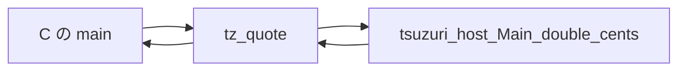

# ネイティブ連携 (C ABI)

`export def` は、C から呼べる関数を出します。シンボルは WebAssembly と同じ `tz_` 接頭辞で、`main` や C 標準の名前とぶつかりません。逆に、Tsuzuri から C の関数を呼ぶときは `extern def` です。どちらも、公開してよい型は限られています。

このページの C 言語連携の例は、macOS 環境の `clang` でオブジェクトファイルとヘッダーをリンクして実行検証しています（Windows 環境でのリンク動作は未検証です）。

## この記事のポイント

- スカラー、`bool`、`unit` の戻り値、一部の配列と文字列、スカラーだけのレコードが ABI に載ります。
- `--emit header` と `--emit object` を対にして、C からリンクします。
- 名前を書かない `extern` は `tsuzuri_host_<モジュール>_<名前>` になります。
- 所有して返ったバッファは、ホストが `tsuzuri_free` で 1 回だけ解放します。
- `--emit shared` で共有ライブラリを出し、`--emit bindings-cs`／`bindings-py`／`bindings-cpp` で C#、Python、C++ のバインディングを生成できます。
- C ヘッダーからの束縛の自動生成は、0.1.0 にはありません。

## 公開できる型

`export def add` の C 名は `tz_add` です。Tsuzuri の中ではカリー化された関数でも、C からは引数を一度に渡す普通の関数です。コンパイラが段階を適用するラッパーを出します。

| Tsuzuri | C ヘッダー |
| --- | --- |
| `i8` / `i16` / `i32` | `int32_t` |
| `i8u` / `i16u` / `i32u` | `uint32_t` |
| `i64` / `i64u` | `int64_t` / `uint64_t` |
| `f32` / `f64` | `float` / `double` |
| `bool` | `int32_t`。0 が false、非ゼロは true。戻り値は 0 か 1 |
| `unit` の戻り値 | `void`。`unit` を引数に取る関数は export できない（`E1008`）。引数なしの `export def f :: i64` は `int64_t tz_f(void)` になる |
| `ref [i64]` など、入力のバッファ | `const T *arg_ptr, int64_t arg_len` |
| 所有して返す配列や文字列 | 先頭引数の `tsuzuri_*_buffer *out`。戻り値は `void` |
| スカラーフィールドだけのレコード | 入力は `const tz_record_* *`、結果は先頭の out ポインタ |

`i128`、`f16`、`f128`、decimal、文字型、共用体、タプル、リスト、関数値、タスク、排他借用、戻り値としての借用は出せません。配列の要素として渡せるのは `i64`、`f64`、`ubyte` と、仕様が許す文字列です。固定長配列そのものは引数にできず、レコードで包みます。長さ 0 の配列フィールドも、ISO C に無いので拒否します。

`bool` と 8 / 16 bit 整数は、境界で 32 bit に正規化されます。レコードのフィールドも同様で、C コンパイラごとの構造体の詰め方には依存しません。生成される typedef 名は、モジュール名の長さと型引数で一意です。C の予約語になるフィールドには `tz_` が付き、それでも衝突すると `E1008` です。

`export` と `private` は別の軸です。`private export` はコンパイルエラーで、private な関数はヘッダーにも公開シンボルにも出ません。公開名 `tz_add` はプロジェクト全体で 1 つです。

## ヘッダーとオブジェクト

ライブラリは `Main.tz` でなくても出せます。実行ファイルにしたいときだけ、入口が要ります。WebAssembly のホスト向けには型付きのグルーを生成する `--emit bindings-js` があります（[WebAssembly への出力](webassembly.md#型付きのバインディングを生成する)）。native の C ホストは、従来どおりこのヘッダーを使います。

```sh
tsuzuri build Main.tz --emit header -o add.h
tsuzuri build Main.tz --emit object -o add.o
```

スカラーだけの `export def add` から出たヘッダーは、次のとおりでした。`tsuzuri_alloc` は、バッファを使わないモジュールには付きません。

```c
/* Generated by Tsuzuri. bool uses int32_t. Narrow integers use normalized 32-bit ABI values. */
#pragma once
#include <stdint.h>

#ifdef __cplusplus
extern "C" {
#endif

int64_t tz_add(int64_t arg0, int64_t arg1);

#ifdef __cplusplus
}
#endif
```

呼ぶ側は、ヘッダーを include してオブジェクトをリンクします。

```c
#include <stdio.h>
#include "add.h"

int main(void) {
    printf("%lld\n", (long long)tz_add(20, 22));
    return 0;
}
```

```sh
clang -O2 main.c add.o -o addhost
./addhost
```

実行結果:

```text
42
```

同じ計算を Tsuzuri 側で実行したときの標準出力も 42 です。

```tsuzuri run=42
export def add :: i64 -> i64 -> i64 = \left right ->
    left + right

add 20 22
```

実行結果:

```text
42
```

`--emit llvm` は、自分で `llc` や `clang` に渡す IR です。`--emit exe` は Tsuzuri の入口を持つ実行ファイルで、C の `main` と一緒にはリンクしません。C が `main` を持つときは object を使います。

## ホスト関数を import する

`extern def double_cents :: i64 -> i64` のネイティブシンボルは `tsuzuri_host_Main_double_cents` です。モジュール名の `.` は `_` になります。変換後に衝突すると `E1001` です。未使用の `extern` は、オブジェクトにもヘッダーの要求にも出ません。

```tsuzuri
extern def double_cents :: i64 -> i64

export def quote :: i64 -> i64 = \cents ->
    double_cents cents
```

生成ヘッダーには、ホストが定義すべきプロトタイプが入ります。`extern def now :: unit -> i64` のように `unit` を引数に取る `extern` は、`unit` が ABI から省かれ、C 側では `int64_t tsuzuri_host_Main_now(void)` になります（export の側では `unit` 引数は使えません）。

```c
int64_t tsuzuri_host_Main_double_cents(int64_t arg0);
int64_t tz_quote(int64_t arg0);
```

```c
#include <stdint.h>
#include <stdio.h>
#include "quote.h"

int64_t tsuzuri_host_Main_double_cents(int64_t cents) {
    return cents * 2;
}

int main(void) {
    printf("%lld\n", (long long)tz_quote(21));
    return 0;
}
```

実行結果:

```text
42
```

既存の C シンボルを、接頭辞なしで呼ぶときはリンク名を書きます。この宣言はヘッダーには出ません。プロトタイプはシステムのヘッダーが提供する、という前提です。`sqrt` に `3.0` と `4.0` を渡した実行結果は `5.0` でした。リンクには `-lm` が要ります。

```tsuzuri
extern "sqrt" def c_sqrt :: f64 -> f64

export def distance :: f64 -> f64 -> f64 = \x y ->
    c_sqrt (x * x + y * y)
```

```c
#include <stdio.h>
#include "distance.h"

int main(void) {
    printf("%.1f\n", tz_distance(3.0, 4.0));
    return 0;
}
```

シンボル名は 255 バイト以下の C 識別子です。`tz_`、`tsuzuri`、`__` で始まる名前と、`malloc` や `write` などランタイムが使う名前は `E1008` です。同じシンボルを複数の `extern` で宣言することはできますが、型が違うと `E1008` です。

呼び出しは副作用として扱われ、引数は左から右に評価されます。部分適用はできます。コンパイラが純粋な計算だと思って消すことはありません。`const` の初期化から `extern` を呼ぶことはできません。



### 不透明ハンドル

`extern type Counter` は、ホストが所有するポインタを Tsuzuri 側では値として扱う型です。リテラルでは作れず、`extern` の戻り値か、export の引数としてだけ受け取ります。Copy ではなく、代入はムーブです。破棄してもデストラクタは走りません。閉じる `extern` へ値で渡すのが、解放の契約です。

C では `typedef struct tz_handle_..._s *tz_handle_...` の 1 ポインタです。`ref` を付けても、ポインタのポインタにはならず、ハンドル値そのものを渡します。フィールドやバッファ要素には置けません。詳しくは [言語仕様の不透明ハンドル](../../../docs/language.md#不透明ハンドル) を見てください。

### 静的コールバック

`extern` の引数に関数型を書けます。渡せるのは、型パラメーターを持たないトップレベルのユーザー関数だけです。ラムダ、部分適用、ローカル、標準ライブラリ、別の `extern` は `E1008` です。

ホストが受け取るのは、その関数の C ABI ラッパーへの関数ポインタです。環境は捕捉しません。`extern` の呼び出しが返ったあとに、そのポインタを非同期で呼んではいけません。コールバックの引数はスカラーかハンドル、戻り値はスカラーか `unit` です。バッファやレコードは渡せません。この `extern` 自体は、部分適用できません。

## リンク入力

C が `main` を持たず、Tsuzuri の実行ファイルへホストのオブジェクトを足すときは、`--link`、`-l`、`-L` を使います。`build` の `--emit exe`、`run`、native の `test` だけが受けます。

```sh
tsuzuri build Main.tz --link host.o -L vendor -l sqlite3 -o shop
```

`Tsuzuri.toml` の `[native]` が先、コマンドラインがあとです。依存パッケージのリンク入力を入れるときは、依存の表に `native = true` を書きます。`native = true` を付けていない依存パッケージが `[native]` を持っていると、`E2000` になります。パスは相対パスで、絶対パスは拒否します。合計 256 個までです。未解決のシンボルが残ると、リンクの `E2002` です。

```toml
[native]
link = ["host.o", "vendor/libutil.a"]
libraries = ["sqlite3", "m"]
search = ["vendor"]
```

## 所有バッファと tsuzuri_alloc

所有して返す `[ubyte]` は、先頭の out 引数へ `{ ptr, len }` を書きます。ホストは使い終わったら `tsuzuri_free(tag.ptr)` を 1 回呼びます。`tsuzuri_free(NULL)` は何もしません。`tsuzuri_alloc(0)` は、少なくとも 1 バイトの一意なアドレスを返します。負のサイズや確保失敗はトラップです。

`export def make_tag :: i64 -> [ubyte]` を長さ 3 で呼ぶと、バイト列は `ABC` でした。ヘッダーは `void tz_make_tag(tsuzuri_ubyte_buffer *out, int64_t arg0);` で、バッファ型は `uint8_t *ptr` と `int64_t len` です。

```c
#include <stdio.h>
#include "tag.h"

int main(void) {
    tsuzuri_ubyte_buffer tag;
    tz_make_tag(&tag, 3);
    fwrite(tag.ptr, 1, (size_t)tag.len, stdout);
    fputc('\n', stdout);
    tsuzuri_free(tag.ptr);
    return 0;
}
```

実行結果:

```text
ABC
```

借用で渡した入力は、呼び出しのあいだだけ読まれます。Tsuzuri はそれを複製して所有したり、解放したりしません。負の長さ、null と正の長さ、整列違反は、本体の前にトラップします。null と長さ 0 は空です。ネイティブでは、ポインタが本当に確保済みかをコンパイラは検査できません。正しい領域を渡すのはホストの責任です。

`string` は `uint16_t` の列、`utf8string` は検証済みの `uint8_t` です。不正な UTF-8 はトラップし、暗黙の文字コード変換はしません。

## 共有ライブラリと各言語のバインディング

`--emit shared` は、公開 C ABI だけを export する共有ライブラリを出します。macOS では `.dylib`、Linux では `.so` です。Windows では `E2000` で、DLL の出力は [G10](../../../_features/G10-windows.md) の後です（`--emit object` をホストの DLL にリンクしてください）。

```sh
tsuzuri build quote --emit shared -o libquote.dylib
```

export するのは `tz_<name>` と、定義されていれば `tsuzuri_alloc`、`tsuzuri_free`、`tsuzuri_main`、`tsuzuri_alloc_stats`、`--trap-mode return` の `tsuzuri_try_<name>` だけです。ランタイムやリンクしたホストの関数は外から見えません。インストール名（macOS）と soname（Linux）は出力のファイル名で、利用側は `@rpath` などで探します。実行ファイルと同じく、`extern` の import はリンク時に解決します。`--link`、`-l`、`-L` と `[native]` を受け、未解決のシンボルが残ると `E2002` です。`--allocator counting` か `--trap-mode return`（`.trap.json` も書きます）を付けられます。`--allocator host` は `E2000` です。`export def` が無いと `E2004` です。

`--emit bindings-cs`、`bindings-py`、`bindings-cpp` は、同じソースから C#、Python、C++ のバインディングを生成します。WebAssembly の `bindings-js` と同じく LLVM を通さず、`-O` は無視します。出力の拡張子はそれぞれ `.cs`、`.py`、`.hpp` で、拡張子を除いたファイル名がライブラリの名前になります（`quote.py` は `libquote.dylib` を探します）。`--trap-info` などライブラリのビルド用のオプションを付けると `E2000` です。`--trap-mode return` を付けると、`tsuzuri_try_<name>` を呼ぶ版になります。ライブラリも `--trap-mode return` でビルドします。

| | C# | Python | C++ |
| --- | --- | --- | --- |
| 呼び出し | `[LibraryImport]` の `static partial` メソッド（.NET 8 以降、`AllowUnsafeBlocks`） | `ctypes` の `Library` のメソッド | `tsuzuri::<name>` 名前空間の `inline` 関数（C++20） |
| 整数・`bool` | `sbyte`〜`ulong`、`bool` | `int` と `bool` を範囲検査（範囲外は `OverflowError`） | `std::int8_t`〜`std::uint64_t`、`bool` |
| 借用入力 | `ReadOnlySpan<long>` / `<double>` / `<byte>`、`ReadOnlySpan<char>`（`string`）、UTF-8 の `ReadOnlySpan<byte>` | バッファか数の列、`str`、`str` か `bytes` | `std::span<const T>`、`std::u16string_view`、UTF-8 の `std::string_view` |
| 所有結果 | `SafeHandle` の `OwnedBuffer<T>`、`OwnedString`、`OwnedUtf8String`（`Dispose` か finalizer で `tsuzuri_free`。`ToArray()`・`ToString()` は複製の間ハンドルを参照して解放を止める。`Span` は結果を `using` などで保持している間だけ有効） | `array.array`、`bytes`、`str` に複製して、すぐ `tsuzuri_free` | `buffer<T>`、`string_buffer`、`utf8string_buffer`（デストラクターで `tsuzuri_free`） |
| レコード | C の配置の `struct`。32-bit に正規化したフィールドは型付きのプロパティ、固定長配列は `[InlineArray]` | `dataclass`（固定長配列は `tuple`） | C ヘッダーの `struct` |
| ハンドル | `record struct`（`nint Value`） | `value` を持つ不変の `dataclass` | C ヘッダーの `typedef` |
| トラップ | プロセスが終わる。`--trap-mode return` なら `TsuzuriTrapException` | プロセスが終わる。`--trap-mode return` なら `TsuzuriTrap` | プロセスが終わる。`--trap-mode return` なら `tsuzuri::<name>::trap_error` |

不正な UTF-8 はトラップになるので、3 つとも呼ぶ前に検査して、C# は `ArgumentException`、Python は `ValueError`、C++ は `std::invalid_argument` を投げます。トラップの例外は `--trap-mode return` の状態 1 で、`site` は `.trap.json` の ID、`kind` はトラップの種類です。同じスレッドでの入れ子の呼び出し（状態 2）は、C# の `InvalidOperationException`、Python の `RuntimeError`、C++ の `std::logic_error` です。

次のモジュールを例にします。

```tsuzuri
export def total :: ref [i64] -> i64 = \prices ->
    Array.sum prices

export def label :: ref string -> string = \name ->
    clone_string name + "!"

export def per_unit :: i64 -> i64 -> i64 = \price count ->
    price / count
```

Python は、`.py` の隣の `libquote.dylib` を読み込みます。

```sh
tsuzuri build quote --emit bindings-py -o quote.py
python3 -c "import quote; lib = quote.load(); print(lib.total([1, 2, 39]), lib.label('tea'))"
```

実行結果:

```text
42 tea!
```

C# は、生成した `quote.cs` をプロジェクトに入れます。ライブラリはアプリの隣に置くか、`NativeLibrary.SetDllImportResolver` で場所を教えます。`label` の結果は `using` で解放します。

```csharp
using System;
using Tsuzuri.Bindings;

Console.WriteLine(Quote.total([1, 2, 39]));
using var label = Quote.label("tea");
Console.WriteLine(label.ToString());
```

実行結果:

```text
42
tea!
```

C++ は、同じソースの C ヘッダー `quote.h` を隣に置き、`quote.hpp` を include します。

```sh
tsuzuri build quote --emit header -o quote.h
tsuzuri build quote --emit bindings-cpp -o quote.hpp
clang++ -std=c++20 main.cpp -I . libquote.dylib -Wl,-rpath,. -o quote_cpp
```

```cpp
#include <iostream>
#include <vector>
#include "quote.hpp"

int main() {
    const std::vector<std::int64_t> prices{1, 2, 39};
    std::cout << tsuzuri::quote::total(prices) << '\n';
    const auto label = tsuzuri::quote::label(u"tea");
    std::cout << label.size() << '\n';
}
```

実行結果:

```text
42
4
```

`--trap-mode return` で作ったライブラリとバインディングでは、トラップが例外になり、次の呼び出しは普通に動きます。`site` の値は `.trap.json` の ID です。

```sh
tsuzuri build quote --emit shared --trap-mode return -o libquote_trap.dylib
tsuzuri build quote --emit bindings-py --trap-mode return -o quote_trap.py
```

```python
import quote_trap

lib = quote_trap.load()
try:
    lib.per_unit(10, 0)
except quote_trap.TsuzuriTrap as error:
    print(error)
print(lib.per_unit(10, 4))
```

実行結果:

```text
trap: integer division by zero (site 82)
2
```

## ホスト提供の allocator

`--allocator host` は、文字列、配列、`Vec`、クロージャの環境、`tsuzuri_alloc` を含むヒープを、ホストの 3 関数へ向けます。`object`、`llvm`、`header`、WASM だけで、実行ファイルや `--trap-mode return` とは排他です。

```c
void *tsuzuri_host_alloc(uint64_t size, uint64_t align);
void tsuzuri_host_free(void *ptr, uint64_t size, uint64_t align);
void *tsuzuri_host_realloc(void *ptr, uint64_t old_size, uint64_t new_size, uint64_t align);
```

`align` は 16 で、戻り値も 16 の倍数です。null や揃っていない戻り値は、その場で確保失敗のトラップになり、再試行はありません。各ブロックの先頭 16 バイトは要求サイズ用なので、`size` は要求より 16 大きく、17 以上です。Tsuzuri が使うポインタは、戻り値の 16 バイト先です。ホスト側へ返却された所有バッファは、通常どおり `tsuzuri_free` を呼び出して解放します。`tsuzuri_host_free` を直接呼び出すと、先頭の 16 バイト分のアライメント・ヘッダー情報がずれてしまうため呼び出さないでください。

これらの 3 関数は、`Task.parallel` の並列ワーカーから複数のスレッドで同時に呼び出される可能性があります。Tsuzuri 側ではロックを取得しないため、ホスト側でスレッドセーフに実装してください。また、アロケータ関数の中から Tsuzuri の関数を再帰的に呼び出したり、`longjmp` や C++ の例外を送出して関数を抜けたりしてはいけません。

`--allocator counting` は system allocator を同じ 16 バイトヘッダーで包み、確保回数、解放回数、現在の要求バイト、その最大を数えます。`tsuzuri_alloc_stats` で読みます。

`--freestanding` は、C ライブラリ無しの native object / LLVM IR / header です。`--allocator host` が必須で、参照してよい外部はホストの allocator、宣言した `extern`、`memcpy` / `memmove` / `memset` / `memcmp`、compiler-rt の整数ヘルパーだけです。IO、OS API、タスク、`Debug`、プログラム引数は `E2000` です。トラップは `llvm.trap` だけで、`--trap-info` や `--debug-output` は使えません。

契約の詳細は [言語仕様のホスト提供の allocator](../../../docs/language.md#ホスト提供の-allocator) を見てください。

## スレッドとホストの責任

`Task.parallel` は、複数のネイティブスレッドから `extern` を同時に呼ぶことがあります。ホスト関数をスレッド安全にするか、並列タスクの中から呼ばないでください。WASM の現行の Task は、threads を付けない限り逐次です。

export とコールバックは、Tsuzuri 側の大域的な可変状態を持ちません。ホストが複数スレッドから export を呼ぶこと自体は、Tsuzuri のロックを要しません。ホストが渡したバッファを、呼び出しのあいだに別スレッドが書き換えるのは、契約違反です。

ホストは信頼境界です。例外の unwind、呼び出しが返ったあとのポインタの保持、回復不能な失敗から Tsuzuri のフレーム越しに戻ることはしません。`--trap-mode return` を指定すると、各エクスポート関数に対応する `tsuzuri_try_<name>` がヘッダーに追加され、トラップ発生時にプロセスを終了させる代わりにステータスコード 1 を返せます。その呼び出し中に確保されたヒープ領域は境界処理によって自動解放され、デストラクタは実行されません。オブジェクトを埋め込んだホストは、自分でシグナルハンドラを用意しない限り、スタック枯渇を Tsuzuri のメッセージとしては受け取りません。

GUI は言語の一部ではありません。デスクトップの画面は、ホストがオブジェクトを呼ぶ側に置きます。

## C ヘッダーからの自動生成は未実装

C のヘッダーを読んで `extern` 宣言を生成する機能は、Tsuzuri 0.1.0 にはありません。計画は [E11](../../../_features/E11-c-bindgen.md) にあり、この版では使えません。今は、呼ぶ関数だけを `extern def` か `extern "シンボル" def` で手書きします。

生成されるのは、Tsuzuri から C へ出すヘッダーのほうです。方向が逆なので、システムの `sqrt` を使う例のように、C 側の宣言はホストのヘッダーに残します。

## まとめ

- `tz_` の export と、`tsuzuri_host_` の import が、ネイティブの境界です。
- ヘッダーとオブジェクトを対で出し、C の `main` とリンクします。
- リンク名を書けば `sqrt` のような既存シンボルを、接頭辞なしで呼べます。
- 所有バッファは `tsuzuri_free`、ヒープの差し替えは `--allocator host` です。
- `--emit shared` の共有ライブラリを、生成した C#、Python、C++ のバインディングから呼べます。
- ヘッダーから `extern` を自動生成する機能は、まだありません。

## 関連項目

- [WebAssembly への出力](webassembly.md)
- [コンパイラ オプション](option.md)
- [コンパイラの使い方](usage.md)
- [所有権とムーブ](../ownership-and-memory/ownership.md)
- [言語仕様の公開 ABI](../../../docs/language.md#公開-abi)
- [言語仕様のホスト関数](../../../docs/language.md#ホスト関数のインポート)
- [言語リファレンスの目次](../index.md)
