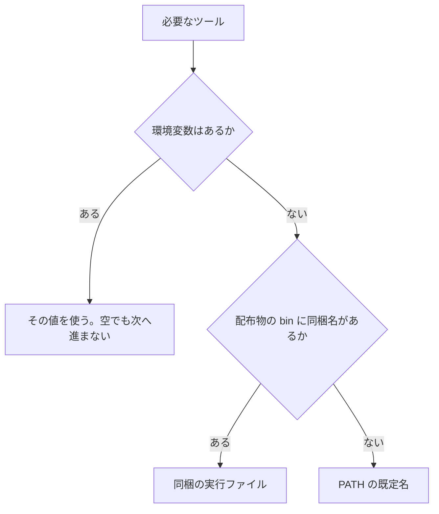

# コンパイラ オプション

`tsuzuri` のフラグは、サブコマンドごとに使えるものが違います。サポートされていないオプションの組み合わせを指定した場合は、コード生成へ進む前に `E2000` でエラーになります。同じソースでも、ターゲットや最適化を変えると成果物が変わるので、既定値を知っておくと再現しやすくなります。

このページの表は、`src/main.rs` のヘルプと引数解析、`BuildOptions::validate` で確認したものです。コマンドの流れ自体は [コンパイラの使い方](usage.md) を見てください。

## この記事のポイント

- 最適化の既定は `-O3` です。`test` だけ既定が `-O0` です。fast-math は使いません。
- `--emit` の既定は、native なら `exe`、`wasm32` / `wasm64` なら `wasm` です。
- リンク入力は、ネイティブ実行ファイルの `build`、`run`、`test` だけが受けます。
- フラグの重複や、サブコマンドとの不一致は終了コード 2 の `E2000` です。
- ツールの場所は、環境変数、配布物の `bin/`、PATH の順です。

## どのサブコマンドが受け付けるか

`lsp` は引数を取りません。`new` はディレクトリと `--namespace` だけ、`toolchain info` は 2 語ぴったりです。それ以外は、次の表のとおりです。`○` が受け付け、空欄は `E2000` です。

| オプション | check | build | run | test | doc | fmt |
| --- | --- | --- | --- | --- | --- | --- |
| `--json` | ○ | ○ | ○ | ○ | ○ | ○ |
| `--deny-warnings` | ○ | ○ | ○ | ○ | ○ | |
| `--warn implicit-copy` | ○ | ○ | ○ | ○ | ○ | |
| `-o` / `--output` | | ○ | | | ○（必須） | |
| `--target` | | ○ | | ○ | | |
| `--emit` | | ○ | | | | |
| `-O0`〜`-O3` | | ○ | ○ | ○ | | |
| `--cpu` | | ○ | ○ | | | |
| `--no-cache` | | ○ | ○ | | | |
| `-g` / `--debug-info` | | ○ | ○ | | | |
| `--debug-output` | | ○ | ○ | | | |
| `--trap-info` | | ○ | ○ | | | |
| `--trap-mode` | | ○ | | | | |
| `--allocator` | | ○ | | | | |
| `--freestanding` | | ○ | | | | |
| `--wasm-feature` | | ○ | | | | |
| `--wasm-host` | | ○ | | | | |
| `--wasm-max-memory` | | ○ | | ○ | | |
| `--wasm-stack-size` | | ○ | | ○ | | |
| `--link` / `-l` / `-L` | | ○ | ○ | ○ | | |
| `--list` / `--filter` / `--index` | | | | ○ | | |
| `--check` | | | | | | ○ |

`--deny-warnings` と `--warn` は、ヘルプでは `check` / `build` / `run` が中心です。実装では警告の表示が `doc` と `test` の前にも走るので、この 2 つでも効きます。`fmt` は明示的に拒否します。

同じオプションを 2 回以上指定すると `E2000` になります。複数回の指定が許可されているのは `--link`、`-l`、`-L`、`--index`、および異なる機能名を指定した `--wasm-feature` のみです。`--link`、`-l`、`-L` の合計は最大 256 個までです。

未知のフラグは `unknown option '...'; use --help` です。値を取り忘れると `--output needs a value` のように、そのフラグの名前で止まります。

## 出力とターゲット

| オプション | 既定 | 意味 |
| --- | --- | --- |
| `-o` / `--output PATH` | 入力の拡張子を差し替えたパス | 成果物、または `doc` のディレクトリ。親は作られます |
| `--target native\|wasm32\|wasm64` | `native` | `wasm64` は 64-bit の線形メモリです |
| `--emit exe\|object\|llvm\|header\|wasm\|wgsl\|bindings-js` | native は `exe`、WASM は `wasm` | 何を残すか |

拡張子は、native の実行ファイルが macOS / Linux で空、Windows で `.exe`、オブジェクトが `.o` または Windows の `.obj`、LLVM IR が `.ll`、ヘッダーが `.h`、WASM が `.wasm`、WGSL が `.wgsl`、JavaScript のバインディングが `.mjs` です。

`--emit bindings-js` は `--target wasm32` だけで使え、`<name>.mjs` の隣に TypeScript 宣言 `<name>.d.mts` も書きます。`-o` は `.mjs` で終わる必要があります。`-O` は受け付けて無視し、`--trap-info`、`--debug-info`、`--debug-output`、`--wasm-feature`、`--allocator` は `.wasm` のビルドに付けるよう `E2000` で求めます。使い方は [WebAssembly への出力](webassembly.md#型付きのバインディングを生成する) にあります。

`--emit exe` は `--target native`、`--emit wasm` は `wasm32` か `wasm64` が必要です。逆にすると、次の 1 文で止まります。

```text
<command line>:1:1: error[E2000]: '--emit exe' requires '--target native'; '--emit wasm' requires '--target wasm32' or '--target wasm64'
```

`wgsl` は実験的な GPU カーネル用です。`--target`、`-O`、`--cpu`、デバッグ、WASM 機能とは一緒に使えません。

## 最適化と CPU

| オプション | 既定 | 意味 |
| --- | --- | --- |
| `-O0` `-O1` `-O2` `-O3` | `build` / `run` は `-O3`、`test` は `-O0` | LLVM の最適化。fast-math や再結合は使いません |
| `--cpu generic\|native` | `generic` | native の実行ファイルとオブジェクト。`native` はこの機械の命令セットで、古い CPU では動きません |

`check` は最適化も CPU も見ません。型が通れば、どの `-O` でも同じ診断です。`doc` と `fmt` も最適化を受け付けません。`test` は `-O` を受け、`--cpu` は拒否します。

`--cpu native` は、native の `exe` と `object` だけです。`llvm`、`header`、WASM では `E2000` です。対応するホストは x86、x86_64、arm、aarch64 です。

整数の折り返し、NaN、符号付きゼロは、`-O3` でも変えません。次の関数は `-O0` でも `-O3` でも 42 です。

```tsuzuri run=42
def add :: i64 -> i64 -> i64 = \left right ->
    left + right

add 20 22
```

実行結果:

```text
42
```

## 診断とデバッグ

| オプション | 既定 | 意味 |
| --- | --- | --- |
| `--json` | オフ | 診断を stderr の 1 行 1 JSON にする |
| `--deny-warnings` | オフ | 警告があれば、コード生成や実行の前に終了コード 1 |
| `--warn implicit-copy` | オフ | 配列とリストの暗黙コピー `W1006` を出す。生成コードは変わらない |
| `-g` / `--debug-info` | オフ | ソースレベルの DWARF。`header` では不可 |
| `--debug-output` | オフ | WASM の `Debug` 出力 import を有効にする。native は常に書く |
| `--trap-info` | `run` はオン、`build` はオフ | トラップ位置と `<output>.trap.json`。`header` では不可 |
| `--trap-mode return` | オフ | native の `object` / `llvm` / `header`。各 export に `tsuzuri_try_<name>` を足す |

`--trap-mode return` は、`object` と `llvm` では `--trap-info` も有効にします。`header` では位置表を出さないので、`--trap-info` とは組み合わせません。戻り値は 0 が成功、1 がトラップ、2 が同じスレッドでの再入です。詳しくは [言語仕様のトラップ位置](../../../docs/language.md#トラップ位置) を見てください。

`--json` のフィールドは [診断メッセージとエラーコード](diagnostics.md) にあります。引数エラーも同じコードで、パスは `<command line>` です。

```text
{"severity":"error","code":"E2000","message":"missing .tz, .tt, or .tc input or project directory; use --help","path":"<command line>","span":{"start":0,"end":0,"line":1,"column":1,"end_line":1,"end_column":1}}
```

このときの終了コードは 2 でした。

## WebAssembly

| オプション | 既定 | 制約 |
| --- | --- | --- |
| `--wasm-max-memory SIZE` | 16 MiB | `wasm32` は 4 GiB − 64 KiB まで、`wasm64` は 16 GiB まで。64 KiB の倍数 |
| `--wasm-stack-size SIZE` | 1 MiB | WASM 出力だけ。16 の倍数で、64 KiB 以上。メモリ上限はスタック + 64 KiB 以上 |
| `--wasm-feature simd128` | オフ | `wasm32` / `wasm64` の `object`、`llvm`、`wasm` |
| `--wasm-feature threads` | オフ | `wasm32` の `object` か `wasm`。WASI や `--allocator host` とは排他 |
| `--wasm-host wasi` | オフ | `wasm32` の `object` か `wasm`。既定の wasm32 は OS API を拒否します |

`SIZE` はバイト数か、`KiB` / `MiB` / `GiB` です。`64MB` のような 10 進の単位は受けません。`67108864` と `64MiB` は同じです。

`--wasm-stack-size` は、リンク済みの WASM にだけ埋めます。オブジェクトや LLVM IR を自分でリンクするときは、`wasm-ld -z stack-size` を使います。`test` でメモリやスタックを変えるときは、`--target wasm32` か `wasm64` が必要です。

`Tsuzuri.toml` の `[wasm]` は、コマンドラインが省略した値の既定になります。コマンドラインが優先です。マニフェストの値だけが不正なときは、終了コード 1 で、メッセージの末尾に `(after applying the root package's [wasm])` が付きます。

呼び出し方とメモリの渡し方は [WebAssembly への出力](webassembly.md) にまとめています。

## リンクと allocator

| オプション | 既定 | 意味 |
| --- | --- | --- |
| `--link PATH` | なし | ホストのオブジェクトか静的ライブラリ。繰り返せる |
| `-l NAME` | なし | システムライブラリ名。例は `-l sqlite3`。`lib` や拡張子は付けない |
| `-L DIR` | なし | `-l` の探索ディレクトリ |
| `--allocator system\|host\|counting` | `system` | `object`、`llvm`、`header`、WASM のヒープ |
| `--freestanding` | オフ | C ライブラリ不要の native `object` / `llvm` / `header`。`--allocator host` が必須 |
| `--no-cache` | キャッシュ有効 | `build` と `run` のキャッシュを読まない、書かない |

`[native]` の `link`、`libraries`、`search` が先で、コマンドラインがそのあとに続きます。実行ファイル以外、たとえば `--emit object` や WASM にリンク入力を付けると拒否されます。

```text
link inputs require a native executable; remove --link, -l and -L or build the native target with --emit exe
```

`--allocator host` は、ホストが定義する `tsuzuri_host_alloc`、`tsuzuri_host_free`、`tsuzuri_host_realloc` を呼びます。WASM ではモジュール `tsuzuri_heap` の `alloc`、`free`、`realloc` として import します。`counting` は `tsuzuri_alloc_stats` で回数を読めます。どちらも `--emit exe`、`wgsl`、`--trap-mode return` とは排他です。`host` は `--wasm-feature threads` とも排他です。

`--freestanding` は IO、OS API、タスク、`Debug`、プログラム引数を `E2000` で拒否します。`--trap-info` と `--debug-output` とも一緒には使えません。トラップは `llvm.trap` だけです。

## 組み合わせがエラーになる場合

引数解析の時点で検出される構文・指定誤りは終了コード 2、ビルド処理中にソースコードや設定を検証して検出されるものは終了コード 1（エラーコードはいずれも `E2000`）になります。遭遇しやすい主な組み合わせエラーを以下にまとめます。

| 条件 | メッセージの要点 |
| --- | --- |
| `--no-cache` を `check` などに付ける | `--no-cache is only valid with build or run` |
| `--wasm-feature` を `build` 以外に付ける | `--wasm-feature is only valid with build` |
| `threads` なのに wasm32 の object / wasm でない | `--wasm-feature threads requires wasm32 object or WASM output` |
| `simd128` が header や native | `--wasm-feature simd128 requires wasm32 or wasm64 object, LLVM IR, or WASM output` |
| WASI と threads | `--wasm-host wasi cannot be combined with --wasm-feature threads` |
| WASI が wasm32 の object / wasm でない | `--wasm-host wasi requires wasm32 object or WASM output` |
| メモリ上限が 64 KiB の倍数でない、または上限超え | `at most 4 GiB - 64 KiB on wasm32` / `at most 16 GiB on wasm64` |
| スタックがメモリに収まらない | `must be at least the stack size plus 64 KiB` |
| `--cpu native` が exe / object でない | `'--cpu native' requires native executable or object output` |
| `--emit bindings-js` が `--target wasm32` でない | `'--emit bindings-js' requires '--target wasm32'` |
| `--emit bindings-js` に `.wasm` 用のオプション | `--trap-info is not valid for bindings output; pass it when building the .wasm`（各オプション名で同じ形） |
| `--emit bindings-js` の `-o` が `.mjs` でない | `bindings output must end with '.mjs'; declarations are written next to it as '<name>.d.mts'` |
| `--freestanding` が exe | `--freestanding requires object, LLVM IR, or header output` |
| `--freestanding` なのに allocator が host でない | `--freestanding requires --allocator host` |
| `fmt` に `-O` や `--deny-warnings` | `fmt does not use optimization, CPU tuning, or compiler warning options` |
| `check` に `-O` | `check does not use an optimization level` |
| `test` に `--cpu` | `test does not use CPU tuning` |
| `doc` に `-o` が無い | `doc requires -o or --output with an output directory` |
| `--filter` を `test` 以外に付ける | `--filter, --list, and --index are only valid with test` |
| 入力が 2 つ | `pass one .tz, .tt, or .tc file or project directory` |
| WASM 機能名が `relaxed-simd` など | `supported WASM features are 'simd128' and 'threads'; relaxed SIMD is not supported` |

ビルドがソースを読んでから出す `E2000` には、既定の wasm32 で `File` や `Env` などに到達した場合と、`--freestanding` で IO やタスクに到達した場合があります。前者は、native にするか、`--wasm-host wasi` にするか、ホスト不要の `Path` と `Random.Pcg` に限る、というメッセージです。

> [!WARNING]
> 終了コード 2 の `E2000` は、まだファイルを書いていません。終了コード 1 の `E2000` は、解析やリンクの途中です。既存の成果物は、コンパイルエラーでは置き換えません。

## 環境変数

ツールは次の順で決まります。空の環境変数も「設定済み」なので、そのときは配布物や PATH へ進みません。



| 変数 | 既定の名前 | 同梱の名前 | 用途 |
| --- | --- | --- | --- |
| `TSUZURI_CLANG` | `clang` | `tsuzuri-clang` | コンパイルとリンク。LLVM 17 以降 |
| `TSUZURI_WASM_LD` | `wasm-ld` | `wasm-ld` | WebAssembly のリンク |
| `TSUZURI_LLVM_LINK` | `llvm-link` | `llvm-link` | macOS で、タスクを含むデバッグ用オブジェクト |
| `TSUZURI_DSYMUTIL` | `dsymutil` | `dsymutil` | macOS のデバッグ実行ファイル |
| `TSUZURI_CACHE_DIR` | OS ごとのキャッシュ | なし | ビルドキャッシュのルート |

`node` は PATH だけです。WASM テスト用の環境変数はありません。

`TSUZURI_CPU_FORCE` はコンパイル時のオプションではなく、生成されたネイティブバイナリが実行開始時に CPU 機能を自動判定する際に読み込む実行時環境変数です。指定可能な値は `baseline`、`sse4.2`、`avx2`、`avx512`、`sve`、`sve2` です。未知の名前や現在の CPU が対応していない機能レベルを指定した場合は、`Tsuzuri CPU runtime: requested variant is unavailable or unknown` を出力してプログラムを終了します。テスト目的で実行バージョンを固定したい場合を除き、通常は設定不要です。

キャッシュのキーには、上の 4 つのツール変数に加えて `PATH`、`SDKROOT`、`MACOSX_DEPLOYMENT_TARGET`、Windows の `INCLUDE` / `LIB`、`SOURCE_DATE_EPOCH`、`DEVELOPER_DIR` などが入ります。同じソースでも、ツールを差し替えるとキャッシュは別エントリになります。

## まとめ

- 使えるフラグはサブコマンドで決まります。迷ったら `tsuzuri --help` と、この表の空欄を見てください。
- 既定は native、`-O3`、generic CPU、system allocator、キャッシュ有効です。`test` だけ `-O0` です。
- WASM のメモリとスタックは、コマンドラインが `[wasm]` より優先します。
- 組み合わせの `E2000` は、引数なら終了コード 2、ソースを見たあとなら 1 です。
- ツールは環境変数、配布物、PATH の順です。空の環境変数も優先されます。

## 関連項目

- [コンパイラの使い方](usage.md)
- [コンパイラ ディレクティブ](directives.md)
- [診断メッセージとエラーコード](diagnostics.md)
- [WebAssembly への出力](webassembly.md)
- [ネイティブ連携 (C ABI)](native-interop.md)
- [言語仕様の公開 ABI](../../../docs/language.md#公開-abi)
- [言語リファレンスの目次](../index.md)
