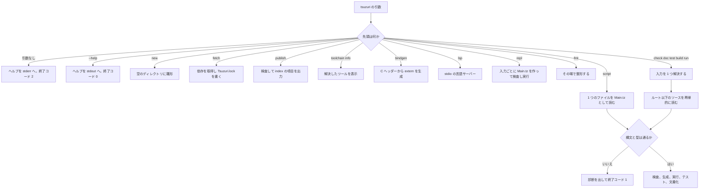

# コンパイラの使い方

`tsuzuri` は、`.tz` / `.tt` / `.tc` を型検査し、LLVM でネイティブ実行ファイルか WebAssembly を出すコマンドです。サブコマンドは少なく、入力はファイルかディレクトリの 1 つだけです。暗黙の探索を減らし、同じソースから同じ成果物が出るようにするためです。

このページでは、配布物とソースからの導入、各サブコマンド、入力の決まり方、キャッシュ、終了コードを扱います。フラグの一覧は [コンパイラ オプション](option.md) に分けています。

## この記事のポイント

- 配布物を使うときは、`bin/` 全体ではなく `tsuzuri` だけを PATH に足します。
- ディレクトリを渡すと `Main.tz` が入口になります。ファイルを渡すと、その親がプロジェクトルートです。
- `check` はコードを出しません。`run` は実行し、`build` はファイルを残します。
- `repl` は、宣言と式を 1 つずつ受け取り、入力ごとにプログラムを作り直して検査し、実行します。
- `script` は、名前を問わない 1 つのファイルを `Main.tz` として `run` と同じように実行し、後ろの引数をプログラムへ渡します。先頭の `#!` 行で、ファイル自体を実行できます。
- 成果物のキャッシュは `build`・`run`・`script`・`repl`、構文解析の結果のキャッシュは `check`・`build`・`run`・`script`・`test`・`bench`・`doc` の既定です。`TSUZURI_CACHE_DIR` と `--no-cache` で制御します。
- git と registry の依存は `fetch` だけが取得します。`publish` は registry に載せる項目を出力します。ほかのサブコマンドは `git` もネットワークも使いません。
- 引数の誤りは終了コード 2、ソースや実行の失敗は 1、成功は 0 です。

## コマンドの流れ

`script` は、ファイルより後ろの引数をプログラムのものとして最初に取り分けます。引数なしと `--help` は、解析に入る前に分かれます。`new`、`fetch`、`publish`、`bindgen`、`repl`、`toolchain info` も、ほかのサブコマンドの引数の解析に入る前に分かれます。`new`、`bindgen`、`toolchain info` はソースを読む前に終わります。`repl` はプロジェクトを読まず、標準入力と `:load` のファイルから受け取ったソースだけを検査します。



`build` は省略できます。先頭が既知のサブコマンドでなければ、その引数は `build` として扱われます。

## 配布物を使う

LLVM を自分で入れずにコンパイラを使うときは、ホスト別の配布物を展開します。macOS と Linux は `tsuzuri-<version>-<host>.tar.gz`、Windows は同じ名前の `.zip` です。`<version>` は `0.1.0` のように、`tsuzuri --version` の版です。`<host>` は `darwin-arm64`、`darwin-x64`、`linux-x64`、`linux-arm64`、`win32-x64`、`win32-arm64` です。

アーカイブの最上位には、ディレクトリ `tsuzuri-<version>-<host>/` だけが含まれます。コンパイラは、自分の実行ファイルから 2 つ上に `manifest.json` があるとき、そこを配布物のルートとみなします。Clang や `wasm-ld` は、環境変数、この `bin/`、PATH の順で探します。

```text
tsuzuri-0.1.0-darwin-arm64/
  manifest.json
  bin/       tsuzuri  tsuzuri-clang  clang  wasm-ld  llvm-link  dsymutil
  lib/
  share/     lldb/tsuzuri_lldb.py  natvis/tsuzuri.natvis
  zig/
  licenses/
```

Linux の `bin/` には `llvm-link` と `dsymutil` はありません。Windows の共有ライブラリは `bin/` にあります。`share/lldb/tsuzuri_lldb.py` は LLDB に Tsuzuri の値を表示させる formatter です（[デバッグ](debugging.md#lldb-で-tsuzuri-の値を表示する)）。`share/natvis/tsuzuri.natvis` は、`-g` の object を MSVC のリンカーでリンクするときに `/NATVIS` で PDB へ埋め込む Visual Studio 用の表示です（[Windows（PDB と natvis）](debugging.md#windowspdb-と-natvis)）。

同じディレクトリに置いた `<archive>.sha256` は、`shasum -a 256 -c`（Linux は `sha256sum -c`）で読めます。これはダウンロード時の破損を検査するものです。配布元そのものの真正性の検証は別の手段で行います。

macOS と Linux では、PATH に追加するのは `tsuzuri` へのシンボリックリンクだけにします。`bin/` ディレクトリ全体を PATH に追加すると、同梱の `clang` や `wasm-ld` がシステムのツールを覆い隠してしまうためです。

```sh
v=0.1.0
host=darwin-arm64
shasum -a 256 -c "tsuzuri-$v-$host.tar.gz.sha256"
mkdir -p "$HOME/.local/share/tsuzuri" "$HOME/.local/bin"
tar -xzf "tsuzuri-$v-$host.tar.gz" -C "$HOME/.local/share/tsuzuri"
ln -sf "$HOME/.local/share/tsuzuri/tsuzuri-$v-$host/bin/tsuzuri" "$HOME/.local/bin/tsuzuri"
tsuzuri toolchain info
```

`$HOME/.local/bin` が PATH にないときは、シェルの設定に足してください。`host` は、自分の OS と CPU に合わせます。Linux では `sha256sum -c` を使い、archive 名の `darwin-arm64` を `linux-x64` などに変えます。

ブラウザーで保存した macOS のファイルには隔離属性が付くことがあります。チェックサムの確認後に、展開したディレクトリへ `xattr -dr com.apple.quarantine` を実行してください。`curl` で取ったファイルには、通常この属性は付きません。

Linux の同梱 LLVM は、配布を作った Ubuntu 24.04 以上の glibc を要求します。コンパイラが出すネイティブ実行ファイルは musl で静的にリンクされます。

Windows は `.zip` です。`Get-FileHash -Algorithm SHA256` の値を `.sha256` と比べ、`%LOCALAPPDATA%\Tsuzuri\` へ展開し、その `bin` を利用者の PATH に足します。symlink は権限が要るため、macOS のような `tsuzuri` だけのリンクは使いません。`bin` を PATH に足すと、同梱ツールがシステムの `clang` を隠す点は同じです。この展開手順は配布物の契約で、Windows 上での実行確認は CI が担当します。

アンインストール時は、シンボリックリンクまたは PATH の設定と、展開したディレクトリを削除します。バージョンごとにディレクトリが分かれているため、シンボリックリンクの向き先を変えるだけでバージョンを切り替えられます。

`tsuzuri toolchain info` は、選ばれたツールを標準出力へ書きます。開発用ビルドでは `distribution: none` になります。

```text
tsuzuri 0.1.0
distribution: none
TSUZURI_CLANG: path /usr/bin/clang (Apple clang version 21.0.0 (clang-2100.3.34.2))
TSUZURI_WASM_LD: path /opt/homebrew/Cellar/lld/23.1.1/bin/lld (unavailable)
TSUZURI_LLVM_LINK: path llvm-link (not found)
TSUZURI_DSYMUTIL: path /usr/bin/dsymutil (Apple LLVM version 21.0.0)
node: path /opt/homebrew/Cellar/node@20/20.19.6/bin/node (v20.19.6)
```

各行の `env` / `bundled` / `path` は、ツールが環境変数、配布物の同梱バイナリ、PATH のどれによって解決されたかを示します。見つからないツールは `(not found)`、`--version` の取得に失敗したツールは `(unavailable)` と表示されます。このコマンド自体はツールの場所を確認するだけでビルドは行わず、終了コード 0 で完了します。

## ソースからビルドする

リポジトリからコンパイラを作るときの要件は次のとおりです。

| もの | 版の目安 | 用途 |
| --- | --- | --- |
| Rust | 1.85 以降 | コンパイラ本体。`Cargo.toml` の `rust-version` |
| LLVM / Clang | 17 以降 | ネイティブのリンクと、WASM のオブジェクト |
| `wasm-ld` | Clang と同じ世代の LLD | WebAssembly のリンク |
| Node.js | 20 以降 | WASM のテストと、このリファレンスの検証 |

`tsuzuri test --target wasm64` は、Node.js 24 以降の memory64 を要求します。Python 3.9 以降は、リポジトリの参照実装テスト用です。コンパイラを使うだけなら要りません。

ツールの場所は `TSUZURI_CLANG`、`TSUZURI_WASM_LD`、`TSUZURI_LLVM_LINK`、`TSUZURI_DSYMUTIL` で指定できます。未設定なら PATH の `clang`、`wasm-ld`、`llvm-link`、`dsymutil` です。

### macOS

```sh
brew install llvm lld
export PATH="$(brew --prefix llvm)/bin:$(brew --prefix lld)/bin:$PATH"
cargo build --release
```

成果物は `target/release/tsuzuri` です。Apple の `clang` だけでは WASM ターゲットが足りないことがあるので、Homebrew の LLVM を PATH の前に置きます。

### Linux

Ubuntu / Debian では、パッケージの Clang と LLD で足ります。

```sh
sudo apt-get update
sudo apt-get install clang lld
cargo build --release
```

### Windows

Windows SDK と、Visual Studio Build Tools の MSVC C++ ツールセット、それに LLVM の `clang` を用意します。Developer PowerShell で `cargo build --release` します。

コンパイラがネイティブコードを出すとき、ホストが ARM64 なら `--target=aarch64-pc-windows-msvc`、それ以外なら `--target=x86_64-pc-windows-msvc` を Clang に渡します。Windows 上でその Clang が通るかは、Windows の CI が確認します。

## VS Code 拡張

拡張機能を入れると、コンパイラ、LLVM、リンカー、デバッガーが同梱されます。追加のランタイムは要りません。対応は VS Code 1.103 以降で、macOS の x64 と Apple シリコン、Linux（glibc）の x64 と ARM64、Windows x64 です。Windows ARM64 は編集と実行に対応し、デバッグは未対応です。

コマンドパレットの **Tsuzuri: New Project** は、同梱コンパイラの `tsuzuri new` で `Main.tz`、`Tsuzuri.toml`、`.gitignore` を作ります。エディター右上の実行は、未保存のファイルを保存してからビルドします。検査、WebAssembly のビルド、Test Explorer、ブレークポイントも拡張側の操作です。設定の `tsuzuri.optimization` の既定は 3 で、デバッグ実行は常に 0 です。

信頼していないフォルダーでは、コンパイラもユーザーのプログラムも起動しません。詳しい操作は [VS Code 拡張の README](../../../vsc/README.md) を見てください。

## サブコマンド

版の確認は `tsuzuri --version` です。現在の出力は次の 1 行で、終了コードは 0 です。

```text
tsuzuri 0.1.0
```

### new

空のディレクトリに、パッケージ、入口、gitignore を作ります。

```sh
tsuzuri new demo --namespace Acme::Demo
```

```text
Created demo/Tsuzuri.toml
Created demo/Main.tz
Created demo/.gitignore
```

`Tsuzuri.toml` は名前、版、名前空間を持ちます。`--namespace` を省略すると、フォルダー名から名前空間を導きます。導けない名前のときは、自分で渡してください。

```toml
[package]
name = "demo"
version = "0.1.0"
namespace = "Acme::Demo"
```

作られる `Main.tz` は、標準出力へ 1 行書いて終了コード 0 を返します。`test` は実行ファイルには入らず、`tsuzuri test` だけが実行します。

```tsuzuri run=Hello%2C%20Tsuzuri%21
namespace Acme::Demo

def main :: unit -> i32 = \() ->
    do! IO.writeln "Hello, Tsuzuri!"
    0

test "adds numbers" = assert (1 + 2 == 3)
```

実行結果:

```text
Hello, Tsuzuri!
```

`.gitignore` は、ビルド結果を置く `.tsuzuri/` を除外します。ディレクトリが空でない、名前空間が識別子を `::` でつないだ形でない、といった失敗は終了コード 1 です。引数の形が `tsuzuri new directory [--namespace NAME]` と違うときは、終了コード 2 です。

### fetch

`Tsuzuri.toml` の git 依存（`{ git = "...", rev = "..." }`）と registry 依存（`{ version = "1.2.3" }`）を取得し、内容の SHA-256 と registry で選んだ版を `Tsuzuri.lock` に記録します。PATH の `git`（2.32 以降）で取得し、成功すると何も出さず、終了コード 0 です。registry 依存があると、ルートの `[registry]` の index を毎回取得して最小版選択で版を選びます。

```sh
tsuzuri fetch demo
```

引数はプロジェクトのディレクトリ 1 つと、任意の `--json` だけです。ファイル、複数の入力、ビルドオプションを渡したときと、ディレクトリに `Tsuzuri.toml` がないときは `E2000` で、終了コード 2 です。取得や検証の失敗は `E2007` などの診断を出して終了コード 1 で、そのとき `Tsuzuri.lock` は書きません。

取得したパッケージは、キャッシュの保存先の下の `packages/git/<sha256>/` に置きます。ストアの内容が一致している依存は、取得し直しません。ほかのサブコマンドは `Tsuzuri.lock` とこのストアだけを読みます。規則の詳細は [パッケージ](../organizing-tsuzuri/packages.md#git-依存と-tsuzurilock) と [registry 依存と版の解決](../organizing-tsuzuri/packages.md#registry-依存と版の解決) にあります。

### publish

registry に公開するパッケージを検査し、index の `index/<name>.json` に足す項目を標準出力へ出します。index リポジトリへの書き込みや push はしません。

```sh
tsuzuri publish geometry-core --git https://example.org/geometry-core.git --rev 0123456789abcdef0123456789abcdef01234567
```

`check` と同じ検査、公開できるマニフェスト（`MAJOR.MINOR.PATCH` の版、版の要求だけの依存、`[native]` なし）の確認、`--git` と `--rev` の commit の取得、その内容とディレクトリの内容の一致の確認を行います。引数はディレクトリ 1 つ、`--git URL`、`--rev COMMIT`、任意の `--json` で、形の誤りは `E2000`、終了コード 2 です。詳細は [registry の運用と tsuzuri publish](../organizing-tsuzuri/packages.md#registry-の運用と-tsuzuri-publish) にあります。

### check

コードを出さず、構文、型、公開 ABI、モジュール規則を検査します。入口の有無や LLVM は見ません。成功すると何も出さず、終了コード 0 です。

```sh
tsuzuri check demo
```

警告があっても、既定では終了コードは 0 のままです。`--deny-warnings` を付けると、警告だけで終了コード 1 になり、その後の処理へ進みません。

### run

`Main.tz` のトップレベルの式、または `def main` を実行します。トップレベルの式の結果が数値、`bool`、文字列（`string` / `utf8string`）、文字（`char` / `utf8char`）のときは標準出力に表示されます。`unit` のときは何も出力されません。`def main :: unit -> i32` または `def main :: Array<string> -> i32` を定義した場合は標準出力への自動表示は行われず、関数の戻り値がプロセスの終了コードになります。`Array<string>` を受け取る形式では、コマンドライン引数の配列が渡されます。`run` はプログラムへ引数を渡さないので空の配列で、引数を渡すときは [`script`](#script) を使います。

`run` は `--trap-info` が既定で有効です。トラップすると、理由とソース位置を `E2005` として報告します。最適化の既定は `-O3` で、fast-math は使いません。

先の `demo` を実行すると、標準出力は `Hello, Tsuzuri!` で、終了コードは 0 でした。

### repl

宣言、トップレベルの `let`、式を 1 つずつ入力して、型と値をすぐ確かめます。F# の `dotnet fsi` に近い使い方ですが、JIT はありません。入力ごとに、それまでに受け付けた宣言と `let` の後ろへ入力を足した `Main.tz` を作り、`run` と同じ経路（解析、LLVM IR、Clang、実行）で検査して実行します。数値の意味やトラップは `run` と同じで、最適化レベルは時間だけを変えます。

```sh
tsuzuri repl [-O0|-O1|-O2|-O3] [--cpu generic|native] [--no-cache] [--timeout SECONDS]
```

次の入力を標準入力から渡すと、

```text
def square :: i64 -> i64 = \x -> x * x
let base = 6
square base
:type square
def square :: i64 -> i64 = \x -> x + x
square base
"hi"
square
let word = (
    match base with
    | 6 -> "six"
    | _ -> "other"
)

word
let broken = 10 / (base - 6)
do! IO.write_line "hello"
:list
:quit
```

標準出力はこうなります。終了コードは 0 です。

```text
base: i32
it: i64 = 36
i64 -> i64
it: i64 = 12
it: string = hi
it: i64 -> i64
word: string
it: string = six
hello
def square :: i64 -> i64 = \x -> x + x
let base = 6
let word = (
    match base with
    | 6 -> "six"
    | _ -> "other"
)
```

`broken` の行は 0 除算でトラップするので、標準エラーに `input:1:14: error[E2005]: ...` が出て、`broken` はセッションに入りません。

#### 入力の区切り

入力は 1 行ずつ読みます。1 行で完結しない入力は、1 行目を `(` や `=` で終えるなど未完の形にし、空行で終えます。1 行目の構文解析が入力の末尾で失敗したときだけ次の行へ続けるので、完結した 1 行の次の行は別の入力です。`:` で始まる行はコマンドです。空白だけの行は読み飛ばします。

#### 表示

| 入力 | 動作 | 標準出力 |
| --- | --- | --- |
| 宣言（`def`、`record`、`union`、`type`、`const`、`class`、`instance`） | 検査だけ | なし |
| `let`（式なし） | 検査して実行する。トラップすれば受け付けない | 新しい `let` ごとに `名前: 型` |
| 式 | 検査して実行する | `it: 型 = 値`。`Display` のインスタンスがない型は `it: 型` だけ、`unit` は何も出さない |
| `let!`、`do!`、`match!` を含むコード | 検査して 1 回だけ実行する | プログラムの標準出力そのまま |

型は言語サーバーのホバーと同じ表記です。値は `Display.display` の結果です。`IO<T>` の値は式として入力しても実行せず、`it: IO<unit>` のように型だけを出します。実行するのは `do!` などのアクションだけで、アクションはセッションに残りません。

#### セッション

受け付けた宣言と `let` の**ソース**だけがセッションに残ります。実行中の値は持ち越さず、評価のたびに新しいプロセスで、受け付けた `let` をすべて最初から実行し直します。

- 同じ名前の宣言や `let` を入力すると、元の位置で置き換えます。置き換えた後のセッション全体を検査し直すので、依存する宣言がエラーになれば入力全体を拒否します。拒否した入力はセッションを変えません。
- `let` の再実行は値を変えませんが、`Debug.print` と `Debug.trace` の出力は評価のたびに標準エラーへ出ます。
- `;` で終わる式（`c = c + 1;` など）は文としてセッションに残ります。`;` のない最後の式は 1 回評価するだけで残りません。`it` も残りません。値を残すときは `let` にします。
- セッション全体を毎回検査するので、型も毎回推論し直します。接尾辞のない整数リテラルの `let base = 6` は単独なら `i32` ですが、後の入力で `i64` を受け取る関数に渡すと、その入力の中では `i64` になります。
- 評価するプログラムの標準入力は空です。`IO.read_line ()` は常に `None` を返します。
- `extern`、`test`、`bench`、`main` の定義、`namespace` と `using` は受け付けません（`E2000`）。作業ディレクトリの `.tz` も読みません。警告は表示しません。

#### コマンド

| コマンド | 動作 |
| --- | --- |
| `:type 式` | 式の型を出します。実行はしません |
| `:load パス` | `.tz` ファイル全体を 1 つの入力として扱います。診断の位置はそのパスで示します |
| `:list` | セッションの宣言と `let` を出します |
| `:reset` | セッションを空にします |
| `:quit` | 終了します。標準入力の終わりでも終了します |

#### 診断と制限

診断の位置は、入力の中なら `input:行:列`（`:load` ではそのパス）、セッションの項目の中なら `:list` の行で `session:行:列` です。トラップの理由を示す `trap: ... at <repl>/Main.tz:行:列` の 1 行だけは、生成したプログラムの位置です。

| 対象 | 上限 | 超えたとき |
| --- | --- | --- |
| 1 つの入力、生成した `Main.tz` | 4 MiB（ソースの上限 `MAX_SOURCE_BYTES`） | `E0003` |
| 1 回の評価の実行時間（Clang は含まない） | `--timeout`。既定は 10 秒、`0` は無制限、最大 3600 | プログラムを止めて `E2005` |
| 評価するプログラムの標準出力 | 16 MiB | プログラムを止めて `E2005` |

評価のたびに Clang でコンパイルしてリンクし、新しい実行ファイルを起動するので、1 回の評価は `-O0` の新しい式で 0.5〜0.7 秒ほどかかります（Apple M1 Max の macOS で計測。macOS が新しい実行ファイルを初めて起動するときの検査の約 0.2 秒を含みます。[性能測定](../../../docs/benchmarks.md#repl-の-1-入力の待ち時間g13)）。同じプログラムをもう一度評価するときは whole-build cache が当たり、約 0.25 秒です。`:type` と宣言だけの入力は検査だけで、約 0.05 秒です。

既定の最適化は `-O0` です。ターゲットは native だけで、`--target`、パス、ほかのビルドオプションは終了コード 2 の `E2000` です。入力のエラーでは終了せず、`:quit` か標準入力の終わりで終了コード 0 です。標準入力が端末のときだけ、見出しと `> `（続きの行は `. `）のプロンプトを出します。標準出力は入力だけで決まるので、入力をファイルから流せばテストにも使えます。行の編集と履歴はありません。

### script

名前を問わない 1 つのファイルを、ほかのファイルも依存もないプロジェクトの `Main.tz` として読み、`run` と同じように検査して実行します。ファイルより後ろの引数は、`--help` のようにオプションに見えるものも含めてそのままプログラムへ渡り、`def main :: Array<string> -> i32` が受け取ります。

```sh
tsuzuri script [-O0|-O1|-O2|-O3] [--cpu generic|native] [--no-cache] [--json] FILE [arguments...]
```

ファイルの前に置けるのは `-O0`〜`-O3`、`--cpu`、`--no-cache`、`--json`、`--deny-warnings`、`--warn implicit-copy`、`--link`、`-l`、`-L` で、意味と既定（`-O3`、キャッシュ有効）は `run` と同じです。名前が `-` で始まるファイルは `--` の後に置きます。

ファイルの先頭の `#!` 行は、どのソースでも行コメントとして読み飛ばされます（[特殊文字](../values-and-functions/tokens.md#コメントの構文と入れ子)）。そのため、実行権限を付けたファイルを、そのままコマンドとして実行できます。

```tsuzuri
#!/usr/bin/env -S tsuzuri script
def main :: Array<string> -> i32 = \args ->
    do! IO.write_line ("hi " + String.join (ref " ") (ref args))
    0
```

この内容を `greet` に保存して `chmod +x greet` し、`./greet x y` を実行すると、標準出力は `hi x y` です。`env -S` は、shebang 行の残りを 1 つの引数として渡す Linux でも `tsuzuri` と `script` を分けるために要ります。macOS は自分で分けるので `#!/usr/bin/env tsuzuri script` でも動きます。シンボリックリンクを経由した実行もできます。

- 読むのは指定したファイルだけです。同じディレクトリのほかの `.tz`、`Tsuzuri.toml`、`Tsuzuri.lock` は読まず、std は `run` と同じく、ソースが名前（`Async` の別名 `async` を含む）を書いた opt-in のモジュールだけを足します。依存やほかのモジュールを使うなら、プロジェクトを作って `run` を使います。
- 拡張子はなくてもかまいません。`.tt` と `.tc` は型クラスとビルダーのモジュールなので `E2000` です。
- 標準入力と標準出力はプログラムと共有し、標準エラーと警告、`E2005`、終了コードは `run` と同じです。`def main` が 0 以外を返すと `E2005` で、`tsuzuri script` の終了コードは 1 です。
- 診断とトラップの位置は、shebang 行を 1 行目として数えた、指定したパスのファイルの行と列です。
- キャッシュのキーには指定したパスも入るので、同じパスで同じ内容のファイルを再び実行すると、Clang を通さずに前回の実行ファイルを使います。

### build

成果物を残します。`-o` を省略すると、入力の拡張子を差し替えたパスです。macOS で `Main.tz` をネイティブ実行ファイルにすると、拡張子のない `Main` になります。Windows では `Main.exe` です。親ディレクトリは作られます。

```sh
tsuzuri build demo/Main.tz -o demo/hello
```

既定のターゲットは `native`、既定の `--emit` は `exe` です。WASM では既定が `wasm` になります。ライブラリであれば `Main.tz` がなくても、`--emit object` や `--emit header` で生成できます。実行ファイルにしたいのに入口がないときは `E2004` です。`--target wasm32 --emit bindings-js` は、`.wasm` を型付きで呼ぶ JavaScript のグルー `<name>.mjs` と TypeScript 宣言 `<name>.d.mts` を出します（[WebAssembly への出力](webassembly.md#型付きのバインディングを生成する)）。`--wasm-feature threads` を足すと、ブラウザの Web Worker でスレッドプールを作るグルーになります。`--emit shared` は native の共有ライブラリ（macOS の `.dylib`、Linux の `.so`）を出し、`--emit bindings-cs`、`bindings-py`、`bindings-cpp` はそれを呼ぶ C#、Python、C++ のバインディングを出します（[ネイティブ連携](native-interop.md#共有ライブラリと各言語のバインディング)）。共有ライブラリとバインディングも、`export def` が無いと `E2004` です。

```text
scalar/Main.tz:1:1: error[E2004]: an executable requires top-level entry-point code or 'def main' in Main.tz; use '--emit object' for a library
```

### test

`test "名前" = 式` を、別プロセスで実行します。通常の実行ファイルにはテストは入りません。既定の最適化は `-O0` です。1 件の上限は 30 秒で、並列度は論理 CPU 数と 32 の小さい方までです。

```text
ok 1 - Main adds numbers

1 passed; 0 failed; 0 ignored
```

`--list` は実行せず、番号、モジュール、名前を出します。`--filter` は `モジュール.名前` に部分文字列が含まれるものだけを残し、外れた件数は ignored です。`--index` は `--list` の番号で、範囲外は `E2000` です。失敗すると各行が `not ok` になり、最後に `E2006` で終了コード 1 になります。`assert` の失敗は、テストプロセスのトラップとして報告されます。

```text
not ok 1 - Main two plus two
  failure: trapped or terminated by signal

0 passed; 1 failed; 0 ignored
```

WASM のテストは PATH の `node` を使います。配布物の `bin/` からは探しません。

`--index N -g -o PATH` は、テスト N だけをデバッグ情報付きのランナーとして `PATH` にビルドし、実行しません。デバッガーでランナーを引数 `0` で起動します（[テストをデバッグする](debugging.md#テストをデバッグする)）。`-O1` から `-O3` を付けると最適化したランナーになり、テストの行とブレークポイントは残ります（変数は消えることがあります）。

失敗したテストが標準エラーに書いた内容は、失敗理由の下に字下げして出ます（成功したテストの出力は出ません）。プロパティテスト（[Gen](../built-in-types-and-modules/gen.md)）の反例もここに出ます。`--seed N` はプロパティテストの seed を変えます。既定は固定の `11400714819323198485` で、同じ seed なら同じ値を試します。

`--coverage PATH` は、成功したテストが通った利用者のコードの行と関数を、lcov 形式で `PATH` に書きます。テストの要約の後に `coverage: 3/4 lines (75.0%), 1/2 functions` のような 1 行が出ます。ネイティブだけで、`--list` や `-g` とは組み合わせられません。数え方は [Test のカバレッジ](../built-in-types-and-modules/test.md#カバレッジ) にあります。

### bench

`bench "名前" = 本体` を、bench ごとに別プロセスで 1 件ずつ計測します。既定の最適化は `-O3`、標本は 11 個（`--samples N` で 1〜1000）です。1 標本が 10 ms になるまで反復回数を倍にし、予熱の 1 標本の後に測った 1 回あたりの中央値・最小・最大を出します。速さの合否はありません。

```text
bench 0 Speed.total 1e6: median 312.408 us (min 305.917 us, max 330.142 us; 11 samples of 32 iterations)

1 benchmark; 0 failed; 0 ignored
```

`--list`、`--filter`、`--index`、`--json` は `test` と同じ使い方です。ネイティブだけで、`--target wasm32` は `E2000` です。トラップ・300 秒の時間切れ・負の時間は失敗で、`E2005` と終了コード 1 になります。書き方と出力の詳細は [Bench](../built-in-types-and-modules/bench.md) にあります。

### fmt

`.tz`、`.tt`、`.tc` をその場で整形します。意味は変えません。`--check` は書き戻さず、差分があるファイルを `パス: not formatted` と出して終了コード 1 にします。CI 向きです。最適化や警告のフラグは受け付けません。

### doc

`///` から公開 API の Markdown を出します。`-o` が必須で、出力先はディレクトリです。

```sh
tsuzuri doc demo -o demo-docs
```

`demo-docs/index.md` がモジュール一覧、`demo-docs/Main.md` が各宣言です。印の `.tsuzuri-docs` も置きます。`Main.tz` がないライブラリディレクトリでも生成できます。

### bindgen

C のヘッダーから、リンク名付きの `extern "シンボル" def`、定数（整数の `#define` を含む）、レコード、`extern type`、型エイリアスを 1 つのモジュールとして書き出します。ヘッダーはちょうど 1 つで、`-o` は必須です。モジュール名は出力のファイル名で決まるので、`Zlib.tz` のように英大文字で始めます。

```sh
tsuzuri bindgen vendor/zlib.h -o Zlib.tz --include-dir vendor
```

ヘッダーは `TSUZURI_CLANG`（既定は `clang`）で解析します。生成するのはヘッダー自身の宣言とマクロだけで、`#include` 先のものは出しません。`--include-dir DIR` は include の解決にだけ使い、何回でも指定できます。`--buffer 関数:ポインター:長さ` は C のポインターと長さの組を 1 つの `ref [T]` 引数に、`--consume 関数:引数` は不透明な struct のハンドルをムーブで渡す引数にする注釈で、どちらも何回でも指定できます。ほかに受け付けるのは `--json` だけで、ターゲットや最適化のフラグは `E2000` です。

C の ABI が Tsuzuri のホスト ABI と一致すると確かめられた宣言だけを生成し、それ以外の宣言は理由付きの `// skipped` 行と警告 `W2002` にします。警告があっても終了コードは 0 で、標準出力には何も出しません。変換の規則は [ネイティブ連携の C ヘッダーからの生成](native-interop.md#c-ヘッダーから-extern-を生成する) にあります。

対応するのは 64-bit の Linux と macOS（LP64）だけで、`clang -dumpmachine` がそれ以外を示すと `E2002` です。ヘッダーの構文エラーも、Clang の出力を含む `E2002` になります。既存の出力は、1 行目が `// Generated by tsuzuri bindgen. Do not edit.` のファイルだけを上書きします。手書きのファイル、シンボリックリンク、ヘッダー自身へは書かず、`E2003` で止まります。失敗したときは何も書きません。

### lsp

`tsuzuri lsp` は、標準入出力の言語サーバーです。パスもビルドオプションも取りません。エディターは未保存のバッファを渡し、診断、ホバー、定義、補完、参照、リネームを受け取ります。`shutdown` のあと入力が終わると終了コード 0、`shutdown` なしで入力が閉じるかプロトコルに失敗すると 1 です。

診断の見た目は [診断メッセージとエラーコード](diagnostics.md) に分けています。

### toolchain info

上の「配布物を使う」で見たとおり、`tsuzuri toolchain info` の 2 語だけがこのモードです。`toolchain` という名前のディレクトリをビルドしたいときは、`tsuzuri build toolchain` のようにサブコマンドを書いてください。

## 入力の解決

渡せる入力は 1 つです。ファイルなら親ディレクトリがルート、ディレクトリならそのディレクトリがルートです。ルート以下の `.tz`、`.tt`、`.tc` を、相対パス順に再帰的に読みます。

| 拡張子 | 中身 |
| --- | --- |
| `.tz` | レコード、共用体、関数、インスタンス。`Main.tz` だけトップレベルの実行式を書けます |
| `.tt` | 型クラスの宣言。本体やレコードは置けません |
| `.tc` | コンピュテーション式のビルダー 1 つ |

ファイル名は大文字の ASCII で始まります。モジュール名はファイル名です。同じディレクトリに `Checked.tz` と `Checked.tc` のように、拡張子だけが違う同名は置けません。

`namespace Sample::Shapes` をファイルの最初に書くと、そのファイルの名前空間になります。書かなければ、`Tsuzuri.toml` の `namespace`、それもなければパッケージ名かフォルダー名に、サブディレクトリを足したものです。`Geometry/Point.tz` は `App::Geometry::Point` のようになります。

`check`、`build`、`run` にディレクトリを渡すと、直下の `Main.tz` を入口にします。無いときは、そのパスを見にいって `E2001` になります。ライブラリとして検査するときは、`.tz` ファイルを直接渡してください。`test` と `doc` は入口を要求しないので、ソースがあるディレクトリなら `Main.tz` なしでも読めます。

隣のファイルは、入口から見えるモジュールになります。同じディレクトリの `Price.tz` と `Main.tz` は、こう呼べます。

```tsuzuri project=shop file=Price.tz
export def price :: i64 = 120
```

```tsuzuri project=shop file=Main.tz run=120
Price.price()
```

実行結果:

```text
120
```

シンボリックリンクの入力は `E1011` で拒否します。残りの引数をパスとして扱いたいときは、`--` のあとに置きます。

## ビルドキャッシュ

`build` と `run` は、成果物を既定でキャッシュします。キーはソース、コンパイラのバイナリ、オプション、ツールのパスと `--version`、リンクに効く環境変数をまとめた SHA-256 です。同じキーなら、LLVM からやり直さずキャッシュを返します。

保存先は `TSUZURI_CACHE_DIR` です。空でなければそのパスを使います。未設定のときは次です。

| OS | 既定 |
| --- | --- |
| macOS | `~/Library/Caches/tsuzuri/build-cache` |
| Linux | `$XDG_CACHE_HOME/tsuzuri/build-cache`。無ければ `~/.cache/tsuzuri/build-cache` |
| Windows | `%LOCALAPPDATA%\Tsuzuri\Cache\build-cache` |

全体の上限は 2 GiB、未使用の期限は 30 日、1 エントリは 256 MiB までです。同じ保存先の `packages/` には `tsuzuri fetch` が取得した git と registry のパッケージが入り、上限と期限による削除の対象外です。`--no-cache` は読み書きの両方を止めます。`build`・`run`・`script`・`repl` 以外では `E2000` です。ツールの `--version` が失敗すると、ビルドは続けつつ `build cache disabled: ...` を標準エラーへ出します。`--json` では、この種のツール警告は `W2001` です。

### 構文解析の結果

`check`、`build`、`run`、`script`、`test`、`bench`、`doc` は、ソースを構文解析した結果を同じ保存先の `frontend/` に保存し、次の実行では内容が同じソースを構文解析し直さずに使います。保存するのはプロジェクトのルートとコマンドの種類（`check`・`build`・`run`・`script`、`test`・`bench`、`doc` の 3 つ）ごとに、結果の束 `p-<64 桁の 16 進>.tzp` とモジュールの一覧 `m-<64 桁の 16 進>.json` の 2 ファイルです。標準ライブラリのソースも含みます。照合のキーはソースの byte 列とコンパイラ（版と実行ファイルの同一性。Unix では大きさ、更新時刻、device、inode、状態変更時刻、Windows ではパス、大きさ、作成時刻、更新時刻）で、ソースのパスや拡張子は含みません。コンパイラを入れ替えると、最初の実行ですべてを構文解析し直します。

型検査、特殊化、IR の生成は毎回すべて行うので、出力（IR、診断とその順序、警告、終了コード）はキャッシュの有無で変わりません。保存した結果が壊れている、読めない、別のコンパイラのもの、というときは黙って構文解析し直し、次に構文解析がすべて成功した実行で書き直します。構文エラーのあるソースは保存しません。`frontend/` は合計 1 GiB まで、更新から 30 日で消します。

`--no-cache` は `build`・`run`・`script` で両方のキャッシュを止め、`repl` ではビルド成果物のキャッシュを止めます（`repl` は構文解析の結果のキャッシュを使いません）。`check`、`test`、`bench`、`doc` は `--no-cache` を受け付けない（`E2000`）ので、使いたくないときは `TSUZURI_CACHE_DIR=`（空）にします。言語サーバーはこのキャッシュを使いません。

## 終了コード

| コード | いつ |
| --- | --- |
| 0 | 成功。警告だけでも、`--deny-warnings` が無ければ 0 |
| 1 | ソースの診断、読み書き、リンカー、実行時の失敗、テスト失敗、`fmt --check` の差分、`--deny-warnings` |
| 2 | 引数の不足や組み合わせ。引数なしでヘルプを出したときも 2 |

`def main` が 0 以外を返した場合は、コンパイラから見ると実行の失敗 `E2005` になり、`tsuzuri run` 自体の終了コードは 1 になります。プログラム自身の戻り値がそのまま `tsuzuri run` の終了コードになるわけではありません（`tsuzuri build` で生成したバイナリを直接実行した場合は、`def main` の戻り値がプロセスの終了コードになります）。

> [!NOTE]
> `tsuzuri new --namespace 1bad` のように、サブコマンドは認識できて中身が不正なときは 1 です。サブコマンドの形自体が違うときは 2 です。どちらもコードは `E2000` のことがあります。

## まとめ

- 配布物では `tsuzuri` だけを PATH に足し、`toolchain info` で同梱ツールが見えているか確認します。
- 日常の流れは `new`、`check`、`run`、必要なときだけ `build` です。git や registry の依存があれば、最初と依存を変えたときに `fetch` します。
- ディレクトリは `Main.tz`、ファイルはその親以下の全ソース、が入力の基本です。
- キャッシュは既定で有効です。消したいビルドだけ `--no-cache` を付けます。`check` などでは `TSUZURI_CACHE_DIR=` にします。
- 終了コード 2 は引き方、1 は中身か実行、0 は成功です。

## 関連項目

- [コンパイラ オプション](option.md)
- [コンパイラ ディレクティブ](directives.md)
- [診断メッセージとエラーコード](diagnostics.md)
- [WebAssembly への出力](webassembly.md)
- [ネイティブ連携 (C ABI)](native-interop.md)
- [パッケージ](../organizing-tsuzuri/packages.md)
- [言語仕様のエントリーポイント](../../../docs/language.md#アプリケーションのエントリーポイント)
- [言語リファレンスの目次](../index.md)
