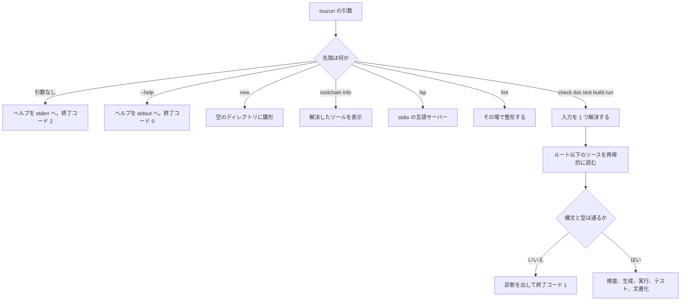

# コンパイラの使い方

`tsuzuri` は、`.tz` / `.tt` / `.tc` を型検査し、LLVM でネイティブ実行ファイルか WebAssembly を出すコマンドです。サブコマンドは少なく、入力はファイルかディレクトリの 1 つだけです。暗黙の探索を減らし、同じソースから同じ成果物が出るようにするためです。

このページでは、配布物とソースからの導入、各サブコマンド、入力の決まり方、キャッシュ、終了コードを扱います。フラグの一覧は [コンパイラ オプション](option.md) に分けています。

## この記事のポイント

- 配布物を使うときは、`bin/` 全体ではなく `tsuzuri` だけを PATH に足します。
- ディレクトリを渡すと `Main.tz` が入口になります。ファイルを渡すと、その親がプロジェクトルートです。
- `check` はコードを出しません。`run` は実行し、`build` はファイルを残します。
- キャッシュは `build` と `run` の既定です。`TSUZURI_CACHE_DIR` と `--no-cache` で制御します。
- 引数の誤りは終了コード 2、ソースや実行の失敗は 1、成功は 0 です。

## コマンドの流れ

引数なしと `--help` は、解析に入る前に分かれます。`new` と `toolchain info` も、ソースを読む前に終わります。



`build` は省略できます。先頭が既知のサブコマンドでなければ、その引数は `build` として扱われます。

## 配布物を使う

LLVM を自分で入れずにコンパイラを使うときは、ホスト別の配布物を展開します。macOS と Linux は `tsuzuri-<version>-<host>.tar.gz`、Windows は同じ名前の `.zip` です。`<version>` は `0.1.0` のように、`tsuzuri --version` の版です。`<host>` は `darwin-arm64`、`darwin-x64`、`linux-x64`、`linux-arm64`、`win32-x64`、`win32-arm64` です。

アーカイブの最上位には、ディレクトリ `tsuzuri-<version>-<host>/` だけが含まれます。コンパイラは、自分の実行ファイルから 2 つ上に `manifest.json` があるとき、そこを配布物のルートとみなします。Clang や `wasm-ld` は、環境変数、この `bin/`、PATH の順で探します。

```text
tsuzuri-0.1.0-darwin-arm64/
  manifest.json
  bin/       tsuzuri  tsuzuri-clang  clang  wasm-ld  llvm-link  dsymutil
  lib/
  zig/
  licenses/
```

Linux の `bin/` には `llvm-link` と `dsymutil` はありません。Windows の共有ライブラリは `bin/` にあります。

同じディレクトリに置いた `<archive>.sha256` は、`shasum -a 256 -c`（Linux は `sha256sum -c`）で読めます。これはダウンロード時の破損を検査するものです。配布元そのものの真正性の検証は別の手段で行います。

macOS と Linux では、PATH に追加するのは `tsuzuri` へのシンボリックリンクだけにします。`bin/` ディレクトリ全体を PATH に追加すると、同梱の `clang` や `wasm-ld` がシステムのツールを覆い隠してしまうためです。

```sh
v=0.1.0
host=darwin-arm64
shasum -a 256 -c "tsuzuri-$v-$host.tar.gz.sha256"
mkdir -p "$HOME/.local/share/tsuzuri" "$HOME/.local/bin"
tar -xzf "tsuzuri-$v-$host.tar.gz" -C "$HOME/.local/share/tsuzuri"
ln -sf "$HOME/.local/share/tsuzuri/tsuzuri-$v-$host/bin/tsuzuri" "$HOME/.local/bin/tsuzuri"
tsuzuri toolchain info
```

`$HOME/.local/bin` が PATH にないときは、シェルの設定に足してください。`host` は、自分の OS と CPU に合わせます。Linux では `sha256sum -c` を使い、archive 名の `darwin-arm64` を `linux-x64` などに変えます。

ブラウザーで保存した macOS のファイルには隔離属性が付くことがあります。チェックサムの確認後に、展開したディレクトリへ `xattr -dr com.apple.quarantine` を実行してください。`curl` で取ったファイルには、通常この属性は付きません。

Linux の同梱 LLVM は、配布を作った Ubuntu 24.04 以上の glibc を要求します。コンパイラが出すネイティブ実行ファイルは musl で静的にリンクされます。

Windows は `.zip` です。`Get-FileHash -Algorithm SHA256` の値を `.sha256` と比べ、`%LOCALAPPDATA%\Tsuzuri\` へ展開し、その `bin` を利用者の PATH に足します。symlink は権限が要るため、macOS のような `tsuzuri` だけのリンクは使いません。`bin` を PATH に足すと、同梱ツールがシステムの `clang` を隠す点は同じです。この展開手順は配布物の契約で、Windows 上での実行確認は CI が担当します。

アンインストール時は、シンボリックリンクまたは PATH の設定と、展開したディレクトリを削除します。バージョンごとにディレクトリが分かれているため、シンボリックリンクの向き先を変えるだけでバージョンを切り替えられます。

`tsuzuri toolchain info` は、選ばれたツールを標準出力へ書きます。開発用ビルドでは `distribution: none` になります。

```text
tsuzuri 0.1.0
distribution: none
TSUZURI_CLANG: path /usr/bin/clang (Apple clang version 21.0.0 (clang-2100.3.34.2))
TSUZURI_WASM_LD: path /opt/homebrew/Cellar/lld/23.1.1/bin/lld (unavailable)
TSUZURI_LLVM_LINK: path llvm-link (not found)
TSUZURI_DSYMUTIL: path /usr/bin/dsymutil (Apple LLVM version 21.0.0)
node: path /opt/homebrew/Cellar/node@20/20.19.6/bin/node (v20.19.6)
```

各行の `env` / `bundled` / `path` は、ツールが環境変数、配布物の同梱バイナリ、PATH のどれによって解決されたかを示します。見つからないツールは `(not found)`、`--version` の取得に失敗したツールは `(unavailable)` と表示されます。このコマンド自体はツールの場所を確認するだけでビルドは行わず、終了コード 0 で完了します。

## ソースからビルドする

リポジトリからコンパイラを作るときの要件は次のとおりです。

| もの | 版の目安 | 用途 |
| --- | --- | --- |
| Rust | 1.85 以降 | コンパイラ本体。`Cargo.toml` の `rust-version` |
| LLVM / Clang | 17 以降 | ネイティブのリンクと、WASM のオブジェクト |
| `wasm-ld` | Clang と同じ世代の LLD | WebAssembly のリンク |
| Node.js | 20 以降 | WASM のテストと、このリファレンスの検証 |

`tsuzuri test --target wasm64` は、Node.js 24 以降の memory64 を要求します。Python 3.9 以降は、リポジトリの参照実装テスト用です。コンパイラを使うだけなら要りません。

ツールの場所は `TSUZURI_CLANG`、`TSUZURI_WASM_LD`、`TSUZURI_LLVM_LINK`、`TSUZURI_DSYMUTIL` で指定できます。未設定なら PATH の `clang`、`wasm-ld`、`llvm-link`、`dsymutil` です。

### macOS

```sh
brew install llvm lld
export PATH="$(brew --prefix llvm)/bin:$(brew --prefix lld)/bin:$PATH"
cargo build --release
```

成果物は `target/release/tsuzuri` です。Apple の `clang` だけでは WASM ターゲットが足りないことがあるので、Homebrew の LLVM を PATH の前に置きます。

### Linux

Ubuntu / Debian では、パッケージの Clang と LLD で足ります。

```sh
sudo apt-get update
sudo apt-get install clang lld
cargo build --release
```

### Windows

Windows SDK と、Visual Studio Build Tools の MSVC C++ ツールセット、それに LLVM の `clang` を用意します。Developer PowerShell で `cargo build --release` します。

コンパイラがネイティブコードを出すとき、ホストが ARM64 なら `--target=aarch64-pc-windows-msvc`、それ以外なら `--target=x86_64-pc-windows-msvc` を Clang に渡します。Windows 上でその Clang が通るかは、Windows の CI が確認します。

## VS Code 拡張

拡張機能を入れると、コンパイラ、LLVM、リンカー、デバッガーが同梱されます。追加のランタイムは要りません。対応は VS Code 1.103 以降で、macOS の x64 と Apple シリコン、Linux（glibc）の x64 と ARM64、Windows x64 です。Windows ARM64 は編集と実行に対応し、デバッグは未対応です。

コマンドパレットの **Tsuzuri: New Project** は、同梱コンパイラの `tsuzuri new` で `Main.tz`、`Tsuzuri.toml`、`.gitignore` を作ります。エディター右上の実行は、未保存のファイルを保存してからビルドします。検査、WebAssembly のビルド、Test Explorer、ブレークポイントも拡張側の操作です。設定の `tsuzuri.optimization` の既定は 3 で、デバッグ実行は常に 0 です。

信頼していないフォルダーでは、コンパイラもユーザーのプログラムも起動しません。詳しい操作は [VS Code 拡張の README](../../../vsc/README.md) を見てください。

## サブコマンド

版の確認は `tsuzuri --version` です。現在の出力は次の 1 行で、終了コードは 0 です。

```text
tsuzuri 0.1.0
```

### new

空のディレクトリに、パッケージ、入口、gitignore を作ります。

```sh
tsuzuri new demo --namespace Acme::Demo
```

```text
Created demo/Tsuzuri.toml
Created demo/Main.tz
Created demo/.gitignore
```

`Tsuzuri.toml` は名前、版、名前空間を持ちます。`--namespace` を省略すると、フォルダー名から名前空間を導きます。導けない名前のときは、自分で渡してください。

```toml
[package]
name = "demo"
version = "0.1.0"
namespace = "Acme::Demo"
```

作られる `Main.tz` は、標準出力へ 1 行書いて終了コード 0 を返します。`test` は実行ファイルには入らず、`tsuzuri test` だけが実行します。

```tsuzuri run=Hello%2C%20Tsuzuri%21
namespace Acme::Demo

def main :: unit -> i32 = \() ->
    do! IO.writeln "Hello, Tsuzuri!"
    0

test "adds numbers" = assert (1 + 2 == 3)
```

実行結果:

```text
Hello, Tsuzuri!
```

`.gitignore` は、ビルド結果を置く `.tsuzuri/` を除外します。ディレクトリが空でない、名前空間が識別子を `::` でつないだ形でない、といった失敗は終了コード 1 です。引数の形が `tsuzuri new directory [--namespace NAME]` と違うときは、終了コード 2 です。

### check

コードを出さず、構文、型、公開 ABI、モジュール規則を検査します。入口の有無や LLVM は見ません。成功すると何も出さず、終了コード 0 です。

```sh
tsuzuri check demo
```

警告があっても、既定では終了コードは 0 のままです。`--deny-warnings` を付けると、警告だけで終了コード 1 になり、その後の処理へ進みません。

### run

`Main.tz` のトップレベルの式、または `def main` を実行します。トップレベルの式の結果が数値、`bool`、文字列（`string` / `utf8string`）、文字（`char` / `utf8char`）のときは標準出力に表示されます。`unit` のときは何も出力されません。`def main :: unit -> i32` または `def main :: Array<string> -> i32` を定義した場合は標準出力への自動表示は行われず、関数の戻り値がプロセスの終了コードになります。`Array<string>` を受け取る形式では、コマンドライン引数の配列が渡されます。

`run` は `--trap-info` が既定で有効です。トラップすると、理由とソース位置を `E2005` として報告します。最適化の既定は `-O3` で、fast-math は使いません。

先の `demo` を実行すると、標準出力は `Hello, Tsuzuri!` で、終了コードは 0 でした。

### build

成果物を残します。`-o` を省略すると、入力の拡張子を差し替えたパスです。macOS で `Main.tz` をネイティブ実行ファイルにすると、拡張子のない `Main` になります。Windows では `Main.exe` です。親ディレクトリは作られます。

```sh
tsuzuri build demo/Main.tz -o demo/hello
```

既定のターゲットは `native`、既定の `--emit` は `exe` です。WASM では既定が `wasm` になります。ライブラリであれば `Main.tz` がなくても、`--emit object` や `--emit header` で生成できます。実行ファイルにしたいのに入口がないときは `E2004` です。

```text
scalar/Main.tz:1:1: error[E2004]: an executable requires top-level entry-point code or 'def main' in Main.tz; use '--emit object' for a library
```

### test

`test "名前" = 式` を、別プロセスで実行します。通常の実行ファイルにはテストは入りません。既定の最適化は `-O0` です。1 件の上限は 30 秒で、並列度は論理 CPU 数と 32 の小さい方までです。

```text
ok 1 - Main adds numbers

1 passed; 0 failed; 0 ignored
```

`--list` は実行せず、番号、モジュール、名前を出します。`--filter` は `モジュール.名前` に部分文字列が含まれるものだけを残し、外れた件数は ignored です。`--index` は `--list` の番号で、範囲外は `E2000` です。失敗すると各行が `not ok` になり、最後に `E2006` で終了コード 1 になります。`assert` の失敗は、テストプロセスのトラップとして報告されます。

```text
not ok 1 - Main two plus two
  failure: trapped or terminated by signal

0 passed; 1 failed; 0 ignored
```

WASM のテストは PATH の `node` を使います。配布物の `bin/` からは探しません。

### fmt

`.tz`、`.tt`、`.tc` をその場で整形します。意味は変えません。`--check` は書き戻さず、差分があるファイルを `パス: not formatted` と出して終了コード 1 にします。CI 向きです。最適化や警告のフラグは受け付けません。

### doc

`///` から公開 API の Markdown を出します。`-o` が必須で、出力先はディレクトリです。

```sh
tsuzuri doc demo -o demo-docs
```

`demo-docs/index.md` がモジュール一覧、`demo-docs/Main.md` が各宣言です。印の `.tsuzuri-docs` も置きます。`Main.tz` がないライブラリディレクトリでも生成できます。

### lsp

`tsuzuri lsp` は、標準入出力の言語サーバーです。パスもビルドオプションも取りません。エディターは未保存のバッファを渡し、診断、ホバー、定義、補完、参照、リネームを受け取ります。`shutdown` のあと入力が終わると終了コード 0、`shutdown` なしで入力が閉じるかプロトコルに失敗すると 1 です。

診断の見た目は [診断メッセージとエラーコード](diagnostics.md) に分けています。

### toolchain info

上の「配布物を使う」で見たとおり、`tsuzuri toolchain info` の 2 語だけがこのモードです。`toolchain` という名前のディレクトリをビルドしたいときは、`tsuzuri build toolchain` のようにサブコマンドを書いてください。

## 入力の解決

渡せる入力は 1 つです。ファイルなら親ディレクトリがルート、ディレクトリならそのディレクトリがルートです。ルート以下の `.tz`、`.tt`、`.tc` を、相対パス順に再帰的に読みます。

| 拡張子 | 中身 |
| --- | --- |
| `.tz` | レコード、共用体、関数、インスタンス。`Main.tz` だけトップレベルの実行式を書けます |
| `.tt` | 型クラスの宣言。本体やレコードは置けません |
| `.tc` | コンピュテーション式のビルダー 1 つ |

ファイル名は大文字の ASCII で始まります。モジュール名はファイル名です。同じディレクトリに `Checked.tz` と `Checked.tc` のように、拡張子だけが違う同名は置けません。

`namespace Sample::Shapes` をファイルの最初に書くと、そのファイルの名前空間になります。書かなければ、`Tsuzuri.toml` の `namespace`、それもなければパッケージ名かフォルダー名に、サブディレクトリを足したものです。`Geometry/Point.tz` は `App::Geometry::Point` のようになります。

`check`、`build`、`run` にディレクトリを渡すと、直下の `Main.tz` を入口にします。無いときは、そのパスを見にいって `E2001` になります。ライブラリとして検査するときは、`.tz` ファイルを直接渡してください。`test` と `doc` は入口を要求しないので、ソースがあるディレクトリなら `Main.tz` なしでも読めます。

隣のファイルは、入口から見えるモジュールになります。同じディレクトリの `Price.tz` と `Main.tz` は、こう呼べます。

```tsuzuri project=shop file=Price.tz
export def price :: i64 = 120
```

```tsuzuri project=shop file=Main.tz run=120
Price.price()
```

実行結果:

```text
120
```

シンボリックリンクの入力は `E1011` で拒否します。残りの引数をパスとして扱いたいときは、`--` のあとに置きます。

## ビルドキャッシュ

`build` と `run` は、成果物を既定でキャッシュします。キーはソース、コンパイラのバイナリ、オプション、ツールのパスと `--version`、リンクに効く環境変数をまとめた SHA-256 です。同じキーなら、LLVM からやり直さずキャッシュを返します。

保存先は `TSUZURI_CACHE_DIR` です。空でなければそのパスを使います。未設定のときは次です。

| OS | 既定 |
| --- | --- |
| macOS | `~/Library/Caches/tsuzuri/build-cache` |
| Linux | `$XDG_CACHE_HOME/tsuzuri/build-cache`。無ければ `~/.cache/tsuzuri/build-cache` |
| Windows | `%LOCALAPPDATA%\Tsuzuri\Cache\build-cache` |

全体の上限は 2 GiB、未使用の期限は 30 日、1 エントリは 256 MiB までです。`--no-cache` は読み書きの両方を止めます。`build` と `run` 以外では `E2000` です。ツールの `--version` が失敗すると、ビルドは続けつつ `build cache disabled: ...` を標準エラーへ出します。`--json` では、この種のツール警告は `W2001` です。

## 終了コード

| コード | いつ |
| --- | --- |
| 0 | 成功。警告だけでも、`--deny-warnings` が無ければ 0 |
| 1 | ソースの診断、読み書き、リンカー、実行時の失敗、テスト失敗、`fmt --check` の差分、`--deny-warnings` |
| 2 | 引数の不足や組み合わせ。引数なしでヘルプを出したときも 2 |

`def main` が 0 以外を返した場合は、コンパイラから見ると実行の失敗 `E2005` になり、`tsuzuri run` 自体の終了コードは 1 になります。プログラム自身の戻り値がそのまま `tsuzuri run` の終了コードになるわけではありません（`tsuzuri build` で生成したバイナリを直接実行した場合は、`def main` の戻り値がプロセスの終了コードになります）。

> [!NOTE]
> `tsuzuri new --namespace 1bad` のように、サブコマンドは認識できて中身が不正なときは 1 です。サブコマンドの形自体が違うときは 2 です。どちらもコードは `E2000` のことがあります。

## まとめ

- 配布物では `tsuzuri` だけを PATH に足し、`toolchain info` で同梱ツールが見えているか確認します。
- 日常の流れは `new`、`check`、`run`、必要なときだけ `build` です。
- ディレクトリは `Main.tz`、ファイルはその親以下の全ソース、が入力の基本です。
- キャッシュは既定で有効です。消したいビルドだけ `--no-cache` を付けます。
- 終了コード 2 は引き方、1 は中身か実行、0 は成功です。

## 関連項目

- [コンパイラ オプション](option.md)
- [コンパイラ ディレクティブ](directives.md)
- [診断メッセージとエラーコード](diagnostics.md)
- [WebAssembly への出力](webassembly.md)
- [ネイティブ連携 (C ABI)](native-interop.md)
- [パッケージ](../organizing-tsuzuri/packages.md)
- [言語仕様のエントリーポイント](../../../docs/language.md#アプリケーションのエントリーポイント)
- [言語リファレンスの目次](../index.md)
