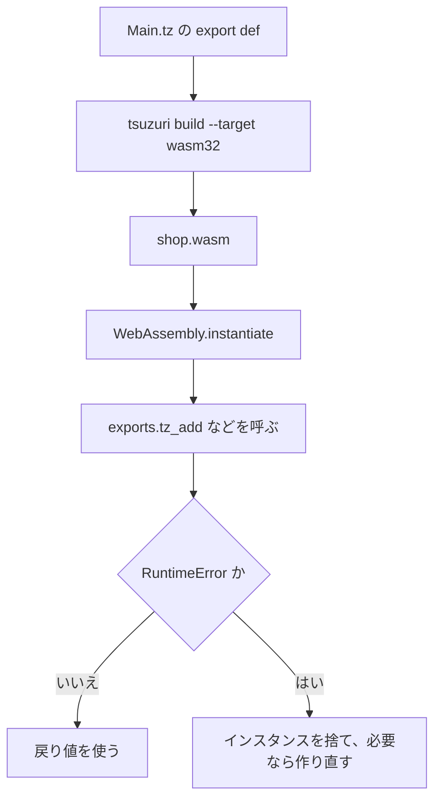

# WebAssembly への出力

`tsuzuri build --target wasm32` または `wasm64` は、ブラウザや Node.js から呼べる WebAssembly を出します。入出力（I/O）を行わない純粋な計算モジュールであれば、WASI は不要です。`--emit bindings-js` で生成する型付きのグルー（JavaScript と TypeScript 宣言）から呼ぶのが基本で、グルーを使わずに `WebAssembly.instantiate` で直接インスタンス化し、`tz_` 接頭辞の付いたエクスポート関数を呼び出すこともできます。

このページの JavaScript の実行例は、Node.js 20 環境で実際に実行して検証しています。なお、`tsuzuri test --target wasm64` のテスト実行には Node.js 24 以降が必要ですが、wasm64 向けにビルドしたモジュールのスカラー export 関数自体は Node.js 20 でも正常に `42n` を返します。

## この記事のポイント

- `--emit bindings-js` が `<name>.mjs` と `<name>.d.mts` を出します。型の検査、バッファの確保と解放、トラップの扱いはこのグルーが行います。
- 公開名は C と同じ `tz_` 接頭辞です。`export def add` は `tz_add` になります。
- `i64` は JavaScript の `BigInt`、`f32` / `f64` は `Number`、`bool` は 0 か 1 の `Number` です。グルーは `bool` を `boolean` に直します。
- 線形メモリの既定上限は 16 MiB、メインスタックは 1 MiB です。
- ホスト関数は、モジュール名 `tsuzuri`、関数名 `Main.tax_rate` のように import します。
- トラップしたインスタンスは再利用しません。グルーは `TsuzuriTrap` を投げ、次の呼び出しで作り直します。位置は `<output>.trap.json` と照合します。

## ターゲットを選ぶ

```sh
tsuzuri build Main.tz --target wasm32 -o shop.wasm
tsuzuri build Main.tz --target wasm64 -o shop64.wasm
```

既定の `--emit` は `wasm` です。オブジェクトや LLVM IR が欲しいときは `--emit object` か `--emit llvm` を足します。`wasm32` のポインタは 32 bit、`wasm64` は 64 bit です。JavaScript から見ると、wasm64 のポインタは `BigInt` です。

次の関数は、ネイティブでも WASM でも同じ計算です。ネイティブの `run` は 42 を出します。

```tsuzuri run=42
export def add :: i64 -> i64 -> i64 = \left right ->
    left + right

add 20 22
```

実行結果:

```text
42
```

同じソースを `wasm32` と `wasm64` に出し、Node.js から `tz_add(20n, 22n)` を呼ぶと、どちらも `42n` でした。`tsuzuri test --target wasm64` は、Node.js 24 以降で空の memory64 モジュールを検査してからテストを始めます。コンパイラ本体が wasm64 を拒否するわけではありません。

既定の wasm32 はホスト import を持ちません。`File`、`Dir`、`Env`、`Time`、`Random`（`Random.Pcg` を除く）、`Process` に到達するコードは `E2000` です。OS の API が要るなら native にするか、後述の `--wasm-host wasi` を使います。`Path` はホスト不要です。



## JavaScript との型

公開 ABI は C と揃えています。詳しい表は [言語仕様の公開 ABI](../../../docs/language.md#公開-abi) にあります。JavaScript から見るときの対応は次です。

| Tsuzuri | WASM | JavaScript |
| --- | --- | --- |
| `i8` / `i16` / `i32` と符号なし | i32 | `Number`。符号なしで読むときは `value >>> 0` |
| `i64` / `i64u` | i64 | `BigInt`。符号なしは `BigInt.asUintN(64, value)` |
| `f32` / `f64` | f32 / f64 | `Number` |
| `bool` | i32 | `Number`。0 が false、それ以外は true。戻り値は 0 か 1 |
| `unit` の戻り値 | なし | `undefined` |
| ポインタ（wasm32） | i32 | `Number`。2 GiB 以上は負になるので `>>> 0` |
| ポインタ（wasm64） | i64 | `BigInt` |

`i128`、`f16`、`f128`、decimal、文字型、共用体、タプル、リスト、関数値、タスクは、この ABI では出せません。`unit` は引数にはできません。

スカラーだけのモジュールは、`tsuzuri_alloc` と `tsuzuri_free` を export しません（`memory` はリンカーの既定で export されます）。配列、文字列、レコードを受け渡すと、それらが足されます。

## 型付きのバインディングを生成する

`--emit bindings-js` は、`.wasm` を読み込んで型付きの関数として呼ぶ JavaScript モジュール `<name>.mjs` と、その TypeScript 宣言 `<name>.d.mts` を出します。引数の検査、`tsuzuri_alloc` / `tsuzuri_free` による複製と解放、記述子の読み書き、BigInt と Number の変換、メモリが伸びたあとのビューの作り直しは、このグルーが行います。

```sh
tsuzuri build shop --target wasm32 --emit bindings-js -o shop.mjs
tsuzuri build shop --target wasm32 -o shop.wasm
```

グルーはソースだけから作り、LLVM を通しません。`-O` は受け付けて無視します。`.wasm` は同じソースから別にビルドし、`-O3` や `--trap-info` はそちらに付けます。`--target wasm32` が必須で、`-o` は `.mjs` で終わります。TypeScript は `.mjs` の宣言を `.d.ts` から読まず、`.d.mts` からだけ読むためです。`--trap-info`、`--debug-info`、`--debug-output`、`--wasm-feature`、`--allocator` を付けると `E2000`（`... is not valid for bindings output; pass it when building the .wasm`）、`export def` が 1 つもないと `E2004` です。同じソースからは、バイト単位で同じグルーができます。

次のモジュールを例にします。

```tsuzuri
record Item { price: i64, count: i32 }

extern def tax_rate :: unit -> i64

export def total :: ref Item -> i64 = \item ->
    let subtotal = item.price * item.count as i64
    subtotal + subtotal * tax_rate () / 100

export def per_unit :: i64 -> i64 -> i64 = \price count ->
    price / count

export def shout :: ref string -> string = \text ->
    clone_string text + "!"

export def scale :: ref [f64] -> f64 -> [f64] = \values factor ->
    Array.map (\value -> value * factor) values
```

生成された `shop.d.mts` の主な部分です。export は名前のバイト順、引数名は C ヘッダーと同じ `arg0`、`arg1` です。レコードの interface 名は C ヘッダーの typedef 名と同じで、フィールド名は Tsuzuri の名前のままです。

```typescript
export interface tz_record_4Main_4Item { price: bigint; count: number }
export interface Exports {
  per_unit(arg0: bigint, arg1: bigint): bigint;
  scale(arg0: Float64Array | Borrowed<Float64Array>, arg1: number): Float64Array;
  shout(arg0: string): string;
  total(arg0: tz_record_4Main_4Item): bigint;
}
export interface Imports {
  "Main.tax_rate"(): bigint;
}
```

`load` は `.wasm` のバイト列か `WebAssembly.Module` を受け取り、`exports` と `withBorrowed` を持つオブジェクトを返します。ホスト関数は、WASM の import 名をキーにして `imports` に渡します。

```javascript
import { readFile } from "node:fs/promises";
import { load, TsuzuriTrap } from "./shop.mjs";

const bytes = await readFile(new URL("./shop.wasm", import.meta.url));
const api = await load(bytes, { imports: { "Main.tax_rate": () => 10n } });
console.log(api.exports.total({ price: 200n, count: 3 }));
console.log(api.exports.shout("tea"));
console.log(api.exports.scale(Float64Array.of(1.5, 2), 2));
try {
  api.exports.per_unit(10n, 0n);
} catch (error) {
  if (!(error instanceof TsuzuriTrap)) throw error;
  console.log(error.message, error.trap.reason);
}
console.log(api.exports.per_unit(10n, 4n));
```

実行結果:

```text
660n
tea!
Float64Array(2) [ 3, 4 ]
trap (site 0) trap
2n
```

グルーは `node:` の import も `fetch` も使わないので、ブラウザでも同じファイルを `import` できます。ブラウザでは `fetch` で取ったバイト列か、`WebAssembly.compileStreaming` で作ったモジュールを `load` に渡します。

### 型の対応

| Tsuzuri | TypeScript | JavaScript から渡すときの検査 |
| --- | --- | --- |
| `i8` / `i16` / `i32` と符号なし | `number` | 整数で、型の範囲内。範囲外は `RangeError` |
| `i64` / `i64u` | `bigint` | `bigint` で、型の範囲内。`i64u` の戻り値は符号なしで返る |
| `f32` / `f64` | `number` | `number`。`f32` はエンジンが最近接へ丸める |
| `bool` | `boolean` | `boolean` だけ。`0` や `1` は `TypeError` |
| `unit`（戻り値） | `void` | — |
| `ref [i64]` / `ref [f64]` / `ref [ubyte]` | `BigInt64Array` / `Float64Array` / `Uint8Array` か `Borrowed<…>` | 型付き配列だけ。通常の配列は `TypeError` |
| `ref string` | `string` | UTF-16 のコード単位のまま。孤立サロゲートも通る |
| `ref utf8string` | `string` | `isWellFormed()` でない文字列は `TypeError` |
| `[i64]` などの所有結果 | 型付き配列 | 複製して返し、すぐ `tsuzuri_free` する |
| `string` / `utf8string` の所有結果 | `string` | 同上 |
| スカラーレコードとその `ref` | `tz_record_…` の interface | 全フィールドを検査する。固定長配列のフィールドは長さが一致する配列 |
| `extern type` のハンドル | `number & { readonly __tsuzuri: "tz_handle_…" }` | 0 以上 2^32 未満の整数 |
| コールバック（import の引数） | 関数型 | import の呼び出し中だけ呼べる |

引数の数、型、範囲、レコードのフィールドは、インスタンスに触れる前に検査します。失敗は `TypeError`（`argument 0 of 'total' field 'price' must be a bigint`）か `RangeError`（`argument 0 of 'widen' is out of range for i8`）で、インスタンスは捨てません。

### 所有権と withBorrowed

グルーは wasm のポインタを JavaScript に渡しません。入力は呼び出しごとに線形メモリへ複製し、所有結果は JavaScript の値へ複製してすぐ解放します。呼び出しが成功すれば、確保の残りは 0 です。ビューは使う直前に `memory.buffer` から作り直します。

大きな入力を複製せずに渡すときは、`withBorrowed(kind, length, callback)` を使います。`kind` は `"i64"`、`"f64"`、`"ubyte"` です。wasm 側に `length` 要素の領域を確保し、`Borrowed` として callback に渡し、callback が返るか例外を投げたあとに解放します。`view()` は呼ぶたびに現在のメモリ上の型付き配列を返します。解放後やインスタンスが捨てられたあとの `Borrowed` を使うと `TypeError` です。callback が Promise などを返すと、解放したうえで `TypeError` を投げます。

```javascript
const scaled = api.withBorrowed("f64", 3, (buffer) => {
  buffer.view().set([1, 2, 3]);
  return api.exports.scale(buffer, 10);
});
console.log(scaled);
```

実行結果:

```text
Float64Array(3) [ 10, 20, 30 ]
```

### import とトラップ

import の関数は、借用入力の複製を受け取ります。ホストが保持しても安全です。所有結果を返す import は、型付き配列か文字列を返せば、グルーが `tsuzuri_alloc` で確保して記述子を書きます。ホストの関数が投げた値は、記録したうえで同じ値のまま呼び出し元へ届きます。戻り値の型が違うときは `result of import 'Main.tax_rate' must be a bigint` のような `TypeError` です。

export の呼び出し中に例外が出たら、グルーはそのインスタンスを捨て、次の呼び出しで同じモジュールと import から同期的に作り直します。トラップは `TsuzuriTrap`（`Error` の派生、`name` は `"TsuzuriTrap"`、`cause` は元の例外）で、`trap` に `{ reason, site, kind, path, line, column }` を持ちます。`reason` は `"trap"` か、スタック枯渇の `"stack"` です。`--trap-info` 付きの `.wasm` と、その `.trap.json` の `sites` を `load` に渡すと、位置が付きます。

```javascript
const { sites } = JSON.parse(await readFile(new URL("./shop-sites.wasm.trap.json", import.meta.url), "utf8"));
const api = await load(await readFile(new URL("./shop-sites.wasm", import.meta.url)), { imports: { "Main.tax_rate": () => 10n }, sites });
try {
  api.exports.per_unit(10n, 0n);
} catch (error) {
  console.log(error.message);
}
```

実行結果:

```text
trap at shop/Main.tz:10:5 (integer division by zero)
```

グルーは、モジュールが宣言した import だけを渡し、import を足しません。`--wasm-feature threads`、IO の入口、`--debug-output`、`--wasm-host wasi`、`--allocator host` で作った `.wasm` は、`load` が `Error` で拒否します。別のソースから作った `.wasm` は、`module does not match bindings: missing export 'tz_add'; regenerate the bindings from the same sources` のように拒否します。グルーのポインタは 32 bit なので、`--target wasm64` の `.wasm` も拒否します（`bindings support wasm32 modules only; build the .wasm with --target wasm32`）。

## Node.js から直接呼ぶ

グルーを使わずに、`WebAssembly.instantiate` で直接呼ぶこともできます。以下は、Node.js からエクスポート関数を呼び出す具体的な例です（`scale` は `f64`、`is_positive` は `bool` を扱う関数です）。

```javascript
import { readFileSync } from "node:fs";

const bytes = readFileSync(new URL("./quote.wasm", import.meta.url));
const api = (await WebAssembly.instantiate(bytes)).instance.exports;
console.log(api.tz_add(20n, 22n).toString());
console.log(api.tz_scale(1.5));
console.log(api.tz_is_positive(3n));
console.log(api.tz_is_positive(0n));
```

実行結果:

```text
42
3
1
0
```

ブラウザでも、`fetch` で取ったバイト列を同じ `WebAssembly.instantiate` に渡せます。import が空なら、第 2 引数は要りません。ファイルの配信に特別なヘッダーは要りません。スレッドを使うときだけ、後述の COOP / COEP が必要です。

## 線形メモリとスタック

既定の上限は 16 MiB、メインスタックは 1 MiB です。どちらも 64 KiB ページに揃ったメモリ上限の内側に収まる必要があり、上限はスタックより少なくとも 64 KiB 大きくします。

```sh
tsuzuri build Main.tz --target wasm32 --wasm-max-memory 64MiB --wasm-stack-size 1MiB -o shop.wasm
```

`wasm32` の上限は 4 GiB − 64 KiB、`wasm64` は 16 GiB です。`Tsuzuri.toml` の `[wasm]` は、コマンドラインが省略したときの既定です。

```toml
[wasm]
max-memory = "64MiB"
stack-size = "1MiB"
```

オブジェクトを自分で `wasm-ld` するときは、スタックを `-z stack-size` で渡します。`--wasm-stack-size` が効くのは、コンパイラが WASM までリンクするときだけです。

`memory` を export するモジュールでは、呼び出しのあと線形メモリが伸びることがあります。`DataView` や `TypedArray` は、呼び出しのたびに `api.memory.buffer` から取り直してください。伸びる前に握ったビューは無効です。

## バッファを渡す

この節は、グルーを使わずにホストを書くときの ABI です。`--emit bindings-js` のグルーは、同じ手順を自動で行います。

`ref [i64]` は、ポインタと `i64` の長さです。wasm32 ではポインタが `Number`、長さが `BigInt` です。ホストは、要素数ぶんの領域と自然な整列を保証します。長さ 0 と null は空のバッファとして通ります。呼び出しのあいだ、その領域を書き換えたり解放したりしてはいけません。

次は、`10, 20, 12` の和が 42 になった呼び出しです。

```javascript
const input = api.tsuzuri_alloc(24n);
new BigInt64Array(api.memory.buffer, Number(input), 3).set([10n, 20n, 12n]);
console.log(api.tz_sum(input, 3n).toString());
api.tsuzuri_free(input);
```

実行結果:

```text
42
```

所有して返る配列は、先頭の out ポインタへ `{ ptr, len }` を書きます。記述子は 16 バイトで、オフセット 0 がポインタ、オフセット 8 が i64 の長さです。wasm32 のポインタは i32 なので、残りは埋まります。返したバッファはホストの所有です。`tsuzuri_free` を 1 回だけ呼びます。

`export def make_tag :: i64 -> [ubyte]` を、長さ 3 で呼んだ結果は ASCII の `ABC` でした。

```javascript
const out = api.tsuzuri_alloc(16n) >>> 0;
api.tz_make_tag(out, 3n);
const view = new DataView(api.memory.buffer);
const pointer = view.getUint32(out, true);
const length = Number(view.getBigInt64(out + 8, true));
const text = new TextDecoder().decode(new Uint8Array(api.memory.buffer, pointer, length));
api.tsuzuri_free(pointer);
api.tsuzuri_free(out);
```

`>>> 0` は、wasm32 で 2 GiB 以上のアドレスが負の `Number` になるのを避けるためです。記述子と中身の両方を解放します。`utf8string` に不正な UTF-8 を渡すとトラップします。`string` は UTF-16 のコード単位で、孤立サロゲートもそのまま通ります。

## SIMD とスレッド

`--wasm-feature simd128` は、128-bit SIMD を出す許可です。`wasm32` と `wasm64` の object、LLVM IR、WASM で使えます。relaxed SIMD は受け付けません。スカラーだけのモジュールに付けても、追加の import は出ませんでした。

`--wasm-feature threads` は wasm32 の object か WASM だけです。スカラーだけのモジュールでも、共有メモリの `env.memory` と `tsuzuri_threads.worker_ready` を import しました。ワーカーを起動するランタイムは `tsuzuri_threads.spawn_workers` も宣言します。その呼び出しに到達しないモジュールでは、リンカーが import から外します。

ホストの実装は、リポジトリの `src/runtime/wasm-threads.mjs` が Node.js 向けの参照です。自分で書くときの条件は [Web ホストの README](../../../examples/web/README.md) にあります。

- 共有の `WebAssembly.Memory` を、モジュールが要求する最大ページ数で作る。既定は 256 ページ、つまり 16 MiB です。
- `tsuzuri_threads_init` にワーカー数を渡してから計算を呼ぶ。
- 各ワーカーの `__stack_pointer`、`tsuzuri_stack_base`、`tsuzuri_stack_top` を、独立した 256 KiB の範囲に設定してから `tsuzuri_thread_entry` を呼ぶ。
- ブラウザでは、HTTPS か localhost で `Cross-Origin-Opener-Policy: same-origin` と `Cross-Origin-Embedder-Policy: require-corp` を配信する。UI スレッドでは atomic wait できないので、計算の呼び出し元も Worker に置きます。

ブラウザ向けの本番グルーは未実装です。COOP / COEP が使えないからといって、スレッド要求を黙って逐次実行へ置き換えないでください。WASI と threads、`--allocator host` と threads は、同時には指定できません。

## WASI

`--wasm-host wasi` は、標準入出力と `File`、`Dir`、`Env`、`Time`、`Random`、`Process` を WASI preview 1 の import へ下げます。wasm32 の object か WASM だけです。既定の wasm32 は、これらの API に到達した時点でビルドを拒否します。

WASI を付けない計算モジュールは、WASI もブラウザ固有の import も持ちません。ホストを用意できない環境へ計算だけを渡すときは、こちらを使います。

## ホスト関数を import する

`extern def tax_rate :: unit -> i64` は、WASM ではモジュール `tsuzuri`、名前 `Main.tax_rate` の import です。ファイル名がモジュール名になります。到達しない `extern` は import セクションに出ません。

```tsuzuri
extern def tax_rate :: unit -> i64

export def with_tax :: i64 -> i64 = \cents ->
    cents + cents * tax_rate () / 100
```

この断片は型検査できます。実行にはホストが要るので、`run=` は付けていません。200 セントに 10% を足すホストは、次のとおりです（グルーを使うときは `load` の `imports` に `"Main.tax_rate": () => 10n` を渡します）。実行結果は `220` でした。

```javascript
import { readFileSync } from "node:fs";

const bytes = readFileSync(new URL("./tax.wasm", import.meta.url));
const { instance } = await WebAssembly.instantiate(bytes, {
  tsuzuri: {
    "Main.tax_rate": () => 10n,
  },
});
console.log(instance.exports.tz_with_tax(200n).toString());
```

実行結果:

```text
220
```

`extern "env" "host_now" def host_now :: unit -> i64` のように文字列を 2 つ書くと、import のモジュール名と関数名を自分で指定します。文字列が 1 つの `extern "sqrt" def ...` は、モジュール名 `tsuzuri`、import 名はその文字列です。3 つ以上は `E0002` です。名前の制約は [言語仕様のリンク名](../../../docs/language.md#リンク名) を見てください。

所有して返すバッファは、ホストが `tsuzuri_alloc` で確保した領域の所有権を Tsuzuri へ渡します。借用入力や静的領域を、所有結果として返してはいけません。

## トラップと trap.json

`build` は既定では位置情報を入れません。`--trap-info` を付けると、成果物の隣に `<output>.trap.json` を書き、WASM は `tsuzuri_trap_site` を export します。正常な呼び出しの開始時に、この ID はリセットされません。直近のトラップです。

表は 1 つの JSON オブジェクトです。`version` は 1、`sites` の各要素は `id`、`kind`、`path`、`span` です。`span` の行と列は、診断 JSON と同じく 1 始まりです。`left / right` を含むオブジェクトを `--trap-info` で出すと、ゼロ除算と符号付きオーバーフローの 2 件が同じスパンに付きました。

```text
{"version":1,"sites":[{"id":2,"kind":"integer division by zero","path":"trap/Main.tz","span":{"start":60,"end":72,"line":2,"column":5,"end_line":2,"end_column":17}}]}
```

上は実ファイルの先頭要素だけを短くしたものです。完全なファイルには、同じ除算のオーバーフローなど、コンパイラが付けたサイトが続きます。

トラップすると `WebAssembly.RuntimeError` になります。Tsuzuri はスタックを巻き戻さないので、そのインスタンスのヒープとシャドウスタックは中途半端なままです。次の呼び出しでは、同じモジュールから新しいインスタンスを作ってください。古い `memory.buffer` のビューと、未解放の所有バッファは無効です。所有結果は、次の `call` の前に複製し、`tsuzuri_free` します。

リポジトリの `src/runtime/trap-boundary.mjs` は、1 回の呼び出しを境界で包みます。成功は `{ ok: true, value }`、トラップは `{ ok: false, trap: { reason, site, kind, path, line, column } }` です。`kind` 以下は、サイドテーブルに ID があるときだけ付きます。スタック枯渇は `reason: "stack"`、`site: 0` です。threads 付きモジュールは、この境界では拒否します。ワーカーごとではなく、プール全体を捨てます。

> [!WARNING]
> トラップ後のインスタンスで `tz_` 関数を続けると、壊れたヒープを読みます。境界がインスタンスを作り直すのは、そのためです。

## まとめ

- `--emit bindings-js` のグルーが、型の検査、複製と解放、import、トラップを受け持ちます。
- `export def` は `tz_` 名で出ます。`i64` は `BigInt`、浮動小数点と `bool` は `Number` です。
- 計算だけのモジュールは import なしで instantiate できます。OS API は WASI か native です。
- バッファはポインタと長さ、所有結果は 16 バイトの記述子です。呼び出しのあとビューを取り直します。
- `simd128` は許可、`threads` は共有メモリとワーカーのホストが必要です。
- `--trap-info` の `.trap.json` とサイト ID で位置を引き、トラップしたインスタンスは捨てます。

## 関連項目

- [コンパイラ オプション](option.md)
- [ネイティブ連携 (C ABI)](native-interop.md)
- [診断メッセージとエラーコード](diagnostics.md)
- [言語仕様の公開 ABI](../../../docs/language.md#公開-abi)
- [言語仕様のホスト関数](../../../docs/language.md#ホスト関数のインポート)
- [言語仕様のトラップ位置](../../../docs/language.md#トラップ位置)
- [言語リファレンスの目次](../index.md)
