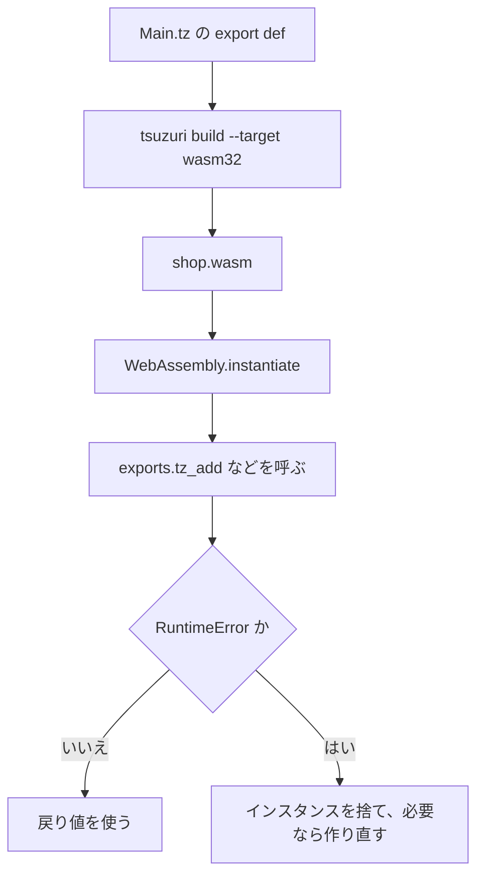

# WebAssembly への出力

`tsuzuri build --target wasm32` または `wasm64` は、ブラウザや Node.js から呼べる WebAssembly を出します。入出力（I/O）を行わない純粋な計算モジュールであれば、WASI や JavaScript のグルーコードは不要です。モジュールを `WebAssembly.instantiate` で直接インスタンス化し、`tz_` 接頭辞の付いたエクスポート関数を呼び出すだけで実行できます。

このページの JavaScript の実行例は、Node.js 20 環境で実際に実行して検証しています。なお、`tsuzuri test --target wasm64` のテスト実行には Node.js 24 以降が必要ですが、wasm64 向けにビルドしたモジュールのスカラー export 関数自体は Node.js 20 でも正常に `42n` を返します。

## この記事のポイント

- 公開名は C と同じ `tz_` 接頭辞です。`export def add` は `tz_add` になります。
- `i64` は JavaScript の `BigInt`、`f32` / `f64` は `Number`、`bool` は 0 か 1 の `Number` です。
- 線形メモリの既定上限は 16 MiB、メインスタックは 1 MiB です。
- ホスト関数は、モジュール名 `tsuzuri`、関数名 `Main.tax_rate` のように import します。
- トラップしたインスタンスは再利用しません。位置は `<output>.trap.json` と照合します。

## ターゲットを選ぶ

```sh
tsuzuri build Main.tz --target wasm32 -o shop.wasm
tsuzuri build Main.tz --target wasm64 -o shop64.wasm
```

既定の `--emit` は `wasm` です。オブジェクトや LLVM IR が欲しいときは `--emit object` か `--emit llvm` を足します。`wasm32` のポインタは 32 bit、`wasm64` は 64 bit です。JavaScript から見ると、wasm64 のポインタは `BigInt` です。

次の関数は、ネイティブでも WASM でも同じ計算です。ネイティブの `run` は 42 を出します。

```tsuzuri run=42
export def add :: i64 -> i64 -> i64 = \left right ->
    left + right

add 20 22
```

実行結果:

```text
42
```

同じソースを `wasm32` と `wasm64` に出し、Node.js から `tz_add(20n, 22n)` を呼ぶと、どちらも `42n` でした。`tsuzuri test --target wasm64` は、Node.js 24 以降で空の memory64 モジュールを検査してからテストを始めます。コンパイラ本体が wasm64 を拒否するわけではありません。

既定の wasm32 はホスト import を持ちません。`File`、`Dir`、`Env`、`Time`、`Random`（`Random.Pcg` を除く）、`Process` に到達するコードは `E2000` です。OS の API が要るなら native にするか、後述の `--wasm-host wasi` を使います。`Path` はホスト不要です。



## JavaScript との型

公開 ABI は C と揃えています。詳しい表は [言語仕様の公開 ABI](../../../docs/language.md#公開-abi) にあります。JavaScript から見るときの対応は次です。

| Tsuzuri | WASM | JavaScript |
| --- | --- | --- |
| `i8` / `i16` / `i32` と符号なし | i32 | `Number`。符号なしで読むときは `value >>> 0` |
| `i64` / `i64u` | i64 | `BigInt`。符号なしは `BigInt.asUintN(64, value)` |
| `f32` / `f64` | f32 / f64 | `Number` |
| `bool` | i32 | `Number`。0 が false、それ以外は true。戻り値は 0 か 1 |
| `unit` の戻り値 | なし | `undefined` |
| ポインタ（wasm32） | i32 | `Number`。2 GiB 以上は負になるので `>>> 0` |
| ポインタ（wasm64） | i64 | `BigInt` |

`i128`、`f16`、`f128`、decimal、文字型、共用体、タプル、リスト、関数値、タスクは、この ABI では出せません。`unit` は引数にはできません。

スカラーだけのモジュールは、`memory` も `tsuzuri_alloc` も export しません。配列や文字列を返すと、それらが足されます。

## Node.js から呼ぶ

以下は、Node.js からエクスポート関数を呼び出す具体的な例です（`scale` は `f64`、`is_positive` は `bool` を扱う関数です）。

```javascript
import { readFileSync } from "node:fs";

const bytes = readFileSync(new URL("./quote.wasm", import.meta.url));
const api = (await WebAssembly.instantiate(bytes)).instance.exports;
console.log(api.tz_add(20n, 22n).toString());
console.log(api.tz_scale(1.5));
console.log(api.tz_is_positive(3n));
console.log(api.tz_is_positive(0n));
```

実行結果:

```text
42
3
1
0
```

ブラウザでも、`fetch` で取ったバイト列を同じ `WebAssembly.instantiate` に渡せます。import が空なら、第 2 引数は要りません。ファイルの配信に特別なヘッダーは要りません。スレッドを使うときだけ、後述の COOP / COEP が必要です。

## 線形メモリとスタック

既定の上限は 16 MiB、メインスタックは 1 MiB です。どちらも 64 KiB ページに揃ったメモリ上限の内側に収まる必要があり、上限はスタックより少なくとも 64 KiB 大きくします。

```sh
tsuzuri build Main.tz --target wasm32 --wasm-max-memory 64MiB --wasm-stack-size 1MiB -o shop.wasm
```

`wasm32` の上限は 4 GiB − 64 KiB、`wasm64` は 16 GiB です。`Tsuzuri.toml` の `[wasm]` は、コマンドラインが省略したときの既定です。

```toml
[wasm]
max-memory = "64MiB"
stack-size = "1MiB"
```

オブジェクトを自分で `wasm-ld` するときは、スタックを `-z stack-size` で渡します。`--wasm-stack-size` が効くのは、コンパイラが WASM までリンクするときだけです。

`memory` を export するモジュールでは、呼び出しのあと線形メモリが伸びることがあります。`DataView` や `TypedArray` は、呼び出しのたびに `api.memory.buffer` から取り直してください。伸びる前に握ったビューは無効です。

## バッファを渡す

`ref [i64]` は、ポインタと `i64` の長さです。wasm32 ではポインタが `Number`、長さが `BigInt` です。ホストは、要素数ぶんの領域と自然な整列を保証します。長さ 0 と null は空のバッファとして通ります。呼び出しのあいだ、その領域を書き換えたり解放したりしてはいけません。

次は、`10, 20, 12` の和が 42 になった呼び出しです。

```javascript
const input = api.tsuzuri_alloc(24n);
new BigInt64Array(api.memory.buffer, Number(input), 3).set([10n, 20n, 12n]);
console.log(api.tz_sum(input, 3n).toString());
api.tsuzuri_free(input);
```

実行結果:

```text
42
```

所有して返る配列は、先頭の out ポインタへ `{ ptr, len }` を書きます。記述子は 16 バイトで、オフセット 0 がポインタ、オフセット 8 が i64 の長さです。wasm32 のポインタは i32 なので、残りは埋まります。返したバッファはホストの所有です。`tsuzuri_free` を 1 回だけ呼びます。

`export def make_tag :: i64 -> [ubyte]` を、長さ 3 で呼んだ結果は ASCII の `ABC` でした。

```javascript
const out = api.tsuzuri_alloc(16n) >>> 0;
api.tz_make_tag(out, 3n);
const view = new DataView(api.memory.buffer);
const pointer = view.getUint32(out, true);
const length = Number(view.getBigInt64(out + 8, true));
const text = new TextDecoder().decode(new Uint8Array(api.memory.buffer, pointer, length));
api.tsuzuri_free(pointer);
api.tsuzuri_free(out);
```

`>>> 0` は、wasm32 で 2 GiB 以上のアドレスが負の `Number` になるのを避けるためです。記述子と中身の両方を解放します。`utf8string` に不正な UTF-8 を渡すとトラップします。`string` は UTF-16 のコード単位で、孤立サロゲートもそのまま通ります。

## SIMD とスレッド

`--wasm-feature simd128` は、128-bit SIMD を出す許可です。`wasm32` と `wasm64` の object、LLVM IR、WASM で使えます。relaxed SIMD は受け付けません。スカラーだけのモジュールに付けても、追加の import は出ませんでした。

`--wasm-feature threads` は wasm32 の object か WASM だけです。スカラーだけのモジュールでも、共有メモリの `env.memory` と `tsuzuri_threads.worker_ready` を import しました。ワーカーを起動するランタイムは `tsuzuri_threads.spawn_workers` も宣言します。その呼び出しに到達しないモジュールでは、リンカーが import から外します。

ホストの実装は、リポジトリの `src/runtime/wasm-threads.mjs` が Node.js 向けの参照です。自分で書くときの条件は [Web ホストの README](../../../examples/web/README.md) にあります。

- 共有の `WebAssembly.Memory` を、モジュールが要求する最大ページ数で作る。既定は 256 ページ、つまり 16 MiB です。
- `tsuzuri_threads_init` にワーカー数を渡してから計算を呼ぶ。
- 各ワーカーの `__stack_pointer`、`tsuzuri_stack_base`、`tsuzuri_stack_top` を、独立した 256 KiB の範囲に設定してから `tsuzuri_thread_entry` を呼ぶ。
- ブラウザでは、HTTPS か localhost で `Cross-Origin-Opener-Policy: same-origin` と `Cross-Origin-Embedder-Policy: require-corp` を配信する。UI スレッドでは atomic wait できないので、計算の呼び出し元も Worker に置きます。

ブラウザ向けの本番グルーは未実装です。COOP / COEP が使えないからといって、スレッド要求を黙って逐次実行へ置き換えないでください。WASI と threads、`--allocator host` と threads は、同時には指定できません。

## WASI

`--wasm-host wasi` は、標準入出力と `File`、`Dir`、`Env`、`Time`、`Random`、`Process` を WASI preview 1 の import へ下げます。wasm32 の object か WASM だけです。既定の wasm32 は、これらの API に到達した時点でビルドを拒否します。

WASI を付けない計算モジュールは、WASI もブラウザ固有の import も持ちません。ホストを用意できない環境へ計算だけを渡すときは、こちらを使います。

## ホスト関数を import する

`extern def tax_rate :: unit -> i64` は、WASM ではモジュール `tsuzuri`、名前 `Main.tax_rate` の import です。ファイル名がモジュール名になります。到達しない `extern` は import セクションに出ません。

```tsuzuri
extern def tax_rate :: unit -> i64

export def with_tax :: i64 -> i64 = \cents ->
    cents + cents * tax_rate () / 100
```

この断片は型検査できます。実行にはホストが要るので、`run=` は付けていません。200 セントに 10% を足すホストは、次のとおりです。実行結果は `220` でした。

```javascript
import { readFileSync } from "node:fs";

const bytes = readFileSync(new URL("./tax.wasm", import.meta.url));
const { instance } = await WebAssembly.instantiate(bytes, {
  tsuzuri: {
    "Main.tax_rate": () => 10n,
  },
});
console.log(instance.exports.tz_with_tax(200n).toString());
```

実行結果:

```text
220
```

`extern "env" "host_now" def host_now :: unit -> i64` のように文字列を 2 つ書くと、import のモジュール名と関数名を自分で指定します。文字列が 1 つの `extern "sqrt" def ...` は、モジュール名 `tsuzuri`、import 名はその文字列です。3 つ以上は `E0002` です。名前の制約は [言語仕様のリンク名](../../../docs/language.md#リンク名) を見てください。

所有して返すバッファは、ホストが `tsuzuri_alloc` で確保した領域の所有権を Tsuzuri へ渡します。借用入力や静的領域を、所有結果として返してはいけません。

## トラップと trap.json

`build` は既定では位置情報を入れません。`--trap-info` を付けると、成果物の隣に `<output>.trap.json` を書き、WASM は `tsuzuri_trap_site` を export します。正常な呼び出しの開始時に、この ID はリセットされません。直近のトラップです。

表は 1 つの JSON オブジェクトです。`version` は 1、`sites` の各要素は `id`、`kind`、`path`、`span` です。`span` の行と列は、診断 JSON と同じく 1 始まりです。`left / right` を含むオブジェクトを `--trap-info` で出すと、ゼロ除算と符号付きオーバーフローの 2 件が同じスパンに付きました。

```text
{"version":1,"sites":[{"id":2,"kind":"integer division by zero","path":"trap/Main.tz","span":{"start":60,"end":72,"line":2,"column":5,"end_line":2,"end_column":17}}]}
```

上は実ファイルの先頭要素だけを短くしたものです。完全なファイルには、同じ除算のオーバーフローなど、コンパイラが付けたサイトが続きます。

トラップすると `WebAssembly.RuntimeError` になります。Tsuzuri はスタックを巻き戻さないので、そのインスタンスのヒープとシャドウスタックは中途半端なままです。次の呼び出しでは、同じモジュールから新しいインスタンスを作ってください。古い `memory.buffer` のビューと、未解放の所有バッファは無効です。所有結果は、次の `call` の前に複製し、`tsuzuri_free` します。

リポジトリの `src/runtime/trap-boundary.mjs` は、1 回の呼び出しを境界で包みます。成功は `{ ok: true, value }`、トラップは `{ ok: false, trap: { reason, site, kind, path, line, column } }` です。`kind` 以下は、サイドテーブルに ID があるときだけ付きます。スタック枯渇は `reason: "stack"`、`site: 0` です。threads 付きモジュールは、この境界では拒否します。ワーカーごとではなく、プール全体を捨てます。

> [!WARNING]
> トラップ後のインスタンスで `tz_` 関数を続けると、壊れたヒープを読みます。境界がインスタンスを作り直すのは、そのためです。

## まとめ

- `export def` は `tz_` 名で出ます。`i64` は `BigInt`、浮動小数点と `bool` は `Number` です。
- 計算だけのモジュールは import なしで instantiate できます。OS API は WASI か native です。
- バッファはポインタと長さ、所有結果は 16 バイトの記述子です。呼び出しのあとビューを取り直します。
- `simd128` は許可、`threads` は共有メモリとワーカーのホストが必要です。
- `--trap-info` の `.trap.json` とサイト ID で位置を引き、トラップしたインスタンスは捨てます。

## 関連項目

- [コンパイラ オプション](option.md)
- [ネイティブ連携 (C ABI)](native-interop.md)
- [診断メッセージとエラーコード](diagnostics.md)
- [言語仕様の公開 ABI](../../../docs/language.md#公開-abi)
- [言語仕様のホスト関数](../../../docs/language.md#ホスト関数のインポート)
- [言語仕様のトラップ位置](../../../docs/language.md#トラップ位置)
- [言語リファレンスの目次](../index.md)
