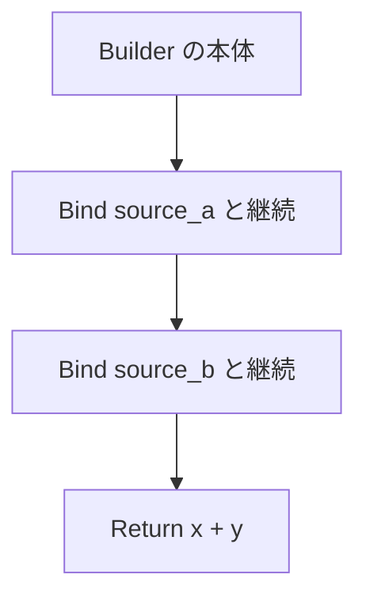

# コンピュテーション式

コンピュテーション式は、束縛、失敗の短絡、要素の列挙、遅延を、ビルダーの操作として組み立てる構文です。

見た目は F# のコンピュテーション式に近いです。違うのは、`Builder { ... }` の `Builder` が実行時のオブジェクトではなく、**`Builder.tc` のモジュール名**だということです。コンパイル時に静的に解決されます。同名のローカル変数があっても、ビルダーの解決は変わりません。

## この記事のポイント

- `.tc` が 1 ファイルにつき 1 ビルダーです。ファイル名がビルダー名になります。`.tz` に関数を並べただけではビルダーになりません。
- `let!` や `return` は、`Bind` や `Return` などの操作へコンパイル時に展開されます。
- 標準では `Result`、`Maybe`、`IO` が `.tc` です。`task` は別の組み込み構文です。
- 関数本体、式ブロック、トップレベルではビルダー名を省略できます。型からビルダーを選びます。
- `and!` はスレッド並列ではありません。左から右へ評価して結合します。
- 継続は再利用できる関数です。`Task<T>` や `ref mut`、`Drop` 型は継続の中へ捕捉できません。

## ビルダーの定義

`Identity.tc` を置くと、プロジェクト内で `Identity { ... }` が使えます。操作は通常の関数です。型推論、ジェネリクス、型クラス制約もそのまま使えます。使っていない操作も型検査されます。

ビルダー名と `{` は同じ行に置きます。次の行に `{` を書くと、ビルダーではなく未知の値として `E1002` になります。

`.tz` に同じ関数を書いてもビルダーにはなりません。

```text
error[E1018]: unknown computation builder 'Identity'; define its operations in Identity.tc
```

`Name {}` は、同じプロジェクトに `Name.tc` があるとき空のコンピュテーション式、ないときはフィールドのない空レコードです。別モジュールの空レコードは `Module.Name {}` と書きます。

カスタム演算子、暗黙の `yield`、高階型、実行時のビルダーオブジェクトは 0.1.0 にはありません。`try` / `with` / `finally` はビルダー操作ではなく、`Result` を作る独立した式です。

## 構文と展開

`B` は解決されたビルダー、`C` は後続です。`delay(C)` は、`Delay` があれば `B.Delay (\() -> C)`、なければ `C` そのものです。

| 構文 | 展開 | 補足 |
| --- | --- | --- |
| `let x = value; C` | 通常の束縛のあと `C` | ビルダー操作にはしない |
| `let! x = value; C` | `B.Bind value (\x -> C)` | 型注釈は取り出した値に付く |
| `do! value; C` | `B.Bind value (\() -> C)` | 成功値は `unit` |
| `return value` | `B.Return value` | ブロック末尾だけ。早期 return ではない |
| `return! value` | `B.ReturnFrom value` | 既存の計算をそのまま返す |
| `yield value` | `B.Yield value` | 複数置くには `Combine` が要る |
| `yield! value` | `B.YieldFrom value` | 既存の列を取り込む |
| 空本体、末尾の通常式 | `B.Zero()` | 通常式は `unit` に限り、評価したうえで結果は `Zero`。暗黙の `return` はない |
| `if cond { C1 } else { C2 }` | 選ばれた枝だけ | 通常の `if` |
| `if cond { C }` | `else { B.Zero() }` を補う | `then` 側も `Zero` と同じ型。`return 1` だけの省略は型エラー |
| `C1; C2` | `B.Combine C1 (delay(C2))` | `Delay` がないと第 2 引数は正格 |
| `for pat in values do C` | `B.For values (\pat -> C)` | 列の型は `For` の第 1 引数が決める |
| `while cond do C` | `B.While (\() -> cond) (B.Delay (\() -> C))` | `While` と `Delay` の両方が要る |
| `match! expr with ...` | `B.Bind expr (\val -> match val with ...)` | パターンの規則は通常の `match` と同じ |
| `use x = expr` | 言語の `Drop` | `Using` は呼ばない |
| `use! x = expr` | 取り出してから `use` | `and!` とは組み合わせられない |

式全体は `delay(C)` で包みます。`Run` があれば、さらに `B.Run (delay(C))` です。`Delay` と `Run` は片方だけでも定義できます。`while` だけは両方必要です。`Delay` がなく `while` を書くと `E1018` は `'Delay'` を、`Delay` だけで `While` がないと `'While'` を報告します。

```text
error[E1018]: computation builder 'Identity' does not define 'While'
```

未定義の操作を恒等関数で補うことはありません。操作名の大文字小文字は区別されます。

`Zero` は引数を取らない値です。`fn Zero = ()` や `def Zero :: unit` は空本体に使えます。`unit -> unit` の関数にすると、引数 0 個で呼ぼうとして `E1006` になります。

`For` は配列専用ではありません。ビルダーが宣言した型を受けます。標準の `Maybe` と `Result` の `For` は `Copy<'a> => ['a]` だけです。`IO` の `For` はそれに加え `Capture<'a>` も要ります。通常の `for...in`（リスト、文字列、範囲、`Seq`）とは契約が違います。

`if` の条件や `for` の列にレコードリテラルや別のコンピュテーション式を書くときは、丸括弧で囲みます。`let` の右辺、`return` の引数、普通のラムダ本体には、外側のビルダーは持ち込まれません。

極端に深いブロックや、展開後の継続が深すぎる式は `E0002` になります。

2 つの値を足す式は、入れ子の `Bind` と `Return` になります。



`Bind` が失敗値で継続を呼ばなければ、後続はスキップされます。失敗より前の通常の `let` や `unit` 式はスキップされません。トラップが自動で `None` や `Error` になることもありません。

## 自作ビルダーの例

恒等モナドです。値をそのまま通します。

`Identity.tc`:

```tsuzuri project=identity file=Identity.tc
def Return :: 'a -> 'a
fn Return value = value

def ReturnFrom :: 'a -> 'a
fn ReturnFrom value = value

def Bind :: 'a -> ('a -> 'b) -> 'b
fn Bind value next = next value

def Zero :: unit
fn Zero = ()
```

`Main.tz`:

```tsuzuri project=identity file=Main.tz run=42
Identity {
    let! first = 20
    let! second = 22
    do! Identity {}
    return first + second
}
```

実行結果:

```text
42
```

操作は普通の関数なので、`Identity.Return 42` のように直接呼べます。

## 標準のビルダー

| ビルダー | 定義 | 用途 | 失敗したとき |
| --- | --- | --- | --- |
| `Result` | `std/Result.tc` | 理由つきの成功と失敗 | 最初の `Error` で継続を呼ばない |
| `Maybe` | `std/Maybe.tc` | 値の有無 | `None` で継続を呼ばない |
| `IO` | `std/IO.tc` | 副作用の遅延合成 | 実行するまで副作用は起きない |
| `task` | 言語組み込み | 並行タスク | コールドで 1 回消費。`.tc` ではない |

`Maybe` と `Result` は `Bind`、`Return`、`ReturnFrom`、`Zero`、`Combine`、`Delay`、`Run`、`For`、`While`、`MergeSources`、`BindReturn`、`Bind2` を定義しています。`IO` はこれらに加え `Using` を定義しています。公開の `IO.run` はありません。実行するのは `main`、`do!`、`let!`、トップレベルの `IO` 式です。

```tsuzuri run=42
let answer: Result<i64, string> = Result {
    let! first = Result.Ok 20
    let! second = Result.Ok 22
    return first + second
}
match answer with
| Result.Ok value -> value
| Result.Error _ -> 0
```

実行結果:

```text
42
```

`let!` の右辺が `Error` や `None` のとき、その右辺自体は評価されます。呼ばれないのは継続、つまり後続の `let!` や `return` です。エラー型はブロック全体で同じである必要があります。`Maybe` と `Result` の変換は自動ではありません。`Maybe.to_result` か `Result.to_maybe` を明示します。`?` 演算子はありません。

## ビルダー名を省略する

関数本体、式ブロック、`Main.tz` のトップレベルでは、`Builder { ... }` を書かずに `let!` や `return` を置けます。`main` だけの特例ではありません。ラムダやローカル関数でも同じです。トップレベルの名前付き関数には、これまでどおり `def` のシグネチャが要ります。

```tsuzuri run=42
def answer :: unit -> Maybe<i64> = \() ->
    let! first = Maybe.Some 20
    let! second = Maybe.Some 22
    return first + second

match answer () with
| Maybe.Some value -> value
| Maybe.None -> 0
```

実行結果:

```text
42
```

選び方は次の順です。

1. 期待する結果型が 1 つのビルダーに決まるなら、それを使う。`Maybe<i64>` なら `Maybe` です。
2. 結果型が未定なら、最初の `let!` か `do!` の右辺の型から選ぶ。
3. 候補が複数、または 0 なら `E1018` です。宣言順では選びません。

注釈のない整数リテラルは、まだ型が決まっていないので複数のビルダーに合います。

```text
let! value = 42
return value
```

```text
error[E1018]: ambiguous computation builders: IO, Maybe, Result; use an explicit Builder { ... } or a result type annotation
```

どの `Bind` にも合わない具体型は、別の文言です。

```text
error[E1018]: no computation builder has a Bind operation for this value; use an explicit builder or a type annotation
```

期待する結果型にビルダーがないとき（`def main :: unit -> i32` の `i32` など）は、`IO` の `let!` / `do!` をその場で実行します。`IO` 値は作りません。詳しくは [IO](../built-in-types-and-modules/io.md) を見てください。直接実行できるのは `IO` の束縛だけです。

違うビルダーを勝手に平坦化したり、`None` を `Error` に変えたりはしません。`Using` がなければ、書いた順の入れ子（`Maybe<Result<T, E>>` など）のままです。

`IO.Using` は、別のビルダーの計算を `IO` の中で走らせるための操作です。

```text
def Using :: (('a -> 'b) -> 'c) -> ('a -> IO<'b>) -> IO<'c>
```

`IO` が実行されたときだけ内側の source を呼び、継続が呼ばれたときだけ後続の `IO` を進めます。シグネチャが合わない `Using` は型エラーになり、別の合成へは倒れません。

## and! と融合

`and!` は、直前の `let!` と独立した計算をまとめます。スレッドは起動しません。`Task.parallel` の代わりにもなりません。

```tsuzuri run=42
let answer = Maybe {
    let! left = Maybe.Some 20
    and! right = Maybe.Some 22
    return left + right
}
match answer with
| Maybe.Some value -> value
| Maybe.None -> 0
```

実行結果:

```text
42
```

右辺は左から右へ、それぞれ 1 回評価されます。途中が `None` や `Error` でも、右辺の評価自体は省略されません。短絡するのは、その後の結合です。同じグループの名前は、そのグループの右辺からは見えません（`E1002`）。名前の重複は `E1001` です。`mut` と型注釈は付けられます。

`Result` の `and!` では、左の `Error` が優先されます。

ちょうど 2 つの束縛と末尾の `return` だけで、ビルダーに `Bind2` があるときは `Bind2 left right (\l r -> ...)` になります。それ以外は `MergeSources` が必要で、なければ `E1018` です。単一の `let!` と末尾の `return` だけなら、`BindReturn` があればそれを使います。なければ `Bind` と `Return` です。型が合わないときは型エラーで、別の展開には戻りません。

次の例は、両方が左から順に実行されることを示します。

```tsuzuri run=left%0Aright%0A42
def main :: unit -> i32 = \() ->
    let! both = IO {
        let! left = IO {
            do! IO.write_line "left"
            return 20
        }
        and! right = IO {
            do! IO.write_line "right"
            return 22
        }
        return left + right
    }
    do! IO.write_line both
    0
```

実行結果:

```text
left
right
42
```

## match!

`match!` は、計算から値を取り出して通常の `match` をします。対象式は 1 回だけ評価されます。継続が呼ばれなければ、どの節も走りません。網羅性、ガード、所有権の分解は通常の `match` と同じです。節の中で `return` や `let!` も書けます。

```tsuzuri run=42
let answer = Maybe {
    match! Maybe.Some (true, 42) with
    | (true, value) -> return value
    | _ -> return 0
}
match answer with
| Maybe.Some value -> value
| Maybe.None -> 0
```

実行結果:

```text
42
```

網羅していない `match!` は `E1021` です。`task` に `match!` を足すことはありません。

## use と use!

コンピュテーション式と `task` の中でも、`use` と `use!` が使えます。

- `use x = expr` は通常の式を評価し、スコープを抜けるときに `Drop` します。
- `use! x = expr` は `let!` と同様に値を取り出してから、`use` で束縛します。

型は [Drop](../ownership-and-memory/drop.md) を実装している必要があります。していない型は `E1005` です。`use mut` は `E0002` です。`use!` を `and!` グループに入れることも `E0002` です。

> [!NOTE]
> ここの `use` / `use!` は、ビルダーの `Using` を呼びません。スコープ終了時の `Drop` です。`Using` は、上で見た `IO` のように別ビルダーを合成する操作です。

`let!` や `use!` の後続は継続クロージャです。それより前に束縛した `Drop` 型を継続の中で参照すると、`E1005` になります。

## 所有権

1. 継続は再利用できる関数です。`Task<T>` や `ref mut` を継続へ捕捉すると `E1005` です。
2. 外の `let mut` への代入は、継続の中では可変束縛として見えず `E1014` です。
3. `let! mut x = expr` は、その継続の中のローカルを可変にするだけです。後続の `let!` をまたいで、外の可変変数を共有する機能ではありません。

```tsuzuri run=42
let answer = Maybe {
    let! mut total = Maybe.Some 20
    total = total + 22
    return total
}
match answer with
| Maybe.Some value -> value
| Maybe.None -> 0
```

実行結果:

```text
42
```

裸の `do expr` は `unit` の通常式です。モナドを実行する `do!` とは別です。`task` の暗黙本体は `Task<T>` を作り、`and!` や `yield` は付きません。詳しくは [Task 式](../async-tasks-and-lazy/task.md) を見てください。

## 性能

継続がその場で呼ばれ、外へ逃げないときは、ヒープのクロージャではなく直接呼び出しに特殊化されることがあります。外へ逃げる継続、呼び出し先が動的なもの、捕捉した所有値を消費するものは、ヒープ上の環境に戻します。特殊化の数には内部の上限があり、超えてもエラーにはせず通常の経路を使います。これはビルダーの個数制限ではありません。

`Bind` が継続を複数回呼ぶこと、`Delay` / `Run`、短絡、評価順、トラップ、配列の境界検査は残ります。どのビルダーも最速になる、という保証はありません。測定条件は [コンピュテーション式の比較](../../../docs/benchmarks.md#コンピュテーション式の比較) にあります。

## 他の言語との比較

| 言語 | 構文 | 定義 | 特徴 |
| --- | --- | --- | --- |
| Tsuzuri | コンピュテーション式 | `.tc`（1 ファイル 1 ビルダー） | 静的解決。所有権と借用の検査と一緒に使う |
| F# | Computation Expressions | ビルダー型のメソッド | 実行時オブジェクト。カスタム演算子がある |
| Haskell | do 記法 | `Monad` などの型クラス | 型クラスで解決する。評価は既定で遅延 |
| Rust | `?` や `async` ブロック | 言語組み込み | 任意のモナド構文はユーザーが足せない |
| Scala | for 内包表記 | `flatMap` や `map` | メソッド呼び出しへ展開する |

## まとめ

- ビルダーは `.tc` のファイル名です。実行時オブジェクトではありません。
- `let!`、`do!`、`return`、`yield`、`for`、`while` は、対応する操作へ展開されます。無い操作は `E1018` です。
- 関数本体ではビルダー名を省略できます。曖昧なときは型注釈か明示的な `Builder { ... }` が要ります。
- `and!` は左から右の結合で、スレッド並列ではありません。
- 継続は普通の関数です。`Task`、`ref mut`、`Drop` 型は捕捉できません。

## 関連項目

- [Task 式](../async-tasks-and-lazy/task.md)
- [Async 式](../async-tasks-and-lazy/async.md)
- [Lazy 式](../async-tasks-and-lazy/lazy.md)
- [Result](../built-in-types-and-modules/result.md)
- [Maybe](../built-in-types-and-modules/maybe.md)
- [IO](../built-in-types-and-modules/io.md)
- [所有権とムーブ](../ownership-and-memory/ownership.md)
- [Drop とリソースの解放](../ownership-and-memory/drop.md)
- [言語仕様（コンピュテーション式）](../../../docs/language.md#コンピュテーション式)
- [言語仕様（ビルダー名を省略した本体）](../../../docs/language.md#ビルダー名を省略した本体)
- [言語仕様（操作と展開規則）](../../../docs/language.md#操作と展開規則)
- [言語仕様（構文・評価順序・所有権）](../../../docs/language.md#構文評価順序所有権)
- [言語仕様（コンピュテーション式の性能）](../../../docs/language.md#コンピュテーション式の性能)
- [言語リファレンスの目次](../index.md)
