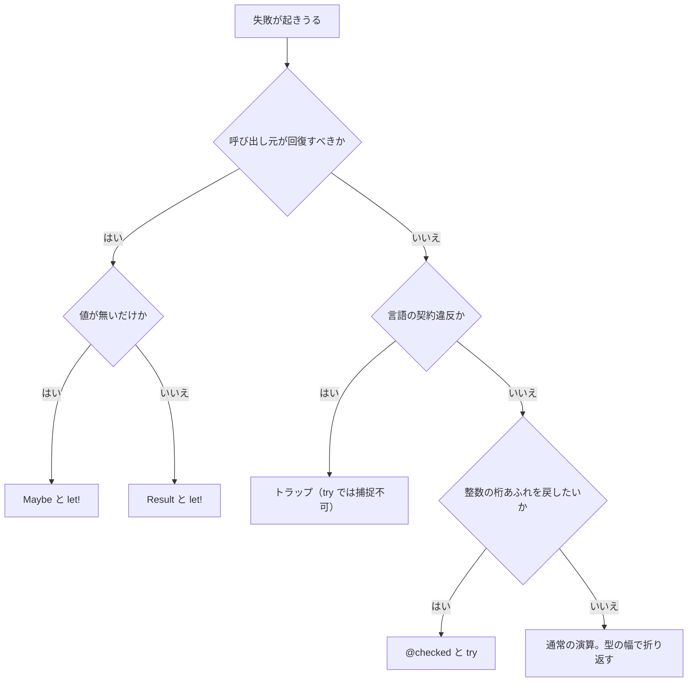

# 例外処理

Tsuzuri は、失敗を 1 つの仕組みにまとめません。想定している失敗は `Maybe` や `Result` の値として扱います。言語の契約を破った操作はトラップします。例外として捕捉できるのは、検査付き算術が送出する `OverflowException` だけです。

Rust のような `?` 演算子は存在せず、記述すると字句解析エラー `E0001` になります。C# のような例外の自動伝播もありません。戻り値で表す失敗は、コンピュテーション式の `let!` で短絡します。

## この記事のポイント

- 呼び出し元が回復する失敗は `Maybe` や `Result` で返します。`?` 演算子はありません。
- 伝播には `let!` を使います。`None` や `Error` の後は続きを実行しません。
- ゼロ除算、境界外アクセス、`assert` の失敗、パターン不一致はトラップです。`try` では捕捉できません。
- `@checked` の整数演算だけが `OverflowException` を送出し、`try` がそれを `Result` に変えます。
- トラップはスタックを巻き戻しません。残っている `Drop` も実行しません。

## 失敗の種類

| 種類 | 表し方 | 呼び出し元で回復できるか |
| --- | --- | --- |
| 値が存在しない | `Maybe<'a>` | 可能（`match` または `let!`） |
| 理由を伴う失敗 | `Result<'a, 'e>` | 可能（`match` または `let!`） |
| 整数オーバーフローの回復 | `@checked` と `try` | 可能（結果は `Result`） |
| 言語の契約違反 | トラップ | 不可（プロセスが停止） |

`Maybe` と `Result` は標準ライブラリの共用体です。特別なインポートは要りません。

```text
union Maybe<'a> = None | Some of 'a
union Result<'a, 'e> = Ok of 'a | Error of 'e
```

`get` で中身を取り出す場合、存在しない値や `Error` ではトラップします。回復したい場所では `match` を使います。

## 判断の流れ

次の順で選ぶと、捕捉できない失敗と、値として扱う失敗が混ざりにくくなります。



## 想定内の失敗を値で返す

在庫や数量のように、失敗が仕様の一部なら、例外ではなく値にします。理由が要るときは `Result`、有無だけなら `Maybe` です。

```tsuzuri run=360%20%2F%20quantity%20must%20be%20positive
def parse_qty :: i64 -> Result<i64, string> = \qty ->
    if qty > 0 then Ok qty else Error "quantity must be positive"

def line_total :: i64 -> i64 -> Result<i64, string> = \price qty ->
    Result {
        let! count = parse_qty qty
        return price * count
    }

def show :: Result<i64, string> -> string = \result ->
    match result with
    | Ok value -> to_string value
    | Error message -> message

show (line_total 120 3) + " / " + show (line_total 120 0)
```

実行結果:

```text
360 / quantity must be positive
```

`let!` は成功の中身だけを束縛します。`Error` なら、その後の `return` は実行しません。エラー型はブロック全体で同じ型です。別のエラー型へ暗黙に変換する演算子はありません。

`Maybe` も同じ形です。割引コードが無いときは `None` になり、引き算は走りません。

```tsuzuri run=800%20%2F%20none
def discount :: i64 -> Maybe<i64> = \code ->
    if code == 10 then Some 200 else None

def payable :: i64 -> i64 -> Maybe<i64> = \price code ->
    Maybe {
        let! off = discount code
        return price - off
    }

def show :: Maybe<i64> -> string = \value ->
    match value with
    | Some amount -> to_string amount
    | None -> "none"

show (payable 1000 10) + " / " + show (payable 1000 0)
```

実行結果:

```text
800 / none
```

> [!NOTE]
> コンピュテーション式の `return` は、関数からの早期脱出ではありません。成功を表す `Ok` や `Some` を作る構文です。

`Result.get` と `Maybe.get` は、期待と違うケースだと `unreachable ()` と同じトラップになります。メッセージは `non-exhaustive match` です。`try` では捕捉できません。

## 契約違反はトラップ

次のような操作は、プログラムの契約を破っています。Tsuzuri は例外にせず、その場でトラップします。

| 操作 | 報告される理由 |
| --- | --- |
| `assert` の失敗 | `assertion failed` |
| 整数のゼロ除算 | `integer division by zero` |
| 符号付き最小値の `/ -1` や `% -1` | `integer division overflow` |
| 配列・リスト・`Vec` の範囲外添字 | `index out of bounds` |
| `for` の範囲でステップが 0 | `range step is zero` |
| 一致しないリストパターンの `for` | `pattern mismatch` |
| `unreachable ()` | `non-exhaustive match` |
| どの `try` も捕捉しない `@checked` | `unhandled OverflowException: arithmetic operation resulted in an overflow` |

コンパイラは、このほかに確保サイズの不正、確保失敗、文字列長の上限、数値ランタイム、Unicode、デバッグ出力の失敗、スタック枯渇も区別します。

`tsuzuri run` はトラップ位置を既定で有効にします。子プロセスは標準エラーへ、次の形で理由と位置を出します。

```text
trap: assertion failed at Main.tz:4:5
```

ドライバは同じ位置に `E2005` も出します。終了コードは 0 ではありません。`run --json` では、この `trap:` 行を `E2005` のメッセージに入れ、生のトラップログを別に流しません。

`tsuzuri build` は既定では位置情報を入れません。`--trap-info` を付けると、ネイティブでは標準エラーのレポーターを、WASM では `tsuzuri_trap_site` を追加し、成果物の隣に `<output>.trap.json` を出します。中身は `version` と `sites` です。各サイトは `id`、`kind`、`path`、`span` を持ちます。これは発生しうる位置の表であり、実行して落ちた回数ではありません。

```sh
tsuzuri build Main.tz --trap-info -o app
```

WASM では追加のインポートはありません。トラップのあと、ホストは `instance.exports.tsuzuri_trap_site()` の ID をサイドテーブルと照合します。この ID は直近のトラップのままで、次の正常な呼び出しの開始時にはリセットされません。

> [!WARNING]
> トラップはスタックを巻き戻しません。まだ実行していない `Drop` は呼ばれません。トラップしたインスタンスのヒープは不完全なままなので、WASM の境界ではそのインスタンスを再利用しません。

通常の `match` は網羅していないとコンパイルエラー `E1021` です。実行時の `pattern mismatch` は、たとえば `for [only] in [[1, 2]]` のように、要素数が合わないパターンで走査したときに起きます。

## 検査付き算術だけが例外になる

通常の整数の `+`、`-`、`*`、`**`、単項 `-` は、型の幅で折り返します。`i32` の最大値に 1 を足すと、最小値になります。

```tsuzuri run=-2147483648
let wrapped = 2147483647 + 1
to_string wrapped
```

実行結果:

```text
-2147483648
```

`@checked` を式または文の前に置くと、その中に書いた整数の `+`、`-`、`*`、`**`、単項 `-` は折り返さず、`OverflowException` を送出します。メッセージは `Arithmetic operation resulted in an overflow.` です。`/` と `%` は対象外で、ゼロ除算や符号付きの除算オーバーフローは、`@checked` の中でもトラップします。

```text
try
    本体
with
| パターン -> ハンドラー
finally
    後処理
```

`try` の値の型は `Result` です。本体が成功すれば `Ok`、ハンドラーの結果は `Error` です。ハンドラーが返す型は、型クラス `Err`（`msg :: ref 'a -> string`）を実装している必要があります。

```tsuzuri run=42%20%2F%20Arithmetic%20operation%20resulted%20in%20an%20overflow.
def safe_add :: i32 -> i32 -> Result<i32, 'E> = \x y ->
    try
        @checked x + y
    with
    | e is OverflowException -> e

def show :: i32 -> i32 -> string = \x y ->
    match safe_add x y with
    | Ok value -> to_string value
    | Error e -> e.msg

show 40 2 + " / " + show 2147483647 1
```

実行結果:

```text
42 / Arithmetic operation resulted in an overflow.
```

戻り値型が `Result<'T, 'E>` で、`'E` がそこにしか現れず、本体が `try` なら、`'E` は `Exception` に推論されます。上の例のように `@'E : Err` は省略できます。

例外は字句的です。同じ関数本体で、最も内側の `try` へ飛びます。関数呼び出しやラムダ式の境界は越えません。どの `try` も捕捉しなければトラップです。詳細は [try 式](try-with-finally.md) にあります。

オーバーフローを `Maybe` で受けたいときは、`Int` の検査付き関数を使います。ゼロ除算も `None` になり、トラップしません。

```text
Int.checked_add :: Integer<'a> => 'a -> 'a -> Maybe<'a>
Int.checked_sub :: Integer<'a> => 'a -> 'a -> Maybe<'a>
Int.checked_mul :: Integer<'a> => 'a -> 'a -> Maybe<'a>
Int.checked_div :: Integer<'a> => 'a -> 'a -> Maybe<'a>
Int.checked_rem :: Integer<'a> => 'a -> 'a -> Maybe<'a>
Int.checked_neg :: SignedInteger<'a> => 'a -> Maybe<'a>
Int.checked_pow :: Integer<'a> => 'a -> i64 -> Maybe<'a>
```

```tsuzuri run=42%20%2F%20none
def show :: i32 -> i32 -> string = \x y ->
    match Int.checked_add x y with
    | Some value -> to_string value
    | None -> "none"

show 20 22 + " / " + show 2147483647 1
```

実行結果:

```text
42 / none
```

`Int.checked_div 10 0` と、`i32` の最小値を `-1` で割る呼び出しも `None` です。

## 他の言語との比較

| | Tsuzuri | Rust | F# | C# |
| --- | --- | --- | --- | --- |
| 想定内の失敗 | `Result` / `Maybe` | `Result` / `Option` | `Result` / `option` | 例外に寄せることが多い |
| 伝播 | `let!`。`?` は無い | `?` | コンピュテーション式 | 呼び出し元へ自動伝播 |
| 契約違反 | トラップ。捕捉できない | panic | 例外として上がることが多い | 例外 |
| 整数の桁あふれ | 既定は折り返し。`@checked` だけ例外 | wrapping が既定 | `checked` で例外 | `unchecked` が既定の文脈が多い |
| 後始末 | `Drop`。`use` は静的な要求 | `Drop` | `use` と `IDisposable` | `using` と `IDisposable` |

C# や F# の `try` でゼロ除算を捕捉するような書き方は、Tsuzuri ではトラップのままです。呼び出し元で回復する場合は、`Int.checked_div` などを利用して値として扱います。

## まとめ

- 回復する失敗は `Maybe` か `Result` です。伝播は `let!` で、`?` はありません。
- ゼロ除算、範囲外、`assert`、パターン不一致、`unreachable` はトラップです。`try` では捕捉できません。
- `tsuzuri run` はトラップ位置を既定で報告します。`build` では `--trap-info` が必要です。
- `@checked` は整数の加減乗とべき乗、単項マイナスだけを例外にします。
- トラップは `Drop` を実行しません。リソースの後始末をトラップに頼らないでください。

## 関連項目

- [try 式](try-with-finally.md)
- [use キーワード](use.md)
- [assert 式](assert.md)
- [Exception](../built-in-types-and-modules/exception.md)
- [Result](../built-in-types-and-modules/result.md)
- [Maybe](../built-in-types-and-modules/maybe.md)
- [Int](../built-in-types-and-modules/int.md)
- [コンピュテーション式](../computation-expressions/computation-expressions.md)
- [Drop とリソースの解放](../ownership-and-memory/drop.md)
- [コンパイラ オプション](../compiler/option.md)
- [言語仕様: 検査付き算術と例外](../../../docs/language.md#検査付き算術と例外)
- [言語仕様: トラップ位置](../../../docs/language.md#トラップ位置)
- [言語仕様: Maybe と Result](../../../docs/language.md#maybe-と-result)
- [言語リファレンスの目次](../index.md)
