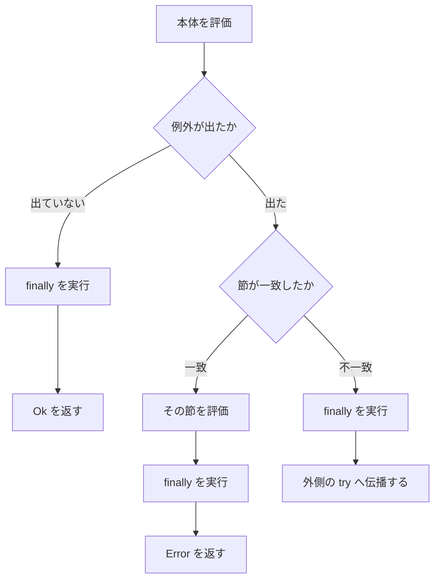

# try 式

`try ... with ... finally` は、検査付き算術が送出した `OverflowException` を受け取り、`Result` の値に変える式です。関数の境界を越えて例外を運ぶ仕組みではありません。ゼロ除算や `assert` の失敗も、この式では捕捉できません。

## この記事のポイント

- `try` の型は `Result<'T, 'E>` です。成功は `Ok`、ハンドラーの結果は `Error` です。
- 例外は同じ関数本体の、最も内側の `try` にだけ飛びます。
- ハンドラーの型は `Err` を実装し、すべての節で同じ型です。
- `finally` は成功・捕捉・伝播のすべての経路で、結果が外へ出る前に実行されます。
- どの節にも一致せず、外側の `try` もなければトラップします。

## 基本の書き方

`try` は文脈つきの名前です。同じ括弧の深さに `with` が続くときだけ、try 式として読まれます。`with` の無い `try 1` は、ただの名前 `try` です。

```text
try
    本体
with
| パターン -> ハンドラー
| パターン when 条件 -> ハンドラー
| 名前 is OverflowException -> ハンドラー
finally
    後処理
```

`finally` は省略できます。本体もハンドラーも、ふつうの式です。一行にも書けます。

```tsuzuri run=42
def bump :: i32 -> Result<i32, Exception> = \x ->
    try @checked x + 1 with | e -> e

match bump 41 with
| Ok value -> to_string value
| Error _ -> "overflow"
```

実行結果:

```text
42
```

価格に税を足す例です。収まる加算は `Ok`、`i32` の上限を超える加算は `Error` になり、例外の `msg` を表示します。

```tsuzuri run=42%20%2F%20Arithmetic%20operation%20resulted%20in%20an%20overflow.
def safe_add :: i32 -> i32 -> Result<i32, 'E> = \x y ->
    try
        @checked x + y
    with
    | e is OverflowException -> e

def show :: i32 -> i32 -> string = \x y ->
    match safe_add x y with
    | Ok value -> to_string value
    | Error e -> e.msg

show 40 2 + " / " + show 2147483647 1
```

実行結果:

```text
42 / Arithmetic operation resulted in an overflow.
```

`| e is OverflowException -> e` は、例外レコードの `kind` が `OverflowException` であることを調べ、レコード全体を `e` に束縛します。いま送出される種類はこの 1 つだけなので、`| e -> e` でも同じ例外を受け取れます。`is` は、種類が増えたときに節を分けるための書き方です。

## 評価の順序



成功なら本体のあと、捕捉ならハンドラーのあと、不一致なら伝播の前に、`finally` が実行されます。`finally` の型は `unit` です。値を返すと `E1003` になります。

次の例は、`i8` の 20 は 2 倍でき、100 は桁あふれします。ハンドラーは捕捉したときだけ走り、`finally` は両方で走ります。

```tsuzuri run=finally%0A40%0Ahandler%0Afinally%0Aoverflow
def step :: i8 -> string = \x ->
    let outcome =
        try
            @checked x * 2y
        with
        | e ->
            do! IO.write_line "handler"
            e
        finally
            do! IO.write_line "finally"
    match outcome with
    | Ok value -> to_string value
    | Error _ -> "overflow"

do! IO.write_line (step 20y)
do! IO.write_line (step 100y)
```

実行結果:

```text
finally
40
handler
finally
overflow
```

節の `when` が偽なら、その節は一致しません。内側の `finally` のあと、外側のハンドラーが受け取ります。

```tsuzuri run=inner%20finally%0Aouter%20handler%0Aoverflow
def step :: i8 -> string = \x ->
    let outcome =
        try
            let inner =
                try
                    @checked x * x
                with
                | e when false -> e
                finally
                    do! IO.write_line "inner finally"
            match inner with
            | Ok value -> value
            | Error _ -> 0y
        with
        | e is OverflowException ->
            do! IO.write_line "outer handler"
            e
    match outcome with
    | Ok value -> to_string value
    | Error _ -> "overflow"

step 12y
```

実行結果:

```text
inner finally
outer handler
overflow
```

内側の `try` を外側の本体にそのまま置くと、外側の成功値は `Result` です。つまり `Result<Result<i8, Exception>, Exception>` になります。上の例のように、内側は本体の中で `match` してから、外側へ `i8` を返してください。

## ハンドラーの型

ハンドラーが返す値は `Error` の中身になります。型クラス `Err` の `msg :: ref 'a -> string` が必要です。`i32` を返すと `E1005`（`no instance for Err<i32>`）です。節ごとに型が違うと `E1003` です。

標準の受け皿は `Exception` です。独自のレコードでも、`Err` を実装すればハンドラーの結果にできます。

```tsuzuri run=failure%201
record Failure { code: i32 }

instance Err<Failure> {
    fn msg failure = "failure " + to_string failure.code
}

def safe :: i32 -> Result<i32, Failure> = \x ->
    try
        @checked x + 1
    with
    | _ is OverflowException -> Failure { code: 1 }

match safe 2147483647 with
| Ok value -> to_string value
| Error failure -> Err.msg (ref failure)
```

実行結果:

```text
failure 1
```

戻り値型が `Result<'T, 'E>` で、`'E` が戻り値以外に現れず、本体が `try` なら、`'E` は捕捉した `Exception` に推論されます。シグネチャの `@'E : Err` は省略できます。最初の `safe_add` がこの形です。

`Exception` のフィールド `msg` は `string` 型（非 Copy）です。`let msg = e.msg` のようにフィールドを直接束縛すると所有権がムーブしてしまい、後から `e` 全体を返すことができなくなります。ハンドラー内でメッセージを参照しつつ同じ例外 `e` を返したい場合は、サンプルのように補間文字列 `$"{e.msg}"` で参照として埋め込むか、`clone_string (ref e.msg)` で複製します。

```tsuzuri run=overflow%3A%20Arithmetic%20operation%20resulted%20in%20an%20overflow.%0A42%20%2F%20failed
def safe :: i32 -> i32 -> string = \x y ->
    let outcome =
        try
            @checked x + y
        with
        | e is OverflowException ->
            do! IO.write_line $"overflow: {e.msg}"
            e
    match outcome with
    | Ok value -> to_string value
    | Error _ -> "failed"

safe 40 2 + " / " + safe 2147483647 1
```

実行結果:

```text
overflow: Arithmetic operation resulted in an overflow.
42 / failed
```

`try` の本体、ハンドラー、`finally` に書いた `IO` の `let!` と `do!` は、その場で実行されます。遅延した `IO` アクションにはなりません。

## 例外が越えられない境界

送出は、同じ関数本体にある最も内側の `try` へ直接飛びます。呼び出し先の関数や、ラムダ式の中で起きた例外は、呼び出し元の `try` では捕捉できません。巻き戻しはありません。

```text
def boom :: i32 -> i32 = \x -> @checked x + 1

def safe :: i32 -> Result<i32, Exception> = \x ->
    try
        boom x
    with
    | e -> e
```

`safe 2147483647` はハンドラーに入りません。`boom` の `+` の位置でトラップします。`tsuzuri run` の標準エラーは、次の形です。パスと行列は、その加算の位置です。

```text
trap: unhandled OverflowException: arithmetic operation resulted in an overflow at Main.tz:1:41
```

`@checked` をラムダの外側に書いても同じです。注釈の中に書いたラムダの演算子は検査されますが、送出はそのラムダの中で完結し、外の `try` には届きません。

```text
try
    @checked (\y -> y + 1) x
with
| e -> e
```

名前付き関数の中の演算は、呼び出し側の `@checked` では検査されません。`@checked add x y` の `add` が普通の `+` なら、上限を超えても折り返します。検査したい演算子は、`try` と同じ関数本体の `@checked` の中に書いてください。

どの節にも一致せず、外側にも `try` がない例外はトラップになります。`tsuzuri run` は位置つきで報告し、終了コードは 0 ではありません。

`finally` のある `try` の中から、外側の `for` や `while` へ `break` と `continue` では出られません。`E1023` です。`finally` が必ず走ることを、ループの途中脱出で飛ばさないためです。`finally` の無い `try` なら、外側のループへの `break` や `continue` は記述できます。

## @checked が検査する演算

`@checked` は、直後の式または次の文に書かれた整数演算に付きます。対象は `+`、`-`、`*`、`**`、単項 `-` です。符号付きの最小値を否定する、符号なしの上限に 1 を足す、も `OverflowException` です。

`/` と `%` は対象外です。`try` の中でも、ゼロ除算は `integer division by zero`、符号付き最小値を `-1` で割ると `integer division overflow` でトラップします。こちらの回復には `Int.checked_div` と `Int.checked_rem` を使います。詳細は [例外処理](exception-handling.md) にあります。

## 注意点

- `try` は関数の戻り値型を自動では `Result` にしません。式の型が `Result` なので、関数の戻り値型もそれに合わせます。
- トップレベルの式が `Result` のままだと、`Display` が無くて表示できません。`match` して文字列や数値にしてください。
- 設計メモの `_specs/error-handling.md` には、未実装の書き方や、現在の所有権検査に通らない例が残っています。動く形は、このページの例のとおりです。
- `finally` の中でまた `@checked` が桁あふれすると、その例外が外へ出ます。内側で保留していた結果は捨てられます。

## 他の言語との比較

| | Tsuzuri の `try` | C# / F# の `try` | Rust |
| --- | --- | --- | --- |
| 捕捉できる対象 | `@checked` の `OverflowException` だけ | 多くの例外 | `catch_unwind` は限定的 |
| 結果の型 | 式が `Result` になる | 本体の型のまま | `Result` は普通の値 |
| 関数の境界 | 越えない | 越えて伝播する | `?` は値として伝播する |
| `finally` | ある。型は `unit` | ある | `Drop` が近い |

## まとめ

- `try ... with` は `Result` を返す式です。成功は `Ok`、ハンドラーは `Error` です。
- 例外は同じ関数の最も内側の `try` にだけ届きます。
- `finally` はどの経路でも、結果が確定して外へ出る前に実行されます。
- ハンドラーは `Err` を実装した同じ型を返します。`e.msg` はムーブに注意します。
- ゼロ除算や `assert` の失敗は、この式では捕捉・回復できません。

## 関連項目

- [例外処理](exception-handling.md)
- [Exception](../built-in-types-and-modules/exception.md)
- [Result](../built-in-types-and-modules/result.md)
- [Int](../built-in-types-and-modules/int.md)
- [use キーワード](use.md)
- [言語仕様: 検査付き算術と例外](../../../docs/language.md#検査付き算術と例外)
- [言語リファレンスの目次](../index.md)
