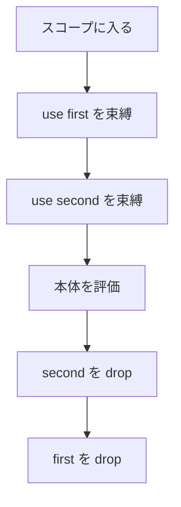

# use キーワード

`use` は、`Drop` を実装した値を不変で束縛する書き方です。解放のタイミングは `let` と同じで、スコープの終わりです。違いは、`Drop` を実装していない型をコンパイルエラーにすることです。ファイルを自動で閉じる構文ではありません。

`Drop` の規則そのものは [Drop とリソースの解放](../ownership-and-memory/drop.md) にあります。このページは、束縛の書き方と、いつ解放されるかを扱います。

## この記事のポイント

- `use name = value` は不変の束縛です。`use mut` は書けません。
- 右辺の型が `Drop` を実装していないと `E1005` です。
- 同じスコープの束縛は、宣言と逆順に解放されます。
- `use!` は、コンピュテーション式や `task` の中で、モナドから取り出して `use` します。
- スコープを待たずに解放するときは `Owned.drop` を呼びます。

## 基本の書き方

```text
use 名前 = 式
use 名前 : 型 = 式
```

関数本体では、改行で束縛を区切れます。波括弧のブロックの中では、束縛のあとが `;` です。

次の例は、チケットを 2 枚束縛し、スコープを出るときに番号の大きい方から解放します。`drop` の中の `do!` は、`drop` の戻り値が `unit` なので、その場で実行されます。

```tsuzuri run=3%0Adrop%202%0Adrop%201
record Ticket { id: i64 }

instance Drop<Ticket> {
    fn drop value = do! IO.write_line ("drop " + to_string value.id)
}

def main :: unit -> i32 = \() ->
    use first = Ticket { id: 1 }
    use second = Ticket { id: 2 }
    do! IO.write_line (to_string (first.id + second.id))
    0
```

実行結果:

```text
3
drop 2
drop 1
```

同じプログラムの `use` を `let` に変えても、解放順は同じです。`Drop` を実装した値は、`let` でもスコープの終わりに 1 回解放されます。`use` が足すのは、実装し忘れをコンパイル時に止める検査です。

```text
use count = 1
```

この束縛はコンパイルできません。整数リテラル `1` の型（既定の `i32`）は `Drop` を実装していないためです。

```text
error[E1005]: 'use' needs a value whose type implements Drop; i32 does not, so bind it with 'let'
```

可変にしたい値は `let mut` です。`use mut` は構文エラー `E0002` で、メッセージは `a use binding cannot be mutable; bind the value with 'let mut' instead` です。

## スコープの終わり

解放は、その束縛のスコープが終わるときです。ブロックの中で `use` すると、ブロックの値を計算したあと、外側の続きより前に解放されます。

```tsuzuri run=drop%209%0Akept%209
record Ticket { id: i64 }

instance Drop<Ticket> {
    fn drop value = do! IO.write_line ("drop " + to_string value.id)
}

def main :: unit -> i32 = \() ->
    let kept = {
        use ticket = Ticket { id: 9 };
        ticket.id
    }
    do! IO.write_line ("kept " + to_string kept)
    0
```

実行結果:

```text
drop 9
kept 9
```



`break`、`continue`、`return` でスコープを出るときも、残っている束縛は同じ逆順で解放されます。すでにムーブした値には `drop` は呼ばれません（非再帰の Drop 型の値は構造体の末尾に 1 バイトの生存管理フラグを持ち、ムーブ後は二重解放が防止されます）。

`try` の本体で束縛した値は、本体を出るときに解放されます。成功でも、例外でハンドラーへ飛ぶときでも、`finally` より前です。`finally` からその値は見えません。`finally` でも使うなら、`use` は `try` の外に置きます。

```tsuzuri run=held%203%0Adrop%203%0Afinally%0A40%0A---%0Adrop%203%0Afinally%0Aoverflow
record Ticket { id: i64 }

instance Drop<Ticket> {
    fn drop value = do! IO.write_line ("drop " + to_string value.id)
}

def caught :: i8 -> string = \x ->
    let outcome =
        try
            use ticket = Ticket { id: 3 }
            let doubled = @checked x * 2y
            do! IO.write_line ("held " + to_string ticket.id)
            doubled
        with
        | e -> e
        finally
            do! IO.write_line "finally"
    match outcome with
    | Ok value -> to_string value
    | Error _ -> "overflow"

do! IO.write_line (caught 20y)
do! IO.write_line "---"
do! IO.write_line (caught 100y)
```

実行結果:

```text
held 3
drop 3
finally
40
---
drop 3
finally
overflow
```

> [!WARNING]
> トラップはスコープを巻き戻しません。`assert` の失敗やゼロ除算のあと、まだ実行していない `drop` は呼ばれません。後始末をトラップに頼らないでください。

## 早く解放する

スコープの終わりを待てないときは、`Owned.drop` に所有権を渡します。`Drop` を実装した値なら、その場で `drop` が 1 回実行されます。渡したあとの名前は使えません。

```tsuzuri run=drop%207%0Aafter
record Ticket { id: i64 }

instance Drop<Ticket> {
    fn drop value = do! IO.write_line ("drop " + to_string value.id)
}

def main :: unit -> i32 = \() ->
    let ticket = Ticket { id: 7 }
    Owned.drop ticket
    do! IO.write_line "after"
    0
```

実行結果:

```text
drop 7
after
```

`Drop.drop` をユーザーの式から直接呼ぶことはできません。コンパイラが生成する解放処理からのみ呼ばれます。

## use! と名前の解釈

コンピュテーション式と `task` の中では、`use!` が `let!` と同じように値を取り出し、取り出した値を `use` の規則で束縛します。取り出した型が `Drop` を実装している必要があります。

```tsuzuri run=drop%204%0A4%0Anone
record Ticket { id: i64 }

instance Drop<Ticket> {
    fn drop value = do! IO.write_line ("drop " + to_string value.id)
}

def taken :: i64 -> Maybe<Ticket> = \id ->
    if id > 0 then Some (Ticket { id: id }) else None

def label :: i64 -> Maybe<i64> = \id ->
    Maybe {
        use! ticket = taken id
        return ticket.id
    }

def show :: Maybe<i64> -> string = \value ->
    match value with
    | Some id -> to_string id
    | None -> "none"

do! IO.write_line (show (label 4))
do! IO.write_line (show (label 0))
```

実行結果:

```text
drop 4
4
none
```

`None` のときはチケットが作られないので、`drop` も走りません。`use!` を `and!` の先頭にはできません。`E0002` で、`let!` で取り出してから `use` するよう求められます。

また、コンピュテーション式の `let!` や `use!` の後続式は継続クロージャとして展開されるため、それより前に束縛された Drop 型の値を後続式で参照しようとすると、Drop 型のクロージャ捕捉違反としてコンパイルエラー `E1005` になります。

`use` は、直後が束縛の形のときだけキーワードです。`use 名前 =`、`use 名前 :`、`use mut` がそれです。同名の関数を呼ぶ `use 2` は、ふつうの呼び出しのままです。

```tsuzuri run=3
def use :: i64 -> i64
fn use value = value + 1

let count = use 2
count
```

実行結果:

```text
3
```

標準ライブラリの `File.Handle` は `Drop` を実装していません。閉じるには `File.close` か `File.with_open` を使います。`use` では束縛できません。

## 他の言語との比較

| | Tsuzuri の `use` | F# の `use` | C# の `using` | Rust |
| --- | --- | --- | --- | --- |
| 対象 | `Drop` を実装した値 | `IDisposable` | `IDisposable` | すべての所有値 |
| 解放 | スコープ終了時の `drop` | `Dispose` | `Dispose` | スコープ終了時の `drop` |
| `let` との違い | `Drop` の静的検査だけ | `Dispose` を呼ぶかどうか | 宣言そのものが後始末 | `let` も同じタイミングで drop する |
| 可変束縛 | 不可。`let mut` を使う | `use` は可変にできる | 変数は別途宣言する | `let mut` |

F# から来ると、`use` が `Dispose` を追加で呼ぶように見えます。Tsuzuri では `Drop` がある型は `let` でも解放されます。`use` は「この型は解放処理を持つ」という検査です。

## まとめ

- `use` は不変束縛で、右辺に `Drop` を要求します。タイミングは `let` と同じです。
- 複数の束縛は宣言と逆順に、スコープの終わりで解放されます。
- `try` の中の `use` は、`finally` より前に解放されます。
- トラップでは、残りの `drop` は実行されません。
- 早く解放するなら `Owned.drop`、モナドから取り出すなら `use!` です。

## 関連項目

- [Drop とリソースの解放](../ownership-and-memory/drop.md)
- [例外処理](exception-handling.md)
- [try 式](try-with-finally.md)
- [File](../built-in-types-and-modules/file.md)
- [Owned](../built-in-types-and-modules/owned.md)
- [コンピュテーション式](../computation-expressions/computation-expressions.md)
- [言語仕様: 利用者定義の解放](../../../docs/language.md#利用者定義の解放drop)
- [言語リファレンスの目次](../index.md)
