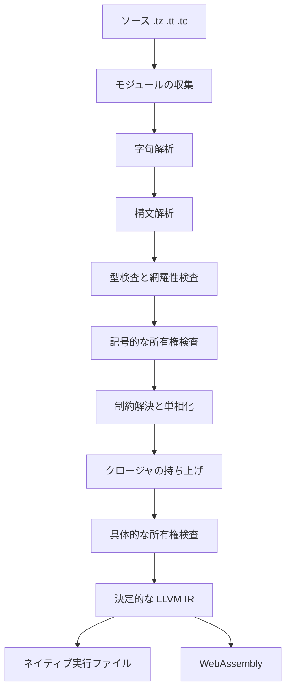

# Tsuzuri の特徴

Tsuzuri は、関数型の式と所有権を組み合わせた静的型付き言語です。Rust 製のコンパイラがプログラムを検査し、LLVM を通してネイティブコードと WebAssembly を出します。

目指しているのは、AI と人間が少ない暗黙ルールで堅牢なプログラムを書くことです。このページは Tsuzuri 0.1.0 の実装を、短い実行例で一周するツアーです。各機能の契約は、リンク先の詳細ページに譲ります。

## この記事のポイント

- 関数はカリー化され、パイプで次の処理へ渡せます。
- データの形はレコードと共用体で表し、`match` が網羅性を検査します。
- メモリは GC ではなく、所有権と借用でコンパイル時に検査します。
- 失敗は `Maybe` と `Result` の値です。入出力は `IO` に分けます。
- 同じソースからネイティブと WebAssembly を出せます。

## 式と関数

関数は型と実装を一緒に書きます。引数の一部だけ渡すと、残りを受け取る関数になります。パイプ `|>` は、左の値を右の関数へ渡します。

```tsuzuri run=42
def add :: Add<'value> -> 'value -> 'value = \left right -> left + right

let add_twenty = add 20
22 |> add_twenty
```

実行結果:

```text
42
```

`add 20` は、残りの引数を待つ関数です。`Add<'value>` は「その型が加算を持つ」という制約です。接尾辞のない整数リテラル（`20` や `22`）は、型注釈や文脈による制約がない場合、未確定ならデフォルトで `i32` に決定されます。そのため、ここでは `i32` の加算に具体化されます。関数同士は `>>` と `<<` でも合成できます。

評価は正格です。引数が自動で遅延になるわけではありません。ローカルの `let` は不変で、再代入には `let mut` を使います。数値型の間は `as` で変換します。

詳しくは[関数](../values-and-functions/functions.md)と[演算子と式](../values-and-functions/op-and-expressions.md)を見てください。

## レコードと共用体

関連する値はレコードにまとめます。更新構文は新しい値を返すだけで、元のフィールドを書き換えません。

```tsuzuri run=42
record Position { horizontal: i64, vertical: i64 }

let original = Position { horizontal: 20, vertical: 10 }
let updated = { original with vertical = 22 }
updated.horizontal + updated.vertical
```

実行結果:

```text
42
```

複数の状態は共用体（`union`）で表します。`match` は、すべてのケースを扱っているか検査します。ケースを足したときの処理漏れを、コンパイル時に見つけられます。

```tsuzuri run=42
union Reading = Missing | Value of i64

let reading = Reading.Value 42
match reading with
| Reading.Missing -> 0
| Reading.Value amount -> amount
```

実行結果:

```text
42
```

数値の `0` や `-1` を「値が存在しない」という意味の番兵（センチネル値）として使わずに済みます。詳しくは[Record](../built-in-types-and-modules/record.md)、[Union](../built-in-types-and-modules/union.md)、[match 式](../pattern-matching/match.md)を見てください。

## 所有権と借用

Tsuzuri はガベージコレクションを使いません。値の所有者は一つで、スコープを抜けると解放されます。読み取りだけなら所有権を渡さず、共有借用 `ref` で貸します。同じ値を複数の所有者で持つときは [Rc と Arc](../built-in-types-and-modules/rc.md) で明示的に共有し、循環する構造は [Arena](../built-in-types-and-modules/arena.md) に値を入れてハンドルで指します。

```tsuzuri run=13
let prices = [3, 5, 8, 13]
let middle = ref prices[1..3]
Array.sum middle
```

実行結果:

```text
13
```

スライスの終端は含みません。このスライスが指すのは `5` と `8` です。借用が生きている間、所有者を移動したり置き換えたりできません。書き換えには排他借用 `ref mut` を使います。

数値や `bool` は Copy です。`string` や、非 Copy の要素を持つレコードは、値として渡すとムーブし、元の束縛は使えなくなります。Copy は「複製が無料」という意味ではありません。配列の複製は、要素数に応じたコストを持ちます。

詳しくは[所有権とムーブ](../ownership-and-memory/ownership.md)と[借用と参照](../ownership-and-memory/borrowing.md)を見てください。

## 型クラス

同じ演算を複数の型で使うときは、型クラスで制約を書きます。実装の選択はコンパイル時に終わり、通常は実行時の辞書を持ちません。使う具体型ごとに単相化されます。

自分のレコードにも、組み込みの `Add` のインスタンスを足せます。

```tsuzuri run=42
record Order { price: i64, tax: i64 }

instance Add<Order> {
    fn add left right = Order { price: left.price + right.price, tax: left.tax + right.tax }
}

let morning = Order { price: 20, tax: 2 }
let evening = Order { price: 18, tax: 2 }
let total = morning + evening
total.price + total.tax
```

実行結果:

```text
42
```

型クラスの宣言は `.tt`、インスタンスは `.tz` に書きます。異なる型を一つのコレクションへ入れるときだけ、`dyn` と `Dyn.of` で実行時のディスパッチを明示できます。詳しくは[型クラス](../types-and-type-inference/type-classes.md)を見てください。

## 失敗を値でつなぐ

値がないときは `Maybe<T>`、理由付きの失敗は `Result<T, E>` です。どちらも普通のデータ型なので、`match` で処理できます。

複数の成功値をつなぐときは、コンピュテーション式の `let!` を使います。途中が失敗なら、続きは実行されません。

```tsuzuri run=42
let total = Maybe {
    let! left = Maybe.Some 20
    let! right = Maybe.Some 22
    return left + right
}
Maybe.default_value 0 total
```

実行結果:

```text
42
```

`Result` も同じ `let!` でつなぎます。`return` は途中で関数を抜ける文ではなく、ビルダーの結果を作る末尾の操作です。

```tsuzuri run=42
let answer: Result<i64, string> = Result {
    let! first = Result.Ok 20
    let! second = Result.Ok 22
    return first + second
}
match answer with
| Result.Ok value -> value
| Result.Error _ -> 0
```

実行結果:

```text
42
```

ゼロ除算や範囲外アクセスのトラップは、`Maybe` や `Result` には自動でなりません。整数オーバーフローを失敗として受け取るには、`@checked` と、同じ関数の `try` を使います。詳しくは[Maybe](../built-in-types-and-modules/maybe.md)、[Result](../built-in-types-and-modules/result.md)、[コンピュテーション式](../computation-expressions/computation-expressions.md)、[例外処理](../exception-handling/exception-handling.md)を見てください。

## タスクと並列

`task { ... }` は、作っただけでは実行されない一回きりの計算です。`Task.run` がそれを消費します。複数のタスクは `Task.parallel` でまとめ、結果は入力の順に返ります。

```tsuzuri run=42
let jobs = new [Task<i64>](3, index -> task { return (index + 1) * 7 })
let totals = Task.run (Task.parallel jobs)
Array.sum ref totals
```

実行結果:

```text
42
```

ネイティブでは、常駐スレッドプールが仕事を分けます。既定の WebAssembly では、同じ計算を逐次で実行します。どちらも結果の順序は同じです。画面を止めない待ち時間を扱う非同期計算は [Async 式](../async-tasks-and-lazy/async.md) で、CPU の並列計算は `Task` で表します。

詳しくは[Task 式](../async-tasks-and-lazy/task.md)と[Parallel](../built-in-types-and-modules/parallel.md)を見てください。

## 入出力

標準入出力は `IO<T>` です。アクションは値として組み立て、`main` の `do!` や `let!` で実行します。計算そのものと、ホストへの副作用を分けられます。

```tsuzuri run=order%2042
def main :: unit -> i32 = \() ->
    do! IO.write_line "order 42"
    0
```

実行結果:

```text
order 42
```

`def main :: unit -> i32` の戻り値は、プロセスの終了コードです。画面、DOM、ネットワークはホスト側に置きます。ファイルや環境変数などの OS API は標準ライブラリにあります。ただし既定の WebAssembly では、それらに到達するビルドを `E2000` で拒否します。`--wasm-host wasi` を付けたときだけ、WASI preview1 の import になります。

詳しくは[IO](../built-in-types-and-modules/io.md)を見てください。

## 名前空間とモジュール

1 ファイルが 1 モジュールです。ファイル名がモジュール名になり、先頭の `namespace` がその名前空間を決めます。名前空間とモジュールは `::`、メンバーは `.` でつなぎます。モジュールを丸ごと開く `open` はありません。`using` は、修飾を短くするための宣言です。

```tsuzuri project=shop file=Quote.tz
namespace Shop

record Quote { unit_price: i64, count: i64 }

def amount :: Quote -> i64 = \quote -> quote.unit_price * quote.count
```

```tsuzuri project=shop file=Main.tz run=42
namespace Shop

using Shop

let quote = Quote { unit_price: 21, count: 2 }
Quote.amount quote
```

実行結果:

```text
42
```

`export def` は、C や WebAssembly のホストへ公開する印です。Tsuzuri のモジュール間では、`export` がなくても公開宣言を呼べます。モジュール内に隠すときは `private` を付けます。詳しくは[名前空間](../organizing-tsuzuri/namespaces.md)と[モジュール](../organizing-tsuzuri/modules.md)を見てください。

## コンパイルの流れ

コンパイラは、ソースを検査してから LLVM IR を出します。IR の並びは決定的です。最適化レベルを上げても、整数の折り返しや浮動小数点の意味は変えません。既定の最適化は `-O3` で、fast-math は使いません。



図は[コンパイラ構成](../../../docs/architecture.md)の段階に合わせています。型検査はビルダーを展開し、`match` の網羅性も見ます。所有権は、単相化の前と、クロージャを持ち上げたあとの二回検査します。その後 Clang がネイティブを作り、WebAssembly は Clang と LLD でリンクします。

入出力のない計算用の WebAssembly は、JavaScript ランタイムの import を要求しません。公開した関数には `tz_` が付きます。SIMD128 と threads は、明示したときだけ有効です。詳しくは[WebAssembly への出力](../compiler/webassembly.md)と[ネイティブ連携](../compiler/native-interop.md)を見てください。

## ファイルの種類

| 拡張子 | 役割 |
| --- | --- |
| `.tz` | レコード、共用体、関数、型クラスのインスタンス。トップレベルの実行コードを書けるのは `Main.tz` だけです。 |
| `.tt` | 型クラスの宣言。関数本体やレコードは置けません。 |
| `.tc` | コンピュテーション式のビルダーと、その補助関数。拡張子違いの同名ファイルとは共存できません。 |

## ツール

| コマンド | 役割 |
| --- | --- |
| `tsuzuri check` | コード生成の前に、型と所有権を検査します。 |
| `tsuzuri run` | `Main.tz` をネイティブで実行します。既定は `-O3` です。 |
| `tsuzuri build` | ネイティブ、WebAssembly、オブジェクト、C ヘッダー、LLVM IR、実験的な WGSL と SPIR-V を出します。 |
| `tsuzuri test` | ソース内の `test` 宣言を実行します。 |
| `tsuzuri fmt` | 意味を変えずに、空白とインデントを整えます。 |
| `tsuzuri doc` | 公開宣言とドキュメントコメントから Markdown を生成します。 |
| `tsuzuri lsp` | 診断、ホバー、定義への移動などをエディターへ渡します。 |
| `tsuzuri new` | 空のフォルダーに `Tsuzuri.toml`、`Main.tz`、`.gitignore` を作ります。 |

`--json` を付けると、診断は標準エラーへ 1 行 1 JSON で出ます。位置が付くので、エディターや自動化からも同じ検査を使えます。詳しくは[コンパイラの使い方](../compiler/usage.md)と[診断メッセージ](../compiler/diagnostics.md)を見てください。

## 今の範囲

Tsuzuri 0.1.0 は、計算処理を切り出して検証・実行できる初版です。依存パッケージはローカルの `path` 指定のみに対応し、GPU 連携は実験的です。Windows 上で OS API に到達するネイティブビルドは `E2002` エラーとなります。また、非同期 I/O は `Net` のソケット（`_async` の関数）だけで、TLS と HTTP はありません。REPL（`tsuzuri repl`）は、入力ごとにプログラムを作り直して実行する方式で、JIT はありません（[コンパイラの使い方](../compiler/usage.md#repl)）。設計方針は[Tsuzuri 言語の戦略](./strategy.md)、他言語との比較は[なぜ Tsuzuri なのか](./why-tsuzuri.md)を参照してください。

## まとめ

- 計算は関数、レコード、共用体、`match` で組み立てます。
- メモリの寿命は所有権と借用で、コンパイル時に検査します。
- 失敗と入出力は値として合成し、トラップとは分けます。
- 同じソースからネイティブと WebAssembly を出せます。意味を変える最適化はしません。

## 関連項目

- [Tsuzuri 言語の戦略](./strategy.md)
- [なぜ Tsuzuri なのか](./why-tsuzuri.md)
- [コンパイラの使い方](../compiler/usage.md)
- [言語仕様](../../../docs/language.md#ソースと宣言)
- [言語リファレンスの目次](../index.md)
