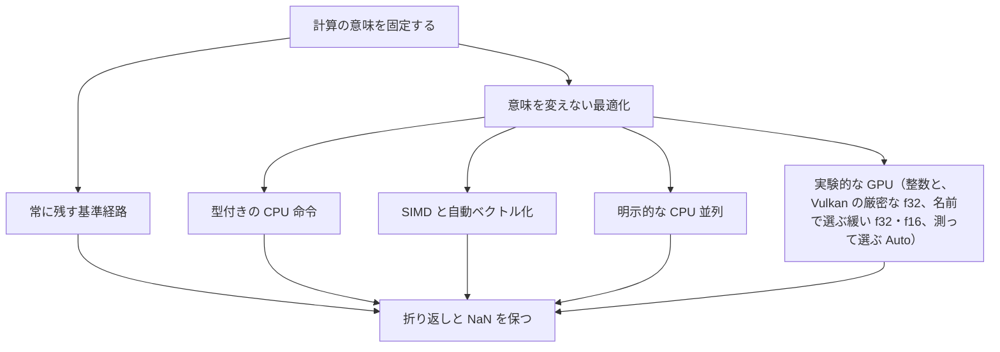

# Tsuzuri 言語の戦略

Tsuzuri の目標は、AI と人間が、少ない暗黙ルールで堅牢かつ高性能なプログラムを書けることです。高水準の記法を使うために実行時の負担を受け入れるのでも、速さのために意味を曲げるのでもありません。両方を処理系の課題として扱います。

このページは、その方針が Tsuzuri 0.1.0 のどこまで実装されているかを整理します。性能の数値そのものは扱いません。測定条件と制限は[性能測定](../../../docs/benchmarks.md)にあります。

## この記事のポイント

- 関数の契約、数値の意味、診断の形を明示し、暗黙の変換や暗黙の高速化を入れません。
- 性能は設計要件です。ただしオーバーフロー、NaN、丸め、評価順序は保ちます。
- CPU 命令、SIMD、並列、GPU は、総コストで選びます。使ったハードウェアの名前は性能の証拠になりません。
- 移植可能な経路を常に残し、ハードウェア要件は明示します。
- 計画中の機能は、使えるものとして書きません。

## 少ない暗黙ルール

読み手が、型、評価順序、所有権、失敗を局所的に追えることを優先します。便利そうな変換をコンパイラが補うと、人とツールで解釈が分かれます。

- 関数のシグネチャは明示します。ローカルな値の型は推論します。
- 数値型の間に暗黙の変換はありません。変換は `as` です。
- 評価は正格です。引数が呼ばれる前に評価されます。
- 回復できる失敗は `Maybe` と `Result` です。トラップを失敗値へ勝手に変えません。
- ループを、無断で並列化したり GPU へ出したりしません。

コンパイル時に解釈できない構文を、別の緩い意味へ置き換えることもありません。この方針は[言語仕様](../../../docs/language.md)の冒頭にあります。

## AI 支援との相性

AI が書いたコードも、人が書いたコードも、同じ検査を通します。これは生成結果が正しいという保証ではありません。確認の入口を共通にする、という設計です。

相性を意識している点は、次のとおりです。

- 関数の入出力と制約が、シグネチャに残ります。
- 暗黙の数値変換がないので、別の型が混ざったときに静かに通りません。
- LLVM IR の並びは決定的です。同じ入力から、揺れる出力を比較しなくて済みます。
- `--json` の診断は、標準エラーへ 1 行 1 JSON です。言語仕様の例は `severity`、`code`、`message`、`path`、`span` を持ちます。

診断の形は[言語仕様の診断](../../../docs/language.md#診断)にあります。エディターからは `tsuzuri lsp` が、同じコンパイラの検査を使います。

## 意味を変えない性能

性能は、コンパイラ、ランタイム、組み込み関数、将来の標準ライブラリに共通する設計要件です。目標は、正しい結果が出るまでの総時間を短くすることです。命令を多く使うこと自体は、速くなった証拠にはなりません。

速くするために、次の意味は変えません。

- 通常の整数の加減乗算は、型の幅で折り返します。未定義動作にはしません。
- オーバーフローを失敗にしたい式には `@checked` を付けます。飽和などは `Int` の別 API です。
- 浮動小数点の丸め、NaN、符号付きゼロ、評価順序を保ちます。
- fast-math、式の再結合、暗黙の FMA は有効にしません。`-O3` も同じです。
- 境界検査を、利用者が無効にするオプションはありません。証明できた添字だけ、検査の分岐を省略します。

利用者のコードの速さは `bench "名前" = 本体` と `tsuzuri bench` で測れます（[Bench](../built-in-types-and-modules/bench.md)）。準備を除いた反復時間を、予熱と複数の標本の中央値・最小・最大で報告し、計算結果は `Bench.consume` の障壁を通るので最適化で消えません。速さの合否の閾値は持たず、比較は同じ機械・同じ条件の結果どうしで行います。

C/C++ と同等以上の性能は開発目標であり、0.1.0 があらゆる処理でそれを満たす、という宣言ではありません。LLVM を使うことだけでは、C より速いことにはなりません。根拠は[性能設計の原則](../../../docs/architecture.md#性能設計の原則)と[性能測定](../../../docs/benchmarks.md)に分けて書いてあります。

## 経路の選び方

連続したデータ、具体型への単相化、不要なコピーの除去で、最適化しやすい IR を出します。そのうえで、スカラー命令、SIMD、複数コア、GPU のどれを使うかは、確保、起動、転送、同期まで含めた総コストで判断します。小さい仕事では、逐次の方が有利なことがあります。

現状の経路は、次のように分かれます。

| 経路 | 0.1.0 の扱い |
| --- | --- |
| スカラー CPU | `i8` から `i64`、対応する符号なし、`f32` と `f64` の変換は、LLVM の直接命令と飽和 intrinsic を使います。`as` と組み込み変換は同じ経路です。 |
| SIMD | `-O3` の自動ベクトル化に加え、128-bit と 256-bit の明示的な SIMD 型があります。既定の `--cpu generic` は、そのアーキテクチャの基準命令です。 |
| `--cpu native` | ビルド機の命令セットに合わせます。古い CPU へはそのバイナリを配布できません。 |
| 実行時の命令選択 | 同梱の整数配列の和、最小、最大だけが、実行時に命令セットを選びます。選べない環境は基準実装です。利用者の関数が版を持つのが `@cpu` です。 |
| 複数コア | `Task.parallel` が明示的な並列です。ネイティブは常駐プール、既定の WebAssembly は逐次です。自動並列化はありません。 |
| GPU | 厳密な `i32` と `i32u` の WGSL 生成、厳密な `i32`・`i32u`・`i64`・`i64u`・`f32` の SPIR-V 生成、名前で選ぶ緩い `f32`・`f16` の WGSL 生成と緩い `f32` の SPIR-V 生成（`Gpu.map_relaxed`・`--emit wgsl-relaxed`・`--emit spirv-relaxed`）、`Gpu.request Gpu.WebGpu` による WebGPU 上の実行（native は wgpu-native を実行時に読み込み、WebAssembly は `--wasm-feature webgpu`）、`Gpu.request Gpu.Vulkan` による Vulkan 上の実行（native だけ。厳密な `f32` は、デバイスが float controls を報告して適合プローブを通るときだけ）、呼び出しごとに測ったコストで CPU 参照と Vulkan を選ぶ `Gpu.Auto`、Node.js の WebGPU ホスト試作までです。実行できないときは `Unavailable` で、CPU への切り替えはプログラムが書きます。`Gpu.Auto` だけが、バックエンドを呼び出しごとに選びます。 |
| WebAssembly | 既定は SIMD なし、threads なし、OS API の import なしです。それぞれ明示したときだけ有効になります。 |

2026-09-27 実施の `tests/wasm_simd.mjs` による検証では、LLVM 21 の逆アセンブル解析を通じて、`-O3` のオプトイン出力にベクトル命令が生成されること、および既定出力にはベクトル命令が含まれないことを確認しています。これはコード生成の検証であり、実行速度の測定ではありません。また、x86 の SSE4.2 や AVX2 の実機における実行速度も未測定です。

GPU については、2026-10-10 に Apple M1 Max で、厳密な `i32` と `i32u` の WebGPU 実行の CPU 参照との照合（native は wgpu-native、WebAssembly は Dawn）と、緩い `f32`・`f16` の許容誤差内の照合、厳密な整数（`i64` を含む）の Vulkan 実行（MoltenVK）の CPU 参照との照合を実施済みです。転送と同期を含めて測った結果は [性能測定](../../../docs/benchmarks.md#gpu-デバイスのランタイムf09-phase-2) と [Vulkan と Gpu.Auto](../../../docs/benchmarks.md#vulkan-と-gpuautof09-phase-3) にあり、速度の優位性を主張するものではありません。`Gpu.Auto` の規則の定数は、その 1 台のマシンの経験則です。float controls をすべて報告して適合プローブを通るデバイスで、厳密な `f32` の Vulkan 実行が CPU 参照とビット単位で一致することは、まだ確かめていません。Linux、Windows、Apple 以外の GPU の実行も、確かめていません。

明示したにもかかわらず利用できない経路は、暗黙のうちに別の緩い意味へ落としません。既定の WebAssembly で OS API に到達した場合は `E2000` エラーとなります。`@cpu` では、そのビルド先で選択できないレベルは安全に無視され、未知の名前を指定した場合は `E0002` エラーとなります。無視とエラーの扱いは明確に分かれており、実行要件は属性とビルドオプションの両面から厳格に判断されます。

## 計算とホストを分ける

Tsuzuri が直接支えるのは、変換、判定、集計、数値計算です。画面、DOM、ネットワーク、デバイスはホストに残します。

- 標準入出力は `IO` です。アクションを値として組み立て、入口で実行します。
- ホスト関数は `extern` で宣言します。境界を越える型は、対応するスカラー、バッファ、レコードに限られます。
- ファイル、ディレクトリ、環境、時刻、乱数、プロセスは OS API です。既定の WebAssembly では使えません。
- 共有の可変状態は、言語の基本に入れていません。可変な更新は排他借用です。

ホストは、ABI と所有権を守る側です。任意の C ポインターの正しさまで、借用検査が保証するわけではありません。詳しくは[ネイティブ連携](../compiler/native-interop.md)と[WebAssembly への出力](../compiler/webassembly.md)を見てください。

## GC のない所有権

メモリは、所有権の移動と借用で管理します。GC は使わず、参照カウントは標準ライブラリの `Rc`／`Arc` を明示的に使ったときだけです。解放のタイミングを、回収の都合ではなく、値の寿命で決められます。

メモリのコストまで消えるわけではありません。コレクションの複製、捕捉環境の複製、フレームの外への移動では、確保やコピーが起こります。GC の停止がないことだけを根拠に、ハードリアルタイム性は保証しません。

循環や自由な共有が必要なデータは、今の所有権モデルに合わせて設計します。複数の所有者で共有する値は [Rc と Arc](../built-in-types-and-modules/rc.md) で明示的に共有し、循環するグラフは std の [Arena](../built-in-types-and-modules/arena.md) に値を入れ、世代付きのハンドルで指して表します。共有した値を書き換えるときは、整数と `bool` なら [Atomic](../built-in-types-and-modules/atomic.md)、そのほかなら [Mutex](../built-in-types-and-modules/mutex.md) に入れます（内部可変性はこの 2 つだけです）。`Arc` と `Mutex` では循環を作れてしまうので、循環の一方は `Arc.Weak` で持ちます。サイクルコレクターも GC も後から足す方針は採っていません。

## 移植できる経路を残す

速い経路を足しても、どこでも同じ意味で動く経路を残します。自動選択には能力の確認と、文書化されたフォールバックが要ります。明示した経路が使えないときは、成功したことにしません。

- 既定の `--cpu generic` は、ターゲットの基準命令です。
- 既定の WebAssembly は、SIMD も threads も OS API も要求しません。
- 整数配列の実行時ディスパッチは、基準実装へ戻れます。
- WASM の線形メモリは既定 16 MiB です。`--wasm-max-memory` で上限を上げられます。
- Windows 上で OS API に到達するネイティブビルドは、実行検証が終わるまで `E2002` で止めます。純粋な計算には影響しません。

未検証の環境を、対応済みとは呼びません。Windows のチケット [G10](../../../_features/G10-windows.md) は `blocked` です。

## 実装の状態

チケットの `done` は、そのチケットで合意した段階の完了です。他言語との互換や、当初案の全項目を意味しません。`todo` は計画中、`blocked` は検証や判断待ちです。一覧は[機能チケット](../../../_features/README.md)にあります。

| 項目 | 状態 | チケットと範囲 |
| --- | --- | --- |
| 式、カリー化、レコード、共用体、網羅的な `match` | 実装済み | A02、A03 を含む基礎言語 |
| 所有権、借用、複数 region、排他借用フィールド、`Drop` | 実装済み | A09、A12、A13、B07。region 間の outlives はない |
| 型クラスの単相化、deriving、限定的な `dyn`、ランク 1 の HKT | 実装済み | A06、A07、A14、A10。標準の Functor 導入は対象外 |
| `Maybe` / `Result`、コンピュテーション式、`task` | 実装済み | B01、B02、B05、B06。非同期 I/O ではない |
| 明示 SIMD、`@cpu`、自動ベクトル化、実行時ディスパッチ | 実装済み | F04、F08。x86 実機の速度は未測定 |
| ローカル path、commit 固定の git、自前の index による registry のパッケージ（最小版選択、`tsuzuri fetch`・`publish`、`Tsuzuri.lock`）、ビルドキャッシュ、構文解析の結果のキャッシュ、JSON 診断、fmt、test、doc、lsp | 実装済み | E04、E10、G11、G12、G14、G17、G20。公開の registry は運営しない |
| `HashMap`、文字列補間、OS API、C 連携の `extern` と `--link` | 実装済み | C09、D07、E08、E12。Windows の OS API は除く |
| C ヘッダーからの `extern` 生成（`tsuzuri bindgen`） | 実装済み | E11。64-bit の Linux と macOS、ABI の一致を確かめられる宣言だけ |
| WASM の型付きグルー、共有ライブラリ、C#・Python・C++ のバインディング | 実装済み | E13。Windows の共有ライブラリは G10 の後 |
| 整数 WGSL、緩い `f32`・`f16` の WGSL（名前で選ぶ）、`Gpu.request Gpu.WebGpu` による WebGPU 上の実行と WebGPU ホスト試作、SPIR-V 生成と `Gpu.request Gpu.Vulkan` による Vulkan 上の実行（厳密な整数と、報告と適合プローブを通るデバイスの厳密な `f32`、緩い `f32`）、測って選ぶ `Gpu.Auto` | 実験的 | F07、F09 の Phase 1〜3。確かめたのは Apple M1 Max（WebGPU は wgpu-native と Dawn、Vulkan は MoltenVK と SwiftShader）だけ |
| WASM threads | 実装済みの opt-in | F06。ブラウザ向けのグルーは E13 の `--emit bindings-js --wasm-feature threads` |
| Windows ネイティブの実行検証 | 検証未完了 | G10 は `blocked`。OS API 到達時は `E2002`。`Net` は Windows でも動くが、実行は CI だけで確かめる |
| 非同期計算 | 実装済み（純粋な仮想時刻、native reactor、ホスト駆動、WASM JSPI は opt-in） | [Async 式](../async-tasks-and-lazy/async.md)、B08 |
| ネットワーク | 実装済み | [Net](../built-in-types-and-modules/net.md)、E09。TCP・UDP・アドレス・名前解決。native（Linux と Windows の実行は CI だけで検証）と、`--wasm-feature jspi --wasm-feature net` の wasm32（Node.js）。TLS は含まない |
| 線形時間の正規表現 `Regex`、Unicode 17.0.0 の表 `Unicode` | 実装済み | D09。後戻りしない Pike VM |
| JSON（`Json`）と CBOR（`Cbor`）、`Encode` / `Decode` の導出 | 実装済み | D08。字句を保つ数値、ストリーミングの読み書き |
| Vulkan の厳密な `f32` の実機での一致、離散 GPU、Linux・Windows・Apple 以外の GPU での Vulkan 実行 | 検証未完了 | [F09](../../../_features/_completed/F09-gpu-float-runtime.md) の Phase 3。float controls をすべて報告して適合プローブを通る実機がなく、確かめていない |
| 共有所有の `Rc` / `Arc` / `Weak`、循環する構造の `Arena` | 実装済み | C10。共有した値の書き換えは F10 の `Atomic` / `Mutex` |
| 多次元配列 `Matrix`・借用の窓 `MatrixView`・N 次元の `Tensor`（行優先の連続バッファ、行列積の演算順序を固定、FMA 版と行分割の並列版は別名） | 実装済み | [Matrix](../built-in-types-and-modules/matrix.md)・[MatrixView](../built-in-types-and-modules/matrix-view.md)・[Tensor](../built-in-types-and-modules/tensor.md)、C11。行列積の GPU カーネルと、x86-64 の速度は含まない |
| `Atomic`、`Mutex`、`Task.scope`、`Sync` | 実装済み。`--wasm-feature threads` でも使える（Worker でロックを待つ） | F10 の Phase 1 |
| `Channel`（容量付きの MPMC、待ちとデッドロックのトラップ） | 実装済み | F10 の Phase 2 |
| REPL（`tsuzuri repl`）、スクリプト実行（`tsuzuri script`、shebang 行） | 実装済み | G13。入力ごとに `Main.tz` を作り直して検査・実行する。JIT はない |
| ベンチマーク（`tsuzuri bench`）、カバレッジ（`tsuzuri test --coverage`）、プロパティテスト（`Gen`） | 実装済み | G18。ネイティブだけ。速さの合否の閾値はない |
| デバッガーでの Tsuzuri の値の表示（LLDB の formatter、テストのデバッグ、Windows の PDB と natvis） | 実装済み | G16。`-O0` のネイティブ。WASM と `-O3` の変数の表示は保証しない |
| 型検査とコード生成の増分コンパイル、edition、追加ターゲット | 計画中 | G15、G19、[PB06](../../../_perfs/PB06-build-server.md)、[PB07](../../../_perfs/PB07-incremental-codegen.md) |
| `f16` のハードウェア演算、const 評価の拡張 | 計画中 | D10、D11 |

## 採らないもの

劣位を埋める名目でも、次は入れません。判断は機能チケットの「採用しない改善」にあります。

- GC とサイクルコレクター。解放を所有権で決める方針と矛盾します。
- 例外の巻き戻しと、失敗を伝播する `?` 演算子。言語内の失敗は `Maybe` と `Result` です。
- 暗黙の fast-math、再結合、GPU や SIMD での黙った精度変更。緩い演算が要るなら、別名の API にします。
- `unsafe` と生ポインター型。低水準の処理はホストに置き、不透明ハンドルで受け渡します。
- 境界検査を利用者が外すオプション。検査のコストは、証明と計測で減らします。
- .NET や JVM との互換、クラス継承、言語同梱の GUI と Web フレームワーク。

## まとめ

- 暗黙の変換と暗黙の高速化を避け、契約と診断を明示します。
- 性能は最優先の要件の一つですが、数値と所有権の意味より優先しません。
- 速い経路を足しても、移植できる基準経路を残します。
- GPU は実験的、Windows ネイティブの実行検証は未完了、非同期 I/O は `Net` のソケットだけです。公開の registry は運営していません。
- 実装済みと計画中を混ぜて、対応済みとは呼びません。

## 関連項目

- [Tsuzuri の特徴](./how-about-tsuzuri.md)
- [なぜ Tsuzuri なのか](./why-tsuzuri.md)
- [診断メッセージとエラーコード](../compiler/diagnostics.md)
- [WebAssembly への出力](../compiler/webassembly.md)
- [Simd](../built-in-types-and-modules/simd.md)
- [Gpu](../built-in-types-and-modules/gpu.md)
- [性能設計の原則](../../../docs/architecture.md#性能設計の原則)
- [言語リファレンスの目次](../index.md)
