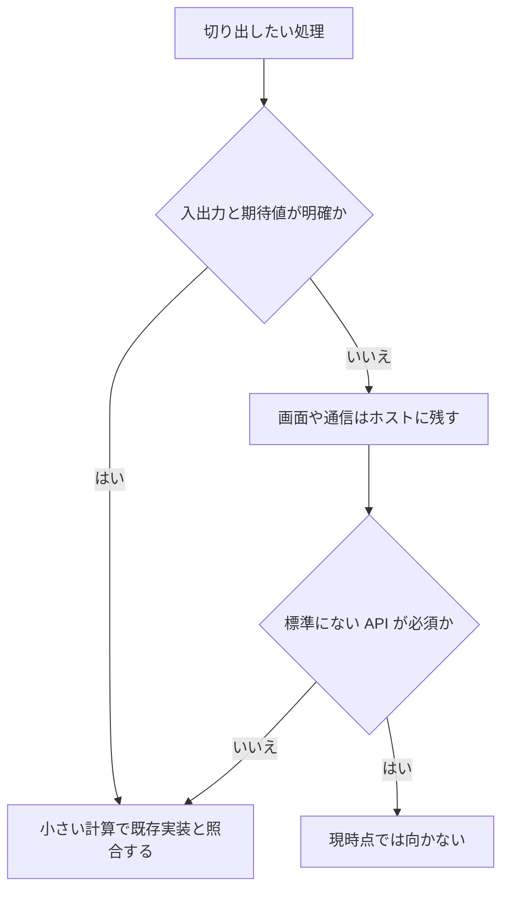

# なぜ Tsuzuri なのか

Tsuzuri を採用するなら、アプリケーション全体を移す前に、計算を一つ切り出して比べるのが確実です。このページは、その判断に必要な長所と、今の制限を並べます。対象は Tsuzuri 0.1.0 の実装です。

設計上の目標は、C/C++ を上回る性能と、C# や F# 以上の書きやすさを両立することです。これは目標であって、達成済みの宣言ではありません。性能は条件をそろえて測り、書きやすさは記述量だけでなく、所有権、ライブラリ、デバッグまで含めて見ます。

## この記事のポイント

- 関数の合成と、所有権による値の寿命を、同じ言語で書けます。
- その組み合わせは、C/C++、Rust、C#、F#、TypeScript のどれか一つを置き換えるものではありません。
- 入出力が明確な計算を、ネイティブか WebAssembly のホストへ組み込む用途に向きます。
- 公開の registry とそこに集まるライブラリ、非同期 I/O、ネットワーク、成熟した GPU 開発を前提にするなら、まだ向きません。依存は、パス、commit 固定の git、自分で置く registry の index で管理できます。
- Windows の対応は、拡張機能の案内と、処理系の検証状況を分けて読みます。

## 選ぶ理由

計算を関数でつなぎ、データの状態を型で分け、値の受け渡しをシグネチャで契約にできます。読み取りは `ref T`、排他的な更新は `ref mut T`、所有権を渡すなら `T` です。型を見れば、貸すのか渡すのかが分かります。

失敗の理由も値です。`Maybe` は値の有無、`Result` は理由付きの失敗を分けます。数値の意味は最適化レベルで変えません。通常の整数加減乗算は折り返し、浮動小数点の NaN と符号付きゼロは残します。

同じソースからネイティブと WebAssembly を出せます。入出力のない既定の WebAssembly は、JavaScript ランタイムの import を要求しません。画面や通信はホストに残し、計算だけを境界の向こうへ置けます。

人とツールは、同じ `check` と `--json` の診断を使えます。AI が書いたコードの正しさを保証する仕組みではなく、確認の入口を共通にする仕組みです。

## C と C++ と比べる

C/C++ は、既存のネイティブ資産、低水準の制御、長い運用実績を持ちます。Tsuzuri はその性能を目標にしながら、計算で人が手で守っている契約を減らそうとしています。

### 長所

- 移動後の再使用や借用の競合を、コード生成の前に拒否します。C++ の RAII も資源管理に役立ちますが、通常の C/C++ の仕様だけでは、すべての参照の寿命が同様には検査されません。
- 共用体と網羅的な `match`、`Maybe` と `Result` を、言語の基本として使えます。
- C/C++ の符号付き整数オーバーフローが未定義動作になり得るのに対し、Tsuzuri の通常の整数加減乗算は型の幅で折り返します。`-O0` でも `-O3` でもこの規則は同じです。

### 短所

- ポインタ、値ごとのアロケータ、任意のメモリ配置を細かく制御することはできません。プログラム全体のヒープをホストの関数へ差し替える `--allocator host` はあります。
- 既存の C/C++ ソースを、そのまま言語へ取り込む機能はありません。C ヘッダーからは `tsuzuri bindgen` が、ABI の一致を確かめられる関数・定数・struct の宣言を生成します（64-bit の Linux と macOS）。それ以外の C の関数は、対応する型で `extern` を書き、`--link` でリンクします。C++ のヘッダーは対象外です。
- デバイス、ネットワーク、既存ライブラリとの接続には、ホスト側の実装が要ることが多いです。ファイルなどの OS API は、POSIX ネイティブと `--wasm-host wasi` にあります。
- 最適化済みライブラリ、デバッガー、長期運用の実績は C/C++ の方が豊富です。GPU は実験段階で、成熟した GPU 開発基盤の代わりにはなりません。
- 安全検査、所有値の複製、境界の変換にはコストがあります。LLVM を使うことだけでは、速度の優位は決まりません。

既存の C/C++ ホストを残し、入出力が明確な計算へ型と所有権の検査を足したいときに、切り出して試せます。

| 観点 | Tsuzuri 0.1.0 | C / C++ |
| --- | --- | --- |
| メモリ安全性 | 所有権と借用（コンパイル時に検証） | 手動管理 / RAII（ポインタや参照の寿命は自動検証されない） |
| 整数オーバーフロー | 型の幅で折り返し（未定義動作にしない） | 符号付き整数オーバーフローは未定義動作（UB）になり得る |
| エラー表現 | `Maybe`、`Result`、網羅的な `match` | 戻り値コード、errno、例外（C++） |
| メモリ配置・制御 | 不透明ハンドル、アロケータ差し替え（`--allocator host`） | 生ポインタ、きめ細かなメモリ配置、値ごとのアロケータ |
| エコシステム | ローカル path のみ、C ABI 連携 | 膨大な既存ライブラリ、最適化済み実装、成熟したツール群 |

## Rust と比べる

GC に依存しないメモリ管理、所有権、ネイティブと WebAssembly は、Rust とも共通します。これらがあること自体は、Tsuzuri 独自の優位ではありません。違いは、処理の書き方と、提供している自由度です。

### 長所

- カリー化、部分適用、パイプを、関数適用の基本として使えます。変換と集計を、値の流れに沿って書けます。
- `Maybe`、`Result`、`IO` や独自ビルダーを、共通の `let!` と `return` で合成できます。

### 短所

- 借用で表せる構造には制限があります。排他スライス、排他借用フィールド、レコード内の複数 region は実装済みです。要素単位の排他借用と、region 間の outlives はありません。
- Rust の `Copy` はビット単位の複製です。Tsuzuri では、Copy な配列や捕捉を持つ関数値の複製が、ヒープ確保や深いコピーを伴うことがあります。配列とリストの暗黙の複製は、`--warn implicit-copy` で見つけられます。
- 固定長配列 `[T; N]` はヒープを確保しません。それでも、値の大きさの分はコピーされます。
- Cargo、crates.io、非同期 I/O、低水準 API、開発ツールの選択肢では及びません。パッケージはローカル path だけで、`Task` は非同期 I/O の executor ではありません。

関数の合成を中心に書きたい計算には、記法が合うことがあります。所有権を使う汎用アプリケーションを、豊富なライブラリと一緒に組むなら、現在の Rust の方が選べる構成は広いです。

| 観点 | Tsuzuri 0.1.0 | Rust |
| --- | --- | --- |
| 関数の記述 | カリー化、部分適用、パイプ `\|>` が基本 | 通常の関数呼び出し、明示的なクロージャ構文 |
| 合成構文 | `let!` とビルダー（`Maybe`、`Result`、`IO`） | `?` 演算子、マクロ、async/await |
| 借用モデル | 複数 region、排他借用フィールド | 任意のライフタイム、要素単位の排他借用、outlives |
| コピーの性質 | 配列などの Copy は要素複製コストを伴い得る | `Copy` は純粋なビット単位の複製（浅いコピー） |
| パッケージ・非同期 | ローカル path のみ、`Task` は 1 回の計算（CPU 並列） | Cargo、crates.io、非同期ランタイム（Tokio 等） |

## C# と F# と比べる

C# と F# は、静的な型と .NET のライブラリでアプリケーションを組めます。F# には、カリー化、パイプ、判別共用体、コンピュテーション式がすでにあります。Tsuzuri が目指すのは、その表現と、GC に依存しない実行モデルの両立です。

### 長所

- 値の解放を所有権で決めるので、GC の回収タイミングを性能設計に織り込みません。確保と解放のコストや遅延まで消えるわけではありません。
- .NET ランタイムを前提にせず、計算をネイティブや WebAssembly のモジュールとしてホストへ組み込めます。入出力を使わない既定の WebAssembly は、ランタイム import を要求しません。出力サイズや起動時間の優位は、別途測る必要があります。

### 短所

- .NET の標準ライブラリ、NuGet、GUI、Web、データベース、ネットワーク API を、そのままは使えません。標準の OS API は、ファイル、ディレクトリ、環境、時刻、乱数、プロセスに限られます。
- JSON の直列化と正規表現の標準ライブラリはありません。計画は [D08](../../../_features/D08-json-serialization.md) と [D09](../../../_features/D09-regex-unicode.md) です。文字列補間は使えます。
- GC に任せられる共有データや循環構造は、所有権に沿って設計し直す必要があります。共有は [Rc と Arc](../built-in-types-and-modules/rc.md) で明示し、循環するグラフは [Arena](../built-in-types-and-modules/arena.md) とハンドルで表します。共有した値を書き換える内部可変性はまだありません（F10）。
- C# の `async` / `await` や F# の非同期ワークフローに相当する基盤はありません（[B08](../../../_features/B08-async.md)）。REPL もありません（[G13](../../../_features/G13-repl.md)）。
- 記法が F# に近い部分があっても、所有権の移動と、失敗の扱いが同じとは限りません。`Task` は非同期ではなく、一回実行の計算です。

C# には Native AOT があるため、ネイティブ出力だけを固有の優位にはしません。違いは、所有権と、ホストへ組み込む計算を中心に設計していることです。

| 観点 | Tsuzuri 0.1.0 | C# / F# |
| --- | --- | --- |
| 実行基盤 | LLVM 経由のネイティブ / 独立 WebAssembly | .NET ランタイム（CLR）/ Native AOT |
| メモリ管理 | 所有権と借用（GC なし）。共有は `Rc` / `Arc`、循環は `Arena` | ガベージコレクション（GC） |
| 関数型機能 | カリー化、パイプ、共用体、コンピュテーション式 | F# に同等の表現力あり、C# にもパターンマッチ等 |
| 非同期・並行 | `Task`（1 回きりの計算、常駐スレッドプール） | `async` / `await`、非同期ワークフロー、Task |
| エコシステム | 標準 OS API は最小限（ファイル、環境、時刻等） | .NET の膨大な標準ライブラリ、NuGet、GUI / Web 基盤 |

## TypeScript と比べる

TypeScript は、段階的な型検査をしたあと JavaScript として実行します。型は実行時に残りません。ブラウザと Node.js の API、npm の資産が、エコシステムの中心です。

Tsuzuri は、型エラーがあるとコードを出しません。数値型の間を暗黙には変換せず、メモリは GC ではなく所有権で管理します。実行先は JavaScript エンジンではなく、LLVM 経由のネイティブと WebAssembly です。

この違いは、Web アプリケーションの置き換えにはつながりません。DOM、ネットワーク、npm のライブラリを前提にするなら、TypeScript の方が今は実用的です。入出力のない計算を WebAssembly にして、TypeScript のホストから呼び出す、という分担は試せます。境界の変換コストは、呼び出しの細かさに依存します。

| 観点 | Tsuzuri 0.1.0 | TypeScript |
| --- | --- | --- |
| 実行 | LLVM 経由のネイティブと WebAssembly | JavaScript へ変換し、JS エンジンで実行 |
| 型 | エラーがあるとコードを出さない | 段階的。型は実行時に消える |
| メモリ | 所有権。GC なし | JavaScript の GC |
| パッケージ | ローカル path のみ | npm |
| 画面と通信 | ホスト側 | ブラウザ API とライブラリが中心 |

## 向いている用途

- 入力と結果が明確な変換、判定、集計、数値計算。
- 既存の C、デスクトップ、ブラウザのホストへ、計算部分だけを組み込む処理。
- ケースの追加漏れや、値の二重使用を、実行前に拒否したいコード。
- ネイティブと WebAssembly で、同じ数値の意味を保ちたい計算。

## まだ向いていない用途

- GUI、Web、データベース、ネットワークが本体のアプリケーション。
- npm、NuGet、crates.io のライブラリを、そのまま依存にしたい開発。
- 汎用の非同期 I/O、対話環境、成熟した GPU カーネル開発。
- JSON や正規表現を、標準ライブラリだけで済ませたい処理。
- GC に任せた共有グラフや、循環するオブジェクトをそのまま写すモデル。循環は [Arena](../built-in-types-and-modules/arena.md) のハンドルで表し直します。
- Windows の OS API に依存するネイティブアプリ。到達すると `E2002` です。

> [!WARNING]
> 標準のネットワーク API、公開の registry、汎用 GPU 実行、非同期 I/O は、0.1.0 にはありません。計画中の構文を、今のコンパイラへ書いても通りません。registry の仕組み自体はあり、index は利用者が置きます（[パッケージ](../organizing-tsuzuri/packages.md#registry-の運用と-tsuzuri-publish)）。

## プラットフォームの読み方

事実が分かれているので、一つにまとめません。

| 対象 | 確認できたこと |
| --- | --- |
| VS Code 拡張の案内 | Windows x64 は、編集、実行、テスト、デバッグを対応環境として案内しています。Windows ARM64 のデバッグは未対応です。根拠は [vsc/README.md](../../../vsc/README.md) です。 |
| 処理系の Windows チケット | [G10](../../../_features/G10-windows.md) は `blocked` です。実 Windows SDK での COFF/PE リンクと、Rust ターゲットのクロスチェックは成功しています。Windows 上の `cargo test`、ネイティブ実行、ファイル置換は未確認です。 |
| OS API | Windows 上のコンパイラが、OS API に到達するネイティブバイナリを出すと `E2002` です。純粋な計算には影響しません。仕様は[WASM と Windows](../../../docs/language.md#wasm-と-windows)にあります。 |
| CI | 現在の `.github/workflows/` にあるのは `vscode.yml` だけです。専用の Windows ワークフローは、この作業ツリーにはありません。 |

macOS では、`IO` を使うプログラムのブレークポイントが止まらない既知の問題が、拡張機能の文書にあります。`IO` を使わないプログラムでは停止します。

## 採用前に確かめること

最初の一つは、空入力、境界値、失敗入力を含め、既存実装と結果を照合できる計算が向きます。

照合のあとで、確保、変換、転送、同期を含む同じ仕事を測ります。短縮実行の時間や、バックエンドの名前だけでは判断しません。測定の読み方は[性能測定](../../../docs/benchmarks.md)にあります。

## まとめ

- 関数型の書き方と、GC のない所有権を、計算カーネルに使いたいときに候補になります。
- C/C++ より契約を検査でき、Rust より関数の合成を中心に書けます。エコシステムの広さでは、どちらにも及びません。
- C#、F#、TypeScript のライブラリや実行基盤の置き換えには、まだ向きません。
- GPU は実験的、非同期は計画中、公開の registry は運営されていません。Windows の OS API は検証未了で拒否されます。
- 採用するなら、期待値が明確な計算を一つ照合してから範囲を決めます。

## 関連項目

- [Tsuzuri の特徴](./how-about-tsuzuri.md)
- [Tsuzuri 言語の戦略](./strategy.md)
- [所有権とムーブ](../ownership-and-memory/ownership.md)
- [ネイティブ連携 (C ABI)](../compiler/native-interop.md)
- [WebAssembly への出力](../compiler/webassembly.md)
- [Async 式](../async-tasks-and-lazy/async.md)
- [性能測定](../../../docs/benchmarks.md)
- [言語リファレンスの目次](../index.md)
