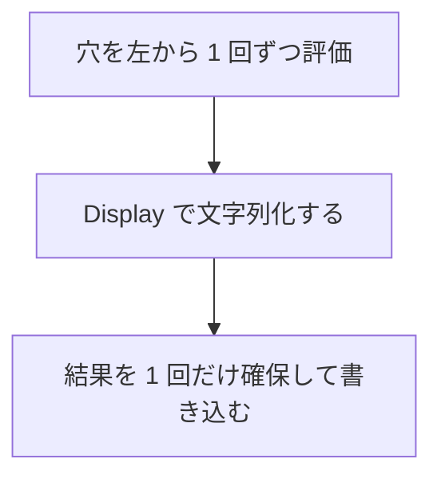

# 補間文字列

`$"..."` は `string`、`u8$"..."` は `utf8string` を、実行時に動的構築するリテラルです。`$` と `"` の間、ならびに `u8` と `$` の間に空白は置けません。穴 `{式}` の値を `Display` 型クラスによって文字列化し、その位置へ埋め込みます。

書式を指定しない穴は、`Display.display` と同じ文字列になります。数値の丸め処理はホストの `printf` やロケールに依存しないため、ネイティブと WebAssembly でビット単位に同一の結果が得られます。

## この記事のポイント

- `{{` と `}}` で、文字としての `{` と `}` をエスケープ記述します。穴の外の単独の `}` は `E0001` です。
- 穴は左から 1 回ずつ評価され、値は消費せず共有借用して文字列化します。
- 書式指定の構文は `[[fill]align][+][width][.precision][type]` です。
- 幅の計算は Unicode スカラーの個数です。サロゲートペアは 1 文字、孤立サロゲートも 1 文字として数えます。
- レコードや共用体（union）の独自書式は、`Format` 型クラスで処理します。

## 基本の書き方

```text
$"text {expr} more"
$"text {expr:spec} more"
u8$"text {expr}"
```

波括弧以外は、通常の文字列と同じ文字とエスケープです。穴が 1 つも無い `$"a{{b}}"` は、`"a{b}"` と同じ静的な文字列になります。

```tsuzuri run=hello%20Tsuzuri%2C%204%20times%20%7Bok%7D
let name = "Tsuzuri"
let count = 3
$"hello {name}, {count + 1} times {{ok}}"
```

実行結果:

```text
hello Tsuzuri, 4 times {ok}
```

穴は 1 行に収めます。改行もコメントも書けず、どちらも `E0001` です。長い式は `let` で束縛してから埋めます。添字や `.length` も、穴に直接書くと一時値の借用で `E1013` になることがあります。穴の中に文字列や、別の補間文字列は書けます。`$"{}"` のような空の穴、1025 個目の穴、深さ 128 を超える入れ子は `E0002` です。1 つのリテラルの穴は 1024 個までです。

穴の式の一番外側の `:` が書式の始まりです。括弧、角括弧、波括弧の内側の `:` や、`::` は書式を始めません。

`u8$"..."` の穴も、いったん `Display` で `string` にしてから UTF-8 へ変換します。その表示結果に孤立サロゲートがあるとトラップします。補間文字列に `B` 接尾辞は付けられません。

## 穴の評価と所有権



各穴の値は消費しません。ローカル変数、フィールド、添字、参照外しは共有借用です。`ref T` はそのまま、`ref mut T` は共有の再借用です。それ以外の一時値は隠れた領域に置き、表示のあとで解放します。`to_string` と違い、Copy でないローカルも補間のあとで使えます。

型に `Display` が無いと `E1005` です。型変数を埋める関数は、宣言に `Display<'a> =>` を書きます。借用は補間式の全体のあいだ続くので、`$"{x}{bump (ref mut x)}"` のように同じ場所を排他借用すると `E1014` です。

全部の穴を表示してから、結果を 1 回だけ確保します。`string` の長さが 2^53 − 1 コード単位を超えるとトラップします。

## 書式指定

```text
[[fill]align][+][width][.precision][type]
```

| 要素 | 書き方 | 意味 |
| --- | --- | --- |
| `fill` | `{` `}` `"` `\` 改行（`\n` / `\r`）孤立サロゲート以外のスカラー 1 文字。`align` の直前だけ | 余白を埋める文字。既定は空白 |
| `align` | `<` 左寄せ、`>` 右寄せ、`^` 中央揃え | 既定は数値が右、それ以外は左。`^` は不足分の半分（端数切り捨て）を左へ配置 |
| `+` | `+` | 0 以上の非負値にも `+` を付ける。`+0` や `+inf` を含む |
| `width` | 1〜4096 の 10 進整数。先頭の 0 は不可 | 最小表示幅。すでに幅以上あればそのまま出力 |
| `.precision` | 0〜4096 の 10 進整数（先行ゼロは不可。ただし `.0` や `.0f` は可） | 小数点以下の表示桁数。浮動小数点型と decimal 型で有効 |
| `type` | `x` `X` `o` `b` `e` `f` | 整数の出力基数（16 進、8 進、2 進）、または指数表記と固定小数点表記 |

`{x:0>4}` の `0` はゼロ埋めフラグではなく、埋め文字（`fill`）です。幅の数値を `04` のようには書けません。`Format.parse` も先頭に 0 のある幅を拒否します。また、精度でも `.05` のように他の数字の前に余分な先行ゼロを付けると構文エラー `E0001` です（`.0` や `.0f` は正当です）。

指定を受け付ける型は、穴の値の型で静的に決定されます。`ref U` なら参照先の `U` です。合わない指定はコンパイルエラー `E1003` です。

| 指定 | 受け付ける型 |
| --- | --- |
| fill、align、width | すべての `Display` |
| `+` | 整数、二進浮動小数点、decimal |
| precision、`e`、`f` | 二進浮動小数点、decimal |
| `x` `X` `o` `b` | 整数 |

`e` と `f` には精度が必要です。`{x:e}` は `E0001` です。`.2` だけなら `.2f` と同じです。整数の基数に精度は付けられません。`+`、精度、`type` を使う穴は、具象的な数値型でなければなりません。型変数のままでは `E1003` です。

```tsuzuri run=%5B%20%20%207%5D%5B0007%5D%5B%2B1%5D%5B2a%5D%5B-FF%5D%5B101%5D%5B10%5D
$"[{7:>4}][{7:0>4}][{1:+}][{42:x}][{-255:X}][{5:b}][{8:o}]"
```

実行結果:

```text
[   7][0007][+1][2a][-FF][101][10]
```

負の整数は、`-` と絶対値です。`0x` などの接頭辞は付きません。`X` は `A`〜`F` が大文字です。`i8` の最小値 `-128` を `x` で出すと `-80` で、オーバーフローしません。

```tsuzuri run=0.12%7C0.38%7C2%7C4%7C-0.00%7C1.23e3%7C1.0e1
$"{0.125:.2}|{0.375:.2}|{2.5:.0}|{3.5:.0}|{-0.0:.2}|{1234.5:.2e}|{9.96:.1e}"
```

実行結果:

```text
0.12|0.38|2|4|-0.00|1.23e3|1.0e1
```

`.Pf` は、正確な値を小数点以下 P 桁へ、最近接偶数で 1 回だけ丸めます。P が 0 のときは小数点を出しません。`2.5` は `2`、`3.5` は `4` です。`.Pe` は有効数字 P + 1 桁へ丸め、`d.ddd`、`e`、指数の順です。指数が正でも `+` は付けず、先頭の 0 も付けません。桁上がりすると指数が増えます。`9.96` の `.1e` は `1.0e1`、`0` の `.2e` は `0.00e0` です。

負のゼロは `-0`、精度を付けると `-0.00` です。`inf`、`-inf`、`nan` は精度を付けてもその表記のままです。符号、ペイロード、decimal のクォンタムは書式では残りません。

幅は出力の Unicode スカラー数です。フォントの全角幅や書記素クラスタは見ません。

```tsuzuri run=%5B%2A%2A%F0%9F%98%80%5D
let emoji = "😀"
$"[{emoji:*>3}]"
```

実行結果:

```text
[**😀]
```

`😀` はコード単位なら 2 ですが、幅の計算では 1 です。右寄せの幅 3 なので、埋め文字が 2 つ付きます。

この丸めと桁の選択は、ランタイムが正確な値から計算します。ホストの `printf`、ロケール、浮動小数点の中間レジスタは使いません。同じ書式なら、ネイティブと WebAssembly でビット単位に同じ文字列になります。書式を省いた穴は `Display.display` と同じです。

## Format 型クラス

レコードや共用体に、`+` や精度のような独自の書式を受けさせたいときは `Format` を実装します。

```text
Format.format : ref 'a -> ref string -> string
```

穴 `{value:spec}` で、値の型がレコードまたは共用体のとき、次のどちらかなら `Format.format` が呼ばれます。

1. その型に `Format` インスタンスがある。
2. 書式に `+`、精度、`type` のどれかがある。インスタンスが無いと `E1005` です。

幅と揃えだけなら、インスタンスが無くても `Display` の結果をコンパイラが埋めます。書式の無い穴 `{value}` は常に `Display` なので、`Format` だけ実装しても `E1005` です。

インスタンスへ渡る文字列は、解析済みの正規形です。既定の空白や省略した要素は除かれます。`{p:*>+8.2f}` は `*>+8.2f`、`{p: >10}` は `>10` です。余白を埋めるのもインスタンスの仕事です。コンパイラは結果に再度パディングしません。

数値、`string`、`bool`、文字型の穴は、常に組み込みのフォーマッタです。`Format` を実装できるのは、そのプログラムで宣言したレコードと共用体だけです。`instance Format<i64>` は `E1016` です。`deriving (Format)` はありません。

```tsuzuri run=%5B%20%20%20%20%20%20%201%2C2%5D%5B%2B1%2C2%5D%5B1%2C2%2F2%5D%5B%2A1%2C2%2A%2A%5D
record Point { x: i64, y: i64 }

instance Format<Point> {
    fn format point spec =
        match Format.parse spec with
        | Some parsed ->
            let sign = if parsed.plus then "+" else ""
            let precision = if parsed.precision >= 0 then $"/{parsed.precision}" else ""
            Format.pad (ref parsed) $"{sign}{point.x},{point.y}{precision}"
        | None -> ""
}

let p = Point { x: 1, y: 2 }
$"[{p:>10}][{p:+}][{p:.2}][{p:*^6}]"
```

実行結果:

```text
[       1,2][+1,2][1,2/2][*1,2**]
```

`Format.parse` と `Format.pad` のフィールドは [Format](../built-in-types-and-modules/format.md) を参照してください。動的に作った書式文字列を渡したいときは、穴ではなく `Format.format value (ref spec)` を直接呼びます。妥当性の検査はインスタンス側の `Format.parse` がします。

## まだできないこと

次の書き方はありません。計画中の構文として実行例にはしません。

- ロケール、桁区切りのカンマ、通貨記号
- `printf` の `%d` や、代替形式の `#`（`0x` を自動で付ける）
- 符号専用のゼロ埋めフラグ。ゼロ埋めは `{value:0>8}` と書きます
- 大文字の指数 `E`、空白だけの符号指定
- 書記素クラスタ単位の幅
- `{value:>{width}}` のような動的な幅。これは `E0001` です

## 注意点

> [!WARNING]
> 中央揃え `^` は、不足分の半分を切り捨てて左側に置きます。`{"ab":*^5}` は `*ab**` で、右のほうが 1 つ多くなります。

> [!TIP]
> 表示だけなら穴に書式は要りません。`$"{count}"` は `to_string` と違い、`count` をムーブしません。

## まとめ

- `$"..."` は `string`、`u8$"..."` は `utf8string` です。
- `{{` と `}}` で波括弧を書き、穴は借用して `Display` します。
- 書式の丸めは最近接偶数で 1 回です。ネイティブと WebAssembly で同じです。
- 幅はスカラー数です。全角幅ではありません。
- 独自の書式は、レコードか共用体の `Format` インスタンスで受けます。

## 関連項目

- [文字列](strings.md)
- [リテラル](literals.md)
- [Format](../built-in-types-and-modules/format.md)
- [型クラス](../types-and-type-inference/type-classes.md)
- [言語リファレンスの目次](../index.md)
