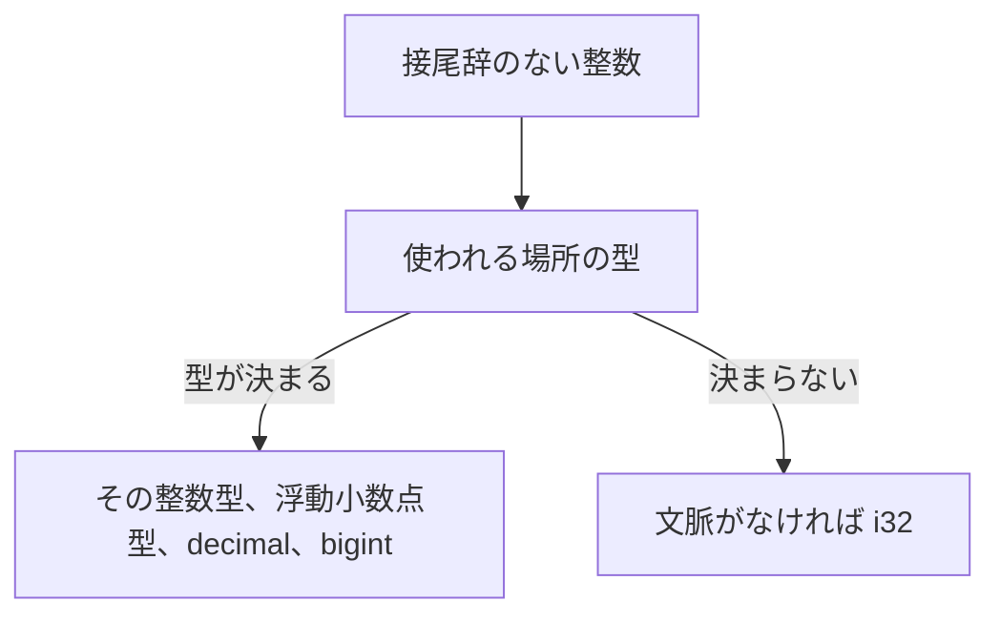

# リテラル

リテラルは、数値や文字列などの値をソースコードに直接記述する構文です。型は接尾辞か、使われる場所の型（文脈）から決定されます。接尾辞を省略すると簡潔に書けますが、文脈のない整数は既定で `i32` になります。

文字列リテラルは [文字列](strings.md)、式を埋め込める `$"..."` は [補間文字列](interpolated-strings.md) で詳しく説明します。

## この記事のポイント

- 接尾辞のない整数の既定は `i32` です。大きすぎて `i32` に収まらない値には、接尾辞か型注釈が必要です。
- 基数は 10 進、`0x` の 16 進、`0b` の 2 進だけです。8 進はなく、`0123` は 10 進の 123 です。
- 桁区切りの `_` は、桁と桁の間にだけ置けます。
- `"text"` は `string`、`u8"text"` は `utf8string` です。型注釈によってエンコーディングが切り替わることはありません。
- `"AB"B` は ASCII の `[byte]`、`u8"é"B` は `[utf8char]`、`'A'B` は 1 バイト（`byte`）です。

## 一覧

| 書き方 | 型 | 例 |
| --- | --- | --- |
| `86` | 文脈がなければ `i32` | `86` |
| `86y` / `86i8` / `86sbyte` | `i8` | `-128y` |
| `86uy` / `86i8u` / `86byte` / `86ubyte` | `i8u`（`byte`、`ubyte`） | `255uy` |
| `86s` / `86i16` | `i16` | `86s` |
| `86us` / `86i16u` | `i16u` | `86us` |
| `86i32` | `i32` | `86i32` |
| `86u` / `86i32u` | `i32u` | `86u` |
| `86l` / `86i64` | `i64` | `86l` |
| `86ul` / `86i64u` | `i64u` | `86ul` |
| `86L` / `86i128` | `i128` | `86L` |
| `86UL` / `86i128u` | `i128u` | `86UL` |
| `86I` | `bigint` | `0xFFI` |
| `1.5` | 文脈がなければ `f64` | `1.5e-2` |
| `1hf` / `1f16` | `f16` | `4.14hf` |
| `1f` / `1f32` | `f32` | `4.14f` |
| `1f64` | `f64` | `1.0f64` |
| `1F` / `1f128` | `f128` | `4.14F` |
| `1hm` / `1d32` | `d32` | `0.1hm` |
| `1m` / `1d64` | `d64` | `0.10m` |
| `1M` / `1d128` | `d128` | `0.1M` |
| `true` / `false` | `bool` | `true` |
| `()` | `unit` | `()` |
| `'A'` | `char` | `'\n'` |
| `u8'😀'` | `utf8char` | `u8'\u{1F600}'` |
| `"text"` | `string` | `"a\nb"` |
| `u8"text"` | `utf8string` | `u8"あ"` |
| `'A'B` | `byte` | `65` になる |
| `"AB"B` | `[byte]` | ASCII だけ |
| `u8"é"B` | `[utf8char]` | スカラーの配列 |

短縮接尾辞と型名の接尾辞は同じトークンになります。`86uy`、`86i8u`、`86byte`、`86ubyte` は区別されません。`byte` と `ubyte` は `i8u` の型別名、`sbyte` は `i8` の型別名です。

> [!TIP]
> C 言語の `1.0f` は `float` です。Tsuzuri の `f` も `f32` で、`f64` ではありません。`f64` は接尾辞なしの小数が既定です。

## 整数

```text
digits
0x hex-digits
0b binary-digits
```

接尾辞は数字の直後に付けます。間に空白は置けません。

### 型推論

接尾辞のない整数は、使われる場所の文脈から双方向の型推論によって決定されます。配列の要素も、後続の関数の引数型に合わせて推論されます。文脈から型が決まらなければ `i32` です。



浮動小数点型、decimal、`bigint` が期待される場所では、接尾辞のない整数もその型になります。ただし、ビット幅の異なる整数型同士を暗黙に変換することはありません。

```tsuzuri run=yen%3D1200%20wide%3D86%20ratio%3D2%20huge%3D2
def yen :: i32 -> i32 = \value -> value

let wide: i64 = 86
let ratio: f64 = 2
let huge: bigint = 2
$"yen={yen 1200} wide={wide} ratio={ratio} huge={huge}"
```

実行結果:

```text
yen=1200 wide=86 ratio=2 huge=2
```

`3000000000` のように `i32` の範囲に収まらず、文脈からも型が決まらないリテラルはコンパイルエラー `E1009` になります。`3000000000l` のように接尾辞を付けるか、`let value: i64 = 3000000000` のように型注釈を記述します。

符号付き整数の最小値も、1 つの負のリテラルとして記述できます。`i32` なら `-2147483648`、`i8` なら `-128y` です。符号なし整数型に負のリテラルを書くことはできず、同じく `E1009` になります。

### 2 進、16 進、桁区切り

`0x` と `0b` は小文字だけです。16 進の桁 `a`〜`f` は大文字でも小文字でも同じ値です。`_` は桁と桁の間に置けます。先頭や末尾に置いたり、連続して配置したりすると `E0001` です。

8 進リテラルはありません。`0123` は 10 進の 123 です。`0o10` や `0X10` は不正な接尾辞として `E0001` になります。

```tsuzuri run=mask%3D255%20flags%3D10%20population%3D1024%20hexeq%3Dtrue%20decimal%3D123
let mask = 0xFF
let flags = 0b1010
let population = 1_024
$"mask={mask} flags={flags} population={population} hexeq={0xff == 0xFF} decimal={0123}"
```

実行結果:

```text
mask=255 flags=10 population=1024 hexeq=true decimal=123
```

16 進や 2 進に `f` や `m` などの浮動小数点接尾辞は付けられません。`0x10hf` は `E0001` です。

## 浮動小数点と decimal

小数点または指数表記があると、文脈がなければ既定で `f64` になります。指数は `e` でも `E` でも記述できます。`1.5`、`1e3`、`1.2e-3` が代表例です。

小数点の前後には数字が必要です。`.5` や `1.` はリテラルとして受理されません。

decimal は 10 進の浮動小数点型です。有効桁数は `d32` が 7 桁、`d64` が 16 桁、`d128` が 34 桁です。金額の計算など、10 進の正確な桁数を保ちたい計算に使用します。短縮接尾辞 `m` は `d64` を表します。

```tsuzuri run=ratio%3D0.015%20half%3D4.14%20money%3D0.1%20precise%3D0.1
let ratio = 1.5e-2
let half = 4.14hf
let money = 0.10m
let precise: d64 = 0.1
$"ratio={ratio} half={half} money={money} precise={precise}"
```

実行結果:

```text
ratio=0.015 half=4.14 money=0.1 precise=0.1
```

`0.10m` の表示が `0.1` になるのは、decimal の末尾のゼロを表示時に省略するためです。値の型は `d64` のまま維持されます。

型で表現できない大きさのリテラルは `E1009` です。`1e309` は `f64` の範囲を超えています。丸めは、目的の型へ直接、最近接偶数（half-to-even）で 1 回だけ行われます。`f128` をいったん `f64` に落としてから戻すような二重丸めは発生しません。

数値の演算、NaN、符号付きゼロは [言語仕様の数値仕様](../../../docs/language.md#数値仕様) を参照してください。

## bigint

`I` を付けると任意精度の `bigint` です。16 進や 2 進にも付けられます。小数や指数には付けられません。`bigint` が期待される場所では、接尾辞なしの整数も `bigint` になります。

```tsuzuri run=255
0xFFI
```

実行結果:

```text
255
```

`9999999999999999999999999999I` のように、固定幅に入らない整数も書けます。演算は [BigInt](../built-in-types-and-modules/bigint.md) を参照してください。

## 真偽値と unit

`true` と `false` だけが `bool` です。`1` や `0` は真偽値になりません。

`()` は値が無いことを表す `unit` です。`to_string ()` は `()` という文字列になります。プログラムの最後の式が `unit` のとき、コンソールには何も出ません。

## 文字、文字列、バイト列

文字は単一引用符、文字列は二重引用符です。`u8` は引用符の直前に付け、空白は挟めません。`u8` の有無で型が決まり、`: string` のような注釈では切り替わりません。

```text
'A'        char
u8'😀'     utf8char
"text"     string
u8"text"   utf8string
'A'B       byte
"AB"B      [byte]
u8"é"B     [utf8char]
```

`'A'B` は ASCII の符号なしバイト（`byte`）です。`"AB"B` は同じく ASCII バイトの配列（`[byte]`）で、非 ASCII 文字を含むとコンパイルエラー `E0001` です。`u8"é"B` は Unicode スカラーの配列（`[utf8char]`）です。空の `""B` は `[byte]`、`u8""B` は `[utf8char]` です。補間文字列に `B` は付けられません。なお、`u8'A'B` のように文字リテラルに `u8` と `B` を同時に付けることはできず、`E0001` になります（`B` 接尾辞を受け付けるのは `'c'B`、`"text"B`、`u8"text"B` のみです）。

```tsuzuri run=code%3D65%20ascii%3D%5B65%2C%2066%5D%20scalars%3D%5Bu8%27%C3%A9%27%5D%20empty%3D0
def byte_len :: [byte] -> i64 = \values -> values.length

let code = 'A'B
let ascii = "AB"B
let scalars = u8"é"B
$"code={code} ascii={ascii} scalars={scalars} empty={byte_len (""B)}"
```

実行結果:

```text
code=65 ascii=[65, 66] scalars=[u8'é'] empty=0
```

`char` は UTF-16 の 1 コード単位です。絵文字のようにサロゲートペアになる文字は `'😀'` とは書けません。`utf8char` はサロゲートを除く Unicode スカラー 1 個なので、`u8'😀'` は書けます。

### エスケープ

文字列の中で改行をそのまま書くと `E0001` です。改行は `\n` にします。

| エスケープ | `char` / `string` | `utf8char` / `utf8string` |
| --- | --- | --- |
| `\'` `\"` `\\` `\n` `\r` `\t` `\0` | 使える | 使える。`\"` は文字列、`\'` は文字 |
| `\uXXXX` | 4 桁の 16 進。サロゲートコード単位も保持する | 使えない |
| `\u{...}` | `char` は U+0000〜U+FFFF（1 コード単位）。`string` は U+0000〜U+10FFFF（0x10000 以上はサロゲートペアとして格納） | 1〜6 桁の Unicode スカラー値。サロゲート領域は拒否 |

`"😀"` と `"\uD83D\uDE00"` は同じ `string` です。`u8"\u{d800}"` はサロゲート領域のため `E0001` です。空の文字リテラルや、2 文字以上の `'ab'` も `E0001` です。末尾の引用符がない `'a` は、文字ではなく型変数の始まりです。

## コンパイル時定数

リテラルや基本演算から定数を作りたいときは、`const Name: Type = ...` を使います。`@literal def Name :: Type = ...` も同じ意味です。詳しくは [属性](../values-and-functions/attributes.md) と [言語仕様のコンパイル時定数](../../../docs/language.md#コンパイル時定数) を参照してください。

```tsuzuri run=80
const Rate: i64 = 2
let price = 40
price * Rate
```

実行結果:

```text
80
```

## 他の言語との比較

| 話題 | Tsuzuri | 似ている点、違う点 |
| --- | --- | --- |
| 接尾辞なしの整数 | 文脈、なければ `i32` | Rust に近い。F# の既定 `int` とも近い |
| `1.0f` | `f32` | C の `float` 接尾辞と同じ。`f64` ではない |
| 8 進 | ない | C の `0123` は 8 進。Tsuzuri では 10 進 |
| 文字列 | `string` と `utf8string` が別型 | JavaScript の文字列は UTF-16。Rust の `str` は UTF-8 |
| バイト列 | `"AB"B` は `[byte]` | F# の `"AB"B` に近い。要素は ASCII だけ |

## 注意点

> [!WARNING]
> 接尾辞の大文字小文字は型の一部です。`l` は `i64`、`L` は `i128`、`u` は `i32u`、`ul` は `i64u` です。

> [!NOTE]
> 範囲外の数値リテラルは実行時に折り返しません。コンパイルエラー `E1009` です。不正な接尾辞、桁区切り、エスケープは `E0001` です。

## まとめ

- 数値の型は、接尾辞、型注釈、使われる場所の文脈の順で決まります。
- 整数の既定は `i32`、小数の既定は `f64` です。
- 基数は 10 進、`0x`、`0b` だけです。桁区切りの `_` は桁と桁の間に置きます。
- `string` と `utf8string`、`char` と `utf8char` は別の型です。
- `B` は ASCII バイト、バイト配列、スカラー配列を作ります。

## 関連項目

- [文字列](strings.md)
- [補間文字列](interpolated-strings.md)
- [基本型](../types-and-type-inference/basic-types.md)
- [型推論](../types-and-type-inference/type-inference.md)
- [属性](../values-and-functions/attributes.md)
- [BigInt](../built-in-types-and-modules/bigint.md)
- [言語リファレンスの目次](../index.md)
