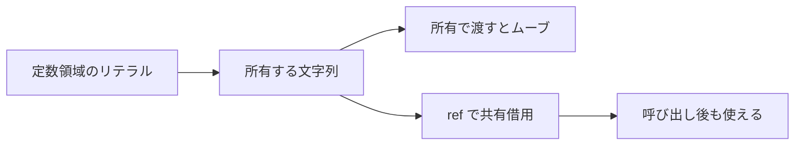
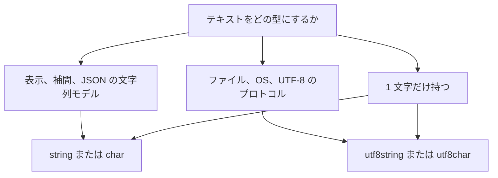

# 文字列

Tsuzuri には、見た目が似ていて型の違う文字列が 2 つあります。`string` は UTF-16 のコード単位の列、`utf8string` は妥当な UTF-8 のバイト列です。混ぜて連結したり、注釈だけで変換したりはできません。

どちらを選ぶかで、長さ・添字・ソート順・サロゲートの扱いが変わります。文字 1 個を表す `char` と `utf8char` も、同じ違いを持っています。

## この記事のポイント

- `"こんにちは"` は `string`、`u8"こんにちは"` は `utf8string` です。暗黙の変換はありません。
- 長さと添字の単位は、`string` が UTF-16 コード単位、`utf8string` がバイトです。書記素クラスタ（ユーザーが認識する 1 文字）ではありません。書記素クラスタは [Unicode](../built-in-types-and-modules/unicode.md) の `graphemes` で求めます。
- どちらも Copy ではありません。引数に渡すときはムーブするか、`ref` による共有借用を使います。
- 孤立サロゲートを保持できるのは `string` だけです。UTF-8 へ出力する際は明示的に検査または置換します。
- 画面に出力する文字列や `Display` の結果は `string` です。ファイル入出力や OS のバイト列のやりとりには `utf8string` が適しています。

## 2 つの文字列

`string` は [ECMA-262 の String 値](https://tc39.es/ecma262/multipage/ecmascript-data-types-and-values.html#sec-ecmascript-language-types-string-type) と同じく、0〜65,535 の UTF-16 コード単位の不変シーケンスです。暗黙の Unicode 正規化は行いません。論理上の最大長は 2^53 − 1 コード単位で、それを超える確保やメモリ不足は安全にトラップします。

`utf8string` は常に妥当な UTF-8 バイト列です。リテラルも、`Utf8String.from_bytes` も、不正なバイト列を値にすることはありません。

JavaScript のような `String` オブジェクト、暗黙の型強制、プロトタイプメソッドは存在しません。添字アクセスは境界検査を伴う厳格な数値読み出しです。

| 操作 | `string` | `utf8string` |
| --- | --- | --- |
| リテラル | `"あ"` | `u8"あ"` |
| `.length` | コード単位数。`"😀".length` は 2 | バイト数。`u8"😀".length` は 4 |
| 長さ関数 | `String.length : ref string -> i64` | `Utf8String.length : ref utf8string -> i64` |
| 添字 `text[index]` | `i16u`。index は `i64` | `ubyte`。index は `i64` |
| `for value in text` | コード単位を `i16u` で列挙 | バイトを `ubyte` で列挙 |
| `+` | コード単位列の連結 | バイト列の連結 |
| `==` / `<` など | コード単位の数値順 | バイトの数値順 |
| 複製 | `clone_string ref text` | `Utf8String.clone ref text` |

```tsuzuri run=units%3D3%20bytes%3D5%20unit0%3D65%20byte0%3D65%20len%3D3%2F5
let text = "A😀"
let bytes = u8"A😀"
let unit0 = text[0]
let byte0 = bytes[0]
let len16 = text.length
let len8 = bytes.length
let mut units = 0
for _unit in text do units = units + 1
let mut count = 0
for _byte in bytes do count = count + 1
$"units={units} bytes={count} unit0={unit0} byte0={byte0} len={len16}/{len8}"
```

実行結果:

```text
units=3 bytes=5 unit0=65 byte0=65 len=3/5
```

`A` はどちらの長さにも 1 を足します。`😀` は UTF-16 では 2、UTF-8 では 4 です。反復の単位は添字と同じで、コードポイント単位でも書記素単位でもありません。

範囲外や負の添字はトラップします。`Maybe` にはなりません。添字や `.length` を補間の穴へ直接書くと、一時値を借用できず `E1013` になることがあります。先に `let` で束縛してください。

## 文字型

`char` は 1 つの UTF-16 コード単位です。サロゲートも値として持てます。補助平面の文字を 1 つの `char` にはできません。

`utf8char` は U+0000〜U+10FFFF からサロゲートを除いたスカラー 1 個です。`u8'😀'` は 1 文字です。

どちらも Copy、Eq、Ord です。Numeric ではなく、加減算も整数への `as` もできません。順序は、`char` が符号なし 16 bit、`utf8char` がスカラー値の数値順です。

```text
Char.to_u16 : char -> i16u
Char.of_u16 : i16u -> char
Utf8Char.to_u32 : utf8char -> i32u
Utf8Char.of_u32 : i32u -> Maybe<utf8char>
Utf8Char.of_u32_unchecked : i32u -> utf8char
```

変換関数の一覧は [Char](../built-in-types-and-modules/char.md) と [Utf8Char](../built-in-types-and-modules/utf8char.md) にあります。

## 所有権

文字列リテラルのデータはバイナリの定数領域に配置されます。リテラル式を評価するたびに、そこから独立した所有権を持つ文字列が生成されます。そのため、同一のリテラルを複数回評価しても 1 回目の値がムーブされることはありません。変数に束縛した後は、通常の所有権規則に従ってムーブされます。



終端の NUL 文字は持ちません。スコープを抜けるとバッファは自動的に解放されます。C 言語のような静的ライフタイムを、変数に束縛した文字列が持つわけではありません。

比較、添字、`.length`、反復走査は共有借用によって安全に行われ、所有権を消費しません。`String.length text` のように、型推論によって `ref` を省略しても借用として呼び出せる場合がありますが、明示するなら `String.length ref text` です。

連結演算子 `+` は両辺を消費して新しい文字列を生成します。左から右へ評価され、読み取りの最中にムーブしようとするコードは、借用検査が `E1012` や `E1014` で静的に排除します。

```tsuzuri run=n%3D7%20copy%3DTsuzuri%20still%3DTsuzuri
def borrowed :: ref string -> i64 = \text -> String.length text

let name = "Tsuzuri"
let copy = clone_string (ref name)
let n = borrowed (ref name)
$"n={n} copy={copy} still={name}"
```

実行結果:

```text
n=7 copy=Tsuzuri still=Tsuzuri
```

`utf8string` の複製は `clone_string` ではなく `Utf8String.clone` です。名前が非対称なので、型に合わせて選んでください。

## 比較と連結

等価比較は、同じエンコーディングの列が完全に一致するかです。`"😀" == "\uD83D\uDE00"` は真です。ロケールや正規化は見ません。正規化してから比べるときは [Unicode](../built-in-types-and-modules/unicode.md) の `normalize` を使います。

大小比較は辞書順です。`string` は符号なし 16 bit のコード単位順、`utf8string` はバイト順です。UTF-8 のバイト順はスカラー値の順と一致します。UTF-16 のコード単位順は、補助平面でスカラー順とずれます。

```tsuzuri run=same%3Dtrue%20utf16%3Dtrue%20utf8%3Dtrue
let same = "😀" == "\uD83D\uDE00"
let utf16 = "\uFFFD" > "😀"
let utf8 = u8"\u{FFFD}" < u8"😀"
$"same={same} utf16={utf16} utf8={utf8}"
```

実行結果:

```text
same=true utf16=true utf8=true
```

U+FFFD は BMP の末尾に近いコード単位です。`😀` の UTF-16 はサロゲート `D83D` から始まるので、コード単位順では置換文字のほうが大きいです。スカラー順と UTF-8 のバイト順では、絵文字のほうが大きいです。ソートキーを UTF-16 のまま比較すると、この差が出ます。

`String.compare` と `Utf8String.compare` は、同じ順序で `-1`、`0`、`1` を返します。

## 変換とサロゲート

`string` は孤立サロゲートをそのまま保持します。`"\uD800"` はコンパイルでき、`String.is_well_formed` は偽です。`Display` もそのコード単位を保ちます。コンソールは UTF-8 で書くので、孤立サロゲートをそのまま出力するとトラップします。

UTF-8 へ出す前に、整形式かを見るか、置換します。`String.to_well_formed` は孤立サロゲートを 1 つずつ U+FFFD に置き換えます。ECMA-262 の `isWellFormed` / `toWellFormed` と同じコード単位の規則です。自動では置換しません。

```tsuzuri run=broken%3Dfalse%20restored%3Dtrue%20text%3D%E3%81%82
let broken = String.is_well_formed (ref "\uD800")
let fixed = String.to_well_formed (ref "\uD800")
let restored = fixed == "\uFFFD"
let text = String.from_utf8 (ref u8"あ")
$"broken={broken} restored={restored} text={text}"
```

実行結果:

```text
broken=false restored=true text=あ
```

| 関数 | 動き | 失敗 |
| --- | --- | --- |
| `String.from_utf8 : ref utf8string -> string` | UTF-8 を UTF-16 にする。入力は消費しない | 入力は常に妥当。長さ上限超過はトラップ |
| `Utf8String.from_string : ref string -> utf8string` | UTF-16 を UTF-8 にする | 孤立サロゲートでトラップ |
| `String.is_well_formed : ref string -> bool` | 孤立サロゲートが無ければ真 | トラップしない |
| `String.to_well_formed : ref string -> string` | 孤立サロゲートを U+FFFD にする | トラップしない |
| `String.to_code_units : string -> [i16u]` | バッファの所有権を配列へ移す | エンコーディングは変えない |
| `String.from_code_units : [i16u] -> string` | 配列の所有権を文字列へ移す | 長さが 2^53 − 1 を超えるとトラップ |
| `Utf8String.to_bytes : utf8string -> [ubyte]` | バッファの所有権を配列へ移す | エンコーディングは変えない |
| `Utf8String.from_bytes : [ubyte] -> Maybe<utf8string>` | UTF-8 を検査して所有権を移す | 不正なら解放して `None` |

所有権を移す関数は、ヒープ上のバッファならポインタを移すだけです。定数領域やスタック上の値は、先にヒープへコピーされます。検索や切り出しは [String](../built-in-types-and-modules/string.md) と [Utf8String](../built-in-types-and-modules/utf8string.md) にまとめてあります。

## どちらを選ぶか



| やりたいこと | 選ぶ型 | 理由 |
| --- | --- | --- |
| 画面に出す、`$"..."` で組む | `string` | `Display` の結果が `string` |
| JavaScript と同じコード単位で切る | `string` | サロゲートも 1 要素として残せる |
| ファイル名や HTTP のバイト列 | `utf8string` | 不正な UTF-8 を値にしない |
| 絵文字を 1 文字として持つ | `utf8char` | `char` には入らない |
| 外部の UTF-16 を欠かさず保持する | `string` | 孤立サロゲートを落とさない |

`string` のスライスは、サロゲートペアの途中でも切れます。`utf8string` のスライスは、スカラーの境界でなければ `None` です。文字の境界を API に任せたいときは UTF-8 側、外部の UTF-16 をそのまま保持したいときは UTF-16 側、と覚えると迷いません。

## 他の言語との比較

| 言語 | 近い型 | Tsuzuri との差 |
| --- | --- | --- |
| JavaScript | `string` | 添字はコード単位。ただし範囲外は `undefined` ではなくトラップ |
| Rust | `utf8string` が `str` に近い | 所有と借用がある。`string` 側は孤立サロゲートを許す |
| C# | `string` と `char` | `char` は UTF-16 コード単位。補助平面は 1 つの `char` ではない |
| Go | `utf8string` が `string` に近い | Go の range はスカラー。Tsuzuri の `for` はバイト |

## 注意点

> [!WARNING]
> `text[0]` が返すのは `char` ではありません。`string` なら `i16u`、`utf8string` なら `ubyte` です。1 文字ずつ扱いたいときは、`string` なら `Char.of_u16` や `String.decode_at` / `String.chars`、`utf8string` なら `Utf8String.decode_at` や `Utf8String.chars` を使います。

> [!NOTE]
> 連結、検索、置換は追加の SIMD や並列化を保証しません。検索の最悪計算量は、本文の長さとパターンの長さの積です。

## まとめ

- `string` は UTF-16 コード単位、`utf8string` は妥当な UTF-8 です。
- 長さ、添字、反復、比較の単位は型ごとに異なります。
- リテラルは評価のたびに所有値が生成され、変数はムーブします。読み取りだけなら借用します。
- 孤立サロゲートを保持できるのは `string` だけです。UTF-8 へ出力する前に検査または置換します。
- 表示や補間には `string`、バイト列の整合性が重要な場合は `utf8string` を選びます。

## 関連項目

- [リテラル](literals.md)
- [補間文字列](interpolated-strings.md)
- [所有権とムーブ](../ownership-and-memory/ownership.md)
- [借用と参照](../ownership-and-memory/borrowing.md)
- [String](../built-in-types-and-modules/string.md)
- [Utf8String](../built-in-types-and-modules/utf8string.md)
- [Char](../built-in-types-and-modules/char.md)
- [Utf8Char](../built-in-types-and-modules/utf8char.md)
- [言語リファレンスの目次](../index.md)
