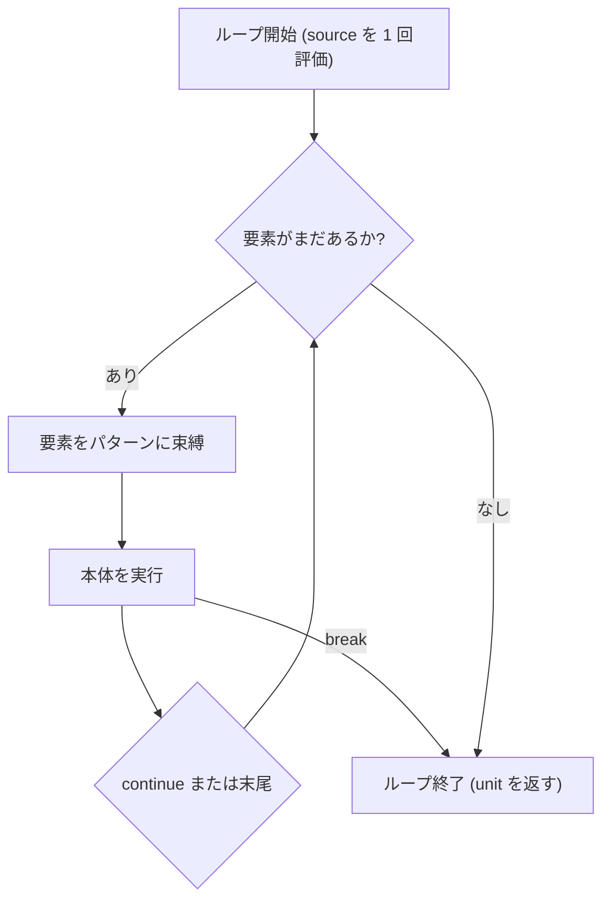

# for...in 式

`for...in` 式は、配列、リスト、`Vec`、文字列、整数範囲、遅延シーケンス（`Seq`）の要素を順番に走査するループです。要素のパターン分解や `break` / `continue` も使え、結果は `()`（`unit`）です。

## この記事のポイント

- 構文は `for パターン in コレクション do 本体` です。本体も式全体も `unit` です。
- 配列、リスト、`Vec`、`string`、`utf8string`、整数範囲、`Seq` を直接反復できます。
- `Map`、`Set`、`HashMap`、`HashSet` やユーザー定義型は、`Module.iter` で `Seq` にしてから反復します。
- 配列、リスト、`Vec`、文字列の走査中はコレクションが共有借用されます。要素のための複製はありません。
- `string` は UTF-16 コード単位（`i16u`）、`utf8string` は UTF-8 バイト（`ubyte`）です。
- `for` のパターンは網羅性検査をしません。不一致は実行時トラップです。
- `break` で抜け、`continue` で次の要素へ進みます。

## 基本の書き方

```text
for pattern in source do
    body
```

`source` 式はループ開始時に 1 回だけ評価されます。各反復で要素が `pattern` に照合され、本体ブロックが実行されます。

```tsuzuri run=60
let numbers = [10, 20, 30]
let mut total = 0

for n in numbers do
    total = total + n

total
```

実行結果:

```text
60
```

ループ全体の評価値、および本体ブロックの型は `unit`（`()`）です。値を集計したい場合は、外側で `let mut` による可変変数を宣言して更新します。



## 反復できるコレクション

Tsuzuri の `for...in` が直接受理するコレクションは以下の通りです。

| コレクション | 列挙される要素 | 要素の型 | 走査の単位 |
| --- | --- | --- | --- |
| 配列 `[T]` | メモリ格納順の要素 | 要素型 `T` | 0 番目から末尾まで |
| 連結リスト `[\|T\|]` | 先頭からの要素 | 要素型 `T` | 先頭ノードから順 |
| `Vec<T>` | インデックス昇順の要素 | 要素型 `T` | 0 番目から末尾まで |
| 整数範囲 `a .. b` | 昇順または降順の整数 | その整数型 | 刻みごと |
| `string` | UTF-16 コード単位 | `i16u` | 16 bit（`.length` と同じ単位） |
| `utf8string` | UTF-8 バイト | `ubyte` | 8 bit のバイト |
| `Seq<'a>` | 遅延列挙される要素 | `'a` | `Seq.next` で 1 つずつ |

### 整数範囲の反復

`start .. finish` およびステップ幅を指定する `start .. step .. finish` を使って、整数範囲を走査できます。

```tsuzuri run=30
let mut sum = 0
for i in 1 .. 4 do
    sum = sum + i * 3
sum
```

実行結果:

```text
30
```

刻みを省くと `1` です。負の刻みにすると降順になります。

```tsuzuri run=28
let mut result = 0
for n in 10 .. -2 .. 4 do
    result = result + n
result
```

実行結果:

```text
28
```

対応するのは 8 bit から 128 bit までの符号付き・符号なし整数です。開始、刻み、終了は同じ型で、この順に 1 回ずつ評価されます。刻みが `0` だと実行時に言語トラップします（`range step is zero`）。終端を越えない値までを列挙し、次の値が型の範囲を外れるとその場で止まります。`125i8 .. 2i8 .. 127i8` は `125` と `127` だけです。

この `..` は `for...in` 専用の列挙構文です。変数に保存すると `E1005`（`a range is an enumerable expression for 'for...in', not a stored value`）になります。浮動小数点の範囲もありません。配列の添字は両端を含むので、`0 .. (words.length - 1)` とします。固定長配列 `[T; N]` も直接は反復できず、`E1005`（`a fixed-length array is not enumerable`）になります。添字の範囲で回して要素を読んでください。

### 文字列の走査（string と utf8string）

文字列の走査は、Unicode スカラー値（文字）単位ではなく、それぞれの型の内部表現単位で行われます。

```tsuzuri run=198
let text = "ABC"
let mut code_sum: i64 = 0

for code in text do
    code_sum = code_sum + code as i64

code_sum
```

実行結果:

```text
198
```

- `string` の走査は **UTF-16 コード単位（`i16u`）** です。
- `utf8string` の走査は **UTF-8 バイト（`ubyte`）** です。

単位は `.length` や添字アクセスと同じです。文字（Unicode スカラー値）単位ではありません。絵文字 `😀` は UTF-16 ではサロゲートペアなので、`string` の反復は 2 回です。

```tsuzuri run=2
let text = "😀"
let mut units = 0

for _code in text do
    units = units + 1

units
```

実行結果:

```text
2
```

`utf8string` は `u8"..."` で書けます。要素は `ubyte` です。

```tsuzuri run=65
let text = u8"A"
let mut total: i64 = 0

for code in text do
    total = total + code as i64

total
```

実行結果:

```text
65
```

## 直接反復と Seq

コンパイラがユーザー定義型の `iter` を暗黙に探すことはありません。直接渡せるのは、前の表の型だけです。`Vec` もその 1 つで、配列と同じように書けます。

```tsuzuri run=60
let values = Vec.push (Vec.push (Vec.empty()) 20) 40
let mut total = 0

for item in values do
    total = total + item

total
```

実行結果:

```text
60
```

`Map`、`Set`、`HashMap`、`HashSet` やレコードなどのユーザー定義型は、`Module.iter` で `Seq` を作ってから渡します。`Vec.iter` も使えますが、こちらは要素そのものではなく `ref 'a` の列です。非 Copy の要素を読み取るだけなら、直接の `for` の方が単純です。

```tsuzuri run=60
let values = Vec.push (Vec.push (Vec.empty()) 20) 40
let mut total = 0

for item in Vec.iter (&values) do
    total = total + deref item

total
```

実行結果:

```text
60
```

`Map` や `Set` も同じ形です。`HashMap` と `HashSet` にも `iter` はありますが、`singleton` はないので `empty` と `insert` で作ります。

```tsuzuri run=42
let m = Map.singleton "answer" 42
let mut result = 0

for (key, value) in Map.iter (&m) do
    if deref key == "answer" then
        result = deref value

result
```

実行結果:

```text
42
```

`iter` を介さず `Map` などを渡すと `E1005` になります。

```text
// コンパイルエラー E1005:
// for...in expects an array, list, string, utf8string, integer range, or Seq;
// call Module.iter explicitly for user-defined types
let scores = Map.singleton "answer" 42
for (key, value) in scores do ()
```

> [!NOTE]
> `Seq<'a>` は non-Copy 型のワンショットな値です。`for...in` で反復すると `Seq` 自身は消費（ムーブ）され、ループ終了後に再利用することはできません（再利用すると `E1012` になります）。

## タプルのパターン分解

ループの `pattern` 部分には、タプルやレコードなどの分解パターンを指定できます。

```tsuzuri run=14
let pairs = [(1, 2), (3, 4)]
let mut total = 0

for (left, right) in pairs do
    total = total + left * right

total
```

実行結果:

```text
14
```

> [!WARNING]
> `for` 式のパターン分解では、コンパイル時の網羅性検査は行われません。もしコレクション内にパターンと合致しない要素が存在した場合、要素をスキップするのではなく実行時に安全にトラップします。条件に一致するものだけを走査したい場合は、本体内で `match` や `if` を使ってください。

## 所有権と借用ルール

配列、リスト、`Vec`、文字列を走査するために、コレクション全体が複製されることはありません。走査中は共有借用です。

- **コレクションの保護**: ループの途中で元の値をムーブしたり、上書きしたり、排他借用したりすると拒否されます。
- **要素**: Copy 型は値が複製されます。非 Copy な要素は読み取り専用ビューで、`item.length` のような読み取りはできますが、所有値として持ち出せません（`E1012`）。`Vec.iter` の要素は `ref 'a` なので、読むときは `deref` します。
- **一時値**: `for x in [1, 2, 3] do ...` のような一時コレクションは、ループが終わるまで生きています。
- **`Seq`**: 共有借用ではなく、所有権を 1 回消費します。ループのあとで同じ変数を使うと `E1012` です。

## break と continue

ループの流れを制御するために、`break` と `continue` が使えます。

```tsuzuri run=12
let mut sum = 0

for n in 1 .. 10 do
    if n % 2 == 1 then
        continue
    if n > 6 then
        break
    sum = sum + n

sum
```

実行結果:

```text
12
```

- `break`: 最も内側のループを直ちに終了します。
- `continue`: 直ちに次の反復ステップへ進みます。整数範囲ループでも終端判定やオーバーフロー検査は正確に維持されます。

`break` と `continue` はともに `unit` 型です。値を返したり、ラベルを指定して外側のループから脱出したりする構文はありません。また、ラムダ式、並行タスク、コンピュテーション式、`finally` を持つ `try` 式の境界を跨いで脱出しようとするとコンパイルエラー `E1023` になります。

## 他の言語との比較

| 機能 | Tsuzuri | F# | Rust | Python |
| --- | --- | --- | --- | --- |
| 構文 | `for x in xs do` | `for x in xs do` | `for x in xs` | `for x in xs:` |
| 戻り値の型 | `unit` | `unit` | `()` | `None` |
| 反復の対象 | 配列・リスト・`Vec`・文字列・範囲・`Seq` は直接。ほかは `Module.iter` | `seq`（`IEnumerable`） | `IntoIterator` | `__iter__` |
| 文字列の列挙 | UTF-16 単位 / UTF-8 バイト | UTF-16 `char` | `chars()` / `bytes()` | Unicode 文字 |
| コレクションの複製 | 配列・リスト・`Vec` は共有借用。`Seq` は消費 | コピーなし | 所有権ムーブまたは借用 | 参照を走査 |

## まとめ

- `for...in` はコレクションを順に走査し、評価値は `unit`（`()`）です。
- 配列、リスト、`Vec`、文字列、整数範囲、`Seq` を直接反復できます。
- `Map`、`Set`、`HashMap`、`HashSet` やユーザー定義型は `Module.iter` で `Seq` にしてから反復します。
- 配列やリスト、`Vec` の走査は共有借用です。`Seq` は消費されます。
- `break` と `continue` で脱出やスキップができます。

## 関連項目

- [for...to 式](for-to.md)
- [while 式](while.md)
- [if 式](if.md)
- [Seq](../built-in-types-and-modules/seq.md)
- [Array](../built-in-types-and-modules/array.md)
- [List](../built-in-types-and-modules/list.md)
- [Vec](../built-in-types-and-modules/vec.md)
- [String](../built-in-types-and-modules/string.md)
- [言語仕様の制御構文](../../../docs/language.md#for--while)
- [言語リファレンスの目次](../index.md)

