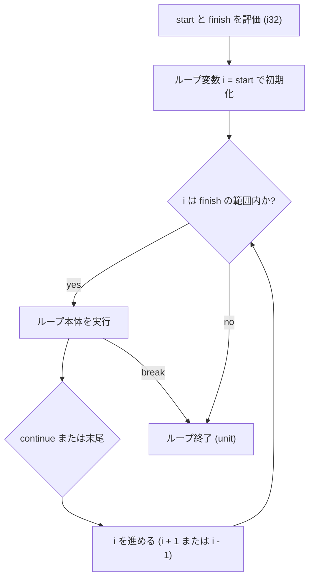

# for...to 式

`for...to` 式および `for...downto` 式は、整数カウンタを使って指定した範囲を順番に走査するループ構文です。開始値から終了値までの両端を含む範囲を昇順または降順で反復し、ループ全体の評価値として `()`（`unit` 型）を返します。

## この記事のポイント

- 昇順は `for i = start to finish do 本体`、降順は `for i = start downto finish do 本体` です。
- ループ変数の型は `i32` です。本体も式全体も `unit` です。
- 範囲は両端（開始値と終了値）を含みます。
- `start` と `finish` は左から右の順に 1 回ずつ評価されます。
- 走査方向に対してすでに空となっている範囲（例: `5 to 1`）では、本体は 1 回も実行されません。
- 終了値が `i32` の最大値や最小値であっても、オーバーフローによる無限ループに陥ることなく安全に停止します。
- `break` と `continue` による制御に対応しています。

## 基本の書き方

```text
for identifier = start to finish do
    body
```

`start` と `finish` は `i32` の式です。ループ変数は、本体の中だけで有効な不変のローカル変数です。代入すると `E1014` になります。本体が `unit` でないと `E1003` です。

```tsuzuri run=55
let mut total: i64 = 0

for i = 1 to 10 do
    total = total + i as i64

total
```

実行結果:

```text
55
```

範囲は両端を含む（inclusive）ため、上記の例では `1` から `10` までの 10 回の反復が行われます。



## downto による降順ループ

値を減らしながらループしたい場合は、`to` の代わりに `downto` キーワードを使います。

```tsuzuri run=15
let mut result: i64 = 0

for n = 5 downto 1 do
    result = result + n as i64

result
```

実行結果:

```text
15
```

`downto` でも開始値と終了値の両端が含まれます。上記の例では `5, 4, 3, 2, 1` の順に 5 回実行されます。

## 空範囲の扱い

走査方向に対してすでに空となっている範囲を指定した場合、ループ本体は 1 回も実行されずに終了します。

```tsuzuri run=0
let mut count = 0

// 昇順ループで開始値が終了値より大きい
for _i = 10 to 1 do
    count = count + 1

// 降順ループで開始値が終了値より小さい
for _i = 1 downto 10 do
    count = count + 1

count
```

実行結果:

```text
0
```

エラーや例外は発生せず、安全にスキップされます。

## 評価順序とオーバーフローの安全性

`start` 式と `finish` 式は、ループの開始前に左から右へ 1 回ずつ評価されます。反復のたびに終了値が再計算されることはありません。

### 境界値とオーバーフロー安全性

C や F# などの言語では、カウンターが最大値に達したときに `+ 1` されてオーバーフローし、無限ループに陥る事故が起きることがあります。

Tsuzuri では、終点に `i32` の最大値（`2147483647`）や最小値（`-2147483648`）が指定されていた場合であっても、最終要素を処理した後に安全にループを終了します。カウンタの数値の折り返しによる無限ループは発生しません。

```tsuzuri run=42
let mut hits = 0

for i = 2147483646 to 2147483647 do
    if i == 2147483647 then
        hits = hits + 1

for i = -2147483647 downto -2147483648 do
    if i == -2147483648 then
        hits = hits + 1

if hits == 2 then 42 else 0
```

実行結果:

```text
42
```

> [!NOTE]
> ループ変数は `i32` 固定です。`for i = 1i64 to 10i64 do ()` は `E1003`（`expected i32, found i64`）になります。`i64` や `u32`、2 以上の刻みで走査するときは、[for...in 式](for-in.md) の整数範囲（`1 .. 2 .. 10`）を使ってください。

## break と continue

`for...to` の中でも `break` と `continue` が使えます。

```tsuzuri run=12
let mut sum: i64 = 0

for i = 1 to 10 do
    if i % 2 == 1 then
        continue
    if i > 6 then
        break
    sum = sum + i as i64

sum
```

実行結果:

```text
12
```

- `continue` は次のカウンタへ進みます。終端の判定は飛ばしません。
- `break` は最も内側のループを抜けます。
- どちらも `unit` です。値付きやラベル付きの脱出はありません。
- ループの外、ラムダ式、タスク、コンピュテーション式、`finally` つき `try` の境界を越えると `E1023` です。

## 他の言語との比較

| 機能 | Tsuzuri | F# | Rust |
| --- | --- | --- | --- |
| 構文 | `for i = a to b do` | `for i = a to b do` | `for i in a..=b` |
| 降順 | `for i = a downto b do` | `for i = a downto b do` | `(b..=a).rev()` |
| ループ変数の型 | `i32` 固定 | 整数型（型推論） | 範囲の型 |
| 両端の扱い | 両端を含む（inclusive） | 両端を含む（inclusive） | `..=` で両端を含む |
| 最大値オーバーフロー | 安全に停止 | 実装・設定により無限ループの恐れ | 安全に停止 |
| `break` / `continue` | 対応 | 標準構文としては非対応 | 対応 |

構文は F# に近いです。違いは、`break` と `continue` が使えることと、`i32` の端でもカウンタの折り返しで無限ループにならないことです。

## まとめ

- `for...to` は `i32` の昇順、`for...downto` は降順で走査します。
- 範囲は開始値と終了値の両方を含みます。
- 方向に対して空の範囲では本体は実行されません。
- 終点が `i32` の最大値・最小値でも、安全に終了し無限ループになりません。
- ループ変数は不変のローカル変数であり、ループ全体の評価値は `unit` です。
- `break` での早期脱出や `continue` でのスキップが可能です。

## 関連項目

- [for...in 式](for-in.md)
- [while 式](while.md)
- [if 式](if.md)
- [基本型](../types-and-type-inference/basic-types.md)
- [言語仕様の制御構文](../../../docs/language.md#for--while)
- [言語リファレンスの目次](../index.md)

